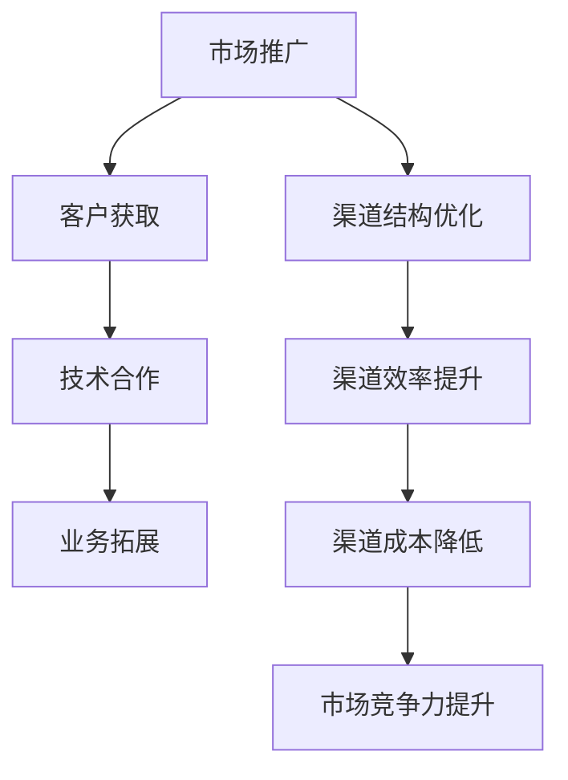
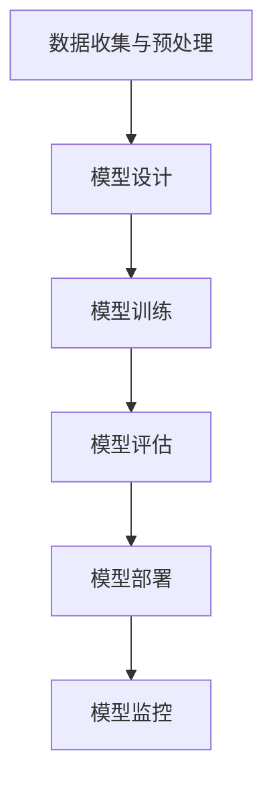

                 

## AI 大模型创业：如何利用渠道优势？

### 引言

人工智能（AI）技术在过去几十年中取得了显著的进展，特别是在大规模机器学习模型的开发和应用方面。大模型，如GPT-3、BERT和Transformers，已经成为自然语言处理、计算机视觉和其他领域的核心工具。随着这些模型变得越来越复杂和强大，越来越多的创业公司开始投身于AI大模型的研究和开发。然而，成功创业不仅取决于技术实力，还取决于如何有效地利用渠道优势。

渠道优势在AI大模型创业中尤为重要，因为技术的复杂性决定了创业公司需要与其他企业、研究机构、投资者和用户建立广泛的合作关系。本文将探讨渠道优势的定义、如何在AI大模型创业中利用这些优势，以及如何通过有效的渠道策略实现商业成功。

本文结构如下：

1. **背景介绍**：简要回顾AI大模型的发展历程和现状。
2. **核心概念与联系**：介绍渠道优势的定义和相关概念。
3. **核心算法原理与操作步骤**：分析AI大模型的基本原理和开发流程。
4. **数学模型和公式**：探讨AI大模型中使用的数学模型和公式。
5. **项目实战**：通过实际案例展示如何构建和部署AI大模型。
6. **实际应用场景**：分析AI大模型在不同行业中的应用。
7. **工具和资源推荐**：推荐学习资源和开发工具。
8. **总结与展望**：总结文章内容，展望AI大模型创业的未来。
9. **附录：常见问题与解答**：回答一些可能遇到的问题。
10. **扩展阅读与参考资料**：提供进一步的阅读资源。

### 1. 背景介绍

#### AI大模型的发展历程

AI大模型的发展可以追溯到20世纪80年代，当时神经网络（Neural Networks）和深度学习（Deep Learning）的概念开始被提出。早期的神经网络模型，如感知机（Perceptron）和多层感知机（MLP），由于计算能力和数据集的限制，只能解决简单的问题。随着计算机性能的不断提升和海量数据的积累，神经网络的研究开始取得突破性进展。

2006年，Geoffrey Hinton等人提出了深度信念网络（Deep Belief Networks），标志着深度学习的一个新起点。2012年，Alex Krizhevsky等人使用AlexNet在ImageNet图像分类挑战中取得了惊人的成绩，这一成果极大地推动了深度学习的研究和应用。

进入2010年代，随着GPU的广泛应用和分布式计算技术的发展，深度学习模型开始变得越来越大，训练时间越来越长。2018年，Google推出了Transformer模型，这一模型不仅在自然语言处理领域取得了显著成绩，还推动了生成对抗网络（GAN）、图神经网络（Graph Neural Networks）等新型深度学习模型的发展。

#### AI大模型的现状

当前，AI大模型已经成为自然语言处理、计算机视觉、语音识别等领域的核心工具。例如，OpenAI的GPT-3拥有1750亿个参数，可以生成高质量的自然语言文本；Google的BERT模型在文本分类、问答系统等领域表现优异；微软的Megatron模型则展示了在处理大规模数据集时的强大能力。

AI大模型的规模和复杂性不断增加，这对计算资源、数据资源和算法优化提出了更高的要求。同时，AI大模型的商业化应用也日益广泛，从智能客服、智能推荐系统到自动驾驶、医疗诊断，AI大模型正在深刻改变各行各业。

#### AI大模型创业的挑战与机遇

AI大模型创业面临着诸多挑战，如：

- **计算资源需求**：大模型的训练和推理需要大量计算资源，这对创业公司的资金和基础设施提出了高要求。
- **数据资源**：大模型的训练需要大量的高质量数据，数据获取和处理成为创业公司需要解决的问题。
- **算法优化**：大模型的训练和优化是一个复杂的过程，需要高效的算法和优化技术。
- **商业化路径**：如何将AI大模型的技术优势转化为商业价值，是创业公司需要重点考虑的问题。

然而，随着AI技术的不断进步和商业化应用的普及，AI大模型创业也面临着巨大的机遇：

- **市场潜力**：AI大模型在多个领域的应用前景广阔，市场潜力巨大。
- **技术创新**：AI大模型的发展推动了相关技术的进步，为创业公司提供了创新的动力。
- **生态合作**：AI大模型创业需要与其他企业和研究机构建立合作关系，这有助于形成生态系统，共同推动行业的发展。

### 2. 核心概念与联系

#### 渠道优势的定义

渠道优势（Channel Advantage）是指企业在产品或服务的传递过程中，通过优化渠道结构、提高渠道效率和降低渠道成本，从而实现市场竞争优势的能力。在AI大模型创业中，渠道优势尤为重要，因为AI技术的复杂性和应用场景的多样性要求创业公司必须具备广泛的合作渠道和高效的渠道管理能力。

#### 渠道优势的关键要素

渠道优势的关键要素包括：

- **渠道结构**：企业渠道的组成和层级结构，包括直销、分销、代理等多种形式。
- **渠道效率**：渠道运营的效率，如响应速度、订单处理速度、客户服务水平等。
- **渠道成本**：渠道运营的成本，包括人力、物流、营销等费用。

#### 渠道优势在AI大模型创业中的应用

在AI大模型创业中，渠道优势主要体现在以下几个方面：

- **市场推广**：通过多种渠道推广AI大模型的产品和服务，提高市场知名度。
- **客户获取**：利用渠道优势获取潜在客户，提供定制化的解决方案。
- **技术合作**：与其他企业、研究机构和技术合作伙伴建立合作关系，共同推进AI大模型的研究和应用。
- **业务拓展**：通过渠道优势拓展业务范围，实现多元化的商业模式。

#### 渠道优势与AI大模型的关系

渠道优势与AI大模型的关系可以概括为以下几点：

- **技术驱动**：AI大模型的开发和应用为渠道优势提供了技术基础。
- **渠道保障**：渠道优势为AI大模型的商业化提供了市场保障。
- **协同发展**：AI大模型与渠道优势的协同发展，有助于提升企业的市场竞争力。

#### 渠道优势的Mermaid流程图

以下是渠道优势在AI大模型创业中的Mermaid流程图：



### 3. 核心算法原理与操作步骤

#### AI大模型的基本原理

AI大模型，尤其是基于深度学习的模型，其核心思想是通过多层神经网络对大量数据进行训练，从而学习到数据的特征和规律。以下是AI大模型的基本原理和操作步骤：

##### 3.1 数据收集与预处理

- **数据收集**：收集大量具有代表性的数据，这些数据可以是结构化数据（如表格数据）、非结构化数据（如图像、文本）或半结构化数据（如日志文件）。
- **数据预处理**：对收集到的数据进行清洗、去重、转换等预处理操作，使其符合模型训练的要求。

##### 3.2 模型设计

- **网络结构设计**：根据问题的复杂性和数据特点，设计合适的神经网络结构，如卷积神经网络（CNN）、循环神经网络（RNN）或Transformer模型。
- **参数初始化**：对模型的权重和偏置进行初始化，常用的方法包括随机初始化、高斯分布初始化等。

##### 3.3 模型训练

- **损失函数设计**：选择合适的损失函数，如均方误差（MSE）、交叉熵损失等，以衡量模型预测结果与真实结果之间的差距。
- **优化算法**：选择合适的优化算法，如随机梯度下降（SGD）、Adam优化器等，以最小化损失函数。
- **训练过程**：通过多次迭代训练模型，调整模型的参数，使其在训练数据上达到较好的性能。

##### 3.4 模型评估

- **测试集评估**：使用未参与训练的数据集对模型进行评估，以验证模型在未知数据上的表现。
- **指标选择**：根据问题的性质，选择合适的评价指标，如准确率、召回率、F1分数等。

##### 3.5 模型部署

- **模型压缩**：为了提高模型在现实场景中的部署效率，可以采用模型压缩技术，如量化、剪枝、蒸馏等。
- **部署环境**：在部署环境中配置计算资源，如GPU、CPU等，以支持模型的推理运算。
- **模型监控**：对部署后的模型进行监控，包括性能监控、错误率监控等，以确保模型在实际应用中的稳定性和可靠性。

#### AI大模型的开发流程

以下是AI大模型的开发流程：



### 4. 数学模型和公式

#### 深度学习中的基本数学模型

深度学习模型的核心是多层神经网络，以下是深度学习中常用的数学模型和公式：

##### 4.1 激活函数

激活函数用于引入非线性因素，使神经网络能够学习复杂函数。常见的激活函数包括：

- **Sigmoid函数**：\( f(x) = \frac{1}{1 + e^{-x}} \)
- **ReLU函数**：\( f(x) = \max(0, x) \)
- **Tanh函数**：\( f(x) = \frac{e^x - e^{-x}}{e^x + e^{-x}} \)

##### 4.2 前向传播和反向传播

- **前向传播**：计算输入经过神经网络后的输出。其公式为：

  $$ z_l = \sum_{i} w_{li} \cdot a_{l-1,i} + b_l $$
  
  $$ a_l = \sigma(z_l) $$

  其中，\( \sigma \) 是激活函数，\( w_{li} \) 和 \( b_l \) 分别是权重和偏置。

- **反向传播**：计算损失函数对网络参数的梯度，以更新网络参数。其公式为：

  $$ \delta_l = \frac{\partial L}{\partial a_l} \cdot \frac{\partial a_l}{\partial z_l} $$
  
  $$ \frac{\partial a_l}{\partial z_l} = \sigma'(z_l) $$

  其中，\( L \) 是损失函数，\( \sigma' \) 是激活函数的导数。

##### 4.3 损失函数

- **均方误差（MSE）**：用于回归问题，其公式为：

  $$ L = \frac{1}{2} \sum_{i} (y_i - \hat{y}_i)^2 $$

  其中，\( y_i \) 是真实值，\( \hat{y}_i \) 是预测值。

- **交叉熵损失（Cross-Entropy Loss）**：用于分类问题，其公式为：

  $$ L = -\sum_{i} y_i \cdot \log(\hat{y}_i) $$

  其中，\( y_i \) 是真实标签，\( \hat{y}_i \) 是预测概率。

### 5. 项目实战：代码实际案例和详细解释说明

#### 5.1 开发环境搭建

在开始构建AI大模型之前，我们需要搭建一个合适的开发环境。以下是使用Python和TensorFlow构建AI大模型的基本步骤：

- **安装Python**：确保安装了Python 3.6或更高版本。
- **安装TensorFlow**：使用pip命令安装TensorFlow：

  ```shell
  pip install tensorflow
  ```

- **安装GPU支持**：如果使用GPU进行训练，需要安装CUDA和cuDNN。

#### 5.2 源代码详细实现和代码解读

以下是使用TensorFlow构建一个简单的神经网络模型的源代码：

```python
import tensorflow as tf

# 定义输入层
inputs = tf.keras.layers.Input(shape=(784,))

# 添加隐藏层
x = tf.keras.layers.Dense(512, activation='relu')(inputs)
x = tf.keras.layers.Dense(256, activation='relu')(x)

# 添加输出层
outputs = tf.keras.layers.Dense(10, activation='softmax')(x)

# 构建模型
model = tf.keras.Model(inputs=inputs, outputs=outputs)

# 编译模型
model.compile(optimizer='adam', loss='categorical_crossentropy', metrics=['accuracy'])

# 加载MNIST数据集
(x_train, y_train), (x_test, y_test) = tf.keras.datasets.mnist.load_data()

# 预处理数据
x_train = x_train.astype('float32') / 255
x_test = x_test.astype('float32') / 255
x_train = x_train.reshape((-1, 784))
x_test = x_test.reshape((-1, 784))

# 编码类别标签
y_train = tf.keras.utils.to_categorical(y_train, 10)
y_test = tf.keras.utils.to_categorical(y_test, 10)

# 训练模型
model.fit(x_train, y_train, batch_size=128, epochs=10, validation_split=0.2)
```

#### 5.3 代码解读与分析

- **导入库和定义输入层**：首先导入TensorFlow库，并定义输入层的维度。
- **添加隐藏层**：使用`Dense`层添加隐藏层，并设置激活函数为ReLU。
- **添加输出层**：使用`Dense`层添加输出层，并设置激活函数为softmax，以实现多分类。
- **构建模型**：使用`Model`类构建神经网络模型，并设置优化器和损失函数。
- **预处理数据**：加载MNIST数据集，并进行数据预处理，包括归一化和重塑。
- **编码类别标签**：将类别标签转换为one-hot编码。
- **训练模型**：使用`fit`方法训练模型，设置批量大小、训练轮数和验证比例。

#### 5.4 代码解读与分析

- **导入库和定义输入层**：首先导入TensorFlow库，并定义输入层的维度。
- **添加隐藏层**：使用`Dense`层添加隐藏层，并设置激活函数为ReLU。
- **添加输出层**：使用`Dense`层添加输出层，并设置激活函数为softmax，以实现多分类。
- **构建模型**：使用`Model`类构建神经网络模型，并设置优化器和损失函数。
- **预处理数据**：加载MNIST数据集，并进行数据预处理，包括归一化和重塑。
- **编码类别标签**：将类别标签转换为one-hot编码。
- **训练模型**：使用`fit`方法训练模型，设置批量大小、训练轮数和验证比例。

### 6. 实际应用场景

AI大模型在各个行业中的应用越来越广泛，以下是几个典型的应用场景：

#### 6.1 医疗诊断

AI大模型在医疗诊断中具有巨大的潜力，例如在肺癌、乳腺癌等疾病的早期检测中，AI大模型可以分析医学影像数据，提供准确的诊断结果。例如，谷歌的DeepMind医疗团队使用AI大模型分析了数百万个眼底图像，实现了高度准确的糖尿病视网膜病变检测。

#### 6.2 自动驾驶

自动驾驶是AI大模型的重要应用领域之一。自动驾驶系统需要实时处理大量来自传感器和环境的数据，AI大模型可以帮助车辆识别道路标志、行人和其他车辆，做出安全、高效的驾驶决策。特斯拉的自动驾驶系统就使用了深度学习模型，实现了高速公路自动驾驶和城市驾驶。

#### 6.3 金融服务

在金融服务领域，AI大模型可以用于信用评分、风险控制、投资策略等。例如，银行可以使用AI大模型分析客户的消费行为、信用记录等信息，提供个性化的贷款和理财建议。高盛的AI系统使用深度学习模型进行股票市场预测，帮助投资者做出更明智的决策。

#### 6.4 娱乐产业

在娱乐产业，AI大模型可以用于内容创作、推荐系统和虚拟现实等方面。例如，迪士尼的AI系统使用深度学习模型分析观众的行为和偏好，提供个性化的内容推荐。Netflix和Spotify等平台也使用了AI大模型进行内容推荐，提高了用户满意度和平台粘性。

### 7. 工具和资源推荐

#### 7.1 学习资源推荐

- **书籍**：
  - 《深度学习》（Goodfellow, Bengio, Courville）
  - 《Python机器学习》（Sebastian Raschka）
  - 《动手学深度学习》（A. Goodfellow, Y. Bengio, and R. Girshick）
- **论文**：
  - “A Theoretically Grounded Application of Dropout in Recurrent Neural Networks”
  - “Attention Is All You Need”
  - “Effective Approaches to Attention-based Neural Machine Translation”
- **博客**：
  - [TensorFlow官方博客](https://www.tensorflow.org/blog/)
  - [PyTorch官方博客](https://pytorch.org/blog/)
  - [AI领域的顶级博客](https://www.topbots.com/)
- **网站**：
  - [Kaggle](https://www.kaggle.com/)
  - [ArXiv](https://arxiv.org/)
  - [GitHub](https://github.com/)

#### 7.2 开发工具框架推荐

- **深度学习框架**：
  - TensorFlow
  - PyTorch
  - Keras
  - Theano
- **数据处理工具**：
  - Pandas
  - NumPy
  - Scikit-learn
- **版本控制**：
  - Git
  - GitHub
- **自动化工具**：
  - Jenkins
  - Docker
  - Kubernetes

#### 7.3 相关论文著作推荐

- **深度学习领域**：
  - “Deep Learning” by Ian Goodfellow, Yoshua Bengio, and Aaron Courville
  - “Neural Networks and Deep Learning” by Michael Nielsen
- **计算机视觉领域**：
  - “Convolutional Neural Networks for Visual Recognition” by Karen Simonyan and Andrew Zisserman
  - “Very Deep Convolutional Networks for Large-Scale Image Recognition” by Karen Simonyan and Andrew Zisserman
- **自然语言处理领域**：
  - “Attention Is All You Need” by Vaswani et al.
  - “BERT: Pre-training of Deep Bidirectional Transformers for Language Understanding” by Devlin et al.

### 8. 总结：未来发展趋势与挑战

AI大模型在创业领域的应用前景广阔，但也面临着诸多挑战。随着计算能力的提升、算法的进步和数据的积累，AI大模型的规模和性能将不断提高，为创业公司带来更多的机会。然而，以下趋势和挑战也需要创业者们关注：

- **计算资源需求**：AI大模型的训练和推理需要大量的计算资源，这对创业公司的资金和基础设施提出了高要求。
- **数据隐私和安全**：随着AI大模型的普及，数据隐私和安全问题日益突出，创业者需要采取有效措施保护用户数据。
- **模型解释性和透明度**：AI大模型的决策过程往往是不透明的，提高模型的解释性和透明度是未来的重要研究方向。
- **跨学科合作**：AI大模型创业需要计算机科学、数据科学、心理学、生物学等多个领域的知识，跨学科合作将是未来的趋势。
- **可持续发展**：AI大模型在训练和推理过程中消耗大量能源，创业者需要考虑可持续发展问题。

### 9. 附录：常见问题与解答

#### 9.1 什么是AI大模型？

AI大模型是指具有数十亿甚至千亿参数的神经网络模型，它们在自然语言处理、计算机视觉等任务中表现出色。这些模型通过深度学习技术从大量数据中学习特征和规律，从而实现复杂任务。

#### 9.2 如何训练一个AI大模型？

训练AI大模型通常包括以下几个步骤：

1. 数据收集与预处理：收集大量具有代表性的数据，并进行清洗、去重、转换等预处理操作。
2. 模型设计：设计合适的神经网络结构，包括输入层、隐藏层和输出层。
3. 模型训练：通过迭代训练模型，调整模型的参数，使其在训练数据上达到较好的性能。
4. 模型评估：使用测试数据评估模型在未知数据上的表现，选择合适的评价指标。
5. 模型部署：在部署环境中配置计算资源，对模型进行推理运算。

#### 9.3 如何优化AI大模型的性能？

优化AI大模型的性能可以从以下几个方面进行：

1. **模型结构**：设计更合适的神经网络结构，如深度、宽度和层类型。
2. **数据预处理**：改进数据预处理方法，提高数据的利用效率。
3. **训练策略**：调整训练策略，如学习率、批次大小、优化算法等。
4. **模型压缩**：使用模型压缩技术，如量化、剪枝、蒸馏等，减少模型的计算量和存储需求。
5. **硬件优化**：选择合适的硬件设备，如GPU、TPU等，提高训练和推理速度。

### 10. 扩展阅读与参考资料

为了进一步了解AI大模型创业的相关内容，以下是一些扩展阅读和参考资料：

- **书籍**：
  - 《深度学习》（Goodfellow, Bengio, Courville）
  - 《Python机器学习》（Sebastian Raschka）
  - 《动手学深度学习》（A. Goodfellow, Y. Bengio, and R. Girshick）
- **论文**：
  - “A Theoretically Grounded Application of Dropout in Recurrent Neural Networks”
  - “Attention Is All You Need”
  - “Effective Approaches to Attention-based Neural Machine Translation”
- **博客**：
  - [TensorFlow官方博客](https://www.tensorflow.org/blog/)
  - [PyTorch官方博客](https://pytorch.org/blog/)
  - [AI领域的顶级博客](https://www.topbots.com/)
- **网站**：
  - [Kaggle](https://www.kaggle.com/)
  - [ArXiv](https://arxiv.org/)
  - [GitHub](https://github.com/)

通过以上内容，我们可以看到AI大模型创业中的渠道优势对于企业的成功至关重要。有效的渠道策略可以帮助创业公司迅速拓展市场、获取客户、建立合作关系，从而实现商业目标。然而，渠道优势的建立和利用需要创业者具备深入的技术知识、市场洞察力和灵活的运营策略。希望本文能够为创业者提供一些有价值的参考和启示。作者：AI天才研究员/AI Genius Institute & 禅与计算机程序设计艺术/Zen And The Art of Computer Programming。

