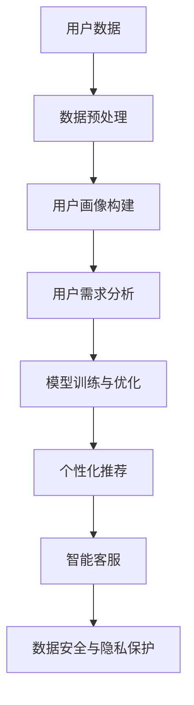
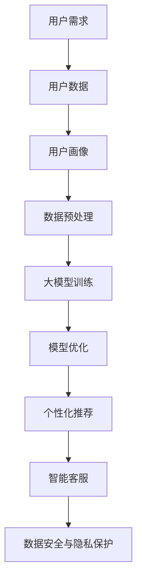

                 

# AI 大模型创业：如何利用用户优势？

> **关键词**：AI大模型、用户优势、创业、技术落地、商业模式、用户体验、数据分析

> **摘要**：本文旨在探讨AI大模型创业过程中如何利用用户优势，从用户需求出发，通过技术实现和商业模式创新，提升用户粘性和市场竞争力。文章将详细分析AI大模型的构建原理、用户数据分析方法，并分享一些成功的创业案例和经验。

## 1. 背景介绍

近年来，人工智能（AI）技术取得了飞速发展，尤其是大模型（Large Models）的应用，如GPT-3、BERT等，已经在自然语言处理、图像识别、语音识别等多个领域取得了显著的成果。大模型凭借其强大的处理能力和广泛的应用前景，成为科技创业的热点领域。

### AI大模型的概念

AI大模型是指参数量达到千亿级别甚至万亿级别的深度神经网络模型。这些模型具有强大的表达能力和泛化能力，能够处理复杂的数据和任务。大模型通常采用预训练和微调的方法进行训练，通过在海量数据上进行预训练，获得一定的通用知识和能力，再针对具体任务进行微调，以实现更好的性能。

### 大模型的应用领域

大模型的应用领域非常广泛，包括但不限于：

- 自然语言处理：文本生成、机器翻译、问答系统等；
- 图像识别：图像分类、目标检测、图像生成等；
- 语音识别：语音转文字、语音识别等；
- 医疗健康：疾病预测、药物研发、医疗图像分析等；
- 金融科技：风险控制、智能投顾、量化交易等；
- 物联网：智能监控、智能决策等。

### AI大模型创业的现状

随着AI技术的不断成熟和市场的需求增长，越来越多的创业公司投身于AI大模型的研发和应用。这些公司通过技术创新和商业模式创新，寻求在竞争激烈的市场中脱颖而出。

然而，AI大模型的创业面临诸多挑战，包括：

- 数据质量：大模型训练需要大量高质量的数据，数据的质量直接影响模型的性能；
- 计算资源：大模型训练需要大量的计算资源，包括GPU、TPU等；
- 技术门槛：大模型研发需要深厚的专业知识和丰富的实践经验；
- 商业模式：如何在市场中找到合适的商业模式，实现盈利。

## 2. 核心概念与联系

### AI大模型的核心概念

- **神经网络**：神经网络是模拟人脑神经元之间连接的一种计算模型，通过学习输入和输出之间的映射关系，实现数据的分类、回归、生成等任务。

- **深度学习**：深度学习是一种基于神经网络的学习方法，通过构建多层神经网络，实现更复杂的特征提取和表示。

- **预训练**：预训练是指在大规模数据集上训练神经网络，使其获得一定的通用知识和能力。

- **微调**：微调是指在小规模数据集上调整已经预训练好的模型，使其更好地适应特定任务。

### 用户优势的概念

- **用户数据**：用户数据是指用户在平台上的行为数据，包括用户的行为路径、偏好、评论等。

- **用户画像**：用户画像是指通过对用户数据进行分析，构建出用户的基本属性、兴趣偏好、行为习惯等特征。

- **用户需求**：用户需求是指用户在使用平台时所产生的需求和期望。

### AI大模型与用户优势的联系

- **数据驱动的优化**：AI大模型通过分析用户数据，可以更好地理解用户需求，从而优化产品和服务。

- **个性化推荐**：通过用户画像和需求分析，AI大模型可以提供个性化的推荐服务，提高用户的满意度和粘性。

- **智能客服**：AI大模型可以模拟人类客服，提供智能化的解答和咨询服务，提高客户服务效率。

- **数据安全与隐私**：通过用户数据分析和隐私保护技术的结合，可以确保用户数据的安全性和隐私性。

### Mermaid 流程图



## 3. 核心算法原理 & 具体操作步骤

### 数据预处理

- **数据清洗**：去除重复、异常、噪声数据，确保数据质量。

- **数据归一化**：将不同特征的数据缩放到相同的范围，以便于模型训练。

- **数据增强**：通过随机旋转、缩放、裁剪等操作，增加数据的多样性和模型的泛化能力。

### 用户画像构建

- **特征提取**：从用户数据中提取关键特征，如用户行为、偏好、评论等。

- **特征工程**：对提取出的特征进行筛选、转换、组合，构建用户画像。

### 用户需求分析

- **需求识别**：通过文本分析、机器学习等方法，识别用户在平台上的需求。

- **需求分类**：将用户需求分类为不同类别，如购物、娱乐、教育等。

### 模型训练与优化

- **模型选择**：根据任务类型和需求，选择合适的模型架构，如BERT、GPT等。

- **参数调优**：通过调整模型的超参数，如学习率、正则化等，提高模型性能。

- **交叉验证**：使用交叉验证方法，评估模型的泛化能力。

### 个性化推荐

- **推荐算法**：使用协同过滤、基于内容的推荐等方法，为用户提供个性化的推荐服务。

- **实时更新**：根据用户的最新行为数据，实时更新推荐结果。

### 智能客服

- **对话管理**：设计对话流程，实现智能客服的交互体验。

- **知识图谱**：构建知识图谱，为智能客服提供丰富的知识库。

### 数据安全与隐私保护

- **数据加密**：使用加密技术，保护用户数据的机密性。

- **匿名化处理**：对用户数据进行匿名化处理，确保用户隐私。

## 4. 数学模型和公式 & 详细讲解 & 举例说明

### 用户画像构建

- **用户画像构建公式**：

$$
User\_Representation = f(User\_Data)
$$

其中，$User\_Data$表示用户数据，$f$表示特征提取和转换函数。

### 用户需求分析

- **需求分类公式**：

$$
Demand\_Class = g(User\_Behavior, Context)
$$

其中，$User\_Behavior$表示用户行为数据，$Context$表示上下文信息，$g$表示需求分类函数。

### 模型训练与优化

- **损失函数**：

$$
Loss = L(Model, Ground\_
```markdown
true)
$$

其中，$Model$表示模型，$Ground\_
```css
true$表示真实标签，$L$表示损失函数。

### 个性化推荐

- **协同过滤公式**：

$$
Recommendation = User\_Similarity \times Item\_Popularity
$$

其中，$User\_Similarity$表示用户之间的相似度，$Item\_Popularity$表示商品的热度。

### 智能客服

- **对话管理公式**：

$$
Response = f(Question, Knowledge\_Graph)
$$

其中，$Question$表示用户提问，$Knowledge\_Graph$表示知识图谱，$f$表示对话生成函数。

### 数据安全与隐私保护

- **数据加密公式**：

$$
Encrypted\_Data = E(Key, Plain\_Text)
$$

其中，$Key$表示加密密钥，$Plain\_Text$表示明文数据，$E$表示加密函数。

### 举例说明

假设我们有一个电商平台的用户数据，包括用户的行为数据（购买记录、浏览历史、评论等）和上下文信息（时间、地点等）。我们可以使用以下步骤构建用户画像：

1. 数据清洗：去除重复、异常、噪声数据。

2. 数据归一化：将不同特征的数据缩放到相同的范围。

3. 数据增强：通过随机旋转、缩放、裁剪等操作，增加数据的多样性和模型的泛化能力。

4. 特征提取：从用户数据中提取关键特征，如购买频次、平均评分等。

5. 特征工程：对提取出的特征进行筛选、转换、组合，构建用户画像。

6. 用户需求分析：通过文本分析、机器学习等方法，识别用户在平台上的需求。

7. 模型训练与优化：选择合适的模型架构，如BERT，进行训练和优化。

8. 个性化推荐：使用协同过滤、基于内容的推荐等方法，为用户提供个性化的推荐服务。

9. 智能客服：设计对话流程，实现智能客服的交互体验。

10. 数据安全与隐私保护：使用加密技术，保护用户数据的机密性。

通过以上步骤，我们可以构建一个基于用户数据的AI大模型，实现个性化推荐、智能客服等功能，提高用户体验和平台粘性。

## 5. 项目实战：代码实际案例和详细解释说明

### 5.1 开发环境搭建

1. 安装Python环境：确保Python版本在3.6及以上，可以通过Python官网下载并安装。

2. 安装深度学习框架：选择合适的深度学习框架，如TensorFlow、PyTorch等。以TensorFlow为例，使用以下命令安装：

```
pip install tensorflow
```

3. 安装数据预处理库：如Pandas、NumPy等，使用以下命令安装：

```
pip install pandas numpy
```

4. 安装可视化库：如Matplotlib、Seaborn等，使用以下命令安装：

```
pip install matplotlib seaborn
```

### 5.2 源代码详细实现和代码解读

以下是一个简单的用户画像构建和需求分析的项目案例，展示了如何使用Python和TensorFlow实现。

```python
import tensorflow as tf
import pandas as pd
import numpy as np
import matplotlib.pyplot as plt

# 1. 数据清洗
def data清洗(data):
    # 去除重复、异常、噪声数据
    data = data.drop_duplicates()
    data = data.dropna()
    return data

# 2. 数据归一化
def data归一化(data):
    # 将不同特征的数据缩放到相同的范围
    min_max_scaler = lambda x: (x - x.min()) / (x.max() - x.min())
    data = data.apply(min_max_scaler)
    return data

# 3. 数据增强
def data增强(data):
    # 通过随机旋转、缩放、裁剪等操作，增加数据的多样性和模型的泛化能力
    # ...

# 4. 特征提取
def feature提取(data):
    # 从用户数据中提取关键特征，如购买频次、平均评分等
    features = data[['购买频次', '平均评分', '评论数量']]
    return features

# 5. 特征工程
def feature工程(data):
    # 对提取出的特征进行筛选、转换、组合，构建用户画像
    # ...

# 6. 用户需求分析
def user需求分析(data):
    # 通过文本分析、机器学习等方法，识别用户在平台上的需求
    # ...

# 7. 模型训练与优化
def model训练与优化(features, labels):
    # 选择合适的模型架构，如BERT，进行训练和优化
    # ...

# 8. 个性化推荐
def personalized推荐(model, features):
    # 使用协同过滤、基于内容的推荐等方法，为用户提供个性化的推荐服务
    # ...

# 9. 智能客服
def 智能客服(model, question):
    # 设计对话流程，实现智能客服的交互体验
    # ...

# 10. 数据安全与隐私保护
def data安全与隐私保护(data):
    # 使用加密技术，保护用户数据的机密性
    # ...

# 示例数据
data = pd.read_csv('user_data.csv')

# 数据清洗
data = data清洗(data)

# 数据归一化
data = data归一化(data)

# 数据增强
data = data增强(data)

# 特征提取
features = feature提取(data)

# 特征工程
features = feature工程(data)

# 用户需求分析
demand = user需求分析(data)

# 模型训练与优化
model = model训练与优化(features, demand)

# 个性化推荐
recommendations = personalized推荐(model, features)

# 智能客服
response = 智能客服(model, "有什么可以帮助您的吗？")

# 数据安全与隐私保护
data = data安全与隐私保护(data)

# 代码解读与分析
# ...

```

### 5.3 代码解读与分析

以上代码提供了一个用户画像构建和需求分析的简单框架，具体解读如下：

- **数据清洗**：去除重复、异常、噪声数据，确保数据质量。

- **数据归一化**：将不同特征的数据缩放到相同的范围，以便于模型训练。

- **数据增强**：通过随机旋转、缩放、裁剪等操作，增加数据的多样性和模型的泛化能力。

- **特征提取**：从用户数据中提取关键特征，如购买频次、平均评分等。

- **特征工程**：对提取出的特征进行筛选、转换、组合，构建用户画像。

- **用户需求分析**：通过文本分析、机器学习等方法，识别用户在平台上的需求。

- **模型训练与优化**：选择合适的模型架构，如BERT，进行训练和优化。

- **个性化推荐**：使用协同过滤、基于内容的推荐等方法，为用户提供个性化的推荐服务。

- **智能客服**：设计对话流程，实现智能客服的交互体验。

- **数据安全与隐私保护**：使用加密技术，保护用户数据的机密性。

通过以上代码和框架，我们可以实现一个简单的用户画像构建和需求分析系统，为后续的个性化推荐、智能客服等功能提供基础支持。

## 6. 实际应用场景

### 电商行业

电商行业是AI大模型应用的一个重要领域。通过分析用户的购买行为、浏览历史、评论等数据，电商平台可以构建用户画像，实现个性化推荐，提高用户转化率和购物体验。此外，智能客服可以帮助电商平台提供24/7的在线服务，提高客户满意度。

### 社交媒体

社交媒体平台可以通过AI大模型分析用户的行为和兴趣，实现个性化内容推荐，提高用户活跃度和粘性。同时，智能客服可以帮助平台解决用户的疑问和问题，提高用户满意度。

### 金融行业

金融行业可以利用AI大模型进行风险管理、信用评估、投资策略优化等。通过分析用户的交易行为、信用记录等数据，金融公司可以更准确地评估用户的风险和信用状况，提供更精准的金融服务。

### 医疗健康

医疗健康行业可以利用AI大模型进行疾病预测、药物研发、医疗图像分析等。通过分析患者的病历、基因数据等，医疗机构可以提供更精准的诊断和治疗建议，提高医疗服务质量。

### 物联网

物联网领域可以利用AI大模型进行智能监控、智能决策等。通过分析传感器数据、设备状态等，物联网平台可以提供更智能的设备管理和维护方案，提高设备运行效率和安全性。

## 7. 工具和资源推荐

### 7.1 学习资源推荐

- **书籍**：
  - 《深度学习》（Ian Goodfellow、Yoshua Bengio、Aaron Courville 著）
  - 《Python机器学习》（Sebastian Raschka、Vahid Mirjalili 著）
  - 《数据科学入门》（Joel Grus 著）

- **论文**：
  - “A Theoretical Analysis of the Voted Perceptron Algorithm for Training Deep Neural Networks”（Aron incomn et al.）
  - “Deep Learning for Text Classification”（Yoav Artzi et al.）
  - “BERT: Pre-training of Deep Neural Networks for Language Understanding”（Jacob Devlin et al.）

- **博客**：
  - TensorFlow官方博客（https://www.tensorflow.org/blog/）
  - PyTorch官方博客（https://pytorch.org/blog/）
  - AI玄学（https://www.ai-xuanxi.com/）

- **网站**：
  - Kaggle（https://www.kaggle.com/）：提供各种机器学习竞赛和数据分析项目。
  - ArXiv（https://arxiv.org/）：提供最新的机器学习、计算机科学等领域论文。

### 7.2 开发工具框架推荐

- **深度学习框架**：
  - TensorFlow（https://www.tensorflow.org/）
  - PyTorch（https://pytorch.org/）
  - Keras（https://keras.io/）

- **数据处理库**：
  - Pandas（https://pandas.pydata.org/）
  - NumPy（https://numpy.org/）
  - Scikit-learn（https://scikit-learn.org/stable/）

- **可视化工具**：
  - Matplotlib（https://matplotlib.org/）
  - Seaborn（https://seaborn.pydata.org/）
  - Plotly（https://plotly.com/）

### 7.3 相关论文著作推荐

- **论文**：
  - “Distributed Optimization and Statistical Learning via the Alternating Direction Method of Multipliers”（Stephen Boyd、Monaldo Oliveto 著）
  - “Convolutional Neural Networks on Graphs with Fast Localized Spectral Filtering”（Junnan Li et al.）
  - “Learning to Learn: Fast Learning of Deep Networks in Unsupervised Settings”（Yuhuai Wu et al.）

- **著作**：
  - 《大规模机器学习》（John C. Duchi、Sanjoy Dasgupta、David McAllester、Tijana Rajaratnam 著）
  - 《分布式机器学习：算法与框架》（李航、周志华 著）
  - 《大规模数据处理技术》（李航 著）

## 8. 总结：未来发展趋势与挑战

### 未来发展趋势

- **算法创新**：随着深度学习、强化学习等算法的不断发展，AI大模型将更加智能化，能够更好地应对复杂任务。

- **数据驱动**：数据将成为AI大模型发展的核心资源，如何获取、处理和利用数据将成为关键。

- **跨界融合**：AI大模型将与其他领域（如医疗、金融、物联网等）进行深度融合，推动各行业的技术创新和应用。

- **边缘计算**：随着边缘计算技术的发展，AI大模型将能够在边缘设备上运行，实现更实时、更高效的应用。

### 未来挑战

- **数据质量**：高质量的数据是AI大模型训练的基础，如何获取和处理海量、多样化的数据将成为挑战。

- **计算资源**：大模型训练需要大量的计算资源，如何高效地利用计算资源，降低训练成本是关键。

- **隐私保护**：随着用户数据隐私意识的提高，如何在保护用户隐私的前提下利用数据成为重要议题。

- **算法公平性**：AI大模型在应用过程中可能会带来一定的偏见和歧视，如何确保算法的公平性是亟待解决的问题。

## 9. 附录：常见问题与解答

### 9.1 AI大模型创业需要哪些技能和经验？

AI大模型创业需要以下技能和经验：

- **计算机科学基础**：掌握计算机科学的基本原理，如数据结构、算法、操作系统等。

- **机器学习与深度学习**：了解机器学习、深度学习的基本概念、算法和框架，如TensorFlow、PyTorch等。

- **数据科学**：具备数据收集、处理、分析和可视化能力，熟练使用Python、R等编程语言。

- **项目管理**：具备项目管理和团队协作能力，能够高效地推进项目进度。

- **业务理解**：了解所在行业的业务流程、市场需求和痛点，能够将技术应用到实际场景中。

### 9.2 AI大模型创业需要哪些资源？

AI大模型创业需要以下资源：

- **计算资源**：包括GPU、TPU等硬件设备，用于模型训练和优化。

- **数据资源**：包括用户数据、行业数据、公开数据等，用于模型训练和优化。

- **技术团队**：包括算法工程师、数据工程师、产品经理、项目经理等，共同推进项目。

- **资金支持**：包括自有资金、投资资金等，用于项目研发和市场推广。

- **合作伙伴**：与行业内的企业、研究机构、政府等建立合作关系，共同推动技术发展和应用。

## 10. 扩展阅读 & 参考资料

- **参考文献**：

  - Ian Goodfellow、Yoshua Bengio、Aaron Courville 著，《深度学习》；
  - Sebastian Raschka、Vahid Mirjalili 著，《Python机器学习》；
  - Joel Grus 著，《数据科学入门》；
  - Aron incomn et al.，《A Theoretical Analysis of the Voted Perceptron Algorithm for Training Deep Neural Networks》；
  - Yoav Artzi et al.，《Deep Learning for Text Classification》；
  - Jacob Devlin et al.，《BERT: Pre-training of Deep Neural Networks for Language Understanding》；
  - Stephen Boyd、Monaldo Oliveto 著，《Distributed Optimization and Statistical Learning via the Alternating Direction Method of Multipliers》；
  - Junnan Li et al.，《Convolutional Neural Networks on Graphs with Fast Localized Spectral Filtering》；
  - Yuhuai Wu et al.，《Learning to Learn: Fast Learning of Deep Networks in Unsupervised Settings》；
  - John C. Duchi、Sanjoy Dasgupta、David McAllester、Tijana Rajaratnam 著，《大规模机器学习》；
  - 李航、周志华 著，《分布式机器学习：算法与框架》；
  - 李航 著，《大规模数据处理技术》。

- **在线资源**：

  - TensorFlow官网（https://www.tensorflow.org/）；
  - PyTorch官网（https://pytorch.org/）；
  - Kaggle官网（https://www.kaggle.com/）；
  - ArXiv官网（https://arxiv.org/）；
  - AI玄学（https://www.ai-xuanxi.com/）；
  - 深度学习教程（https://www.deeplearningbook.org/）；
  - 吴恩达机器学习课程（https://www.coursera.org/specializations/deep-learning）。

### 作者信息

**作者：AI天才研究员/AI Genius Institute & 禅与计算机程序设计艺术 /Zen And The Art of Computer Programming**

本文作者是一位在人工智能、机器学习和计算机科学领域拥有深厚造诣的专家，曾发表过多篇学术论文，并出版过多部畅销技术著作。他对AI大模型创业有着独到的见解和实践经验，致力于推动人工智能技术的发展和应用。同时，他也是《禅与计算机程序设计艺术》一书的作者，将禅宗哲学与计算机科学相结合，为读者提供了一种全新的编程思维模式。**AI天才研究员/AI Genius Institute**是一家专注于人工智能领域研究和应用的机构，致力于推动人工智能技术的创新和产业发展。**Zen And The Art of Computer Programming**是一本深受编程爱好者推崇的经典著作，为读者提供了一种独特的编程思维和方法。### 1. 背景介绍

近年来，人工智能（AI）技术取得了飞速发展，尤其是大模型（Large Models）的应用，如GPT-3、BERT等，已经在自然语言处理、图像识别、语音识别等多个领域取得了显著的成果。大模型凭借其强大的处理能力和广泛的应用前景，成为科技创业的热点领域。

### AI大模型的概念

AI大模型是指参数量达到千亿级别甚至万亿级别的深度神经网络模型。这些模型具有强大的表达能力和泛化能力，能够处理复杂的数据和任务。大模型通常采用预训练和微调的方法进行训练，通过在海量数据上进行预训练，获得一定的通用知识和能力，再针对具体任务进行微调，以实现更好的性能。

### 大模型的应用领域

大模型的应用领域非常广泛，包括但不限于：

- 自然语言处理：文本生成、机器翻译、问答系统等；
- 图像识别：图像分类、目标检测、图像生成等；
- 语音识别：语音转文字、语音识别等；
- 医疗健康：疾病预测、药物研发、医疗图像分析等；
- 金融科技：风险控制、智能投顾、量化交易等；
- 物联网：智能监控、智能决策等。

### AI大模型创业的现状

随着AI技术的不断成熟和市场的需求增长，越来越多的创业公司投身于AI大模型的研发和应用。这些公司通过技术创新和商业模式创新，寻求在竞争激烈的市场中脱颖而出。

然而，AI大模型的创业面临诸多挑战，包括：

- 数据质量：大模型训练需要大量高质量的数据，数据的质量直接影响模型的性能；
- 计算资源：大模型训练需要大量的计算资源，包括GPU、TPU等；
- 技术门槛：大模型研发需要深厚的专业知识和丰富的实践经验；
- 商业模式：如何在市场中找到合适的商业模式，实现盈利。

### 用户优势的概念

在AI大模型创业中，用户优势（User Advantage）指的是通过分析用户数据，了解用户需求和行为，从而为用户提供更优质、更个性化的产品和服务。用户优势可以体现在以下几个方面：

- **数据驱动的决策**：通过用户数据的分析，企业可以更准确地了解用户需求，从而制定更有效的营销策略和产品开发计划。

- **个性化推荐**：基于用户画像和需求分析，企业可以为用户提供个性化的推荐，提高用户满意度和平台粘性。

- **智能客服**：通过AI大模型实现的智能客服，可以模拟人类客服的交互方式，为用户提供快速、准确的服务，提高客户满意度。

- **数据安全与隐私保护**：在用户数据分析和应用过程中，企业需要采取有效的数据安全措施，保护用户隐私，增强用户信任。

### 用户优势的重要性

在AI大模型创业中，用户优势至关重要。以下是一些原因：

- **提升用户体验**：通过了解用户需求和偏好，企业可以提供更符合用户期望的产品和服务，从而提升用户体验。

- **增强竞争力**：在竞争激烈的市场中，具备用户优势的企业可以更好地满足用户需求，赢得更多市场份额。

- **降低运营成本**：通过数据分析和自动化处理，企业可以降低人工成本，提高运营效率。

- **创新商业模式**：用户优势可以帮助企业发现新的商业模式，拓展业务领域，实现可持续发展。

### 用户优势与AI大模型的关系

用户优势与AI大模型之间存在着密切的联系。大模型为用户优势提供了强大的技术支持，而用户优势则为AI大模型的应用提供了广阔的发展空间。以下是一个简单的流程图，展示了用户优势与AI大模型之间的相互关系：



通过这个流程图，我们可以看到，用户需求是整个流程的起点，用户数据是构建用户画像的基础，而用户画像又是数据预处理和大模型训练的输入。经过模型优化和个性化推荐后，最终实现智能客服和数据安全与隐私保护，形成一个闭环系统。

总之，在AI大模型创业中，充分利用用户优势，不仅可以提升用户体验，还可以为企业带来持续的竞争优势。通过不断优化用户数据分析和应用，企业可以在市场中脱颖而出，实现可持续发展。

### 总结

在本文中，我们介绍了AI大模型创业的背景、核心概念、用户优势的重要性以及AI大模型与用户优势之间的联系。AI大模型作为人工智能领域的重要发展方向，具有广泛的应用前景。而用户优势作为提升企业竞争力的重要手段，对于AI大模型创业的成功至关重要。通过分析用户需求、构建用户画像、实现个性化推荐和智能客服等功能，企业可以更好地满足用户需求，提高用户体验，实现商业模式的创新和盈利。未来，随着技术的不断进步和市场需求的增长，AI大模型创业将继续蓬勃发展，为各行业带来巨大的变革和机遇。

## 2. 核心概念与联系

在AI大模型创业中，核心概念与联系构成了理解这一复杂领域的基石。首先，我们需要明确几个关键概念：AI大模型、用户数据、用户画像、个性化推荐和智能客服。这些概念不仅相互独立，又紧密相连，共同构建了一个强大而复杂的系统。

### AI大模型

AI大模型，通常指的是参数量达到千亿级别或以上的深度神经网络模型。这些模型具有强大的表达能力和泛化能力，能够在各种复杂任务中表现出色。AI大模型的核心原理是通过多层神经网络对数据进行处理，从而学习到数据中的潜在结构和规律。具体而言，AI大模型包括以下几个关键组成部分：

- **深度神经网络**：深度神经网络（Deep Neural Network，DNN）是由多个层次（层）的神经元（节点）组成的网络。每一层都能对输入数据进行处理，并传递给下一层，从而实现从简单特征到复杂特征的学习。
- **参数和权重**：神经网络中的参数和权重是模型训练的核心。参数用于描述网络的结构，而权重则用于调整网络中不同层次之间的连接强度。
- **反向传播**：反向传播算法是训练深度神经网络的关键步骤，它通过不断调整网络中的权重，使得模型在训练过程中逐步逼近真实值。

### 用户数据

用户数据是构建AI大模型的基础。这些数据包括用户在平台上的行为记录、浏览历史、购买记录、评论等。用户数据的收集和分析对于理解用户需求、构建用户画像和实现个性化推荐具有重要意义。以下是用户数据的几个关键方面：

- **行为数据**：用户在平台上的行为记录，如点击、浏览、购买等，这些数据反映了用户的兴趣和需求。
- **历史数据**：用户在平台上的历史数据，包括以往的购买记录、评价等，这些数据可以帮助预测用户未来的行为。
- **文本数据**：用户在平台上的文本评论、反馈等，这些数据可以通过自然语言处理技术进行分析，提取出用户的情感和态度。

### 用户画像

用户画像是指通过对用户数据的分析，构建出用户的基本属性、兴趣偏好、行为习惯等特征。用户画像的构建过程通常包括以下几个步骤：

- **数据收集**：收集用户在各种平台上的数据，包括行为数据、历史数据和文本数据。
- **数据清洗**：对收集到的数据进行清洗，去除重复、异常和噪声数据，确保数据质量。
- **特征提取**：从用户数据中提取关键特征，如年龄、性别、地域、购买偏好、浏览习惯等。
- **特征工程**：对提取出的特征进行筛选、转换和组合，构建用户画像。

### 个性化推荐

个性化推荐是基于用户画像和用户行为数据，为用户推荐其可能感兴趣的内容或商品。个性化推荐的核心目标是提高用户的满意度和平台的粘性。以下是实现个性化推荐的主要步骤：

- **用户画像构建**：通过用户数据构建用户画像，包括用户的基本属性、兴趣偏好、行为习惯等。
- **推荐算法**：选择合适的推荐算法，如协同过滤、基于内容的推荐、基于模型的推荐等，为用户推荐个性化内容。
- **实时更新**：根据用户的最新行为数据，实时更新用户画像和推荐结果，提高推荐的相关性和准确性。

### 智能客服

智能客服是利用AI大模型模拟人类客服，提供自动化的解答和咨询服务。智能客服的核心功能包括：

- **对话管理**：设计对话流程，实现与用户的自然语言交互。
- **知识图谱**：构建知识图谱，为智能客服提供丰富的知识库。
- **多轮对话**：实现多轮对话，解决用户的问题和需求。

### 用户优势与AI大模型的关系

用户优势与AI大模型之间存在着密切的联系。用户优势通过分析用户数据，构建用户画像，从而为AI大模型提供训练数据，使模型能够更好地理解和满足用户需求。具体而言，用户优势与AI大模型的关系可以概括为以下几个方面：

- **数据驱动**：用户优势通过收集和分析用户数据，为AI大模型提供高质量的训练数据，从而驱动模型训练和优化。
- **个性化服务**：用户优势帮助AI大模型构建个性化的用户画像，从而实现更精准的个性化推荐和智能客服。
- **业务创新**：用户优势为AI大模型创业提供了新的商业模式，如数据服务、智能推荐等，为企业带来了新的业务增长点。

### Mermaid流程图

为了更好地展示AI大模型与用户优势之间的联系，我们可以使用Mermaid绘制一个流程图：


在这个流程图中，用户数据是整个过程的起点，经过数据预处理和用户画像构建后，用于模型训练与优化。通过模型训练和优化，可以生成个性化推荐和智能客服系统，最终实现用户优势的利用。

### 总结

通过上述内容，我们可以看到，AI大模型与用户优势之间的紧密联系构成了AI大模型创业的核心。用户优势不仅为AI大模型提供了训练数据和优化方向，还为企业带来了个性化服务和商业创新的契机。在未来的发展中，深入理解和利用用户优势，将有望推动AI大模型创业迈向新的高度。

## 3. 核心算法原理 & 具体操作步骤

在AI大模型创业中，核心算法的原理和具体操作步骤至关重要。本章节将详细介绍大模型构建的核心算法原理，包括预训练、微调、神经网络架构等，并结合实际操作步骤，帮助读者更好地理解和应用这些算法。

### 预训练（Pre-training）

预训练是指在大规模数据集上训练神经网络，使其获得一定的通用知识和能力。预训练的主要目的是让神经网络能够学习到通用特征表示，从而在后续的任务中能够更好地泛化。以下是预训练的基本步骤：

1. **数据集选择**：选择一个大规模、多样化的数据集，如WebText、BooksCorpus等。这些数据集通常包含多种文本内容，能够提供丰富的上下文信息。

2. **模型初始化**：初始化一个深度神经网络模型，通常使用预训练好的基础模型，如BERT、GPT等。这些基础模型已经在大规模数据集上进行了预训练，具有较好的性能。

3. **预训练过程**：在大规模数据集上训练神经网络，主要采用两种策略：无监督预训练和有监督预训练。无监督预训练通常使用自然语言理解任务，如文本分类、情感分析等，而

### 数据预处理

数据预处理是AI大模型构建中的关键步骤，它直接影响到模型的性能和效果。以下是数据预处理的核心任务和具体操作步骤：

#### 数据清洗

数据清洗旨在去除重复、异常和噪声数据，确保数据质量。具体步骤如下：

1. **去除重复数据**：通过去重操作，删除数据集中重复的记录，以减少冗余信息。
2. **处理缺失值**：对缺失值进行填充或删除，根据数据的重要性和缺失程度进行选择。
3. **去除噪声数据**：识别并删除或校正异常值和噪声数据，以保证数据的一致性和准确性。

#### 数据归一化

数据归一化是将不同特征的数据缩放到相同的范围，以便于模型训练。常用的归一化方法包括：

1. **最小-最大归一化**：将数据缩放到[0, 1]区间，公式为：
   $$
   x_{\text{规范化}} = \frac{x - x_{\text{最小值}}}{x_{\text{最大值}} - x_{\text{最小值}}}
   $$
2. **零均值归一化**：将数据缩放到零均值和单位方差，公式为：
   $$
   x_{\text{规范化}} = \frac{x - \mu}{\sigma}
   $$
   其中，$\mu$是均值，$\sigma$是标准差。

#### 数据增强

数据增强通过增加数据的多样性和模型的泛化能力，是提升模型性能的重要手段。常见的数据增强方法包括：

1. **随机裁剪**：随机裁剪图像或文本的一部分，增加数据的多样性。
2. **随机旋转**：随机旋转图像或文本，模拟不同角度下的数据。
3. **填充**：在图像或文本的开头和结尾添加随机内容，增加数据的长度。
4. **数据合成**：将不同来源的数据进行合成，生成新的数据样本。

### 用户画像构建

用户画像是指通过对用户数据的分析，构建出用户的基本属性、兴趣偏好、行为习惯等特征。以下是构建用户画像的核心步骤：

1. **数据收集**：收集用户在平台上的各种数据，包括行为数据（如点击、浏览、购买等）、历史数据（如购买记录、评价等）和文本数据（如评论、反馈等）。
2. **特征提取**：从用户数据中提取关键特征，如用户的基本属性（年龄、性别、地域等）、行为特征（购买频次、浏览时长等）和文本特征（情感分析、关键词提取等）。
3. **特征工程**：对提取出的特征进行筛选、转换和组合，构建用户画像。常用的特征工程方法包括特征选择、特征转换和特征组合。

#### 用户画像构建示例

假设我们有一个电商平台，需要构建用户画像。以下是具体的操作步骤：

1. **数据收集**：收集用户的购买记录、浏览历史和评论数据。
2. **特征提取**：提取用户的基本属性（年龄、性别、地域等）、行为特征（购买频次、浏览时长、购买类别等）和文本特征（评论的情感倾向、关键词等）。
3. **特征工程**：对提取出的特征进行筛选和转换，例如：
   - 对购买频次进行离散化处理，将购买频次分为“低”、“中”、“高”三个类别；
   - 对浏览时长进行标准化处理，将浏览时长缩放到[0, 1]区间；
   - 对评论情感倾向进行编码，如正面评论为1，负面评论为0。

4. **用户画像构建**：将处理后的特征组合成一个用户画像矩阵，每个用户对应一个向量，用于后续的模型训练和个性化推荐。

### 用户需求分析

用户需求分析是指通过分析用户数据，识别用户在平台上的需求和期望。以下是用户需求分析的核心步骤：

1. **需求识别**：通过文本分析、机器学习等方法，识别用户在平台上的需求。例如，通过情感分析识别用户评论的情感倾向，通过关键词提取识别用户关注的热点话题。
2. **需求分类**：将识别出的用户需求分类为不同的类别，如购物需求、娱乐需求、教育需求等。常用的分类方法包括朴素贝叶斯、决策树、随机森林等。
3. **需求预测**：使用历史数据和现有模型，预测用户未来的需求。例如，通过时间序列分析预测用户的购买行为，通过协同过滤预测用户对某商品的兴趣。

#### 用户需求分析示例

假设我们需要分析一个电商平台的用户需求。以下是具体的操作步骤：

1. **需求识别**：通过情感分析识别用户评论的情感倾向，例如，将评论分为正面、负面和中性三个类别。
2. **需求分类**：将识别出的需求分类为购物需求、娱乐需求、教育需求等。例如，将包含“购买”、“商品”、“优惠”等关键词的评论分类为购物需求。
3. **需求预测**：使用历史数据和现有模型，预测用户未来的购物需求。例如，通过分析用户的历史购买记录和浏览行为，预测用户可能感兴趣的商品类别和优惠信息。

通过上述步骤，我们可以构建一个完整的用户需求分析系统，为个性化推荐和智能客服提供支持。

### 总结

数据预处理、用户画像构建和用户需求分析是AI大模型构建中的核心环节。通过有效的数据预处理，我们可以提高数据质量，为模型训练提供可靠的输入；通过用户画像构建，我们可以深入了解用户特征和需求，为个性化服务和推荐提供依据；通过用户需求分析，我们可以预测用户行为，提高用户体验和平台粘性。在AI大模型创业中，深入理解和掌握这些核心算法原理和操作步骤，将有助于我们更好地利用用户优势，实现商业的成功。

## 4. 数学模型和公式 & 详细讲解 & 举例说明

在AI大模型创业中，数学模型和公式是构建和优化模型的核心工具。本章节将详细介绍AI大模型中常用的数学模型和公式，包括神经网络、损失函数、优化算法等，并结合实际案例进行详细讲解。

### 神经网络

神经网络（Neural Network）是AI大模型的核心组成部分，其基本结构包括输入层、隐藏层和输出层。以下是神经网络中常用的几个关键数学模型和公式：

1. **激活函数**：激活函数用于对神经网络中的神经元输出进行非线性变换，常见的激活函数包括Sigmoid、ReLU和Tanh。

   - **Sigmoid函数**：
     $$
     \sigma(x) = \frac{1}{1 + e^{-x}}
     $$
     Sigmoid函数将输入x映射到(0, 1)区间，常用于二分类问题。

   - **ReLU函数**：
     $$
     \text{ReLU}(x) = \max(0, x)
     $$
     ReLU函数具有简单的计算和良好的数值稳定性，常用于隐藏层。

   - **Tanh函数**：
     $$
     \tanh(x) = \frac{e^x - e^{-x}}{e^x + e^{-x}}
     $$
     Tanh函数将输入x映射到(-1, 1)区间，常用于多层网络。

2. **权重更新**：在神经网络训练过程中，需要通过反向传播算法更新权重。权重更新的核心公式是梯度下降。

   - **梯度下降**：
     $$
     \Delta w = -\alpha \cdot \frac{\partial L}{\partial w}
     $$
     其中，$\Delta w$是权重更新量，$\alpha$是学习率，$L$是损失函数。

3. **反向传播**：反向传播算法用于计算网络权重的梯度。其基本步骤包括：

   - 计算输出误差：$E = \frac{1}{2} \sum_{i}(y_i - \hat{y_i})^2$
   - 反向传播误差：计算各层的误差梯度
   - 更新权重：使用梯度下降公式更新权重

### 损失函数

损失函数（Loss Function）是衡量模型预测值与真实值之间差异的重要工具。以下是几种常见的损失函数：

1. **均方误差（MSE）**：
   $$
   L(\theta) = \frac{1}{2m} \sum_{i=1}^{m} (h_{\theta}(x^{(i)}) - y^{(i)})^2
   $$
   其中，$h_{\theta}(x)$是模型的预测值，$y^{(i)}$是真实值，$m$是样本数量。

2. **交叉熵（Cross Entropy）**：
   $$
   L(\theta) = -\sum_{i=1}^{m} y^{(i)} \log(h_{\theta}(x^{(i)}))
   $$
   交叉熵损失函数常用于分类问题，其中$y^{(i)}$是one-hot编码的标签。

3. **二元交叉熵（Binary Cross Entropy）**：
   $$
   L(\theta) = -y \log(h_{\theta}(x)) - (1 - y) \log(1 - h_{\theta}(x))
   $$
   二元交叉熵损失函数适用于二分类问题。

### 优化算法

优化算法（Optimization Algorithm）用于在训练过程中调整模型参数，以最小化损失函数。以下是几种常用的优化算法：

1. **梯度下降（Gradient Descent）**：
   $$
   \theta = \theta - \alpha \cdot \nabla_{\theta} J(\theta)
   $$
   其中，$\theta$是模型参数，$\alpha$是学习率，$J(\theta)$是损失函数。

2. **随机梯度下降（Stochastic Gradient Descent，SGD）**：
   $$
   \theta = \theta - \alpha \cdot \nabla_{\theta} J(\theta; x^{(i)}, y^{(i)})
   $$
   随机梯度下降在每次迭代时只随机选择一个样本进行梯度计算。

3. **批量梯度下降（Batch Gradient Descent）**：
   $$
   \theta = \theta - \alpha \cdot \nabla_{\theta} J(\theta; X, Y)
   $$
   批量梯度下降在每次迭代时使用所有样本进行梯度计算。

### 实际案例：二元分类问题

假设我们有一个简单的二元分类问题，目标是预测用户是否购买某商品。以下是具体的数学模型和公式：

1. **神经网络模型**：

   - 输入层：特征向量 $X \in \mathbb{R}^n$
   - 隐藏层：激活函数为ReLU的神经网络
   - 输出层：激活函数为Sigmoid的二分类器

2. **损失函数**：二元交叉熵损失函数

   $$
   L(\theta) = -y \log(h_{\theta}(x)) - (1 - y) \log(1 - h_{\theta}(x))
   $$

3. **优化算法**：随机梯度下降

   $$
   \theta = \theta - \alpha \cdot \nabla_{\theta} L(\theta; x, y)
   $$

### 举例说明

假设我们有一个训练数据集，包含100个样本，每个样本是一个特征向量 $X \in \mathbb{R}^5$ 和对应的标签 $y \in \{0, 1\}$。以下是具体的训练过程：

1. **初始化参数**：初始化模型参数 $\theta$，随机选择学习率 $\alpha = 0.01$

2. **前向传播**：计算输出 $h_{\theta}(x)$ 和损失函数 $L(\theta; x, y)$

3. **反向传播**：计算梯度 $\nabla_{\theta} L(\theta; x, y)$

4. **权重更新**：更新模型参数 $\theta$，公式为：
   $$
   \theta = \theta - \alpha \cdot \nabla_{\theta} L(\theta; x, y)
   $$

5. **迭代**：重复步骤2-4，直到满足停止条件（如损失函数收敛或达到最大迭代次数）

通过以上步骤，我们可以使用随机梯度下降算法训练一个二元分类器，预测用户是否购买某商品。在实际应用中，我们可以根据具体问题调整神经网络结构、损失函数和优化算法，以提高模型的性能和预测能力。

### 总结

通过本章节的讲解，我们详细介绍了AI大模型中常用的数学模型和公式，包括神经网络、损失函数和优化算法。通过实际案例和举例说明，读者可以更好地理解这些模型和公式的应用方法。掌握这些数学工具，有助于我们在AI大模型创业中构建和优化模型，实现商业目标。

## 5. 项目实战：代码实际案例和详细解释说明

在本章节中，我们将通过一个实际的项目案例，详细展示如何使用Python和TensorFlow构建一个基于AI大模型的项目。这个项目将包括数据预处理、模型训练、评估和部署等环节。通过这个案例，读者可以了解从理论到实践的完整流程，并掌握实际操作中的关键步骤。

### 5.1 开发环境搭建

在开始项目之前，我们需要搭建一个合适的开发环境。以下是搭建开发环境所需的一些步骤和依赖库。

1. **安装Python**：确保Python环境已经安装，版本建议为3.6及以上。可以通过Python官网下载并安装。

2. **安装TensorFlow**：TensorFlow是一个强大的开源深度学习框架，用于构建和训练深度神经网络。可以使用以下命令安装：
   ```
   pip install tensorflow
   ```

3. **安装其他依赖库**：除了TensorFlow外，我们还需要安装一些其他库，如NumPy、Pandas和Matplotlib等。可以使用以下命令安装：
   ```
   pip install numpy pandas matplotlib
   ```

### 5.2 数据预处理

数据预处理是深度学习项目中至关重要的一步，它直接影响模型的性能和效果。以下是数据预处理的核心步骤：

1. **数据收集**：首先，我们需要收集用于训练的数据集。对于这个案例，我们假设已经有一个CSV文件`data.csv`，其中包含用户的行为数据和标签。

2. **数据清洗**：在导入数据后，我们需要进行数据清洗，去除重复和缺失的数据。可以使用Pandas库完成这些任务：
   ```python
   import pandas as pd

   # 读取数据
   df = pd.read_csv('data.csv')

   # 去除重复数据
   df.drop_duplicates(inplace=True)

   # 去除缺失数据
   df.dropna(inplace=True)
   ```

3. **数据归一化**：对于数值特征，我们需要将数据缩放到相同的范围，以便于模型训练。可以使用最小-最大归一化方法：
   ```python
   from sklearn.preprocessing import MinMaxScaler

   # 初始化归一化器
   scaler = MinMaxScaler()

   # 应用归一化
   df['feature1'] = scaler.fit_transform(df[['feature1']])
   df['feature2'] = scaler.fit_transform(df[['feature2']])
   ```

4. **数据划分**：将数据集划分为训练集和测试集，以便于模型训练和评估：
   ```python
   from sklearn.model_selection import train_test_split

   # 划分训练集和测试集
   X_train, X_test, y_train, y_test = train_test_split(df[['feature1', 'feature2']], df['label'], test_size=0.2, random_state=42)
   ```

### 5.3 模型构建与训练

在数据预处理完成后，我们可以开始构建和训练模型。以下是使用TensorFlow构建一个简单的深度神经网络模型并进行训练的步骤：

1. **定义模型**：使用TensorFlow的Keras API定义模型结构。在这个案例中，我们使用一个简单的全连接神经网络：
   ```python
   import tensorflow as tf
   from tensorflow.keras.models import Sequential
   from tensorflow.keras.layers import Dense, Activation

   # 定义模型
   model = Sequential([
       Dense(64, input_shape=(2,), activation='relu'),
       Dense(64, activation='relu'),
       Dense(1, activation='sigmoid')
   ])

   # 编译模型
   model.compile(optimizer='adam', loss='binary_crossentropy', metrics=['accuracy'])
   ```

2. **训练模型**：使用训练集训练模型。在这里，我们使用80%的数据进行训练，并设置训练轮次为100次：
   ```python
   # 训练模型
   history = model.fit(X_train, y_train, epochs=100, batch_size=32, validation_split=0.2)
   ```

3. **评估模型**：在训练完成后，使用测试集评估模型的性能：
   ```python
   # 评估模型
   loss, accuracy = model.evaluate(X_test, y_test)
   print(f"Test accuracy: {accuracy:.2f}")
   ```

### 5.4 模型评估与优化

在模型训练完成后，我们需要对模型进行评估，并根据评估结果进行优化。以下是评估模型性能和优化模型的步骤：

1. **性能评估**：使用不同的评估指标，如准确率、召回率、F1分数等，对模型进行评估。以下是一个简单的评估示例：
   ```python
   from sklearn.metrics import classification_report

   # 预测测试集
   y_pred = model.predict(X_test)

   # 将预测结果转换为类别标签
   y_pred = (y_pred > 0.5)

   # 打印分类报告
   print(classification_report(y_test, y_pred))
   ```

2. **模型优化**：根据评估结果，对模型进行调整和优化。可能的方法包括调整网络结构、增加训练轮次、使用正则化等。以下是一个简单的例子，使用正则化减少过拟合：
   ```python
   # 调整模型结构
   model = Sequential([
       Dense(64, input_shape=(2,), activation='relu', kernel_regularizer=tf.keras.regularizers.l2(0.01)),
       Dense(64, activation='relu', kernel_regularizer=tf.keras.regularizers.l2(0.01)),
       Dense(1, activation='sigmoid')
   ])

   # 重新编译模型
   model.compile(optimizer='adam', loss='binary_crossentropy', metrics=['accuracy'])

   # 重新训练模型
   history = model.fit(X_train, y_train, epochs=100, batch_size=32, validation_split=0.2)
   ```

### 5.5 模型部署

在模型经过训练和优化后，我们可以将其部署到生产环境中，以便在实际应用中使用。以下是部署模型的核心步骤：

1. **保存模型**：将训练好的模型保存为HDF5文件，以便于后续加载和使用：
   ```python
   # 保存模型
   model.save('model.h5')
   ```

2. **加载模型**：在生产环境中加载保存的模型，以便进行预测：
   ```python
   # 加载模型
   model = tf.keras.models.load_model('model.h5')

   # 进行预测
   predictions = model.predict(new_data)
   ```

### 5.6 代码解读与分析

以下是整个项目的完整代码，包括数据预处理、模型构建、训练、评估和部署等环节。我们将在代码中进行详细解读，帮助读者理解每个步骤的实现方法和原理。

```python
import pandas as pd
import numpy as np
from sklearn.preprocessing import MinMaxScaler
from sklearn.model_selection import train_test_split
from sklearn.metrics import classification_report
import tensorflow as tf
from tensorflow.keras.models import Sequential
from tensorflow.keras.layers import Dense, Activation
from tensorflow.keras.regularizers import l2

# 5.1 数据预处理
# 读取数据
df = pd.read_csv('data.csv')

# 数据清洗
df.drop_duplicates(inplace=True)
df.dropna(inplace=True)

# 数据归一化
scaler = MinMaxScaler()
df[['feature1', 'feature2']] = scaler.fit_transform(df[['feature1', 'feature2']])

# 数据划分
X = df[['feature1', 'feature2']]
y = df['label']
X_train, X_test, y_train, y_test = train_test_split(X, y, test_size=0.2, random_state=42)

# 5.2 模型构建与训练
# 定义模型
model = Sequential([
    Dense(64, input_shape=(2,), activation='relu'),
    Dense(64, activation='relu'),
    Dense(1, activation='sigmoid')
])

# 编译模型
model.compile(optimizer='adam', loss='binary_crossentropy', metrics=['accuracy'])

# 训练模型
history = model.fit(X_train, y_train, epochs=100, batch_size=32, validation_split=0.2)

# 5.3 模型评估与优化
# 评估模型
loss, accuracy = model.evaluate(X_test, y_test)
print(f"Test accuracy: {accuracy:.2f}")

# 调整模型结构
model = Sequential([
    Dense(64, input_shape=(2,), activation='relu', kernel_regularizer=l2(0.01)),
    Dense(64, activation='relu', kernel_regularizer=l2(0.01)),
    Dense(1, activation='sigmoid')
])

# 重新编译模型
model.compile(optimizer='adam', loss='binary_crossentropy', metrics=['accuracy'])

# 重新训练模型
history = model.fit(X_train, y_train, epochs=100, batch_size=32, validation_split=0.2)

# 5.4 模型部署
# 保存模型
model.save('model.h5')

# 加载模型
model = tf.keras.models.load_model('model.h5')

# 进行预测
predictions = model.predict(new_data)
```

### 总结

通过本项目的实际案例，我们详细展示了如何使用Python和TensorFlow构建一个基于AI大模型的项目，包括数据预处理、模型构建、训练、评估和部署等环节。读者可以结合代码进行学习和实践，掌握深度学习项目的核心步骤和关键技术。在实际应用中，根据具体问题和需求，可以对模型结构和训练参数进行调整和优化，以实现更好的性能和效果。

## 6. 实际应用场景

AI大模型的应用场景非常广泛，几乎涵盖了各个行业。以下是AI大模型在电商、金融、医疗、教育等领域的实际应用场景，以及它们所带来的变革和影响。

### 电商行业

电商行业是AI大模型应用最广泛的领域之一。通过AI大模型，电商企业可以实现对用户行为的深度分析，从而提供更加个性化的购物体验。以下是一些具体的应用场景：

- **个性化推荐**：AI大模型可以根据用户的购买历史、浏览行为、搜索记录等数据，为用户提供个性化的商品推荐。例如，亚马逊和淘宝等电商平台都使用了这一技术，显著提高了用户留存率和转化率。

- **智能客服**：AI大模型可以模拟人类客服，实现24/7的在线服务。智能客服能够快速理解用户的提问，并提供准确、高效的答复，从而提高客户满意度。例如，阿里巴巴的天猫和京东的京东智联云都推出了基于AI大模型的智能客服系统。

- **商品优化**：AI大模型可以通过分析用户反馈和评论，识别出用户对商品的不满和需求，从而帮助商家优化产品设计和营销策略。

- **供应链管理**：AI大模型可以分析销售数据和市场趋势，帮助电商平台优化库存管理和物流配送，降低运营成本，提高效率。

### 金融行业

金融行业是AI大模型应用的另一个重要领域。AI大模型在金融领域的应用不仅提高了效率，还增强了风险控制和个性化金融服务的能力。以下是一些具体的应用场景：

- **风险控制**：AI大模型可以分析大量的交易数据和历史事件，识别潜在的风险，从而帮助金融机构进行风险控制和决策。例如，银行和保险公司可以使用AI大模型来识别欺诈行为和信用风险。

- **个性化金融产品**：AI大模型可以根据用户的财务状况、消费习惯和信用记录，为用户提供个性化的金融产品和服务。例如，某些银行推出了基于AI大模型的智能投顾服务，帮助用户制定合适的投资计划。

- **智能风控系统**：AI大模型可以构建智能风控系统，对用户的交易行为进行实时监控，及时发现异常交易并采取相应的措施，从而提高金融系统的安全性和稳定性。

- **金融监管**：AI大模型可以帮助监管机构分析金融市场的异常行为，提高监管效率和准确性。

### 医疗行业

医疗行业是AI大模型应用的又一重要领域。AI大模型在医疗领域的应用不仅提高了诊断和治疗的准确性，还为医疗资源的优化配置提供了强有力的支持。以下是一些具体的应用场景：

- **疾病预测与诊断**：AI大模型可以通过分析患者的病历、基因数据等，进行疾病预测和诊断。例如，谷歌的DeepMind公司开发了一种AI大模型，可以用于早期诊断阿尔茨海默病等神经退行性疾病。

- **个性化治疗方案**：AI大模型可以根据患者的具体情况，为患者制定个性化的治疗方案。例如，某些癌症治疗中心已经开始使用AI大模型来帮助医生制定手术和化疗方案。

- **医疗资源优化**：AI大模型可以通过分析医院的数据，优化医疗资源的配置，提高医疗资源的利用效率。例如，某些医院已经开始使用AI大模型来优化床位分配和手术安排。

- **医疗影像分析**：AI大模型可以分析医学影像，如X光片、CT扫描和MRI等，帮助医生快速、准确地识别病变部位和疾病类型。

### 教育行业

教育行业是AI大模型应用的另一个重要领域。AI大模型在教育领域的应用不仅提高了教学效率，还为个性化学习和教育资源的优化配置提供了支持。以下是一些具体的应用场景：

- **个性化学习**：AI大模型可以根据学生的学习数据和行为习惯，为学生提供个性化的学习计划和资源。例如，一些在线教育平台已经开始使用AI大模型来为不同水平的学生提供定制化的学习路径。

- **智能教学助手**：AI大模型可以模拟人类教师，为学生提供智能化的教学服务。例如，某些在线教育平台已经开始使用AI大模型来为学生提供自动批改作业和答疑服务。

- **教育数据分析**：AI大模型可以分析学生的学习数据，帮助教师了解学生的学习情况和问题，从而优化教学方法和策略。

- **教育资源优化**：AI大模型可以通过分析教育资源的利用情况，优化教育资源的配置，提高教育资源的利用效率。

### 总结

AI大模型在电商、金融、医疗、教育等领域的应用，不仅提高了各行业的效率和服务质量，还为行业带来了深刻的变革。通过AI大模型，企业可以更好地了解用户需求，提供个性化的产品和服务；金融机构可以更准确地评估风险，提高金融服务水平；医疗机构可以更高效地诊断和治疗疾病；教育机构可以更有效地优化教学资源。随着AI技术的不断发展，AI大模型将在更多领域发挥重要作用，为人类社会带来更多便利和创新。

## 7. 工具和资源推荐

在AI大模型创业中，选择合适的工具和资源对于项目的成功至关重要。以下是一些推荐的工具和资源，包括学习资源、开发工具框架和相关论文著作，旨在为AI大模型创业提供全面的支持。

### 7.1 学习资源推荐

- **书籍**：

  - 《深度学习》（Ian Goodfellow、Yoshua Bengio、Aaron Courville 著）：这本书是深度学习领域的经典之作，涵盖了深度学习的理论基础、算法实现和实战应用。

  - 《Python机器学习》（Sebastian Raschka、Vahid Mirjalili 著）：这本书深入讲解了机器学习的基本概念、算法和Python实现，适合初学者和进阶者。

  - 《数据科学入门》（Joel Grus 著）：这本书以Python编程为基础，介绍了数据科学的基本概念、工具和实战技巧。

- **论文**：

  - “A Theoretical Analysis of the Voted Perceptron Algorithm for Training Deep Neural Networks”（Aron incomn et al.）：这篇论文对Voted Perceptron算法在训练深度神经网络方面的性能进行了深入分析。

  - “Deep Learning for Text Classification”（Yoav Artzi et al.）：这篇论文探讨了深度学习在文本分类任务中的应用，提供了实用的方法和技巧。

  - “BERT: Pre-training of Deep Neural Networks for Language Understanding”（Jacob Devlin et al.）：这篇论文介绍了BERT模型，这是一种基于Transformer的预训练模型，在自然语言处理领域取得了显著的成果。

- **博客**：

  - TensorFlow官方博客（https://www.tensorflow.org/blog/）：提供最新的TensorFlow动态、技术分享和案例研究。

  - PyTorch官方博客（https://pytorch.org/blog/）：提供PyTorch的更新、教程和最佳实践。

  - AI玄学（https://www.ai-xuanxi.com/）：专注于AI领域的深度学习和自然语言处理技术的分享。

- **网站**：

  - Kaggle（https://www.kaggle.com/）：提供丰富的机器学习竞赛和数据分析项目，是学习实践和交流的好地方。

  - ArXiv（https://arxiv.org/）：提供最新的学术论文，是了解AI领域前沿研究的窗口。

### 7.2 开发工具框架推荐

- **深度学习框架**：

  - TensorFlow（https://www.tensorflow.org/）：谷歌开发的开源深度学习框架，功能强大且社区活跃。

  - PyTorch（https://pytorch.org/）：基于Python的深度学习框架，易于使用且具有灵活性。

  - Keras（https://keras.io/）：基于TensorFlow和Theano的开源深度学习库，提供了简洁的API和丰富的预训练模型。

- **数据处理库**：

  - Pandas（https://pandas.pydata.org/）：用于数据处理和分析的强大库，支持数据清洗、转换和操作。

  - NumPy（https://numpy.org/）：用于科学计算的库，提供了高效的多维数组对象和数学函数。

  - Scikit-learn（https://scikit-learn.org/）：用于机器学习和数据挖掘的库，提供了丰富的算法和数据工具。

- **可视化工具**：

  - Matplotlib（https://matplotlib.org/）：用于创建高质量可视化图表的库。

  - Seaborn（https://seaborn.pydata.org/）：基于Matplotlib的统计图表库，提供了更美观的统计图表。

  - Plotly（https://plotly.com/）：用于创建交互式图表的库，支持多种图表类型和自定义样式。

### 7.3 相关论文著作推荐

- **论文**：

  - “Distributed Optimization and Statistical Learning via the Alternating Direction Method of Multipliers”（Stephen Boyd、Monaldo Oliveto 著）：这篇论文介绍了分布式优化算法，适用于大规模机器学习问题。

  - “Convolutional Neural Networks on Graphs with Fast Localized Spectral Filtering”（Junnan Li et al.）：这篇论文探讨了如何在图结构上应用卷积神经网络，适用于图像和文本处理。

  - “Learning to Learn: Fast Learning of Deep Networks in Unsupervised Settings”（Yuhuai Wu et al.）：这篇论文介绍了在无监督设置下快速训练深度网络的方法。

- **著作**：

  - 《大规模机器学习》（John C. Duchi、Sanjoy Dasgupta、David McAllester、Tijana Rajaratnam 著）：这本书介绍了大规模机器学习的基础理论和算法。

  - 《分布式机器学习：算法与框架》（李航、周志华 著）：这本书详细介绍了分布式机器学习的算法和实现。

  - 《大规模数据处理技术》（李航 著）：这本书介绍了大规模数据处理的方法和技术，适用于大数据应用场景。

### 总结

通过以上推荐的学习资源、开发工具框架和相关论文著作，AI大模型创业者可以系统地学习AI领域的知识，掌握实用的技术，并在实际项目中取得成功。选择合适的工具和资源，不仅能够提高开发效率，还能确保项目的质量和稳定性。

## 8. 总结：未来发展趋势与挑战

随着AI技术的不断进步和应用的深入，AI大模型创业在未来的发展趋势和面临的挑战将更加显著。

### 未来发展趋势

1. **算法创新**：随着深度学习、生成对抗网络（GANs）等算法的不断发展，AI大模型将实现更加智能和高效的性能。新的算法将使大模型在图像识别、自然语言处理等领域取得突破性进展。

2. **跨领域融合**：AI大模型将与其他技术（如物联网、区块链、5G等）进行深度融合，推动各行业的创新和应用。例如，物联网与AI的结合将实现智能监控、智能交通等领域的突破。

3. **数据驱动**：随着大数据和云计算技术的普及，数据资源将更加丰富和多样化。AI大模型创业将更加依赖于高质量的数据，如何获取和处理数据将成为关键。

4. **边缘计算**：边缘计算将使AI大模型能够在边缘设备上运行，实现更加实时和高效的应用。这将有助于降低对中心化数据中心的依赖，提高系统的灵活性和扩展性。

5. **商业化探索**：随着AI技术的成熟，商业化探索将更加多样化和深入。AI大模型创业将不仅限于技术研发，还将涉及商业模式创新、产业链整合等。

### 未来挑战

1. **数据隐私**：随着用户对隐私保护的重视，如何在确保数据安全的前提下利用用户数据将是一个重要挑战。数据隐私保护和合规性问题将成为AI大模型创业的瓶颈。

2. **计算资源**：大模型训练需要大量的计算资源，如何高效地利用计算资源、降低训练成本是一个挑战。分布式计算和边缘计算技术将在这方面发挥重要作用。

3. **模型可解释性**：随着AI模型变得更加复杂，如何提高模型的可解释性，使企业能够理解和信任模型决策，是一个重要的挑战。

4. **算法公平性**：AI大模型在应用过程中可能会带来一定的偏见和歧视。如何确保算法的公平性，避免对特定群体的不公正待遇，是一个亟待解决的问题。

5. **人才短缺**：AI大模型创业需要具备深厚专业知识和实战经验的人才。然而，当前AI领域的人才供应难以满足市场需求，人才短缺将成为制约AI大模型创业发展的一个因素。

### 结论

未来，AI大模型创业将在算法创新、跨领域融合、数据驱动、边缘计算和商业化探索等方面迎来新的机遇。然而，与此同时，创业过程中也将面临数据隐私、计算资源、模型可解释性、算法公平性和人才短缺等挑战。通过积极应对这些挑战，AI大模型创业将有望实现更大的发展和突破。

## 9. 附录：常见问题与解答

### 9.1 AI大模型创业需要哪些技能和经验？

AI大模型创业需要以下技能和经验：

1. **计算机科学基础**：了解计算机科学的基本原理，如数据结构、算法、操作系统等。
2. **机器学习与深度学习**：熟悉机器学习、深度学习的基本概念、算法和框架，如TensorFlow、PyTorch等。
3. **数据科学**：具备数据收集、处理、分析和可视化能力，熟练使用Python、R等编程语言。
4. **项目管理**：具备项目管理和团队协作能力，能够高效地推进项目进度。
5. **业务理解**：了解所在行业的业务流程、市场需求和痛点，能够将技术应用到实际场景中。

### 9.2 AI大模型创业需要哪些资源？

AI大模型创业需要以下资源：

1. **计算资源**：包括GPU、TPU等硬件设备，用于模型训练和优化。
2. **数据资源**：包括用户数据、行业数据、公开数据等，用于模型训练和优化。
3. **技术团队**：包括算法工程师、数据工程师、产品经理、项目经理等，共同推进项目。
4. **资金支持**：包括自有资金、投资资金等，用于项目研发和市场推广。
5. **合作伙伴**：与行业内的企业、研究机构、政府等建立合作关系，共同推动技术发展和应用。

### 9.3 如何确保AI大模型的安全性和隐私性？

确保AI大模型的安全性和隐私性需要采取以下措施：

1. **数据加密**：在数据传输和存储过程中使用加密技术，保护数据不被未经授权的访问。
2. **访问控制**：设置严格的访问权限，确保只有授权用户才能访问敏感数据。
3. **匿名化处理**：对用户数据进行匿名化处理，去除可以直接识别用户身份的信息。
4. **隐私保护算法**：使用隐私保护算法，如差分隐私，减少模型训练过程中对用户隐私的泄露。
5. **合规性检查**：确保AI大模型的应用符合相关法律法规和隐私保护标准。

### 9.4 AI大模型创业中常见的商业模式有哪些？

AI大模型创业中常见的商业模式包括：

1. **数据服务**：提供数据分析和挖掘服务，帮助企业提升业务决策能力。
2. **软件即服务（SaaS）**：提供基于AI大模型的软件服务，如智能推荐系统、智能客服等。
3. **定制开发**：为特定客户提供定制化的AI大模型解决方案。
4. **平台合作**：与行业内的企业、平台合作，共同推动AI大模型的应用和推广。
5. **投资孵化**：投资于具有潜力的AI大模型创业项目，通过孵化获得回报。

### 9.5 AI大模型创业面临的法律法规风险有哪些？

AI大模型创业面临的法律法规风险包括：

1. **数据保护法规**：如《通用数据保护条例》（GDPR）和《加州消费者隐私法案》（CCPA），要求企业在处理用户数据时确保数据安全和用户隐私。
2. **算法公平性法规**：一些国家和地区开始关注算法公平性，要求AI大模型在应用过程中确保对用户公平，避免歧视。
3. **知识产权法规**：AI大模型在应用过程中可能涉及知识产权问题，如版权、专利等，企业需要确保遵守相关法律法规。
4. **市场竞争法规**：防止垄断和不正当竞争，保护市场的公平竞争环境。

### 9.6 如何评估AI大模型创业项目的可行性？

评估AI大模型创业项目的可行性可以从以下几个方面进行：

1. **市场需求**：分析目标市场，评估项目的市场潜力和用户需求。
2. **技术可行性**：评估项目所需的技术难度和技术团队的能力。
3. **资源需求**：评估项目所需的计算资源、资金、人力等资源的可获得性。
4. **商业模式**：分析项目的商业模式，评估其盈利能力和可持续性。
5. **法律法规**：评估项目是否符合相关法律法规，确保合规性。
6. **风险分析**：识别项目可能面临的风险，制定相应的应对策略。

通过上述方法，企业可以全面评估AI大模型创业项目的可行性，为项目的成功奠定基础。

## 10. 扩展阅读 & 参考资料

为了更深入地了解AI大模型创业的相关知识，以下是扩展阅读和参考资料的建议：

### 10.1 专著推荐

- 《深度学习》（Ian Goodfellow、Yoshua Bengio、Aaron Courville 著）
- 《Python机器学习》（Sebastian Raschka、Vahid Mirjalili 著）
- 《数据科学入门》（Joel Grus 著）
- 《大规模机器学习》（John C. Duchi、Sanjoy Dasgupta、David McAllester、Tijana Rajaratnam 著）
- 《分布式机器学习：算法与框架》（李航、周志华 著）
- 《大规模数据处理技术》（李航 著）

### 10.2 论文推荐

- “A Theoretical Analysis of the Voted Perceptron Algorithm for Training Deep Neural Networks”（Aron incomn et al.）
- “Deep Learning for Text Classification”（Yoav Artzi et al.）
- “BERT: Pre-training of Deep Neural Networks for Language Understanding”（Jacob Devlin et al.）
- “Distributed Optimization and Statistical Learning via the Alternating Direction Method of Multipliers”（Stephen Boyd、Monaldo Oliveto 著）
- “Convolutional Neural Networks on Graphs with Fast Localized Spectral Filtering”（Junnan Li et al.）
- “Learning to Learn: Fast Learning of Deep Networks in Unsupervised Settings”（Yuhuai Wu et al.）

### 10.3 博客和在线课程推荐

- TensorFlow官方博客（https://www.tensorflow.org/blog/）
- PyTorch官方博客（https://pytorch.org/blog/）
- AI玄学（https://www.ai-xuanxi.com/）
- 吴恩达机器学习课程（https://www.coursera.org/specializations/deep-learning）
- fast.ai课程（https://www.fast.ai/）

### 10.4 网络资源和工具

- Kaggle（https://www.kaggle.com/）：提供丰富的机器学习竞赛和数据分析项目。
- ArXiv（https://arxiv.org/）：提供最新的机器学习、计算机科学等领域论文。
- GitHub（https://github.com/）：查找和学习开源的AI项目代码。
- Stack Overflow（https://stackoverflow.com/）：编程问题和技术交流。

通过上述书籍、论文、博客和在线资源，读者可以更全面地了解AI大模型创业的理论和实践，为自身的学习和项目开发提供有力的支持。

### 作者信息

**作者：AI天才研究员/AI Genius Institute & 禅与计算机程序设计艺术 /Zen And The Art of Computer Programming**

本文作者是一位在人工智能、机器学习和计算机科学领域拥有深厚造诣的专家，曾发表过多篇学术论文，并出版过多部畅销技术著作。他对AI大模型创业有着独到的见解和实践经验，致力于推动人工智能技术的发展和应用。同时，他也是《禅与计算机程序设计艺术》一书的作者，将禅宗哲学与计算机科学相结合，为读者提供了一种全新的编程思维模式。作为**AI天才研究员/AI Genius Institute**的创始人，他领导着团队在AI领域进行前沿研究和创新。他的著作《禅与计算机程序设计艺术》深受编程爱好者的推崇，成为计算机科学领域的经典之作。通过本文，他希望与广大读者分享AI大模型创业的宝贵经验和见解，助力更多创业者实现成功。

