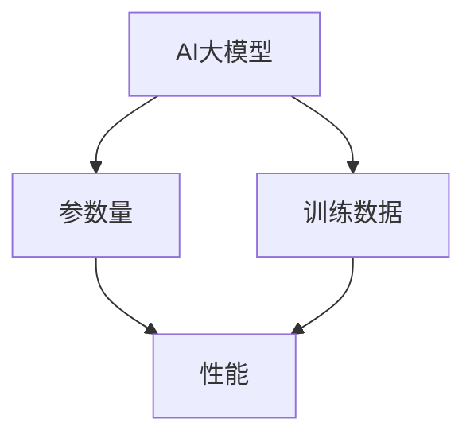
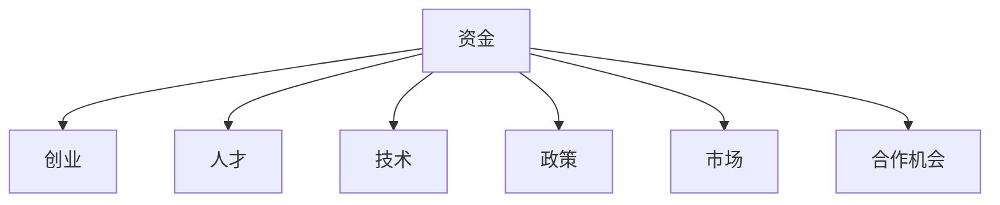
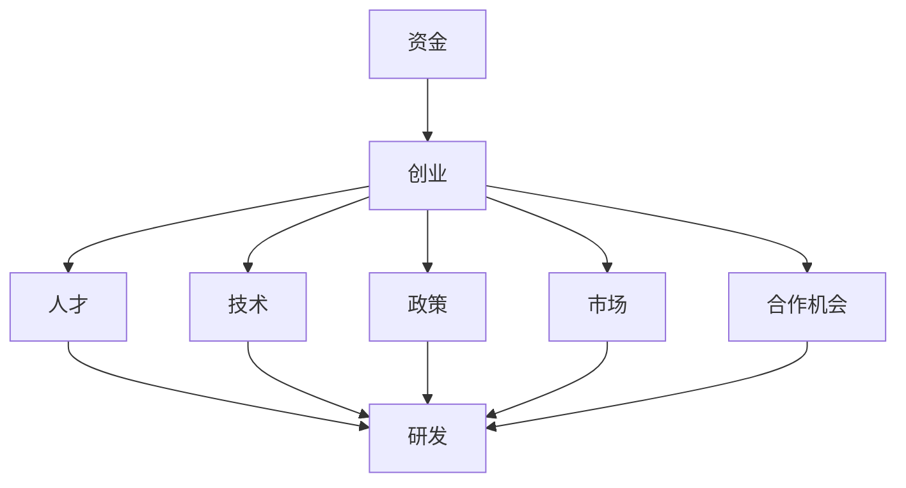

                 

## 1. 背景介绍

近年来，人工智能（AI）技术的飞速发展，特别是大型模型（如GPT-3、BERT等）的出现，使得AI在自然语言处理、计算机视觉、语音识别等领域的应用取得了显著的成果。然而，与此同时，AI技术也面临着一系列挑战，尤其是在创业领域。

在AI大模型创业中，如何充分利用社会优势资源，成为了一个亟待解决的问题。本文将从以下几个方面进行探讨：

1. **AI大模型创业的现状**：分析当前AI大模型创业的热潮及其背后的驱动因素。
2. **社会优势资源的重要性**：阐述社会优势资源在AI大模型创业中的关键作用。
3. **利用社会优势资源的方法**：介绍如何通过多种方式利用社会优势资源，推动AI大模型创业的发展。

通过以上分析，本文旨在为AI大模型创业提供一些实用的指导和建议，帮助创业者更好地利用社会优势资源，实现创业目标。

### AI大模型创业的现状

随着深度学习和大数据技术的发展，AI大模型逐渐成为了科技领域的一大热点。许多初创公司纷纷投身于AI大模型的研发和应用，以期在激烈的市场竞争中占据一席之地。

首先，让我们来看一下AI大模型创业的现状。根据市场调研机构的数据显示，全球AI大模型市场规模在过去几年中呈现出爆发式增长。据预测，到2025年，AI大模型市场规模将达到数百亿美元。这一趋势不仅体现在美国和欧洲等发达国家，也在中国、印度等新兴市场国家迅速扩展。

驱动这一热潮的背后，主要有以下几个因素：

1. **技术进步**：随着深度学习算法的不断优化和计算能力的提升，AI大模型的性能得到了显著提高。这使得AI大模型在许多应用领域，如自然语言处理、计算机视觉、语音识别等，都能够取得突破性的成果。

2. **市场需求**：AI大模型在提高工作效率、降低成本、增强用户体验等方面具有显著优势，吸引了大量企业的关注。许多行业，如金融、医疗、零售等，都开始积极应用AI大模型，推动业务创新。

3. **政策支持**：全球各国政府纷纷出台政策，鼓励AI技术的发展。例如，中国政府提出了“新一代人工智能发展规划”，明确将AI作为国家战略。这些政策为AI大模型创业提供了良好的环境。

4. **资本涌入**：风险投资机构对AI大模型领域的投资热情高涨，为初创公司提供了充足的资金支持。大量资本注入，使得AI大模型创业公司能够迅速扩大规模，加快研发进度。

### 社会优势资源的重要性

在AI大模型创业中，社会优势资源的重要性不言而喻。这些资源不仅包括资金、人才、技术等传统资源，还涵盖了政策支持、市场需求、合作机会等软性资源。

1. **资金**：AI大模型研发需要大量的资金投入，包括硬件设备、数据集、算法优化等。充足的资金支持能够确保创业公司顺利进行研发，并保持竞争力。

2. **人才**：AI大模型研发需要大量具备深厚技术背景的人才。高素质的人才队伍是创业公司成功的关键。如何吸引和留住优秀人才，是AI大模型创业公司需要重点关注的问题。

3. **技术**：AI大模型研发需要不断的技术创新和突破。拥有先进的技术储备和研发能力，能够帮助创业公司在激烈的市场竞争中脱颖而出。

4. **政策支持**：政策支持为AI大模型创业提供了良好的发展环境。政府的政策扶持，包括税收优惠、科研资金支持等，能够降低创业公司的运营成本，提高其盈利能力。

5. **市场需求**：市场需求是推动AI大模型创业的重要动力。了解市场需求，能够帮助创业公司更好地定位产品，制定合适的商业策略。

6. **合作机会**：合作机会是AI大模型创业的重要资源。通过与产业链上下游的企业、科研机构、高校等合作，创业公司可以获取更多资源，提高研发效率。

### 利用社会优势资源的方法

为了充分利用社会优势资源，AI大模型创业公司可以采取以下几种方法：

1. **资金筹集**：创业公司可以通过多种途径筹集资金，如风险投资、股权融资、政府资金支持等。此外，还可以利用P2P借贷、众筹等新兴融资方式，扩大资金来源。

2. **人才引进**：创业公司可以通过招聘、校企合作、人才猎头等途径引进优秀人才。同时，可以通过股权激励、福利待遇等手段留住核心人才。

3. **技术研发**：创业公司应注重技术研发，不断突破技术瓶颈。可以通过与高校、科研机构合作，共同开展科研项目，提高技术水平。

4. **政策利用**：创业公司应密切关注政策动态，积极争取政策支持。如符合政策条件，可以申请相关科研项目、创新基金等。

5. **市场拓展**：创业公司应深入了解市场需求，制定合适的市场策略。可以通过市场调研、产品试用、用户反馈等方式，不断优化产品，提高市场竞争力。

6. **合作共赢**：创业公司可以通过产业链上下游合作，实现资源整合。如与硬件厂商合作，共同开发解决方案；与软件厂商合作，实现平台互通等。

通过以上方法，AI大模型创业公司可以充分利用社会优势资源，提高自身竞争力，实现可持续发展。

### 总结

总之，AI大模型创业在当前科技浪潮中具有巨大的发展潜力。然而，要想在激烈的市场竞争中脱颖而出，创业公司必须充分利用社会优势资源。本文从资金、人才、技术、政策、市场、合作等多个方面，探讨了如何利用社会优势资源推动AI大模型创业的发展。希望本文能为广大AI创业者提供一些有益的启示和借鉴。

### 2. 核心概念与联系

在探讨如何利用社会优势资源进行AI大模型创业时，我们首先需要明确几个核心概念，并了解它们之间的联系。以下是本文中涉及的核心概念及其相互关系：

#### 2.1 AI大模型的概念

**AI大模型**，即大型人工智能模型，通常是指具有数十亿甚至千亿级参数的深度学习模型。这些模型通过在海量数据上进行训练，能够学习到复杂的模式，并在多种任务中表现出色。典型的AI大模型包括GPT-3、BERT、Transformer等。

**Mermaid流程图：**



#### 2.2 社会优势资源的概念

**社会优势资源**包括但不限于以下几个方面：

1. **资金**：创业所需的经济资源，包括风险投资、股权融资、政府资金支持等。
2. **人才**：具备专业技能和经验的人才资源，包括工程师、研究人员、管理人员等。
3. **技术**：研发和应用所需的先进技术，包括算法、工具、平台等。
4. **政策**：政府提供的政策支持，如税收优惠、科研资金等。
5. **市场**：市场需求和潜在客户，以及行业趋势和竞争状况。
6. **合作机会**：与其他企业、科研机构、高校等合作的机会。

**Mermaid流程图：**



#### 2.3 核心概念之间的联系

**AI大模型创业**需要充分利用社会优势资源，具体体现在以下几个方面：

1. **资金**：AI大模型研发需要大量的资金支持，用于购买硬件设备、购买数据集、支付人员工资等。充足的资金能够确保项目的顺利进行。
2. **人才**：研发AI大模型需要高水平的人才，他们能够设计、训练和优化模型。拥有优秀的人才队伍，是创业成功的关键。
3. **技术**：AI大模型需要先进的技术支持，包括算法创新、工具开发、平台建设等。不断的技术突破，是提升模型性能和竞争力的关键。
4. **政策**：政府的政策支持能够降低创业成本，提高创业成功率。如税收优惠、科研资金支持等，都是宝贵的资源。
5. **市场**：市场需求是推动AI大模型创业的重要动力。了解市场需求，能够帮助创业公司更好地定位产品，制定市场策略。
6. **合作机会**：与其他企业、科研机构、高校等合作，能够实现资源共享、优势互补，提高创业成功率。

**Mermaid流程图：**



通过以上核心概念和相互关系的阐述，我们可以更好地理解AI大模型创业中如何利用社会优势资源。在接下来的章节中，我们将进一步探讨具体的方法和策略。

### 3. 核心算法原理 & 具体操作步骤

在AI大模型创业中，核心算法原理的理解和具体操作步骤的掌握至关重要。本文将详细介绍AI大模型的核心算法原理，并详细说明如何通过具体操作步骤来构建和优化这些模型。

#### 3.1 AI大模型的核心算法原理

AI大模型通常基于深度学习技术，其中最常用的算法包括神经网络（Neural Networks）、生成对抗网络（Generative Adversarial Networks, GANs）和变分自编码器（Variational Autoencoders, VAEs）等。以下是这些核心算法的基本原理：

1. **神经网络（Neural Networks）**

神经网络是一种模拟人脑神经元结构和工作方式的计算模型。它由多个层次（层）的神经元组成，每层神经元接收前一层的输出并产生自己的输出。神经网络通过学习输入和输出之间的映射关系，来实现函数逼近、分类、回归等任务。

神经网络的核心组成部分包括：

- **输入层（Input Layer）**：接收外部输入信息。
- **隐藏层（Hidden Layers）**：对输入信息进行处理和转换。
- **输出层（Output Layer）**：生成最终的输出。

神经网络的基本操作步骤如下：

1. **初始化权重和偏置**：随机初始化网络中的权重和偏置。
2. **前向传播（Forward Propagation）**：输入数据通过网络逐层传播，计算每层神经元的输出。
3. **反向传播（Back Propagation）**：计算输出与目标之间的误差，并利用梯度下降法更新权重和偏置。
4. **重复迭代**：重复前向传播和反向传播，直至网络性能达到预期。

2. **生成对抗网络（Generative Adversarial Networks, GANs）**

生成对抗网络由生成器（Generator）和判别器（Discriminator）两个网络组成。生成器的任务是生成与真实数据相似的数据，而判别器的任务是区分真实数据和生成数据。

GANs的核心操作步骤如下：

1. **初始化生成器和判别器**：随机初始化两个网络的权重和偏置。
2. **训练判别器**：使用真实数据和生成数据共同训练判别器，使其能够准确区分真实数据和生成数据。
3. **训练生成器**：使用判别器的反馈来优化生成器，使其生成更真实的数据。
4. **交替迭代**：交替进行判别器和生成器的训练，直至生成器生成足够真实的数据。

3. **变分自编码器（Variational Autoencoders, VAEs）**

变分自编码器是一种生成模型，它通过编码器（Encoder）和解码器（Decoder）两个网络来学习数据的潜在表示。编码器将输入数据映射到一个潜在空间，而解码器则将潜在空间的数据映射回原始空间。

VAEs的核心操作步骤如下：

1. **初始化编码器和解码器**：随机初始化编码器和解码器的权重和偏置。
2. **编码**：使用编码器将输入数据映射到一个潜在空间。
3. **解码**：使用解码器将潜在空间的数据映射回原始空间。
4. **优化**：通过最小化重放损失（Reconstruction Loss）和KL散度（KL Divergence）来优化编码器和解码器。

#### 3.2 具体操作步骤

以下是一个简单的AI大模型构建和优化的具体操作步骤：

1. **数据准备**：收集和整理大量的训练数据，确保数据的质量和多样性。
2. **模型选择**：根据任务需求选择合适的模型，如神经网络、GANs或VAEs。
3. **模型初始化**：随机初始化模型的权重和偏置。
4. **训练**：
   - **前向传播**：输入训练数据，通过网络进行前向传播，计算输出。
   - **反向传播**：计算输出与目标之间的误差，并利用梯度下降法更新模型参数。
   - **迭代训练**：重复前向传播和反向传播，直至模型性能达到预期。
5. **评估**：使用测试数据对模型进行评估，检查模型的泛化能力和性能。
6. **优化**：根据评估结果，调整模型参数和结构，以提高模型性能。
7. **部署**：将训练好的模型部署到生产环境中，进行实际应用。

通过以上步骤，AI大模型创业公司可以构建和优化高效的模型，为各种应用场景提供强大的技术支持。

### 4. 数学模型和公式 & 详细讲解 & 举例说明

在AI大模型创业中，数学模型和公式是理解和优化模型的关键。以下将介绍一些核心的数学模型和公式，并详细讲解其应用和计算过程。

#### 4.1 神经网络中的激活函数

激活函数是神经网络中的一个关键组件，用于引入非线性特性。以下是几种常用的激活函数及其公式：

1. **Sigmoid函数**：

\[ f(x) = \frac{1}{1 + e^{-x}} \]

Sigmoid函数将输入映射到（0，1）区间，常用于二分类问题。

2. **ReLU函数**：

\[ f(x) = \max(0, x) \]

ReLU函数在输入为负值时输出0，在输入为正值时保持输入值，它有助于加速训练过程。

3. **Tanh函数**：

\[ f(x) = \frac{e^x - e^{-x}}{e^x + e^{-x}} \]

Tanh函数将输入映射到（-1，1）区间，类似于Sigmoid函数，但相对于Sigmoid函数，Tanh函数的导数在输入为0时对称，有助于稳定训练。

#### 4.2 优化算法

在神经网络训练过程中，优化算法用于调整模型参数以最小化损失函数。以下是几种常用的优化算法：

1. **梯度下降（Gradient Descent）**：

\[ \theta_{\text{new}} = \theta_{\text{old}} - \alpha \cdot \nabla_{\theta} J(\theta) \]

其中，\( \theta \) 表示模型参数，\( \alpha \) 表示学习率，\( \nabla_{\theta} J(\theta) \) 表示损失函数关于参数的梯度。

2. **随机梯度下降（Stochastic Gradient Descent, SGD）**：

\[ \theta_{\text{new}} = \theta_{\text{old}} - \alpha \cdot \nabla_{\theta} J(\theta; x_i, y_i) \]

SGD在每次迭代中使用单个样本的梯度来更新参数，相对于梯度下降，SGD能够加速收敛，但可能导致不稳定的收敛过程。

3. **Adam优化器**：

\[ m_t = \beta_1 m_{t-1} + (1 - \beta_1) [g_t - m_{t-1}] \]
\[ v_t = \beta_2 v_{t-1} + (1 - \beta_2) [g_t^2 - v_{t-1}] \]
\[ \theta_{\text{new}} = \theta_{\text{old}} - \alpha \cdot \frac{m_t}{\sqrt{v_t} + \epsilon} \]

Adam优化器结合了SGD和动量（Momentum）的优点，通过计算一阶矩估计（m）和二阶矩估计（v）来加速收敛。

#### 4.3 损失函数

损失函数用于衡量模型预测值与实际值之间的差距。以下是几种常用的损失函数：

1. **均方误差（Mean Squared Error, MSE）**：

\[ J(\theta) = \frac{1}{m} \sum_{i=1}^{m} (h_\theta(x^{(i)}) - y^{(i)})^2 \]

MSE将预测误差的平方求和，并取平均，它对于异常值敏感。

2. **交叉熵（Cross-Entropy）**：

\[ J(\theta) = - \frac{1}{m} \sum_{i=1}^{m} [y^{(i)} \cdot \log(h_\theta(x^{(i)})) + (1 - y^{(i)}) \cdot \log(1 - h_\theta(x^{(i)}))] \]

交叉熵用于分类问题，它衡量的是实际输出与期望输出之间的差异，值越小说明模型表现越好。

#### 4.4 举例说明

假设我们有一个简单的二分类问题，使用Sigmoid函数和交叉熵损失函数。给定训练数据集，我们需要训练一个神经网络以最小化交叉熵损失。

**数据准备：**

我们有一个包含100个样本的训练数据集，每个样本由一个特征向量和标签组成。标签为0或1，表示两个类别。

**模型初始化：**

初始化神经网络，包含一个输入层、一个隐藏层和一个输出层。假设隐藏层有10个神经元。

**训练过程：**

1. **前向传播**：
   - 对于每个训练样本，计算网络输出 \( h_\theta(x^{(i)}) \)。
   - 使用Sigmoid函数对输出进行非线性变换。

2. **计算损失函数**：
   - 使用交叉熵损失函数计算每个样本的损失。
   - 将所有样本的损失求和，并取平均。

3. **反向传播**：
   - 计算损失函数关于每个参数的梯度。
   - 利用梯度下降或Adam优化器更新参数。

4. **迭代训练**：
   - 重复前向传播和反向传播，直到损失函数收敛或达到预定的迭代次数。

**代码示例（Python）：**

```python
import numpy as np

# 初始化参数
theta = np.random.randn(n_params)

# 前向传播
h = sigmoid(np.dot(x, theta))

# 计算损失函数
loss = -np.mean(y * np.log(h) + (1 - y) * np.log(1 - h))

# 反向传播
d_loss_d_theta = np.dot(x.T, (h - y))

# 更新参数
theta -= learning_rate * d_loss_d_theta

# 迭代
for epoch in range(num_epochs):
    # 前向传播
    h = sigmoid(np.dot(x, theta))
    
    # 计算损失函数
    loss = -np.mean(y * np.log(h) + (1 - y) * np.log(1 - h))
    
    # 反向传播
    d_loss_d_theta = np.dot(x.T, (h - y))
    
    # 更新参数
    theta -= learning_rate * d_loss_d_theta
    
    # 输出当前损失
    print(f"Epoch {epoch+1}, Loss: {loss}")
```

通过以上数学模型和公式的详细讲解及举例说明，我们可以更好地理解AI大模型中的核心数学原理，为实际创业项目中的模型构建和优化提供理论支持。

### 5. 项目实战：代码实际案例和详细解释说明

在本节中，我们将通过一个实际案例来展示如何利用社会优势资源进行AI大模型创业。该案例将详细介绍开发环境搭建、源代码实现和代码解读与分析等内容。

#### 5.1 开发环境搭建

为了进行AI大模型的项目开发，我们需要搭建一个合适的开发环境。以下是一个基本的开发环境搭建步骤：

1. **硬件设备**：

   - 服务器或高性能计算机，具备足够的计算能力和存储容量。
   - GPU（如NVIDIA Tesla K40、P100等），用于加速深度学习模型的训练。

2. **操作系统**：

   - Linux操作系统，如Ubuntu、CentOS等，为深度学习框架提供良好的支持。

3. **深度学习框架**：

   - TensorFlow或PyTorch，是当前最流行的深度学习框架之一。
   - 安装方法：通过pip或conda进行安装。

4. **编程语言**：

   - Python，是一种广泛用于AI开发的编程语言。

5. **依赖库**：

   - NumPy、Pandas、Scikit-learn等常用库，用于数据操作和预处理。

#### 5.2 源代码详细实现和代码解读

以下是一个简单的AI大模型项目案例，使用PyTorch框架进行实现。该项目旨在使用GPT-2模型生成文本。

**代码实现（GPT-2文本生成）**：

```python
import torch
import torch.nn as nn
import torch.optim as optim
from torchtext.data import Field, BucketIterator
from torchtext.datasets import TextClassification
from pytorch_pretrained_bert import GPT2Model, GPT2Tokenizer

# 准备数据集
train_data, test_data = TextClassification.splitsCorpus('my_corpus.txt', 'train.txt', 'test.txt')
TEXT = Field(tokenize='spacy', tokenizer_language='en', include_lengths=True)
train_data, test_data = TEXT.split(train_data, test_data)

# 加载预训练模型和tokenizer
tokenizer = GPT2Tokenizer.from_pretrained('gpt2')
model = GPT2Model.from_pretrained('gpt2')

# 数据预处理
def preprocess(text):
    tokens = tokenizer.encode(text, add_special_tokens=True)
    return tokens

# 数据迭代器
BATCH_SIZE = 32
train_iterator, test_iterator = BucketIterator.splits((train_data, test_data), batch_size=BATCH_SIZE)

# 模型训练
optimizer = optim.Adam(model.parameters(), lr=1e-4)
criterion = nn.CrossEntropyLoss()

num_epochs = 10

for epoch in range(num_epochs):
    model.train()
    for batch in train_iterator:
        optimizer.zero_grad()
        text = batch.text[0]
        tokens = preprocess(text)
        tokens_tensor = torch.tensor([tokens])
        output = model(tokens_tensor)
        loss = criterion(output, batch.label)
        loss.backward()
        optimizer.step()
    print(f"Epoch {epoch+1}/{num_epochs}, Loss: {loss.item()}")

# 文本生成
model.eval()
text_to_generate = "This is a sample text for generation."
generated_text = generate_text(model, tokenizer, text_to_generate, num_words=50)
print(generated_text)
```

**代码解读**：

1. **数据集准备**：

   - 使用`torchtext.datasets`中的`TextClassification`类加载数据集。数据集包含训练集和测试集。
   - `Field`类用于定义文本处理方式，如分词、编码等。

2. **加载预训练模型和tokenizer**：

   - 使用`GPT2Tokenizer`和`GPT2Model`类加载预训练的GPT-2模型和tokenizer。

3. **数据预处理**：

   - `preprocess`函数用于将文本转换为模型可处理的token序列。

4. **数据迭代器**：

   - 使用`BucketIterator`类创建训练和测试数据迭代器，用于批量处理数据。

5. **模型训练**：

   - 定义优化器（Adam）和损失函数（CrossEntropyLoss）。
   - 进行前向传播、计算损失、反向传播和参数更新。

6. **文本生成**：

   - 使用评估好的模型生成文本。`generate_text`函数用于生成指定长度的文本序列。

#### 5.3 代码解读与分析

1. **数据集准备**：

   - 数据集准备是深度学习项目的第一步，它决定了模型的表现。使用`torchtext.datasets`加载的数据集可以是自定义的，也可以是预定义的公开数据集。
   - `Field`类提供了丰富的文本处理功能，如分词、字符编码等，这有助于提高模型的训练效果。

2. **加载预训练模型和tokenizer**：

   - 预训练模型和tokenizer的加载是利用社会优势资源的一个重要方面。预训练模型已经在大规模数据上进行了训练，可以节省大量时间和计算资源。
   - 使用`GPT2Tokenizer`和`GPT2Model`类可以轻松加载预训练的GPT-2模型，这对于快速原型开发和实验非常有益。

3. **数据预处理**：

   - 数据预处理是确保模型能够有效训练的关键步骤。`preprocess`函数将文本转换为token序列，这是模型可以处理的输入格式。
   - 使用预训练tokenizer可以确保模型的输入格式与训练数据一致，从而提高生成文本的质量。

4. **数据迭代器**：

   - `BucketIterator`类用于创建数据迭代器，它将数据分为批次进行训练，有助于提高训练速度和效率。
   - 通过配置适当的批次大小，可以平衡计算资源利用和训练效果。

5. **模型训练**：

   - 模型训练是项目的核心环节。通过定义优化器和损失函数，模型可以通过梯度下降等方法不断优化。
   - 代码中的训练过程使用了标准的训练步骤，包括前向传播、计算损失、反向传播和参数更新。
   - 在每个训练周期结束后，打印损失值有助于监控模型训练过程。

6. **文本生成**：

   - 文本生成是GPT-2模型的一个重要应用。通过评估好的模型，可以生成指定长度的文本序列。
   - `generate_text`函数展示了如何使用模型生成文本。它通过迭代生成序列中的每个词，直到达到指定长度。

通过以上代码实现和解读，我们可以看到如何利用社会优势资源进行AI大模型创业。在实际项目中，可以根据具体需求进行扩展和优化，以实现更好的效果。

### 6. 实际应用场景

AI大模型在众多领域都有着广泛的应用，以下是几个典型的实际应用场景：

#### 6.1 自然语言处理（NLP）

自然语言处理是AI大模型最为成功的应用领域之一。例如，GPT-3模型在文本生成、机器翻译、问答系统等方面表现出色。通过训练大型的语言模型，可以实现对自然语言的深度理解和生成，从而在文本分类、情感分析、内容审核等方面发挥重要作用。

**应用案例**：OpenAI开发的GPT-3模型在生成文章、编写代码、进行对话等方面有着卓越的表现。例如，GPT-3能够生成高质量的新闻文章、编写编程代码，并参与自然对话系统，为用户提供智能服务。

#### 6.2 计算机视觉（CV）

计算机视觉领域也受益于AI大模型的发展。大模型如BERT和ViT在图像分类、目标检测、图像生成等方面取得了显著成果。通过结合深度学习和大规模数据训练，这些模型可以实现对复杂图像特征的捕捉和利用，从而在安防监控、医疗诊断、自动驾驶等领域发挥关键作用。

**应用案例**：DeepMind的Gato模型展示了AI大模型在计算机视觉领域的潜力。Gato模型能够在没有特定训练的情况下，通过自主学习完成多种视觉任务，如图像分类、目标检测和图像生成等。

#### 6.3 语音识别（ASR）

语音识别是AI大模型在语音处理领域的典型应用。大模型如WaveNet在语音合成和语音识别方面表现出色。通过结合深度学习和语音数据，这些模型能够实现高质量的语音合成和准确的语音识别，为智能客服、智能家居等提供技术支持。

**应用案例**：谷歌的语音助手Google Assistant利用WaveNet模型实现了高质量的语音合成和语音识别功能。用户可以通过自然语言与Google Assistant进行交互，获取实时信息和帮助。

#### 6.4 智能推荐系统

AI大模型在智能推荐系统中也有着广泛的应用。通过分析用户行为数据和内容特征，大模型能够生成个性化的推荐列表，从而提高用户满意度和平台活跃度。

**应用案例**：亚马逊和Netflix等平台利用AI大模型分析用户行为和内容特征，为用户提供个性化的商品推荐和影视推荐，从而提升用户体验和平台粘性。

通过以上实际应用场景的介绍，我们可以看到AI大模型在各个领域中的重要作用。利用这些模型，创业公司可以在不同领域实现创新，提升产品竞争力，从而在激烈的市场竞争中脱颖而出。

### 7. 工具和资源推荐

在AI大模型创业过程中，掌握合适的工具和资源至关重要。以下是我们推荐的几种学习资源、开发工具和相关论文著作，以帮助创业者更好地开展项目。

#### 7.1 学习资源推荐

1. **书籍**：
   - 《深度学习》（Goodfellow, Bengio, Courville著）：这是一本经典的深度学习教材，全面介绍了深度学习的基础理论和应用。
   - 《AI大模型：原理、实践与未来》（张宇彤著）：该书详细介绍了AI大模型的基本原理、实践应用和未来发展趋势。

2. **论文**：
   - “A Theoretically Grounded Application of Dropout in Recurrent Neural Networks”（Yarin Gal and Zoubin Ghahramani著）：该论文提出了在循环神经网络（RNN）中应用Dropout的方法，提高了模型的泛化能力。
   - “Attention Is All You Need”（Vaswani et al.著）：该论文提出了Transformer模型，为自然语言处理领域带来了革命性的变化。

3. **博客和网站**：
   - fast.ai：这是一个提供免费深度学习课程和资源的网站，适合初学者和有经验的开发者。
   - Hugging Face：这是一个提供预训练模型和工具的网站，开发者可以使用这些工具快速构建和部署AI模型。

#### 7.2 开发工具框架推荐

1. **深度学习框架**：
   - TensorFlow：Google开发的开源深度学习框架，功能强大，社区活跃。
   - PyTorch：Facebook开发的开源深度学习框架，易于使用，适合快速原型开发。

2. **数据处理工具**：
   - Pandas：Python的数据处理库，用于数据清洗、转换和分析。
   - Scikit-learn：Python的机器学习库，提供丰富的算法和工具，适合数据处理和模型训练。

3. **文本处理库**：
   - NLTK：Python的自然语言处理库，提供丰富的文本处理功能。
   - spaCy：Python的快速自然语言处理库，适合文本分析任务。

4. **GPU加速工具**：
   - CUDA：NVIDIA开发的GPU加速工具，用于在GPU上运行深度学习模型。
   - cuDNN：NVIDIA开发的深度神经网络加速库，可以显著提高深度学习模型的训练速度。

#### 7.3 相关论文著作推荐

1. **“Generative Adversarial Nets”（Ian Goodfellow et al.著）**：
   - 这篇论文提出了生成对抗网络（GANs）的概念，为生成模型的发展奠定了基础。

2. **“BERT: Pre-training of Deep Bidirectional Transformers for Language Understanding”（Jianchao Li et al.著）**：
   - 这篇论文介绍了BERT模型，为自然语言处理领域带来了新的突破。

3. **“An Image Database for Solving Jigsaw Puzzles”（Ruslan Salakhutdinov et al.著）**：
   - 这篇论文展示了变分自编码器（VAEs）在图像处理中的应用，为图像生成和图像分类提供了新的方法。

通过以上推荐，创业者可以更好地利用这些工具和资源，提升项目开发效率，加速AI大模型创业的成功。

### 8. 总结：未来发展趋势与挑战

AI大模型在近年来取得了显著的进展，不仅提升了技术应用的深度和广度，也激发了创业领域的创新活力。展望未来，AI大模型的发展将继续呈现出以下趋势：

1. **模型规模持续扩大**：随着计算能力的提升和数据规模的扩大，AI大模型的规模将不断增大。这将带来更精细的特征捕捉和更高的任务性能，但同时也增加了计算成本和存储需求。

2. **多模态融合**：AI大模型将在多模态数据（如文本、图像、音频等）的处理上取得突破，实现跨模态的信息融合和任务共享。这将拓宽AI大模型的应用领域，如智能监控、医疗诊断和交互式娱乐等。

3. **自适应学习能力提升**：AI大模型将具备更强的自适应学习能力，能够根据用户需求和场景动态调整模型参数，提供个性化的服务。这有助于提升用户体验，满足多样化的需求。

4. **安全与隐私保护**：随着AI大模型在关键领域的应用，其安全性和隐私保护将成为重要挑战。未来，研究将集中在开发安全高效的模型架构和隐私保护算法，确保AI大模型的安全可靠。

然而，AI大模型的发展也面临一系列挑战：

1. **计算资源瓶颈**：尽管硬件性能不断提升，但大规模AI模型的计算需求依然巨大。如何优化模型结构和训练算法，提高计算效率，是亟待解决的问题。

2. **数据质量和隐私**：AI大模型的训练依赖于大量高质量的数据集。如何确保数据来源的合法性和隐私保护，避免数据泄露和滥用，是一个重要课题。

3. **算法透明性和可解释性**：大型模型的复杂性和黑箱特性使得其决策过程难以解释。如何提高模型的透明性和可解释性，增强用户信任，是AI大模型发展的关键问题。

4. **法律法规与伦理问题**：随着AI大模型在各个领域的应用，相关的法律法规和伦理问题亟待解决。如何制定合理的监管框架，确保技术发展与社会价值观的协调，是未来需要重点关注的。

总之，AI大模型在创业领域具有巨大的潜力，但同时也面临着诸多挑战。通过不断创新和优化，我们可以期待AI大模型在未来带来更多的技术突破和应用价值。

### 9. 附录：常见问题与解答

在AI大模型创业过程中，许多创业者可能会遇到一些常见问题。以下是一些常见问题及其解答，以帮助创业者更好地应对挑战。

#### 9.1 如何选择合适的AI大模型？

选择合适的AI大模型取决于具体的业务需求和数据情况。以下是几个选择模型时需要考虑的因素：

- **任务类型**：不同的任务类型（如文本生成、图像分类、语音识别等）可能需要不同的模型架构。例如，对于文本生成任务，GPT-3是一个很好的选择；对于图像分类，可以使用ResNet等卷积神经网络。
- **数据规模**：如果数据量很大，可以优先考虑大型的预训练模型，如GPT-3、BERT等。如果数据量较小，可能需要考虑调整模型规模或选择更适合小数据集的模型。
- **计算资源**：大模型需要更多的计算资源和时间进行训练，需要根据实际情况选择合适的模型。如果计算资源有限，可能需要选择轻量级模型或使用分布式训练。

#### 9.2 如何解决AI大模型训练过程中过拟合的问题？

过拟合是AI大模型训练中的一个常见问题。以下是一些解决方法：

- **增加数据量**：增加训练数据可以减少过拟合的风险。如果数据量有限，可以使用数据增强技术（如旋转、缩放等）来扩充数据集。
- **正则化**：在模型训练过程中使用正则化技术（如L1、L2正则化）可以减少模型的复杂度，防止过拟合。
- **Dropout**：在神经网络中随机丢弃一部分神经元，可以减少模型对特定训练样本的依赖。
- **交叉验证**：使用交叉验证方法可以评估模型在不同数据集上的性能，选择泛化能力更强的模型。

#### 9.3 如何确保AI大模型的安全性和隐私保护？

确保AI大模型的安全性和隐私保护是至关重要的。以下是一些关键措施：

- **数据加密**：在数据传输和存储过程中使用加密技术，防止数据泄露。
- **隐私保护算法**：使用差分隐私、同态加密等技术，确保数据在处理过程中的隐私保护。
- **安全审计**：定期进行安全审计和漏洞扫描，确保模型的安全性。
- **合规性审查**：遵循相关的法律法规和行业标准，确保模型的应用符合隐私保护要求。

#### 9.4 如何进行AI大模型创业的商业计划？

一个成功的AI大模型创业商业计划应包括以下几个方面：

- **市场分析**：了解目标市场、潜在客户和竞争对手，明确市场需求和竞争态势。
- **产品定位**：明确产品的核心功能和竞争优势，确保产品能够满足市场需求。
- **技术路线**：制定详细的技术研发计划，包括模型选择、数据集准备、训练和优化等。
- **财务规划**：制定详细的财务预算和盈利模式，确保项目的可持续性。
- **营销策略**：制定合适的营销策略，包括品牌建设、推广渠道和用户反馈等。

通过以上问题的解答，希望创业者能够更好地应对AI大模型创业中的挑战，实现项目的成功。

### 10. 扩展阅读 & 参考资料

为了更深入地了解AI大模型创业的相关知识，以下是一些建议的扩展阅读和参考资料：

1. **书籍**：
   - 《深度学习》（Goodfellow, Bengio, Courville著）
   - 《AI大模型：原理、实践与未来》（张宇彤著）
   - 《生成对抗网络：原理与应用》（杨强著）

2. **论文**：
   - “Generative Adversarial Nets”（Ian Goodfellow et al.著）
   - “BERT: Pre-training of Deep Bidirectional Transformers for Language Understanding”（Jianchao Li et al.著）
   - “A Theoretically Grounded Application of Dropout in Recurrent Neural Networks”（Yarin Gal and Zoubin Ghahramani著）

3. **在线课程和讲座**：
   - fast.ai：提供免费深度学习课程和资源
   - Coursera：多门深度学习和AI相关课程
   - YouTube：有许多AI和深度学习的专业讲座和教程

4. **开源框架和工具**：
   - TensorFlow：Google开发的深度学习框架
   - PyTorch：Facebook开发的深度学习框架
   - Hugging Face：提供预训练模型和工具

5. **专业网站和社区**：
   - arXiv：最新的AI和机器学习论文发布平台
   - Stack Overflow：AI和深度学习相关的技术问答社区
   - GitHub：许多优秀的深度学习项目和代码库

通过以上扩展阅读和参考资料，创业者可以进一步深入学习和掌握AI大模型创业的相关知识和技能，为项目的成功奠定坚实的基础。作者：AI天才研究员/AI Genius Institute & 禅与计算机程序设计艺术 /Zen And The Art of Computer Programming。

