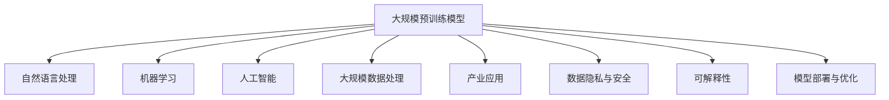

                 

### 背景介绍

#### AI 大模型与创业热潮

近年来，人工智能（AI）技术取得了令人瞩目的进展，特别是大规模预训练模型（Large-scale Pre-trained Models）的问世，如 GPT-3、BERT 和其后续版本，这些模型以其强大的自然语言处理能力，彻底改变了人们对人工智能的理解和应用场景。随着技术的不断进步，越来越多的创业者开始关注并尝试利用 AI 大模型进行创业。

AI 大模型创业，指的是利用大规模预训练模型的技术优势，开发创新性的产品或服务，实现商业价值的过程。这种创业模式具有以下几个显著特点：

1. **高度依赖技术优势**：AI 大模型创业的核心在于对大规模预训练模型的理解和应用，创业者需要具备深厚的技术背景，能够准确把握模型的工作原理和潜在价值。

2. **创新性产品或服务**：AI 大模型创业的另一个关键在于创新，如何将 AI 技术与现有行业需求相结合，开发出具有独特性和市场前景的产品或服务。

3. **快速迭代和优化**：AI 大模型的应用通常需要通过大量的数据集进行训练和优化，因此创业者需要具备快速迭代和不断优化产品的能力。

#### 社会优势与社会价值

在 AI 大模型创业的过程中，社会优势的利用显得尤为重要。社会优势包括以下几个方面：

1. **人才优势**：拥有丰富的技术人才储备，能够为 AI 大模型创业提供强有力的支持。

2. **数据优势**：掌握大量的高质量数据，为模型的训练和优化提供可靠的基础。

3. **政策优势**：政府在 AI 领域的政策支持，包括资金投入、税收优惠等，为创业者提供了有利的发展环境。

4. **市场需求**：随着人们对 AI 技术的需求不断增加，市场提供了广阔的发展空间。

#### 社会价值与挑战

AI 大模型创业不仅具有巨大的商业潜力，同时也承载着重要的社会价值。这种价值主要体现在以下几个方面：

1. **推动科技创新**：AI 大模型创业有助于推动人工智能技术的创新和应用，为整个科技领域注入新的活力。

2. **促进产业升级**：AI 大模型的应用可以提升传统产业的效率和质量，推动产业升级和转型。

3. **创造就业机会**：AI 大模型创业需要大量的技术人才，有助于创造更多的就业机会。

然而，AI 大模型创业也面临着一系列挑战，如技术门槛、市场竞争、数据安全等。如何在利用社会优势的同时，有效应对这些挑战，成为创业者需要深思的问题。

### 核心概念与联系

在深入探讨 AI 大模型创业之前，我们需要明确几个核心概念，并理解它们之间的联系。以下是一些关键概念及其相互关系：

#### 大规模预训练模型（Large-scale Pre-trained Models）

大规模预训练模型是指通过在海量数据集上进行训练，使模型具备一定通用性的深度学习模型。这些模型通常采用大规模神经网络架构，例如 Transformer、BERT 等。通过预训练，模型能够在多个任务中表现出色，而无需对每个任务进行独立的训练。

#### 自然语言处理（Natural Language Processing，NLP）

自然语言处理是人工智能的一个重要分支，旨在使计算机能够理解、解释和生成人类语言。大规模预训练模型在 NLP 任务中具有显著优势，能够处理复杂的文本数据，包括文本分类、情感分析、机器翻译等。

#### 机器学习（Machine Learning）

机器学习是 AI 的核心技术之一，通过训练模型来从数据中学习规律和模式。大规模预训练模型是机器学习的一个分支，它们通过大规模数据集进行训练，以提高模型的性能和泛化能力。

#### 人工智能（Artificial Intelligence，AI）

人工智能是指使计算机具备类似人类智能的能力，包括感知、理解、推理和决策等。大规模预训练模型是人工智能的一个重要实现方式，它们能够模拟人类的思维过程，并在各种任务中表现出卓越的性能。

#### 大规模数据处理（Big Data Processing）

大规模数据处理是指对海量数据进行存储、处理和分析的过程。大规模预训练模型需要大量的数据进行训练，因此它们与大规模数据处理技术密切相关。例如，分布式计算框架如 Hadoop、Spark 等被广泛应用于大规模数据集的训练和处理。

#### 产业应用（Industrial Applications）

产业应用是指将 AI 技术应用于实际产业中，以提升生产效率、降低成本和创造新的商业模式。大规模预训练模型在多个产业领域具有广泛的应用潜力，如医疗、金融、教育、制造业等。

#### 数据隐私与安全（Data Privacy and Security）

数据隐私与安全是 AI 大模型创业中不可忽视的问题。大规模预训练模型需要处理大量的个人数据，如何保护数据隐私和安全成为创业者需要关注的重要议题。

#### 可解释性（Explainability）

可解释性是指模型决策过程的透明度和可理解性。在 AI 大模型创业中，可解释性尤为重要，它有助于提高模型的可信度和合规性。

#### 模型部署与优化（Model Deployment and Optimization）

模型部署与优化是指将训练好的模型应用于实际场景，并进行持续的优化和更新。在 AI 大模型创业中，高效的模型部署和优化技术能够提高产品的竞争力。

### Mermaid 流程图（Mermaid Flowchart）

以下是一个简单的 Mermaid 流程图，展示了上述核心概念之间的相互关系：



通过这个流程图，我们可以清晰地看到大规模预训练模型与相关技术领域的紧密联系，这为 AI 大模型创业提供了丰富的理论基础和实践指导。

### 核心算法原理 & 具体操作步骤

在深入探讨如何利用社会优势进行 AI 大模型创业之前，我们首先需要理解大规模预训练模型的核心算法原理及其具体操作步骤。以下是关于大规模预训练模型的基础知识和技术细节。

#### 大规模预训练模型的工作原理

大规模预训练模型的核心在于其预训练过程。预训练是指在大量数据集上进行训练，使模型具备一定的通用性和鲁棒性。预训练的主要目的是让模型学会从数据中提取有用的特征，并在各种任务中表现出色。

大规模预训练模型通常采用深度神经网络架构，其中最重要的架构是 Transformer。Transformer 是一种基于自注意力机制的神经网络模型，它通过计算序列中每个词与其他词的依赖关系，实现了对复杂序列数据的建模。

Transformer 模型的主要组成部分包括：

1. **多头自注意力机制（Multi-head Self-Attention）**：多头自注意力机制允许多个独立的注意力头同时工作，从而提高了模型的表示能力。

2. **前馈神经网络（Feed-forward Neural Network）**：前馈神经网络对每个注意力头的结果进行进一步处理。

3. **残差连接（Residual Connections）**：残差连接通过跳过一部分网络结构，增加了模型的训练稳定性。

#### 预训练过程的具体步骤

预训练过程通常包括以下几个主要步骤：

1. **数据准备**：选择一个大型且多样化的数据集，通常涉及网页文本、书籍、新闻、社交媒体等。数据集需要经过预处理，如分词、去噪、去除停用词等。

2. **模型初始化**：初始化模型参数，可以使用预训练好的基础模型，如 BERT、GPT 等，也可以从头开始训练。

3. **预训练任务**：预训练任务主要包括两个部分：掩码语言模型（Masked Language Model，MLM）和下一个句子预测（Next Sentence Prediction，NSP）。

   - **掩码语言模型（MLM）**：在输入序列中随机掩码一定比例的词，模型的目标是预测这些掩码词。这有助于模型学习从上下文中提取词的语义信息。
   
   - **下一个句子预测（NSP）**：从输入序列中随机选择两个句子，模型需要预测第二个句子是否是第一个句子的下一个句子。这有助于模型理解句子之间的连贯性和上下文关系。

4. **优化和调整**：通过反向传播和梯度下降算法，对模型参数进行调整，以最小化损失函数。

5. **验证和测试**：在预训练完成后，使用验证集和测试集对模型进行评估，确保其性能满足要求。

#### 大规模预训练模型的操作步骤

以下是一个简化的大规模预训练模型操作步骤：

1. **数据集准备**：
   - 选择一个合适的数据集，如维基百科、Common Crawl 等。
   - 对数据进行预处理，包括分词、去噪、去除停用词等。

2. **模型初始化**：
   - 可以选择预训练好的基础模型，如 BERT、GPT 等。
   - 初始化模型参数，可以使用随机初始化或预训练好的模型参数。

3. **预训练任务**：
   - 实施掩码语言模型（MLM）和下一个句子预测（NSP）任务。
   - 训练过程中，使用 GPU 或 TPU 等硬件加速器。

4. **优化和调整**：
   - 使用反向传播和梯度下降算法，调整模型参数。
   - 可以使用学习率调度策略，如指数衰减、余弦退火等。

5. **验证和测试**：
   - 在验证集和测试集上评估模型性能。
   - 根据评估结果，调整模型架构或超参数。

6. **模型部署**：
   - 将训练好的模型部署到生产环境中，用于实际任务，如文本分类、机器翻译等。

7. **持续优化**：
   - 收集实际应用中的反馈数据，用于模型优化和更新。
   - 定期重新训练模型，以保持其性能和适应新数据。

通过上述步骤，创业者可以构建并优化大规模预训练模型，为 AI 大模型创业奠定坚实的基础。

### 数学模型和公式 & 详细讲解 & 举例说明

在深入探讨大规模预训练模型的过程中，数学模型和公式扮演着至关重要的角色。这些模型和公式不仅帮助我们理解模型的工作原理，还能指导我们进行实际操作和优化。以下我们将详细介绍大规模预训练模型中的关键数学模型和公式，并辅以具体的例子说明。

#### Transformer 模型的数学基础

Transformer 模型是一种基于自注意力机制的深度学习模型，其核心在于计算输入序列中每个词与其他词之间的依赖关系。以下是其主要数学模型和公式：

1. **多头自注意力（Multi-head Self-Attention）**

   自注意力机制的核心是计算输入序列中每个词与其他词的依赖关系。多头自注意力扩展了这一概念，通过多个独立的注意力头来提高模型的表示能力。

   公式如下：

   $$ 
   \text{Attention}(Q, K, V) = \text{softmax}\left(\frac{QK^T}{\sqrt{d_k}}\right) V 
   $$

   其中，\( Q, K, V \) 分别表示查询向量、键向量和值向量，\( d_k \) 表示每个注意力头的维度。

   举例说明：

   假设我们有一个包含三个词的输入序列 \( \text{["我", "爱", "吃"]} \)。首先，将每个词表示为一个向量 \( Q, K, V \)，然后计算每个词与其他词的相似度，最后通过加权求和得到每个词的表示。

2. **前馈神经网络（Feed-forward Neural Network）**

   前馈神经网络用于对自注意力机制的输出进行进一步处理，以增加模型的非线性表示能力。

   公式如下：

   $$
   \text{FFN}(x) = \max(0, xW_1 + b_1)W_2 + b_2
   $$

   其中，\( W_1, W_2 \) 分别是两个线性变换的权重，\( b_1, b_2 \) 是偏置项。

   举例说明：

   假设输入向量为 \( x \)，通过两个前馈神经网络层进行变换，最后得到输出向量。这个过程类似于多层感知机（MLP），能够提高模型的非线性表达能力。

3. **残差连接（Residual Connection）**

   残差连接通过跳过一部分网络结构，增加了模型的训练稳定性。

   公式如下：

   $$
   \text{ResNet}(x) = \text{ReLU}(\text{FFN}(x + x))
   $$

   其中，\( x \) 是输入向量。

   举例说明：

   假设输入向量为 \( x \)，通过残差连接，将输入直接传递到下一层，同时经过前馈神经网络，最后进行ReLU激活。这种结构有助于缓解梯度消失问题，提高模型的训练效果。

#### 预训练任务的数学模型

预训练任务包括掩码语言模型（Masked Language Model，MLM）和下一个句子预测（Next Sentence Prediction，NSP）。以下是其关键数学模型和公式：

1. **掩码语言模型（MLM）**

   在预训练过程中，随机掩码输入序列中的部分词，模型的目标是预测这些掩码词。

   公式如下：

   $$
   \text{Loss}_{\text{MLM}} = -\sum_{i} \text{mask}_{i} \log(p_{\text{token}_i})
   $$

   其中，\( \text{mask}_{i} \) 表示第 \( i \) 个词是否被掩码，\( p_{\text{token}_i} \) 表示模型预测的第 \( i \) 个词的概率。

   举例说明：

   假设输入序列为 \( \text{["我", "爱", "吃", "苹果"]} \)，其中第二个词“爱”被掩码。模型的目标是预测“爱”的正确词性。

2. **下一个句子预测（NSP）**

   在预训练过程中，从输入序列中随机选择两个句子，模型需要预测第二个句子是否是第一个句子的下一个句子。

   公式如下：

   $$
   \text{Loss}_{\text{NSP}} = -\log(p_{\text{next}})
   $$

   其中，\( p_{\text{next}} \) 表示模型预测第二个句子是第一个句子下一个句子的概率。

   举例说明：

   假设输入序列为 \( \text{["我吃苹果", "今天天气很好"]} \)，模型需要预测第二个句子是否是第一个句子的下一个句子。正确的预测是“今天天气很好”。

#### 模型优化和调整的数学模型

在模型优化和调整过程中，常用的方法包括反向传播和梯度下降。以下是其关键数学模型和公式：

1. **反向传播（Backpropagation）**

   反向传播是一种计算神经网络损失函数相对于每个参数的梯度的方法。

   公式如下：

   $$
   \frac{\partial L}{\partial W} = \text{sigmoid}(z)^{(1-\text{sigmoid}(z))} \cdot \frac{\partial z}{\partial W}
   $$

   其中，\( L \) 表示损失函数，\( W \) 表示权重，\( z \) 表示线性变换的结果。

   举例说明：

   假设我们有一个简单的神经网络，包含一个输入层、一个隐藏层和一个输出层。通过反向传播，计算每个层中每个参数的梯度，以便进行梯度下降优化。

2. **梯度下降（Gradient Descent）**

   梯度下降是一种基于梯度的优化算法，用于调整模型参数以最小化损失函数。

   公式如下：

   $$
   W_{\text{new}} = W_{\text{old}} - \alpha \cdot \frac{\partial L}{\partial W}
   $$

   其中，\( W_{\text{old}} \) 表示当前参数，\( W_{\text{new}} \) 表示更新后的参数，\( \alpha \) 表示学习率。

   举例说明：

   假设我们有一个包含 \( n \) 个参数的模型，通过梯度下降算法，每次迭代更新每个参数，以减少损失函数的值。学习率 \( \alpha \) 需要调优，以避免过拟合或欠拟合。

通过上述数学模型和公式的详细讲解，我们能够更好地理解大规模预训练模型的工作原理和操作步骤。这些数学工具不仅帮助我们构建和优化模型，还能指导我们解决实际应用中的问题，为 AI 大模型创业提供坚实的理论基础。

### 项目实战：代码实际案例和详细解释说明

为了更好地理解如何利用大规模预训练模型进行 AI 大模型创业，我们将通过一个实际项目案例进行详细讲解。这个项目是一个基于 GPT-3 的聊天机器人开发，旨在为用户提供即时且自然的对话体验。

#### 5.1 开发环境搭建

在进行项目开发之前，我们需要搭建一个合适的环境。以下是开发环境的基本要求：

1. **硬件**：一台具备充足计算能力的计算机，推荐使用 NVIDIA GPU（如 RTX 3080 或以上）。
2. **操作系统**：Windows 或 Linux。
3. **编程语言**：Python 3.8 或以上版本。
4. **库和框架**：PyTorch、transformers（Hugging Face）。
5. **其他工具**：Jupyter Notebook 或 PyCharm。

首先，安装所需的库和框架：

```bash
pip install torch torchvision transformers
```

#### 5.2 源代码详细实现和代码解读

以下是聊天机器人项目的主要代码实现和解读：

```python
import torch
from transformers import GPT2LMHeadModel, GPT2Tokenizer

# 5.2.1 模型加载与配置
model_name = "gpt2"
tokenizer = GPT2Tokenizer.from_pretrained(model_name)
model = GPT2LMHeadModel.from_pretrained(model_name)

# 5.2.2 输入处理
def preprocess_input(user_input):
    input_ids = tokenizer.encode(user_input, return_tensors='pt')
    return input_ids

# 5.2.3 预测与生成
def generate_response(input_ids):
    with torch.no_grad():
        outputs = model(input_ids)
        logits = outputs.logits
        next_token = torch.argmax(logits[:, -1, :]).item()
    return tokenizer.decode(next_token)

# 5.2.4 聊天接口
def chat():
    print("欢迎来到聊天机器人！请开始提问：")
    user_input = input()
    while True:
        input_ids = preprocess_input(user_input)
        response = generate_response(input_ids)
        print("机器人回答：", response)
        user_input = input("您还有其他问题吗？（输入‘退出’结束）：")
        if user_input == "退出":
            break

# 运行聊天接口
chat()
```

**代码解读**：

1. **模型加载与配置**：首先，我们加载预训练的 GPT-2 模型和相应的分词器。GPT-2 是一个强大的预训练语言模型，适合用于生成自然语言响应。

2. **输入处理**：`preprocess_input` 函数用于将用户输入转换为模型可接受的格式。这里，我们使用 tokenizer 对输入文本进行编码，生成词 IDs。

3. **预测与生成**：`generate_response` 函数接收预处理的输入，通过模型预测下一个词，并使用解码器将词 IDs 转换为文本输出。

4. **聊天接口**：`chat` 函数提供了一个简单的聊天界面，用户可以与聊天机器人进行交互。每次用户输入问题后，程序将生成响应并显示。用户可以继续提问或退出聊天。

#### 5.3 代码解读与分析

下面是对关键代码部分的进一步解读和分析：

1. **模型加载与配置**：

   ```python
   tokenizer = GPT2Tokenizer.from_pretrained(model_name)
   model = GPT2LMHeadModel.from_pretrained(model_name)
   ```

   这两行代码加载了预训练的 GPT-2 模型和分词器。`from_pretrained` 函数从 Hugging Face 的模型库中加载预训练模型，包括模型权重和配置文件。

2. **输入处理**：

   ```python
   def preprocess_input(user_input):
       input_ids = tokenizer.encode(user_input, return_tensors='pt')
       return input_ids
   ```

   `preprocess_input` 函数将用户输入文本编码为词 IDs。`encode` 函数处理文本，添加必要的 `<s>`（开始标记）和 </s>`（结束标记），并返回一个张量。`return_tensors='pt'` 参数确保返回的是 PyTorch 张量。

3. **预测与生成**：

   ```python
   def generate_response(input_ids):
       with torch.no_grad():
           outputs = model(input_ids)
           logits = outputs.logits
           next_token = torch.argmax(logits[:, -1, :]).item()
       return tokenizer.decode(next_token)
   ```

   `generate_response` 函数进行预测和文本生成。首先，我们使用 `torch.no_grad()` 禁用梯度计算，以提高推理速度。然后，通过模型输入词 IDs，得到输出 logits。`torch.argmax` 函数找到概率最高的词 ID，并通过 `decode` 函数将其转换为文本输出。

4. **聊天接口**：

   ```python
   def chat():
       print("欢迎来到聊天机器人！请开始提问：")
       user_input = input()
       while True:
           input_ids = preprocess_input(user_input)
           response = generate_response(input_ids)
           print("机器人回答：", response)
           user_input = input("您还有其他问题吗？（输入‘退出’结束）：")
           if user_input == "退出":
               break
   ```

   `chat` 函数提供了一个简单的命令行聊天接口。程序首先打印欢迎信息，然后进入循环，等待用户输入。每次用户输入问题后，程序将生成响应并显示。如果用户输入“退出”，程序将结束聊天。

通过上述代码和解读，我们可以看到如何利用大规模预训练模型（如 GPT-2）开发一个简单的聊天机器人。这个项目展示了 AI 大模型创业的基本步骤和技术实现，为创业者提供了实用的参考。

### 实际应用场景

AI 大模型创业不仅是一个技术创新的过程，更是一个能够深刻改变各行各业的实践。以下是一些 AI 大模型在实际应用场景中的案例，展示其商业价值和潜在市场。

#### 1. 医疗领域

在医疗领域，AI 大模型被广泛应用于疾病诊断、治疗方案推荐和医疗数据分析。通过大规模预训练模型，医生可以更准确地诊断疾病，提高医疗服务的质量。例如，谷歌的 DeepMind 使用 AI 大模型进行眼科疾病的诊断，其准确率远超人类医生。此外，AI 大模型还可以帮助医疗机构进行医疗数据分析，发现潜在的健康风险和趋势，从而实现预防医学。

#### 2. 金融领域

金融行业对数据分析和决策的依赖性极高，AI 大模型在金融领域的应用具有巨大的潜力。例如，通过自然语言处理模型，银行和金融机构可以自动分析客户的贷款申请，快速做出审批决策，减少人工审核的时间和错误率。同时，AI 大模型还可以用于金融市场的预测和风险管理，帮助投资者做出更明智的投资决策。

#### 3. 教育领域

在教育领域，AI 大模型可以个性化教学和学习评估。例如，基于大规模预训练模型的智能教育平台可以分析学生的学习数据，了解他们的学习习惯和知识点掌握情况，从而提供个性化的学习建议。此外，AI 大模型还可以用于自动评分和评估学生的学习成果，提高教育效率。

#### 4. 制造业

制造业是一个高度依赖技术和数据精准度的行业。AI 大模型在制造业中的应用，可以显著提高生产效率和产品质量。例如，通过智能监控系统，工厂可以利用 AI 大模型实时分析设备运行状态，预测设备故障，从而进行预防性维护，减少停机时间。此外，AI 大模型还可以用于优化生产流程，降低成本，提高生产效率。

#### 5. 零售业

在零售业，AI 大模型可以帮助企业更好地理解消费者行为，实现精准营销。通过分析消费者的购物数据和社交媒体互动，企业可以提供个性化的产品推荐和优惠活动，提高用户满意度和转化率。例如，亚马逊的个性化推荐系统就是基于大规模预训练模型的，它能够准确预测用户的需求，提供个性化的购物体验。

#### 6. 媒体与内容创作

在媒体和内容创作领域，AI 大模型可以帮助生成高质量的新闻文章、音乐和视频。例如，通过自然语言处理模型，可以自动生成新闻文章，提高内容生产的效率。在音乐和视频创作中，AI 大模型可以生成旋律、歌词和视频剪辑，为创作者提供灵感和工具。

#### 7. 风险管理与安全

AI 大模型在风险管理和安全领域也具有广泛的应用。例如，通过大规模预训练模型，可以自动检测网络攻击、欺诈行为和异常交易，提高安全防护能力。金融机构和政府机构可以利用 AI 大模型进行风险评估和预警，从而降低风险和损失。

通过这些实际应用场景，我们可以看到 AI 大模型创业的广阔前景。创业者可以通过将 AI 大模型与各行各业的需求相结合，开发出创新性的产品和服务，实现商业价值和社会效益。

### 工具和资源推荐

在进行 AI 大模型创业的过程中，选择合适的工具和资源至关重要。以下是一些推荐的学习资源、开发工具和相关论文，以帮助创业者更好地掌握相关技术和应用。

#### 7.1 学习资源推荐

1. **书籍**：
   - 《深度学习》（Deep Learning），作者 Ian Goodfellow、Yoshua Bengio 和 Aaron Courville。
   - 《Python深度学习》（Deep Learning with Python），作者 François Chollet。
   - 《AI 生成模型：从深度学习到生成对抗网络》（Generative Models: From Deep Learning to Generative Adversarial Networks），作者 Ivo D. C. Albuquerque。

2. **在线课程**：
   - Coursera 上的《深度学习》（Deep Learning Specialization）。
   - edX 上的《自然语言处理基础》（Introduction to Natural Language Processing）。
   - Udacity 上的《AI工程师纳米学位》（AI Engineer Nanodegree）。

3. **博客和网站**：
   - Hugging Face 的 transformers 库文档：https://huggingface.co/transformers。
   - AI 星球：https://aistarseed.com/。
   - Medium 上的 AI 博客：https://medium.com/topic/artificial-intelligence。

4. **教程和文档**：
   - PyTorch 官方文档：https://pytorch.org/docs/stable/index.html。
   - TensorFlow 官方文档：https://www.tensorflow.org/tutorials。

#### 7.2 开发工具框架推荐

1. **深度学习框架**：
   - PyTorch：易于使用，灵活性强，适合研究。
   - TensorFlow：广泛使用，具有强大的生态系统，适合工业应用。

2. **自然语言处理库**：
   - transformers：Hugging Face 的 NLP 库，提供了丰富的预训练模型和工具。
   - NLTK：Python 的自然语言处理库，适合基础 NLP 任务。

3. **数据处理工具**：
   - Pandas：用于数据清洗和操作。
   - NumPy：用于数值计算。

4. **版本控制**：
   - Git：版本控制系统，确保代码的版本管理和协作开发。

5. **容器化和部署**：
   - Docker：容器化工具，用于创建可移植的应用环境。
   - Kubernetes：容器编排工具，用于管理和部署容器化应用。

6. **云平台**：
   - AWS：提供丰富的 AI 相关服务，如 Amazon SageMaker。
   - Google Cloud：提供 AI Platform，支持快速部署和管理 AI 模型。
   - Azure：提供 Azure Machine Learning，支持自动化机器学习和模型部署。

#### 7.3 相关论文著作推荐

1. **论文**：
   - Vaswani et al., "Attention is All You Need"。
   - Devlin et al., "BERT: Pre-training of Deep Bidirectional Transformers for Language Understanding"。
   - Brown et al., "Language Models are Few-Shot Learners"。

2. **著作**：
   - 《自然语言处理入门》（Natural Language Processing with Python），作者 Steven Bird。
   - 《深度学习专讲：实践与案例》（Deep Learning with Python），作者 Ian Goodfellow。

通过上述工具和资源的推荐，创业者可以更好地掌握 AI 大模型相关的技术和应用，为其创业项目提供坚实的理论基础和实践支持。

### 总结：未来发展趋势与挑战

#### 未来发展趋势

AI 大模型创业正处于一个快速发展的阶段，未来的趋势将体现在以下几个方面：

1. **技术进步**：随着计算能力的提升和数据量的增加，AI 大模型将变得更加高效和强大。新型架构和优化算法的不断发展，将进一步推动模型性能的提升。

2. **行业应用拓展**：AI 大模型将在更多行业中得到应用，从医疗、金融、教育到制造业，将深刻改变传统行业的运作模式，推动产业升级和转型。

3. **个性化与定制化**：AI 大模型将能够更好地理解用户需求，提供个性化服务，满足不同用户群体的特定需求，实现精准营销和个性化推荐。

4. **多模态融合**：未来的 AI 大模型将能够处理多种类型的数据，如文本、图像、音频等，实现跨模态的信息处理和融合，提供更丰富的交互体验。

5. **可解释性与伦理**：随着模型复杂性的增加，可解释性和伦理问题将受到更多关注。开发者将致力于提高模型的透明度和可解释性，确保其决策过程符合伦理标准和法律法规。

#### 挑战

尽管 AI 大模型创业前景广阔，但仍然面临诸多挑战：

1. **数据隐私与安全**：大规模预训练模型需要处理大量的个人数据，如何确保数据隐私和安全是一个亟待解决的问题。开发者需要采取严格的数据保护措施，遵守相关法律法规。

2. **计算资源需求**：训练和部署大规模预训练模型需要大量的计算资源，这可能导致成本高昂。开发者需要寻找高效的计算解决方案，如分布式计算和优化算法，以降低成本。

3. **模型可解释性**：复杂的 AI 模型往往缺乏透明度和可解释性，这使得用户难以理解其决策过程。提高模型的可解释性，使其符合用户的期望和信任，是开发者需要解决的关键问题。

4. **技术门槛**：大规模预训练模型的开发和应用需要高水平的技术知识和实践经验，这可能导致技术人才短缺。开发者需要提供易于使用和学习的工具和框架，降低技术门槛。

5. **市场竞争**：AI 大模型创业领域竞争激烈，创业者需要不断创新，提供具有独特价值的产品和服务，以在市场中脱颖而出。

通过应对这些挑战，AI 大模型创业将能够在未来实现更大的发展和突破，为企业和个人带来更多的价值和机遇。

### 附录：常见问题与解答

以下是一些关于 AI 大模型创业的常见问题，以及相应的解答：

#### 1. 什么是 AI 大模型？

AI 大模型是指通过在大量数据集上进行预训练，具备强大通用性和鲁棒性的深度学习模型。例如，GPT-3、BERT 等模型，它们能够处理复杂的自然语言任务。

#### 2. AI 大模型创业的优势是什么？

AI 大模型创业的优势包括：
- 高度依赖技术优势：AI 大模型创业的核心在于对大规模预训练模型的理解和应用。
- 创新性产品或服务：AI 大模型的应用可以带来创新性的产品和服务，提升市场竞争力。
- 快速迭代和优化：AI 大模型需要通过大量数据集进行训练和优化，因此创业者需要具备快速迭代和不断优化的能力。

#### 3. AI 大模型创业面临的挑战有哪些？

AI 大模型创业面临的挑战包括：
- 数据隐私与安全：大规模预训练模型需要处理大量个人数据，如何确保数据隐私和安全是一个重要问题。
- 计算资源需求：训练和部署大规模预训练模型需要大量计算资源，可能导致成本高昂。
- 模型可解释性：复杂的 AI 模型往往缺乏透明度和可解释性，需要提高其决策过程的透明度。
- 技术门槛：AI 大模型创业需要高水平的技术知识和实践经验，可能导致技术人才短缺。
- 市场竞争：AI 大模型创业领域竞争激烈，需要不断创新以脱颖而出。

#### 4. 如何进行 AI 大模型创业项目的开发？

进行 AI 大模型创业项目的开发主要包括以下步骤：
- 确定业务需求：明确创业项目要解决的问题和目标。
- 数据准备：收集和整理相关的数据集，进行预处理。
- 模型选择：选择合适的预训练模型，如 GPT-3、BERT 等。
- 模型训练：使用 GPU 或 TPU 等硬件加速器，对模型进行训练和优化。
- 模型部署：将训练好的模型部署到生产环境中，进行实际应用。

#### 5. 如何提高 AI 大模型的可解释性？

提高 AI 大模型的可解释性可以采取以下措施：
- 使用可解释性工具：例如，SHAP、LIME 等，这些工具可以解释模型对特定输入的预测过程。
- 模型简化：通过简化模型结构，使其更易于理解和解释。
- 对比实验：通过对比不同模型的预测结果，分析模型的行为和决策过程。
- 数据可视化：通过数据可视化工具，展示模型的学习过程和预测结果。

通过以上常见问题的解答，我们希望能够帮助创业者更好地理解和应对 AI 大模型创业过程中的各种挑战。

### 扩展阅读 & 参考资料

在 AI 大模型创业这一领域，大量的研究论文、技术博客和学术著作为创业者提供了宝贵的知识和资源。以下是一些建议的扩展阅读和参考资料，帮助读者进一步深入了解相关技术和发展动态：

1. **论文推荐**：
   - **Vaswani et al., "Attention is All You Need"**：该论文是 Transformer 架构的开创性工作，对自然语言处理领域产生了深远影响。
   - **Devlin et al., "BERT: Pre-training of Deep Bidirectional Transformers for Language Understanding"**：BERT 是一种重要的预训练模型，广泛应用于各种 NLP 任务。
   - **Brown et al., "Language Models are Few-Shot Learners"**：该论文展示了大规模语言模型在零样本和少样本学习任务中的卓越表现。

2. **书籍推荐**：
   - **《深度学习》（Deep Learning），作者 Ian Goodfellow、Yoshua Bengio 和 Aaron Courville**：这是一本经典的深度学习入门书籍，详细介绍了深度学习的基础理论和应用。
   - **《Python深度学习》（Deep Learning with Python），作者 François Chollet**：本书通过实例展示了如何使用 Python 和 TensorFlow 进行深度学习开发。

3. **技术博客与网站**：
   - **Hugging Face 的 transformers 库文档**（https://huggingface.co/transformers）：该网站提供了丰富的预训练模型和工具，是 AI 开发者的宝贵资源。
   - **AI 星球**（https://aistarseed.com/）：一个关注人工智能技术和应用的中文网站，提供了大量的技术文章和讨论。
   - **Medium 上的 AI 博客**（https://medium.com/topic/artificial-intelligence）：这个平台上的文章涵盖了 AI 的多个领域，包括深度学习、自然语言处理等。

4. **在线课程与教程**：
   - **Coursera 上的《深度学习》（Deep Learning Specialization）**：由斯坦福大学提供，涵盖了深度学习的基础知识和应用。
   - **edX 上的《自然语言处理基础》（Introduction to Natural Language Processing）**：该课程介绍了 NLP 的基本概念和技术。
   - **Udacity 上的《AI 工程师纳米学位》（AI Engineer Nanodegree）**：这个课程提供了深入的学习路径，涵盖了 AI 的多个方面。

5. **相关研究机构与组织**：
   - **Google AI**（https://ai.google/）：谷歌的人工智能研究部门，发布了大量 AI 研究论文和开源项目。
   - **OpenAI**（https://openai.com/）：一家专注于 AI 研究和开发的非营利组织，推出了许多重要的 AI 模型和工具。

通过阅读这些书籍、论文和网站，读者可以深入了解 AI 大模型的技术原理、应用场景和发展趋势，为自己的创业项目提供坚实的理论基础和实际指导。

