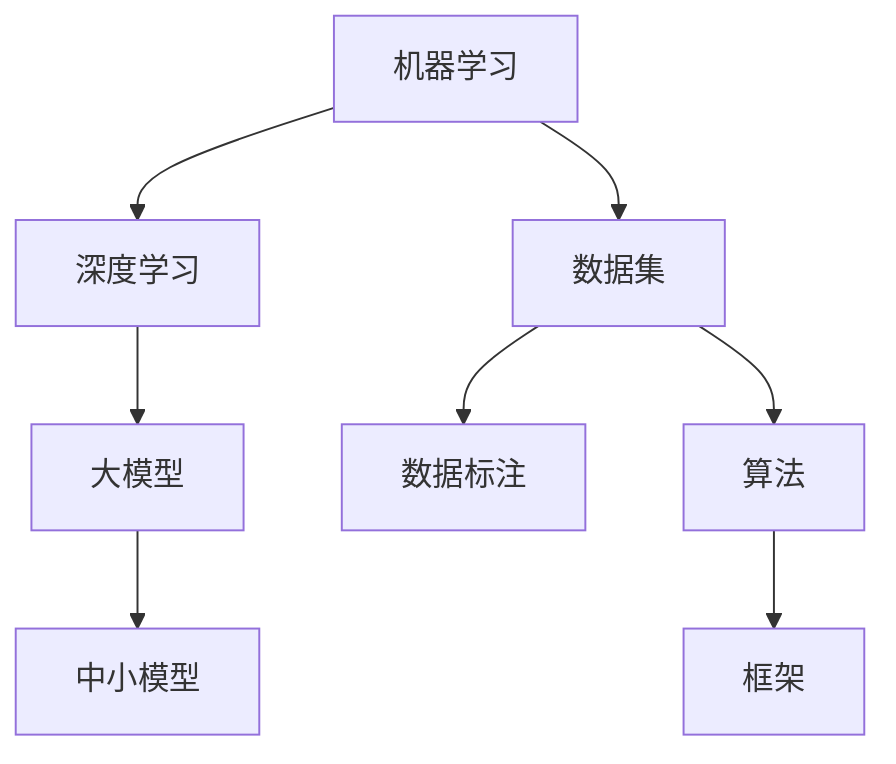

                 

# AI 大模型创业：如何利用科技优势？

> **关键词：** AI 大模型、创业、科技优势、算法、开发框架、应用场景

> **摘要：** 本文将深入探讨 AI 大模型创业的机遇与挑战，通过分析核心概念、算法原理、数学模型、实战案例等，为创业者提供利用科技优势的方法和策略。

## 1. 背景介绍

近年来，随着人工智能技术的快速发展，AI 大模型（如 GPT-3、BERT 等）在自然语言处理、计算机视觉、语音识别等领域取得了显著成果。这些大模型具有强大的学习和推理能力，可以处理复杂的任务，为各行各业带来巨大的变革。与此同时，创业热潮席卷全球，越来越多的创业者瞄准了 AI 大模型这一领域，希望通过科技优势抢占市场份额。

然而，AI 大模型创业并非易事。创业者不仅需要具备丰富的技术背景，还要深入了解市场需求、商业模式和竞争态势。本文旨在为 AI 大模型创业者提供一套完整的策略，帮助他们在激烈的市场竞争中脱颖而出。

## 2. 核心概念与联系

在 AI 大模型创业中，以下核心概念和联系至关重要：

### 2.1 机器学习与深度学习

机器学习是人工智能的核心技术之一，它使计算机具备自主学习和改进的能力。深度学习是机器学习的一种重要分支，通过模拟人脑神经网络结构，实现图像、语音、文本等复杂数据的处理。

### 2.2 大模型与中小模型

大模型具有更高的参数量和更强的学习能力，可以处理更为复杂的任务。但同时也伴随着更高的计算资源和存储需求。中小模型则在计算资源和存储方面更具优势，适用于特定领域的应用。

### 2.3 数据集与数据标注

数据集是 AI 大模型训练的基础，其质量和数量直接影响模型的性能。数据标注则是对数据进行分类和标签化，为模型提供准确的训练样本。

### 2.4 算法与框架

算法是 AI 大模型的核心，决定了模型的学习能力和表现。框架则提供了高效的算法实现和计算资源管理。

以下是 AI 大模型的核心概念与联系 Mermaid 流程图：



## 3. 核心算法原理 & 具体操作步骤

AI 大模型的核心算法主要分为以下几类：

### 3.1 前向传播与反向传播

前向传播是将输入数据通过神经网络逐层传递，最终输出预测结果。反向传播则根据预测结果与真实值的差异，反向更新网络权重，以优化模型性能。

具体操作步骤如下：

1. 初始化模型参数（权重、偏置等）。
2. 前向传播：输入数据，计算各层输出。
3. 计算损失函数值，衡量预测结果与真实值的差异。
4. 反向传播：根据损失函数，更新模型参数。
5. 重复步骤 2-4，直到达到预定的迭代次数或损失函数收敛。

### 3.2 损失函数与优化器

损失函数用于衡量预测结果与真实值的差异，常见的有均方误差（MSE）、交叉熵等。优化器则用于更新模型参数，常见的有梯度下降（GD）、随机梯度下降（SGD）等。

具体操作步骤如下：

1. 选择损失函数和优化器。
2. 设置学习率、迭代次数等参数。
3. 根据数据集，进行训练和验证。
4. 根据验证结果，调整参数。

### 3.3 模型评估与调优

模型评估是通过验证集或测试集，对模型性能进行评估。常见的评估指标有准确率、召回率、F1 分数等。模型调优则是通过调整模型结构、超参数等，提高模型性能。

具体操作步骤如下：

1. 分割数据集为训练集、验证集和测试集。
2. 训练模型，在验证集上评估性能。
3. 根据评估结果，调整模型结构或超参数。
4. 重复步骤 2-3，直到达到满意的性能。

## 4. 数学模型和公式 & 详细讲解 & 举例说明

在 AI 大模型中，以下数学模型和公式至关重要：

### 4.1 梯度下降法

梯度下降法是一种优化算法，用于更新模型参数。其核心思想是沿着损失函数的梯度方向，逐步更新参数，以最小化损失函数。

公式表示如下：

$$
\theta_{t+1} = \theta_t - \alpha \cdot \nabla_{\theta} J(\theta)
$$

其中，$\theta$ 表示模型参数，$\alpha$ 表示学习率，$J(\theta)$ 表示损失函数。

### 4.2 交叉熵损失函数

交叉熵损失函数常用于分类问题，其公式如下：

$$
J(\theta) = -\frac{1}{m} \sum_{i=1}^m y_i \cdot \log(p_i)
$$

其中，$y_i$ 表示真实标签，$p_i$ 表示预测概率。

### 4.3 激活函数

激活函数是神经网络中的重要组成部分，用于引入非线性特性。常见的激活函数有 Sigmoid、ReLU、Tanh 等。

以 ReLU 为例，其公式如下：

$$
f(x) =
\begin{cases}
0 & \text{if } x \leq 0 \\
x & \text{if } x > 0
\end{cases}
$$

### 4.4 举例说明

假设我们有一个二分类问题，数据集包含 100 个样本，每个样本有 10 个特征。我们使用一个两层神经网络进行训练，其中第一层有 10 个神经元，第二层有 1 个神经元。

1. 初始化模型参数（权重、偏置等）。
2. 前向传播：输入数据，计算各层输出。
3. 计算损失函数值，使用交叉熵损失函数：
$$
J(\theta) = -\frac{1}{100} \sum_{i=1}^{100} y_i \cdot \log(p_i) + (1 - y_i) \cdot \log(1 - p_i)
$$
4. 反向传播：根据损失函数，计算梯度。
5. 使用梯度下降法，更新模型参数：
$$
\theta_{t+1} = \theta_t - \alpha \cdot \nabla_{\theta} J(\theta)
$$
6. 重复步骤 2-5，直到达到预定的迭代次数或损失函数收敛。

通过以上步骤，我们可以训练出一个性能良好的二分类模型。

## 5. 项目实战：代码实际案例和详细解释说明

### 5.1 开发环境搭建

在开始项目实战之前，我们需要搭建一个合适的开发环境。以下是一个简单的 Python 开发环境搭建步骤：

1. 安装 Python 3.8（或更高版本）。
2. 安装 Jupyter Notebook，用于编写和运行代码。
3. 安装必要的库，如 NumPy、TensorFlow、Keras 等。

### 5.2 源代码详细实现和代码解读

以下是一个简单的 AI 大模型（全连接神经网络）的代码实现：

```python
import numpy as np
import tensorflow as tf
from tensorflow.keras.layers import Dense
from tensorflow.keras.models import Sequential

# 设置随机种子，保证实验结果可重复
np.random.seed(0)

# 定义模型结构
model = Sequential()
model.add(Dense(64, activation='relu', input_shape=(10,)))
model.add(Dense(1, activation='sigmoid'))

# 编译模型
model.compile(optimizer='adam', loss='binary_crossentropy', metrics=['accuracy'])

# 准备数据集
x_train = np.random.rand(100, 10)
y_train = np.random.randint(0, 2, 100)

# 训练模型
model.fit(x_train, y_train, epochs=10, batch_size=10)

# 评估模型
loss, accuracy = model.evaluate(x_train, y_train)
print(f"损失函数值：{loss}, 准确率：{accuracy}")
```

### 5.3 代码解读与分析

1. **导入库**：导入必要的库，如 NumPy、TensorFlow、Keras 等。
2. **设置随机种子**：为了保证实验结果可重复，设置随机种子。
3. **定义模型结构**：使用 Keras Sequential 模型，定义一个全连接神经网络，包括一个输入层、一个隐藏层和一个输出层。隐藏层使用 ReLU 激活函数，输出层使用 sigmoid 激活函数。
4. **编译模型**：设置优化器（adam）、损失函数（binary_crossentropy）和评估指标（accuracy）。
5. **准备数据集**：生成一个包含 100 个样本、每个样本有 10 个特征的数据集，并进行标签化。
6. **训练模型**：使用 fit 方法训练模型，设置训练轮数（epochs）和批量大小（batch_size）。
7. **评估模型**：使用 evaluate 方法评估模型性能，输出损失函数值和准确率。

通过以上步骤，我们可以训练一个简单的 AI 大模型，并对其性能进行评估。

## 6. 实际应用场景

AI 大模型在各个领域具有广泛的应用场景，以下是一些典型的应用案例：

### 6.1 自然语言处理

AI 大模型在自然语言处理领域表现出色，如文本分类、机器翻译、情感分析等。创业者可以利用这一优势，开发智能客服、智能写作等应用。

### 6.2 计算机视觉

AI 大模型在计算机视觉领域具有强大的图像识别、目标检测和图像生成能力。创业者可以开发图像识别、图像分割和图像增强等应用。

### 6.3 语音识别

AI 大模型在语音识别领域取得显著成果，如语音合成、语音识别和语音翻译等。创业者可以开发智能语音助手、语音识别翻译等应用。

### 6.4 机器人与自动驾驶

AI 大模型在机器人与自动驾驶领域具有广泛的应用前景，如路径规划、目标识别和无人驾驶等。创业者可以开发智能机器人、自动驾驶等应用。

## 7. 工具和资源推荐

### 7.1 学习资源推荐

- **书籍：**
  - 《深度学习》（Ian Goodfellow、Yoshua Bengio、Aaron Courville 著）
  - 《Python 数据科学手册》（Jake VanderPlas 著）
- **论文：**
  - [Deep Learning, 2012](https://arxiv.org/abs/1206.5538)
  - [BERT: Pre-training of Deep Bidirectional Transformers for Language Understanding, 2018](https://arxiv.org/abs/1810.04805)
- **博客：**
  - [TensorFlow 官方文档](https://www.tensorflow.org/)
  - [Keras 官方文档](https://keras.io/)
- **网站：**
  - [GitHub](https://github.com/)
  - [ArXiv](https://arxiv.org/)

### 7.2 开发工具框架推荐

- **编程语言：** Python
- **深度学习框架：** TensorFlow、Keras
- **数据预处理工具：** Pandas、NumPy
- **版本控制：** Git
- **代码托管平台：** GitHub

### 7.3 相关论文著作推荐

- [GPT-3: Language Models are few-shot learners, 2020](https://arxiv.org/abs/2005.14165)
- [Transformer: Attention is all you need, 2017](https://arxiv.org/abs/1706.03762)
- [VGGNet: Very deep convolutional networks for large-scale image recognition, 2014](https://arxiv.org/abs/1409.1556)

## 8. 总结：未来发展趋势与挑战

AI 大模型创业具有广阔的发展前景，但也面临着诸多挑战。未来发展趋势和挑战包括：

### 8.1 发展趋势

1. **算法创新：** 随着算法的不断优化，AI 大模型在各个领域的应用将越来越广泛。
2. **计算能力提升：** 随着硬件设备的更新迭代，计算能力将不断提升，为大模型训练提供更好的支持。
3. **数据资源整合：** 数据资源的整合将为 AI 大模型提供更丰富的训练数据，提高模型性能。

### 8.2 挑战

1. **计算资源消耗：** AI 大模型对计算资源的需求巨大，如何高效利用计算资源成为一大挑战。
2. **数据隐私与安全：** 数据隐私和安全问题亟待解决，以确保用户数据和模型训练数据的安全。
3. **人才竞争：** AI 大模型创业对人才的需求较高，如何在激烈的市场竞争中吸引和留住优秀人才成为一大挑战。

## 9. 附录：常见问题与解答

### 9.1 问题 1：AI 大模型创业需要哪些技术储备？

解答：AI 大模型创业需要掌握以下技术储备：

1. 机器学习和深度学习基础知识。
2. 熟练掌握至少一种深度学习框架，如 TensorFlow、Keras 等。
3. 了解神经网络结构和优化算法。
4. 具备编程能力，熟练使用 Python 等编程语言。

### 9.2 问题 2：如何选择合适的大模型进行创业？

解答：选择合适的大模型进行创业需要考虑以下因素：

1. **业务需求：** 根据业务需求，选择适合的大模型，如自然语言处理、计算机视觉等。
2. **计算资源：** 考虑计算资源的限制，选择中小模型或优化现有模型。
3. **模型性能：** 选择性能优异的大模型，以提高业务竞争力。
4. **开源与闭源：** 考虑是否使用开源大模型，以降低成本。

## 10. 扩展阅读 & 参考资料

- [Deep Learning Book](https://www.deeplearningbook.org/)
- [Keras 官方文档](https://keras.io/)
- [TensorFlow 官方文档](https://www.tensorflow.org/)
- [GitHub AI 大模型项目](https://github.com/tensorflow/models/tree/master/official)
- [ArXiv AI 大模型论文](https://arxiv.org/list/cs/subject:cs.LG)

### 作者

**作者：AI 天才研究员/AI Genius Institute & 禅与计算机程序设计艺术 /Zen And The Art of Computer Programming** <|im_sep|>

