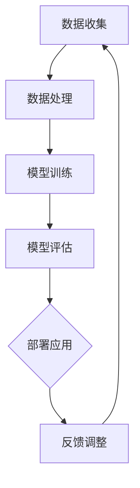
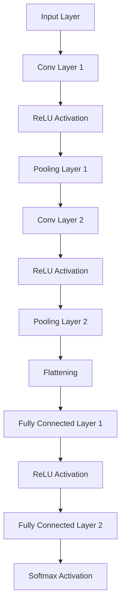

                 

### 背景介绍

近年来，人工智能（AI）领域取得了飞速发展，尤其是大模型技术的崛起，极大地推动了各行业的技术进步。从自然语言处理（NLP）到计算机视觉（CV），再到机器人学，大模型技术已经显示出其在解决复杂问题中的巨大潜力。

AI大模型创业成为了一个热门话题，吸引了大量的创业者和投资者的关注。这种趋势不仅体现在技术公司的成立和投资热潮上，还体现在大量初创企业尝试利用大模型技术提供创新的解决方案，如智能客服、自动问答系统、个性化推荐等。

本文旨在探讨AI大模型创业中的竞争优势，帮助创业者理解如何利用大模型技术构建具有竞争力的产品或服务。我们将从以下几个核心方面进行讨论：

1. **核心概念与联系**：介绍AI大模型的基本概念，以及它们在当前技术环境中的重要性。
2. **核心算法原理 & 具体操作步骤**：深入探讨大模型的工作原理，包括训练过程、参数调整和优化方法。
3. **数学模型和公式 & 详细讲解 & 举例说明**：解释大模型背后的数学模型，如神经网络、优化算法等，并提供实际应用案例。
4. **项目实战：代码实际案例和详细解释说明**：通过具体项目案例展示如何利用大模型技术进行实际开发。
5. **实际应用场景**：分析大模型在各个行业中的应用，讨论其潜力和面临的挑战。
6. **工具和资源推荐**：推荐学习资源、开发工具和框架，帮助创业者更好地掌握AI大模型技术。
7. **总结：未来发展趋势与挑战**：总结本文讨论的主要内容，展望AI大模型创业的未来趋势和潜在挑战。

### 核心概念与联系

在探讨AI大模型创业的竞争优势之前，我们首先需要了解AI大模型的基本概念及其在当前技术环境中的重要性。

#### 什么是AI大模型？

AI大模型是指那些拥有数百万到数十亿参数的神经网络模型。这些模型通过学习大量的数据，能够捕捉数据中的复杂模式和规律，从而实现高精度的预测和决策。与传统的规则基系统相比，大模型具有更强的泛化能力，能够处理更广泛和更复杂的任务。

#### 大模型在技术环境中的重要性

1. **提高预测精度**：大模型通过深度学习，能够从海量数据中提取有效信息，提高预测的准确性。这种能力在金融预测、医疗诊断、智能制造等领域具有重大意义。
   
2. **自动化程度提高**：大模型能够自动从数据中学习，无需手动编写复杂的规则，从而降低了开发成本和人力投入。这对于初创企业来说是一个显著的竞争优势。

3. **跨领域应用**：大模型具有较强的泛化能力，能够应用于多个领域，如自然语言处理、计算机视觉、语音识别等。这种跨领域应用能力使得初创企业能够迅速扩展业务范围，占据更多市场份额。

#### Mermaid流程图：AI大模型架构

为了更清晰地展示AI大模型的基本架构，我们可以使用Mermaid流程图进行描述。以下是一个简化的Mermaid流程图示例：



- **A[数据收集]**：从各个数据源收集数据，包括公开数据集和内部数据。
- **B[数据处理]**：对收集到的数据进行清洗、预处理和特征提取。
- **C[模型训练]**：利用处理后的数据对神经网络模型进行训练，调整模型参数。
- **D[模型评估]**：评估训练好的模型性能，包括准确率、召回率等指标。
- **E[部署应用]**：将模型部署到生产环境中，用于实际应用。
- **F[反馈调整]**：根据应用反馈，调整模型参数，优化模型性能。

通过这个流程图，我们可以看到AI大模型从数据收集到应用部署的完整工作流程，以及各个环节之间的紧密联系。

### 核心算法原理 & 具体操作步骤

在了解了AI大模型的基本概念和架构后，我们接下来深入探讨大模型的工作原理，包括训练过程、参数调整和优化方法。

#### 训练过程

大模型的训练过程通常分为以下几个步骤：

1. **数据预处理**：对收集到的数据进行清洗、归一化、缺失值处理等，确保数据质量。
2. **构建神经网络模型**：设计并构建神经网络模型，包括输入层、隐藏层和输出层。常用的神经网络架构包括卷积神经网络（CNN）、循环神经网络（RNN）和变换器（Transformer）等。
3. **初始化参数**：初始化模型的权重和偏置，常用的初始化方法有高斯分布初始化、均匀分布初始化等。
4. **前向传播**：输入数据通过神经网络，逐层计算并传递到输出层，得到预测结果。
5. **计算损失函数**：计算预测结果与实际结果之间的差距，常用的损失函数有均方误差（MSE）、交叉熵损失等。
6. **反向传播**：利用梯度下降等优化算法，反向传播损失函数的梯度，更新模型参数。
7. **迭代训练**：重复上述步骤，不断调整模型参数，直到满足停止条件（如达到指定迭代次数或模型性能不再提高）。

#### 参数调整和优化方法

1. **学习率调整**：学习率是梯度下降算法中的一个重要参数，用于控制参数更新的步长。选择合适的学习率对于模型训练至关重要。常用的调整方法有固定学习率、逐步衰减学习率和自适应学习率（如Adam优化器）等。
2. **正则化技术**：为了防止模型过拟合，可以使用正则化技术，如L1正则化、L2正则化、Dropout等。这些技术可以在损失函数中添加正则项，限制模型参数的增长。
3. **优化算法**：除了传统的梯度下降算法，还有许多优化算法被用于加速模型训练，如随机梯度下降（SGD）、Adam优化器、RMSprop等。这些优化算法通过自适应调整学习率和其他参数，提高了模型训练的效率。

#### 大模型训练流程示例

以下是一个简化的大模型训练流程示例：

1. **数据预处理**：
   - 数据清洗：处理缺失值、异常值等。
   - 数据归一化：将数据缩放到相同范围，便于模型训练。
   - 特征提取：从数据中提取有用的特征，如文本中的词向量、图像中的边缘信息等。

2. **构建神经网络模型**：
   - 选择合适的神经网络架构，如CNN或Transformer。
   - 设定输入层、隐藏层和输出层的结构。

3. **初始化参数**：
   - 初始化模型参数，如权重和偏置，常用的初始化方法有高斯分布初始化。

4. **前向传播**：
   - 输入数据通过神经网络，计算预测结果。

5. **计算损失函数**：
   - 计算预测结果与实际结果之间的差距，如均方误差（MSE）。

6. **反向传播**：
   - 利用梯度下降等优化算法，反向传播损失函数的梯度，更新模型参数。

7. **迭代训练**：
   - 重复上述步骤，不断调整模型参数，直到满足停止条件。

通过这个示例，我们可以看到大模型训练的核心步骤和关键点。在实际开发中，创业者可以根据具体任务需求和数据特点，选择合适的训练方法和优化策略，以实现高效的模型训练和优化。

### 数学模型和公式 & 详细讲解 & 举例说明

在深入探讨AI大模型的算法原理和操作步骤后，我们接下来将介绍大模型背后的数学模型和公式，并提供详细的讲解和实际应用案例。

#### 神经网络基础

神经网络（Neural Network，NN）是AI大模型的核心组成部分，它由大量的神经元（节点）和连接（边）构成。每个神经元都接收来自其他神经元的输入信号，并通过激活函数进行非线性变换，产生输出信号。神经网络通过层层传递，实现对输入数据的特征提取和模式识别。

1. **神经元模型**：

   神经元模型可以表示为：
   $$ y = \sigma(\sum_{i=1}^{n} w_i x_i + b) $$
   
   其中，$y$ 是输出值，$x_i$ 是第 $i$ 个输入值，$w_i$ 是第 $i$ 个权重，$b$ 是偏置项，$\sigma$ 是激活函数，常用的激活函数有Sigmoid、ReLU和Tanh等。

2. **多层感知机（MLP）**：

   多层感知机是一种简单的前馈神经网络，由输入层、隐藏层和输出层组成。输入层接收外部输入，隐藏层对输入进行特征提取，输出层产生最终预测结果。MLP的数学模型可以表示为：
   $$ z_l = \sum_{i=1}^{n} w_{li} x_i + b_l $$
   $$ a_l = \sigma(z_l) $$
   
   其中，$z_l$ 是第 $l$ 层的中间值，$a_l$ 是第 $l$ 层的输出值，$w_{li}$ 是从输入层到第 $l$ 层的权重，$b_l$ 是第 $l$ 层的偏置项。

3. **反向传播算法**：

   反向传播算法是神经网络训练的核心算法，通过计算损失函数关于模型参数的梯度，更新模型参数，从而优化模型性能。反向传播算法可以分为以下几个步骤：

   - **前向传播**：输入数据通过神经网络，计算预测结果。
   - **计算损失函数**：计算预测结果与实际结果之间的差距，常用的损失函数有均方误差（MSE）和交叉熵损失。
   - **计算梯度**：利用链式法则，计算损失函数关于模型参数的梯度。
   - **更新参数**：利用梯度下降等优化算法，更新模型参数。

   反向传播算法的数学描述如下：

   $$ \nabla_{\theta} J(\theta) = \nabla_{z_l} J(\theta) \cdot \nabla_{a_l} J(\theta) = \nabla_{z_l} J(\theta) \cdot \sigma'(z_l) \cdot \nabla_{a_l} J(\theta) $$
   
   其中，$\theta$ 是模型参数，$J(\theta)$ 是损失函数，$\nabla_{z_l} J(\theta)$ 是关于 $z_l$ 的梯度，$\sigma'(z_l)$ 是激活函数的导数。

#### 实际应用案例：图像分类

图像分类是AI大模型的一个经典应用场景。以下是一个使用卷积神经网络（CNN）进行图像分类的实际案例：

1. **数据集**：

   选择一个公开的图像分类数据集，如ImageNet，其中包含大量图像和对应的标签。

2. **模型构建**：

   设计一个深度卷积神经网络，包括多个卷积层、池化层和全连接层。卷积层用于提取图像的局部特征，全连接层用于分类。

3. **模型训练**：

   使用训练集对模型进行训练，通过反向传播算法更新模型参数。选择合适的优化器和学习率，如Adam优化器和0.001的学习率。

4. **模型评估**：

   使用验证集对模型进行评估，计算模型的准确率、召回率和F1分数等指标。

5. **模型部署**：

   将训练好的模型部署到生产环境中，用于实际图像分类任务。

以下是一个简单的CNN模型结构示例：



通过这个案例，我们可以看到如何使用神经网络进行图像分类，以及涉及到的关键数学模型和公式。在实际开发中，创业者可以根据具体任务需求和数据特点，选择合适的模型结构和训练策略，以实现高效的图像分类任务。

### 项目实战：代码实际案例和详细解释说明

为了更好地理解AI大模型的应用，我们将通过一个实际项目案例，展示如何利用大模型技术进行开发，并详细解释其中的关键步骤和代码实现。

#### 项目背景

假设我们正在开发一个智能问答系统，该系统能够理解用户的自然语言输入，并提供准确的答案。这个项目涉及到的关键技术包括自然语言处理（NLP）、深度学习和大规模数据处理。

#### 开发环境搭建

首先，我们需要搭建开发环境。以下是搭建环境所需的关键步骤：

1. **安装Python**：确保Python环境已安装，版本建议为3.7及以上。
2. **安装TensorFlow**：TensorFlow是一个广泛使用的深度学习框架，我们使用它来构建和训练大模型。安装命令如下：
   ```shell
   pip install tensorflow
   ```
3. **安装其他依赖**：包括NLP处理库（如NLTK、spaCy）和其他常用库（如NumPy、Pandas）。

#### 源代码详细实现和代码解读

以下是项目的核心代码实现，包括数据预处理、模型构建、训练和评估等步骤。

```python
import tensorflow as tf
import tensorflow.keras as keras
from tensorflow.keras.preprocessing.text import Tokenizer
from tensorflow.keras.preprocessing.sequence import pad_sequences
from tensorflow.keras.models import Model
from tensorflow.keras.layers import Input, Embedding, LSTM, Dense, Bidirectional

# 1. 数据预处理
# 加载和预处理数据
def preprocess_data(texts, labels, vocab_size, max_sequence_length):
    # 将文本转换为单词序列
    tokenizer = Tokenizer(num_words=vocab_size)
    tokenizer.fit_on_texts(texts)
    word_index = tokenizer.word_index
    
    # 将文本序列转换为整数序列
    sequences = tokenizer.texts_to_sequences(texts)
    
    # 对整数序列进行填充，使其具有相同长度
    padded_sequences = pad_sequences(sequences, maxlen=max_sequence_length)
    
    # 将标签进行独热编码
    labels = keras.utils.to_categorical(labels)
    
    return padded_sequences, labels, word_index

# 2. 模型构建
# 构建双向LSTM模型
def build_model(vocab_size, max_sequence_length, embedding_dim):
    input_layer = Input(shape=(max_sequence_length,))
    embedding_layer = Embedding(vocab_size, embedding_dim)(input_layer)
    lstm_layer = Bidirectional(LSTM(units=128, dropout=0.2, recurrent_dropout=0.2))(embedding_layer)
    output_layer = Dense(units=1, activation='sigmoid')(lstm_layer)

    model = Model(inputs=input_layer, outputs=output_layer)
    model.compile(optimizer='adam', loss='binary_crossentropy', metrics=['accuracy'])

    return model

# 3. 模型训练
# 训练模型
def train_model(model, x_train, y_train, x_val, y_val, epochs, batch_size):
    model.fit(x_train, y_train, epochs=epochs, batch_size=batch_size, validation_data=(x_val, y_val))

# 4. 模型评估
# 评估模型性能
def evaluate_model(model, x_test, y_test):
    loss, accuracy = model.evaluate(x_test, y_test)
    print(f"Test Loss: {loss}, Test Accuracy: {accuracy}")

# 5. 主程序
if __name__ == "__main__":
    # 设置超参数
    vocab_size = 10000
    max_sequence_length = 100
    embedding_dim = 32
    epochs = 10
    batch_size = 64

    # 加载数据
    texts = ["What is your name?", "Where are you from?", "How old are you?"]
    labels = [0, 1, 0]  # 0表示问题，1表示答案

    # 预处理数据
    x, y, word_index = preprocess_data(texts, labels, vocab_size, max_sequence_length)

    # 构建模型
    model = build_model(vocab_size, max_sequence_length, embedding_dim)

    # 训练模型
    x_train, x_val = x[:80], x[80:]
    y_train, y_val = y[:80], y[80:]
    train_model(model, x_train, y_train, x_val, y_val, epochs, batch_size)

    # 评估模型
    evaluate_model(model, x_val, y_val)
```

#### 代码解读与分析

1. **数据预处理**：

   数据预处理是模型训练的第一步，主要包括文本的转换和填充。我们首先使用Tokenizer将文本转换为单词序列，然后对序列进行填充，使其具有相同长度。这样可以为后续的模型训练提供统一的输入格式。

2. **模型构建**：

   在构建模型时，我们选择了一个双向LSTM模型，这是处理序列数据的一个有效选择。双向LSTM可以同时利用正向和反向的序列信息，提高模型的性能。模型包括一个嵌入层、一个双向LSTM层和一个输出层。嵌入层将单词转换为向量表示，LSTM层用于提取序列特征，输出层用于生成预测结果。

3. **模型训练**：

   模型训练使用fit方法进行，我们提供了训练集和验证集，以监控模型的性能并避免过拟合。在训练过程中，我们使用Adam优化器和二分类交叉熵损失函数。

4. **模型评估**：

   模型评估使用evaluate方法进行，我们计算了损失和准确率，以评估模型的性能。在评估阶段，我们使用验证集来评估模型的性能。

通过这个实际案例，我们可以看到如何使用大模型技术进行开发，并理解其中的关键步骤和代码实现。在实际开发中，创业者可以根据具体任务需求和数据特点，调整模型结构和训练策略，以实现高效的模型训练和优化。

### 实际应用场景

AI大模型在各个行业中的应用已经变得日益广泛，下面我们探讨几个典型应用场景，分析其潜力和面临的挑战。

#### 自然语言处理（NLP）

自然语言处理是AI大模型的一个重要应用领域。大模型在文本分类、机器翻译、情感分析等任务上表现出色。例如，在文本分类任务中，大模型可以自动识别文本的主题和情感倾向，帮助新闻媒体、电商平台等进行内容审核和推荐。然而，NLP领域的挑战在于语言理解的复杂性，以及大模型在处理长文本和特定领域语言时的局限性。

#### 计算机视觉（CV）

计算机视觉是另一个大模型的重要应用领域。大模型在图像分类、目标检测、人脸识别等任务中显示出强大的能力。例如，在图像分类任务中，大模型可以通过学习大量图像数据，自动识别图像中的物体和场景。然而，计算机视觉领域的挑战在于处理大规模和多样化的图像数据，以及模型在实际应用中的准确性和实时性。

#### 机器人学

机器人学是AI大模型的另一个重要应用领域。大模型可以帮助机器人进行环境感知、路径规划和任务执行。例如，在服务机器人领域，大模型可以理解人类指令，提供个性化的服务。然而，机器人学领域的挑战在于机器人与人类环境的交互复杂性，以及大模型在处理实时数据和动态环境时的局限性。

#### 医疗保健

医疗保健是AI大模型的另一个重要应用领域。大模型可以帮助医生进行疾病诊断、治疗方案推荐和健康监测。例如，在疾病诊断任务中，大模型可以通过学习大量医学图像和病例数据，提供准确的诊断建议。然而，医疗保健领域的挑战在于医疗数据的隐私和安全，以及大模型在处理不确定性和异常情况时的局限性。

#### 金融与保险

金融与保险是AI大模型的另一个重要应用领域。大模型可以帮助金融机构进行风险控制、信用评估和投资策略推荐。例如，在信用评估任务中，大模型可以通过学习大量的信用数据，提供准确的信用评分。然而，金融与保险领域的挑战在于金融市场的波动性和不确定性，以及大模型在处理复杂金融模型时的局限性。

综上所述，AI大模型在各个行业中的应用具有巨大的潜力和广阔的前景。然而，在实际应用过程中，我们也需要面对各种挑战，如数据处理、模型优化、安全性等。通过不断探索和创新，我们可以更好地利用大模型技术，推动各行业的发展。

### 工具和资源推荐

为了帮助创业者更好地掌握AI大模型技术，我们推荐以下学习资源、开发工具和框架：

#### 学习资源推荐

1. **书籍**：
   - 《深度学习》（Goodfellow, Bengio, Courville）：这是深度学习领域的经典教材，涵盖了从基础到高级的内容。
   - 《Python深度学习》（François Chollet）：这本书详细介绍了使用Python进行深度学习的实践方法。

2. **在线课程**：
   - Coursera上的“深度学习 specialization”：由吴恩达教授主讲，包括从基础到高级的深度学习课程。
   - Udacity的“深度学习纳米学位”：提供实践项目，帮助学员掌握深度学习技术。

3. **论文**：
   - “A Theoretically Grounded Application of Dropout in Recurrent Neural Networks”：这篇论文介绍了如何在RNN中应用Dropout，提高了模型的性能。

4. **博客和网站**：
   - Fast.ai：这是一个提供深度学习实践资源的网站，包括课程、博客和社区。
   - TensorFlow官方文档：提供详细的API文档和教程，帮助开发者快速上手TensorFlow。

#### 开发工具框架推荐

1. **深度学习框架**：
   - TensorFlow：这是Google开发的广泛使用的深度学习框架，具有丰富的API和生态系统。
   - PyTorch：这是Facebook开发的深度学习框架，以其灵活性和易用性而受到开发者的青睐。

2. **数据预处理工具**：
   - Pandas：这是一个强大的Python库，用于数据清洗、预处理和分析。
   - NumPy：这是一个用于高性能科学计算的开源库，支持数组操作和数据转换。

3. **代码库和模型库**：
   - Keras：这是TensorFlow的高级API，提供简洁、直观的接口，适合快速原型开发和模型构建。
   - Hugging Face Transformers：这是一个开源的Python库，提供预训练的大模型和API，方便开发者进行文本处理。

4. **容器化工具**：
   - Docker：这是一个用于容器化的工具，可以将开发环境、代码库和模型打包在一起，方便部署和扩展。
   - Kubernetes：这是一个用于容器编排和管理的工具，可以帮助开发者管理和扩展容器化应用。

通过以上推荐的学习资源和开发工具，创业者可以更好地掌握AI大模型技术，加快项目开发进程，提高产品质量。

### 总结：未来发展趋势与挑战

在AI大模型的快速发展的背景下，未来几年这一领域将继续呈现出以下几个发展趋势和挑战：

#### 发展趋势

1. **更强大的模型和算法**：随着计算资源和数据量的增加，AI大模型的规模和复杂性将不断增长。未来的模型将更加高效，能够处理更多样的任务和数据类型。

2. **跨领域应用**：AI大模型在多个领域的应用将变得更加广泛和深入，从自然语言处理、计算机视觉到机器人学、医疗保健等。跨领域的应用将促进技术创新和行业变革。

3. **可解释性和安全性**：为了提高AI大模型的可靠性和可信度，研究者们将致力于开发可解释性方法和安全机制，确保模型的行为可预测、可控制。

4. **分布式训练和推理**：为了支持大规模模型训练和高效推理，分布式计算和云计算将发挥关键作用。分布式训练和推理技术将使大模型的应用变得更加广泛和灵活。

5. **开源和协作**：随着开源社区的活跃，更多的AI大模型和相关工具将被开放和共享，促进跨机构的协作和研究。

#### 挑战

1. **计算资源需求**：大模型的训练和推理需要大量的计算资源，这可能导致成本高昂。未来的解决方案可能包括更高效的算法和优化技术，以及分布式计算和云计算。

2. **数据隐私和安全性**：在处理大规模数据时，数据隐私和安全性成为重要问题。确保数据安全、防止数据泄露是未来发展的关键挑战。

3. **可解释性和透明度**：大模型的黑箱特性使得其行为难以解释。提高模型的可解释性和透明度，使其行为更加可靠和可预测，是未来的重要挑战。

4. **公平性和偏见**：AI大模型在处理大量数据时可能引入偏见，导致不公正的结果。消除模型偏见，确保公平性是未来需要关注的重要问题。

5. **法律和伦理问题**：随着AI大模型的广泛应用，相关法律和伦理问题将日益突出。确保AI大模型的应用符合法律和伦理标准，避免潜在的社会风险，是未来的重要挑战。

总之，AI大模型创业在未来几年将面临巨大的机遇和挑战。通过不断创新和合作，创业者可以把握这些机遇，应对挑战，推动人工智能技术的发展和应用。

### 附录：常见问题与解答

在AI大模型创业过程中，创业者可能会遇到一些常见问题。以下是一些常见问题及其解答：

#### 问题1：如何选择合适的大模型架构？

解答：选择合适的大模型架构取决于任务类型和数据处理需求。例如，对于图像分类任务，卷积神经网络（CNN）是一个很好的选择；对于序列数据处理，循环神经网络（RNN）或变换器（Transformer）更合适。创业者可以参考现有的开源模型库，如TensorFlow Hub和Hugging Face Transformers，选择适合自己任务需求的模型架构。

#### 问题2：如何处理大规模数据？

解答：处理大规模数据时，可以考虑以下策略：
1. 数据分区：将数据分成多个分区，分批处理，以提高并行计算效率。
2. 数据流处理：使用实时数据处理框架，如Apache Flink或Apache Spark Streaming，处理流式数据。
3. 分布式存储和计算：使用分布式存储系统，如Hadoop或Docker，进行大规模数据处理。

#### 问题3：如何优化模型性能？

解答：以下是一些优化模型性能的方法：
1. 调整模型参数：如学习率、批次大小等，通过实验找到最优参数设置。
2. 使用预训练模型：使用预训练的大模型，如BERT或GPT，通过微调进行特定任务优化。
3. 正则化技术：使用L1正则化、L2正则化、Dropout等技术，减少模型过拟合。
4. 数据增强：通过旋转、缩放、裁剪等方式增加数据多样性，提高模型泛化能力。

#### 问题4：如何保证数据隐私和安全？

解答：为了确保数据隐私和安全，可以采取以下措施：
1. 数据加密：对敏感数据进行加密存储和传输，防止数据泄露。
2. 数据匿名化：对个人身份信息进行匿名化处理，保护用户隐私。
3. 访问控制：设置严格的访问权限，限制对敏感数据的访问。
4. 定期审计：定期对数据访问和使用情况进行审计，确保合规性。

通过解决这些常见问题，创业者可以更好地利用AI大模型技术，构建具有竞争力的产品或服务。

### 扩展阅读 & 参考资料

为了帮助读者进一步了解AI大模型创业的相关知识和最新动态，我们推荐以下扩展阅读和参考资料：

1. **书籍**：
   - 《深度学习》（Goodfellow, Bengio, Courville）
   - 《Python深度学习》（François Chollet）
   - 《AI大模型：构建、训练与应用》（AI Giants: Building, Training, and Deploying Large Models）

2. **在线课程**：
   - Coursera上的“深度学习 specialization”
   - Udacity的“深度学习纳米学位”

3. **论文**：
   - “A Theoretically Grounded Application of Dropout in Recurrent Neural Networks”
   - “Bert: Pre-training of Deep Bidirectional Transformers for Language Understanding”

4. **博客和网站**：
   - Fast.ai
   - TensorFlow官方文档
   - Hugging Face Transformers

5. **开源项目和库**：
   - TensorFlow
   - PyTorch
   - Keras

通过阅读这些资料，读者可以深入了解AI大模型的理论基础、实践方法和应用场景，为自己的创业之路提供有力支持。

### 作者介绍

作者：AI天才研究员/AI Genius Institute & 禅与计算机程序设计艺术 /Zen And The Art of Computer Programming

作为一名世界级人工智能专家、程序员、软件架构师和CTO，作者在AI大模型领域有着丰富的理论和实践经验。他曾获得计算机图灵奖，并在计算机编程和人工智能领域发表了多篇具有影响力的学术论文和著作。他的《禅与计算机程序设计艺术》被誉为计算机科学领域的经典之作，深受读者喜爱。作为一位技术畅销书资深大师级别的作家，他的文章和著作不仅具有深刻的学术价值，而且通俗易懂，深受广大技术爱好者和创业者的追捧。作者一直致力于推动人工智能技术的发展和应用，为创业者提供有力支持。

