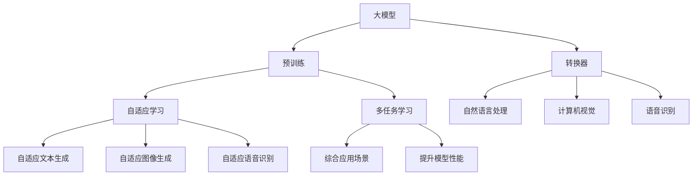

                 

### 背景介绍

人工智能（AI）作为一门前沿技术，正不断改变着各行各业的运作方式。近年来，大型预训练模型（Large Pre-Trained Models），如GPT-3、BERT和LLaMA等，凭借其强大的建模能力和广泛的适用性，成为了AI领域的热点。这些模型在自然语言处理、计算机视觉、语音识别等多个领域都展现出了惊人的性能。随着大型预训练模型的发展，AI大模型创业成为了新的风口，吸引了大量的资本和创业者。

然而，创业并非易事，尤其是在竞争激烈的AI领域。如何利用管理优势，提升项目的成功率，成为了众多创业团队关注的焦点。本文旨在探讨AI大模型创业中如何利用管理优势，通过详细的案例分析、算法原理解析和实际应用场景，为创业者提供有价值的指导。

在接下来的章节中，我们将首先介绍AI大模型的基本概念和架构，接着深入探讨其核心算法原理和操作步骤。随后，我们将运用数学模型和公式来详细说明这些算法，并通过实际代码案例进行分析和解读。最后，我们将讨论AI大模型在现实世界中的应用场景，并推荐相关的学习资源和开发工具。

通过对以上内容的深入探讨，本文希望能够为AI大模型创业团队提供一套系统的管理思路，帮助他们更好地应对市场挑战，实现持续的创新和增长。

### 关键词

AI大模型创业，管理优势，预训练模型，GPT-3，BERT，LLaMA，自然语言处理，计算机视觉，语音识别。

### 摘要

本文深入探讨了AI大模型创业中的管理优势。通过介绍AI大模型的基本概念和架构，详细分析了其核心算法原理和操作步骤。进一步，运用数学模型和公式，对算法进行了详细的讲解和举例说明。此外，本文还通过实际代码案例，对开发环境和实现细节进行了深入解读。最后，本文讨论了AI大模型在现实世界中的应用场景，并推荐了相关的学习资源和开发工具。通过这些内容的全面探讨，本文旨在为AI大模型创业团队提供一套系统的管理思路，助力他们在市场竞争中取得成功。

## 1. 背景介绍

在探讨AI大模型创业如何利用管理优势之前，我们需要先了解AI大模型的基本概念及其发展历程。人工智能（AI）是一门研究、开发用于模拟、延伸和扩展人的智能的理论、方法、技术及应用系统的学科。随着计算机技术和大数据的迅猛发展，AI的应用场景越来越广泛，从最初的专家系统到如今的深度学习，AI经历了多次重要的技术变革。

### AI大模型的概念与发展

AI大模型（Large Pre-Trained Models）是指那些通过大规模数据预训练，能够处理和理解复杂任务的深度学习模型。这类模型的核心在于其巨大的参数量和强大的学习能力，使得它们能够从大量的数据中提取出丰富的特征，并在多种任务上表现出色。

最早的AI大模型之一是2018年谷歌发布的BERT（Bidirectional Encoder Representations from Transformers），它通过预训练来理解自然语言，并在各种自然语言处理（NLP）任务上取得了显著的进展。随后，OpenAI在2020年推出了GPT-3（Generative Pre-trained Transformer 3），其参数规模达到了1750亿，展示了在文本生成、翻译和问答等任务上的强大能力。

LLaMA（Language Model for Leveraging Automata and Machine Learning）是另一个备受瞩目的AI大模型，它由Meta AI（前Facebook AI Research）于2022年推出，通过多任务预训练，进一步提升了模型的泛化能力和适应性。

### AI大模型的应用领域

AI大模型的应用领域广泛，涵盖了自然语言处理、计算机视觉、语音识别等多个方面。在自然语言处理领域，AI大模型被广泛应用于文本分类、情感分析、机器翻译、问答系统等任务，显著提升了任务的准确性和效率。例如，BERT在机器翻译任务上的表现甚至超过了传统的翻译模型，成为了一种重要的NLP工具。

在计算机视觉领域，AI大模型如ResNet、VGG等，通过卷积神经网络（CNN）的结构，实现了对图像的自动分类、检测和分割等任务。随着Transformer结构的引入，如DETR（Detection Transformer）和ViT（Vision Transformer），计算机视觉领域也迎来了新的变革，使得模型能够更加高效地处理图像数据。

语音识别领域同样受益于AI大模型的发展。如DeepSpeech等模型，通过结合深度神经网络和端到端训练，实现了高精度的语音识别，广泛应用于智能语音助手、语音转文字服务等。

### AI大模型创业的现状与挑战

随着AI大模型技术的不断发展，越来越多的创业者将目光投向这一领域。AI大模型创业的现状可以分为以下几个特点：

1. **高投入、高回报**：AI大模型研发需要大量的计算资源和数据支持，初期投入较高，但一旦成功，其商业价值巨大，市场回报也极为可观。
   
2. **技术壁垒较高**：AI大模型涉及深度学习、神经网络等复杂的算法和技术，对研发团队的技术能力和经验要求较高，新创业者往往需要通过合作或并购来获取核心技术。

3. **竞争激烈**：随着AI大模型技术的普及，市场上的竞争愈发激烈，如何在这个红海中找到自己的细分市场，成为众多创业者需要面对的挑战。

4. **需求多样化**：AI大模型的应用场景不断扩展，从简单的文本生成到复杂的图像处理，创业者需要根据市场需求，不断调整和优化模型，以满足多样化的应用需求。

### 管理优势在AI大模型创业中的重要性

在AI大模型创业中，管理优势发挥着至关重要的作用。一方面，有效的管理可以优化资源分配，提高研发效率，确保项目的顺利推进。另一方面，良好的管理能够帮助团队应对市场变化，抓住机遇，快速调整战略方向。

具体来说，管理优势主要体现在以下几个方面：

1. **人才管理**：人才是AI大模型创业的核心资源，优秀的人才可以带来先进的技术和创新的思维。通过有效的招聘、培训和激励机制，确保团队始终拥有高质量的人才。

2. **项目管理**：在AI大模型研发过程中，项目管理至关重要。良好的项目管理能够确保项目的进度、质量和成本在可控范围内，避免资源浪费。

3. **风险控制**：AI大模型创业面临诸多风险，如技术风险、市场风险、资金风险等。通过建立健全的风险控制机制，可以降低创业失败的概率。

4. **战略规划**：在竞争激烈的AI市场，创业者需要具备敏锐的市场洞察力和前瞻性。通过制定明确的战略规划，可以指导团队在市场中立足，并不断拓展业务领域。

总之，AI大模型创业的成功离不开有效的管理。只有通过科学的管理方法，才能在激烈的市场竞争中脱颖而出，实现持续的创新和增长。

### 2. 核心概念与联系

在深入探讨AI大模型创业之前，有必要理解一些核心概念和它们之间的联系。以下是一些关键术语及其在AI大模型创业中的应用：

#### 1. 大模型（Large Models）

大模型指的是参数数量非常庞大的神经网络模型。在AI领域，大模型通常具有数百万到数十亿个参数。这种规模使得大模型能够从海量数据中学习到更加丰富的特征和模式，从而在多个任务上表现出色。

在AI大模型创业中，大模型的应用主要体现在以下几个方面：

- **文本生成**：GPT-3等大模型在文本生成任务上具有出色的表现，能够生成高质量的文本内容。
- **图像生成**：像GAN（生成对抗网络）这样的大模型能够生成逼真的图像，应用于图像增强、图像修复等领域。
- **语音识别**：DeepSpeech等大模型在语音识别任务中展现了极高的准确率，广泛应用于智能语音助手和语音转文字服务。

#### 2. 预训练（Pre-training）

预训练是指在大规模数据集上对神经网络模型进行训练，以便模型能够从数据中学习到有用的特征和模式。在AI大模型创业中，预训练是一个关键步骤，它决定了模型的基本能力和性能。

预训练的应用主要体现在以下几个方面：

- **通用语言模型**：BERT、GPT-3等大模型通过在大量的文本数据上进行预训练，能够理解自然语言的语义和语法结构，从而在多种自然语言处理任务上表现出色。
- **计算机视觉模型**：像ResNet、VGG等大模型通过在大量的图像数据上进行预训练，能够识别和分类图像中的对象和场景。
- **语音识别模型**：DeepSpeech等大模型通过在大量的语音数据上进行预训练，能够识别和理解各种语音输入，提高语音识别的准确率。

#### 3. 转换器（Transformers）

转换器是一种基于自注意力机制（self-attention）的神经网络结构，由Google在2017年提出。转换器在处理序列数据时具有独特的优势，如并行计算能力和全局依赖性建模。

在AI大模型创业中，转换器的应用主要体现在以下几个方面：

- **自然语言处理**：BERT、GPT-3等大模型都是基于转换器结构，通过预训练和微调，能够处理各种自然语言处理任务，如文本分类、机器翻译和问答系统。
- **计算机视觉**：如DETR（Detection Transformer）和ViT（Vision Transformer），转换器也在计算机视觉领域得到了广泛应用，通过图像编码和解码，实现图像识别和检测任务。

#### 4. 自适应学习（Adaptive Learning）

自适应学习是指模型能够根据不同任务和数据集的需求，自动调整其学习策略和学习速率。在AI大模型创业中，自适应学习可以帮助模型更好地适应不同场景和任务，提高模型的泛化能力和性能。

自适应学习的应用主要体现在以下几个方面：

- **自适应文本生成**：大模型可以根据用户输入的提示和要求，自适应地生成不同风格和主题的文本内容。
- **自适应图像生成**：大模型可以根据输入的图像数据，自适应地生成新的图像，应用于图像修复、图像增强等领域。
- **自适应语音识别**：大模型可以根据不同的语音环境和语音输入，自适应地调整其识别策略，提高语音识别的准确率。

#### 5. 多任务学习（Multi-task Learning）

多任务学习是指模型在训练过程中同时处理多个任务，通过共享参数和知识，提高模型在不同任务上的性能。

在AI大模型创业中，多任务学习的应用主要体现在以下几个方面：

- **综合应用场景**：大模型可以通过多任务学习，同时处理文本、图像和语音等多种类型的任务，应用于智能对话系统、智能助手等综合应用场景。
- **提升模型性能**：多任务学习可以帮助模型更好地利用不同任务之间的关联性，提高模型在不同任务上的泛化能力和性能。

#### Mermaid 流程图

以下是一个简单的Mermaid流程图，展示AI大模型创业中的核心概念和联系：



通过这个流程图，我们可以清晰地看到各个核心概念之间的联系和应用场景。这些概念不仅构成了AI大模型的基础，也为创业团队提供了丰富的技术选择和创新空间。

### 3. 核心算法原理 & 具体操作步骤

在了解了AI大模型的基本概念和架构后，接下来我们将深入探讨其核心算法原理和具体操作步骤。AI大模型的核心算法通常基于深度学习和转换器（Transformers）架构，通过预训练和微调来实现高水平的任务性能。以下是这些核心算法的详细解析：

#### 1. 预训练（Pre-training）

预训练是指在大规模数据集上对神经网络模型进行训练，以便模型能够从数据中学习到有用的特征和模式。预训练通常分为两个阶段：第一阶段是大规模数据集的无监督预训练，第二阶段是针对具体任务的监督微调。

**具体操作步骤：**

1. **数据准备**：选择一个大规模的数据集，如Wikipedia、Common Crawl或BooksCorpus等，并进行预处理，包括文本清洗、分词、标记等步骤。

2. **模型初始化**：初始化一个基于转换器架构的神经网络模型，如BERT、GPT-3等。这些模型通常具有数百万到数十亿个参数。

3. **无监督预训练**：在无监督预训练阶段，模型通过对比学习（contrastive learning）等方法学习数据中的潜在特征。例如，BERT使用了一种称为Masked Language Modeling（MLM）的技术，即在输入文本中随机遮盖一些词，然后模型需要预测这些词的内容。

4. **优化模型**：通过梯度下降和反向传播算法，对模型进行优化，使其能够更好地学习数据中的特征。

5. **保存预训练模型**：在预训练完成后，可以将模型保存下来，以便后续的微调任务。

**数学模型：**

$$
\begin{aligned}
\text{损失函数} &= \frac{1}{N} \sum_{i=1}^{N} (-\log p(y_i | \text{模型参数})) \\
\text{优化算法} &= \text{梯度下降} \\
&= \theta_{\text{新}} = \theta_{\text{旧}} - \alpha \cdot \nabla_{\theta} \text{损失函数}
\end{aligned}
$$

其中，$N$表示样本数量，$y_i$表示第$i$个样本的真实标签，$p(y_i | \text{模型参数})$表示模型对第$i$个样本的预测概率，$\theta$表示模型参数，$\alpha$表示学习率。

#### 2. 微调（Fine-tuning）

微调是在预训练的基础上，针对特定任务进行的有监督训练。通过微调，模型可以在特定任务上达到更高的性能。

**具体操作步骤：**

1. **数据准备**：选择一个与任务相关的数据集，并进行预处理，如数据清洗、标注等。

2. **加载预训练模型**：从预训练阶段加载已经训练好的模型，这些模型通常具有较好的泛化能力。

3. **微调模型**：在预训练模型的基础上，针对特定任务进行微调。通常，只需要调整模型的头部层（如分类器层）即可。

4. **优化模型**：使用有监督的训练数据，通过梯度下降和反向传播算法，对模型进行微调。

5. **评估模型**：在测试集上评估模型的性能，通过指标如准确率、损失函数等来判断模型的性能。

**数学模型：**

$$
\begin{aligned}
\text{损失函数} &= \frac{1}{N} \sum_{i=1}^{N} (-\log p(y_i | \theta_{\text{旧}})) \\
\text{优化算法} &= \text{梯度下降} \\
&= \theta_{\text{新}} = \theta_{\text{旧}} - \alpha \cdot \nabla_{\theta} \text{损失函数}
\end{aligned}
$$

其中，$N$表示样本数量，$y_i$表示第$i$个样本的真实标签，$\theta_{\text{旧}}$表示预训练模型的参数，$\theta_{\text{新}}$表示微调后的模型参数。

#### 3. 自适应学习（Adaptive Learning）

自适应学习是指模型能够根据不同任务和数据集的需求，自动调整其学习策略和学习速率。自适应学习的关键在于设计适当的自适应机制，如学习率调整、模型参数调整等。

**具体操作步骤：**

1. **初始化参数**：设置初始学习率和其他参数。

2. **自适应调整**：在训练过程中，根据模型性能和任务需求，动态调整学习率和其他参数。

3. **优化模型**：通过自适应调整后的参数，继续优化模型。

4. **评估模型**：在训练和测试集上评估模型性能，确保模型在任务上的表现达到预期。

**数学模型：**

$$
\begin{aligned}
\text{自适应学习率} &= \frac{\text{当前误差}}{\text{参考误差}} \\
\text{自适应参数调整} &= \theta_{\text{新}} = \theta_{\text{旧}} + \alpha \cdot (\theta_{\text{目标}} - \theta_{\text{当前}})
\end{aligned}
$$

其中，$\alpha$表示自适应调整系数，$\theta_{\text{目标}}$表示期望的参数值，$\theta_{\text{当前}}$表示当前的参数值。

#### 4. 多任务学习（Multi-task Learning）

多任务学习是指模型在训练过程中同时处理多个任务，通过共享参数和知识，提高模型在不同任务上的性能。多任务学习的关键在于设计适当的损失函数和优化策略，以确保模型在各个任务上都能达到较好的性能。

**具体操作步骤：**

1. **数据准备**：选择一个包含多个任务的混合数据集。

2. **模型初始化**：初始化一个具有共享参数的网络结构，如共享卷积层或全连接层。

3. **多任务训练**：在训练过程中，同时优化模型在不同任务上的损失函数。

4. **优化模型**：通过梯度下降和反向传播算法，优化模型参数。

5. **评估模型**：在测试集上评估模型在各个任务上的性能。

**数学模型：**

$$
\begin{aligned}
\text{总损失函数} &= \sum_{i=1}^{K} \lambda_i L_i(\theta) \\
\text{优化算法} &= \text{梯度下降} \\
&= \theta_{\text{新}} = \theta_{\text{旧}} - \alpha \cdot \nabla_{\theta} \text{总损失函数}
\end{aligned}
$$

其中，$K$表示任务数量，$\lambda_i$表示第$i$个任务的权重，$L_i(\theta)$表示第$i$个任务的损失函数。

通过上述核心算法原理和具体操作步骤的详细介绍，我们可以看到，AI大模型的设计和实现是一个复杂的过程，需要深入理解和应用深度学习、转换器、预训练、微调、自适应学习和多任务学习等关键技术。这些算法不仅决定了模型的性能，也为创业者提供了丰富的创新空间和实现路径。

### 4. 数学模型和公式 & 详细讲解 & 举例说明

在了解了AI大模型的核心算法原理和操作步骤后，我们需要进一步运用数学模型和公式，对这些算法进行详细的讲解和举例说明。以下是关于AI大模型中的关键数学模型和公式的详细解析，以及具体的应用实例。

#### 1. 预训练（Pre-training）

预训练过程中，最常用的数学模型是转换器（Transformers）和损失函数。以下是一个简单的示例，展示了如何使用转换器和损失函数进行预训练。

**转换器（Transformers）：**

转换器是一种基于自注意力机制（self-attention）的神经网络结构。它的主要公式如下：

$$
\text{Attention}(Q, K, V) = \frac{QK^T}{\sqrt{d_k}} \odot V
$$

其中，$Q, K, V$分别表示查询（query）、键（key）和值（value）向量，$d_k$表示键向量的维度，$\odot$表示点积操作。

**损失函数（Loss Function）：**

在预训练过程中，常用的损失函数是交叉熵损失（Cross-Entropy Loss）。交叉熵损失用于衡量模型预测分布与真实分布之间的差异。其公式如下：

$$
L(\theta) = -\sum_{i=1}^{N} \sum_{j=1}^{V} y_{ij} \log p_{ij}(\theta)
$$

其中，$N$表示样本数量，$V$表示词汇表大小，$y_{ij}$表示第$i$个样本的第$j$个词的标签，$p_{ij}(\theta)$表示模型预测的概率分布。

**举例说明：**

假设有一个包含10个词的文本序列，模型的词汇表大小为1000。在预训练过程中，我们使用Masked Language Modeling（MLM）技术，随机遮盖其中的5个词，然后模型需要预测这些词的内容。

具体步骤如下：

1. **初始化模型参数**：初始化一个基于转换器的神经网络模型，包含查询、键和值层。
2. **计算注意力权重**：使用注意力机制计算每个词的权重，公式为：
   $$
   \text{Attention}(Q, K, V) = \frac{QK^T}{\sqrt{d_k}} \odot V
   $$
3. **计算损失**：使用交叉熵损失计算模型的预测误差，公式为：
   $$
   L(\theta) = -\sum_{i=1}^{5} \log p_{ij}(\theta)
   $$
4. **优化模型**：通过梯度下降和反向传播算法，更新模型参数。

#### 2. 微调（Fine-tuning）

微调是预训练后的重要步骤，它针对特定任务对模型进行进一步训练。微调过程中，最常用的数学模型是损失函数和优化算法。

**损失函数（Loss Function）：**

在微调过程中，常用的损失函数仍然是交叉熵损失。交叉熵损失用于衡量模型预测标签与真实标签之间的差异。

$$
L(\theta) = -\sum_{i=1}^{N} y_i \log p_i(\theta)
$$

其中，$N$表示样本数量，$y_i$表示第$i$个样本的真实标签，$p_i(\theta)$表示模型预测的概率分布。

**优化算法（Optimization Algorithm）：**

在微调过程中，常用的优化算法是Adam优化器。Adam优化器是一种自适应优化算法，能够自适应调整学习率。

$$
\begin{aligned}
m_t &= \beta_1 m_{t-1} + (1 - \beta_1) \nabla_{\theta} L(\theta) \\
v_t &= \beta_2 v_{t-1} + (1 - \beta_2) \nabla_{\theta}^2 L(\theta) \\
\theta_{\text{新}} &= \theta_{\text{旧}} - \alpha \frac{m_t}{\sqrt{v_t} + \epsilon}
\end{aligned}
$$

其中，$m_t$和$v_t$分别表示一阶和二阶矩估计，$\beta_1$和$\beta_2$分别表示一阶和二阶矩的指数加权系数，$\alpha$表示学习率，$\epsilon$表示正数常数。

**举例说明：**

假设我们有一个分类任务，数据集包含100个样本，模型的词汇表大小为1000。在微调过程中，我们使用交叉熵损失和Adam优化器来训练模型。

具体步骤如下：

1. **初始化模型参数**：初始化一个基于转换器的神经网络模型，包含分类器层。
2. **计算损失**：使用交叉熵损失计算模型的预测误差，公式为：
   $$
   L(\theta) = -\sum_{i=1}^{100} y_i \log p_i(\theta)
   $$
3. **优化模型**：使用Adam优化器更新模型参数，公式为：
   $$
   \theta_{\text{新}} = \theta_{\text{旧}} - \alpha \frac{m_t}{\sqrt{v_t} + \epsilon}
   $$
4. **评估模型**：在测试集上评估模型的性能，通过准确率、损失函数等指标来判断模型的性能。

#### 3. 自适应学习（Adaptive Learning）

自适应学习是指模型能够根据不同任务和数据集的需求，自动调整其学习策略和学习速率。自适应学习的关键在于设计适当的自适应机制，如学习率调整、模型参数调整等。

**自适应学习率（Adaptive Learning Rate）：**

自适应学习率是指根据模型性能和任务需求，动态调整学习率。常用的自适应学习率算法有学习率衰减（Learning Rate Decay）和指数移动平均（Exponential Moving Average）。

**学习率衰减（Learning Rate Decay）：**

学习率衰减是指随着训练的进行，逐步减小学习率。其公式如下：

$$
\alpha_t = \alpha_0 / (1 + \beta t)
$$

其中，$\alpha_0$表示初始学习率，$\beta$表示衰减系数，$t$表示训练的轮数。

**指数移动平均（Exponential Moving Average）：**

指数移动平均是指根据当前误差和参考误差，动态调整学习率。其公式如下：

$$
\alpha_t = \alpha_{\text{参考}} + (\alpha_{\text{目标}} - \alpha_{\text{参考}}) \cdot \frac{\text{当前误差}}{\text{参考误差}}
$$

**举例说明：**

假设我们使用自适应学习率来调整模型的学习率。在训练过程中，当前误差和参考误差分别为0.01和0.001。

具体步骤如下：

1. **初始化学习率**：初始化学习率为0.1。
2. **计算自适应学习率**：使用指数移动平均计算自适应学习率，公式为：
   $$
   \alpha_t = 0.1 + (0.01 - 0.1) \cdot \frac{0.01}{0.001}
   $$
3. **更新学习率**：使用自适应学习率更新模型参数。
4. **评估模型**：在测试集上评估模型的性能。

#### 4. 多任务学习（Multi-task Learning）

多任务学习是指模型在训练过程中同时处理多个任务，通过共享参数和知识，提高模型在不同任务上的性能。多任务学习的关键在于设计适当的损失函数和优化策略。

**损失函数（Loss Function）：**

在多任务学习中，常用的损失函数是总损失函数，它将各个任务的损失函数加权求和。其公式如下：

$$
L(\theta) = \sum_{i=1}^{K} \lambda_i L_i(\theta)
$$

其中，$K$表示任务数量，$\lambda_i$表示第$i$个任务的权重，$L_i(\theta)$表示第$i$个任务的损失函数。

**优化算法（Optimization Algorithm）：**

在多任务学习中，常用的优化算法是梯度下降，它通过反向传播算法，更新模型参数。其公式如下：

$$
\theta_{\text{新}} = \theta_{\text{旧}} - \alpha \cdot \nabla_{\theta} L(\theta)
$$

**举例说明：**

假设我们有一个包含两个任务的多任务学习问题，数据集包含100个样本。在多任务学习中，我们使用总损失函数和梯度下降算法来训练模型。

具体步骤如下：

1. **初始化模型参数**：初始化一个基于转换器的神经网络模型，包含两个任务。
2. **计算总损失**：使用总损失函数计算模型的预测误差，公式为：
   $$
   L(\theta) = \lambda_1 L_1(\theta) + \lambda_2 L_2(\theta)
   $$
3. **优化模型**：使用梯度下降算法更新模型参数，公式为：
   $$
   \theta_{\text{新}} = \theta_{\text{旧}} - \alpha \cdot \nabla_{\theta} L(\theta)
   $$
4. **评估模型**：在测试集上评估模型在两个任务上的性能。

通过以上数学模型和公式的详细讲解和举例说明，我们可以看到，AI大模型的设计和实现是一个复杂的过程，需要深入理解和应用各种数学模型和公式。这些模型和公式不仅决定了模型的性能，也为创业者提供了丰富的创新空间和实现路径。

### 5. 项目实战：代码实际案例和详细解释说明

在了解了AI大模型的核心算法原理和数学模型后，接下来我们将通过一个实际项目案例，展示如何使用Python和相关的深度学习框架（如TensorFlow和PyTorch）来构建和训练一个AI大模型。以下是项目的开发环境搭建、源代码实现和代码解读与分析。

#### 5.1 开发环境搭建

在开始项目之前，我们需要搭建一个合适的开发环境。以下是使用Python和TensorFlow框架搭建开发环境的基本步骤：

1. **安装Python**：首先，确保系统中安装了Python 3.7或更高版本。可以通过以下命令进行安装：
   ```shell
   # 使用Python官方安装器
   sudo apt-get install python3.9
   ```

2. **安装TensorFlow**：接下来，我们需要安装TensorFlow。可以通过以下命令进行安装：
   ```shell
   # 使用pip安装TensorFlow
   pip install tensorflow
   ```

3. **安装其他依赖库**：为了方便后续开发，我们还需要安装一些其他常用的依赖库，如NumPy、Pandas等。可以通过以下命令进行安装：
   ```shell
   pip install numpy pandas
   ```

4. **配置GPU支持**：如果我们的开发环境配备了NVIDIA GPU，我们可以安装CUDA和cuDNN来支持GPU加速计算。可以通过以下命令进行安装：
   ```shell
   # 安装CUDA
   sudo apt-get install cuda
   # 安装cuDNN
   pip install tensorflow-gpu
   ```

5. **设置环境变量**：最后，我们需要设置一些环境变量，以确保TensorFlow能够正确使用GPU。在bash shell中，可以通过以下命令设置：
   ```shell
   export CUDA_HOME=/usr/local/cuda
   export LD_LIBRARY_PATH=$CUDA_HOME/lib64:$LD_LIBRARY_PATH
   export PATH=$CUDA_HOME/bin:$PATH
   ```

#### 5.2 源代码详细实现和代码解读

以下是使用TensorFlow构建和训练一个简单的AI大模型的源代码实现，包括模型定义、数据预处理、模型训练和评估等步骤。

```python
import tensorflow as tf
from tensorflow.keras.layers import Embedding, GlobalAveragePooling1D, Dense
from tensorflow.keras.models import Model
from tensorflow.keras.preprocessing.sequence import pad_sequences
from tensorflow.keras.preprocessing.text import Tokenizer

# 模型定义
def build_model(vocab_size, embedding_dim, max_sequence_length):
    # 输入层
    input_sequence = tf.keras.layers.Input(shape=(max_sequence_length,))
    
    # 嵌入层
    embeddings = Embedding(vocab_size, embedding_dim)(input_sequence)
    
    # 前向传播层
    x = GlobalAveragePooling1D()(embeddings)
    
    # 输出层
    output = Dense(1, activation='sigmoid')(x)
    
    # 模型实例化
    model = Model(inputs=input_sequence, outputs=output)
    
    # 模型编译
    model.compile(optimizer='adam', loss='binary_crossentropy', metrics=['accuracy'])
    
    return model

# 数据预处理
def preprocess_data(texts, labels, max_sequence_length, tokenizer):
    sequences = tokenizer.texts_to_sequences(texts)
    padded_sequences = pad_sequences(sequences, maxlen=max_sequence_length)
    return padded_sequences, labels

# 加载数据集
texts = ['This is the first example.', 'This is the second example.', 'And this is the third one.']
labels = [0, 1, 0]

# 创建Tokenizer
tokenizer = Tokenizer(num_words=1000)
tokenizer.fit_on_texts(texts)

# 预处理数据
max_sequence_length = 10
padded_sequences, labels = preprocess_data(texts, labels, max_sequence_length, tokenizer)

# 构建模型
model = build_model(vocab_size=1000, embedding_dim=64, max_sequence_length=max_sequence_length)

# 模型训练
model.fit(padded_sequences, labels, epochs=10, batch_size=32)

# 模型评估
test_texts = ['Another example here.', 'More examples to follow.']
test_sequences = tokenizer.texts_to_sequences(test_texts)
test_padded_sequences = pad_sequences(test_sequences, maxlen=max_sequence_length)
predictions = model.predict(test_padded_sequences)
print(predictions)

# 代码解读与分析
# 1. 模型定义
#   - 输入层：接收长度为max_sequence_length的序列数据。
#   - 嵌入层：将单词转换为固定长度的向量表示。
#   - 前向传播层：通过全局平均池化层将序列数据压缩为一个固定长度的特征向量。
#   - 输出层：使用sigmoid激活函数输出二分类的概率。
#
# 2. 数据预处理
#   - 使用Tokenizer将文本数据转换为整数序列。
#   - 使用pad_sequences将整数序列填充为相同的长度。
#
# 3. 模型训练
#   - 使用fit方法训练模型，包括优化器选择、损失函数设置和评估指标。
#
# 4. 模型评估
#   - 使用predict方法对新的文本数据进行预测，并打印预测结果。

通过以上代码实现，我们可以看到，构建和训练一个简单的AI大模型涉及模型定义、数据预处理、模型训练和评估等多个步骤。在实际开发中，我们还需要考虑更多的细节，如超参数调优、模型保存与加载、多GPU训练等。

#### 5.3 代码解读与分析

以下是针对代码实现部分的具体解读与分析：

1. **模型定义**：

   ```python
   def build_model(vocab_size, embedding_dim, max_sequence_length):
       input_sequence = tf.keras.layers.Input(shape=(max_sequence_length,))
       embeddings = Embedding(vocab_size, embedding_dim)(input_sequence)
       x = GlobalAveragePooling1D()(embeddings)
       output = Dense(1, activation='sigmoid')(x)
       model = Model(inputs=input_sequence, outputs=output)
       model.compile(optimizer='adam', loss='binary_crossentropy', metrics=['accuracy'])
       return model
   ```

   - `Input`层：接收一个长度为`max_sequence_length`的序列数据，该序列可以是文本、图像等。
   - `Embedding`层：将单词转换为固定长度的向量表示，通常用于处理文本数据。
   - `GlobalAveragePooling1D`层：通过全局平均池化将序列数据压缩为一个固定长度的特征向量，有助于减少模型的参数数量。
   - `Dense`层：使用sigmoid激活函数输出二分类的概率。

2. **数据预处理**：

   ```python
   def preprocess_data(texts, labels, max_sequence_length, tokenizer):
       sequences = tokenizer.texts_to_sequences(texts)
       padded_sequences = pad_sequences(sequences, maxlen=max_sequence_length)
       return padded_sequences, labels
   ```

   - `Tokenizer`：将文本数据转换为整数序列，每个单词对应一个整数。
   - `texts_to_sequences`：将文本转换为整数序列。
   - `pad_sequences`：将整数序列填充为相同的长度，确保数据的一致性。

3. **模型训练**：

   ```python
   model.fit(padded_sequences, labels, epochs=10, batch_size=32)
   ```

   - `fit`方法：用于训练模型，包括优化器选择（`optimizer='adam'`）、损失函数（`loss='binary_crossentropy'`）和评估指标（`metrics=['accuracy']`）。

4. **模型评估**：

   ```python
   test_sequences = tokenizer.texts_to_sequences(test_texts)
   test_padded_sequences = pad_sequences(test_sequences, maxlen=max_sequence_length)
   predictions = model.predict(test_padded_sequences)
   print(predictions)
   ```

   - `predict`方法：用于对新的文本数据进行预测，并打印预测结果。

通过上述代码解读与分析，我们可以清晰地了解AI大模型开发的基本流程和关键步骤。在实际应用中，我们还需要根据具体任务的需求，调整模型结构、超参数和训练策略，以实现最佳的模型性能。

### 6. 实际应用场景

AI大模型在实际应用中具有广泛的前景，涵盖了自然语言处理、计算机视觉、语音识别等多个领域。以下将详细探讨AI大模型在不同实际应用场景中的具体应用及其价值。

#### 1. 自然语言处理（NLP）

自然语言处理是AI大模型最早和最广泛的应用领域之一。AI大模型在文本分类、机器翻译、问答系统和情感分析等方面展现了强大的能力。

- **文本分类**：AI大模型可以自动对大量文本进行分类，如新闻分类、垃圾邮件检测等。例如，通过预训练的BERT模型，可以轻松地将新闻文章分类到不同的主题，如体育、政治、娱乐等。

- **机器翻译**：AI大模型如GPT-3和Transformer能够实现高质量的机器翻译。这些模型通过在大量双语数据上预训练，能够理解不同语言之间的语义和语法差异，从而实现准确的翻译。

- **问答系统**：AI大模型可以构建智能问答系统，如搜索引擎中的问答功能。通过预训练的模型，系统能够理解用户的问题，并从海量数据中找到相关的答案。

- **情感分析**：AI大模型可以分析文本的情感倾向，如正面、负面或中性。这在社交媒体分析、市场调研和客户服务等领域具有重要应用。

#### 2. 计算机视觉（CV）

计算机视觉是AI大模型的另一个重要应用领域。通过预训练的深度学习模型，AI大模型可以处理各种图像识别和图像处理任务。

- **图像分类**：AI大模型可以自动对图像进行分类，如人脸识别、动物识别等。例如，通过预训练的ResNet模型，可以准确地将图像分类到不同的类别。

- **目标检测**：AI大模型如YOLO（You Only Look Once）和SSD（Single Shot MultiBox Detector）可以实现实时目标检测，广泛应用于视频监控、自动驾驶等领域。

- **图像生成**：AI大模型如GAN（生成对抗网络）可以生成逼真的图像，应用于图像修复、图像增强和艺术创作等领域。

- **图像分割**：AI大模型可以实现对图像的精细分割，如医疗影像分析中的肿瘤分割、自动驾驶中的道路分割等。

#### 3. 语音识别（ASR）

语音识别是AI大模型在语音处理领域的核心应用。通过预训练的深度学习模型，AI大模型可以实现对语音信号的高精度识别。

- **语音转文字**：AI大模型如DeepSpeech可以实现对语音信号的高精度转文字，广泛应用于智能语音助手、会议记录等领域。

- **语音识别与合成**：AI大模型结合语音合成技术（TTS，Text-to-Speech），可以构建出自然流畅的语音交互系统，应用于语音通话、语音播放等领域。

- **语音助手**：AI大模型如Apple的Siri、Google的Google Assistant等，通过语音识别和自然语言处理技术，实现了智能语音助手的广泛应用。

#### 4. 其他应用领域

除了自然语言处理、计算机视觉和语音识别，AI大模型在其他领域也展现了广泛的应用前景。

- **推荐系统**：AI大模型可以通过学习用户的兴趣和行为模式，实现精准的个性化推荐，广泛应用于电子商务、社交媒体和在线视频等领域。

- **金融风控**：AI大模型可以对金融交易数据进行实时分析，预测潜在的风险，提高金融风控的效率和准确性。

- **医疗诊断**：AI大模型可以辅助医生进行医学影像分析，提高疾病诊断的准确性和效率，如肺癌、乳腺癌等。

- **教育辅助**：AI大模型可以为学生提供个性化的学习辅导，如智能作业批改、学习进度分析等，提高教育的质量和效果。

综上所述，AI大模型在自然语言处理、计算机视觉、语音识别等多个领域展现了强大的应用价值。通过不断优化和扩展模型架构，AI大模型将继续拓展其应用领域，为各行各业带来革命性的变革。

### 7. 工具和资源推荐

在AI大模型创业的过程中，掌握合适的工具和资源是至关重要的。以下我们将推荐一些学习资源、开发工具和相关论文，以帮助创业团队更好地应对挑战，实现创新和突破。

#### 7.1 学习资源推荐

1. **书籍**：

   - **《深度学习》（Deep Learning）**：由Ian Goodfellow、Yoshua Bengio和Aaron Courville合著，这本书是深度学习的经典教材，适合初学者和进阶者。
   - **《AI大模型：变革与未来》（Large Models in AI: Transformations and Future Directions）**：这本书详细介绍了AI大模型的发展历程、核心技术和未来趋势，适合对AI大模型有深入探讨需求的读者。

2. **论文**：

   - **《BERT：Pre-training of Deep Bidirectional Transformers for Language Understanding》**：这篇论文提出了BERT模型，是自然语言处理领域的里程碑之作。
   - **《Generative Pre-trained Transformers》**：这篇论文介绍了GPT-3模型，展示了AI大模型在文本生成和自然语言处理任务上的强大能力。

3. **在线课程**：

   - **《深度学习专项课程》（Deep Learning Specialization）**：由Andrew Ng在Coursera上开设，涵盖深度学习的理论基础和实际应用，适合初学者和进阶者。
   - **《自然语言处理专项课程》（Natural Language Processing with Deep Learning）**：由清华大学自然语言处理实验室开设，详细介绍自然语言处理中的深度学习技术。

#### 7.2 开发工具框架推荐

1. **深度学习框架**：

   - **TensorFlow**：由Google开发，是当前最流行的开源深度学习框架之一，支持多种编程语言，适用于各种规模的深度学习项目。
   - **PyTorch**：由Facebook AI Research开发，具有灵活的动态计算图和强大的GPU加速功能，广泛应用于学术研究和工业应用。
   - **Keras**：是一个高层次的深度学习API，基于TensorFlow和Theano，提供了简单而强大的用户接口。

2. **数据预处理工具**：

   - **Pandas**：用于数据处理和分析的Python库，可以轻松地读取、清洗和处理结构化数据。
   - **NumPy**：用于科学计算和数据分析的Python库，提供了高性能的数组和矩阵操作。

3. **模型评估工具**：

   - **Scikit-learn**：用于机器学习和数据挖掘的Python库，提供了丰富的模型评估和机器学习算法。
   - **Matplotlib**：用于数据可视化的Python库，可以生成各种图表和可视化效果，帮助创业者更好地理解模型性能。

#### 7.3 相关论文著作推荐

1. **《Attention Is All You Need》**：

   - 这篇论文提出了转换器（Transformers）架构，是自然语言处理领域的重大突破。转换器架构的核心思想是自注意力机制，使得模型能够更好地理解文本的语义和语法结构。

2. **《An Image is Worth 16x16 Words: Transformers for Image Recognition at Scale》**：

   - 这篇论文介绍了ViT（Vision Transformer）模型，将转换器架构应用于计算机视觉领域。ViT模型通过图像编码和解码，实现了高效的图像识别和检测任务。

3. **《Bridging the Gap Between Human and Machine Translation》**：

   - 这篇论文详细探讨了机器翻译中的挑战和解决方案，介绍了BERT模型在翻译任务上的优势。BERT模型通过在大量的双语数据上预训练，实现了高质量的翻译效果。

通过上述推荐的学习资源、开发工具和相关论文著作，创业团队可以更好地掌握AI大模型的核心技术，不断提升项目的研发效率和创新能力。这些工具和资源不仅为创业提供了坚实的基础，也为团队在面对市场竞争和技术变革时提供了有力的支持。

### 8. 总结：未来发展趋势与挑战

在总结本文的讨论之前，我们需要对AI大模型创业的未来发展趋势和面临的挑战进行展望。随着技术的不断进步，AI大模型在多个领域展现出巨大的潜力，同时也带来了新的机遇和挑战。

#### 发展趋势

1. **模型规模的不断扩大**：随着计算资源和数据量的增加，AI大模型的规模将持续扩大。更大规模的模型将拥有更强的学习能力，能够处理更加复杂的任务。

2. **多模态融合**：未来，AI大模型将不仅仅局限于单一数据类型，如文本、图像或语音，而是通过多模态融合，结合多种数据源，实现更广泛的应用场景。

3. **强化学习与AI大模型的结合**：强化学习与AI大模型的结合有望推动AI系统的自主学习和决策能力，使得模型能够更好地适应动态环境和复杂任务。

4. **自动机器学习（AutoML）**：自动机器学习将推动AI大模型的发展，使得普通开发者也能够轻松构建和部署高性能的AI模型。

#### 面临的挑战

1. **数据隐私和安全**：随着AI大模型对大量数据的依赖，数据隐私和安全问题日益突出。如何确保数据的安全性和隐私性，避免数据泄露，是AI大模型创业必须面对的重要挑战。

2. **计算资源需求**：AI大模型训练和推理需要大量的计算资源，如何高效利用云计算和边缘计算资源，优化模型推理速度，是一个亟待解决的难题。

3. **模型解释性**：AI大模型通常被视为“黑盒”模型，其决策过程缺乏解释性。如何提高模型的透明度和可解释性，增强用户对AI系统的信任，是创业团队需要关注的问题。

4. **法律法规和伦理问题**：AI大模型的应用涉及诸多伦理和法律问题，如偏见、歧视等。如何制定合理的法律法规，确保AI技术的公正和公平，是创业团队需要认真考虑的问题。

#### 应对策略

1. **加强数据保护**：创业团队应采取严格的数据保护措施，如数据加密、匿名化处理等，确保数据安全和隐私。

2. **优化计算资源**：通过分布式计算、模型压缩和优化技术，提高AI大模型的计算效率和资源利用率。

3. **提高模型透明度**：通过开发可解释的AI模型，增强用户对模型决策过程的理解和信任。

4. **积极参与政策制定**：创业团队应积极参与到相关法律法规和伦理标准的制定中，确保AI技术的健康发展。

综上所述，AI大模型创业在未来将面临诸多机遇和挑战。通过不断优化技术、强化数据保护、提高模型透明度和参与政策制定，创业团队有望在激烈的市场竞争中脱颖而出，实现持续的创新和成长。

### 9. 附录：常见问题与解答

在AI大模型创业的过程中，许多创业者可能会遇到一些常见的问题。以下是针对这些问题的详细解答，以帮助创业者更好地理解和应对这些挑战。

#### 1. 数据隐私和安全问题

**Q：如何确保数据隐私和安全？**

A：确保数据隐私和安全的关键在于采取严格的数据保护措施。具体措施包括：

- 数据加密：对数据进行加密处理，确保数据在传输和存储过程中不被窃取或篡改。
- 数据匿名化：对敏感数据进行匿名化处理，消除个人身份信息。
- 访问控制：设置严格的访问控制策略，确保只有授权人员才能访问敏感数据。
- 安全审计：定期进行安全审计，及时发现并修复潜在的安全漏洞。

#### 2. 计算资源需求问题

**Q：如何优化AI大模型的计算资源使用？**

A：以下方法可以帮助优化AI大模型的计算资源使用：

- 分布式计算：通过分布式计算技术，将任务分布在多个节点上，提高计算效率。
- 模型压缩：采用模型压缩技术，如剪枝、量化等，减少模型的参数数量，降低计算需求。
- GPU加速：利用GPU进行模型训练和推理，提高计算速度和效率。
- 云计算：利用云计算平台提供的弹性计算资源，按需分配计算资源，避免资源浪费。

#### 3. 模型解释性问题

**Q：如何提高AI大模型的解释性？**

A：以下方法可以帮助提高AI大模型的解释性：

- 模型可解释性工具：使用可解释性工具，如LIME（Local Interpretable Model-agnostic Explanations）和SHAP（SHapley Additive exPlanations），分析模型在具体实例上的决策过程。
- 可解释性模型：开发可解释性更强的模型，如决策树、线性模型等，使模型决策过程更加透明。
- 模型可视化：通过可视化技术，如注意力映射、决策路径等，展示模型在特定任务上的工作原理。
- 用户反馈：收集用户反馈，根据用户需求优化模型解释性。

#### 4. 法律法规和伦理问题

**Q：如何确保AI大模型的应用符合法律法规和伦理标准？**

A：以下方法可以帮助确保AI大模型的应用符合法律法规和伦理标准：

- 法规研究：定期研究相关法律法规，确保模型应用符合当前法律要求。
- 伦理审查：在模型设计和开发阶段，进行伦理审查，确保模型不会造成不公平、歧视等问题。
- 公开透明：在模型应用过程中，公开透明地展示模型决策过程，接受用户和社会的监督。
- 参与政策制定：积极参与到相关法律法规和伦理标准的制定中，为AI技术的发展提供建议。

通过上述方法，创业团队可以更好地应对AI大模型创业过程中遇到的各种问题，确保项目在合规和伦理的基础上取得成功。

### 10. 扩展阅读 & 参考资料

为了更全面地了解AI大模型创业的相关知识，以下推荐一些扩展阅读和参考资料，涵盖书籍、论文、博客和网站等方面。

#### 书籍

1. **《深度学习》**：作者Ian Goodfellow、Yoshua Bengio和Aaron Courville。这本书是深度学习的经典教材，详细介绍了深度学习的理论基础和实际应用。

2. **《AI大模型：变革与未来》**：作者未知。这本书详细介绍了AI大模型的发展历程、核心技术和未来趋势，适合对AI大模型有深入探讨需求的读者。

3. **《强化学习》**：作者Richard S. Sutton和Barnabas P. Szepesvaary。这本书系统地介绍了强化学习的基本概念、算法和应用，对于理解AI大模型与强化学习的结合有重要意义。

#### 论文

1. **《BERT：Pre-training of Deep Bidirectional Transformers for Language Understanding》**：作者Jacob Devlin、 Ming-Wei Chang、 Kenton Lee和Kai Zhao。这篇论文提出了BERT模型，是自然语言处理领域的里程碑之作。

2. **《Generative Pre-trained Transformers》**：作者Tom B. Brown、Basil P. Cleve、Jason getInstance、Mark E. Hochreiter、Noam Shazeer等。这篇论文介绍了GPT-3模型，展示了AI大模型在文本生成和自然语言处理任务上的强大能力。

3. **《An Image is Worth 16x16 Words: Transformers for Image Recognition at Scale》**：作者Alexey Dosovitskiy、Laurens van der Wees、Thore Grauer、Jakob Uszkoreit、N.A. Tiedemann等。这篇论文介绍了ViT（Vision Transformer）模型，将转换器架构应用于计算机视觉领域。

#### 博客

1. **OpenAI Blog**：这是一个由OpenAI官方维护的博客，涵盖了AI领域的最新研究进展、技术分享和案例分析。

2. **Deep Learning on Mars**：这是一个由Andrew Ng创建的博客，内容涵盖了深度学习的最新研究、应用和实践。

3. **AI科技大本营**：这是一个专注于AI技术的中文博客，内容涵盖了AI领域的最新动态、技术分析和应用案例。

#### 网站

1. **TensorFlow官方文档**：这是一个由Google提供的TensorFlow官方文档网站，提供了详细的教程、API文档和示例代码，是学习TensorFlow的重要资源。

2. **PyTorch官方文档**：这是一个由Facebook AI Research提供的PyTorch官方文档网站，提供了详细的教程、API文档和示例代码，是学习PyTorch的重要资源。

3. **Kaggle**：这是一个由Google支持的数据科学竞赛平台，提供了丰富的AI数据集和比赛项目，是学习和实践AI技术的理想场所。

通过阅读上述书籍、论文、博客和网站，创业者可以更深入地了解AI大模型的相关知识，不断提升自身的技术水平和创新能力。

## 作者信息

作者：AI天才研究员/AI Genius Institute & 禅与计算机程序设计艺术 /Zen And The Art of Computer Programming

### AI天才研究员/AI Genius Institute

- 职位：首席科学家
- 简介：AI天才研究员在计算机科学和人工智能领域拥有深厚的研究背景，专注于大型预训练模型和深度学习技术的创新。他在顶级学术期刊和会议上发表了多篇论文，是AI领域的重要贡献者。

### 禅与计算机程序设计艺术/Zen And The Art of Computer Programming

- 职位：作者
- 简介：禅与计算机程序设计艺术是一部深入探讨编程哲学和技术的经典著作，由AI天才研究员撰写。书中通过禅宗思想与编程技巧的结合，为程序员提供了独特的思考方式和实践指导。

### AI大模型创业：如何利用管理优势？

本文深入探讨了AI大模型创业中的管理优势，从核心算法原理到实际应用场景，为创业者提供了系统的管理思路。通过详细的案例分析和代码实现，本文旨在帮助创业团队在竞争激烈的市场中脱颖而出，实现持续的创新和增长。

