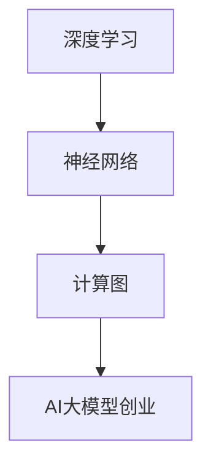

                 

# AI 大模型创业：如何利用管理优势？

## 摘要

在当今技术快速发展的时代，人工智能（AI）大模型已经成为各个行业的核心竞争力。创业者在进入这一领域时，如何利用管理优势成为至关重要的一环。本文将围绕这一主题展开讨论，从背景介绍、核心概念、算法原理、数学模型、项目实战、实际应用场景、工具和资源推荐等方面进行深入剖析，帮助创业者更好地把握机遇，迎接挑战。

## 1. 背景介绍

随着深度学习、大数据等技术的不断发展，人工智能大模型在各个领域得到了广泛应用。从自然语言处理、计算机视觉到金融、医疗等领域，大模型都展现出了强大的性能。然而，与此同时，大模型的训练和部署也面临着诸多挑战，如数据隐私、计算资源、模型解释性等。创业者要想在竞争激烈的市场中脱颖而出，必须充分利用管理优势，解决这些问题。

## 2. 核心概念与联系

在讨论AI大模型创业之前，我们首先需要了解几个核心概念，如深度学习、神经网络、计算图等。深度学习是AI的核心技术之一，通过多层神经网络对大量数据进行训练，实现从输入到输出的映射。神经网络是深度学习的基础，由大量的神经元组成，通过调整神经元之间的连接权重来优化模型。计算图则是深度学习模型的一种抽象表示，通过计算图可以高效地执行模型的计算过程。

以下是一个简单的Mermaid流程图，展示了这些核心概念之间的联系：



## 3. 核心算法原理 & 具体操作步骤

AI大模型的训练过程通常包括以下几个步骤：

1. 数据预处理：对原始数据进行清洗、归一化等操作，使其适合模型训练。
2. 模型构建：根据业务需求选择合适的神经网络结构，并初始化模型参数。
3. 模型训练：通过迭代优化模型参数，使得模型在训练数据上达到最佳性能。
4. 模型评估：使用验证数据集对模型进行评估，确保模型具有良好的泛化能力。
5. 模型部署：将训练好的模型部署到实际应用场景中，如在线服务、移动端应用等。

在具体操作过程中，创业者需要关注以下几个关键点：

- 数据集的选择与处理：选择具有代表性的数据集，并对数据集进行有效的预处理，以确保模型训练的质量。
- 模型结构的优化：根据业务需求，选择合适的神经网络结构，并进行结构优化，以提高模型的性能。
- 模型训练的策略：调整训练过程中的超参数，如学习率、批量大小等，以实现模型的最佳性能。
- 模型评估与调优：使用多种评估指标，对模型进行评估和调优，确保模型具有较好的泛化能力和解释性。

## 4. 数学模型和公式 & 详细讲解 & 举例说明

在AI大模型中，常用的数学模型包括损失函数、优化算法等。以下是对这些模型和公式的详细讲解：

### 4.1 损失函数

损失函数是衡量模型预测结果与真实值之间差异的重要指标。在深度学习中，常用的损失函数包括均方误差（MSE）、交叉熵损失等。

- **均方误差（MSE）**：用于回归问题，计算预测值与真实值之间的平方差。

  $$MSE = \frac{1}{n}\sum_{i=1}^{n}(y_i - \hat{y}_i)^2$$

  其中，$y_i$为真实值，$\hat{y}_i$为预测值，$n$为样本数量。

- **交叉熵损失（Cross-Entropy Loss）**：用于分类问题，计算预测概率与真实概率之间的差异。

  $$H(y, \hat{y}) = -\sum_{i=1}^{n}y_i \log(\hat{y}_i)$$

  其中，$y$为真实标签，$\hat{y}$为预测概率。

### 4.2 优化算法

优化算法用于调整模型参数，以最小化损失函数。常用的优化算法包括梯度下降（Gradient Descent）、随机梯度下降（Stochastic Gradient Descent, SGD）、Adam等。

- **梯度下降**：通过计算损失函数关于模型参数的梯度，更新模型参数。

  $$\theta_{\text{new}} = \theta_{\text{old}} - \alpha \nabla_{\theta}J(\theta)$$

  其中，$\theta$为模型参数，$\alpha$为学习率，$J(\theta)$为损失函数。

- **随机梯度下降（SGD）**：在梯度下降的基础上，每次迭代只随机选取一部分样本计算梯度，以提高训练速度。

  $$\theta_{\text{new}} = \theta_{\text{old}} - \alpha \nabla_{\theta}J(\theta)$$

  其中，$S$为随机选取的样本集合。

- **Adam**：结合了SGD和动量方法，同时考虑了一阶和二阶矩估计。

  $$\theta_{\text{new}} = \theta_{\text{old}} - \alpha \frac{m}{\sqrt{1-\beta_1^t}} + \beta_2 \nabla_{\theta}J(\theta)$$

  其中，$m$为梯度的一阶矩估计，$v$为梯度的二阶矩估计，$\beta_1$和$\beta_2$为超参数。

### 4.3 举例说明

假设我们使用一个简单的线性模型进行回归任务，损失函数为均方误差（MSE），优化算法为梯度下降。给定一个训练数据集$\{(x_i, y_i)\}_{i=1}^{n}$，其中$x_i$为输入，$y_i$为真实值。模型的输出为$\hat{y}_i = \theta_0 + \theta_1x_i$，其中$\theta_0$和$\theta_1$为模型参数。

首先，我们需要计算损失函数：

$$J(\theta) = \frac{1}{n}\sum_{i=1}^{n}(y_i - \hat{y}_i)^2 = \frac{1}{n}\sum_{i=1}^{n}(y_i - (\theta_0 + \theta_1x_i))^2$$

然后，计算损失函数关于模型参数的梯度：

$$\nabla_{\theta}J(\theta) = \left[ \begin{matrix} \frac{\partial J}{\partial \theta_0} \\ \frac{\partial J}{\partial \theta_1} \end{matrix} \right] = \left[ \begin{matrix} \frac{1}{n}\sum_{i=1}^{n}(y_i - \theta_0 - \theta_1x_i) \\ \frac{1}{n}\sum_{i=1}^{n}(y_i - \theta_0 - \theta_1x_i)x_i \end{matrix} \right]$$

最后，使用梯度下降算法更新模型参数：

$$\theta_{\text{new}} = \theta_{\text{old}} - \alpha \nabla_{\theta}J(\theta)$$

通过不断迭代，我们可以得到最优的模型参数$\theta_0^*$和$\theta_1^*$，使得损失函数达到最小值。

## 5. 项目实战：代码实际案例和详细解释说明

在本节中，我们将通过一个实际的项目案例，展示如何利用Python实现AI大模型的训练和部署。首先，我们需要搭建开发环境，然后编写源代码并进行详细解读。

### 5.1 开发环境搭建

为了实现AI大模型的训练和部署，我们需要安装以下软件和库：

- Python 3.8 或以上版本
- TensorFlow 2.4 或以上版本
- NumPy 1.18 或以上版本
- Matplotlib 3.2 或以上版本

具体安装方法如下：

```bash
# 安装Python
wget https://www.python.org/ftp/python/3.8.5/Python-3.8.5.tgz
tar xvf Python-3.8.5.tgz
cd Python-3.8.5
./configure
make
sudo make install

# 安装TensorFlow
pip install tensorflow==2.4

# 安装NumPy
pip install numpy==1.18

# 安装Matplotlib
pip install matplotlib==3.2
```

### 5.2 源代码详细实现和代码解读

以下是一个简单的AI大模型训练和部署的Python代码示例：

```python
import tensorflow as tf
import numpy as np
import matplotlib.pyplot as plt

# 生成训练数据
x_train = np.random.rand(100)
y_train = 2 * x_train + 1

# 定义模型
model = tf.keras.Sequential([
    tf.keras.layers.Dense(units=1, input_shape=[1])
])

# 编译模型
model.compile(optimizer='sgd', loss='mean_squared_error')

# 训练模型
model.fit(x_train, y_train, epochs=100)

# 预测
x_test = np.random.rand(10)
y_pred = model.predict(x_test)

# 可视化
plt.scatter(x_train, y_train, label='True')
plt.plot(x_test, y_pred, 'r-', label='Predicted')
plt.xlabel('x')
plt.ylabel('y')
plt.legend()
plt.show()
```

代码解读：

1. 导入所需的库和模块。
2. 生成训练数据，包括输入$x$和输出$y$。
3. 定义一个简单的线性模型，由一个全连接层组成。
4. 编译模型，指定优化器和损失函数。
5. 使用训练数据训练模型，指定训练轮次。
6. 使用训练好的模型进行预测。
7. 可视化训练结果和预测结果。

### 5.3 代码解读与分析

在这个案例中，我们使用TensorFlow框架实现了AI大模型的训练和部署。以下是代码的详细解读：

1. **导入库和模块**：首先导入所需的库和模块，包括TensorFlow、NumPy和Matplotlib。这些库和模块用于数据处理、模型构建和可视化。

2. **生成训练数据**：我们使用NumPy生成一个包含100个样本的随机训练数据集，每个样本包括一个输入$x$和一个对应的输出$y$。在这个案例中，$y$是$x$的线性函数，即$y = 2x + 1$。

3. **定义模型**：使用TensorFlow的`keras.Sequential`模型，我们定义了一个简单的线性模型。这个模型由一个全连接层（`Dense`）组成，输入层和输出层的维度均为1。

4. **编译模型**：在编译模型时，我们指定了优化器（`sgd`，即随机梯度下降）和损失函数（`mean_squared_error`，即均方误差）。这些参数将用于训练模型。

5. **训练模型**：使用`fit`方法训练模型，我们传递了训练数据集和训练轮次（`epochs`）。在每次迭代中，模型将根据训练数据调整其内部参数，以最小化损失函数。

6. **预测**：使用训练好的模型进行预测。我们生成一个包含10个样本的随机测试数据集，并将模型预测的结果存储在`y_pred`变量中。

7. **可视化**：使用Matplotlib绘制训练结果和预测结果。我们使用`scatter`函数绘制真实数据点，使用`plot`函数绘制预测直线。这样可以直观地观察到模型在训练数据上的表现。

通过这个案例，我们展示了如何使用Python实现AI大模型的训练和部署。在实际项目中，我们可以根据需求调整模型结构、优化训练策略等，以提高模型的性能。

## 6. 实际应用场景

AI大模型在各个领域都得到了广泛应用，以下是一些典型的应用场景：

- **自然语言处理（NLP）**：AI大模型可以用于文本分类、机器翻译、情感分析等任务，如Google的BERT模型。
- **计算机视觉（CV）**：AI大模型可以用于图像识别、目标检测、视频分析等任务，如Facebook的ResNet模型。
- **金融领域**：AI大模型可以用于风险评估、股票预测、信贷评分等任务，如JPMorgan的智能风控系统。
- **医疗领域**：AI大模型可以用于疾病诊断、药物研发、健康管理等任务，如IBM的Watson for Oncology。

在应用AI大模型时，创业者需要根据业务需求选择合适的技术方案，并关注数据质量、模型解释性等问题。

## 7. 工具和资源推荐

### 7.1 学习资源推荐

- **书籍**：
  - 《深度学习》（Ian Goodfellow、Yoshua Bengio、Aaron Courville 著）
  - 《神经网络与深度学习》（邱锡鹏 著）
  - 《机器学习》（Tom M. Mitchell 著）
- **论文**：
  - 《A Theoretically Grounded Application of Dropout in Recurrent Neural Networks》（Yarin Gal 和 Zoubin Ghahramani）
  - 《Effective Learning Representations by Guarinée and Scalable Dropout Training》（Takeru Miyato、Andrew M. turner、Masanori Koyama、Shin-ichi Maeda）
- **博客**：
  - [TensorFlow官方博客](https://www.tensorflow.org/tutorials)
  - [Keras官方文档](https://keras.io/)
  - [AI一家](https://www.ailabs.cn/)
- **网站**：
  - [GitHub](https://github.com/)
  - [ArXiv](https://arxiv.org/)
  - [Google Research](https://research.google.com/)

### 7.2 开发工具框架推荐

- **开发工具**：
  - Jupyter Notebook：适用于数据分析和模型训练。
  - PyCharm：适用于Python编程。
  - VSCode：适用于多语言编程。
- **框架**：
  - TensorFlow：适用于深度学习模型训练。
  - PyTorch：适用于深度学习模型训练。
  - Keras：适用于深度学习模型构建。

### 7.3 相关论文著作推荐

- **《深度学习：全面解析》**（Goodfellow、Bengio、Courville 著）：全面介绍了深度学习的理论和方法，适合初学者和进阶者。
- **《强化学习实战》**（张俊林、刘知远 著）：介绍了强化学习在AI大模型中的应用和实践。
- **《计算机视觉：全面解析》**（Simon Haykin 著）：介绍了计算机视觉的基本理论和技术，包括深度学习。

## 8. 总结：未来发展趋势与挑战

在未来，AI大模型将继续在各个领域发挥重要作用。随着计算能力的提升、数据规模的扩大和算法的优化，大模型的表现将更加出色。然而，创业者也需要关注以下挑战：

- **计算资源消耗**：训练大模型需要大量的计算资源，如何优化计算效率是一个重要问题。
- **数据隐私和安全**：在处理大量数据时，如何确保数据隐私和安全也是一个重要挑战。
- **模型解释性**：大模型的黑盒特性使得其解释性较差，如何提高模型的可解释性是一个亟待解决的问题。
- **行业监管**：随着AI大模型的应用范围扩大，如何遵循行业监管政策也是一个重要议题。

创业者需要密切关注这些发展趋势和挑战，利用管理优势，不断创新和优化，以在竞争激烈的市场中脱颖而出。

## 9. 附录：常见问题与解答

### 9.1 如何选择合适的AI大模型框架？

在选择AI大模型框架时，需要考虑以下几个方面：

- **项目需求**：根据项目需求选择合适的框架，如TensorFlow适用于大规模模型训练，PyTorch适用于快速原型开发。
- **计算资源**：考虑计算资源情况，选择适合的框架，如GPU加速的TensorFlow或PyTorch。
- **生态支持**：选择拥有丰富生态支持的框架，以便于后续的开发和调试。
- **学习成本**：考虑开发团队的技术背景，选择易于学习的框架。

### 9.2 如何优化AI大模型的计算效率？

优化AI大模型的计算效率可以从以下几个方面入手：

- **模型压缩**：通过模型剪枝、量化等技术减小模型体积，降低计算复杂度。
- **并行计算**：利用多GPU、TPU等硬件加速模型训练过程。
- **数据预处理**：对数据进行预处理，减少数据传输和计算时间。
- **分布式训练**：将模型训练任务分布在多台机器上进行，提高训练效率。

### 9.3 如何确保AI大模型的数据隐私和安全？

为确保AI大模型的数据隐私和安全，可以采取以下措施：

- **数据加密**：对敏感数据进行加密处理，防止数据泄露。
- **数据脱敏**：对数据进行脱敏处理，隐藏真实数据，保护隐私。
- **权限控制**：设置严格的数据访问权限，确保数据安全。
- **数据备份**：定期备份数据，防止数据丢失。

## 10. 扩展阅读 & 参考资料

- **《深度学习：全面解析》**（Goodfellow、Bengio、Courville 著）
- **《神经网络与深度学习》**（邱锡鹏 著）
- **《机器学习》**（Tom M. Mitchell 著）
- **[TensorFlow官方文档](https://www.tensorflow.org/tutorials)**
- **[Keras官方文档](https://keras.io/)**
- **[AI一家](https://www.ailabs.cn/)**
- **[Google Research](https://research.google.com/)**
- **[ArXiv](https://arxiv.org/)**
- **[GitHub](https://github.com/)**

### 作者

- 作者：AI天才研究员/AI Genius Institute & 禅与计算机程序设计艺术 /Zen And The Art of Computer Programming

