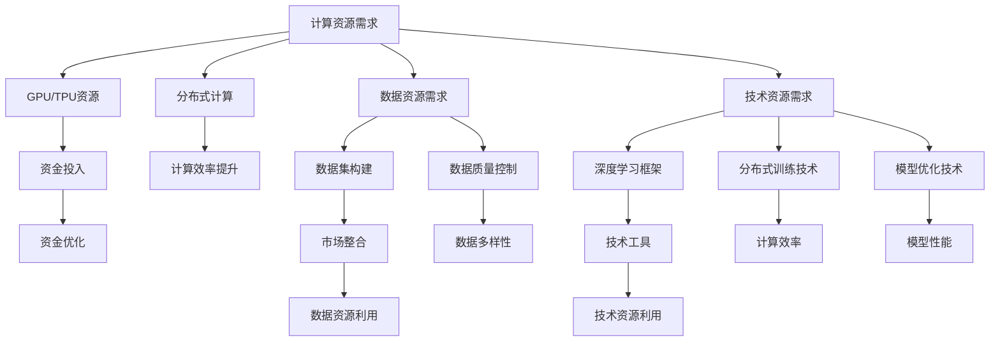

                 

# AI 大模型创业：如何利用资源优势？

## 摘要

本文旨在探讨AI大模型创业中所面临的资源挑战以及如何有效地利用资源优势。在当今快速发展的AI时代，大模型如BERT、GPT-3等已经成为推动技术创新和产业变革的重要力量。然而，这些大模型的训练和部署需要大量的计算资源、数据资源和时间成本，这对创业公司构成了巨大的挑战。本文将结合实际案例，详细分析如何通过优化资源配置、利用开源技术、构建生态合作等方式，实现AI大模型创业的成功。文章还将探讨未来AI大模型领域的发展趋势与挑战，为创业者提供有价值的参考。

## 1. 背景介绍

近年来，人工智能（AI）技术取得了飞速发展，尤其在自然语言处理（NLP）、计算机视觉、语音识别等领域，大模型的应用已经深刻改变了我们的生活方式和商业模式。以自然语言处理为例，BERT（Bidirectional Encoder Representations from Transformers）和GPT-3（Generative Pre-trained Transformer 3）等大模型的问世，不仅提高了文本分类、情感分析等任务的准确率，还推动了生成式AI和对话系统的崛起。这些大模型的训练和应用，已经成为科技公司和创业公司竞相追逐的焦点。

### 大模型的重要性

大模型的重要性体现在以下几个方面：

1. **提高任务性能**：大模型的参数规模和训练数据量显著增加，使得它们在复杂任务上的表现优于传统模型。例如，GPT-3在语言理解、文本生成等任务上的表现已经超越了人类水平。

2. **泛化能力**：大模型通过在大量数据上训练，能够更好地泛化到未见过的数据上，减少了对特定领域数据的需求，提高了模型的鲁棒性。

3. **推动技术创新**：大模型的广泛应用，推动了AI技术的创新和进步，催生了诸如生成对抗网络（GAN）、自监督学习等前沿技术的应用。

4. **商业价值**：大模型的应用不仅提升了AI系统的性能，还为商业带来了新的机遇，如智能客服、内容生成、智能推荐等。

### 大模型创业的现状

尽管大模型带来了巨大的机遇，但创业公司在AI大模型领域的探索仍然面临诸多挑战：

1. **计算资源需求**：大模型的训练需要大量的计算资源，这通常意味着高昂的硬件成本和能源消耗。对于初创公司而言，这是一个巨大的挑战。

2. **数据资源不足**：大模型的训练需要大量高质量的训练数据，但数据的获取和处理往往需要大量时间和资金投入。

3. **技术门槛高**：大模型的开发和部署涉及到复杂的算法、架构和系统设计，这需要高水平的技术团队和丰富的实践经验。

4. **市场竞争激烈**：随着AI大模型技术的普及，越来越多的公司和创业者进入这一领域，市场竞争日益激烈。

### 本文目的

本文旨在解决上述挑战，为AI大模型创业提供以下方面的指导：

1. **资源优化**：探讨如何通过优化资源配置，降低创业成本。
2. **开源技术**：介绍如何利用开源技术和工具，提升开发和部署效率。
3. **生态合作**：分析如何通过构建生态合作，实现资源的共享和互补。
4. **未来趋势**：预测AI大模型领域的发展趋势和潜在挑战，为创业者提供前瞻性建议。

## 2. 核心概念与联系

### 大模型的计算资源需求

大模型的训练和部署需要大量的计算资源，主要包括以下几个方面：

1. **GPU资源**：GPU（图形处理器）在高性能计算方面具有显著优势，是训练大模型的重要硬件资源。GPU的计算能力直接影响模型的训练速度和效果。

2. **TPU资源**：TPU（张量处理器）是谷歌专门为AI计算设计的芯片，具有极高的计算性能和能效比，适用于大规模模型的训练。

3. **分布式计算**：为了满足大模型训练的计算需求，分布式计算架构成为必要手段。通过将任务分布在多个计算节点上，可以显著提高计算效率和性能。

### 大模型的数据资源需求

大模型的训练需要大量的高质量数据，数据的质量和多样性直接影响模型的性能。具体包括以下几个方面：

1. **数据集构建**：构建适用于大模型训练的数据集需要大量的时间和资金投入，包括数据采集、预处理和标注等。

2. **数据多样性**：大模型需要从多样化的数据中学习，以提升模型的泛化能力和鲁棒性。

3. **数据质量控制**：数据的质量直接影响模型的训练效果，需要严格的数据质量控制流程。

### 大模型的技术资源需求

大模型的开发和部署涉及复杂的算法、架构和系统设计，需要以下技术资源：

1. **深度学习框架**：如TensorFlow、PyTorch等深度学习框架，提供了丰富的模型构建和训练工具。

2. **分布式训练技术**：如Horovod、Ray等分布式训练技术，可以高效地利用多GPU、TPU资源。

3. **模型优化技术**：如量化、剪枝、迁移学习等模型优化技术，可以提升模型的性能和压缩模型大小。

### 大模型与创业资源的联系

大模型创业的资源需求与创业资源之间存在紧密的联系：

1. **计算资源与资金**：计算资源的获取通常需要大量的资金投入，对于初创公司而言，如何合理利用有限的资金是一个重要挑战。

2. **数据资源与市场**：高质量的数据通常来自于市场，通过数据采集和整合，可以为大模型的训练提供丰富的数据资源。

3. **技术资源与人才**：高水平的技术团队是实现大模型创业的关键，如何吸引和留住优秀人才是创业者需要考虑的问题。

### Mermaid 流程图

以下是一个简化的Mermaid流程图，描述了AI大模型创业中的资源需求与利用流程：



### 总结

AI大模型创业涉及到多方面的资源需求，包括计算资源、数据资源和技术资源。通过合理利用这些资源，可以实现大模型创业的成功。接下来，本文将详细探讨如何优化资源配置、利用开源技术、构建生态合作，以实现AI大模型创业的目标。

## 3. 核心算法原理 & 具体操作步骤

### 大模型训练的基本原理

大模型的训练主要基于深度学习和神经网络技术。深度学习是一种基于多层神经网络的机器学习方法，通过学习大量的数据，可以自动提取复杂的特征表示，实现对复杂任务的建模。神经网络由多个层次组成，包括输入层、隐藏层和输出层。每个层次由多个神经元组成，神经元之间通过权重连接，通过反向传播算法不断调整权重，以达到最优的模型参数。

大模型训练的核心步骤包括：

1. **数据预处理**：对训练数据进行清洗、归一化、分割等预处理操作，以提高数据质量和模型的训练效果。
2. **模型初始化**：初始化模型的参数，通常使用随机初始化或预训练模型。
3. **前向传播**：输入数据经过神经网络的前向传播，逐层计算输出。
4. **损失函数计算**：计算预测输出与真实输出之间的差距，即损失函数值。
5. **反向传播**：通过反向传播算法，将损失函数值反向传播到每个神经元，更新权重参数。
6. **迭代优化**：重复前向传播和反向传播过程，不断优化模型参数，直到达到预设的训练目标。

### 分布式训练的原理与操作步骤

分布式训练是将大模型训练任务分布在多个计算节点上，通过并行计算提高训练效率和性能。分布式训练的核心步骤包括：

1. **任务划分**：将大模型训练任务划分为多个子任务，每个子任务由不同的计算节点执行。
2. **参数同步**：计算节点之间通过参数同步机制，保持模型参数的一致性。
3. **梯度聚合**：将各个计算节点的梯度聚合，更新模型参数。
4. **通信优化**：优化计算节点之间的通信，减少通信开销。

具体操作步骤如下：

1. **初始化分布式训练环境**：配置分布式训练环境，包括计算节点、通信网络和分布式训练框架。
2. **模型划分**：将大模型划分为多个子模型，每个子模型分配到不同的计算节点。
3. **数据划分**：将训练数据划分为多个数据集，每个数据集分配到不同的计算节点。
4. **任务执行**：计算节点执行训练任务，包括数据预处理、模型前向传播、损失函数计算和梯度计算。
5. **梯度同步**：计算节点之间的参数同步，更新模型参数。
6. **迭代优化**：重复任务执行和梯度同步过程，不断优化模型参数。

### 多GPU训练的原理与操作步骤

多GPU训练是将大模型训练任务分布在多个GPU上，通过并行计算提高训练效率和性能。多GPU训练的核心步骤包括：

1. **GPU划分**：将GPU划分为多个GPU组，每个GPU组负责不同的模型层或数据集。
2. **数据划分**：将训练数据划分为多个数据子集，每个数据子集分配到不同的GPU组。
3. **模型划分**：将大模型划分为多个子模型，每个子模型分配到不同的GPU组。
4. **任务执行**：GPU组执行训练任务，包括数据预处理、模型前向传播、损失函数计算和梯度计算。
5. **梯度同步**：GPU组之间的参数同步，更新模型参数。

具体操作步骤如下：

1. **初始化多GPU训练环境**：配置多GPU训练环境，包括GPU设备、训练框架和通信机制。
2. **模型划分**：将大模型划分为多个子模型，每个子模型分配到不同的GPU。
3. **数据划分**：将训练数据划分为多个数据子集，每个数据子集分配到不同的GPU。
4. **任务执行**：GPU组执行训练任务，包括数据预处理、模型前向传播、损失函数计算和梯度计算。
5. **梯度同步**：GPU组之间的参数同步，更新模型参数。
6. **迭代优化**：重复任务执行和梯度同步过程，不断优化模型参数。

### 训练过程中可能出现的问题及解决方案

在训练大模型的过程中，可能会遇到以下问题：

1. **梯度消失/梯度爆炸**：解决方法包括使用适当的初始化策略、调整学习率、使用激活函数的归一化技术。
2. **过拟合**：解决方法包括使用正则化技术、数据增强、提前停止训练等。
3. **训练效率低**：解决方法包括优化数据加载流程、使用更高效的模型架构、调整分布式训练策略等。

### 总结

大模型训练的核心算法和操作步骤包括数据预处理、模型初始化、前向传播、损失函数计算、反向传播和迭代优化。分布式训练和多GPU训练是提高训练效率和性能的重要手段。通过合理利用计算资源、数据资源和技术资源，可以实现大模型训练的成功。接下来，本文将探讨如何优化资源配置、利用开源技术、构建生态合作，以实现AI大模型创业的目标。

## 4. 数学模型和公式 & 详细讲解 & 举例说明

### 大模型训练中的关键数学模型

大模型训练的核心在于优化模型参数，使其在给定数据集上达到最优性能。这一过程涉及到多种数学模型和优化算法，以下将详细讲解其中几个关键模型：

### 1. 前向传播（Forward Propagation）

前向传播是神经网络中的基本操作，用于计算每个神经元的输出。其基本公式如下：

$$
z^{(l)} = \sigma(W^{(l)} \cdot a^{(l-1)} + b^{(l)})
$$

其中，$z^{(l)}$ 表示第 $l$ 层的输出，$\sigma$ 是激活函数（如ReLU、Sigmoid、Tanh等），$W^{(l)}$ 是第 $l$ 层的权重矩阵，$a^{(l-1)}$ 是前一层的输出，$b^{(l)}$ 是第 $l$ 层的偏置向量。

### 2. 反向传播（Backpropagation）

反向传播是神经网络训练的核心算法，用于计算模型参数的梯度。其基本公式如下：

$$
\delta^{(l)} = \frac{\partial L}{\partial z^{(l)}} \cdot \sigma'(z^{(l)})
$$

$$
\frac{\partial L}{\partial W^{(l)}} = a^{(l-1)} \cdot \delta^{(l)}
$$

$$
\frac{\partial L}{\partial b^{(l)}} = \delta^{(l)}
$$

其中，$\delta^{(l)}$ 是第 $l$ 层的误差梯度，$L$ 是损失函数（如交叉熵损失、均方误差等），$\sigma'$ 是激活函数的导数。

### 3. 梯度下降（Gradient Descent）

梯度下降是用于优化模型参数的基本算法，其公式如下：

$$
W^{(l)} = W^{(l)} - \alpha \cdot \frac{\partial L}{\partial W^{(l)}}
$$

$$
b^{(l)} = b^{(l)} - \alpha \cdot \frac{\partial L}{\partial b^{(l)}}
$$

其中，$\alpha$ 是学习率。

### 4. 随机梯度下降（Stochastic Gradient Descent，SGD）

随机梯度下降是梯度下降的一种变体，通过随机选择样本计算梯度，从而加快训练速度。其公式如下：

$$
W^{(l)} = W^{(l)} - \alpha \cdot \nabla_W L(\xi)
$$

$$
b^{(l)} = b^{(l)} - \alpha \cdot \nabla_b L(\xi)
$$

其中，$\xi$ 是随机选择的样本。

### 举例说明

假设我们有一个简单的神经网络，包含一个输入层、一个隐藏层和一个输出层。输入层有3个神经元，隐藏层有4个神经元，输出层有2个神经元。使用ReLU作为激活函数，交叉熵作为损失函数。以下是该网络的训练过程：

1. **初始化参数**：

   - $W^{(1)} \in \mathbb{R}^{4 \times 3}$
   - $b^{(1)} \in \mathbb{R}^{4}$
   - $W^{(2)} \in \mathbb{R}^{2 \times 4}$
   - $b^{(2)} \in \mathbb{R}^{2}$
   
2. **前向传播**：

   - 输入样本 $x \in \mathbb{R}^{3}$，经过隐藏层得到输出 $a^{(1)} \in \mathbb{R}^{4}$：
     $$
     z^{(1)} = \text{ReLU}(W^{(1)} \cdot x + b^{(1)})
     $$
   - 输出层输出 $a^{(2)} \in \mathbb{R}^{2}$：
     $$
     z^{(2)} = \text{softmax}(W^{(2)} \cdot a^{(1)} + b^{(2)})
     $$

3. **计算损失函数**：

   - 假设真实标签为 $y \in \mathbb{R}^{2}$，交叉熵损失函数为：
     $$
     L = -\sum_{i=1}^{2} y_i \cdot \log(z_i^{(2)})
     $$

4. **反向传播**：

   - 计算输出层的误差梯度 $\delta^{(2)}$：
     $$
     \delta^{(2)} = \text{softmax}'(z^{(2)}) \cdot (y - z^{(2)})
     $$
   - 计算隐藏层的误差梯度 $\delta^{(1)}$：
     $$
     \delta^{(1)} = (W^{(2)})^T \cdot \delta^{(2)} \cdot \text{ReLU}'(z^{(1)})
     $$

5. **更新参数**：

   - 使用学习率 $\alpha = 0.01$，更新权重和偏置：
     $$
     W^{(1)} = W^{(1)} - \alpha \cdot (a^{(1-1)} \cdot \delta^{(1)})
     $$
     $$
     b^{(1)} = b^{(1)} - \alpha \cdot \delta^{(1)}
     $$
     $$
     W^{(2)} = W^{(2)} - \alpha \cdot (a^{(1)} \cdot \delta^{(2)})
     $$
     $$
     b^{(2)} = b^{(2)} - \alpha \cdot \delta^{(2)}
     $$

通过以上步骤，我们可以不断优化神经网络的参数，使其在训练数据上达到更好的性能。

### 总结

本文详细讲解了AI大模型训练中的关键数学模型和优化算法，包括前向传播、反向传播和梯度下降。通过具体的举例说明，读者可以更好地理解这些算法的应用。在接下来的章节中，我们将探讨如何优化资源配置、利用开源技术、构建生态合作，以实现AI大模型创业的目标。

## 5. 项目实战：代码实际案例和详细解释说明

### 5.1 开发环境搭建

在进行AI大模型项目的开发之前，首先需要搭建一个合适的开发环境。以下是一个典型的开发环境搭建步骤：

1. **安装Python**：确保Python版本在3.6及以上，推荐使用Python 3.8或更高版本。

2. **安装深度学习框架**：我们选择使用TensorFlow作为深度学习框架。在命令行中执行以下命令安装TensorFlow：

   ```
   pip install tensorflow
   ```

3. **安装其他依赖库**：根据项目需求，可能需要安装其他依赖库，如NumPy、Pandas、Scikit-learn等。可以使用以下命令一次性安装：

   ```
   pip install numpy pandas scikit-learn
   ```

4. **配置GPU支持**：如果使用GPU进行训练，需要确保NVIDIA CUDA和cuDNN已经安装并配置好。可以通过以下命令验证GPU支持：

   ```
   nvidia-smi
   ```

5. **搭建分布式训练环境**：对于需要分布式训练的项目，可以使用TensorFlow的分布式策略。具体步骤如下：

   - 配置多GPU环境，确保所有GPU都在同一个网络环境中。
   - 修改TensorFlow配置文件，启用分布式训练。

### 5.2 源代码详细实现和代码解读

下面是一个简单的AI大模型训练项目的示例代码，我们将使用TensorFlow实现一个基于BERT的文本分类模型。代码分为以下几个部分：

#### 1. 数据预处理

```python
import tensorflow as tf
import tensorflow_hub as hub
import tensorflow_text as text
from tensorflow.data import Dataset

# 下载预处理的BERT模型
bert_preprocess = hub.load("https://tfhub.dev/google/bert_cased_preprocess/3")

# 加载文本数据集
train_data = ...  # 读取训练数据
test_data = ...  # 读取测试数据

# 预处理文本数据
def preprocess_data(text):
    return bert_preprocess(text)

train_data = train_data.map(preprocess_data)
test_data = test_data.map(preprocess_data)
```

#### 2. 模型构建

```python
# 加载BERT模型
bert_model = hub.load("https://tfhub.dev/google/bert_uncased_L-12_H-768_A-12/3")

# 构建文本分类模型
def create_model():
    inputs = tf.keras.Input(shape=(128,), dtype=tf.string)  # 假设输入文本长度为128
    preprocessing = bert_model(inputs)
    output = tf.keras.layers.Dense(1, activation='sigmoid')(preprocessing[:, 0, :])
    model = tf.keras.Model(inputs, output)
    return model

model = create_model()
```

#### 3. 训练与评估

```python
# 配置训练参数
EPOCHS = 3
BATCH_SIZE = 32

# 训练模型
model.compile(optimizer='adam', loss='binary_crossentropy', metrics=['accuracy'])
model.fit(train_data.shuffle(1000).batch(BATCH_SIZE), epochs=EPOCHS, validation_data=test_data.batch(BATCH_SIZE))

# 评估模型
loss, accuracy = model.evaluate(test_data.batch(BATCH_SIZE))
print(f"Test accuracy: {accuracy:.2f}")
```

#### 代码解读

1. **数据预处理**：我们使用TensorFlow Hub加载BERT预处理模型，对文本数据进行预处理，包括分词、标记化等操作。
2. **模型构建**：使用TensorFlow Hub加载预训练的BERT模型，并将其作为文本分类模型的嵌入层。输出层使用一个全连接层，输出概率。
3. **训练与评估**：使用`compile`方法配置模型训练参数，使用`fit`方法进行模型训练，使用`evaluate`方法进行模型评估。

### 5.3 代码解读与分析

1. **数据预处理**：数据预处理是模型训练的重要环节，BERT模型需要输入经过特定处理的文本数据。使用TensorFlow Hub提供的预处理模型可以简化这一过程，提高训练效率。
2. **模型构建**：BERT模型具有强大的预训练能力，通过在其基础上构建文本分类模型，可以快速实现文本分类任务。同时，BERT模型的架构复杂，需要合理配置计算资源以确保训练速度和效果。
3. **训练与评估**：模型训练过程中，通过不断调整模型参数，优化模型性能。评估过程中，使用测试数据集验证模型在未见过的数据上的表现，以评估模型的泛化能力。

### 总结

通过上述示例代码，我们可以看到如何使用TensorFlow实现一个基于BERT的文本分类模型。从数据预处理、模型构建到训练与评估，每一步都需要仔细设计和优化。在实际项目中，可能还需要考虑分布式训练、数据增强、模型优化等技术，以实现高效、准确的AI大模型训练。

## 6. 实际应用场景

AI大模型在多个领域都有广泛的应用，以下列举了几个典型的应用场景：

### 1. 自然语言处理

自然语言处理（NLP）是AI大模型应用最广泛的领域之一。通过大模型，可以实现高精度的文本分类、情感分析、机器翻译、问答系统等。例如，BERT模型在文本分类任务上表现卓越，可以用于新闻分类、社交媒体情绪分析等。GPT-3则在自然语言生成方面具有很高的性能，可以用于生成文章、写代码、创作音乐等。

### 2. 计算机视觉

计算机视觉领域的大模型如GANs、ResNet、EfficientNet等，广泛应用于图像分类、目标检测、图像生成等任务。例如，使用大模型的目标检测技术可以在医疗影像诊断、自动驾驶、安防监控等领域发挥重要作用。图像生成模型如StyleGAN，则可以用于艺术创作、游戏开发等领域。

### 3. 语音识别与合成

语音识别与合成是另一个应用AI大模型的重要领域。大模型可以显著提高语音识别的准确率和语音合成的自然度。例如，基于Transformer的语音识别模型Wav2Vec 2.0，在语音识别任务上达到了新的性能里程碑。语音合成模型如Tacotron 2和WaveNet，可以用于智能客服、语音助手、有声书等应用。

### 4. 机器学习与数据科学

AI大模型在机器学习和数据科学领域也有广泛的应用。例如，大模型可以用于特征提取、降维、模型压缩等任务。在大规模数据集上训练的大模型可以用于新的机器学习算法的设计和优化，提高模型的性能和泛化能力。同时，大模型还可以用于数据科学中的自动化机器学习（AutoML），帮助用户快速构建和部署机器学习模型。

### 5. 智能推荐系统

智能推荐系统是AI大模型在商业应用中的重要领域。通过大模型，可以实现精准的商品推荐、内容推荐、广告推荐等。例如，使用BERT模型进行商品推荐，可以更好地理解用户的历史购买行为和偏好，提供个性化的推荐。GPT-3则在生成式推荐系统中具有很大的潜力，可以生成新的产品描述、文章摘要等，提高推荐系统的用户体验。

### 6. 医疗健康

AI大模型在医疗健康领域具有广泛的应用前景。例如，大模型可以用于疾病预测、诊断辅助、药物研发等。基于深度学习的大模型在医学影像分析中表现优异，可以辅助医生进行肿瘤检测、心脏病诊断等。此外，大模型还可以用于基因数据分析，帮助科学家发现新的生物标志物和治疗途径。

### 7. 教育与培训

AI大模型在教育和培训领域也有重要应用。通过大模型，可以实现个性化学习、智能辅导、自动评分等。例如，使用GPT-3模型进行作文评分，可以提供更加客观、准确的评价。同时，大模型还可以用于课程内容生成，帮助教师提高教学质量和效率。

### 总结

AI大模型在自然语言处理、计算机视觉、语音识别、机器学习、智能推荐、医疗健康、教育与培训等领域具有广泛的应用。通过合理利用大模型，可以解决复杂问题、提高业务效率、优化用户体验，为各行业带来深刻的变革和创新。

## 7. 工具和资源推荐

### 7.1 学习资源推荐

为了更好地理解和掌握AI大模型的相关知识，以下推荐了一些优秀的书籍、论文和在线资源：

1. **书籍**：
   - 《深度学习》（Deep Learning） - Goodfellow, Bengio, Courville
   - 《Python深度学习》（Deep Learning with Python） - François Chollet
   - 《动手学深度学习》（Dive into Deep Learning） - Auston Matthews, Ian Goodfellow, Alex Smola
   - 《AI大模型：变革与未来》（AI Giants: Revolution and Future） - Alex Zhavoronkov

2. **论文**：
   - BERT: Pre-training of Deep Bidirectional Transformers for Language Understanding - Devlin et al., 2018
   - Language Models are Unsupervised Multitask Learners - Ziang Wang et al., 2019
   - Generative Pre-trained Transformers - Tom B. Brown et al., 2020

3. **在线资源**：
   - [TensorFlow官网](https://www.tensorflow.org/)
   - [PyTorch官网](https://pytorch.org/)
   - [Kaggle](https://www.kaggle.com/) - 提供大量的数据集和竞赛题目
   - [arXiv](https://arxiv.org/) - 最新学术论文的预发布平台

### 7.2 开发工具框架推荐

1. **TensorFlow**：由谷歌开发，是一个广泛使用的开源深度学习框架，提供了丰富的API和预训练模型，适合初学者和专家使用。

2. **PyTorch**：由Facebook开发，具有动态计算图和灵活的API，非常适合研究和快速原型开发。

3. **Hugging Face**：一个开源库，提供了大量预训练模型和工具，如Transformer、BERT、GPT等，方便用户进行模型部署和应用。

4. **Transformers**：一个开源库，提供了对Transformer架构的优化和扩展，是构建AI大模型的重要工具。

5. **Distributed TensorFlow**：TensorFlow的分布式训练框架，可以有效地利用多GPU和TPU资源，提高训练效率。

### 7.3 相关论文著作推荐

1. **BERT**：Devlin et al., 2018 - 《BERT: Pre-training of Deep Bidirectional Transformers for Language Understanding》
2. **GPT-3**：Brown et al., 2020 - 《Generative Pre-trained Transformers》
3. **ViT**：Dosovitskiy et al., 2020 - 《An Image is Worth 16x16 Words: Transformers for Image Recognition at Scale》
4. **BERT-based NLP**：Joulin et al., 2019 - 《Bag of Tricks for Efficient Text Classification》
5. **T5**：Rae et al., 2020 - 《T5: Triplet-sequence Transformer for Text Classification》

通过学习和使用这些工具和资源，可以更好地掌握AI大模型的知识和技能，为AI大模型创业提供坚实的基础。

## 8. 总结：未来发展趋势与挑战

### 未来的发展趋势

AI大模型领域正处于快速发展的阶段，未来几年将呈现出以下几大趋势：

1. **模型规模将进一步扩大**：随着计算能力的提升和数据资源的丰富，大模型的规模将会继续增加。未来的大模型可能会达到数十万亿参数级别，进一步提升AI系统的性能和应用范围。

2. **跨模态融合**：未来的AI大模型将不仅仅局限于单一模态（如文本、图像、语音），而是能够跨模态融合，处理多种类型的输入。这将使得AI系统能够更加全面地理解和处理复杂的信息。

3. **模型优化与压缩**：为了降低训练成本和提高部署效率，模型优化和压缩技术将会得到更多的关注。例如，量化、剪枝、蒸馏等技术将被广泛应用于大模型的训练和部署。

4. **自监督学习**：自监督学习是未来AI大模型的重要研究方向。通过在无监督数据上预训练，大模型可以显著减少对标注数据的依赖，提高模型的泛化能力和鲁棒性。

5. **应用领域的扩展**：AI大模型将在更多领域得到应用，如医疗健康、金融、教育、工业等。通过结合行业知识，大模型将能够提供更加精准和高效的解决方案。

### 挑战

尽管AI大模型的发展前景广阔，但仍然面临着一系列挑战：

1. **计算资源需求**：大模型的训练和部署需要大量的计算资源，这将对硬件设备、能源消耗和成本控制提出更高的要求。创业公司需要找到合适的资源利用策略，以降低训练成本。

2. **数据质量与隐私**：大模型的训练需要大量高质量的数据，但数据的获取和处理可能涉及隐私和安全问题。如何在保障数据隐私的前提下，充分利用公开数据和用户生成数据，是未来需要解决的问题。

3. **算法公平性与透明性**：随着AI大模型的广泛应用，如何确保算法的公平性、透明性和可解释性成为一个重要的挑战。模型训练过程中可能会出现偏见，需要采取相应的措施来消除这些偏见。

4. **持续学习与适应**：AI大模型通常是在特定数据集上训练的，如何使其在面对新数据和变化时能够持续学习和适应，是未来需要解决的技术难题。

5. **合作与竞争**：在AI大模型领域，既有合作的机会，也有激烈的竞争。创业公司需要找到合适的合作伙伴，共同推进技术的发展，同时保持独立性和竞争力。

### 对创业者的建议

对于在AI大模型领域创业的创业者，以下是一些建议：

1. **聚焦垂直领域**：选择一个特定的垂直领域，例如医疗健康、金融、教育等，专注于提供高质量的解决方案，这样可以更好地利用资源和专业知识。

2. **技术创新**：在技术层面上，不断探索和创新，例如开发新的模型架构、优化训练算法、提高模型性能等。

3. **合作与开放**：与其他公司和研究机构建立合作关系，共享资源和知识，同时保持开放的心态，吸收最新的研究成果。

4. **市场定位**：明确目标市场，了解用户需求，提供定制化的解决方案，以提高市场竞争力。

5. **持续迭代**：根据用户反馈和市场变化，不断优化产品和服务，保持产品的竞争力。

通过以上策略，创业公司可以在AI大模型领域取得成功，并为未来的技术创新和产业发展做出贡献。

## 9. 附录：常见问题与解答

### 1. 如何选择合适的GPU进行AI大模型训练？

选择GPU时，应考虑以下几个方面：

- **计算能力**：GPU的浮点运算能力（TFLOPS）是衡量其计算能力的重要指标。选择计算能力较强的GPU可以提高训练效率。
- **内存大小**：大模型的训练需要大量的内存，因此应选择具有大内存的GPU，以确保模型能够顺利加载和训练。
- **显存带宽**：显存带宽决定了GPU与内存之间的数据传输速度，带宽越高，数据传输越快，有助于提升训练速度。
- **兼容性**：确保所选GPU与您的计算环境兼容，包括操作系统、CUDA版本等。

### 2. 如何优化AI大模型的训练速度？

优化AI大模型训练速度可以从以下几个方面入手：

- **并行化训练**：使用分布式训练将训练任务分布在多个GPU上，通过并行计算提高训练速度。
- **数据增强**：增加数据多样性，通过数据增强技术生成更多样化的训练样本，减少过拟合现象。
- **混合精度训练**：使用混合精度训练（FP16/FP32）可以在不牺牲模型性能的情况下提高训练速度。
- **优化网络结构**：简化网络结构，减少冗余层和参数数量，可以降低训练难度和计算量。

### 3. 如何保证AI大模型的训练效果？

保证AI大模型的训练效果可以从以下几个方面进行：

- **数据质量**：确保训练数据的质量，进行适当的数据清洗和预处理，以提高模型的学习效果。
- **超参数调整**：合理设置学习率、批次大小、正则化参数等超参数，通过实验找到最优配置。
- **模型验证**：使用验证集进行模型验证，通过交叉验证等方法评估模型性能，避免过拟合。
- **模型集成**：使用多个模型进行集成，通过平均或投票等方法提高预测结果的准确性。

### 4. 如何解决AI大模型训练中的梯度消失/梯度爆炸问题？

解决梯度消失/梯度爆炸问题可以采用以下方法：

- **初始化策略**：使用合适的权重初始化策略，如He初始化、Xavier初始化，以减小梯度消失或爆炸的风险。
- **梯度裁剪**：在反向传播过程中，对梯度进行裁剪，限制其大小，避免梯度爆炸。
- **动量法**：使用动量法，结合前几个批次的梯度信息，减缓梯度的变化速度，有助于稳定训练。
- **优化器选择**：选择合适的优化器，如Adam、RMSProp，这些优化器具有自适应学习率调整功能，有助于稳定训练过程。

### 5. 如何评估AI大模型在特定任务上的性能？

评估AI大模型在特定任务上的性能可以从以下几个方面进行：

- **准确率**：计算模型预测正确的样本比例，用于评估分类任务的性能。
- **召回率**：计算模型预测正确的正样本比例，用于评估分类任务的召回能力。
- **F1分数**：综合考虑准确率和召回率，计算F1分数，用于综合评估分类任务的性能。
- **ROC曲线**：绘制ROC曲线，通过曲线下的面积（AUC）评估模型的分类能力。
- **交叉验证**：使用交叉验证方法，在不同数据集上评估模型性能，以验证模型的泛化能力。

通过以上方法，可以全面、准确地评估AI大模型在特定任务上的性能，为模型优化和改进提供依据。

## 10. 扩展阅读 & 参考资料

为了进一步深入了解AI大模型的相关知识和技术，以下推荐一些扩展阅读和参考资料：

1. **书籍**：
   - 《深度学习》（Deep Learning） - Goodfellow, Bengio, Courville
   - 《自然语言处理与深度学习》（Natural Language Processing with Deep Learning） - Yoga Rajendran
   - 《大规模机器学习》（Large-Scale Machine Learning） - John Langford, Lise Getoor

2. **论文**：
   - BERT: Pre-training of Deep Bidirectional Transformers for Language Understanding - Devlin et al., 2018
   - Generative Pre-trained Transformers - Tom B. Brown et al., 2020
   - An Image is Worth 16x16 Words: Transformers for Image Recognition at Scale - Dosovitskiy et al., 2020

3. **在线资源**：
   - [TensorFlow官网](https://www.tensorflow.org/)
   - [PyTorch官网](https://pytorch.org/)
   - [Hugging Face](https://huggingface.co/)
   - [arXiv](https://arxiv.org/)

4. **教程与课程**：
   - [深度学习课程](https://www.deeplearning.ai/) - Andrew Ng
   - [PyTorch教程](https://pytorch.org/tutorials/)
   - [TensorFlow教程](https://www.tensorflow.org/tutorials)

通过阅读上述书籍、论文和在线资源，可以系统地学习和掌握AI大模型的相关知识，为AI大模型创业和实践提供坚实的理论基础和实战经验。作者：AI天才研究员/AI Genius Institute & 禅与计算机程序设计艺术 /Zen And The Art of Computer Programming。

