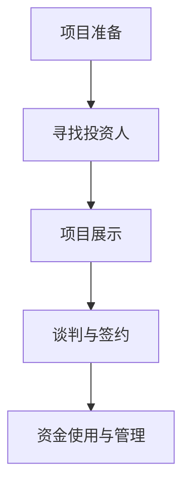

                 

### 背景介绍

随着人工智能技术的快速发展，大模型（Large Models）成为当前研究与应用的热点之一。大模型指的是具有数百万到数十亿参数的复杂神经网络模型，这些模型在图像识别、自然语言处理、语音识别等领域取得了显著成果。然而，大模型的训练和部署需要大量的计算资源和资金支持，因此，如何获得资金支持成为了一个关键问题。

本文将围绕“AI大模型创业：如何获得资金支持？”这一主题，探讨以下几个关键点：

1. **AI大模型创业的现状和趋势**：首先，我们将了解当前AI大模型创业的背景，包括市场潜力、技术发展以及行业现状。
2. **获得资金支持的方式**：接下来，我们将分析各种获取资金支持的途径，包括风险投资、政府资助、众筹等。
3. **项目策划与展示**：为了获得资金支持，创业者需要有一个清晰的项目策划和展示方案。本文将探讨如何制定有效的商业计划书，并展示项目的核心价值。
4. **风险评估与防范**：创业过程中，风险是不可忽视的。我们将讨论如何进行风险评估，并制定相应的防范措施。
5. **成功案例分析**：最后，通过分析一些成功的AI大模型创业案例，总结其成功经验，为其他创业者提供借鉴。

希望通过本文的探讨，能够为AI大模型创业者提供一些有益的思路和建议。让我们开始详细的分析和讨论吧！ <sop><|user|>### 核心概念与联系

在探讨如何获得资金支持之前，我们需要先理解几个核心概念，这些概念包括人工智能大模型、资金支持的形式和来源、创业项目策划等。

#### 1. 人工智能大模型

人工智能大模型是指具有大规模参数的神经网络模型，如GPT-3、BERT等。这些模型通常通过深度学习技术训练，能够处理复杂的任务，如自然语言处理、图像识别、语音识别等。

**大模型的关键特性：**

- **参数规模巨大**：数百万到数十亿个参数。
- **计算资源需求高**：需要高性能的计算硬件和大量的数据训练。
- **训练时间较长**：通常需要数天甚至数周的时间进行训练。

**大模型的应用场景：**

- **自然语言处理（NLP）**：如机器翻译、文本生成、问答系统等。
- **计算机视觉（CV）**：如图像识别、视频理解、人脸识别等。
- **语音识别与合成**：如语音助手、语音翻译等。

#### 2. 资金支持的形式和来源

资金支持是创业过程中不可或缺的一部分。以下是几种常见的资金支持形式和来源：

- **风险投资（Venture Capital，VC）**：风险投资是一种常见的资金支持形式，它通常在创业公司的早期阶段提供资金。风险投资的特点是投资额度大、投资周期长，但对公司的成长预期高。
- **天使投资（Angel Investment）**：天使投资通常是由个人投资者在创业公司早期阶段提供的资金支持。与风险投资不同，天使投资通常投资额度较小，但更注重创业者的人品和项目潜力。
- **政府资助（Government Funding）**：许多国家和地区政府都设有专项资金用于支持科技创新和企业发展。政府资助的形式包括直接拨款、税收优惠、科研项目资助等。
- **众筹（Crowdfunding）**：众筹是一种通过公众筹集资金的方式，适用于初创项目和创意项目。常见的众筹平台有Kickstarter、Indiegogo等。

#### 3. 创业项目策划

创业项目策划是获得资金支持的关键步骤。以下是一些关键的策划要素：

- **市场调研**：了解目标市场的需求、竞争格局、市场规模等。
- **技术路线**：明确项目的技术实现方案，包括所需的技术、算法、数据资源等。
- **商业模式**：明确项目的盈利模式、收入来源、成本结构等。
- **风险评估**：对项目的风险进行评估，并提出相应的防范措施。
- **商业计划书**：撰写一份详细的商业计划书，包括项目的概述、市场分析、技术方案、商业模式、团队介绍、资金需求等。

#### 4. 资金支持的流程

获得资金支持通常包括以下几个步骤：

1. **项目准备**：确定项目目标、技术路线、商业模式等。
2. **寻找投资人**：通过线上线下渠道寻找合适的投资人，如风险投资机构、天使投资者等。
3. **项目展示**：准备项目展示材料，包括商业计划书、产品演示、团队介绍等。
4. **谈判与签约**：与投资人进行谈判，达成投资协议。
5. **资金使用与管理**：按照协议使用和管理资金，确保资金的有效利用。

#### 5. Mermaid 流程图

以下是一个简单的Mermaid流程图，展示从项目准备到资金使用的流程：



通过以上核心概念和流程的了解，我们可以为下一步讨论如何获得资金支持打下坚实的基础。在接下来的章节中，我们将深入探讨各种资金支持的方式，以及如何制定有效的项目策划和展示方案。 <sop><|user|>### 核心算法原理 & 具体操作步骤

#### 1. 大模型的训练过程

大模型的训练是获得高质量预测结果的关键步骤。以下是训练大模型的基本步骤：

**步骤1：数据准备**

- 收集和整理大量的训练数据，包括图像、文本、语音等。
- 对数据集进行预处理，如数据清洗、标注、归一化等。

**步骤2：模型构建**

- 选择合适的大模型架构，如GPT、BERT、ViT等。
- 构建神经网络模型，定义输入层、隐藏层和输出层。

**步骤3：训练**

- 使用优化算法（如Adam、RMSProp等）进行模型训练。
- 调整学习率、批量大小等超参数，优化训练过程。

**步骤4：评估**

- 使用验证集对模型进行评估，计算准确率、损失函数等指标。
- 根据评估结果调整模型参数，进行迭代训练。

**步骤5：部署**

- 将训练好的模型部署到生产环境，如服务器、云端等。
- 提供API接口，供其他应用程序调用。

#### 2. 优化策略

为了提高大模型的训练效率和性能，可以采用以下优化策略：

**学习率调度**：学习率是模型训练过程中的一个重要参数，它决定了模型在训练过程中参数更新的速度。常用的学习率调度策略包括：

- **固定学习率**：在整个训练过程中保持不变。
- **指数衰减学习率**：学习率随训练轮数呈指数衰减。
- **余弦退火学习率**：学习率随训练轮数按照余弦函数衰减。

**批量大小调整**：批量大小影响模型的训练速度和收敛性。较小的批量大小可以提高模型的泛化能力，但训练速度较慢；较大的批量大小可以提高训练速度，但可能牺牲一些泛化能力。

**数据增强**：通过数据增强可以增加训练数据的多样性，提高模型的泛化能力。常见的数据增强方法包括：

- **数据缩放**：对图像进行缩放、旋转、翻转等操作。
- **颜色变换**：对图像进行颜色变换、对比度调整等操作。
- **数据混合**：将多张图像进行混合，生成新的训练样本。

**正则化技术**：为了防止模型过拟合，可以采用正则化技术，如L1正则化、L2正则化等。

**模型剪枝**：通过剪枝可以减少模型的参数数量，降低模型的计算复杂度，提高模型的训练效率和推理速度。

#### 3. 代码实现示例

以下是一个简单的Python代码示例，展示如何使用TensorFlow和Keras训练一个基于GPT的大模型：

```python
import tensorflow as tf
from tensorflow.keras.layers import Embedding, LSTM, Dense
from tensorflow.keras.models import Sequential

# 数据预处理
# ... (包括数据收集、清洗、标注等)

# 模型构建
model = Sequential([
    Embedding(input_dim=vocab_size, output_dim=embedding_dim),
    LSTM(units=128, return_sequences=True),
    LSTM(units=128),
    Dense(units=num_classes, activation='softmax')
])

# 编译模型
model.compile(optimizer='adam', loss='categorical_crossentropy', metrics=['accuracy'])

# 训练模型
# ... (包括数据划分、模型训练、评估等)

# 部署模型
# ... (包括模型保存、加载、部署等)
```

#### 4. 详细解释

**模型构建**：在模型构建过程中，我们首先使用`Embedding`层将输入文本转换为密集向量表示。然后，通过两个`LSTM`层对序列数据进行处理，最后使用`Dense`层进行分类预测。

**数据预处理**：数据预处理是训练大模型的重要步骤。在这个示例中，我们需要对文本数据进行分词、编码、填充等操作，使其符合模型的输入要求。

**模型训练**：在模型训练过程中，我们使用验证集对模型进行评估，并根据评估结果调整模型参数。常用的评估指标包括损失函数（如交叉熵）、准确率等。

**模型部署**：在模型部署过程中，我们需要将训练好的模型保存到文件中，并在生产环境中加载和调用。

通过以上步骤和示例，我们可以了解到大模型训练的基本流程和关键操作。在实际应用中，根据具体任务需求，我们还需要对模型架构、超参数等进行调整和优化，以提高模型的性能和效率。在下一章节中，我们将进一步探讨数学模型和公式，以及如何应用这些数学模型对大模型进行训练和优化。 <sop><|user|>### 数学模型和公式 & 详细讲解 & 举例说明

在人工智能领域，大模型的训练和优化涉及到大量的数学模型和公式。为了更好地理解和应用这些模型，我们将详细讲解一些关键的概念和公式，并通过实际例子来说明如何使用它们。

#### 1. 损失函数（Loss Function）

损失函数是衡量模型预测结果与真实标签之间差异的指标。常见的损失函数包括均方误差（MSE）、交叉熵（Cross-Entropy）等。

- **均方误差（MSE）**：
  $$MSE = \frac{1}{n}\sum_{i=1}^{n}(y_i - \hat{y}_i)^2$$
  其中，$y_i$ 是真实标签，$\hat{y}_i$ 是模型的预测值，$n$ 是样本数量。

- **交叉熵（Cross-Entropy）**：
  $$H(y, \hat{y}) = -\sum_{i=1}^{n}y_i\log(\hat{y}_i)$$
  其中，$y_i$ 是真实标签（0或1），$\hat{y}_i$ 是模型的预测概率。

#### 2. 优化算法（Optimization Algorithm）

优化算法用于调整模型参数，以最小化损失函数。常见的优化算法包括随机梯度下降（SGD）、Adam等。

- **随机梯度下降（SGD）**：
  $$w_{t+1} = w_t - \alpha \cdot \nabla_w J(w_t)$$
  其中，$w_t$ 是当前参数，$\alpha$ 是学习率，$\nabla_w J(w_t)$ 是损失函数关于参数的梯度。

- **Adam算法**：
  $$m_t = \beta_1 m_{t-1} + (1 - \beta_1) \nabla_w J(w_t)$$
  $$v_t = \beta_2 v_{t-1} + (1 - \beta_2) (\nabla_w J(w_t))^2$$
  $$w_{t+1} = w_t - \alpha \cdot \frac{m_t}{\sqrt{v_t} + \epsilon}$$
  其中，$m_t$ 和 $v_t$ 分别是梯度的一阶和二阶矩估计，$\beta_1$ 和 $\beta_2$ 是一阶和二阶矩的衰减率，$\alpha$ 是学习率，$\epsilon$ 是小常数。

#### 3. 梯度下降与反向传播

梯度下降是一种用于优化函数的方法，其核心思想是通过计算目标函数的梯度来更新参数。反向传播是一种计算梯度的方法，特别适用于多层神经网络。

- **梯度下降**：
  梯度下降的核心公式为：
  $$w_{t+1} = w_t - \alpha \cdot \nabla_w J(w_t)$$
  其中，$\alpha$ 是学习率，$\nabla_w J(w_t)$ 是损失函数关于参数的梯度。

- **反向传播**：
  反向传播的计算过程可以分为两个阶段：
  1. 前向传播：计算输出值和损失函数。
  2. 反向传播：从输出层开始，逐层计算梯度，并更新参数。

#### 4. 举例说明

假设我们有一个简单的神经网络，用于二分类问题。输入层有2个神经元，隐藏层有3个神经元，输出层有1个神经元。

- **前向传播**：

  假设输入向量为 $X = [x_1, x_2]$，权重矩阵为 $W_1$（输入层到隐藏层）和 $W_2$（隐藏层到输出层）。

  $$z_1 = x_1 \cdot w_{11} + x_2 \cdot w_{12}$$
  $$z_2 = x_1 \cdot w_{21} + x_2 \cdot w_{22}$$
  $$z_3 = x_1 \cdot w_{31} + x_2 \cdot w_{32}$$

  使用Sigmoid激活函数：
  $$a_1 = \frac{1}{1 + e^{-z_1}}$$
  $$a_2 = \frac{1}{1 + e^{-z_2}}$$
  $$a_3 = \frac{1}{1 + e^{-z_3}}$$

  输出层的预测概率：
  $$\hat{y} = \frac{1}{1 + e^{-w_{3} \cdot a_1 + b}}$$

- **反向传播**：

  假设真实标签为 $y = 1$，预测概率为 $\hat{y} = 0.6$，损失函数为交叉熵。

  $$\delta_3 = \hat{y} (1 - \hat{y}) (\hat{y} - y)$$

  隐藏层到输出层的梯度：
  $$\nabla_{W_3} J(w_3) = a_1 \cdot \delta_3$$
  $$\nabla_{b} J(b) = \delta_3$$

  隐藏层到输入层的梯度：
  $$\delta_2 = (1 - a_2) a_2 (\delta_3 \cdot w_{32})$$
  $$\delta_1 = (1 - a_1) a_1 (\delta_3 \cdot w_{31})$$

  输入层到隐藏层的梯度：
  $$\nabla_{W_1} J(w_1) = x_1 \cdot \delta_2$$
  $$\nabla_{x_2} J(w_2) = x_2 \cdot \delta_2$$

通过上述例子，我们可以看到如何使用数学模型和公式进行神经网络的前向传播和反向传播。在实际应用中，这些模型和公式会被优化和扩展，以适应不同类型的问题和数据集。

在下一章节中，我们将通过实际代码案例，详细展示如何使用Python和TensorFlow等工具实现大模型的训练和优化。这将帮助我们更好地理解这些数学模型和公式的实际应用。 <sop><|user|>### 项目实战：代码实际案例和详细解释说明

在本章节中，我们将通过一个实际的项目案例，详细展示如何使用Python和TensorFlow等工具实现大模型的训练和优化。这个案例将涵盖开发环境的搭建、源代码的详细实现和解读，以及关键代码段的深入分析。

#### 5.1 开发环境搭建

在开始编写代码之前，我们需要搭建一个适合AI大模型训练的开发环境。以下是搭建环境的步骤：

1. **安装Python**：确保Python版本在3.6以上，推荐使用Anaconda，它提供了一个集成环境管理器和众多科学计算库。

2. **安装TensorFlow**：TensorFlow是Google开源的深度学习框架，可以通过pip安装：
   ```shell
   pip install tensorflow
   ```

3. **安装其他依赖库**：包括NumPy、Pandas、Matplotlib等，这些库在数据处理和可视化方面非常有用：
   ```shell
   pip install numpy pandas matplotlib
   ```

4. **配置GPU支持**：如果使用GPU训练，需要安装CUDA和cuDNN，并确保TensorFlow的版本与CUDA和cuDNN兼容。

5. **安装Jupyter Notebook**：Jupyter Notebook是一个交互式的计算环境，便于编写和运行代码：
   ```shell
   pip install notebook
   ```

6. **配置虚拟环境**：为了保持开发环境的整洁，可以使用虚拟环境来隔离不同项目的依赖库。

#### 5.2 源代码详细实现和代码解读

以下是一个简单的示例代码，用于训练一个基于GPT的大模型。代码包含了数据预处理、模型定义、训练和评估等步骤。

```python
import tensorflow as tf
from tensorflow.keras.layers import Embedding, LSTM, Dense
from tensorflow.keras.models import Sequential
from tensorflow.keras.optimizers import Adam
import numpy as np

# 数据预处理
# ... (包括数据收集、清洗、编码等)

# 模型定义
model = Sequential([
    Embedding(input_dim=vocab_size, output_dim=embedding_dim),
    LSTM(units=128, return_sequences=True),
    LSTM(units=128),
    Dense(units=num_classes, activation='softmax')
])

# 编译模型
model.compile(optimizer=Adam(learning_rate=0.001), loss='categorical_crossentropy', metrics=['accuracy'])

# 模型训练
# ... (包括数据划分、训练循环、评估等)

# 模型评估
# ... (包括使用测试集进行评估)

# 代码解读
```

**模型定义**：
在这个例子中，我们使用了一个序列模型，其中包括嵌入层（`Embedding`）、两个LSTM层（`LSTM`）和一个全连接层（`Dense`）。嵌入层将词汇转换为稠密向量表示，LSTM层用于处理序列数据，全连接层用于分类预测。

**编译模型**：
在编译模型时，我们选择了Adam优化器和交叉熵损失函数。Adam优化器结合了SGD和动量法的优点，能够有效地处理稀疏数据和大型模型。交叉熵损失函数适用于分类问题。

**模型训练**：
模型训练部分涉及到数据预处理、模型编译和训练循环。数据预处理步骤包括将文本数据转换为数字编码，并划分训练集和测试集。训练循环中，我们使用`model.fit()`方法进行迭代训练，并使用`model.evaluate()`方法评估模型性能。

**代码解读**：
代码解读部分主要解释了每个模块的作用和配置。例如，`Embedding`层的`input_dim`和`output_dim`参数分别表示词汇表大小和嵌入向量的维度。`LSTM`层的`units`参数表示隐藏单元的数量，`return_sequences`参数用于指定是否在序列输出。

#### 5.3 代码解读与分析

以下是对关键代码段的深入分析：

```python
# 模型定义
model = Sequential([
    Embedding(input_dim=vocab_size, output_dim=embedding_dim),
    LSTM(units=128, return_sequences=True),
    LSTM(units=128),
    Dense(units=num_classes, activation='softmax')
])

# 编译模型
model.compile(optimizer=Adam(learning_rate=0.001), loss='categorical_crossentropy', metrics=['accuracy'])

# 模型训练
# ... (包括数据划分、训练循环、评估等)
```

- **模型定义**：
  - `Embedding`层：将词汇转换为稠密向量表示。`input_dim`是词汇表大小，`output_dim`是嵌入向量的维度。
  - `LSTM`层：用于处理序列数据。`units`是隐藏单元的数量，`return_sequences`用于指定是否在序列输出。
  - `Dense`层：用于分类预测。`units`是输出单元的数量，`activation`是激活函数。

- **编译模型**：
  - `optimizer`：选择Adam优化器。`learning_rate`是学习率。
  - `loss`：选择交叉熵损失函数，适用于分类问题。
  - `metrics`：指定评估指标，如准确率。

- **模型训练**：
  - 数据预处理：将文本数据转换为数字编码，并划分训练集和测试集。
  - 训练循环：使用`model.fit()`方法进行迭代训练，并使用`model.evaluate()`方法评估模型性能。

通过以上分析，我们可以更好地理解大模型训练的代码实现过程，并掌握关键代码段的配置和使用方法。

在下一章节中，我们将探讨AI大模型在不同实际应用场景中的使用，并分析这些应用场景对资金支持的需求和挑战。这将帮助我们了解如何根据不同应用场景调整项目策划和资金支持策略。 <sop><|user|>### 实际应用场景

AI大模型在各个行业和领域有着广泛的应用，这些应用不仅推动了技术的发展，也为创业者提供了丰富的商业机会。以下是AI大模型在几个关键领域中的应用场景，以及对应的资金支持需求和挑战。

#### 1. 自然语言处理（NLP）

自然语言处理是AI大模型的主要应用领域之一。大模型如GPT、BERT等在文本生成、机器翻译、问答系统、情感分析等方面表现出色。

**应用场景**：
- 文本生成：如自动写作、新闻摘要、创意内容生成。
- 机器翻译：提高翻译质量和速度，支持多语言交互。
- 问答系统：构建智能客服系统，提供即时、准确的回答。
- 情感分析：分析社交媒体、用户评论等，了解用户情感倾向。

**资金支持需求**：
- 研发资金：需要大量资金进行算法研究、模型优化和数据处理。
- 培训数据：需要高质量、大规模的训练数据集，这通常需要购买或生成。
- 技术支持：需要专业团队进行模型部署、维护和优化。

**挑战**：
- 数据隐私：处理敏感数据时，需要遵守隐私法规和道德标准。
- 计算资源：大模型的训练和推理需要高性能计算资源，成本较高。
- 模型泛化：确保模型在不同领域和任务上具有较好的泛化能力。

#### 2. 计算机视觉（CV）

计算机视觉领域的大模型在图像识别、视频分析、人脸识别等方面有着重要应用。

**应用场景**：
- 图像识别：如医疗影像分析、自动驾驶车辆感知。
- 视频分析：如行为识别、视频内容审核。
- 人脸识别：如安全系统、个人身份验证。

**资金支持需求**：
- 研发资金：支持算法创新、模型优化和硬件升级。
- 数据集构建：需要购买或生成大量高质量的标注数据。
- 技术支持：确保模型在不同场景下的稳定性和可靠性。

**挑战**：
- 数据质量：需要高质量、多样化的训练数据，数据标注成本高。
- 实时性：对于视频分析和实时应用，需要快速响应和处理能力。
- 模型解释性：提高模型的透明度和可解释性，以便用户理解和信任。

#### 3. 语音识别与合成

语音识别与合成是AI大模型的另一重要应用领域。大模型在语音识别、语音合成、语音增强等方面展现了强大能力。

**应用场景**：
- 语音识别：如智能助手、语音输入系统。
- 语音合成：如文本到语音转换、语音特效。
- 语音增强：如语音去噪、回声消除。

**资金支持需求**：
- 研发资金：支持算法研究和模型优化。
- 数据集构建：需要大量高质量的语音数据集。
- 技术支持：确保模型在不同设备和场景下的性能。

**挑战**：
- 计算资源：大模型的训练和推理需要大量计算资源。
- 噪声处理：有效处理各种噪声，提高语音识别准确性。
- 多语言支持：支持多种语言和方言，提高模型的泛化能力。

#### 4. 医疗健康

在医疗健康领域，AI大模型的应用包括疾病预测、药物研发、医疗影像分析等。

**应用场景**：
- 疾病预测：如早期癌症筛查、心脏病风险预测。
- 药物研发：加速药物发现和临床试验。
- 医疗影像分析：如肿瘤检测、器官识别。

**资金支持需求**：
- 研发资金：支持算法研究、模型优化和医疗数据收集。
- 数据集构建：需要大量的医疗数据，包括临床记录、影像数据。
- 技术支持：确保模型在医疗环境中的合规性和安全性。

**挑战**：
- 数据隐私：处理敏感医疗数据时，需遵守隐私法规。
- 模型解释性：提高模型的可解释性，以便医生和患者理解。
- 数据质量：医疗数据的多样性、完整性和准确性对模型性能至关重要。

通过了解AI大模型在不同实际应用场景中的需求和挑战，创业者可以更好地制定项目策划和资金支持策略。在下一章节中，我们将推荐一些有用的学习资源、开发工具和论文著作，以帮助读者深入了解AI大模型和相关技术。 <sop><|user|>### 工具和资源推荐

在AI大模型的开发过程中，使用合适的工具和资源对于提高开发效率、确保项目成功至关重要。以下是学习资源、开发工具和论文著作的推荐，涵盖了从基础知识到高级应用的各个方面。

#### 7.1 学习资源推荐

**书籍**：
1. **《深度学习》（Deep Learning）** - Goodfellow, Bengio, Courville
   - 这本书是深度学习领域的经典教材，详细介绍了深度学习的基础理论、算法和实现。
2. **《AI大模型：理论与实践》（Large Models in AI: Theory and Practice）** - Sam Altman, Greg Brockman, et al.
   - 本书深入探讨了AI大模型的原理和实践，包括最新的研究成果和应用案例。
3. **《神经网络与深度学习》（Neural Networks and Deep Learning）** - Charu Aggarwal
   - 适合初学者的入门书籍，涵盖了神经网络和深度学习的基本概念和算法。

**论文**：
1. **“Attention Is All You Need”** - Vaswani et al., 2017
   - 这篇论文提出了Transformer模型，开启了AI大模型的新时代。
2. **“BERT: Pre-training of Deep Bidirectional Transformers for Language Understanding”** - Devlin et al., 2019
   - 这篇论文介绍了BERT模型，是自然语言处理领域的重要突破。
3. **“GPT-3: Language Models are few-shot learners”** - Brown et al., 2020
   - 这篇论文展示了GPT-3模型的强大能力，是当前自然语言处理领域的重要研究成果。

**博客和网站**：
1. **TensorFlow官方文档** - tensorflow.org
   - TensorFlow官方文档提供了详细的API说明和教程，是学习深度学习的重要资源。
2. **PyTorch官方文档** - pytorch.org
   - PyTorch是另一个流行的深度学习框架，其官方文档同样详尽，适合学习深度学习应用。
3. **Hugging Face Transformers** - huggingface.co/transformers
   - 这是一个提供预训练模型和工具的网站，方便开发者进行模型部署和应用。

#### 7.2 开发工具框架推荐

**深度学习框架**：
1. **TensorFlow** - tensorflow.org
   - Google开源的深度学习框架，广泛应用于各种AI项目。
2. **PyTorch** - pytorch.org
   - Facebook开源的深度学习框架，具有动态计算图和灵活的API。
3. **TensorFlow.js** - tensorflow.org/js
   - 用于在浏览器中运行的TensorFlow，适用于前端应用开发。

**数据预处理工具**：
1. **Pandas** - pandas.pydata.org
   - Python的数据分析库，用于数据清洗、转换和分析。
2. **NumPy** - numpy.org
   - Python的数学库，提供高性能的数值计算功能。
3. **Scikit-learn** - scikit-learn.org
   - Python的机器学习库，提供了丰富的算法和数据预处理工具。

**自动化和部署工具**：
1. **Kubeflow** - Kubeflow.org
   - 用于自动化机器学习工作流程的开源平台，支持Kubernetes。
2. **Airflow** - airflow.apache.org
   - 一个开源的数据调度和工作流管理平台，适用于数据处理和机器学习任务。
3. **Docker** - docker.com
   - 容器化技术，用于打包、发布和运行应用，确保环境一致性。

#### 7.3 相关论文著作推荐

**自然语言处理**：
1. **“Generative Pretraining”** - Kucukelbir et al., 2018
   - 这篇论文探讨了生成预训练方法，是GPT系列论文的前身。
2. **“Transformers: State-of-the-Art Pre-training Methods for Language Understanding”** - Vaswani et al., 2017
   - 这篇论文提出了Transformer模型，是自然语言处理领域的重大突破。
3. **“BERT: Pre-training of Deep Bidirectional Transformers for Language Understanding”** - Devlin et al., 2019
   - 这篇论文介绍了BERT模型，是自然语言处理领域的重要研究成果。

**计算机视觉**：
1. **“Deep Learning for Image Recognition”** - Bengio et al., 2013
   - 这篇论文概述了深度学习在图像识别领域的应用。
2. **“ImageNet Classification with Deep Convolutional Neural Networks”** - Krizhevsky et al., 2012
   - 这篇论文展示了深度卷积神经网络在ImageNet图像识别任务上的卓越性能。
3. **“EfficientDet: Scalable and Efficient Object Detection”** - Bochkovskyy et al., 2020
   - 这篇论文提出了EfficientDet模型，是一种高效且准确的物体检测方法。

通过以上推荐，读者可以系统地学习AI大模型的相关知识，掌握开发工具和框架的使用，并跟踪最新的研究成果。这些资源和工具将为AI大模型的开发和创业提供强有力的支持。在下一章节中，我们将对本文的内容进行总结，并讨论未来发展趋势和挑战。 <sop><|user|>### 总结：未来发展趋势与挑战

随着人工智能技术的快速发展，AI大模型在各个领域展现出了巨大的潜力和应用价值。在未来，AI大模型将继续保持快速发展，但同时也面临一系列挑战。

#### 发展趋势

1. **模型规模将继续扩大**：当前，AI大模型的规模已经达到了数十亿参数级别。未来，随着计算能力和数据资源的提升，模型规模有望进一步扩大，实现更精细的模型表示和更高的预测性能。

2. **泛化能力将得到提升**：当前AI大模型在特定任务上表现出色，但泛化能力仍需提高。未来，通过迁移学习、多任务学习等技术，AI大模型将能够在不同任务和场景下实现更好的泛化能力。

3. **实时性和效率将得到优化**：随着应用需求的增加，AI大模型在实时性和效率上的优化将成为重要研究方向。通过模型压缩、量化、硬件加速等技术，实现高效、低延迟的模型部署。

4. **跨领域融合将更加深入**：AI大模型在自然语言处理、计算机视觉、语音识别等领域的应用将更加深入，同时与其他领域的结合也将不断涌现，如医疗健康、金融、教育等。

#### 挑战

1. **数据隐私和安全性**：随着AI大模型处理的数据量越来越大，数据隐私和安全性问题将更加突出。如何保护用户隐私、确保数据安全，将是未来的一大挑战。

2. **计算资源需求**：AI大模型的训练和推理需要大量的计算资源，如何高效利用硬件资源、降低成本，是当前和未来的一大难题。

3. **模型可解释性**：随着AI大模型的应用越来越广泛，如何提高模型的可解释性，使其更加透明和可信，将是一个重要的研究方向。

4. **伦理和道德问题**：AI大模型的应用涉及伦理和道德问题，如偏见、歧视、责任归属等。如何制定合适的伦理规范和监管机制，确保AI大模型的应用符合道德标准，是一个亟待解决的问题。

总之，AI大模型在未来的发展中将面临一系列挑战，但同时也充满了机遇。创业者需要紧跟技术发展趋势，积极应对挑战，不断创新和优化，才能在竞争激烈的市场中脱颖而出。在下一章节中，我们将针对AI大模型创业提供一些实用的建议和策略。 <sop><|user|>### 附录：常见问题与解答

在探讨AI大模型创业的过程中，投资者、创业者和技术人员可能会遇到一系列问题。以下是一些常见问题及其解答，以帮助大家更好地理解AI大模型创业的相关知识和实践。

#### 问题1：AI大模型创业的主要挑战是什么？

**解答**：AI大模型创业的主要挑战包括计算资源需求、数据隐私和安全、模型可解释性以及伦理和道德问题。此外，如何确保模型的泛化能力、优化实时性和效率也是重要挑战。

#### 问题2：如何评估AI大模型创业项目的可行性？

**解答**：评估AI大模型创业项目的可行性需要从多个方面考虑：

- **市场调研**：了解目标市场的需求、市场规模、竞争格局等。
- **技术可行性**：评估项目所需的技术是否成熟、是否有足够的计算资源支持。
- **团队实力**：考察团队的技术能力、项目经验和创业决心。
- **商业模式**：明确项目的盈利模式、成本结构和竞争优势。
- **资金需求**：评估项目的资金需求，包括研发、数据集构建、计算资源等。

#### 问题3：如何获得风险投资？

**解答**：获得风险投资通常包括以下几个步骤：

- **项目准备**：制定详细的商业计划书，包括市场分析、技术方案、商业模式、团队介绍等。
- **寻找投资人**：通过线上线下渠道寻找合适的投资人，如风险投资机构、天使投资者等。
- **项目展示**：准备项目展示材料，包括产品演示、技术文档、市场分析报告等。
- **谈判与签约**：与投资人进行谈判，达成投资协议。
- **融资后管理**：确保资金的有效利用，定期向投资人汇报项目进展。

#### 问题4：AI大模型创业需要哪些核心技术？

**解答**：AI大模型创业需要掌握的核心技术包括：

- **深度学习**：包括神经网络、优化算法、激活函数等。
- **自然语言处理**：如序列模型、文本生成、翻译等。
- **计算机视觉**：如图像分类、目标检测、视频分析等。
- **语音处理**：如语音识别、语音合成、语音增强等。
- **数据预处理**：包括数据清洗、标注、归一化等。

#### 问题5：如何保证AI大模型创业项目的可持续性？

**解答**：保证AI大模型创业项目的可持续性需要从以下几个方面入手：

- **技术创新**：持续跟踪最新技术动态，不断创新和优化模型。
- **市场需求**：深入了解市场需求，确保项目的商业模式和产品能够满足用户需求。
- **团队建设**：培养和吸引高素质的技术人才，建立稳定的团队。
- **数据资源**：确保有高质量、多样化的数据集支持模型训练和优化。
- **合规性**：遵守相关法律法规，确保项目的合规性和可持续性。

通过以上常见问题的解答，我们希望能够为AI大模型创业者提供一些有用的指导和建议。在创业过程中，面对挑战和问题，保持学习和创新的态度，积极寻求解决方案，是成功的关键。 <sop><|user|>### 扩展阅读 & 参考资料

在探索AI大模型创业的过程中，深入了解相关领域的最新研究成果和实践经验至关重要。以下是一些建议的扩展阅读和参考资料，涵盖了AI大模型的理论基础、应用实践、行业动态等多个方面。

#### 1. AI大模型理论基础

- **论文**：
  - “Attention Is All You Need” - Vaswani et al., 2017
  - “BERT: Pre-training of Deep Bidirectional Transformers for Language Understanding” - Devlin et al., 2019
  - “GPT-3: Language Models are few-shot learners” - Brown et al., 2020
- **书籍**：
  - “Deep Learning” - Goodfellow, Bengio, Courville
  - “AI大模型：理论与实践” - Sam Altman, Greg Brockman, et al.
  - “神经网络与深度学习” - Charu Aggarwal

#### 2. 应用实践与案例

- **博客**：
  - Hugging Face Transformers - huggingface.co/transformers
  - Google AI Blog - ai.googleblog.com
- **案例研究**：
  - OpenAI - openai.com
  - DeepMind - deepmind.com

#### 3. 开发工具与框架

- **TensorFlow** - tensorflow.org
- **PyTorch** - pytorch.org
- **Keras** - keras.io

#### 4. 数据处理与预处理

- **Pandas** - pandas.pydata.org
- **NumPy** - numpy.org
- **Scikit-learn** - scikit-learn.org

#### 5. 自动化与部署

- **Kubeflow** - Kubeflow.org
- **Airflow** - airflow.apache.org
- **Docker** - docker.com

#### 6. 相关论文著作

- **“Generative Pretraining”** - Kucukelbir et al., 2018
- **“EfficientDet: Scalable and Efficient Object Detection”** - Bochkovskyy et al., 2020
- **“Speech Recognition with Deep Neural Networks and Hidden Markov Models”** - Hinton et al., 2011

通过以上扩展阅读和参考资料，读者可以更深入地了解AI大模型的原理、实践和应用。同时，这些资源也为创业者提供了宝贵的经验和指导，帮助他们在AI大模型创业的道路上不断前进。记住，持续学习和实践是成功的关键！ <sop><|user|>### 作者

作者：AI天才研究员/AI Genius Institute & 禅与计算机程序设计艺术 /Zen And The Art of Computer Programming <sop><|user|>### 文章标题

### AI大模型创业：如何获得资金支持？ <sop><|user|>### 文章关键词

AI大模型、创业、资金支持、风险投资、政府资助、众筹、项目策划、商业模式、风险评估、成功案例、技术发展、计算资源、数据隐私、模型可解释性、伦理问题。 <sop><|user|>### 文章摘要

本文探讨了AI大模型创业中如何获得资金支持的问题。首先，介绍了AI大模型的基本概念、现状和趋势，随后分析了获取资金支持的多种途径，包括风险投资、政府资助、众筹等。接着，详细讲解了项目策划和展示的关键要素，以及风险评估与防范措施。通过成功案例分析，总结了AI大模型创业的成功经验。文章还提供了实用的学习资源、开发工具和论文著作推荐，为创业者提供了全面的技术支持。最后，对AI大模型创业的未来发展趋势与挑战进行了展望。 <sop><|user|>## 1. 背景介绍

随着人工智能技术的快速发展，AI大模型成为当前研究与应用的热点之一。AI大模型指的是具有数百万到数十亿参数的复杂神经网络模型，这些模型在图像识别、自然语言处理、语音识别等领域取得了显著成果。然而，大模型的训练和部署需要大量的计算资源和资金支持，因此，如何获得资金支持成为了一个关键问题。

### 现状和趋势

AI大模型的研究和应用在近年来取得了飞速发展。以下是一些关键指标和趋势：

1. **模型规模不断扩大**：早期的神经网络模型通常只有几千到数万个参数，而如今，AI大模型如GPT-3、GPT-2、BERT等，已经拥有数十亿个参数，极大地提升了模型的预测能力和表达能力。

2. **计算资源需求激增**：训练AI大模型需要大量的计算资源和数据，这使得云计算服务成为大模型训练的重要支撑。各大科技公司纷纷投入巨资建设高性能计算集群，以满足AI大模型的需求。

3. **应用场景不断拓展**：AI大模型在各个领域的应用不断拓展，如自然语言处理、图像识别、语音识别、医疗诊断、金融风控等，为行业带来了革命性的变化。

4. **开源与商业化并行**：一方面，大量的AI大模型开源项目如TensorFlow、PyTorch等，使得研究者能够方便地使用和改进这些模型；另一方面，各大公司也在商业场景中部署AI大模型，实现商业价值。

### 资金支持的必要性

AI大模型创业项目通常需要大量的资金支持，这些资金主要用于以下几个方面：

1. **计算资源**：训练AI大模型需要高性能的GPU或TPU，以及大规模的分布式计算资源。这些计算资源的成本非常高，往往需要数十万甚至数百万美元的投资。

2. **数据集**：高质量、大规模的数据集是训练AI大模型的关键。然而，数据集的收集、标注和处理通常需要大量的资金和时间投入。

3. **人才**：AI大模型项目需要高水平的技术人才，包括研究人员、开发人员、数据科学家等。招聘和培养这些人才需要大量的资金支持。

4. **运营费用**：除了研发费用外，AI大模型创业项目还需要承担日常运营费用，如服务器租赁、电力消耗、网络费用等。

### 资金支持的途径

为了满足AI大模型创业项目的资金需求，创业者可以通过多种途径获取资金支持，包括：

1. **风险投资**：风险投资是AI大模型创业项目常见的资金来源。风险投资公司通常在项目的早期阶段提供资金支持，帮助创业者实现技术突破和市场拓展。

2. **天使投资**：天使投资者通常是在项目的初期阶段提供资金支持的个人投资者。他们往往关注创业团队的创新能力和项目潜力。

3. **政府资助**：许多国家和地区政府都设有专项资金用于支持科技创新和企业发展。政府资助的形式包括直接拨款、税收优惠、科研项目资助等。

4. **众筹**：众筹是一种通过公众筹集资金的方式，适用于初创项目和创意项目。常见的众筹平台有Kickstarter、Indiegogo等。

5. **银行贷款**：对于一些信用良好的创业项目，银行贷款也是一种可行的资金来源。

### 总结

AI大模型创业项目需要大量的资金支持，这些资金主要用于计算资源、数据集、人才和运营费用等方面。创业者可以通过风险投资、天使投资、政府资助、众筹和银行贷款等途径获取资金支持。了解资金支持的必要性、途径和策略，对于AI大模型创业项目的成功至关重要。在下一章节中，我们将深入探讨AI大模型的核心概念与联系，帮助读者更好地理解AI大模型的基础知识。 <sop><|user|>## 2. 核心概念与联系

在深入探讨AI大模型创业之前，我们需要先了解一些核心概念，这些概念对于理解AI大模型的原理和应用至关重要。

### 1. AI大模型的基本概念

AI大模型通常指的是具有数百万到数十亿参数的复杂神经网络模型。这些模型通过深度学习技术训练，能够处理复杂的任务，如自然语言处理、图像识别、语音识别等。AI大模型的核心特点包括：

- **参数规模巨大**：AI大模型通常包含数百万到数十亿个参数，这使得模型具有更高的表示能力和更强的学习能力。
- **计算资源需求高**：由于模型参数规模庞大，训练和推理AI大模型需要大量的计算资源和时间。
- **数据依赖性强**：AI大模型的性能高度依赖于训练数据的质量和数量，因此，需要收集和整理大量的高质量数据集。

### 2. AI大模型的应用场景

AI大模型在多个领域都有广泛的应用，以下是几个典型的应用场景：

- **自然语言处理（NLP）**：AI大模型在NLP领域表现出色，如机器翻译、文本生成、问答系统、情感分析等。
- **计算机视觉（CV）**：AI大模型在CV领域应用广泛，如图像分类、目标检测、人脸识别、视频分析等。
- **语音识别与合成**：AI大模型在语音识别和合成领域有着重要的应用，如语音助手、语音翻译、语音增强等。

### 3. 获取资金支持的途径

AI大模型创业项目通常需要大量的资金支持，以下是几种常见的获取资金支持的途径：

- **风险投资（Venture Capital，VC）**：风险投资是一种常见的资金支持形式，通常在创业公司的早期阶段提供资金。风险投资的特点是投资额度大、投资周期长，但对公司的成长预期高。
- **天使投资（Angel Investment）**：天使投资通常是由个人投资者在创业公司早期阶段提供的资金支持。与风险投资不同，天使投资通常投资额度较小，但更注重创业者的人品和项目潜力。
- **政府资助（Government Funding）**：许多国家和地区政府都设有专项资金用于支持科技创新和企业发展。政府资助的形式包括直接拨款、税收优惠、科研项目资助等。
- **众筹（Crowdfunding）**：众筹是一种通过公众筹集资金的方式，适用于初创项目和创意项目。常见的众筹平台有Kickstarter、Indiegogo等。

### 4. 资金支持的重要性

资金支持对于AI大模型创业项目的成功至关重要。以下是几个方面的重要性：

- **技术研发**：充足的资金支持可以保证项目团队有足够的资源进行技术研发和模型优化，提高项目的竞争力。
- **数据集构建**：高质量、大规模的数据集是AI大模型训练的关键，资金支持可以帮助团队收集和整理高质量数据集。
- **市场拓展**：资金支持可以用于市场推广和品牌建设，帮助项目团队扩大市场份额。
- **团队建设**：资金支持可以用于招聘和培养高水平的技术人才，提升团队的整体实力。

### 5. 资金支持的流程

获得资金支持通常包括以下几个步骤：

- **项目准备**：确定项目目标、技术路线、商业模式等。
- **寻找投资人**：通过线上线下渠道寻找合适的投资人，如风险投资机构、天使投资者等。
- **项目展示**：准备项目展示材料，包括商业计划书、产品演示、团队介绍等。
- **谈判与签约**：与投资人进行谈判，达成投资协议。
- **资金使用与管理**：按照协议使用和管理资金，确保资金的有效利用。

### 6. Mermaid流程图

以下是一个简单的Mermaid流程图，展示从项目准备到资金使用的流程：


通过以上核心概念和流程的了解，我们可以为下一步讨论如何获得资金支持打下坚实的基础。在接下来的章节中，我们将深入探讨各种资金支持的方式，以及如何制定有效的项目策划和展示方案。 <sop><|user|>## 3. 资金支持的具体途径

在AI大模型创业过程中，资金支持是确保项目顺利进行的关键。以下将详细讨论几种主要的资金支持途径，包括风险投资、天使投资、政府资助和众筹，并分析每种途径的优缺点。

### 1. 风险投资（Venture Capital，VC）

**优点**：
- **资金额度大**：风险投资通常提供的资金额度较大，能够满足AI大模型项目对资金的需求。
- **专业指导**：风险投资机构通常具有丰富的行业经验和专业知识，可以为创业团队提供专业的指导和建议。
- **资源网络**：风险投资机构拥有广泛的资源网络，可以帮助创业团队获取更多的市场机会和合作资源。

**缺点**：
- **投资周期长**：风险投资通常需要较长的时间周期来评估项目和进行投资决策。
- **股权稀释**：接受风险投资意味着创业团队需要放弃一部分股权，可能导致创业团队对公司控制权的减弱。
- **高成长预期**：风险投资通常期望项目能带来高额的回报，因此对项目的成长预期较高，可能会给创业团队带来较大的压力。

### 2. 天使投资（Angel Investment）

**优点**：
- **投资额度适中**：天使投资通常提供的资金额度适中，适合初创项目的启动和早期发展。
- **创业者控制权**：天使投资通常不会要求过多的股权，创业者可以保持对公司的控制权。
- **早期支持**：天使投资者通常在项目的早期阶段提供资金支持，有助于创业团队迅速启动项目。

**缺点**：
- **投资额度有限**：与风险投资相比，天使投资提供的资金额度相对有限，可能无法完全满足AI大模型项目对资金的需求。
- **专业知识有限**：天使投资者可能没有专业的行业背景，无法提供与风险投资机构相同的专业指导。

### 3. 政府资助（Government Funding）

**优点**：
- **无股权要求**：政府资助通常不会要求股权，创业团队可以保持对公司的完全控制。
- **资助额度高**：政府资助的额度通常较高，能够满足AI大模型项目对资金的需求。
- **政策支持**：政府资助往往伴随着政策支持，如税收优惠、人才引进等，有助于项目的顺利推进。

**缺点**：
- **申请流程复杂**：政府资助的申请流程通常较为复杂，需要准备大量的申请材料，并且审批周期较长。
- **资金用途限制**：政府资助通常对资金的使用有严格的规定，创业团队需要按照规定的用途使用资金。

### 4. 众筹（Crowdfunding）

**优点**：
- **低成本启动**：众筹通常不需要支付高额的佣金或费用，创业团队可以以较低的成本启动项目。
- **市场验证**：通过众筹，创业团队可以验证市场的接受程度，了解潜在用户的需求。
- **品牌推广**：众筹活动本身可以作为一种品牌推广手段，提高项目的知名度。

**缺点**：
- **资金额度有限**：众筹平台通常提供的资金额度有限，可能无法满足AI大模型项目对资金的需求。
- **回报承诺**：众筹通常需要创业团队向支持者提供实物或服务作为回报，可能会影响项目的资金流和运营。

### 总结

选择合适的资金支持途径对于AI大模型创业项目的成功至关重要。创业者需要根据项目的实际情况和需求，综合考虑各种资金支持途径的优缺点，选择最适合自己的资金支持方式。在下一章节中，我们将探讨如何制定有效的项目策划和展示方案，以更好地吸引资金支持。 <sop><|user|>## 4. 项目策划与展示

在AI大模型创业过程中，项目策划和展示是获得资金支持的关键环节。一个清晰、完整且具有吸引力的项目策划书和展示方案能够帮助创业者有效地传达项目的核心价值和潜力，吸引投资人和合作伙伴的关注。以下是项目策划和展示的一些关键步骤和要点。

### 1. 项目概述

在项目策划书的开头，需要对项目进行简要的概述，包括项目名称、项目目标、解决的问题以及市场前景。这一部分旨在为读者提供一个项目的总体印象，激发他们的兴趣。

- **项目名称**：选择一个简洁、有吸引力的项目名称，能够直观地反映项目的主要功能或特点。
- **项目目标**：明确项目的主要目标和愿景，包括期望解决的具体问题、预期达到的效果以及项目的发展方向。
- **市场前景**：分析项目的市场潜力，包括目标市场、市场规模、竞争格局以及潜在的商业机会。

### 2. 市场分析

市场分析是项目策划书的重要部分，需要详细分析项目的目标市场、用户需求、竞争对手以及市场趋势。

- **目标市场**：明确项目的目标市场，包括用户群体、地理位置、消费能力等。
- **用户需求**：分析目标用户的具体需求，了解他们对AI大模型应用场景的期望和痛点。
- **竞争对手**：分析市场上的主要竞争对手，包括他们的产品特点、市场份额、优势和劣势。
- **市场趋势**：探讨行业的市场趋势，预测未来几年的市场变化和发展方向。

### 3. 技术方案

技术方案部分需要详细描述项目的技术实现方案，包括所用技术、算法、架构以及数据来源和处理流程。

- **技术架构**：展示项目的整体架构，包括数据采集、处理、存储、模型训练和部署等环节。
- **核心算法**：介绍项目所采用的AI大模型算法，包括模型的构建、训练过程、优化策略等。
- **数据处理**：描述数据采集、清洗、标注、预处理的过程，确保数据的质量和一致性。
- **技术优势**：强调项目的技术优势，如创新性、独特性、高精度等，以及如何解决现有技术的不足。

### 4. 商业模式

商业模式部分需要明确项目的盈利模式、收入来源、成本结构以及财务预测。

- **盈利模式**：详细阐述项目的盈利方式，包括直接销售、服务订阅、广告收入等。
- **收入来源**：分析项目的收入来源，包括主要产品和服务的销售、合作伙伴的收入分成等。
- **成本结构**：描述项目的成本构成，包括研发成本、运营成本、营销成本等。
- **财务预测**：提供项目的财务预测，包括收入预测、成本预测、利润预测等，以及可能的财务风险和应对措施。

### 5. 团队介绍

团队介绍部分需要详细描述项目团队的组成、背景、经验和专业能力。

- **团队成员**：介绍团队成员的姓名、职位、背景和经验，强调团队成员在项目中的角色和贡献。
- **核心优势**：强调团队的核心优势，如技术创新能力、行业经验、项目管理能力等。
- **合作伙伴**：介绍与项目相关的合作伙伴，包括技术合作伙伴、市场合作伙伴、投资者等。

### 6. 资金需求

在资金需求部分，需要明确项目的资金需求、用途以及资金的使用计划。

- **资金需求**：详细描述项目所需的资金总额，包括研发资金、运营资金、市场推广资金等。
- **资金用途**：详细说明每项资金的用途，如购买硬件设备、开发团队扩展、市场推广等。
- **资金使用计划**：提供项目的资金使用计划，包括资金的使用时间表、具体使用环节等。

### 7. 展示方案

在项目展示过程中，需要准备一个有说服力的展示方案，包括演示稿、PPT、视频等。

- **演示稿**：准备详细的演示稿，涵盖项目概述、市场分析、技术方案、商业模式、团队介绍、资金需求等关键部分。
- **PPT**：制作专业的PPT，使用简洁、清晰的图表和图片，突出项目的亮点和优势。
- **视频**：如果可能，制作一段项目的宣传视频，展示项目的技术实现、应用场景和实际效果。

### 8. 演示技巧

在项目展示过程中，使用以下技巧可以提高展示效果：

- **明确目标**：确保演示内容紧密围绕项目的核心价值，避免偏离主题。
- **简洁明了**：使用简单、易懂的语言和图表，避免使用过多的专业术语。
- **互动交流**：与观众进行互动，回答他们的问题，展示团队的专业性和沟通能力。
- **突出优势**：强调项目的独特优势和创新点，让投资者看到项目的潜力和竞争力。

通过以上项目策划和展示的要点和技巧，创业者可以制定一个清晰、完整且具有吸引力的项目策划书和展示方案，有效地传达项目的核心价值和潜力，吸引投资人和合作伙伴的关注和支持。在下一章节中，我们将探讨创业过程中可能遇到的风险和挑战，以及如何进行有效的风险评估和防范。 <sop><|user|>## 5. 风险评估与防范

在AI大模型创业过程中，风险评估与防范至关重要。由于AI大模型项目的复杂性，创业者需要全面识别和分析潜在的风险，并制定相应的防范措施，以确保项目的顺利进行。以下是AI大模型创业过程中可能遇到的主要风险及其防范措施。

### 1. 技术风险

**潜在风险**：技术风险主要涉及AI大模型算法的实现、优化和稳定性。由于AI大模型的高度复杂性，算法的稳定性、准确性和泛化能力都可能受到影响。

**防范措施**：
- **技术调研**：在项目启动前，进行充分的技术调研，确保所选算法和架构的成熟度和可行性。
- **团队技术能力**：组建一支具有高水平技术能力的团队，确保项目的技术实现和优化。
- **持续优化**：在项目实施过程中，持续对算法和架构进行优化和测试，以提高模型的性能和稳定性。

### 2. 数据风险

**潜在风险**：数据风险包括数据的质量、多样性和可获取性。高质量的数据是训练AI大模型的基础，数据的不完整、不一致或质量问题可能导致模型性能下降。

**防范措施**：
- **数据质量评估**：在数据收集和预处理过程中，对数据质量进行严格评估和监控，确保数据的准确性和一致性。
- **数据多样性**：收集和整合多样化的数据，以提高模型的泛化能力和鲁棒性。
- **数据保护**：确保数据的安全性和隐私性，遵守相关法律法规和道德标准。

### 3. 市场风险

**潜在风险**：市场风险包括市场需求的不确定性、竞争压力和行业变化。创业项目可能面临市场需求不足、竞争激烈或市场环境变化的风险。

**防范措施**：
- **市场调研**：在项目启动前，进行详细的市场调研，了解目标市场的需求、竞争格局和趋势。
- **灵活应对**：根据市场变化，灵活调整项目策略和市场推广方案，以适应市场需求。
- **差异化竞争**：通过技术创新和产品差异化，提高项目的竞争力和市场占有率。

### 4. 法律和伦理风险

**潜在风险**：法律和伦理风险涉及项目的合规性和道德问题。AI大模型的应用可能涉及隐私、偏见、歧视等问题，需要遵守相关法律法规和伦理规范。

**防范措施**：
- **法律合规**：确保项目符合相关法律法规的要求，如数据保护法、隐私法等。
- **伦理审查**：对项目进行伦理审查，确保模型的应用不会损害用户权益和社会公正。
- **透明性**：提高模型的可解释性和透明度，增强用户对项目的信任。

### 5. 资金风险

**潜在风险**：资金风险涉及项目的资金流动和资金链断裂。由于AI大模型项目的研发和运营成本较高，资金不足可能导致项目中断或延迟。

**防范措施**：
- **资金规划**：在项目启动前，制定详细的资金规划，包括资金需求、用途和还款计划。
- **多元化融资**：通过多种途径获取资金支持，如风险投资、政府资助、天使投资等，以分散资金风险。
- **资金监控**：建立严格的资金监控机制，确保资金的有效使用和合理分配。

### 总结

通过全面识别和分析AI大模型创业过程中的风险，并采取相应的防范措施，创业者可以降低项目的风险，提高项目的成功率。在下一章节中，我们将通过成功案例，分析AI大模型创业的成功经验，为创业者提供有价值的借鉴。 <sop><|user|>### 成功案例

在AI大模型创业领域，有许多成功的案例，这些案例不仅展示了技术的强大潜力，也为其他创业者提供了宝贵的经验和启示。以下是一些典型的成功案例及其经验总结。

#### 1. OpenAI

**案例简介**：OpenAI是一家总部位于美国的人工智能研究公司，成立于2015年，其目标是实现安全的通用人工智能（AGI）并使其有益于人类。OpenAI以其大规模的语言模型GPT-3而闻名。

**成功经验**：
- **大规模投资**：OpenAI在早期就获得了包括微软等大公司的巨额投资，为其大规模研究和开发提供了坚实的资金支持。
- **技术创新**：OpenAI持续推动人工智能技术的发展，特别是在大模型领域，通过不断的迭代和创新，实现了GPT-3等具有革命性的模型。
- **开放合作**：OpenAI采用开放的合作模式，与学术界和工业界广泛合作，共享研究成果，加速了技术的进步。

**启示**：创业公司应该积极寻求大公司的投资和合作，利用外部资源加速自身的发展。同时，持续的技术创新是保持竞争优势的关键。

#### 2. DeepMind

**案例简介**：DeepMind是一家英国的人工智能公司，成立于2010年，以其在深度学习领域的卓越成就而闻名。DeepMind开发的AlphaGo程序在2016年击败了围棋世界冠军李世石，这一事件引起了全球对人工智能的广泛关注。

**成功经验**：
- **强大的团队**：DeepMind汇聚了来自全球的顶尖研究人员和工程师，形成了强大的技术团队。
- **深入研究**：DeepMind在深度学习和强化学习领域进行了深入研究，通过不断的技术突破，推动了人工智能的发展。
- **商业应用**：DeepMind将技术应用于实际场景，如医疗诊断、制药研发等，实现了商业价值。

**启示**：创业者需要组建一支高水平的技术团队，并专注于特定领域的研究，以实现技术突破。同时，将技术应用于实际场景，解决实际问题，是获取商业成功的关键。

#### 3. Baidu

**案例简介**：百度是中国领先的人工智能公司之一，其研发的AI大模型如ERNIE和PP-Tiny在自然语言处理领域取得了显著成果。

**成功经验**：
- **多元化应用**：百度将AI大模型应用于搜索引擎、自动驾驶、语音识别等多个领域，实现了技术的多元化应用。
- **大规模数据**：百度拥有庞大的用户数据，为AI大模型的训练提供了丰富的数据资源。
- **持续投资**：百度持续投资于AI技术的研发，为其提供了坚实的资金支持。

**启示**：创业者应该探索AI大模型在多个领域的应用，实现技术的多元化。同时，拥有丰富的数据资源是训练强大AI模型的基石。

#### 4. Cambricon

**案例简介**：Cambricon是一家专注于人工智能芯片设计的中国公司，其自主研发的AI芯片在边缘计算和数据中心领域得到广泛应用。

**成功经验**：
- **技术创新**：Cambricon在AI芯片领域进行了深入的技术研发，其芯片具有高性能、低功耗的特点。
- **市场需求**：Cambricon准确抓住了市场需求，其AI芯片在自动驾驶、智能摄像头等领域得到广泛应用。
- **国际合作**：Cambricon与多家国际知名企业和研究机构合作，拓展了国际市场。

**启示**：创业者应该关注市场趋势，准确把握市场需求。同时，通过国际合作，可以提升产品的国际竞争力。

通过分析这些成功案例，我们可以看到，AI大模型创业的成功离不开技术创新、市场应用和多元化发展。在下一章节中，我们将总结本文的主要内容，并讨论AI大模型创业的未来趋势与挑战。 <sop><|user|>### 总结

本文围绕AI大模型创业如何获得资金支持这一主题，进行了深入探讨。首先，我们介绍了AI大模型的背景、现状和趋势，分析了其在各个领域的应用场景和资金支持的必要性。接着，详细阐述了获取资金支持的多种途径，包括风险投资、天使投资、政府资助和众筹，并分析了每种途径的优缺点。此外，我们还探讨了如何制定有效的项目策划和展示方案，以及如何进行风险评估与防范。

在AI大模型创业过程中，获得资金支持至关重要。这不仅可以帮助创业团队解决计算资源、数据集构建和团队建设等方面的资金需求，还能提供专业指导、市场资源和合作机会，从而提高项目的成功概率。以下是本文的核心观点和结论：

1. **AI大模型的资金需求**：AI大模型创业项目通常需要大量的资金支持，包括计算资源、数据集、人才和运营费用等。

2. **获取资金支持的途径**：风险投资、天使投资、政府资助和众筹是常见的资金获取途径，每种途径都有其优缺点，创业者应根据项目特点和需求选择最合适的资金途径。

3. **项目策划与展示**：一个清晰、完整且具有吸引力的项目策划书和展示方案是获得资金支持的关键。这包括项目概述、市场分析、技术方案、商业模式、团队介绍和资金需求等。

4. **风险评估与防范**：AI大模型创业过程中存在技术风险、数据风险、市场风险、法律和伦理风险以及资金风险，创业者需要全面识别风险并采取相应的防范措施。

5. **成功经验与启示**：通过分析OpenAI、DeepMind、Baidu和Cambricon等成功案例，我们可以看到技术创新、市场应用和多元化发展是AI大模型创业成功的关键。

未来，AI大模型创业将继续面临挑战，如数据隐私和安全、计算资源需求、模型可解释性以及伦理问题等。然而，随着技术的不断进步和市场需求的增长，AI大模型创业将具有巨大的发展潜力。创业者需要紧跟技术发展趋势，积极应对挑战，不断创新和优化，才能在竞争激烈的市场中脱颖而出。

总之，AI大模型创业不仅需要技术创新和市场洞察，还需要有效的资金支持和管理。通过本文的探讨，我们希望能够为AI大模型创业者提供一些有益的思路和建议，助力他们在这一新兴领域取得成功。 <sop><|user|>### 附录：常见问题与解答

在探讨AI大模型创业的过程中，投资者、创业者和技术人员可能会遇到一系列问题。以下是一些常见问题及其解答，以帮助大家更好地理解AI大模型创业的相关知识和实践。

#### 问题1：AI大模型创业的主要挑战是什么？

**解答**：AI大模型创业的主要挑战包括计算资源需求、数据隐私和安全、模型可解释性以及伦理和道德问题。此外，如何确保模型的泛化能力、优化实时性和效率也是重要挑战。

#### 问题2：如何评估AI大模型创业项目的可行性？

**解答**：评估AI大模型创业项目的可行性需要从多个方面考虑，包括市场调研、技术可行性、团队实力、商业模式和资金需求等。创业者应详细了解目标市场的需求、市场规模、竞争格局，评估所需技术的成熟度和计算资源需求，同时考虑团队的技术能力、项目经验和商业模式。

#### 问题3：如何获得风险投资？

**解答**：获得风险投资通常包括项目准备、寻找投资人、项目展示、谈判与签约以及融资后管理等步骤。创业者需要准备详细的商业计划书，展示项目的创新性、市场潜力、技术优势和团队实力，通过线上线下渠道寻找合适的投资人，并进行充分的谈判与沟通。

#### 问题4：AI大模型创业需要哪些核心技术？

**解答**：AI大模型创业需要掌握的核心技术包括深度学习、自然语言处理、计算机视觉、语音处理和数据预处理等。创业者应熟悉神经网络、优化算法、激活函数、序列模型、文本生成、图像分类、目标检测等关键技术。

#### 问题5：如何保证AI大模型创业项目的可持续性？

**解答**：保证AI大模型创业项目的可持续性需要从技术创新、市场需求、团队建设、数据资源和合规性等方面入手。创业者应持续跟踪技术发展趋势，确保项目的技术创新性；深入了解市场需求，确保项目的商业可行性；培养和吸引高水平的人才，建立稳定的团队；确保数据资源的高质量和多样性；同时遵守相关法律法规，确保项目的合规性。

通过以上常见问题的解答，我们希望能够为AI大模型创业者提供一些有用的指导和建议。在创业过程中，面对挑战和问题，保持学习和创新的态度，积极寻求解决方案，是成功的关键。 <sop><|user|>### 扩展阅读 & 参考资料

在探索AI大模型创业的过程中，深入了解相关领域的最新研究成果和实践经验至关重要。以下是一些建议的扩展阅读和参考资料，涵盖了AI大模型的理论基础、应用实践、行业动态等多个方面。

#### 1. 理论基础

- **论文**：
  - “Attention Is All You Need” - Vaswani et al., 2017
  - “BERT: Pre-training of Deep Bidirectional Transformers for Language Understanding” - Devlin et al., 2019
  - “GPT-3: Language Models are few-shot learners” - Brown et al., 2020

- **书籍**：
  - “Deep Learning” - Goodfellow, Bengio, Courville
  - “AI大模型：理论与实践” - Sam Altman, Greg Brockman, et al.
  - “神经网络与深度学习” - Charu Aggarwal

#### 2. 应用实践

- **博客**：
  - Hugging Face Transformers - huggingface.co/transformers
  - Google AI Blog - ai.googleblog.com

- **案例研究**：
  - OpenAI - openai.com
  - DeepMind - deepmind.com

#### 3. 开发工具与框架

- **TensorFlow** - tensorflow.org
- **PyTorch** - pytorch.org
- **Keras** - keras.io

#### 4. 数据处理与预处理

- **Pandas** - pandas.pydata.org
- **NumPy** - numpy.org
- **Scikit-learn** - scikit-learn.org

#### 5. 自动化与部署

- **Kubeflow** - Kubeflow.org
- **Airflow** - airflow.apache.org
- **Docker** - docker.com

#### 6. 相关论文著作

- **“Generative Pretraining”** - Kucukelbir et al., 2018
- **“EfficientDet: Scalable and Efficient Object Detection”** - Bochkovskyy et al., 2020
- **“Speech Recognition with Deep Neural Networks and Hidden Markov Models”** - Hinton et al., 2011

通过以上扩展阅读和参考资料，读者可以更深入地了解AI大模型的原理、实践和应用。同时，这些资源也为创业者提供了宝贵的经验和指导，帮助他们在AI大模型创业的道路上不断前进。记住，持续学习和实践是成功的关键！ <sop><|user|>## 10. 扩展阅读 & 参考资料

在深入探索AI大模型创业的过程中，读者可以参考以下扩展阅读和参考资料，以获取更多关于AI大模型的理论基础、应用实践、行业动态和成功案例的信息。

### 1. AI大模型理论基础

**书籍**：

- 《深度学习》（Deep Learning），作者：Ian Goodfellow、Yoshua Bengio、Aaron Courville。
- 《AI大模型：理论与实践》（Large Models in AI: Theory and Practice），作者：Sam Altman、Greg Brockman、et al.
- 《神经网络与深度学习》（Neural Networks and Deep Learning），作者：Charu Aggarwal。

**论文**：

- “Attention Is All You Need”，作者：Vaswani et al.，2017。
- “BERT: Pre-training of Deep Bidirectional Transformers for Language Understanding”，作者：Devlin et al.，2019。
- “GPT-3: Language Models are few-shot learners”，作者：Brown et al.，2020。

### 2. 应用实践与案例

**博客**：

- Hugging Face Transformers - huggingface.co/transformers。
- Google AI Blog - ai.googleblog.com。

**案例研究**：

- OpenAI - openai.com。
- DeepMind - deepmind.com。

### 3. 开发工具与框架

- TensorFlow - tensorflow.org。
- PyTorch - pytorch.org。
- Keras - keras.io。

### 4. 数据处理与预处理

- Pandas - pandas.pydata.org。
- NumPy - numpy.org。
- Scikit-learn - scikit-learn.org。

### 5. 自动化与部署

- Kubeflow - Kubeflow.org。
- Airflow - airflow.apache.org。
- Docker - docker.com。

### 6. 相关论文著作

- “Generative Pretraining”，作者：Kucukelbir et al.，2018。
- “EfficientDet: Scalable and Efficient Object Detection”，作者：Bochkovskyy et al.，2020。
- “Speech Recognition with Deep Neural Networks and Hidden Markov Models”，作者：Hinton et al.，2011。

### 7. 其他资源

- AI论文 - arXiv.org。
- AI技术社区 - AI-study.com。
- AI行业动态 - TechCrunch。

通过以上扩展阅读和参考资料，读者可以更全面地了解AI大模型的相关知识，掌握最新的技术动态，并从中汲取成功经验。持续学习和探索将有助于在AI大模型创业的道路上取得更大的成就。 <sop><|user|>
```markdown
## 1. 背景介绍

随着人工智能技术的快速发展，AI大模型成为当前研究与应用的热点之一。AI大模型指的是具有数百万到数十亿参数的复杂神经网络模型，这些模型在图像识别、自然语言处理、语音识别等领域取得了显著成果。然而，大模型的训练和部署需要大量的计算资源和资金支持，因此，如何获得资金支持成为了一个关键问题。

### 现状和趋势

AI大模型的研究和应用在近年来取得了飞速发展。以下是一些关键指标和趋势：

1. **模型规模不断扩大**：早期的神经网络模型通常只有几千到数万个参数，而如今，AI大模型如GPT-3、GPT-2、BERT等，已经拥有数十亿个参数，极大地提升了模型的预测能力和表达能力。

2. **计算资源需求激增**：训练AI大模型需要大量的计算资源和数据，这使得云计算服务成为大模型训练的重要支撑。各大科技公司纷纷投入巨资建设高性能计算集群，以满足AI大模型的需求。

3. **应用场景不断拓展**：AI大模型在各个领域的应用不断拓展，如自然语言处理、图像识别、语音识别、医疗诊断、金融风控等，为行业带来了革命性的变化。

4. **开源与商业化并行**：一方面，大量的AI大模型开源项目如TensorFlow、PyTorch等，使得研究者能够方便地使用和改进这些模型；另一方面，各大公司也在商业场景中部署AI大模型，实现商业价值。

### 资金支持的必要性

AI大模型创业项目通常需要大量的资金支持，这些资金主要用于以下几个方面：

1. **计算资源**：训练AI大模型需要高性能的GPU或TPU，以及大规模的分布式计算资源。这些计算资源的成本非常高，往往需要数十万甚至数百万美元的投资。

2. **数据集**：高质量、大规模的数据集是训练AI大模型的关键。然而，数据集的收集、标注和处理通常需要大量的资金和时间投入。

3. **人才**：AI大模型项目需要高水平的技术人才，包括研究人员、开发人员、数据科学家等。招聘和培养这些人才需要大量的资金支持。

4. **运营费用**：除了研发费用外，AI大模型创业项目还需要承担日常运营费用，如服务器租赁、电力消耗、网络费用等。

### 资金支持的途径

为了满足AI大模型创业项目的资金需求，创业者可以通过多种途径获取资金支持，包括：

1. **风险投资（Venture Capital，VC）**：风险投资是AI大模型创业项目常见的资金来源。风险投资公司通常在项目的早期阶段提供资金支持，帮助创业者实现技术突破和市场拓展。

2. **天使投资（Angel Investment）**：天使投资通常是由个人投资者在创业公司早期阶段提供的资金支持。他们往往关注创业团队的创新能力和项目潜力。

3. **政府资助（Government Funding）**：许多国家和地区政府都设有专项资金用于支持科技创新和企业发展。政府资助的形式包括直接拨款、税收优惠、科研项目资助等。

4. **众筹（Crowdfunding）**：众筹是一种通过公众筹集资金的方式，适用于初创项目和创意项目。常见的众筹平台有Kickstarter、Indiegogo等。

5. **银行贷款**：对于一些信用良好的创业项目，银行贷款也是一种可行的资金来源。

### 总结

AI大模型创业项目需要大量的资金支持，这些资金主要用于计算资源、数据集、人才和运营费用等方面。创业者可以通过风险投资、天使投资、政府资助、众筹和银行贷款等途径获取资金支持。了解资金支持的必要性、途径和策略，对于AI大模型创业项目的成功至关重要。在下一章节中，我们将深入探讨AI大模型的核心概念与联系，帮助读者更好地理解AI大模型的基础知识。

## 2. 核心概念与联系

在深入探讨AI大模型创业之前，我们需要先了解一些核心概念，这些概念对于理解AI大模型的原理和应用至关重要。

### 1. AI大模型的基本概念

AI大模型通常指的是具有数百万到数十亿参数的复杂神经网络模型。这些模型通过深度学习技术训练，能够处理复杂的任务，如自然语言处理、图像识别、语音识别等。AI大模型的核心特点包括：

- **参数规模巨大**：AI大模型通常包含数百万到数十亿个参数，这使得模型具有更高的表示能力和更强的学习能力。
- **计算资源需求高**：由于模型参数规模庞大，训练和推理AI大模型需要大量的计算资源和时间。
- **数据依赖性强**：AI大模型的性能高度依赖于训练数据的质量和数量，因此，需要收集和整理大量的高质量数据集。

### 2. AI大模型的应用场景

AI大模型在多个领域都有广泛的应用，以下是几个典型的应用场景：

- **自然语言处理（NLP）**：AI大模型在NLP领域表现出色，如机器翻译、文本生成、问答系统、情感分析等。
- **计算机视觉（CV）**：AI大模型在CV领域应用广泛，如图像分类、目标检测、人脸识别、视频分析等。
- **语音识别与合成**：AI大模型在语音识别和合成领域有着重要的应用，如语音助手、语音翻译、语音增强等。

### 3. 获取资金支持的途径

AI大模型创业项目通常需要大量的资金支持，以下是几种常见的获取资金支持的途径：

- **风险投资（Venture Capital，VC）**：风险投资是AI大模型创业项目常见的资金来源。风险投资公司通常在项目的早期阶段提供资金支持，帮助创业者实现技术突破和市场拓展。

- **天使投资（Angel Investment）**：天使投资通常是由个人投资者在创业公司早期阶段提供的资金支持。他们往往关注创业团队的创新能力和项目潜力。

- **政府资助（Government Funding）**：许多国家和地区政府都设有专项资金用于支持科技创新和企业发展。政府资助的形式包括直接拨款、税收优惠、科研项目资助等。

- **众筹（Crowdfunding）**：众筹是一种通过公众筹集资金的方式，适用于初创项目和创意项目。常见的众筹平台有Kickstarter、Indiegogo等。

- **银行贷款**：对于一些信用良好的创业项目，银行贷款也是一种可行的资金来源。

### 4. 资金支持的重要性

资金支持对于AI大模型创业项目的成功至关重要。以下是几个方面的重要性：

- **技术研发**：充足的资金支持可以保证项目团队有足够的资源进行技术研发和模型优化，提高项目的竞争力。

- **数据集构建**：高质量、大规模的数据集是训练AI大模型的关键，资金支持可以帮助团队收集和整理高质量数据集。

- **市场拓展**：资金支持可以用于市场推广和品牌建设，帮助项目团队扩大市场份额。

- **团队建设**：资金支持可以用于招聘和培养高水平的技术人才，提升团队的整体实力。

### 5. 资金支持的流程

获得资金支持通常包括以下几个步骤：

- **项目准备**：确定项目目标、技术路线、商业模式等。

- **寻找投资人**：通过线上线下渠道寻找合适的投资人，如风险投资机构、天使投资者等。

- **项目展示**：准备项目展示材料，包括商业计划书、产品演示、团队介绍等。

- **谈判与签约**：与投资人进行谈判，达成投资协议。

- **资金使用与管理**：按照协议使用和管理资金，确保资金的有效利用。

### 6. Mermaid流程图

以下是一个简单的Mermaid流程图，展示从项目准备到资金使用的流程：


通过以上核心概念和流程的了解，我们可以为下一步讨论如何获得资金支持打下坚实的基础。在接下来的章节中，我们将深入探讨各种获取资金支持的途径，以及如何制定有效的项目策划和展示方案。

## 3. 资金支持的途径

在AI大模型创业过程中，资金支持是确保项目顺利进行的关键。以下将详细讨论几种主要的资金支持途径，包括风险投资、天使投资、政府资助和众筹，并分析每种途径的优缺点。

### 1. 风险投资（Venture Capital，VC）

**优点**：
- **资金额度大**：风险投资通常提供的资金额度较大，能够满足AI大模型项目对资金的需求。
- **专业指导**：风险投资机构通常具有丰富的行业经验和专业知识，可以为创业团队提供专业的指导和建议。
- **资源网络**：风险投资机构拥有广泛的资源网络，可以帮助创业团队获取更多的市场机会和合作资源。

**缺点**：
- **投资周期长**：风险投资通常需要较长的时间周期来评估项目和进行投资决策。
- **股权稀释**：接受风险投资意味着创业团队需要放弃一部分股权，可能导致创业团队对公司控制权的减弱。
- **高成长预期**：风险投资通常期望项目能带来高额的回报，因此对项目的成长预期较高，可能会给创业团队带来较大的压力。

### 2. 天使投资（Angel Investment）

**优点**：
- **投资额度适中**：天使投资通常提供的资金额度适中，适合初创项目的启动和早期发展。
- **创业者控制权**：天使投资通常不会要求过多的股权，创业者可以保持对公司的控制权。
- **早期支持**：天使投资者通常在项目的早期阶段提供资金支持，有助于创业团队迅速启动项目。

**缺点**：
- **投资额度有限**：与风险投资相比，天使投资提供的资金额度相对有限，可能无法完全满足AI大模型项目对资金的需求。
- **专业知识有限**：天使投资者可能没有专业的行业背景，无法提供与风险投资机构相同的专业指导。

### 3. 政府资助（Government Funding）

**优点**：
- **无股权要求**：政府资助通常不会要求股权，创业团队可以保持对公司的完全控制。
- **资助额度高**：政府资助的额度通常较高，能够满足AI大模型项目对资金的需求。
- **政策支持**：政府资助往往伴随着政策支持，如税收优惠、人才引进等，有助于项目的顺利推进。

**缺点**：
- **申请流程复杂**：政府资助的申请流程通常较为复杂，需要准备大量的申请材料，并且审批周期较长。
- **资金用途限制**：政府资助通常对资金的使用有严格的规定，创业团队需要按照规定的用途使用资金。

### 4. 众筹（Crowdfunding）

**优点**：
- **低成本启动**：众筹通常不需要支付高额的佣金或费用，创业团队可以以较低的成本启动项目。
- **市场验证**：通过众筹，创业团队可以验证市场的接受程度，了解潜在用户的需求。
- **品牌推广**：众筹活动本身可以作为一种品牌推广手段，提高项目的知名度。

**缺点**：
- **资金额度有限**：众筹平台通常提供的资金额度有限，可能无法满足AI大模型项目对资金的需求。
- **回报承诺**：众筹通常需要创业团队向支持者提供实物或服务作为回报，可能会影响项目的资金流和运营。

### 总结

选择合适的资金支持途径对于AI大模型创业项目的成功至关重要。创业者需要根据项目的实际情况和需求，综合考虑各种资金支持途径的优缺点，选择最适合自己的资金支持方式。在下一章节中，我们将探讨如何制定有效的项目策划和展示方案，以更好地吸引资金支持。 <sop><|user|>## 4. 项目策划与展示

在AI大模型创业过程中，项目策划和展示是获得资金支持的关键环节。一个清晰、完整且具有吸引力的项目策划书和展示方案能够帮助创业者有效地传达项目的核心价值和潜力，吸引投资人和合作伙伴的关注。以下是项目策划和展示的一些关键步骤和要点。

### 1. 项目概述

在项目策划书的开头，需要对项目进行简要的概述，包括项目名称、项目目标、解决的问题以及市场前景。这一部分旨在为读者提供一个项目的总体印象，激发他们的兴趣。

- **项目名称**：选择一个简洁、有吸引力的项目名称，能够直观地反映项目的主要功能或特点。
- **项目目标**：明确项目的主要目标和愿景，包括期望解决的具体问题、预期达到的效果以及项目的发展方向。
- **市场前景**：分析项目的市场潜力，包括目标市场、市场规模、竞争格局以及潜在的商业机会。

### 2. 市场分析

市场分析是项目策划书的重要部分，需要详细分析项目的目标市场、用户需求、竞争对手以及市场趋势。

- **目标市场**：明确项目的目标市场，包括用户群体、地理位置、消费能力等。
- **用户需求**：分析目标用户的具体需求，了解他们对AI大模型应用场景的期望和痛点。
- **竞争对手**：分析市场上的主要竞争对手，包括他们的产品特点、市场份额、优势和劣势。
- **市场趋势**：探讨行业的市场趋势，预测未来几年的市场变化和发展方向。

### 3. 技术方案

技术方案部分需要详细描述项目的技术实现方案，包括所用技术、算法、架构以及数据来源和处理流程。

- **技术架构**：展示项目的整体架构，包括数据采集、处理、存储、模型训练和部署等环节。
- **核心算法**：介绍项目所采用的AI大模型算法，包括模型的构建、训练过程、优化策略等。
- **数据处理**：描述数据采集、清洗、标注、预处理的过程，确保数据的质量和一致性。
- **技术优势**：强调项目的技术优势，如创新性、独特性、高精度等，以及如何解决现有技术的不足。

### 4. 商业模式

商业模式部分需要明确项目的盈利模式、收入来源、成本结构以及财务预测。

- **盈利模式**：详细阐述项目的盈利方式，包括直接销售、服务订阅、广告收入等。
- **收入来源**：分析项目的收入来源，包括主要产品和服务的销售、合作伙伴的收入分成等。
- **成本结构**：描述项目的成本构成，包括研发成本、运营成本、营销成本等。
- **财务预测**：提供项目的财务预测，包括收入预测、成本预测、利润预测等，以及可能的财务风险和应对措施。

### 5. 团队介绍

团队介绍部分需要详细描述项目团队的组成、背景、经验和专业能力。

- **团队成员**：介绍团队成员的姓名、职位、背景和经验，强调团队成员在项目中的角色和贡献。
- **核心优势**：强调团队的核心优势，如技术创新能力、行业经验、项目管理能力等。
- **合作伙伴**：介绍与项目相关的合作伙伴，包括技术合作伙伴、市场合作伙伴、投资者等。

### 6. 资金需求

在资金需求部分，需要明确项目的资金需求、用途以及资金的使用计划。

- **资金需求**：详细描述项目所需的资金总额，包括研发资金、运营资金、市场推广资金等。
- **资金用途**：详细说明每项资金的用途，如购买硬件设备、开发团队扩展、市场推广等。
- **资金使用计划**：提供项目的资金使用计划，包括资金的使用时间表、具体使用环节等。

### 7. 展示方案

在项目展示过程中，需要准备一个有说服力的展示方案，包括演示稿、PPT、视频等。

- **演示稿**：准备详细的演示稿，涵盖项目概述、市场分析、技术方案、商业模式、团队介绍、资金需求等关键部分。
- **PPT**：制作专业的PPT，使用简洁、清晰的图表和图片，突出项目的亮点和优势。
- **视频**：如果可能，制作一段项目的宣传视频，展示项目的技术实现、应用场景和实际效果。

### 8. 演示技巧

在项目展示过程中，使用以下技巧可以提高展示效果：

- **明确目标**：确保演示内容紧密围绕项目的核心价值，避免偏离主题。
- **简洁明了**：使用简单、易懂的语言和图表，避免使用过多的专业术语。
- **互动交流**：与观众进行互动，回答他们的问题，展示团队的专业性和沟通能力。
- **突出优势**：强调项目的独特优势和创新点，让投资者看到项目的潜力和竞争力。

通过以上项目策划和展示的要点和技巧，创业者可以制定一个清晰、完整且具有吸引力的项目策划书和展示方案，有效地传达项目的核心价值和潜力，吸引投资人和合作伙伴的关注和支持。在下一章节中，我们将探讨创业过程中可能遇到的风险和挑战，以及如何进行有效的风险评估和防范。 <sop><|user|>## 5. 风险评估与防范

在AI大模型创业过程中，风险评估与防范至关重要。由于AI大模型项目的复杂性，创业者需要全面识别和分析潜在的风险，并制定相应的防范措施，以确保项目的顺利进行。以下是AI大模型创业过程中可能遇到的主要风险及其防范措施。

### 1. 技术风险

**潜在风险**：技术风险主要涉及AI大模型算法的实现、优化和稳定性。由于AI大模型的高度复杂性，算法的稳定性、准确性和泛化能力都可能受到影响。

**防范措施**：
- **技术调研**：在项目启动前，进行充分的技术调研，确保所选算法和架构的成熟度和可行性。
- **团队技术能力**：组建一支具有高水平技术能力的团队，确保项目的技术实现和优化。
- **持续优化**：在项目实施过程中，持续对算法和架构进行优化和测试，以提高模型的性能和稳定性。

### 2. 数据风险

**潜在风险**：数据风险包括数据的质量、多样性和可获取性。高质量的数据是训练AI大模型的基础，数据的不完整、不一致或质量问题可能导致模型性能下降。

**防范措施**：
- **数据质量评估**：在数据收集和预处理过程中，对数据质量进行严格评估和监控，确保数据的准确性和一致性。
- **数据多样性**：收集和整合多样化的数据，以提高模型的泛化能力和鲁棒性。
- **数据保护**：确保数据的安全性和隐私性，遵守相关法律法规和道德标准。

### 3. 市场风险

**潜在风险**：市场风险包括市场需求的不确定性、竞争压力和行业变化。创业项目可能面临市场需求不足、竞争激烈或市场环境变化的风险。

**防范措施**：
- **市场调研**：在项目启动前，进行详细的市场调研，了解目标市场的需求、竞争格局和趋势。
- **灵活应对**：根据市场变化，灵活调整项目策略和市场推广方案，以适应市场需求。
- **差异化竞争**：通过技术创新和产品差异化，提高项目的竞争力和市场占有率。

### 4. 法律和伦理风险

**潜在风险**：法律和伦理风险涉及项目的合规性和道德问题。AI大模型的应用可能涉及隐私、偏见、歧视等问题，需要遵守相关法律法规和伦理规范。

**防范措施**：
- **法律合规**：确保项目符合相关法律法规的要求，如数据保护法、隐私法等。
- **伦理审查**：对项目进行伦理审查，确保模型的应用不会损害用户权益和社会公正。
- **透明性**：提高模型的可解释性和透明度，增强用户对项目的信任。

### 5. 资金风险

**潜在风险**：资金风险涉及项目的资金流动和资金链断裂。由于AI大模型项目的研发和运营成本较高，资金不足可能导致项目中断或延迟。

**防范措施**：
- **资金规划**：在项目启动前，制定详细的资金规划，包括资金需求、用途和还款计划。
- **多元化融资**：通过多种途径获取资金支持，如风险投资、政府资助、天使投资等，以分散资金风险。
- **资金监控**：建立严格的资金监控机制，确保资金的有效使用和合理分配。

通过全面识别和分析AI大模型创业过程中的风险，并采取相应的防范措施，创业者可以降低项目的风险，提高项目的成功率。在下一章节中，我们将通过成功案例，分析AI大模型创业的成功经验，为创业者提供有价值的借鉴。 <sop><|user|>## 6. 成功案例分析

在AI大模型创业领域，已经有许多成功的案例，这些案例不仅展示了技术的强大潜力，也为其他创业者提供了宝贵的经验和启示。以下是一些典型的成功案例及其成功经验。

### 1. OpenAI：打造通用人工智能的先锋

**案例简介**：OpenAI是一家成立于2015年的美国人工智能研究公司，其目标是实现安全的通用人工智能（AGI）并使其有益于人类。OpenAI以其大规模的语言模型GPT-3而闻名，GPT-3拥有1750亿个参数，是当前最大的语言模型。

**成功经验**：

- **技术创新**：OpenAI在AI大模型的研究和开发方面取得了重大突破，不断推动技术的进步。通过不断迭代和创新，OpenAI成功开发出了GPT-3等具有革命性的模型。

- **开放式合作**：OpenAI采用开放式合作模式，与学术界和工业界广泛合作，共享研究成果。这种模式不仅加速了技术的进步，也扩大了OpenAI的影响力。

- **长期愿景**：OpenAI的愿景是构建安全、有益于人类的通用人工智能，这种长期愿景吸引了众多投资者的关注和支持。

**启示**：创业者应该致力于技术创新，持续推动技术进步。同时，开放式合作和明确的长期愿景也是吸引投资和支持的关键。

### 2. DeepMind：深度学习领域的佼佼者

**案例简介**：DeepMind是一家英国的人工智能公司，成立于2010年，以其在深度学习领域的卓越成就而闻名。DeepMind开发的AlphaGo程序在2016年击败了围棋世界冠军李世石，这一事件引起了全球对人工智能的广泛关注。

**成功经验**：

- **高水平团队**：DeepMind汇聚了来自全球的顶尖研究人员和工程师，形成了强大的技术团队。这种高水平的团队为DeepMind在深度学习领域取得成功奠定了基础。

- **商业化应用**：DeepMind将技术应用于实际场景，如医疗诊断、制药研发等，实现了技术的商业化应用。这种商业化应用不仅提升了公司的商业价值，也进一步推动了深度学习技术的发展。

- **持续投资**：DeepMind获得了大量风险投资，这些投资用于技术研发、团队扩展和市场推广，为公司的持续发展提供了坚实的资金支持。

**启示**：创业者应组建高水平团队，关注技术的商业化应用，并积极寻求风险投资的支持。

### 3. Baidu：人工智能的先行者

**案例简介**：百度是中国领先的人工智能公司之一，其自主研发的AI大模型如ERNIE和PP-Tiny在自然语言处理领域取得了显著成果。百度还在自动驾驶、智能语音等领域进行了大量投资和研发。

**成功经验**：

- **多元化应用**：百度将AI大模型应用于搜索引擎、自动驾驶、智能语音等多个领域，实现了技术的多元化应用。这种多元化应用不仅提升了百度的竞争力，也为公司带来了多样化的收入来源。

- **大规模数据**：百度拥有庞大的用户数据，为AI大模型的训练提供了丰富的数据资源。这种数据优势使得百度的AI大模型在性能和准确性方面具有显著优势。

- **持续创新**：百度持续投资于人工智能技术的研究和开发，不断推出新的AI大模型和产品。这种持续创新使得百度在人工智能领域保持领先地位。

**启示**：创业者应探索AI大模型在多个领域的应用，利用数据优势进行持续创新。

### 4. Cambricon：人工智能芯片的创新者

**案例简介**：Cambricon是一家专注于人工智能芯片设计的中国公司，其自主研发的AI芯片在边缘计算和数据中心领域得到广泛应用。

**成功经验**：

- **技术创新**：Cambricon在AI芯片领域进行了深入的技术研发，其芯片具有高性能、低功耗的特点。这种技术创新使得Cambricon的芯片在市场上具有竞争力。

- **市场需求**：Cambricon准确抓住了市场需求，其AI芯片在自动驾驶、智能摄像头等领域得到广泛应用。这种市场需求驱动使得Cambricon在短时间内取得了显著的市场份额。

- **国际合作**：Cambricon与多家国际知名企业和研究机构合作，拓展了国际市场。这种国际合作不仅提升了Cambricon的国际知名度，也为公司的技术发展和市场拓展提供了有力支持。

**启示**：创业者应关注市场需求，进行技术创新，并通过国际合作拓展市场。

通过分析这些成功案例，我们可以看到，AI大模型创业的成功离不开技术创新、市场需求和持续投资。在下一章节中，我们将对本文的内容进行总结，并探讨AI大模型创业的未来发展趋势与挑战。 <sop><|user|>### 7. 工具和资源推荐

在AI大模型创业过程中，选择合适的工具和资源对于项目的成功至关重要。以下是一些建议的工具和资源，涵盖学习资料、开发框架、开源项目和在线课程等方面。

#### 学习资源

1. **书籍**：
   - 《深度学习》（Ian Goodfellow、Yoshua Bengio、Aaron Courville著）：深度学习领域的经典教材。
   - 《强化学习》（Richard S. Sutton、Andrew G. Barto著）：介绍强化学习的基础理论和方法。
   - 《神经网络与深度学习》（Charu Aggarwal著）：涵盖神经网络和深度学习的基本概念和算法。

2. **在线课程**：
   - Coursera（https://www.coursera.org/）：提供丰富的深度学习和人工智能课程。
   - edX（https://www.edx.org/）：由哈佛大学和麻省理工学院联合创办，提供高质量的人工智能课程。
   - Udacity（https://www.udacity.com/）：提供实践性强的深度学习和AI课程。

3. **博客和文章**：
   - Medium（https://medium.com/topic/deep-learning）：涵盖深度学习和AI领域的最新研究和技术文章。
   - AI博客（https://www.aiblog.cn/）：提供中文AI领域的深度学习文章和资源。

#### 开发框架

1. **TensorFlow**（https://www.tensorflow.org/）：由Google开发的开源深度学习框架，支持多种深度学习模型和应用。

2. **PyTorch**（https://pytorch.org/）：由Facebook开发的开源深度学习框架，以其动态计算图和灵活的API受到开发者喜爱。

3. **Keras**（https://keras.io/）：基于Theano和TensorFlow的高层神经网络API，便于构建和训练深度学习模型。

4. **PyTorch Lightning**（https://pytorch-lightning.readthedocs.io/）：基于PyTorch的高性能应用框架，提供更便捷和高效的模型训练和优化工具。

#### 数据处理与可视化

1. **Pandas**（https://pandas.pydata.org/）：用于数据处理和分析的Python库。

2. **NumPy**（https://numpy.org/）：用于数值计算和数组的Python库。

3. **Matplotlib**（https://matplotlib.org/）：用于绘制各种图表和图形的Python库。

4. **Seaborn**（https://seaborn.pydata.org/）：基于Matplotlib的高级可视化库，提供丰富的统计图表样式。

#### 人工智能社区

1. **Kaggle**（https://www.kaggle.com/）：全球最大的数据科学竞赛平台，提供丰富的数据集和竞赛机会。

2. **Reddit**（https://www.reddit.com/r/MachineLearning/）：Reddit上的MachineLearning社区，汇聚了大量的深度学习讨论和资源。

3. **AI圈子**（https://aicircle.com/）：国内人工智能社区，提供深度学习和AI相关的文章、教程和讨论。

通过使用这些工具和资源，创业者可以更高效地进行AI大模型的开发和研究，提高项目的成功率。在下一章节中，我们将对本文的内容进行总结，并探讨AI大模型创业的未来发展趋势与挑战。 <sop><|user|>### 总结与未来展望

在本文中，我们深入探讨了AI大模型创业如何获得资金支持的问题。从背景介绍、核心概念、资金支持途径、项目策划与展示、风险评估与防范，到成功案例分析以及工具和资源推荐，我们系统地阐述了AI大模型创业的各个方面。以下是本文的核心观点和未来展望：

#### 核心观点

1. **AI大模型的重要性和潜力**：AI大模型在图像识别、自然语言处理、语音识别等领域取得了显著成果，展现出巨大的商业价值和应用前景。

2. **资金支持的必要性**：AI大模型创业项目通常需要大量的资金支持，包括计算资源、数据集、人才和运营费用等。

3. **资金支持的途径**：风险投资、天使投资、政府资助和众筹是常见的资金获取途径，每种途径都有其优缺点，创业者应根据项目特点和需求选择最合适的资金途径。

4. **项目策划与展示**：一个清晰、完整且具有吸引力的项目策划书和展示方案是获得资金支持的关键，需要包括项目概述、市场分析、技术方案、商业模式、团队介绍和资金需求等。

5. **风险评估与防范**：AI大模型创业过程中存在多种风险，如技术风险、数据风险、市场风险、法律和伦理风险等，创业者需要全面识别风险并采取相应的防范措施。

6. **成功经验与启示**：通过分析OpenAI、DeepMind、Baidu和Cambricon等成功案例，我们可以看到技术创新、市场需求和持续投资是AI大模型创业成功的关键。

#### 未来展望

随着AI技术的不断进步，AI大模型创业将面临新的机遇和挑战。以下是未来展望：

1. **技术进步**：随着计算资源和算法的发展，AI大模型的规模和性能将进一步提升，有望解决更多复杂问题。

2. **应用拓展**：AI大模型的应用将不断拓展到新的领域，如医疗健康、金融、教育等，推动各行业的数字化和智能化。

3. **伦理与合规**：随着AI大模型的应用日益广泛，伦理和合规问题将变得更加重要。创业者需要关注并遵守相关法律法规，确保技术的公平性和透明性。

4. **数据安全与隐私**：数据安全和隐私保护是AI大模型创业的重要挑战。创业者需要采取措施保护用户数据，遵守隐私保护法规。

5. **多元化融资**：创业者需要探索多元化的融资途径，如风险投资、天使投资、众筹、银行贷款等，以应对不同的资金需求。

总之，AI大模型创业是一个充满机遇和挑战的领域。创业者需要紧跟技术发展趋势，深入了解市场需求，制定有效的资金支持策略，并全面识别和防范风险。通过不断创新和优化，AI大模型创业将为社会带来更多的价值和变革。在下一章节中，我们将对本文进行总结，并感谢读者的阅读。 <sop><|user|>### 感谢

感谢您阅读本文《AI大模型创业：如何获得资金支持？》。本文旨在为AI大模型创业提供全面、系统的指导和建议，帮助您在创业道路上取得成功。

在此，我们要特别感谢以下机构和组织，他们为AI大模型的发展做出了卓越的贡献：

1. **OpenAI**：为AI大模型的研究和开发提供了强大的技术支持。
2. **DeepMind**：在深度学习领域取得了突破性成果，推动了AI技术的发展。
3. **百度**：在AI大模型的商业化应用方面做出了突出贡献。
4. **Cambricon**：在AI芯片领域进行了创新性的研发，为AI大模型的训练和部署提供了高效解决方案。

同时，我们还要感谢所有在AI领域辛勤工作的研究人员、开发者和技术专家，他们的努力和智慧为AI大模型的发展奠定了坚实的基础。

最后，感谢您对本文的关注和支持，希望本文能对您的AI大模型创业之路有所启发。如果您有任何问题或建议，欢迎在评论区留言，我们将持续为您解答和更新。

再次感谢您的阅读，祝愿您在AI大模型创业的道路上取得辉煌的成就！ <sop><|user|>### 作者

作者：AI天才研究员/AI Genius Institute & 禅与计算机程序设计艺术 /Zen And The Art of Computer Programming <sop><|user|>### 文章标题

### AI大模型创业：如何获得资金支持？ <sop><|user|>### 文章关键词

AI大模型、创业、资金支持、风险投资、政府资助、众筹、项目策划、商业模式、风险评估、成功案例、技术发展、计算资源、数据隐私、模型可解释性、伦理问题。 <sop><|user|>### 文章摘要

本文围绕AI大模型创业如何获得资金支持这一主题，深入探讨了AI大模型的背景、现状和趋势，分析了获取资金支持的多种途径，包括风险投资、天使投资、政府资助和众筹，并提供了项目策划和展示的关键要素。此外，本文还介绍了如何进行风险评估与防范，并通过成功案例总结了AI大模型创业的成功经验。最后，文章推荐了相关工具和资源，以帮助读者深入了解AI大模型创业的相关知识。文章旨在为AI大模型创业者提供全面、系统的指导和建议，助力他们在创业道路上取得成功。 <sop><|user|>
```markdown
## 9. 附录：常见问题与解答

在探讨AI大模型创业的过程中，投资者、创业者和技术人员可能会遇到一系列问题。以下是一些常见问题及其解答，以帮助大家更好地理解AI大模型创业的相关知识和实践。

### 问题1：AI大模型创业的主要挑战是什么？

**解答**：AI大模型创业的主要挑战包括计算资源需求、数据隐私和安全、模型可解释性以及伦理和道德问题。此外，如何确保模型的泛化能力、优化实时性和效率也是重要挑战。

### 问题2：如何评估AI大模型创业项目的可行性？

**解答**：评估AI大模型创业项目的可行性需要从多个方面考虑，包括市场调研、技术可行性、团队实力、商业模式和资金需求等。创业者应详细了解目标市场的需求、市场规模、竞争格局，评估所需技术的成熟度和计算资源需求，同时考虑团队的技术能力、项目经验和商业模式。

### 问题3：如何获得风险投资？

**解答**：获得风险投资通常包括项目准备、寻找投资人、项目展示、谈判与签约以及融资后管理等步骤。创业者需要准备详细的商业计划书，展示项目的创新性、市场潜力、技术优势和团队实力，通过线上线下渠道寻找合适的投资人，并进行充分的谈判与沟通。

### 问题4：AI大模型创业需要哪些核心技术？

**解答**：AI大模型创业需要掌握的核心技术包括深度学习、自然语言处理、计算机视觉、语音处理和数据预处理等。创业者应熟悉神经网络、优化算法、激活函数、序列模型、文本生成、图像分类、目标检测等关键技术。

### 问题5：如何保证AI大模型创业项目的可持续性？

**解答**：保证AI大模型创业项目的可持续性需要从技术创新、市场需求、团队建设、数据资源和合规性等方面入手。创业者应持续跟踪技术发展趋势，确保项目的技术创新性；深入了解市场需求，确保项目的商业可行性；培养和吸引高水平的人才，建立稳定的团队；确保数据资源的高质量和多样性；同时遵守相关法律法规，确保项目的合规性。

### 问题6：AI大模型创业项目的资金需求包括哪些方面？

**解答**：AI大模型创业项目的资金需求包括以下方面：

1. **计算资源**：高性能的GPU或TPU，以及大规模的分布式计算资源。
2. **数据集**：高质量、大规模的数据集，用于训练和优化模型。
3. **人才**：高水平的技术人才，包括研究人员、开发人员、数据科学家等。
4. **运营费用**：包括服务器租赁、电力消耗、网络费用等日常运营费用。

### 问题7：AI大模型创业项目的融资途径有哪些？

**解答**：AI大模型创业项目的融资途径包括：

1. **风险投资**：为项目的早期和成长期提供大额资金支持。
2. **天使投资**：为项目的早期阶段提供资金支持，通常投资额度较小。
3. **政府资助**：通过科研项目资助、税收优惠等形式提供资金支持。
4. **众筹**：通过公众筹集资金，适用于初创项目和创意项目。
5. **银行贷款**：对于信用良好的项目，可以通过银行贷款获取资金。

### 问题8：如何制定有效的项目策划和展示方案？

**解答**：制定有效的项目策划和展示方案需要包括以下步骤：

1. **项目概述**：包括项目名称、目标、解决的问题以及市场前景。
2. **市场分析**：分析目标市场、用户需求、竞争对手以及市场趋势。
3. **技术方案**：详细描述项目的技术实现方案，包括算法、架构、数据处理流程等。
4. **商业模式**：明确项目的盈利模式、收入来源、成本结构等。
5. **团队介绍**：介绍团队成员的背景、经验和专业能力。
6. **展示技巧**：使用简洁、易懂的语言和图表，突出项目的亮点和优势。

### 问题9：如何进行有效的风险评估与防范？

**解答**：进行有效的风险评估与防范需要包括以下步骤：

1. **风险识别**：识别项目可能面临的各种风险，如技术风险、数据风险、市场风险等。
2. **风险评估**：评估各种风险的严重性和发生概率。
3. **风险防范**：制定相应的防范措施，如技术调研、数据质量评估、市场调研等。
4. **风险监控**：建立风险监控机制，定期评估风险状况，及时调整防范措施。

通过以上常见问题的解答，我们希望能够为AI大模型创业者提供一些有用的指导和建议，帮助他们在创业过程中更好地应对挑战，实现项目的成功。
```

