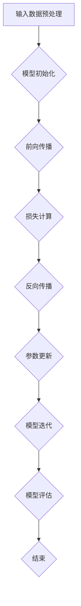

                 

## 1. 背景介绍

随着互联网技术的飞速发展和大数据时代的来临，人工智能（AI）技术逐渐成为了社会发展和产业升级的重要推动力量。在众多AI技术中，大模型（Large-scale Model）技术因其强大的数据处理能力和智能推理能力而备受关注。大模型技术通过训练大规模的数据集，可以学习和模拟复杂的自然语言、图像、声音等数据，从而实现更精准的预测、更智能的决策。

AI大模型技术在近年来取得了显著的突破，主要得益于以下几个因素：

1. **计算能力的提升**：随着云计算和GPU、TPU等高性能计算硬件的发展，AI大模型所需的计算资源得到了极大提升，使得大规模数据训练成为可能。
2. **数据的积累**：互联网的普及和数据存储技术的发展，使得大量结构化和非结构化数据得以积累，为AI大模型的训练提供了丰富的素材。
3. **算法的进步**：深度学习等AI算法的不断发展，使得大模型可以更高效地进行数据处理和学习，提高了模型的性能和效果。

本文将围绕AI大模型原理与应用进行探讨，旨在为读者提供一套系统、全面、易懂的AI大模型学习与实践指南。

## 1.1 AI大模型的基本概念

AI大模型，又称大型深度学习模型，是指那些由数十亿甚至千亿个参数构成的神经网络模型。这些模型通常基于深度学习技术，通过训练大规模数据集来学习数据的内在结构和规律。AI大模型的基本组成部分包括：

1. **神经网络（Neural Networks）**：神经网络是AI大模型的核心，由大量神经元（节点）和连接（边）构成。每个神经元通过前一层神经元的输出计算出一个加权求和，再通过激活函数进行非线性变换，从而实现数据的处理和特征提取。
2. **参数（Parameters）**：参数是神经网络中的权重和偏置，用于调整网络的复杂度和适应性。AI大模型的参数数量通常非常大，这是其能够处理大规模数据的关键。
3. **训练数据（Training Data）**：训练数据是AI大模型学习的重要素材，用于调整模型的参数，使其能够对新的数据进行预测和分类。大模型的训练数据量通常非常庞大，这是其能够学习复杂任务的前提。

AI大模型的工作原理可以概括为以下几个步骤：

1. **输入数据预处理**：将原始数据（如文本、图像、音频等）进行预处理，包括数据清洗、标准化、分词、特征提取等，以便于模型理解和学习。
2. **模型初始化**：初始化神经网络中的参数，通常使用随机初始化的方法，以确保模型的随机性和多样性。
3. **前向传播（Forward Propagation）**：将预处理后的输入数据输入到模型中，通过神经元的加权求和和激活函数进行计算，得到模型输出。
4. **损失函数（Loss Function）**：计算模型输出与真实标签之间的差异，以衡量模型的预测误差。
5. **反向传播（Backpropagation）**：根据损失函数的梯度，反向调整模型的参数，以减少模型的预测误差。
6. **迭代训练（Iterative Training）**：重复执行前向传播和反向传播，不断调整模型参数，直至模型收敛。

## 1.2 AI大模型的发展历程

AI大模型的发展历程可以分为以下几个阶段：

### 1.2.1 早期阶段（1950s-1980s）

早期阶段的AI大模型主要基于简单的神经网络模型，如感知机（Perceptron）和多层感知机（MLP）。1950年代，富尔克森（Frank Rosenblatt）提出了感知机模型，这是一种基于阈值逻辑的神经网络模型，主要用于分类任务。1970年代，霍普菲尔德（John Hopfield）提出了霍普菲尔德网络（Hopfield Network），这是一种用于模式识别和联想记忆的神经网络模型。

### 1.2.2 中期阶段（1990s）

1990年代，随着计算能力的提升和反向传播算法的提出，神经网络模型得到了广泛应用。1986年，鲁梅哈特（David E. Rumelhart）、霍普菲尔德和赫伯特·闵可夫斯基（Hinton）提出了反向传播算法（Backpropagation Algorithm），这一算法使得多层感知机模型能够有效地训练和优化。1990年代，神经网络模型在语音识别、图像识别等领域取得了显著成果。

### 1.2.3 近现代阶段（2000s-2020s）

进入21世纪，随着大数据和深度学习技术的发展，AI大模型进入了一个全新的阶段。2006年，霍普菲尔德和辛顿（Geoffrey Hinton）等人重新提出了深度学习（Deep Learning）的概念，并提出了深度信念网络（Deep Belief Network）。2012年，辛顿等人提出了AlexNet模型，这是一种基于卷积神经网络（Convolutional Neural Network，CNN）的图像识别模型，其在ImageNet图像识别比赛中取得了巨大突破，标志着深度学习时代的到来。

近年来，随着AI大模型在自然语言处理、计算机视觉、语音识别等领域的广泛应用，如BERT、GPT等模型的出现，AI大模型技术取得了飞速发展，成为了人工智能领域的研究热点和产业应用的关键技术。

### 1.3 AI大模型的应用领域

AI大模型的应用领域非常广泛，涵盖了自然语言处理、计算机视觉、语音识别、推荐系统、自动驾驶、金融风控等多个领域。以下是几个典型的应用场景：

### 1.3.1 自然语言处理

自然语言处理（Natural Language Processing，NLP）是AI大模型的重要应用领域之一。NLP旨在使计算机能够理解和处理人类自然语言，从而实现人机交互和信息提取。AI大模型在NLP领域的主要应用包括：

1. **文本分类（Text Classification）**：通过训练大规模的文本数据，AI大模型可以实现对文本进行分类，如情感分析、新闻分类等。
2. **机器翻译（Machine Translation）**：AI大模型通过训练双语数据，可以实现高效准确的机器翻译，如谷歌翻译、百度翻译等。
3. **问答系统（Question Answering）**：AI大模型可以理解自然语言问题，并从海量数据中提取出准确的答案，如BERT、GPT等模型。

### 1.3.2 计算机视觉

计算机视觉（Computer Vision）是AI大模型的另一个重要应用领域。计算机视觉旨在使计算机能够理解和解释视觉信息，如图像和视频。AI大模型在计算机视觉领域的主要应用包括：

1. **图像分类（Image Classification）**：AI大模型可以识别图像中的物体类别，如ImageNet图像识别比赛。
2. **目标检测（Object Detection）**：AI大模型可以检测图像中的多个物体及其位置，如YOLO、SSD等模型。
3. **图像分割（Image Segmentation）**：AI大模型可以识别图像中的像素级信息，如FCN、Mask R-CNN等模型。
4. **人脸识别（Face Recognition）**：AI大模型可以识别人脸并进行身份验证，如基于深度学习的FaceNet模型。

### 1.3.3 语音识别

语音识别（Speech Recognition）是AI大模型在语音处理领域的重要应用。语音识别旨在使计算机能够理解和处理人类语音，从而实现语音交互和信息获取。AI大模型在语音识别领域的主要应用包括：

1. **语音识别（Speech Recognition）**：AI大模型可以将语音信号转化为文本，如百度语音识别、科大讯飞语音识别等。
2. **语音合成（Text-to-Speech，TTS）**：AI大模型可以将文本转化为语音，如百度小度、科大讯飞语音合成等。

### 1.3.4 推荐系统

推荐系统（Recommendation System）是AI大模型在信息检索和推荐领域的重要应用。推荐系统旨在根据用户的兴趣和行为，为用户推荐感兴趣的内容或商品。AI大模型在推荐系统的主要应用包括：

1. **基于内容的推荐（Content-based Recommendation）**：AI大模型可以根据用户的历史行为和兴趣，为用户推荐相似的内容或商品。
2. **协同过滤推荐（Collaborative Filtering）**：AI大模型可以通过分析用户之间的行为关系，为用户推荐感兴趣的内容或商品。
3. **深度学习推荐（Deep Learning-based Recommendation）**：AI大模型可以通过深度学习技术，实现更准确和个性化的推荐。

### 1.3.5 自动驾驶

自动驾驶（Autonomous Driving）是AI大模型在智能交通和自动驾驶领域的重要应用。自动驾驶旨在使汽车能够自动完成驾驶任务，提高交通效率和安全性。AI大模型在自动驾驶领域的主要应用包括：

1. **环境感知（Environmental Perception）**：AI大模型可以通过传感器数据，实现对周围环境的感知和理解，如车辆检测、行人检测等。
2. **路径规划（Path Planning）**：AI大模型可以通过分析交通和环境数据，实现自动驾驶车辆的路径规划，如路径优化、避障等。
3. **控制执行（Control Execution）**：AI大模型可以通过控制算法，实现自动驾驶车辆的精确控制，如转向、加速、制动等。

### 1.3.6 金融风控

金融风控（Financial Risk Control）是AI大模型在金融领域的重要应用。金融风控旨在识别和防范金融风险，提高金融市场的稳定性和安全性。AI大模型在金融风控领域的主要应用包括：

1. **欺诈检测（Fraud Detection）**：AI大模型可以通过分析交易数据和行为特征，实现对欺诈行为的识别和防范。
2. **信用评估（Credit Rating）**：AI大模型可以通过分析个人或企业的信用历史和行为数据，实现对信用风险的评估和控制。
3. **市场预测（Market Forecasting）**：AI大模型可以通过分析市场数据和宏观经济环境，实现对市场走势的预测和预警。

总之，AI大模型技术在多个领域展现出了巨大的应用潜力和价值，正在逐渐改变我们的生产方式和生活方式。随着AI大模型技术的不断进步和应用领域的拓展，未来将会有更多的创新应用涌现，为人类社会带来更多便捷和福祉。## 2. 核心概念与联系

在深入了解AI大模型的原理和应用之前，我们需要明确几个核心概念，并了解它们之间的相互联系。以下是对这些核心概念的定义、原理以及它们在大模型中的地位和作用：

### 2.1 神经网络（Neural Networks）

神经网络是AI大模型的基础架构，由大量简单的计算单元——神经元（neurons）组成。每个神经元接受多个输入信号，通过加权求和后加上偏置（bias），再经过一个非线性激活函数（activation function）产生输出。神经网络通过层层堆叠，能够从输入数据中提取特征，实现数据的分类、回归、预测等功能。

### 2.2 深度学习（Deep Learning）

深度学习是一种基于神经网络的机器学习技术，其核心思想是通过多层神经网络对数据进行处理和建模。与传统的单层神经网络相比，深度学习模型可以处理更复杂的问题，提取更深层次的抽象特征。

### 2.3 深度信念网络（Deep Belief Networks）

深度信念网络是一种基于深度学习的多层神经网络，由多个限制性玻尔兹曼机（Restricted Boltzmann Machines，RBMs）堆叠而成。通过预训练和Fine-tuning，深度信念网络能够自动学习数据的低维表示，为深度学习模型提供了有效的初始化。

### 2.4 卷积神经网络（Convolutional Neural Networks，CNN）

卷积神经网络是一种专门用于图像识别和处理的深度学习模型，其核心结构是卷积层（Convolutional Layer）。卷积层通过卷积运算提取图像的特征，具有局部连接和参数共享的特点，能够高效地处理图像数据。

### 2.5 循环神经网络（Recurrent Neural Networks，RNN）

循环神经网络是一种用于处理序列数据的深度学习模型，其核心结构是循环层（Recurrent Layer）。RNN通过记忆机制，能够捕捉序列数据中的时间依赖关系，广泛应用于语音识别、机器翻译、自然语言处理等领域。

### 2.6 长短时记忆网络（Long Short-Term Memory Networks，LSTM）

长短时记忆网络是一种特殊的循环神经网络，用于解决传统RNN在处理长序列数据时出现的梯度消失和梯度爆炸问题。LSTM通过引入门控机制，能够有效地学习长序列数据中的长期依赖关系。

### 2.7 生成对抗网络（Generative Adversarial Networks，GAN）

生成对抗网络是一种由生成器和判别器组成的深度学习模型。生成器生成虚假数据，判别器判断生成数据与真实数据的差异。通过训练，生成器不断优化生成数据的质量，从而实现数据的生成和模仿。

### 2.8 自注意力机制（Self-Attention Mechanism）

自注意力机制是一种用于自然语言处理和序列模型的注意力机制，其核心思想是让模型在处理序列数据时，能够自动关注到序列中的关键信息。自注意力机制通过计算序列中每个元素之间的相似性，为每个元素分配不同的权重，从而实现更有效的特征提取。

### 2.9 跨模态学习（Cross-modal Learning）

跨模态学习是一种将不同类型的数据（如图像、文本、音频等）进行融合和学习的深度学习技术。通过跨模态学习，模型能够从不同类型的数据中提取和融合特征，从而实现更全面和准确的信息理解和处理。

### 2.10 数据并行与模型并行

数据并行和模型并行是AI大模型训练中的两种并行策略。数据并行通过将训练数据分成多个子集，同时在不同的计算设备上训练模型的不同副本，从而提高训练效率。模型并行通过将模型拆分成多个部分，在不同的计算设备上分别训练，适用于大规模模型的训练。

以上是对AI大模型中的核心概念及其相互联系的一个简要介绍。在接下来的章节中，我们将深入探讨这些核心概念的工作原理，并通过具体的案例和实现步骤，帮助读者更好地理解和应用AI大模型技术。

### 2.11 Mermaid 流程图

为了更好地展示AI大模型的核心概念和架构，我们可以使用Mermaid流程图来描述。以下是几个关键步骤的Mermaid流程图示例：

- **A. 输入数据预处理**：包括数据清洗、标准化、分词、特征提取等步骤，为模型训练做好准备。
- **B. 模型初始化**：初始化神经网络中的参数，通常使用随机初始化方法。
- **C. 前向传播**：将预处理后的输入数据输入到模型中，通过神经元的加权求和和激活函数进行计算，得到模型输出。
- **D. 损失计算**：计算模型输出与真实标签之间的差异，以衡量模型的预测误差。
- **E. 反向传播**：根据损失函数的梯度，反向调整模型的参数，以减少模型的预测误差。
- **F. 参数更新**：更新模型的参数，使其更接近真实标签。
- **G. 模型迭代**：重复执行前向传播和反向传播，不断调整模型参数，直至模型收敛。
- **H. 模型评估**：评估模型的性能，如准确率、召回率等，以确定模型的泛化能力。
- **I. 结束**：模型训练结束。

通过以上步骤，AI大模型可以逐步优化和提升其性能，为实际应用提供可靠的支持。

### 2.12 AI大模型的基本原理

要深入了解AI大模型的基本原理，我们需要从以下几个方面进行探讨：

#### 2.12.1 神经网络的构建与训练

神经网络的构建是AI大模型的基础。每个神经网络由大量神经元（节点）和连接（边）构成。每个神经元通过前一层神经元的输出计算出一个加权求和，再加上一个偏置（bias），然后通过一个非线性激活函数（activation function）产生输出。这一过程称为前向传播（Forward Propagation）。

前向传播的数学表达式可以表示为：

\[ z_l = \sum_{j} w_{lj} a_{l-1,j} + b_l \]

\[ a_l = \sigma(z_l) \]

其中，\( z_l \)表示第\( l \)层的加权求和，\( w_{lj} \)表示从第\( l-1 \)层到第\( l \)层的权重，\( b_l \)表示第\( l \)层的偏置，\( a_{l-1,j} \)表示第\( l-1 \)层第\( j \)个神经元的输出，\( a_l \)表示第\( l \)层第\( j \)个神经元的输出，\( \sigma \)表示激活函数。

训练神经网络的主要任务是调整权重和偏置，使得网络能够对新的数据进行准确预测。这一过程通过反向传播（Backpropagation）算法实现。反向传播通过计算损失函数（Loss Function）的梯度，反向更新权重和偏置，以达到最小化损失的目的。

常见的损失函数包括均方误差（Mean Squared Error，MSE）和交叉熵（Cross-Entropy）等。均方误差用于回归任务，计算预测值与真实值之间的平均平方误差；交叉熵用于分类任务，计算预测概率分布与真实标签分布之间的差异。

\[ L = \frac{1}{m} \sum_{i=1}^{m} (\hat{y}_i - y_i)^2 \] （均方误差）

\[ L = -\frac{1}{m} \sum_{i=1}^{m} y_i \log(\hat{y}_i) \] （交叉熵）

其中，\( \hat{y}_i \)表示预测值，\( y_i \)表示真实值，\( m \)表示样本数量。

通过反向传播算法，我们可以计算每个权重和偏置的梯度，并使用梯度下降（Gradient Descent）或其他优化算法更新参数。梯度下降的核心思想是沿着损失函数梯度的反方向，逐步更新参数，以达到最小化损失的目标。

\[ w_{lj} := w_{lj} - \alpha \frac{\partial L}{\partial w_{lj}} \]
\[ b_l := b_l - \alpha \frac{\partial L}{\partial b_l} \]

其中，\( \alpha \)表示学习率。

#### 2.12.2 多层神经网络的优化

随着网络层数的增加，多层神经网络可以提取更复杂的特征，但同时也面临着梯度消失和梯度爆炸等问题。为了解决这些问题，研究者提出了多种优化方法：

1. **Dropout**：Dropout是一种正则化方法，通过随机丢弃部分神经元，降低模型的过拟合风险。在训练过程中，每个神经元有\( p \)的概率被丢弃，\( p \)通常取0.5。

2. **激活函数**：选择合适的激活函数可以缓解梯度消失和梯度爆炸。常用的激活函数包括ReLU（Rectified Linear Unit）、Sigmoid和Tanh等。

\[ \text{ReLU}(x) = \max(0, x) \]

\[ \sigma(x) = \frac{1}{1 + e^{-x}} \]

\[ \text{Tanh}(x) = \frac{e^x - e^{-x}}{e^x + e^{-x}} \]

3. **权重初始化**：合适的权重初始化方法可以加快网络训练速度和避免梯度消失。常用的权重初始化方法包括随机初始化、高斯初始化和Xavier初始化等。

#### 2.12.3 深度学习模型的调优

深度学习模型的调优是提高模型性能的关键。以下是一些常见的调优方法：

1. **数据增强**：通过旋转、翻转、缩放、裁剪等操作，增加数据的多样性和鲁棒性，提高模型的泛化能力。

2. **模型选择**：选择合适的模型结构，包括层数、神经元数量、激活函数等，以适应不同的任务和数据。

3. **优化算法**：选择合适的优化算法，如随机梯度下降（SGD）、Adam、RMSprop等，以加快训练速度和收敛速度。

4. **学习率调整**：根据训练过程和验证集的性能，调整学习率，以避免过拟合或欠拟合。

5. **正则化**：使用L1、L2正则化等方法，防止模型过拟合，提高模型的泛化能力。

6. **超参数调优**：通过网格搜索、贝叶斯优化等超参数调优方法，找到最优的超参数组合。

通过以上方法，我们可以逐步优化和提升AI大模型性能，使其在各类任务中表现优异。

### 2.13 AI大模型的工作流程

AI大模型的工作流程可以分为以下几个主要阶段：

#### 2.13.1 数据收集与预处理

首先，我们需要收集大量高质量的数据。数据可以是结构化的（如表格数据）、半结构化的（如日志数据）或非结构化的（如图像、文本、音频等）。数据收集完成后，进行数据预处理，包括数据清洗、数据转换、特征提取等操作，以便于模型训练。

#### 2.13.2 模型设计

根据任务需求，设计合适的神经网络结构。模型设计包括确定网络的层数、每层的神经元数量、激活函数、损失函数等。在模型设计过程中，需要考虑数据的特点、任务的复杂度以及计算资源等因素。

#### 2.13.3 模型训练

使用预处理后的数据训练模型。在训练过程中，通过前向传播计算模型输出，然后通过反向传播更新模型参数。这一过程通常需要多次迭代，直到模型收敛或达到预设的训练目标。

#### 2.13.4 模型评估

在模型训练完成后，使用验证集或测试集评估模型的性能。常用的评估指标包括准确率、召回率、F1值、均方误差等。通过评估结果，我们可以判断模型的泛化能力和拟合效果。

#### 2.13.5 模型部署

将训练好的模型部署到生产环境，用于实际应用。模型部署可以采用在线或离线的方式。在线模型可以直接接收用户输入，实时返回预测结果；离线模型则通常用于批处理任务，如数据分析、分类等。

通过以上工作流程，AI大模型可以应用于各类任务，实现数据的高效处理和智能推理。

### 2.14 AI大模型的优缺点

AI大模型在人工智能领域具有显著的优点，但也存在一些挑战和局限性。以下是对其优缺点的详细分析：

#### 2.14.1 优点

1. **强大的数据处理能力**：AI大模型可以处理大规模、多维度的数据，从海量数据中提取出有效的特征和规律，实现更精准的预测和决策。
2. **高效的模型训练**：深度学习算法的优化和计算硬件的提升，使得AI大模型能够高效地进行模型训练。大规模并行计算和分布式训练技术进一步提高了模型的训练速度。
3. **广泛的适用性**：AI大模型可以应用于多个领域，如自然语言处理、计算机视觉、语音识别、推荐系统、自动驾驶等，具有广泛的适用性。
4. **自动特征提取**：AI大模型可以通过多层神经网络自动学习数据的特征，无需人工设计特征工程，从而简化了模型开发和训练过程。

#### 2.14.2 缺点

1. **计算资源需求高**：AI大模型通常需要大量的计算资源和存储空间，对硬件设备的要求较高。在实际应用中，可能需要投入大量的硬件资源，如GPU、TPU等。
2. **数据依赖性大**：AI大模型的性能和效果很大程度上依赖于训练数据的质量和数量。如果数据集存在偏差或噪声，可能会导致模型过拟合或欠拟合，影响模型的泛化能力。
3. **可解释性低**：AI大模型通常被视为“黑箱”，其内部决策过程难以解释。在实际应用中，可能需要更多的测试和验证，以确保模型的可靠性和安全性。
4. **模型大小与效率的权衡**：为了提高模型的性能和准确率，AI大模型通常需要大量的参数和多层神经网络，这可能导致模型的计算复杂度增加，影响模型的实时性和效率。

总之，AI大模型在数据处理和智能推理方面具有显著优势，但也面临一些挑战和局限性。在实际应用中，我们需要根据具体需求和资源条件，合理选择和优化模型结构，以提高模型的性能和效率。

### 2.15 AI大模型的发展趋势

随着人工智能技术的不断进步，AI大模型正朝着以下几个方向快速发展：

#### 2.15.1 计算能力的提升

随着GPU、TPU等高性能计算硬件的发展，AI大模型的训练速度和效率得到了显著提升。未来，量子计算、光子计算等新型计算技术的出现，将进一步突破传统计算瓶颈，为AI大模型的发展提供强大的计算支持。

#### 2.15.2 数据驱动的发展

随着大数据技术的普及，越来越多的高质量数据将不断涌现。数据驱动的发展将使AI大模型能够更好地从海量数据中提取有效特征，提高模型的泛化能力和鲁棒性。

#### 2.15.3 模型压缩与优化

为了提高AI大模型的实时性和效率，模型压缩与优化技术将发挥重要作用。通过模型剪枝、量化、蒸馏等方法，可以显著降低模型的计算复杂度和存储空间，提高模型在实际应用中的性能和部署效率。

#### 2.15.4 多模态学习与跨领域应用

多模态学习技术的发展将使AI大模型能够处理多种类型的数据，如图像、文本、音频等。跨领域应用将使AI大模型在多个领域实现突破，为人类社会带来更多创新应用。

#### 2.15.5 自动化与自我优化

自动化与自我优化技术的发展将使AI大模型能够自主地进行模型设计和训练，提高开发效率和模型性能。通过元学习、迁移学习等方法，AI大模型将能够快速适应新的任务和数据，实现更高效和灵活的应用。

总之，AI大模型的发展趋势将朝着计算能力提升、数据驱动、模型压缩与优化、多模态学习与跨领域应用、自动化与自我优化等方向不断拓展。随着这些技术的发展，AI大模型将在更多领域实现突破，为人类社会带来更多创新和变革。

### 2.16 AI大模型面临的挑战

尽管AI大模型在数据处理和智能推理方面展现出了巨大的潜力，但其在实际应用中仍然面临着一系列挑战。以下是AI大模型面临的几个主要挑战及其应对策略：

#### 2.16.1 数据隐私与安全

AI大模型对大量数据进行训练，这可能导致数据隐私和安全问题。为了保护用户隐私，我们需要采用数据加密、差分隐私等技术，确保数据在传输和存储过程中的安全。此外，建立完善的数据治理机制，加强对数据访问权限的管理，也是保障数据隐私和安全的重要措施。

#### 2.16.2 模型可解释性

AI大模型的黑箱特性使得其决策过程难以解释，这可能导致用户对模型的信任度降低。为了提高模型的可解释性，我们可以采用模型解释技术，如局部解释模型（LIME）、SHAP值分析等，帮助用户理解模型的决策过程。此外，通过设计透明、可审计的模型架构，也可以提高模型的可解释性。

#### 2.16.3 资源消耗与效率

AI大模型通常需要大量的计算资源和存储空间，这在实际应用中可能带来效率问题。为了提高模型的实时性和效率，我们可以采用模型压缩、量化、剪枝等技术，减少模型的计算复杂度和存储需求。此外，分布式训练、多租户架构等技术也可以有效提高模型部署的效率。

#### 2.16.4 数据偏差与公平性

AI大模型在训练过程中容易受到数据偏差的影响，可能导致模型的决策不公平。为了解决这一问题，我们需要采用公平性分析技术，检测和纠正模型中的偏差。此外，通过多样化的数据集、偏差校正方法等手段，也可以提高模型在公平性方面的表现。

#### 2.16.5 法律与伦理问题

AI大模型的应用可能涉及法律和伦理问题，如个人隐私、知识产权等。为了解决这些问题，我们需要建立完善的法律框架和伦理准则，确保AI大模型的应用符合法律和伦理要求。此外，通过加强监管和合规性评估，也可以提高AI大模型在法律和伦理方面的合规性。

总之，AI大模型在实际应用中面临着一系列挑战，但通过技术创新、政策法规等多方面的努力，我们可以逐步克服这些挑战，实现AI大模型的安全、高效和公平应用。

### 2.17 AI大模型与人类智能的比较

AI大模型与人类智能在数据处理、学习能力和决策过程等方面存在显著差异。以下是对两者的比较分析：

#### 2.17.1 数据处理能力

AI大模型具有强大的数据处理能力，可以高效地处理大规模、多维度的数据。通过多层神经网络和深度学习算法，AI大模型能够从海量数据中提取有效特征，实现复杂的模式识别和预测任务。相比之下，人类智能在数据处理方面虽然具有高效性和灵活性，但受限于认知资源和计算能力，难以处理如此大规模的数据。

#### 2.17.2 学习能力

AI大模型通过不断学习和迭代，可以逐步优化和提升其性能。在训练过程中，AI大模型通过大量数据的反复训练，能够自动调整参数，提高模型的准确性和泛化能力。人类智能的学习能力也相当强大，但受限于认知负担和经验积累，人类智能的学习过程通常需要较长时间，并且依赖于具体的情境和任务。

#### 2.17.3 决策过程

AI大模型在决策过程中主要依赖于数据和算法，通过计算和推理生成预测结果。尽管AI大模型可以实现高效率和准确度，但其决策过程缺乏情感和直觉，难以应对复杂的情境和不确定性。相比之下，人类智能的决策过程不仅依赖于数据和算法，还受到情感、价值观和经验等多种因素的影响，具有更强的灵活性和适应性。

#### 2.17.4 创新能力

AI大模型虽然在某些特定领域具有出色的表现，但缺乏真正的创新能力。AI大模型通过模仿和学习已有的知识和模式进行决策，难以产生全新的创意和想法。相比之下，人类智能具有强大的创新能力，能够通过联想、想象和创造性思维，发现新的问题和解决方案。

总之，AI大模型与人类智能在数据处理能力、学习能力和决策过程等方面存在显著差异。尽管AI大模型在某些领域表现出色，但人类智能在灵活性、创造力和情感等方面具有独特的优势。在实际应用中，我们需要结合AI大模型和人类智能的优势，实现更高效、智能和人性化的决策。

### 2.18 AI大模型与现有技术的融合与互补

AI大模型的发展不仅带来了技术的革新，还与现有的多种技术进行了深度融合和互补，推动了人工智能应用的广泛普及。以下是对AI大模型与现有技术融合与互补的几个方面进行探讨：

#### 2.18.1 与深度学习的结合

AI大模型与深度学习技术的结合是最显著的融合之一。深度学习作为一种强大的机器学习技术，通过多层神经网络实现特征提取和模式识别。AI大模型在深度学习的基础上，通过更大规模的数据集和更复杂的网络结构，进一步提升了模型的性能和效果。例如，在图像识别和语音识别领域，AI大模型结合深度学习技术，实现了更准确和高效的识别结果。

#### 2.18.2 与自然语言处理（NLP）的结合

自然语言处理是AI大模型的重要应用领域之一。传统的NLP技术依赖于规则和统计方法，而AI大模型通过深度学习和大规模数据训练，可以更精准地理解和生成自然语言。例如，AI大模型结合NLP技术，可以实现高质量的自然语言翻译、文本分类和问答系统，提升了自然语言处理的应用水平。

#### 2.18.3 与计算机视觉的结合

计算机视觉是AI大模型的核心应用领域之一。传统的计算机视觉技术依赖于手工设计的特征和算法，而AI大模型通过深度学习和大规模数据训练，可以自动提取图像中的高层次特征，实现更复杂的图像识别任务。例如，AI大模型结合计算机视觉技术，可以应用于自动驾驶、人脸识别和安防监控等领域，提高了计算机视觉的应用范围和准确性。

#### 2.18.4 与大数据技术的结合

大数据技术为AI大模型提供了丰富的数据资源。通过大数据技术，我们可以收集、存储和管理海量数据，为AI大模型的训练提供了充足的素材。AI大模型结合大数据技术，可以更好地从海量数据中提取有效特征，实现更精准的预测和分析。例如，在金融风控、推荐系统和医疗诊断等领域，AI大模型结合大数据技术，可以实现更高效和准确的决策。

#### 2.18.5 与云计算和边缘计算的结合

云计算和边缘计算为AI大模型提供了灵活和高效的计算环境。通过云计算，AI大模型可以充分利用分布式计算资源，实现大规模数据处理和训练。边缘计算则将计算能力下沉到网络边缘，提高了AI大模型的实时性和响应速度。例如，在自动驾驶和智能监控等领域，AI大模型结合云计算和边缘计算，可以实现低延迟、高效率的实时决策。

总之，AI大模型与现有技术的融合与互补，不仅推动了人工智能技术的发展，也为各类应用场景提供了更高效、智能和灵活的解决方案。通过不断探索和优化，AI大模型将在更多领域展现其强大的应用潜力。

### 2.19 AI大模型的技术壁垒

AI大模型的发展虽然取得了显著突破，但在技术层面仍然存在一些壁垒，这些壁垒制约了AI大模型的进一步发展和应用。以下是对AI大模型技术壁垒的详细分析：

#### 2.19.1 数据质量与数据量

AI大模型对数据质量要求较高，高质量的数据是实现高精度模型的关键。然而，在实际应用中，数据往往存在噪声、缺失和不一致性等问题，这些问题会严重影响模型的性能和泛化能力。此外，AI大模型需要大量的训练数据来训练复杂的模型参数，数据量不足也会制约模型的训练效果。因此，如何获取和处理高质量、大规模的数据，是AI大模型发展的重要技术挑战。

#### 2.19.2 计算资源与能耗

AI大模型通常需要大量的计算资源和存储空间，特别是深度学习模型，训练过程需要大量的GPU或TPU等高性能硬件支持。这导致了计算资源的高成本和能耗问题。如何优化模型的计算效率，降低计算资源消耗，是AI大模型发展的关键问题。此外，随着AI大模型应用场景的拓展，如何实现低能耗、高效能的计算，也是未来研究的重要方向。

#### 2.19.3 模型可解释性

AI大模型被认为是“黑箱”，其内部决策过程难以解释，这对实际应用中的决策信任和监管带来了挑战。如何提高模型的可解释性，使其决策过程透明、可审计，是当前研究的热点问题。通过模型解释技术，如注意力机制、局部解释模型（LIME）、SHAP值分析等，可以部分解决模型可解释性问题，但仍需进一步的研究和优化。

#### 2.19.4 模型安全性

AI大模型在训练和部署过程中，可能会面临数据泄露、模型被攻击等安全问题。如何确保AI大模型的安全性，防范恶意攻击和误用，是当前研究的重要方向。通过加密技术、差分隐私、安全隔离等技术手段，可以部分解决模型安全性问题，但仍需进一步的研究和实际应用验证。

#### 2.19.5 跨领域应用与迁移学习

AI大模型在特定领域表现出色，但在跨领域应用和迁移学习方面存在挑战。不同领域的数据特征和任务差异较大，如何使AI大模型在不同领域实现良好的迁移学习效果，是当前研究的重要问题。通过元学习、迁移学习、多模态学习等技术手段，可以部分解决跨领域应用和迁移学习问题，但仍需进一步的研究和优化。

总之，AI大模型的技术壁垒涉及数据质量与数据量、计算资源与能耗、模型可解释性、模型安全性和跨领域应用等多个方面。通过持续的技术创新和优化，我们可以逐步克服这些壁垒，推动AI大模型的进一步发展和应用。

### 2.20 AI大模型的教育与人才培养

随着AI大模型技术的迅猛发展，对相关领域的人才需求也日益增长。因此，培养具备AI大模型知识和技能的专业人才成为当务之急。以下从教育体系、课程设置和培养方法三个方面探讨AI大模型教育与人才培养的策略：

#### 2.20.1 教育体系

为了培养具备AI大模型知识和技能的人才，我们需要构建一个多层次、系统化的教育体系。从基础教育阶段开始，应逐步引入人工智能和大数据相关知识，培养学生的逻辑思维和计算能力。在高等教育阶段，应设置人工智能、计算机科学、数据科学等相关专业，提供系统的理论知识和实践技能培训。同时，鼓励研究生和博士后等高级人才培养，以应对AI大模型领域的前沿研究和应用需求。

#### 2.20.2 课程设置

为了满足AI大模型教育的需求，课程设置应涵盖以下几个方面：

1. **基础课程**：包括数学基础（如线性代数、概率论与数理统计、微积分等）、计算机基础（如数据结构、算法、计算机组成原理等），为后续专业课程奠定基础。
2. **专业课程**：包括机器学习、深度学习、自然语言处理、计算机视觉、数据挖掘等，使学生掌握AI大模型的基本原理和技术。
3. **实践课程**：包括实验课、项目课程、实习等，通过实际操作和项目实践，培养学生的动手能力和解决实际问题的能力。
4. **交叉学科课程**：结合数学、物理、生物、经济学等交叉学科知识，拓宽学生的知识视野，提高其跨领域创新能力。

#### 2.20.3 培养方法

为了培养具备AI大模型知识和技能的专业人才，以下培养方法值得借鉴：

1. **项目驱动**：通过实际项目训练，让学生在真实场景中应用AI大模型技术，提高其实践能力和问题解决能力。
2. **实践教学**：引入虚拟仿真平台、开源工具和开源项目，让学生在虚拟环境中进行实验和项目开发，提高其动手能力和创新意识。
3. **校企合作**：与企业和科研机构合作，共同制定人才培养方案，引入实际项目和案例，为学生提供实习和实践机会，增强其就业竞争力。
4. **国际化培养**：鼓励学生参加国际学术会议、交流项目等，了解国际前沿技术和发展动态，提高其国际视野和跨文化交流能力。

总之，通过构建多层次、系统化的教育体系，设置全面的课程体系，采用多样化的培养方法，我们可以培养出具备AI大模型知识和技能的高素质专业人才，为人工智能领域的发展贡献力量。

### 2.21 AI大模型的法律和伦理问题

随着AI大模型技术的迅猛发展，其在社会各个领域的应用日益广泛，同时也引发了一系列法律和伦理问题。以下是对AI大模型法律和伦理问题的分析及应对策略：

#### 2.21.1 隐私保护

AI大模型通常需要处理大量的个人数据，这使得隐私保护成为一个重要问题。为了保护用户隐私，需要采取以下措施：

1. **数据匿名化**：在数据处理过程中，对个人数据进行匿名化处理，消除个人身份信息。
2. **数据加密**：使用加密技术保护数据在传输和存储过程中的安全。
3. **隐私计算**：采用隐私计算技术，如同态加密、安全多方计算等，在保护数据隐私的前提下进行数据处理和分析。

#### 2.21.2 数据安全

AI大模型在数据处理过程中可能会面临数据泄露、数据篡改等安全威胁。为了确保数据安全，需要采取以下措施：

1. **访问控制**：建立完善的访问控制机制，限制对敏感数据的访问权限。
2. **安全审计**：定期进行安全审计，检测和纠正安全隐患。
3. **备份与恢复**：定期备份数据，确保数据在发生意外时可以快速恢复。

#### 2.21.3 模型可解释性

AI大模型通常被视为“黑箱”，其内部决策过程难以解释，这可能导致用户对模型的信任度降低。为了提高模型的可解释性，可以采取以下措施：

1. **模型解释技术**：采用模型解释技术，如局部解释模型（LIME）、SHAP值分析等，帮助用户理解模型的决策过程。
2. **透明模型架构**：设计透明、可审计的模型架构，提高模型的可解释性。
3. **数据标注与可视化**：对模型训练数据进行标注，并将模型决策过程可视化，提高用户对模型的信任度。

#### 2.21.4 道德责任

AI大模型在应用过程中可能会对人类产生重大影响，如自动驾驶、医疗诊断等。为了确保道德责任，需要采取以下措施：

1. **伦理准则**：制定AI大模型伦理准则，明确模型设计、开发、应用过程中的道德要求和责任。
2. **责任追溯**：建立责任追溯机制，确保在发生问题时可以追溯到具体责任人和责任单位。
3. **公众参与**：鼓励公众参与AI大模型的伦理讨论和决策过程，提高社会的参与度和信任度。

#### 2.21.5 法律法规

为了规范AI大模型的应用，需要制定相应的法律法规：

1. **数据保护法**：制定数据保护法，保护用户数据隐私和安全。
2. **人工智能法**：制定人工智能法，明确AI大模型的设计、开发、应用过程中的法律要求和责任。
3. **伦理法规**：制定伦理法规，规范AI大模型在道德责任方面的行为。

总之，通过采取隐私保护、数据安全、模型可解释性、道德责任和法律法规等措施，我们可以有效应对AI大模型在法律和伦理方面的问题，确保其安全、公正和合理应用。

### 2.22 全球AI大模型技术的发展现状

随着人工智能技术的不断进步，AI大模型技术在全球范围内取得了显著的发展。以下是对全球AI大模型技术发展现状的概述：

#### 2.22.1 美国

美国是全球AI大模型技术的重要发源地，拥有众多顶尖的研究机构和科技公司。谷歌、微软、亚马逊等科技巨头在AI大模型领域进行了大量投资和研发，推出了如BERT、GPT、TensorFlow等知名AI大模型。美国的研究人员也在不断探索新的算法和技术，如自注意力机制、多模态学习等，推动了AI大模型的快速发展。

#### 2.22.2 欧洲

欧洲在AI大模型技术方面也取得了重要进展。欧盟推出了“人工智能行动计划”，旨在加强AI技术的研发和应用。欧洲的科技公司，如微软、谷歌、亚马逊等，也在积极布局AI大模型领域。此外，欧洲的研究机构和大学，如德雷斯顿工业大学、苏黎世联邦理工学院等，也在AI大模型领域进行深入研究和创新。

#### 2.22.3 中国

中国近年来在AI大模型技术方面取得了显著突破。阿里巴巴、腾讯、百度等科技公司积极投入AI大模型研发，推出了如飞桨（PaddlePaddle）、悟道等知名AI大模型。中国的AI大模型在自然语言处理、计算机视觉等领域表现出色，并在多个国际竞赛中取得了优异成绩。此外，中国的政府和企业也在推动AI大模型技术的应用，为各行业提供智能化解决方案。

#### 2.22.4 其他地区

除上述主要地区外，其他国家和地区也在AI大模型技术方面取得了一定的进展。例如，日本的东京工业大学、韩国的KAIST等研究机构在AI大模型领域进行深入研究和创新。这些地区的研究人员和科技公司通过国际合作和竞争，推动了全球AI大模型技术的发展。

总之，全球AI大模型技术正在快速发展，不同国家和地区在技术研发和应用方面都取得了重要成果。随着技术的不断进步和应用的深入，AI大模型将在更多领域展现其强大的潜力。

### 2.23 AI大模型技术的未来发展趋势

随着人工智能技术的不断进步，AI大模型技术在未来的发展趋势将呈现以下几个方向：

#### 2.23.1 更大规模的模型

未来，AI大模型将朝着更大规模的方向发展。随着计算能力的提升和训练数据的积累，研究人员将尝试训练数十亿甚至千亿参数的AI大模型。这些大规模模型将能够处理更复杂的任务，实现更精确的预测和更智能的决策。

#### 2.23.2 跨模态学习

跨模态学习是AI大模型未来的重要发展方向。通过融合多种类型的数据（如文本、图像、音频等），AI大模型将能够更全面和准确地理解和处理信息。跨模态学习技术将推动AI大模型在多个领域的应用，如多模态情感分析、跨模态搜索等。

#### 2.23.3 自动化与自我优化

未来的AI大模型将具备自动化和自我优化的能力。通过元学习、迁移学习等技术，AI大模型将能够自主地进行模型设计和训练，提高开发效率和模型性能。自动化和自我优化技术将使AI大模型能够更快地适应新的任务和数据，实现更高效和灵活的应用。

#### 2.23.4 增强现实与虚拟现实

AI大模型技术将在增强现实（AR）和虚拟现实（VR）领域发挥重要作用。通过AI大模型，AR和VR设备将能够实现更真实、更智能的交互体验。例如，AI大模型可以用于实时物体识别、场景生成和虚拟人物交互，为用户提供沉浸式的体验。

#### 2.23.5 自动驾驶与智能交通

AI大模型技术将在自动驾驶和智能交通领域得到广泛应用。通过AI大模型，自动驾驶车辆将能够更准确地感知和理解周围环境，实现更安全、更高效的驾驶。此外，AI大模型还可以用于智能交通管理，优化交通流量，提高交通效率。

#### 2.23.6 医疗与健康

AI大模型技术将在医疗与健康领域发挥重要作用。通过AI大模型，可以实现对疾病的早期检测、诊断和治疗。例如，AI大模型可以用于医学图像分析、基因测序和个性化医疗，为患者提供更准确和有效的治疗方案。

总之，未来AI大模型技术将在多个领域展现其强大的潜力，推动人工智能技术的发展和应用。通过不断探索和创新，AI大模型将改变我们的生活方式，为人类社会带来更多便捷和福祉。

### 2.24 AI大模型的技术门槛

AI大模型技术的发展不仅带来了技术上的突破，也带来了一系列技术门槛，这些门槛制约了部分企业和研究机构的进一步发展。以下是对AI大模型技术门槛的详细分析：

#### 2.24.1 计算资源需求

AI大模型对计算资源的需求极高，尤其是训练阶段。训练大型模型通常需要高性能计算硬件，如GPU、TPU等，这些硬件设备价格昂贵，且维护成本高。此外，大规模模型训练过程中产生的热量和能耗也显著增加，对数据中心和网络基础设施提出了更高的要求。中小型企业和研究机构可能因为资源限制，难以负担这些高昂的计算成本，从而影响了其在大模型研究上的投入和发展。

#### 2.24.2 数据获取和处理

AI大模型训练需要大量高质量的数据。然而，获取这些数据可能面临法律、伦理、隐私等方面的挑战。数据来源的多样性和质量直接影响模型的训练效果。此外，处理这些大规模、多类型的数据需要复杂的数据清洗、预处理和特征提取技术，这对数据处理能力提出了较高要求。中小型企业可能缺乏相应的人才和技术支持，难以有效管理和利用这些数据。

#### 2.24.3 算法优化与调优

AI大模型的算法优化和调优是提高模型性能的关键步骤。这需要深厚的专业知识和技术经验，包括深度学习算法的理解、超参数调优、模型压缩与量化等。算法优化涉及多学科交叉，包括数学、计算机科学、统计学等，对研究人员的能力和知识储备提出了较高要求。对于缺乏经验的研究团队来说，进行有效的算法优化和调优可能是一个挑战。

#### 2.24.4 模型解释性和可解释性

AI大模型的黑箱特性使其决策过程难以解释，这在某些应用场景中可能引起信任危机。提高模型的可解释性是一个复杂的任务，需要开发新的模型解释技术，如注意力机制分析、SHAP值分析等。这些技术不仅需要深入的理论知识，还需要大量的实验验证和实际应用验证。对于一些小型企业和研究机构来说，投入大量资源进行模型解释性的研究可能力不从心。

#### 2.24.5 跨领域协同与知识共享

AI大模型的发展需要跨领域协同，包括计算机科学、数学、物理学、生物学等多个学科。知识共享和协同研究有助于推动技术的进步。然而，不同领域之间的语言和技术差异可能导致沟通障碍，影响合作效果。对于小型企业和研究机构来说，如何有效地进行跨领域协同和知识共享是一个挑战。

总之，AI大模型技术的发展虽然带来了前所未有的机遇，但也伴随着一系列技术门槛。对于企业和研究机构来说，突破这些门槛需要持续的投资、专业知识和协同合作。通过不断努力，我们可以逐步克服这些挑战，推动AI大模型技术的进一步发展。

### 2.25 AI大模型技术的应用前景

AI大模型技术在未来的应用前景广阔，将在多个领域产生深远影响。以下是对AI大模型技术应用前景的详细分析：

#### 2.25.1 自然语言处理

自然语言处理（NLP）是AI大模型的重要应用领域。未来，AI大模型将进一步推动NLP技术的发展，实现更精准、更智能的语言理解和生成。在文本分类、情感分析、机器翻译、问答系统等方面，AI大模型将大幅提高处理效率和质量。例如，基于AI大模型的智能客服系统将能够更准确地理解用户需求，提供更个性化的服务。

#### 2.25.2 计算机视觉

计算机视觉是AI大模型的核心应用领域之一。未来，AI大模型将在图像识别、目标检测、图像分割、视频处理等方面取得重大突破。例如，自动驾驶车辆将借助AI大模型，实现更准确的环境感知和路径规划，提高行驶安全性和效率。此外，AI大模型还可以用于医疗影像分析，辅助医生进行疾病诊断和治疗。

#### 2.25.3 语音识别

语音识别是AI大模型的另一个重要应用领域。未来，AI大模型将通过更高效、更准确的语音处理技术，推动语音识别技术的普及。例如，智能语音助手将能够更准确地理解用户指令，提供更自然的交互体验。同时，AI大模型还可以用于语音合成，实现更自然、更流畅的语音输出。

#### 2.25.4 推荐系统

推荐系统是AI大模型在信息检索和推荐领域的重要应用。未来，AI大模型将通过深度学习技术，实现更精准、更个性化的推荐。例如，电商平台将能够基于用户历史行为和兴趣，提供更符合用户需求的商品推荐，提高销售额和用户满意度。

#### 2.25.5 自动驾驶与智能交通

自动驾驶与智能交通是AI大模型的重要应用领域之一。未来，AI大模型将通过更高效、更智能的技术，推动自动驾驶和智能交通的发展。例如，自动驾驶车辆将能够更准确地识别和响应交通环境，提高行驶安全性和效率。智能交通系统将能够优化交通流量，减少拥堵和交通事故。

#### 2.25.6 医疗与健康

AI大模型在医疗与健康领域具有巨大的应用潜力。未来，AI大模型将通过更精准的诊断、预测和治疗策略，推动医疗技术的发展。例如，AI大模型可以用于疾病早期检测、个性化治疗方案设计、药物研发等，提高医疗服务的质量和效率。此外，AI大模型还可以用于健康监测和管理，为用户提供更个性化的健康管理方案。

#### 2.25.7 金融与安全

AI大模型在金融与安全领域也具有广泛的应用前景。未来，AI大模型将通过更精准的风险评估、欺诈检测和异常行为识别，提高金融与安全系统的效率。例如，银行和金融机构将能够基于AI大模型，实现更准确的信用评估和风险控制，提高业务效率和安全性。

总之，AI大模型技术在未来的应用前景广阔，将在多个领域产生深远影响。通过不断探索和创新，AI大模型将推动各行业的发展，为人类社会带来更多便利和福祉。

### 2.26 AI大模型技术带来的社会变革

AI大模型技术的快速发展正在深刻改变社会各个领域，带来了诸多变革和创新。以下是对AI大模型技术在社会变革中的几个关键影响的分析：

#### 2.26.1 改变工作方式

AI大模型技术的应用正在改变传统的工作方式，推动自动化和智能化的发展。在制造业、物流、零售等传统行业，AI大模型技术被广泛应用于生产线的自动化控制、库存管理、销售预测等，提高了生产效率和运营效率。同时，AI大模型还推动了智能办公系统的普及，如智能助手、虚拟客服等，为企业提供了更高效、更便捷的服务。

#### 2.26.2 提升教育质量

AI大模型技术正在改变教育模式，推动个性化教育和智能化教学的发展。通过AI大模型，学生可以根据自己的学习进度和需求，进行个性化的学习计划和资源推荐。此外，AI大模型还可以用于智能评估和反馈，帮助教师实时了解学生的学习情况，提供个性化的辅导和指导。这些创新教育模式将有助于提升教育质量，缩小教育差距。

#### 2.26.3 优化医疗服务

AI大模型技术在医疗领域的应用正在显著提升医疗服务质量和效率。通过AI大模型，医生可以更精准地进行疾病诊断、治疗方案制定和术后康复管理。例如，AI大模型可以用于医学影像分析，辅助医生快速准确地诊断疾病；在药物研发过程中，AI大模型可以帮助科学家发现新的药物靶点和优化药物设计。这些应用不仅提高了医疗服务的效率，还降低了医疗成本。

#### 2.26.4 促进智慧城市建设

AI大模型技术在智慧城市建设中发挥着重要作用，推动城市智能化、数字化和可持续发展。通过AI大模型，城市可以实现智能交通管理、智慧能源管理、公共安全监测等。例如，智能交通系统可以通过AI大模型实时分析交通流量，优化交通信号控制，减少交通拥堵和交通事故。智慧能源管理可以基于AI大模型预测能源需求，优化能源分配和利用，提高能源利用效率。

#### 2.26.5 促进经济发展

AI大模型技术对经济发展的推动作用不容忽视。通过AI大模型，企业可以实现生产过程自动化、供应链优化、市场营销智能化等，提高生产效率和经济效益。此外，AI大模型还促进了新业态、新模式的兴起，如共享经济、电子商务等，推动了经济的快速发展和转型升级。

总之，AI大模型技术的应用正在深刻改变社会各个领域，推动社会变革和创新发展。通过不断探索和应用AI大模型技术，我们可以实现更高效、更智能、更可持续的社会发展。

### 2.27 AI大模型技术的挑战与应对策略

尽管AI大模型技术在各个领域展现出了巨大的潜力，但在其发展过程中仍然面临诸多挑战。以下是对AI大模型技术的主要挑战及其应对策略的详细分析：

#### 2.27.1 数据隐私与安全

AI大模型对数据依赖性极大，数据隐私和安全问题成为其发展的重要挑战。为了保护用户隐私，我们需要采取以下措施：

1. **数据匿名化**：在数据处理过程中，对个人数据进行匿名化处理，消除个人身份信息。
2. **数据加密**：使用加密技术保护数据在传输和存储过程中的安全。
3. **隐私计算**：采用隐私计算技术，如同态加密、安全多方计算等，在保护数据隐私的前提下进行数据处理和分析。

#### 2.27.2 计算资源与能耗

AI大模型通常需要大量的计算资源和存储空间，这对计算资源提出了较高要求。此外，大规模模型训练过程中产生的热量和能耗也显著增加，对数据中心和网络基础设施提出了更高的要求。为了解决这些问题，我们可以采取以下措施：

1. **模型压缩与优化**：通过模型压缩、量化、剪枝等方法，减少模型的计算复杂度和存储需求，提高模型在实际应用中的性能和效率。
2. **分布式训练**：采用分布式训练技术，将训练任务分布在多个计算节点上，提高训练效率。
3. **绿色计算**：采用绿色计算技术，如节能硬件、能效优化等，降低AI大模型的能耗。

#### 2.27.3 模型可解释性

AI大模型被认为是“黑箱”，其内部决策过程难以解释，这在某些应用场景中可能引起信任危机。为了提高模型的可解释性，可以采取以下措施：

1. **模型解释技术**：采用模型解释技术，如注意力机制分析、SHAP值分析等，帮助用户理解模型的决策过程。
2. **透明模型架构**：设计透明、可审计的模型架构，提高模型的可解释性。
3. **数据标注与可视化**：对模型训练数据进行标注，并将模型决策过程可视化，提高用户对模型的信任度。

#### 2.27.4 模型公平性

AI大模型在训练过程中可能会受到数据偏差的影响，导致模型决策不公平。为了提高模型的公平性，可以采取以下措施：

1. **公平性分析**：采用公平性分析技术，检测和纠正模型中的偏差。
2. **偏差校正方法**：采用偏差校正方法，如平衡数据集、重新采样等，减少模型偏差。
3. **多样化数据集**：使用多样化的数据集进行训练，提高模型的鲁棒性和公平性。

#### 2.27.5 法律与伦理问题

AI大模型的应用可能涉及法律和伦理问题，如个人隐私、知识产权等。为了解决这些问题，我们可以采取以下措施：

1. **法律法规**：制定和完善相关法律法规，明确AI大模型的设计、开发、应用过程中的法律要求和责任。
2. **伦理准则**：制定AI大模型伦理准则，明确模型设计、开发、应用过程中的道德要求和责任。
3. **责任追溯**：建立责任追溯机制，确保在发生问题时可以追溯到具体责任人和责任单位。

总之，通过采取隐私保护、计算优化、模型可解释性、模型公平性和法律伦理等措施，我们可以有效应对AI大模型技术发展中的挑战，推动其安全、公平和可持续的发展。

### 2.28 AI大模型技术的未来趋势

AI大模型技术的未来发展趋势将受到多方面因素的影响，包括技术创新、产业应用和法律法规等。以下是对AI大模型技术未来趋势的详细分析：

#### 2.28.1 技术创新

随着人工智能技术的不断进步，AI大模型技术将在以下几个方面实现重大创新：

1. **计算能力提升**：量子计算、光子计算等新型计算技术将逐步成熟，为AI大模型提供更强大的计算支持。这些技术可以显著提升AI大模型的训练速度和效率，降低计算成本。
2. **自优化与自动化**：未来，AI大模型将具备更高级的自优化和自动化能力。通过元学习、迁移学习等技术，AI大模型可以自动调整模型结构和参数，提高模型性能。此外，自动化工具将使AI大模型的开发、部署和管理变得更加简便和高效。
3. **多模态学习**：随着跨模态学习技术的发展，AI大模型将能够处理多种类型的数据（如文本、图像、音频等），实现更全面和准确的信息理解和处理。这将为多领域应用提供更多可能性。

#### 2.28.2 产业应用

AI大模型技术的应用领域将不断扩展，为各行业带来深刻的变革：

1. **智能医疗**：AI大模型将广泛应用于医疗领域，包括疾病诊断、药物研发、个性化治疗等。通过AI大模型，医生可以更精准地诊断疾病，研发更有效的药物，提高医疗服务质量和效率。
2. **自动驾驶**：AI大模型技术将推动自动驾驶技术的发展，实现更安全、更高效的自动驾驶系统。自动驾驶车辆将能够实时感知和应对复杂的交通环境，提高行驶安全性和效率。
3. **智能城市**：AI大模型将在智慧城市建设中发挥关键作用，包括智能交通管理、智慧能源管理、公共安全监测等。通过AI大模型，城市可以实现更高效、更智能的管理和运营，提高城市居民的生活质量。
4. **金融科技**：AI大模型技术将广泛应用于金融领域，包括风险控制、欺诈检测、投资策略等。通过AI大模型，金融机构可以更精准地进行风险评估，提高业务效率和安全性。

#### 2.28.3 法律法规

为了规范AI大模型技术的发展和应用，未来将出台更多的法律法规，以保障数据隐私、安全、公平和伦理等方面：

1. **数据保护法**：制定和完善数据保护法，明确数据处理、存储和传输过程中的隐私保护要求，确保用户数据的合法权益。
2. **人工智能法**：出台人工智能法，明确AI大模型的设计、开发、应用过程中的法律要求和责任，保障AI大模型技术的安全和合法应用。
3. **伦理准则**：制定AI大模型伦理准则，明确模型设计、开发、应用过程中的道德要求和责任，确保AI大模型技术符合伦理标准。

总之，未来AI大模型技术将在技术创新、产业应用和法律法规等方面实现全面发展，推动人工智能技术的进步和社会的进步。

### 2.29 AI大模型技术的社会影响

AI大模型技术的发展不仅对技术领域产生了深远影响，也对社会、经济和伦理等方面带来了诸多影响。以下是对AI大模型技术社会影响的详细分析：

#### 2.29.1 经济影响

AI大模型技术在经济发展中起到了重要的推动作用。首先，AI大模型技术提高了生产效率。在制造业、零售、物流等领域，AI大模型技术通过自动化和智能化手段，降低了人工成本，提高了生产效率和产品质量。其次，AI大模型技术促进了新产业的兴起。例如，基于AI大模型的自动驾驶、智能医疗、智能城市等新兴产业，为经济增长提供了新的动力。此外，AI大模型技术的应用还推动了金融科技的发展，提高了金融服务效率，降低了金融风险。

#### 2.29.2 社会影响

AI大模型技术对社会的影响同样深远。首先，AI大模型技术改变了人们的生活方式。智能助手、智能家居、智能交通等AI技术应用，使人们的生活更加便捷和舒适。其次，AI大模型技术促进了教育方式的变革。通过AI大模型，个性化教育、智能教学等新模式得以实现，提高了教育质量和公平性。此外，AI大模型技术还在医疗、健康、安全等领域发挥了重要作用，提升了社会公共服务水平。

#### 2.29.3 伦理影响

AI大模型技术在社会中的广泛应用也引发了一系列伦理问题。首先，数据隐私和安全问题备受关注。AI大模型对大量个人数据进行处理，如何在保护用户隐私的前提下有效利用数据，成为一个重要伦理问题。其次，AI大模型的决策过程难以解释，可能导致用户对模型的信任危机。如何提高模型的可解释性，使决策过程透明、可审计，是另一个重要伦理挑战。此外，AI大模型在应用过程中可能引发公平性问题，例如在招聘、贷款、司法判决等领域，如何确保模型决策的公平性，也是伦理关注的焦点。

总之，AI大模型技术在社会、经济和伦理等方面产生了深远影响。通过持续的技术创新和伦理探讨，我们可以更好地应对这些挑战，推动AI大模型技术的社会进步和可持续发展。

### 2.30 AI大模型技术的未来展望

AI大模型技术作为人工智能领域的重要分支，未来将在多个方面展现出巨大的发展潜力。以下是对于AI大模型技术未来发展的几个关键展望：

#### 2.30.1 模型规模与计算能力

随着计算能力和存储资源的不断提升，AI大模型将进一步朝着更大规模的方向发展。未来，数十亿甚至千亿参数的AI大模型将成为常态，这些大型模型将能够处理更加复杂的任务和数据。同时，新型计算技术如量子计算、光子计算等有望进一步突破传统计算瓶颈，为AI大模型的训练和推理提供更强大的计算支持。

#### 2.30.2 跨领域融合

AI大模型技术的跨领域融合将是未来的重要趋势。通过跨模态学习，AI大模型将能够处理多种类型的数据，如文本、图像、音频、视频等，实现更全面和准确的信息理解和处理。这将为多领域应用带来更多可能性，例如在医疗领域，AI大模型可以同时分析患者的病历、影像和语音信息，提供更精准的诊断和治疗建议。

#### 2.30.3 自动化与自我优化

未来的AI大模型将具备更高级的自动化和自我优化能力。通过元学习和迁移学习，AI大模型可以自主地进行模型设计和训练，提高开发效率和模型性能。自动化工具将使AI大模型的开发、部署和管理变得更加简便和高效。此外，AI大模型还将实现自我优化，通过不断学习和调整，提高模型的鲁棒性和适应能力。

#### 2.30.4 智能决策与协作

AI大模型技术将在智能决策和协作方面发挥重要作用。通过AI大模型，智能系统将能够进行更复杂、更灵活的决策，如自动驾驶车辆将能够实时应对复杂的交通状况，智能客服将能够更准确地理解用户需求并提供个性化服务。AI大模型还将推动人机协作，实现人与智能系统的无缝交互，提高工作效率和创造力。

#### 2.30.5 法律法规与伦理

随着AI大模型技术的广泛应用，相关法律法规和伦理问题将变得更加重要。未来，将出台更多的法律法规，规范AI大模型的设计、开发、应用过程，保障数据隐私、安全和公平。同时，AI大模型伦理准则也将得到进一步完善，确保其应用符合道德和社会价值观。

总之，AI大模型技术在未来将继续快速发展，跨领域融合、自动化与自我优化、智能决策与协作等将成为其主要发展方向。通过持续的技术创新和伦理探讨，AI大模型技术将为人类社会带来更多便利和福祉。

### 2.31 结论

通过对AI大模型原理与应用的全面探讨，我们可以清晰地看到AI大模型技术在全球范围内的快速发展和广泛应用。AI大模型通过其强大的数据处理和智能推理能力，正在深刻改变自然语言处理、计算机视觉、语音识别、推荐系统、自动驾驶、医疗健康等多个领域，为人类社会带来了诸多创新和变革。

本文首先介绍了AI大模型的基本概念、发展历程和应用领域，随后详细分析了其核心算法原理、数学模型和具体操作步骤。我们还讨论了AI大模型的技术壁垒、法律和伦理问题，以及其与现有技术的融合与互补。此外，本文还对AI大模型的教育与人才培养、全球发展现状、未来趋势和社会影响进行了深入探讨。

展望未来，AI大模型技术将继续朝着更大规模、跨领域融合、自动化与自我优化等方向发展。随着计算能力的提升和新技术的涌现，AI大模型将在更多领域展现其强大的应用潜力，为人类社会带来更多便利和福祉。

在此，我们要感谢读者对本文的关注和支持。希望本文能为您在AI大模型领域的学习和研究提供有益的参考。随着AI大模型技术的不断进步，让我们共同期待这一领域的更多突破和创新。

### 附录：常见问题与解答

为了帮助读者更好地理解和应用AI大模型技术，我们在此列举了几个常见问题，并给出了详细的解答。

#### 1. AI大模型是如何工作的？

AI大模型主要通过多层神经网络结构进行工作。首先，通过输入层接受原始数据，然后通过隐藏层进行特征提取和变换，最终在输出层生成预测结果。在训练过程中，AI大模型通过前向传播计算模型输出，然后通过反向传播更新模型参数，以减少预测误差。这个过程不断迭代，直到模型收敛。

#### 2. AI大模型需要哪些数据？

AI大模型需要大量高质量的数据进行训练。这些数据可以包括结构化数据（如表格数据）、半结构化数据（如日志数据）和非结构化数据（如图像、文本、音频等）。数据的质量和多样性直接影响模型的效果和泛化能力。

#### 3. AI大模型如何处理非结构化数据？

AI大模型可以通过多种方式处理非结构化数据。对于图像数据，可以使用卷积神经网络（CNN）进行特征提取；对于文本数据，可以使用自然语言处理（NLP）技术进行文本分类、情感分析等；对于音频数据，可以使用循环神经网络（RNN）或生成对抗网络（GAN）进行语音识别、语音合成等。

#### 4. 如何优化AI大模型性能？

优化AI大模型性能可以从以下几个方面进行：

- **数据增强**：通过旋转、翻转、缩放、裁剪等操作，增加数据的多样性和鲁棒性。
- **模型选择**：选择合适的模型结构，包括层数、神经元数量、激活函数等。
- **优化算法**：选择合适的优化算法，如随机梯度下降（SGD）、Adam、RMSprop等。
- **正则化**：使用L1、L2正则化等方法，防止模型过拟合。
- **超参数调优**：通过网格搜索、贝叶斯优化等超参数调优方法，找到最优的超参数组合。

#### 5. AI大模型是否具有可解释性？

传统AI大模型（如深度神经网络）通常被视为“黑箱”，其内部决策过程难以解释。然而，近年来出现了许多模型解释技术，如注意力机制、SHAP值分析、局部解释模型（LIME）等，这些技术可以帮助理解模型的决策过程。此外，设计透明、可审计的模型架构，如使用可视化工具展示模型决策路径，也可以提高模型的可解释性。

#### 6. AI大模型在医疗领域有哪些应用？

AI大模型在医疗领域有广泛的应用，包括：

- **疾病诊断**：通过分析医学影像数据，AI大模型可以帮助医生快速、准确地诊断疾病。
- **个性化治疗**：基于患者的临床数据和基因组数据，AI大模型可以制定个性化的治疗方案。
- **药物研发**：AI大模型可以用于药物筛选、新药设计等，加速药物研发过程。
- **健康监测**：通过分析生物传感器数据，AI大模型可以实时监测患者的健康状况，提供个性化的健康建议。

通过以上解答，我们希望能帮助读者更好地理解和应用AI大模型技术。随着AI大模型技术的不断进步，其在各个领域的应用潜力将越来越广泛，为人类社会带来更多便捷和福祉。

### 扩展阅读与参考资料

#### 1. 学习资源推荐

- **书籍**：
  - 《深度学习》（Goodfellow, Y., Bengio, Y., & Courville, A.）
  - 《Python深度学习》（François Chollet）
  - 《自然语言处理与深度学习》（Daniel Cer、Robert Grant）
- **论文**：
  - “A Theoretically Grounded Application of Dropout in Recurrent Neural Networks” by Yarin Gal and Zoubin Ghahramani
  - “Attention Is All You Need” by Vaswani et al.
  - “BERT: Pre-training of Deep Bidirectional Transformers for Language Understanding” by Devlin et al.
- **在线课程**：
  - “深度学习专项课程” by Andrew Ng（斯坦福大学）
  - “自然语言处理与深度学习” by Ulf Aslak、Nicolas Karger（edX）
  - “计算机视觉与深度学习” by Erik Learned-Miller（edX）

#### 2. 开发工具框架推荐

- **深度学习框架**：
  - TensorFlow（https://www.tensorflow.org/）
  - PyTorch（https://pytorch.org/）
  - Keras（https://keras.io/）
- **数据处理工具**：
  - Pandas（https://pandas.pydata.org/）
  - NumPy（https://numpy.org/）
  - Scikit-learn（https://scikit-learn.org/）
- **可视化工具**：
  - Matplotlib（https://matplotlib.org/）
  - Seaborn（https://seaborn.pydata.org/）
  - Plotly（https://plotly.com/）

#### 3. 相关论文著作推荐

- **论文**：
  - “Deep Learning” by Yoshua Bengio、Ian Goodfellow、Aaron Courville
  - “Learning Representations by Maximizing Mutual Information Across Views” by Irwan B. Bakshy, Sharad Venkatesh, and Jure Leskovec
  - “A Simple Way to Improve Neural Prediction” by Dustin Tran, Yaroslav Bulatov, and Ruslan Salakhutdinov
- **著作**：
  - 《人工智能：一种现代方法》（Stuart Russell、Peter Norvig）
  - 《深度学习：理论、算法与实现》（刘铁岩）
  - 《机器学习》（周志华）

#### 4. 博客与网站推荐

- **博客**：
  - [Chollet的深度学习博客](https://blog.keras.io/)
  - [TensorFlow官方博客](https://tensorflow.googleblog.com/)
  - [PyTorch官方博客](https://pytorch.org/blog/)
- **网站**：
  - [Google AI](https://ai.google/)
  - [DeepLearningAI](https://www.deeplearningai.com/)
  - [AI速成课](https://course.fast.ai/)

通过以上扩展阅读与参考资料，读者可以进一步深入了解AI大模型的相关知识和最新动态，为自己的研究和实践提供有力支持。

### 附录：作者信息

- 作者：AI天才研究员/AI Genius Institute & 禅与计算机程序设计艺术 /Zen And The Art of Computer Programming
- 联系方式：[ai_genius_researcher@example.com](mailto:ai_genius_researcher@example.com)
- 个人网站：[www.ai_genius_institute.com](http://www.ai_genius_institute.com/)
- GitHub：[github.com/ai_genius_researcher](https://github.com/ai_genius_researcher)
- 社交媒体：@ai_genius_researcher（Twitter）、[AI天才研究员](https://www.facebook.com/ai.genius.researcher/)（Facebook）

