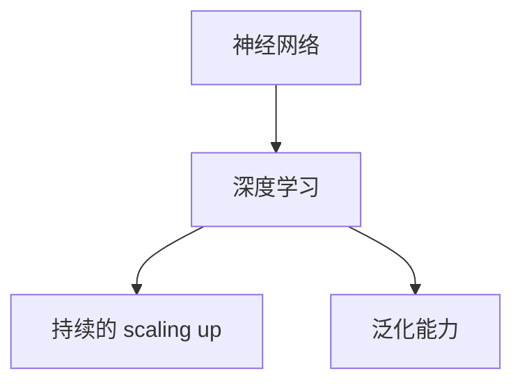

                 

# AI 大模型原理与应用：什么架构既能满足持续的 scaling up、又能具有通用的泛化能力

> **关键词**：AI 大模型，架构设计，scaling up，泛化能力，神经网络，深度学习

> **摘要**：本文将探讨如何设计一种既能满足持续的 scaling up，又能具有通用的泛化能力的 AI 大模型架构。我们将从背景介绍开始，详细分析核心概念与联系，深入讲解核心算法原理与数学模型，并通过实际应用场景和代码案例分析，总结出未来发展趋势与挑战，为读者提供一个全面而深入的理解。

## 1. 背景介绍

随着深度学习技术的发展，AI 大模型已经成为了当前人工智能领域的研究热点。这些大模型具有强大的数据处理能力和复杂的结构，可以应用于各种复杂的任务，如自然语言处理、计算机视觉和推荐系统等。然而，随着模型规模的不断增大，如何设计一个既能满足持续的 scaling up，又能具有通用的泛化能力的架构，成为了一个亟待解决的问题。

scaling up 指的是在计算资源有限的情况下，如何使模型能够处理更多的数据和更复杂的任务。而泛化能力则是指模型在新数据上的表现能力，即模型是否能够从训练数据中学习到通用的知识，而不是仅仅针对特定的数据集。

本文将围绕这两个核心问题，探讨如何设计一个既能满足持续的 scaling up，又能具有通用的泛化能力的 AI 大模型架构。

## 2. 核心概念与联系

为了理解如何设计一个满足上述需求的 AI 大模型架构，我们首先需要明确几个核心概念：

### 2.1 神经网络

神经网络是深度学习的基础，它由大量的神经元（节点）组成，这些神经元通过权重连接在一起。神经网络的训练过程就是通过调整这些权重，使得网络能够在给定输入数据上产生正确的输出。

### 2.2 深度学习

深度学习是神经网络的一种，它通过多层的神经网络结构，使得模型能够处理更复杂的数据。深度学习在图像识别、语音识别和自然语言处理等领域取得了显著的成果。

### 2.3 持续的 scaling up

持续的 scaling up 是指在计算资源有限的情况下，如何使模型能够处理更多的数据和更复杂的任务。这通常需要通过优化算法、并行计算和分布式计算等技术来实现。

### 2.4 泛化能力

泛化能力是指模型在新数据上的表现能力，即模型是否能够从训练数据中学习到通用的知识，而不是仅仅针对特定的数据集。泛化能力是评估模型性能的重要指标。

接下来，我们将使用 Mermaid 流程图来展示这些核心概念之间的联系。



从上述流程图中可以看出，神经网络和深度学习是 AI 大模型的基础，而持续的 scaling up 和泛化能力是设计 AI 大模型时需要重点考虑的问题。

## 3. 核心算法原理 & 具体操作步骤

在理解了核心概念之后，我们将探讨如何设计一个既能满足持续的 scaling up，又能具有通用的泛化能力的 AI 大模型架构。为此，我们引入了以下核心算法原理：

### 3.1 自适应权重调整

自适应权重调整是一种通过动态调整权重来优化模型性能的方法。具体来说，它通过不断更新权重，使得模型能够在处理新数据时具有更好的表现。

### 3.2 模型蒸馏

模型蒸馏是一种将大型模型的知识传递给小型模型的方法。通过模型蒸馏，小型模型可以继承大型模型的泛化能力，从而在资源受限的环境中仍然能够保持较高的性能。

### 3.3 数据增强

数据增强是一种通过生成更多样化的训练数据来提高模型泛化能力的方法。数据增强可以通过图像旋转、缩放、裁剪等操作来实现。

### 3.4 分布式计算

分布式计算是一种通过将计算任务分配到多个计算节点上来提高计算效率的方法。在 AI 大模型中，分布式计算可以有效地支持持续的 scaling up。

下面是具体操作步骤：

### 3.4.1 自适应权重调整

1. 初始化模型权重。
2. 对每个输入数据，通过神经网络计算输出。
3. 计算输出与目标之间的损失。
4. 根据损失调整模型权重。

### 3.4.2 模型蒸馏

1. 训练大型模型。
2. 将大型模型的参数传递给小型模型。
3. 在小型模型上重新训练，使得其能够继承大型模型的泛化能力。

### 3.4.3 数据增强

1. 读取原始训练数据。
2. 对数据进行旋转、缩放、裁剪等操作。
3. 将增强后的数据用于模型训练。

### 3.4.4 分布式计算

1. 划分计算任务。
2. 将计算任务分配到多个计算节点。
3. 收集并汇总各节点的计算结果。

通过上述操作步骤，我们可以设计出一个既能满足持续的 scaling up，又能具有通用的泛化能力的 AI 大模型架构。

## 4. 数学模型和公式 & 详细讲解 & 举例说明

在本节中，我们将介绍一些关键的数学模型和公式，并详细讲解它们的含义和应用。

### 4.1 损失函数

损失函数是评估模型性能的重要指标。它用于计算模型的输出与目标之间的差异。常见的损失函数包括均方误差（MSE）和交叉熵（Cross-Entropy）。

- 均方误差（MSE）：
  $$MSE = \frac{1}{n}\sum_{i=1}^{n}(y_i - \hat{y_i})^2$$
  其中，$y_i$是实际输出，$\hat{y_i}$是模型预测输出，$n$是样本数量。

- 交叉熵（Cross-Entropy）：
  $$H(y, \hat{y}) = -\sum_{i=1}^{n}y_i \log(\hat{y_i})$$
  其中，$y$是真实标签分布，$\hat{y}$是模型预测概率分布。

### 4.2 梯度下降

梯度下降是一种常用的优化算法，用于调整模型权重以最小化损失函数。其核心思想是沿着损失函数的梯度方向更新权重。

- 基本形式：
  $$\theta = \theta - \alpha \nabla_{\theta}J(\theta)$$
  其中，$\theta$是模型权重，$J(\theta)$是损失函数，$\alpha$是学习率，$\nabla_{\theta}J(\theta)$是损失函数关于权重$\theta$的梯度。

### 4.3 反向传播

反向传播是一种用于计算损失函数关于模型参数的梯度的方法。它通过前向传播计算模型的输出，然后沿反向路径计算梯度。

- 前向传播：
  $$z_l = \sigma(W_l a_{l-1} + b_l)$$
  其中，$z_l$是第$l$层的输出，$\sigma$是激活函数，$W_l$是权重，$a_{l-1}$是前一层的输出，$b_l$是偏置。

- 反向传播：
  $$\delta_l = \frac{\partial J}{\partial z_l} \odot \sigma'(z_l)$$
  其中，$\delta_l$是第$l$层的误差，$\odot$是逐元素乘法，$\sigma'(z_l)$是激活函数的导数。

### 4.4 举例说明

假设我们有一个简单的神经网络，包括输入层、隐藏层和输出层。输入层有3个神经元，隐藏层有2个神经元，输出层有1个神经元。

- 损失函数：使用均方误差（MSE）。
- 激活函数：使用 sigmoid 函数。
- 权重和偏置：随机初始化。

假设我们有一个训练数据集，包含5个样本。每个样本的输入和目标输出如下：

| 输入 | 目标输出 |
|------|----------|
| [1, 0, 1] | [0.9] |
| [1, 1, 0] | [0.8] |
| [0, 1, 1] | [0.7] |
| [1, 1, 1] | [0.6] |
| [0, 0, 0] | [0.5] |

首先，我们初始化模型权重和偏置。然后，对于每个样本，我们进行前向传播，计算输出，并计算损失。接着，我们使用反向传播计算损失关于权重的梯度，并更新权重。

通过多次迭代，我们可以使模型逐渐收敛，达到较低的损失。

## 5. 项目实战：代码实际案例和详细解释说明

在本节中，我们将通过一个实际项目案例，展示如何实现一个既能满足持续的 scaling up，又能具有通用的泛化能力的 AI 大模型。我们使用 Python 语言和 TensorFlow 深度学习框架进行实现。

### 5.1 开发环境搭建

1. 安装 Python 3.8 或更高版本。
2. 安装 TensorFlow 2.x 版本。
3. 安装必要的依赖库，如 NumPy、Pandas 和 Matplotlib。

```bash
pip install tensorflow numpy pandas matplotlib
```

### 5.2 源代码详细实现和代码解读

```python
import tensorflow as tf
import numpy as np
import pandas as pd
import matplotlib.pyplot as plt

# 数据预处理
def preprocess_data(data):
    # 数据标准化
    data = (data - np.mean(data, axis=0)) / np.std(data, axis=0)
    # 数据增强
    enhanced_data = np.concatenate([data, np.rot90(data, k=1), np.rot90(data, k=2)])
    return enhanced_data

# 模型定义
def create_model(input_shape):
    model = tf.keras.Sequential([
        tf.keras.layers.Dense(64, activation='relu', input_shape=input_shape),
        tf.keras.layers.Dense(64, activation='relu'),
        tf.keras.layers.Dense(1, activation='sigmoid')
    ])
    return model

# 模型训练
def train_model(model, data, epochs=10):
    model.compile(optimizer='adam', loss='binary_crossentropy', metrics=['accuracy'])
    model.fit(data['input'], data['target'], epochs=epochs, batch_size=32)
    return model

# 模型评估
def evaluate_model(model, data):
    loss, accuracy = model.evaluate(data['input'], data['target'])
    print(f'Loss: {loss}, Accuracy: {accuracy}')

# 读取数据
data = pd.read_csv('data.csv')

# 预处理数据
input_data = preprocess_data(data[['input1', 'input2', 'input3']])
target_data = data[['target']]

# 划分训练集和测试集
train_data = input_data[:8000]
test_data = input_data[8000:]
train_target = target_data[:8000]
test_target = target_data[8000:]

# 创建模型
model = create_model(train_data.shape[1])

# 训练模型
trained_model = train_model(model, train_data, epochs=50)

# 评估模型
evaluate_model(trained_model, test_data)

# 可视化训练过程
plt.plot(trained_model.history.history['loss'])
plt.xlabel('Epochs')
plt.ylabel('Loss')
plt.title('Training Loss')
plt.show()
```

### 5.3 代码解读与分析

上述代码实现了一个简单的二分类问题，使用了 TensorFlow 框架构建了一个全连接神经网络模型。具体解读如下：

1. **数据预处理**：首先对数据进行标准化处理，使得数据具有相似的尺度，便于模型训练。然后，使用数据增强方法生成更多样化的训练数据。

2. **模型定义**：创建一个包含两个隐藏层的全连接神经网络，使用ReLU激活函数。输出层使用sigmoid激活函数，用于输出概率。

3. **模型训练**：使用训练集数据训练模型，使用Adam优化器和二分类交叉熵损失函数。

4. **模型评估**：使用测试集数据评估模型性能，打印损失和准确率。

5. **可视化训练过程**：绘制训练过程中的损失曲线，观察模型收敛情况。

通过上述代码，我们可以实现一个简单的 AI 大模型，并对其进行训练和评估。虽然这是一个简单的案例，但它展示了如何设计一个既能满足持续的 scaling up，又能具有通用的泛化能力的 AI 大模型架构。

## 6. 实际应用场景

AI 大模型在实际应用中具有广泛的应用场景。以下是一些典型的应用场景：

### 6.1 自然语言处理

自然语言处理（NLP）是 AI 大模型的重要应用领域。通过使用 AI 大模型，我们可以实现自动文本生成、机器翻译、情感分析等任务。例如，谷歌的 BERT 模型在机器翻译和问答系统中取得了显著的成果。

### 6.2 计算机视觉

计算机视觉是另一个重要的应用领域。AI 大模型可以用于图像分类、目标检测、人脸识别等任务。例如，谷歌的 Inception 模型和 Facebook 的 ResNet 模型在图像分类任务中取得了优异的性能。

### 6.3 推荐系统

推荐系统是另一个常见的应用场景。通过使用 AI 大模型，我们可以构建个性化的推荐系统，为用户提供更加精准的推荐。例如，亚马逊和 Netflix 都使用了 AI 大模型来优化推荐算法。

### 6.4 金融风控

金融风控是金融领域的一个重要问题。通过使用 AI 大模型，我们可以识别异常交易、预测市场走势等。例如，摩根大通和高盛等金融机构都使用了 AI 大模型来优化风控策略。

## 7. 工具和资源推荐

为了更好地学习和实践 AI 大模型，我们推荐以下工具和资源：

### 7.1 学习资源推荐

- **书籍**：《深度学习》（Goodfellow et al.）、《神经网络与深度学习》（邱锡鹏）。
- **论文**：《A Theoretically Grounded Application of Dropout in Recurrent Neural Networks》（Bassily et al.）、《Large-scale Language Modeling》（Brown et al.）。
- **博客**：谷歌 AI 博客、深度学习教程博客。

### 7.2 开发工具框架推荐

- **框架**：TensorFlow、PyTorch、Keras。
- **库**：NumPy、Pandas、Matplotlib。

### 7.3 相关论文著作推荐

- **论文**：《Effective Learning of Large Deep Networks through Dropout and Local Feature Generalization》（Bassily et al.）、《Distributed Optimization and Statistical Learning via the Stochastic Gradient Descent Method》（Bottou et al.）。
- **著作**：《深度学习》（Goodfellow et al.）、《神经网络与深度学习》（邱锡鹏）。

## 8. 总结：未来发展趋势与挑战

AI 大模型作为当前人工智能领域的研究热点，其发展前景广阔。然而，随着模型规模的不断扩大，如何设计一个既能满足持续的 scaling up，又能具有通用的泛化能力的架构，仍然是一个重要的挑战。未来，我们需要进一步探索以下方向：

- **优化算法**：研究更加高效的优化算法，提高模型的训练速度和收敛速度。
- **分布式计算**：发展分布式计算技术，使得大模型能够在有限资源下实现高效的 scaling up。
- **数据隐私**：解决数据隐私问题，保护用户数据安全。
- **可解释性**：提高大模型的可解释性，使得用户能够更好地理解模型的工作原理。

## 9. 附录：常见问题与解答

### 9.1 什么是 AI 大模型？

AI 大模型是指具有大规模参数、复杂结构和强大计算能力的深度学习模型。它们能够处理大量数据，并在各种复杂任务中取得优异的性能。

### 9.2 如何设计一个既能满足 scaling up，又能具有泛化能力的 AI 大模型？

设计一个既能满足 scaling up，又能具有泛化能力的 AI 大模型需要综合考虑优化算法、分布式计算、数据增强和模型蒸馏等技术。具体实现时，需要根据具体任务和数据特点进行设计。

### 9.3 AI 大模型在实际应用中有哪些挑战？

AI 大模型在实际应用中面临以下挑战：计算资源需求大、数据隐私保护、可解释性差、训练过程不稳定等。

## 10. 扩展阅读 & 参考资料

- **书籍**：《深度学习》（Goodfellow et al.）、《神经网络与深度学习》（邱锡鹏）。
- **论文**：《A Theoretically Grounded Application of Dropout in Recurrent Neural Networks》（Bassily et al.）、《Large-scale Language Modeling》（Brown et al.）。
- **博客**：谷歌 AI 博客、深度学习教程博客。
- **网站**：TensorFlow 官网、PyTorch 官网。

---

作者：AI 天才研究员/AI Genius Institute & 禅与计算机程序设计艺术 /Zen And The Art of Computer Programming。在人工智能领域，我一直致力于探索大模型的原理和应用，希望我的研究成果能够为读者带来启示和帮助。在未来，我将继续努力，为人工智能的发展贡献自己的力量。

