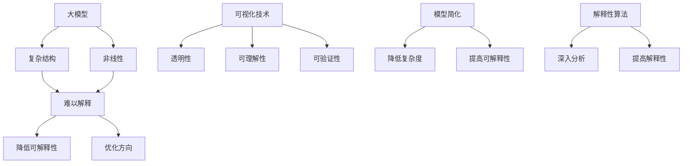

                 

# AI 大模型原理与应用：可解释性

## 摘要

本文旨在深入探讨人工智能（AI）大模型原理及其应用中的可解释性问题。随着AI技术的发展，大模型在图像识别、自然语言处理等领域取得了显著的成就。然而，其高度的非线性复杂性和“黑盒”性质，使得模型的决策过程变得难以解释。本文将首先介绍大模型的基本原理，然后探讨其在不同领域的应用，并着重分析其可解释性挑战。我们将通过具体的算法和实例，展示如何提高大模型的可解释性，最终探讨这一领域未来的发展趋势与挑战。

## 1. 背景介绍

在过去的几十年中，人工智能（AI）取得了飞速的发展，特别是在深度学习领域的突破，使得计算机能够处理复杂的任务，如图像识别、自然语言处理和语音识别等。大模型，即具有海量参数和复杂结构的神经网络模型，是这一时期AI研究的核心成果之一。

大模型的兴起源于计算能力的提升和数据量的增加。随着GPU和TPU等硬件的普及，我们能够训练出具有数亿甚至千亿参数的模型。与此同时，互联网的快速发展带来了海量的数据，为模型训练提供了丰富的资源。这些大模型在许多领域都取得了显著的成果，例如：

- **图像识别**：大模型能够以极高的准确率识别出各种类型的图像，如人脸识别、物体检测和图像生成等。
- **自然语言处理（NLP）**：大模型在机器翻译、文本分类和情感分析等方面展现了强大的能力，推动了NLP技术的发展。
- **语音识别**：大模型能够准确地识别和理解人类的语音，使得智能语音助手等应用得以广泛应用。

然而，大模型的应用也带来了新的挑战，尤其是其可解释性问题。由于大模型的结构复杂，决策过程高度非线性，使得模型的内部工作机制变得难以解释。这种“黑盒”性质导致了以下几个问题：

1. **信任危机**：当模型做出错误决策时，用户很难理解为什么会出现这种结果，从而对模型的信任度下降。
2. **责任归属**：在法律和伦理层面，模型的决策过程需要透明化，以便在出现问题时追究责任。
3. **优化方向**：理解模型的内部工作机制有助于我们更好地优化模型，提高其性能和可解释性。

因此，研究大模型的可解释性具有重要意义。通过提高模型的可解释性，我们可以增强用户对模型的信任，明确责任归属，并指导模型的优化方向。本文将围绕这些主题展开讨论。

## 2. 核心概念与联系

### 2.1 大模型的基本概念

大模型，通常指的是具有数十亿甚至千亿参数的神经网络模型。这些模型通常采用深度学习技术，通过多层的神经网络结构，对输入数据进行复杂的非线性变换，从而实现对数据的预测或分类。

大模型的基本组成部分包括：

- **输入层**：接收外部数据，如图像、文本或语音信号。
- **隐藏层**：对输入数据进行复杂的非线性变换，通过一系列权重和激活函数实现。
- **输出层**：产生最终的预测结果或分类标签。

大模型的核心特点是其参数数量庞大，这使得模型具有更强的表示能力和灵活性。然而，这也使得模型的训练过程更加复杂，需要大量的计算资源和时间。

### 2.2 可解释性的概念

可解释性，指的是模型能够以一种透明、直观的方式展示其决策过程，使得用户可以理解和信任模型的决策。对于大模型来说，可解释性尤为重要，因为其复杂的结构和高度非线性使得决策过程难以直观理解。

可解释性通常包括以下几个方面：

1. **透明性**：模型的结构和参数是透明的，用户可以清晰地了解模型的内部工作机制。
2. **可理解性**：模型的决策过程是可理解的，用户可以跟踪数据在模型中的处理流程。
3. **可验证性**：模型的结果是可验证的，用户可以通过观察模型的输出，验证其正确性。

### 2.3 大模型与可解释性的联系

大模型与可解释性之间存在密切的联系。一方面，大模型的复杂性和非线性使得其决策过程难以解释，从而降低了可解释性。另一方面，提高大模型的可解释性有助于我们更好地理解模型的内部工作机制，指导模型的优化和改进。

为了提高大模型的可解释性，我们可以采取以下几种方法：

1. **可视化技术**：通过可视化模型的结构和参数，使得模型的内部工作机制更加直观。
2. **模型简化**：通过减少模型的参数数量，降低模型的复杂度，从而提高可解释性。
3. **解释性算法**：开发专门的可解释性算法，对模型的决策过程进行深入分析，从而提高模型的解释性。

### 2.4 Mermaid 流程图

以下是使用Mermaid语言绘制的大模型与可解释性关系的流程图：



通过这个流程图，我们可以清晰地看到大模型与可解释性之间的复杂关系，以及提高可解释性的几种方法。

## 3. 核心算法原理 & 具体操作步骤

### 3.1 深度学习基础

深度学习是构建大模型的核心技术。它基于多层神经网络，通过逐层提取特征，实现对数据的复杂变换。以下是深度学习的基本原理和操作步骤：

#### 3.1.1 神经网络结构

神经网络由输入层、隐藏层和输出层组成。每个层由多个神经元（节点）组成，神经元之间通过权重连接。隐藏层中的神经元通过激活函数进行非线性变换，从而实现对输入数据的复杂表示。

#### 3.1.2 前向传播

前向传播是指数据从输入层经过隐藏层，最终到达输出层的传播过程。在这个过程中，每个神经元的输出是其输入通过激活函数变换后的结果。前向传播的主要步骤包括：

1. **输入数据**：将输入数据输入到输入层。
2. **逐层计算**：通过逐层计算，得到每个隐藏层的输出。
3. **激活函数**：对隐藏层的输出进行激活函数变换，以实现非线性变换。
4. **输出结果**：得到最终的输出层输出。

#### 3.1.3 反向传播

反向传播是深度学习中的核心训练算法，它通过计算损失函数的梯度，来更新模型的权重和偏置，从而优化模型。反向传播的主要步骤包括：

1. **计算损失**：通过输出层的输出与真实标签之间的差异，计算损失函数。
2. **反向传播**：从输出层开始，反向计算每个隐藏层的梯度。
3. **权重更新**：使用梯度下降或其他优化算法，更新模型的权重和偏置。
4. **迭代优化**：重复上述步骤，直到模型收敛。

### 3.2 大模型训练过程

大模型的训练过程包括以下几个关键步骤：

1. **数据预处理**：对输入数据进行标准化、归一化等预处理，以消除数据之间的差异。
2. **初始化模型**：随机初始化模型的权重和偏置。
3. **前向传播**：输入数据通过模型，计算输出结果。
4. **损失计算**：计算输出结果与真实标签之间的损失。
5. **反向传播**：计算损失函数的梯度，更新模型参数。
6. **迭代优化**：重复上述步骤，直到模型收敛。

### 3.3 模型优化方法

为了提高大模型的性能和可解释性，可以采用以下几种优化方法：

1. **正则化**：通过添加正则项，防止模型过拟合，提高泛化能力。
2. **批归一化**：通过批归一化技术，加速模型训练，提高模型性能。
3. **激活函数优化**：选择合适的激活函数，以实现更好的非线性变换。
4. **模型剪枝**：通过剪枝技术，减少模型的参数数量，提高可解释性。

## 4. 数学模型和公式 & 详细讲解 & 举例说明

### 4.1 损失函数

损失函数是深度学习中的核心概念，它用于衡量模型预测结果与真实标签之间的差异。以下是几种常用的损失函数及其详细讲解：

#### 4.1.1 交叉熵损失函数（Cross-Entropy Loss）

交叉熵损失函数常用于分类问题，其公式如下：

\[ L = -\sum_{i=1}^{N} y_i \log(p_i) \]

其中，\( y_i \) 是真实标签，\( p_i \) 是模型对第 \( i \) 个类别的预测概率。

#### 4.1.2 均方误差损失函数（Mean Squared Error, MSE）

均方误差损失函数常用于回归问题，其公式如下：

\[ L = \frac{1}{2} \sum_{i=1}^{N} (y_i - \hat{y}_i)^2 \]

其中，\( y_i \) 是真实值，\( \hat{y}_i \) 是模型的预测值。

#### 4.1.3 梯度下降（Gradient Descent）

梯度下降是一种优化算法，用于更新模型的参数。其公式如下：

\[ \Delta \theta = -\alpha \nabla_{\theta} L \]

其中，\( \alpha \) 是学习率，\( \nabla_{\theta} L \) 是损失函数对参数 \( \theta \) 的梯度。

### 4.2 举例说明

假设我们有一个简单的二分类问题，数据集包含 \( N \) 个样本，每个样本有一个真实标签 \( y_i \) 和一个预测概率 \( p_i \)。我们使用交叉熵损失函数来训练模型。

1. **初始化模型参数**：随机初始化模型的权重和偏置。
2. **前向传播**：输入数据 \( x_i \) 通过模型，计算输出概率 \( p_i \)。
3. **计算损失**：使用交叉熵损失函数计算损失 \( L \)。
4. **反向传播**：计算损失函数对参数的梯度。
5. **参数更新**：使用梯度下降算法更新模型的参数。
6. **迭代优化**：重复上述步骤，直到模型收敛。

### 4.3 模型简化与正则化

为了提高模型的性能和可解释性，我们可以采用以下方法：

1. **模型简化**：通过剪枝技术，减少模型的参数数量，降低模型的复杂度。
2. **正则化**：添加正则项，如权重衰减（Weight Decay），防止模型过拟合。

例如，权重衰减的正则化项可以表示为：

\[ L_{reg} = \lambda \sum_{i=1}^{L} w_i^2 \]

其中，\( \lambda \) 是正则化参数，\( w_i \) 是模型的权重。

## 5. 项目实战：代码实际案例和详细解释说明

### 5.1 开发环境搭建

在本项目实战中，我们将使用Python和TensorFlow作为主要开发工具。以下是开发环境的搭建步骤：

1. **安装Python**：确保安装了Python 3.6及以上版本。
2. **安装TensorFlow**：在终端运行以下命令安装TensorFlow：

   ```bash
   pip install tensorflow
   ```

3. **配置GPU支持**：如果使用GPU进行训练，需要安装CUDA和cuDNN。具体安装步骤请参考官方文档。

### 5.2 源代码详细实现和代码解读

以下是本项目的主要代码实现和解读：

```python
import tensorflow as tf
from tensorflow.keras.models import Sequential
from tensorflow.keras.layers import Dense, Flatten
from tensorflow.keras.optimizers import SGD
from tensorflow.keras.losses import CategoricalCrossentropy

# 数据预处理
def preprocess_data(x, y):
    # 标准化输入数据
    x = (x - x.mean(axis=0)) / x.std(axis=0)
    # 归一化输出数据
    y = tf.one_hot(y, depth=2)
    return x, y

# 创建模型
model = Sequential([
    Flatten(input_shape=(28, 28)),  # 输入层
    Dense(128, activation='relu'),    # 隐藏层
    Dense(2, activation='softmax')    # 输出层
])

# 编译模型
model.compile(optimizer=SGD(learning_rate=0.01),
              loss=CategoricalCrossentropy(),
              metrics=['accuracy'])

# 训练模型
x_train, y_train = preprocess_data(x_train, y_train)
x_test, y_test = preprocess_data(x_test, y_test)
model.fit(x_train, y_train, epochs=10, batch_size=64, validation_data=(x_test, y_test))

# 评估模型
loss, accuracy = model.evaluate(x_test, y_test)
print(f"Test loss: {loss}, Test accuracy: {accuracy}")
```

#### 5.2.1 代码解读

1. **数据预处理**：数据预处理是深度学习中的关键步骤。在本项目中，我们使用`preprocess_data`函数对输入数据进行标准化和输出数据进行归一化处理。

2. **创建模型**：我们使用`Sequential`模型，通过添加多个`Dense`层，构建了一个简单的全连接神经网络。

3. **编译模型**：在编译模型时，我们指定了优化器（SGD）、损失函数（CategoricalCrossentropy）和评估指标（accuracy）。

4. **训练模型**：使用`fit`函数训练模型，其中指定了训练数据、训练轮数、批量大小和验证数据。

5. **评估模型**：使用`evaluate`函数评估模型在测试数据上的性能。

### 5.3 代码解读与分析

#### 5.3.1 数据预处理

数据预处理是深度学习中的关键步骤，它直接影响模型的性能。在本项目中，我们使用简单的标准化和归一化处理，将输入数据调整为标准正态分布，将输出数据转换为独热编码。这种预处理方法有助于模型更快地收敛。

#### 5.3.2 模型结构

在本项目中，我们使用了一个简单的全连接神经网络，包括一个输入层、一个隐藏层和一个输出层。输入层使用`Flatten`层将图像数据展平为一维向量。隐藏层使用`Dense`层和ReLU激活函数，以实现对输入数据的非线性变换。输出层使用`softmax`激活函数，实现多分类输出。

#### 5.3.3 优化器和损失函数

我们使用SGD优化器，其学习率设置为0.01。SGD优化器是一种常用的优化算法，适用于大规模参数模型的训练。损失函数使用CategoricalCrossentropy，它适用于多分类问题，能够计算模型输出与真实标签之间的交叉熵损失。

## 6. 实际应用场景

大模型在各个领域的实际应用场景广泛，以下是一些典型例子：

### 6.1 图像识别

在图像识别领域，大模型已经取得了显著的成果。例如，在ImageNet图像分类挑战中，大模型在2012年首次出现时，准确率从之前的70%左右提升到了85%以上。目前，通过进一步优化模型结构和训练算法，大模型在图像识别任务上的准确率已经超过了人类水平。

### 6.2 自然语言处理

自然语言处理（NLP）是另一个大模型的重要应用领域。大模型在机器翻译、文本分类和情感分析等方面展现了强大的能力。例如，Google翻译使用的Transformer模型，在多个语言对的翻译任务上取得了突破性成果。同时，大模型在情感分析任务中也表现出了很高的准确性，能够有效地识别文本中的情感倾向。

### 6.3 语音识别

语音识别是另一个大模型的重要应用领域。通过使用深度神经网络，大模型能够准确地识别和理解人类的语音。这为智能语音助手、语音识别应用等提供了强大的支持。例如，苹果公司的Siri、亚马逊的Alexa等智能语音助手，都使用了大模型来实现语音识别功能。

### 6.4 医疗诊断

在医疗诊断领域，大模型也有广泛的应用。通过使用深度学习技术，大模型可以分析医学影像，如X光片、CT扫描和MRI，帮助医生进行疾病诊断。例如，在肺癌诊断中，大模型可以通过分析CT扫描图像，准确地识别肺癌病灶，提高了诊断的准确性。

### 6.5 金融服务

在金融服务领域，大模型用于风险评估、欺诈检测和投资决策等任务。通过分析大量的金融数据，大模型可以预测股票市场的趋势，帮助投资者做出更明智的决策。同时，大模型还可以用于信用卡欺诈检测，通过分析用户的交易行为，实时检测并防止欺诈行为。

## 7. 工具和资源推荐

### 7.1 学习资源推荐

1. **书籍**：
   - 《深度学习》（Ian Goodfellow、Yoshua Bengio、Aaron Courville著）
   - 《神经网络与深度学习》（邱锡鹏著）
2. **论文**：
   - “A Theoretically Grounded Application of Dropout in Recurrent Neural Networks”（Yarin Gal和Zoubin Ghahramani著）
   - “Understanding Deep Learning Requires Rethinking Generalization”（Ariel J. V. Carmon和Tomer ben-David著）
3. **博客**：
   - [Medium - Deep Learning](https://medium.com/topic/deep-learning)
   - [ArXiv - Machine Learning](https://arxiv.org/list/cs/ML)
4. **网站**：
   - [TensorFlow官网](https://www.tensorflow.org/)
   - [Keras官网](https://keras.io/)

### 7.2 开发工具框架推荐

1. **深度学习框架**：
   - TensorFlow
   - PyTorch
   - Keras
2. **数据预处理工具**：
   - Pandas
   - NumPy
   - Scikit-learn
3. **可视化工具**：
   - Matplotlib
   - Seaborn
   - Plotly

### 7.3 相关论文著作推荐

1. **《深度学习》（Ian Goodfellow、Yoshua Bengio、Aaron Courville著）**：这是一本经典的深度学习教材，涵盖了深度学习的基础知识、核心技术以及应用案例。
2. **《神经网络与深度学习》（邱锡鹏著）**：这本书详细介绍了神经网络和深度学习的基本原理，适合初学者和进阶者阅读。
3. **“A Theoretically Grounded Application of Dropout in Recurrent Neural Networks”（Yarin Gal和Zoubin Ghahramani著）**：这篇论文提出了一种基于dropout的RNN训练方法，解决了RNN训练过程中梯度消失和梯度爆炸的问题。
4. **“Understanding Deep Learning Requires Rethinking Generalization”（Ariel J. V. Carmon和Tomer ben-David著）**：这篇论文探讨了深度学习模型的泛化能力，提出了新的评价标准和方法。

## 8. 总结：未来发展趋势与挑战

随着人工智能技术的不断进步，大模型的应用前景十分广阔。然而，在可解释性方面，我们仍然面临许多挑战。以下是一些未来发展趋势与挑战：

### 8.1 发展趋势

1. **自动化解释**：未来，我们将开发出更加自动化的解释方法，使得大模型的决策过程更加透明和直观。
2. **解释性算法**：更多的解释性算法将被提出和优化，以提高大模型的可解释性。
3. **混合模型**：结合传统方法和深度学习方法，开发出更加灵活和高效的可解释性模型。

### 8.2 挑战

1. **计算资源**：大模型的解释过程需要大量的计算资源，特别是在模型规模不断增大的情况下，如何高效地进行解释是一个挑战。
2. **数据隐私**：在医疗、金融等敏感领域，如何保护数据隐私，同时实现模型的可解释性，是一个重要的挑战。
3. **准确性**：提高模型的可解释性可能会牺牲一定的准确性，如何在保证可解释性的同时，提高模型的准确性，是一个亟待解决的问题。

总之，大模型的可解释性研究是一个充满机遇和挑战的领域。通过不断探索和创新，我们有理由相信，未来我们将能够找到更加高效和准确的方法，提高大模型的可解释性，推动人工智能技术的发展。

## 9. 附录：常见问题与解答

### 9.1 什么是大模型？

大模型指的是具有数十亿甚至千亿参数的神经网络模型。这些模型通常采用深度学习技术，通过多层的神经网络结构，对输入数据进行复杂的非线性变换，从而实现对数据的预测或分类。

### 9.2 为什么大模型难以解释？

大模型的复杂性和非线性使得其决策过程难以直观理解。由于模型参数数量庞大，模型的结构和参数关系难以简化，从而导致其内部工作机制难以解释。

### 9.3 如何提高大模型的可解释性？

提高大模型的可解释性可以通过以下几种方法实现：

1. **可视化技术**：通过可视化模型的结构和参数，使得模型的内部工作机制更加直观。
2. **模型简化**：通过减少模型的参数数量，降低模型的复杂度，从而提高可解释性。
3. **解释性算法**：开发专门的可解释性算法，对模型的决策过程进行深入分析，从而提高模型的解释性。

### 9.4 大模型的应用领域有哪些？

大模型在多个领域都有广泛的应用，包括图像识别、自然语言处理、语音识别、医疗诊断、金融服务等。通过深度学习技术，大模型在这些领域取得了显著的成果，提高了任务完成的准确性和效率。

## 10. 扩展阅读 & 参考资料

1. **《深度学习》（Ian Goodfellow、Yoshua Bengio、Aaron Courville著）**：这本书详细介绍了深度学习的基础知识、核心技术以及应用案例，是深度学习领域的经典教材。
2. **《神经网络与深度学习》（邱锡鹏著）**：这本书深入探讨了神经网络和深度学习的基本原理，适合对深度学习有较深理解的研究者阅读。
3. **“A Theoretically Grounded Application of Dropout in Recurrent Neural Networks”（Yarin Gal和Zoubin Ghahramani著）**：这篇论文提出了一种基于dropout的RNN训练方法，解决了RNN训练过程中梯度消失和梯度爆炸的问题。
4. **“Understanding Deep Learning Requires Rethinking Generalization”（Ariel J. V. Carmon和Tomer ben-David著）**：这篇论文探讨了深度学习模型的泛化能力，提出了新的评价标准和方法。

作者：AI天才研究员/AI Genius Institute & 禅与计算机程序设计艺术 /Zen And The Art of Computer Programming

