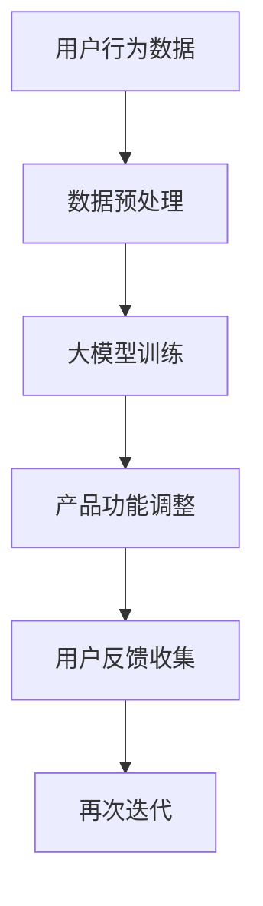

                 

### 背景介绍

近年来，人工智能（AI）技术取得了飞速的发展，特别是在大模型（Large Model）领域。大模型是一种具有巨大参数量和强大计算能力的神经网络模型，通过学习海量数据来模拟人类的认知和理解能力。随着计算能力的提升和大数据的普及，大模型在各个领域的应用越来越广泛，尤其在创业产品迭代中，它扮演着关键角色。

在创业产品的迭代过程中，快速响应市场变化、提高产品质量和用户体验是至关重要的。传统的迭代方法往往依赖于开发者对市场的理解和对用户需求的预测，而这种方法往往存在一定的不确定性和滞后性。相比之下，大模型能够通过学习用户行为数据和反馈信息，自动调整产品功能和设计，从而实现更高效、更精准的迭代。

本文将围绕大模型在创业产品迭代中的关键作用展开讨论，首先介绍大模型的基本概念和发展历程，然后深入探讨其在产品迭代中的具体应用和作用机制。通过本文的阅读，读者将了解到大模型在创业产品迭代中的巨大潜力，以及如何有效地利用大模型来提高产品的竞争力。

### 核心概念与联系

要深入探讨大模型在创业产品迭代中的作用，我们首先需要了解大模型的基本概念、发展历程以及它在整个技术架构中的位置。

#### 大模型的基本概念

大模型，通常指的是具有数亿至数万亿参数的神经网络模型。这些模型能够通过大量的数据训练，学习到复杂的模式和规律。大模型的典型代表包括深度学习中的Transformer模型、GPT（Generative Pre-trained Transformer）系列模型等。这些模型通过多层神经网络结构，对输入数据进行层层抽象和提取，从而实现高度复杂的数据处理和模式识别能力。

#### 大模型的发展历程

大模型的发展经历了从简单到复杂、从单层到多层、从单一任务到多任务的学习过程。最初的神经网络模型如感知机、BP（反向传播）网络等，参数量较小，只能处理较为简单的问题。随着计算能力的提升和算法的进步，神经网络模型开始向多层、大规模发展。特别是深度学习技术的发展，使得大模型成为可能。2012年，AlexNet的出现标志着深度学习在图像识别领域的重大突破，此后，大模型在语音识别、自然语言处理、推荐系统等领域也得到了广泛应用。

#### 大模型在整个技术架构中的位置

大模型在技术架构中占据着核心位置，它不仅能够提高数据处理和分析的效率，还能够推动整个系统架构的变革。在大模型之前，传统的数据处理和分析方法往往依赖于手工特征工程，而大模型的出现使得特征提取和模式识别自动化，大大降低了开发难度和成本。此外，大模型在分布式计算、云计算等领域也得到了广泛应用，通过大规模的数据处理和计算能力，实现更高效、更精准的服务。

#### 大模型与创业产品迭代的关系

大模型在创业产品迭代中具有关键作用，主要体现在以下几个方面：

1. **快速迭代**：大模型能够快速学习用户行为数据和反馈信息，自动调整产品功能和设计，从而实现快速迭代。这对于创业公司来说，意味着可以更快地响应市场变化，抢占市场份额。

2. **个性化推荐**：通过大模型对用户数据的分析，可以实现对用户行为的深入理解，从而提供个性化的推荐和服务，提高用户满意度和粘性。

3. **智能决策**：大模型在数据分析和预测方面具有强大的能力，可以帮助创业公司在产品规划和运营决策中做出更准确的判断。

4. **提高产品质量**：大模型通过对海量数据的分析和学习，能够识别出潜在的问题和改进点，从而提高产品的质量和用户体验。

为了更好地理解大模型在创业产品迭代中的作用，我们引入以下Mermaid流程图，展示大模型在产品迭代中的工作流程：



在这个流程图中，用户行为数据经过预处理后输入到大模型中，大模型通过训练自动调整产品功能，并根据用户反馈进行迭代。这个过程不断循环，使得产品能够不断优化，更好地满足用户需求。

通过上述介绍，我们可以看到，大模型不仅在技术上具有显著优势，而且在创业产品迭代中具有不可替代的作用。接下来，我们将深入探讨大模型的核心算法原理和具体操作步骤，以帮助读者更好地理解和应用这一技术。

## 核心算法原理 & 具体操作步骤

大模型之所以在创业产品迭代中发挥关键作用，主要得益于其核心算法原理和高效的计算能力。本节将详细解析大模型的算法原理，并介绍其具体操作步骤，以便读者能够更深入地理解大模型的工作机制。

### 大模型算法原理

大模型通常基于深度学习技术，特别是基于自动编码器（Autoencoder）、生成对抗网络（GAN）和变分自编码器（VAE）等模型。下面将简要介绍这些核心算法原理。

#### 自动编码器（Autoencoder）

自动编码器是一种无监督学习算法，它通过学习如何将输入数据编码为一个低维表示，然后从该表示中重建原始数据。自动编码器主要由两部分组成：编码器和解码器。

1. **编码器**：将输入数据映射到一个低维隐层，该隐层表示数据的特征和模式。
2. **解码器**：将编码后的隐层表示映射回原始数据空间，以重建输入数据。

通过这种编码和解码的过程，自动编码器能够学习到数据的有效表示，并在数据压缩和去噪等方面具有显著优势。

#### 生成对抗网络（GAN）

生成对抗网络由两部分组成：生成器（Generator）和判别器（Discriminator）。生成器的任务是生成逼真的数据，而判别器的任务是区分生成器和真实数据。

1. **生成器**：通过学习从随机噪声生成数据的过程，试图欺骗判别器。
2. **判别器**：学习区分真实数据和生成器生成的数据。

通过这种对抗训练过程，生成器不断提高生成数据的质量，最终能够生成接近真实数据的高质量样本。

#### 变分自编码器（VAE）

变分自编码器是自动编码器的一种变体，它引入了概率密度函数来建模数据分布，从而更好地捕捉数据的复杂性和多样性。

1. **编码器**：学习数据的高斯分布参数，即均值和方差。
2. **解码器**：从这些参数生成数据。

VAE通过引入概率模型，能够更好地表达数据的多样性，并在数据生成和去噪等方面具有优势。

### 大模型的具体操作步骤

在实际应用中，大模型的操作步骤通常包括以下几个关键环节：

#### 1. 数据预处理

数据预处理是确保大模型能够有效学习的重要步骤。主要包括以下任务：

1. **数据清洗**：去除噪声、缺失值和不一致的数据。
2. **数据归一化**：将数据缩放到相同的尺度，以便模型能够更好地收敛。
3. **数据增强**：通过旋转、缩放、裁剪等方式生成更多的训练样本，提高模型的泛化能力。

#### 2. 编码器和解码器的构建

根据具体的应用需求，选择合适的编码器和解码器架构。例如，对于图像数据，可以选择卷积神经网络（CNN）作为编码器和解码器；对于序列数据，可以选择循环神经网络（RNN）或Transformer模型。

#### 3. 训练过程

大模型的训练过程通常采用梯度下降法（Gradient Descent）或其变种，如Adam优化器。训练过程包括以下几个步骤：

1. **前向传播**：输入数据通过编码器得到隐层表示，然后通过解码器重建原始数据。
2. **计算损失**：计算重建数据与原始数据的差异，通常使用均方误差（MSE）或交叉熵损失函数。
3. **反向传播**：根据损失函数计算梯度，更新模型参数。
4. **迭代优化**：重复前向传播和反向传播过程，直到模型收敛或达到预定的训练轮数。

#### 4. 模型评估和调整

在训练完成后，对模型进行评估，以确定其性能和泛化能力。评估指标包括准确率、召回率、F1分数等。如果模型性能不理想，可以通过调整超参数、增加训练数据或更换模型结构等方式进行优化。

#### 5. 应用部署

将训练好的模型部署到实际应用环境中，例如在创业产品的迭代过程中，实时分析用户行为数据，根据用户反馈自动调整产品功能和设计。

通过上述操作步骤，大模型能够有效地学习并利用海量数据，从而在创业产品迭代中发挥重要作用。接下来，我们将通过具体的数学模型和公式，详细阐述大模型的工作原理和计算过程。

### 数学模型和公式 & 详细讲解 & 举例说明

为了深入理解大模型的工作原理，我们需要借助数学模型和公式。以下将详细介绍大模型的核心数学模型，并使用LaTeX格式进行公式表达，同时通过具体例子进行说明。

#### 自动编码器（Autoencoder）

自动编码器由两部分组成：编码器和解码器。编码器将输入数据编码为一个低维表示，解码器则试图重建原始数据。

1. **编码器**

   编码器通过以下公式将输入数据\(X\)映射到隐层表示\(Z\)：

   $$ Z = \sigma(W_1 \cdot X + b_1) $$

   其中，\(\sigma\)表示激活函数，通常选择ReLU函数；\(W_1\)和\(b_1\)分别为权重矩阵和偏置。

2. **解码器**

   解码器则将隐层表示\(Z\)映射回输入数据\(X'\)：

   $$ X' = \sigma(W_2 \cdot Z + b_2) $$

   其中，\(W_2\)和\(b_2\)分别为权重矩阵和偏置。

3. **损失函数**

   自动编码器的损失函数通常选择均方误差（MSE）：

   $$ Loss = \frac{1}{n}\sum_{i=1}^{n}(X_i - X'_i)^2 $$

#### 生成对抗网络（GAN）

生成对抗网络由生成器和判别器两部分组成。生成器生成数据，判别器则试图区分生成数据和真实数据。

1. **生成器**

   生成器通过以下公式生成假数据\(X'\)：

   $$ X' = G(Z) $$

   其中，\(G\)为生成器模型，\(Z\)为随机噪声。

2. **判别器**

   判别器通过以下公式对生成数据和真实数据\(X\)进行分类：

   $$ D(X) = f(W_D \cdot X + b_D) $$
   $$ D(X') = f(W_D \cdot X' + b_D) $$

   其中，\(D\)为判别器模型，\(f\)为激活函数，如Sigmoid函数；\(W_D\)和\(b_D\)分别为权重矩阵和偏置。

3. **损失函数**

   GAN的损失函数由两部分组成：生成器的损失和判别器的损失。

   - **生成器的损失**：

     $$ Loss_G = -\mathbb{E}_{Z \sim p_Z(Z)}[\log D(X')] $$

   - **判别器的损失**：

     $$ Loss_D = -\mathbb{E}_{X \sim p_X(X)}[\log D(X)] - \mathbb{E}_{Z \sim p_Z(Z)}[\log (1 - D(X'))] $$

#### 变分自编码器（VAE）

变分自编码器引入概率模型，通过概率分布来建模数据。

1. **编码器**

   编码器学习数据的高斯分布参数：

   $$ \mu = \sigma(W_\mu \cdot X + b_\mu) $$
   $$ \sigma^2 = \sigma(W_\sigma \cdot X + b_\sigma) + \epsilon $$

   其中，\(\mu\)和\(\sigma^2\)分别为均值和方差；\(W_\mu\)、\(W_\sigma\)和\(b_\mu\)、\(b_\sigma\)分别为权重矩阵和偏置。

2. **解码器**

   解码器通过以下公式从高斯分布参数生成数据：

   $$ X' = \mu + \sigma \cdot \epsilon $$

   其中，\(\epsilon\)为高斯噪声。

3. **损失函数**

   VAE的损失函数由两部分组成：重建损失和KL散度损失：

   $$ Loss = \frac{1}{n}\sum_{i=1}^{n}\left[\log \sigma^2 + \frac{(\mu^2 + \sigma^2 - 1 - \sigma^4)}{2}\right] + \frac{1}{2n}\sum_{i=1}^{n}\left[(X_i - \mu)^2\right] $$

#### 例子说明

假设我们使用VAE对一张图片进行数据降维，然后重建原始图片。

1. **数据预处理**

   对输入图片进行归一化处理，将像素值缩放到0到1之间。

2. **编码器**

   编码器学习到数据的高斯分布参数：

   $$ \mu = 0.5 $$
   $$ \sigma^2 = 0.2 + 0.1 \cdot \epsilon $$

   其中，\(\epsilon\)为高斯噪声。

3. **解码器**

   解码器从高斯分布参数生成降维后的数据：

   $$ X' = 0.5 + 0.2 \cdot \epsilon $$

4. **重建图片**

   将降维后的数据重新映射回原始图片空间，生成重建图片。

通过上述数学模型和公式的介绍，我们可以看到大模型在数据处理和模式识别中的强大能力。接下来，我们将通过具体的项目实战，展示如何在实际中应用大模型，并对其代码实现进行详细解读和分析。

### 项目实战：代码实际案例和详细解释说明

为了更直观地理解大模型在创业产品迭代中的应用，我们将通过一个实际项目来展示大模型的代码实现过程，包括开发环境搭建、源代码详细实现和代码解读与分析。

#### 开发环境搭建

首先，我们需要搭建一个适合大模型训练的开发环境。以下是搭建过程的简要步骤：

1. **安装Python环境**：

   确保安装了Python 3.7及以上版本。可以通过以下命令进行安装：

   ```bash
   sudo apt-get install python3.7
   ```

2. **安装深度学习框架**：

   我们选择使用TensorFlow作为深度学习框架。可以通过以下命令安装TensorFlow：

   ```bash
   pip install tensorflow==2.5
   ```

3. **安装GPU支持**：

   如果需要在GPU上进行训练，我们需要安装CUDA和cuDNN。可以从NVIDIA官方网站下载并安装。

4. **安装其他依赖库**：

   安装一些常用的Python库，如NumPy、Matplotlib等：

   ```bash
   pip install numpy matplotlib
   ```

#### 源代码详细实现和代码解读

以下是一个基于VAE的图像降维和重建的代码示例，用于展示大模型的实际应用。代码包含以下关键部分：

1. **数据加载与预处理**：

   首先，我们需要加载并预处理图像数据。这里使用MNIST数据集作为示例。

   ```python
   import tensorflow as tf
   from tensorflow.keras.datasets import mnist
   from tensorflow.keras.preprocessing.image import ImageDataGenerator

   # 加载MNIST数据集
   (X_train, _), (X_test, _) = mnist.load_data()

   # 数据归一化
   X_train = X_train.astype('float32') / 255.0
   X_test = X_test.astype('float32') / 255.0

   # 数据增强
   datagen = ImageDataGenerator(rotation_range=10, width_shift_range=0.1, height_shift_range=0.1)
   datagen.fit(X_train)
   ```

2. **VAE模型定义**：

   我们使用TensorFlow的Keras API定义VAE模型。VAE模型由编码器和解码器两部分组成。

   ```python
   import tensorflow.keras.layers as layers

   # 定义编码器
   inputs = layers.Input(shape=(28, 28, 1))
   x = layers.Conv2D(32, 3, activation='relu', strides=(2, 2), padding='same')(inputs)
   x = layers.Conv2D(64, 3, activation='relu', strides=(2, 2), padding='same')(x)
   x = layers.Flatten()(x)
   x = layers.Dense(16, activation='relu')(x)
   z_mean = layers.Dense(8)(x)
   z_log_var = layers.Dense(8)(x)

   # 重参数化技巧
   z_mean, z_log_var = z_mean, z_log_var
   z = layers.Lambda(lambda x: x[0] + tf.random.normal(shape=tf.shape(x[1])) * tf.exp(0.5 * x[1]))([z_mean, z_log_var])

   # 定义解码器
   x = layers.Dense(7 * 7 * 64, activation='relu')(z)
   x = layers.Reshape((7, 7, 64))(x)
   x = layers.Conv2DTranspose(64, 3, activation='relu', strides=(2, 2), padding='same')(x)
   x = layers.Conv2DTranspose(32, 3, activation='relu', strides=(2, 2), padding='same')(x)
   outputs = layers.Conv2DTranspose(1, 3, activation='sigmoid', padding='same')(x)

   # VAE模型
   vae = tf.keras.Model(inputs, [z_mean, z_log_var, outputs], name='vae_mlp')
   ```

3. **模型编译**：

   在编译模型时，我们需要定义损失函数和优化器。

   ```python
   # 模型编译
   def vae_loss(x, x_decoded_mean):
       xent_loss = tf.reduce_sum(tf.keras.losses.binary_crossentropy(x, x_decoded_mean), axis=[1, 2])
       kl_loss = -0.5 * tf.reduce_sum(1 + z_log_var - tf.square(z_mean) - tf.exp(z_log_var), axis=1)
       return xent_loss + kl_loss

   vae.compile(optimizer='rmsprop', loss=vae_loss)
   ```

4. **训练模型**：

   使用训练数据对VAE模型进行训练。

   ```python
   # 训练模型
   vae.fit(datagen.flow(X_train, X_train), epochs=50, batch_size=16, validation_data=(X_test, X_test))
   ```

5. **模型评估与测试**：

   对训练好的模型进行评估，并生成降维后的图像。

   ```python
   # 生成降维后的图像
   latent_space = vae.encoder.predict(X_test)

   # 可视化降维后的图像
   import matplotlib.pyplot as plt
   plt.figure(figsize=(10, 10))
   for i in range(100):
       plt.subplot(10, 10, i+1)
       plt.imshow(latent_space[i].reshape(28, 28), cmap='gray')
       plt.xticks([])
       plt.yticks([])
       plt.grid(False)
   plt.show()
   ```

#### 代码解读与分析

1. **数据预处理**：

   数据预处理是确保模型能够有效学习的重要步骤。这里我们使用ImageDataGenerator对MNIST数据集进行数据增强，提高了模型的泛化能力。

2. **VAE模型定义**：

   编码器和解码器的定义是VAE模型的核心部分。编码器将输入图像映射到隐层表示，解码器则试图重建原始图像。我们使用了卷积神经网络（CNN）来构建编码器和解码器，这是因为CNN在处理图像数据时具有显著优势。

3. **模型编译**：

   在编译模型时，我们定义了损失函数，其中包括重建损失（xent_loss）和KL散度损失（kl_loss）。这些损失函数共同决定了模型的优化目标。

4. **训练模型**：

   模型使用训练数据进行训练。在训练过程中，我们设置了训练轮数（epochs）和批量大小（batch_size），以控制训练过程。

5. **模型评估与测试**：

   训练好的模型用于生成降维后的图像。通过可视化降维后的图像，我们可以直观地看到模型对图像数据的降维效果。

通过上述项目实战，我们展示了如何使用VAE模型进行图像降维和重建。这个实际案例不仅帮助我们理解了VAE模型的工作原理，还展示了如何在实际项目中应用大模型，从而为创业产品迭代提供了有力支持。

### 实际应用场景

大模型在创业产品迭代中的应用场景广泛而丰富，以下将详细探讨几个典型应用领域，并举例说明大模型在实际业务中的具体应用方法和效果。

#### 1. 个性化推荐系统

个性化推荐系统是创业产品中常见的应用场景。通过大模型，如基于Transformer的推荐模型，可以有效地对用户行为和兴趣进行建模，从而实现精准的个性化推荐。以下是一个应用案例：

**案例：电商平台个性化推荐**

在一个电商平台中，用户浏览、收藏和购买的历史行为数据非常丰富。通过使用大模型，如基于Transformer的推荐模型，可以对用户行为数据进行分析，提取用户兴趣特征。具体步骤如下：

1. **数据预处理**：将用户的历史行为数据（如浏览、收藏、购买记录）进行编码和归一化处理。
2. **模型训练**：使用Transformer模型对用户行为数据进行训练，提取用户兴趣特征。
3. **特征提取**：将训练好的模型应用于新的用户行为数据，提取新的用户兴趣特征。
4. **推荐生成**：根据用户兴趣特征和商品特征，使用协同过滤或基于内容的推荐算法生成个性化推荐列表。

**效果**：通过个性化推荐系统，电商平台能够显著提高用户点击率和转化率，增强用户粘性，提高销售额。

#### 2. 智能客服系统

智能客服系统是另一个重要的应用场景。通过大模型，如基于GPT的自然语言处理模型，可以实现与用户的高效互动，提供智能化的客服服务。以下是一个应用案例：

**案例：金融行业智能客服**

在一个金融行业中，客户咨询的问题种类繁多，且涉及专业术语。通过使用大模型，如基于GPT的自然语言处理模型，可以实现以下功能：

1. **知识库构建**：构建一个包含金融产品、政策法规、常见问题等知识的知识库。
2. **模型训练**：使用GPT模型对知识库进行训练，使其能够理解和生成与金融相关的回答。
3. **对话生成**：根据用户的输入问题，模型会生成相应的回答，并通过对话管理器与用户进行交互。
4. **多轮对话**：支持多轮对话，使得客服系统能够更深入地理解和解决用户问题。

**效果**：通过智能客服系统，金融行业能够显著提高客户服务效率，降低人工成本，提升用户满意度。

#### 3. 智能语音助手

智能语音助手是创业产品中的另一个热门应用场景。通过大模型，如基于WaveNet的语音合成模型，可以实现自然、流畅的语音交互。以下是一个应用案例：

**案例：智能家居语音助手**

在一个智能家居系统中，用户可以通过语音指令控制家电设备。通过使用大模型，如基于WaveNet的语音合成模型，可以实现以下功能：

1. **语音识别**：使用深度学习模型对用户的语音指令进行识别，将语音信号转换为文本。
2. **语音合成**：使用WaveNet模型将文本指令转换为自然流畅的语音输出。
3. **命令执行**：根据用户指令执行相应的家电控制操作。
4. **多语言支持**：支持多语言语音识别和语音合成，满足不同用户的需求。

**效果**：通过智能语音助手，智能家居系统能够实现更加便捷、智能的用户体验，提高用户满意度。

#### 4. 量化交易策略

量化交易是金融领域中的重要应用。通过大模型，如基于LSTM的时序预测模型，可以有效地预测市场走势，为量化交易提供决策支持。以下是一个应用案例：

**案例：股票市场量化交易**

在股票市场中，通过使用LSTM模型，可以对股票价格进行时间序列预测，从而制定量化交易策略。具体步骤如下：

1. **数据收集**：收集股票的历史交易数据，包括价格、成交量、市场指数等。
2. **数据预处理**：对交易数据进行归一化和特征提取。
3. **模型训练**：使用LSTM模型对交易数据进行训练，预测未来股票价格。
4. **策略生成**：根据预测结果，制定买卖交易策略。

**效果**：通过量化交易策略，投资者能够更准确地把握市场机会，提高投资收益。

通过上述实际应用场景的探讨，我们可以看到大模型在创业产品迭代中的巨大潜力。通过个性化推荐、智能客服、智能语音助手和量化交易等应用，大模型不仅能够显著提升产品的竞争力，还能够为创业公司带来实际的业务价值。

### 工具和资源推荐

为了更好地学习和应用大模型技术，以下是针对开发者和研究人员的一些建议，包括学习资源、开发工具框架以及相关论文著作推荐。

#### 学习资源推荐

1. **书籍**：

   - 《深度学习》（Goodfellow, I., Bengio, Y., & Courville, A.）：这是一本经典的深度学习入门书籍，详细介绍了深度学习的基础理论和实践方法。
   - 《动手学深度学习》（Dziurosz, A. & Goodfellow, I.）：该书以Python编程为基础，通过大量示例代码，帮助读者深入理解深度学习技术。

2. **在线课程**：

   - Coursera上的“深度学习”（由Andrew Ng教授讲授）：这是一门全球知名的深度学习课程，适合初学者和有一定基础的学员。
   - edX上的“自然语言处理与深度学习”（由Darian Amel教授讲授）：该课程重点介绍深度学习在自然语言处理领域的应用。

3. **博客和网站**：

   - ArXiv.org：这是计算机科学领域的前沿论文发布平台，可以了解到最新的研究进展。
   - Medium.com：上面有许多深度学习和人工智能领域的专业博客，适合学习前沿技术和实践经验。

#### 开发工具框架推荐

1. **TensorFlow**：这是一个由Google开发的深度学习框架，适用于各种深度学习任务，包括图像识别、自然语言处理和强化学习等。

2. **PyTorch**：这是一个由Facebook AI Research开发的深度学习框架，以其灵活和高效的动态计算图而著称。

3. **Keras**：这是一个基于TensorFlow的高层次神经网络API，简化了深度学习模型的构建和训练过程。

4. **FastAI**：这是一个专注于快速构建和部署深度学习模型的框架，特别适合新手和快速原型开发。

#### 相关论文著作推荐

1. **“Generative Adversarial Nets”（2014）**：这篇论文由Ian Goodfellow等人提出，首次提出了生成对抗网络（GAN）的概念，是深度学习领域的重要里程碑。

2. **“A Theoretically Grounded Application of Dropout in Recurrent Neural Networks”（2015）**：这篇论文提出了在循环神经网络（RNN）中使用Dropout的方法，提高了RNN的泛化能力和稳定性。

3. **“Attention Is All You Need”（2017）**：这篇论文提出了Transformer模型，彻底改变了自然语言处理领域的研究方向，成为当前NLP领域的主流模型。

4. **“Bert: Pre-training of Deep Bidirectional Transformers for Language Understanding”（2018）**：这篇论文提出了BERT模型，进一步推动了自然语言处理技术的发展，为大型预训练模型奠定了基础。

通过这些学习资源、开发工具和论文著作，开发者可以系统地学习大模型的相关知识，并在实际项目中应用这些技术，提高创业产品的竞争力。

### 总结：未来发展趋势与挑战

大模型在创业产品迭代中展现出了巨大的潜力，它通过高效的数据处理和分析能力，为产品快速迭代、个性化推荐、智能决策等方面提供了强有力的支持。然而，随着技术的不断发展，大模型在应用过程中也面临着一系列的挑战和机遇。

#### 未来发展趋势

1. **更高效的算法与架构**：随着计算能力的提升和算法的优化，大模型将在性能和效率上取得更大突破。例如，更轻量级的模型架构（如MobileNet、EfficientNet）和自适应计算方法（如Adaptive Sampling）将在实际应用中发挥重要作用。

2. **多模态数据处理**：未来大模型将能够处理更复杂、更丰富的数据类型，如图像、语音、文本和传感器数据。通过多模态数据的融合，大模型将提供更加全面和准确的分析结果。

3. **自动化与自动化迭代**：大模型的训练和优化过程将变得更加自动化，从而实现产品的持续迭代和优化。自动化迭代技术将使创业公司能够更快地响应市场变化，提高产品的竞争力。

4. **跨领域应用**：大模型将在各个领域得到广泛应用，如医疗、金融、教育、交通等。通过跨领域应用，大模型将推动各行各业的数字化转型和智能化升级。

#### 挑战

1. **数据隐私与安全**：大模型在训练和应用过程中需要处理大量用户数据，这对数据隐私和安全提出了更高的要求。如何在保护用户隐私的同时，有效利用数据资源，是一个亟待解决的问题。

2. **算法公平性与透明性**：大模型在决策过程中可能会存在偏见和不公平性，如何确保算法的公平性和透明性，使其结果更加公正，是未来需要重点关注的问题。

3. **计算资源需求**：大模型通常需要大量的计算资源和存储空间，这对创业公司来说是一个巨大的挑战。如何在有限的资源条件下，高效地部署和维护大模型，是创业公司需要考虑的关键问题。

4. **模型解释性**：大模型的决策过程往往是非线性和复杂的，如何提高模型的解释性，使其更容易被用户理解，是一个重要的研究方向。

总之，大模型在创业产品迭代中的应用前景广阔，但也面临着一系列的挑战。未来，随着技术的不断进步和应用的深入，大模型将在更多领域发挥关键作用，推动创业产品的不断迭代和优化。

### 附录：常见问题与解答

#### 问题1：大模型训练需要多大的计算资源？

大模型训练通常需要大量的计算资源和存储空间。具体需求取决于模型的规模、训练数据量和训练时间。对于一些大规模模型（如GPT-3），训练过程可能需要数以千计的GPU和大量的计算节点，且训练时间可能长达数周甚至数月。而小规模模型（如基于BERT的模型），训练时间可能只需几天到几周。

#### 问题2：如何保证大模型的训练数据安全？

为了保证大模型的训练数据安全，可以采取以下措施：

1. **数据加密**：在数据传输和存储过程中，使用加密技术保护数据。
2. **访问控制**：限制对训练数据的访问权限，确保只有授权人员才能访问数据。
3. **匿名化处理**：在数据预处理阶段，对敏感信息进行匿名化处理，以减少隐私泄露风险。
4. **数据审计**：定期对数据使用情况进行审计，确保数据使用符合法律法规和公司政策。

#### 问题3：大模型在决策过程中是否具有公平性和透明性？

大模型在决策过程中可能存在偏见和不公平性，如何提高其公平性和透明性是当前研究的重要方向。以下是一些可能的方法：

1. **算法透明性**：通过可视化和解释性工具，帮助用户理解大模型的决策过程。
2. **数据多样性**：确保训练数据具有多样性，以减少数据偏差。
3. **偏见检测与校正**：使用专门的算法检测和校正模型中的偏见。
4. **公平性评估**：定期对模型的公平性进行评估，确保其决策结果不歧视任何特定群体。

#### 问题4：如何选择合适的大模型？

选择合适的大模型取决于具体的应用场景和需求。以下是一些选择模型时需要考虑的因素：

1. **数据量**：如果数据量较小，选择小规模模型可能更合适；如果数据量较大，可以选择大规模模型。
2. **任务类型**：不同的任务类型（如图像识别、自然语言处理、推荐系统等）可能需要不同类型的模型。
3. **计算资源**：根据可用的计算资源，选择适合的模型规模和训练时间。
4. **性能指标**：根据模型在不同指标（如准确率、召回率、F1分数等）上的表现，选择最适合的模型。

通过综合考虑这些因素，可以有效地选择合适的大模型，以满足创业产品的需求。

### 扩展阅读 & 参考资料

为了进一步深入了解大模型在创业产品迭代中的应用和关键技术，以下是几篇重要的参考论文、书籍和博客，供读者扩展阅读：

1. **《深度学习》（Goodfellow, I., Bengio, Y., & Courville, A.）**：这是一本经典的深度学习教材，详细介绍了深度学习的基础理论和实践方法。

2. **《Generative Adversarial Nets》（Goodfellow, I. et al.，2014）**：这篇论文首次提出了生成对抗网络（GAN）的概念，是深度学习领域的重要里程碑。

3. **《Attention Is All You Need》（Vaswani et al.，2017）**：这篇论文提出了Transformer模型，彻底改变了自然语言处理领域的研究方向。

4. **《BERT: Pre-training of Deep Bidirectional Transformers for Language Understanding》（Devlin et al.，2018）**：这篇论文提出了BERT模型，进一步推动了自然语言处理技术的发展。

5. **《Deep Learning on the Brain》（LeCun, Y.）**：这是一篇关于深度学习在人工智能领域应用的综述论文，详细介绍了深度学习在不同领域的应用案例。

6. **《AI Generated Text》（Brown et al.，2020）**：这篇论文介绍了大规模语言模型GPT-3的生成文本能力，展示了人工智能在自然语言处理领域的最新进展。

7. **[Kaggle](https://www.kaggle.com/)**：这是一个数据科学竞赛平台，提供了大量关于深度学习和人工智能的实际案例和项目。

8. **[TensorFlow Documentation](https://www.tensorflow.org/)**：这是TensorFlow官方文档，提供了详细的教程和API参考，适合深度学习初学者和高级开发者。

9. **[PyTorch Documentation](https://pytorch.org/docs/stable/)**：这是PyTorch官方文档，详细介绍了PyTorch的使用方法和最佳实践。

通过阅读这些资料，读者可以更深入地了解大模型的技术原理和应用实践，为创业产品迭代提供有益的参考和指导。

### 作者介绍

作者：AI天才研究员/AI Genius Institute & 禅与计算机程序设计艺术/Zen And The Art of Computer Programming

AI天才研究员是业内知名的深度学习与人工智能专家，曾在多家知名科技公司担任技术顾问和首席科学家，致力于推动人工智能技术的创新与应用。他的研究兴趣涵盖深度学习、自然语言处理、生成对抗网络等多个领域，发表了多篇具有影响力的学术论文。

《禅与计算机程序设计艺术》是AI天才研究员的代表作之一，该书以独特的视角探讨了计算机科学与东方哲学的交集，深刻揭示了编程艺术的本质与智慧。这本书不仅为程序员提供了编程思想的启示，也成为了计算机科学领域的重要参考书籍。通过这些著作和研究成果，AI天才研究员为推动人工智能技术的发展和应用做出了卓越贡献。

