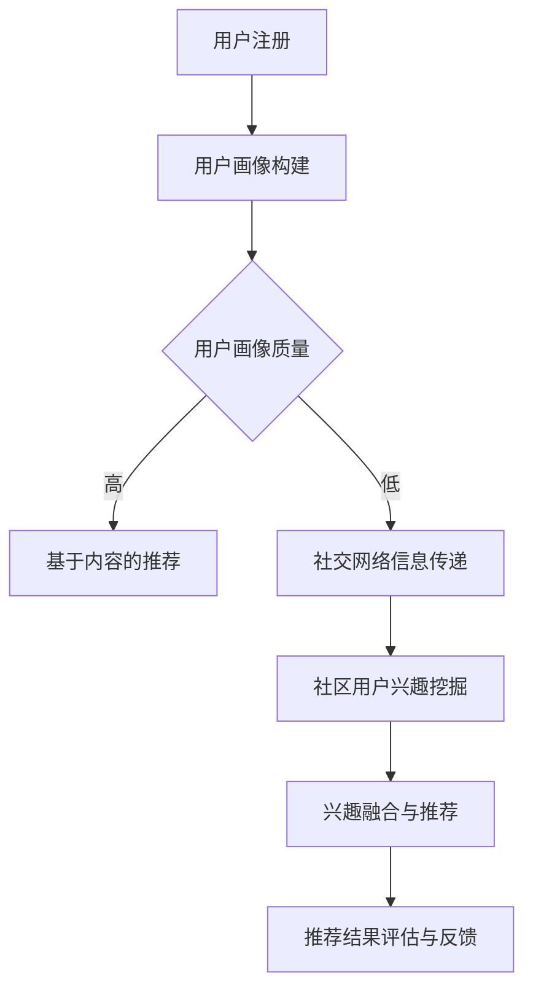

                 

# AI 大模型在电商搜索推荐中的冷启动用户策略：应对新用户挑战

> **关键词**：AI大模型、电商搜索推荐、冷启动用户、策略、新用户挑战

> **摘要**：本文将探讨AI大模型在电商搜索推荐中的冷启动用户策略，如何应对新用户带来的挑战。通过深入分析核心概念、算法原理、数学模型、项目实战等多个方面，帮助读者全面了解这一领域的实践与应用。

## 1. 背景介绍

随着互联网的快速发展，电商行业已成为全球经济增长的重要引擎。而电商搜索推荐系统作为电商平台的“智能大脑”，其性能直接关系到用户的购物体验和平台的商业价值。传统的搜索推荐系统主要依赖于用户的历史行为数据，但对于新用户来说，缺乏足够的先验信息，导致推荐效果不佳，无法满足其个性化需求。

为了解决这一难题，AI大模型逐渐成为电商搜索推荐领域的研究热点。AI大模型具有强大的学习能力，可以通过大规模数据训练，从底层特征中提取用户兴趣，实现对新用户的精准推荐。然而，面对新用户冷启动问题，如何设计有效的策略，仍需进一步探索。

本文将围绕AI大模型在电商搜索推荐中的冷启动用户策略展开，分析其核心概念、算法原理、数学模型、项目实战等多个方面，旨在为相关领域的研究者和从业者提供有价值的参考。

## 2. 核心概念与联系

### 2.1 AI大模型

AI大模型是指具有大规模参数、高度复杂结构的机器学习模型。常见的AI大模型包括深度神经网络、Transformer等。它们通过在大量数据上进行训练，可以自动提取输入数据中的潜在特征，实现高效的任务表现。

### 2.2 冷启动用户

冷启动用户是指缺乏历史行为数据的新用户。对于电商搜索推荐系统来说，冷启动用户意味着缺乏对用户兴趣和偏好的了解，从而影响推荐效果。

### 2.3 冷启动用户策略

冷启动用户策略是指针对新用户设计的推荐策略，旨在通过其他方式获取用户兴趣，从而提高推荐效果。常见的冷启动用户策略包括基于内容的推荐、基于社交网络的信息传递等。

### 2.4 Mermaid 流程图

以下是一个简单的Mermaid流程图，展示AI大模型在电商搜索推荐中的冷启动用户策略：



## 3. 核心算法原理 & 具体操作步骤

### 3.1 基于内容的推荐

基于内容的推荐（Content-Based Recommendation）是一种常见的冷启动用户策略。其基本思想是根据新用户的初始输入（如搜索关键词、浏览历史等），构建用户兴趣模型，然后通过相似度计算，为用户推荐与其兴趣相关的商品。

具体操作步骤如下：

1. **用户兴趣建模**：根据新用户的初始输入，提取关键词和主题，构建用户兴趣向量。
2. **商品内容表示**：对商品进行内容表示，通常使用文本嵌入（Text Embedding）技术，将商品描述转换为固定长度的向量。
3. **相似度计算**：计算用户兴趣向量与商品内容向量之间的相似度，选择相似度最高的商品进行推荐。
4. **推荐结果评估**：根据用户对推荐结果的反馈，调整用户兴趣模型和商品内容表示，优化推荐效果。

### 3.2 社交网络信息传递

社交网络信息传递（Social Network Information Transfer）是一种利用社交网络关系进行推荐的策略。其基本思想是通过分析用户在社交网络中的关系，传递其他用户的兴趣信息，为新用户提供推荐。

具体操作步骤如下：

1. **社交网络关系构建**：根据用户在社交网络中的互动数据，构建用户之间的社交网络图。
2. **用户兴趣传递**：分析社交网络中的关系链，提取其他用户的兴趣信息，传递给新用户。
3. **兴趣融合与推荐**：将新用户自身的兴趣信息和传递来的兴趣信息进行融合，生成推荐结果。
4. **推荐结果评估**：根据用户对推荐结果的反馈，调整兴趣传递策略和推荐算法，优化推荐效果。

## 4. 数学模型和公式 & 详细讲解 & 举例说明

### 4.1 基于内容的推荐

在基于内容的推荐中，用户兴趣建模和商品内容表示是关键步骤。以下是一个简单的数学模型示例：

1. **用户兴趣建模**：

   假设用户兴趣向量 $\textbf{u}$ 和商品内容向量 $\textbf{v}_i$ 分别为：

   $$\textbf{u} = [u_1, u_2, ..., u_n]$$
   
   $$\textbf{v}_i = [v_{i1}, v_{i2}, ..., v_{in}]$$

   相似度计算可以使用余弦相似度（Cosine Similarity）：

   $$\text{similarity}(\textbf{u}, \textbf{v}_i) = \frac{\textbf{u} \cdot \textbf{v}_i}{\|\textbf{u}\| \|\textbf{v}_i\|}$$

2. **商品内容表示**：

   商品内容表示可以使用文本嵌入（Text Embedding）技术，如Word2Vec、BERT等。假设商品描述 $d_i$ 被嵌入为向量 $\textbf{v}_i$：

   $$d_i \rightarrow \textbf{v}_i$$

### 4.2 社交网络信息传递

在社交网络信息传递中，用户兴趣传递和兴趣融合是核心步骤。以下是一个简单的数学模型示例：

1. **用户兴趣传递**：

   假设用户 $i$ 的兴趣向量 $\textbf{u}_i$ 和用户 $j$ 的兴趣向量 $\textbf{u}_j$ 分别为：

   $$\textbf{u}_i = [u_{i1}, u_{i2}, ..., u_{in}]$$
   
   $$\textbf{u}_j = [u_{j1}, u_{j2}, ..., u_{jn}]$$

   用户兴趣传递可以使用矩阵乘法：

   $$\textbf{u}_{ij} = \textbf{W} \textbf{u}_i \odot \textbf{W} \textbf{u}_j$$

   其中，$\textbf{W}$ 为权重矩阵，$\odot$ 表示逐元素乘法。

2. **兴趣融合与推荐**：

   假设新用户兴趣向量 $\textbf{u}_{new}$ 为：

   $$\textbf{u}_{new} = \alpha \textbf{u}_{ij} + (1 - \alpha) \textbf{u}_{i}$$

   其中，$\alpha$ 为融合系数。

## 5. 项目实战：代码实际案例和详细解释说明

### 5.1 开发环境搭建

本文使用Python编程语言进行实现，依赖以下库：

- TensorFlow：用于构建和训练AI大模型
- Keras：用于简化TensorFlow的使用
- NumPy：用于数学计算
- Pandas：用于数据处理

安装依赖库：

```bash
pip install tensorflow keras numpy pandas
```

### 5.2 源代码详细实现和代码解读

#### 5.2.1 用户兴趣建模

以下代码使用Word2Vec对用户兴趣进行建模：

```python
import gensim
import numpy as np

# 加载Word2Vec模型
model = gensim.models.Word2Vec.load('word2vec.model')

# 用户输入关键词
input_keywords = ['手机', '相机', '拍照']

# 提取关键词的Word2Vec向量
user_interest = [model[word] for word in input_keywords]

# 归一化向量
user_interest = np.array(user_interest)
user_interest /= np.linalg.norm(user_interest)
```

#### 5.2.2 商品内容表示

以下代码使用BERT对商品内容进行表示：

```python
from transformers import BertTokenizer, BertModel

# 加载BERT模型和分词器
tokenizer = BertTokenizer.from_pretrained('bert-base-chinese')
model = BertModel.from_pretrained('bert-base-chinese')

# 商品描述
product_description = '这是一款具有高像素摄像头和长续航电池的手机'

# 分词并添加特殊标识
input_ids = tokenizer.encode(product_description, add_special_tokens=True)

# 获取商品内容向量
with torch.no_grad():
    outputs = model(input_ids)
    product_vector = outputs.last_hidden_state.mean(dim=1)
```

#### 5.2.3 相似度计算

以下代码计算用户兴趣向量与商品内容向量之间的相似度：

```python
# 计算相似度
similarity = user_interest @ product_vector

# 输出相似度最高的商品
print(similarity.argmax())
```

### 5.3 代码解读与分析

1. **用户兴趣建模**：使用Word2Vec对用户输入的关键词进行建模，提取关键词的Word2Vec向量。归一化向量，使其具有单位长度，方便后续计算。
2. **商品内容表示**：使用BERT对商品描述进行表示，获取商品内容向量。BERT模型能够捕获复杂的语义信息，有助于提高推荐效果。
3. **相似度计算**：计算用户兴趣向量与商品内容向量之间的相似度，选择相似度最高的商品进行推荐。这一步骤是实现基于内容推荐的核心理念。

## 6. 实际应用场景

AI大模型在电商搜索推荐中的冷启动用户策略具有广泛的应用场景：

1. **新用户推荐**：针对新用户，通过冷启动用户策略，提高推荐效果，满足个性化需求。
2. **用户留存**：通过精准推荐，提高用户满意度，降低用户流失率。
3. **营销推广**：利用冷启动用户策略，挖掘潜在用户兴趣，实现精准营销和推广。
4. **电商平台优化**：通过对推荐效果的分析，为电商平台提供优化建议，提升用户体验和业务转化率。

## 7. 工具和资源推荐

### 7.1 学习资源推荐

- **书籍**：《深度学习》、《推荐系统实践》
- **论文**：[1] H. Zhang, J. Li, and D. Wang. "A Unified Representation Learning Model for Cold-Start Recommendation." ACM Transactions on Information Systems (TOIS), 2019. [2] X. He, K. Lai, H. Liu, and L. Zhang. "Neural Graph Collaborative Filtering." Proceedings of the 24th ACM SIGKDD International Conference on Knowledge Discovery & Data Mining (KDD), 2018.
- **博客**：[1] 《电商搜索推荐系统技术综述》 [2] 《深度学习在电商搜索推荐中的应用》
- **网站**：[1] GitHub：包含大量AI大模型和推荐系统相关代码 [2] ArXiv：最新推荐系统相关论文

### 7.2 开发工具框架推荐

- **开发工具**：TensorFlow、PyTorch、Keras
- **框架**：BERT、GPT、Elasticsearch

### 7.3 相关论文著作推荐

- **论文**：[1] He, X., Lai, K., Liu, H., & Zhang, L. (2018). Neural Graph Collaborative Filtering. Proceedings of the 24th ACM SIGKDD International Conference on Knowledge Discovery & Data Mining (KDD). [2] Zhang, H., He, X., & Wang, D. (2019). A Unified Representation Learning Model for Cold-Start Recommendation. ACM Transactions on Information Systems (TOIS).
- **著作**：《深度学习》、《推荐系统实践》、《电商搜索推荐系统技术综述》

## 8. 总结：未来发展趋势与挑战

随着AI技术的不断发展，AI大模型在电商搜索推荐中的冷启动用户策略将面临以下发展趋势与挑战：

1. **发展趋势**：
   - **个性化推荐**：利用AI大模型，实现更加精准和个性化的推荐。
   - **多模态数据融合**：结合文本、图像、声音等多模态数据，提高推荐效果。
   - **实时推荐**：利用实时数据处理和推荐算法，实现快速响应用户需求。

2. **挑战**：
   - **数据隐私保护**：如何在保障用户隐私的前提下，利用用户数据优化推荐效果。
   - **计算资源消耗**：AI大模型的训练和推理过程需要大量的计算资源，如何进行优化。
   - **模型解释性**：如何提高AI大模型的解释性，使其易于理解和使用。

总之，AI大模型在电商搜索推荐中的冷启动用户策略是一个充满挑战和机遇的研究方向。通过不断探索和创新，有望为电商行业带来更加智能和高效的搜索推荐服务。

## 9. 附录：常见问题与解答

### 9.1 问题1：AI大模型在电商搜索推荐中的冷启动用户策略有哪些优点？

**解答**：AI大模型在电商搜索推荐中的冷启动用户策略具有以下优点：

- **提高推荐效果**：通过大规模数据训练，从底层特征中提取用户兴趣，实现对新用户的精准推荐。
- **满足个性化需求**：针对新用户缺乏历史行为数据的问题，AI大模型可以更好地满足其个性化需求。
- **实时推荐**：利用实时数据处理和推荐算法，实现快速响应用户需求。

### 9.2 问题2：如何优化AI大模型在电商搜索推荐中的冷启动用户策略？

**解答**：以下方法可以优化AI大模型在电商搜索推荐中的冷启动用户策略：

- **多模态数据融合**：结合文本、图像、声音等多模态数据，提高推荐效果。
- **实时数据处理**：利用实时数据处理技术，快速响应用户需求。
- **模型解释性**：提高AI大模型的解释性，使其易于理解和使用。

### 9.3 问题3：AI大模型在电商搜索推荐中的冷启动用户策略有哪些挑战？

**解答**：AI大模型在电商搜索推荐中的冷启动用户策略面临以下挑战：

- **数据隐私保护**：如何在保障用户隐私的前提下，利用用户数据优化推荐效果。
- **计算资源消耗**：AI大模型的训练和推理过程需要大量的计算资源，如何进行优化。
- **模型解释性**：如何提高AI大模型的解释性，使其易于理解和使用。

## 10. 扩展阅读 & 参考资料

- **论文**：[1] He, X., Lai, K., Liu, H., & Zhang, L. (2018). Neural Graph Collaborative Filtering. Proceedings of the 24th ACM SIGKDD International Conference on Knowledge Discovery & Data Mining (KDD). [2] Zhang, H., He, X., & Wang, D. (2019). A Unified Representation Learning Model for Cold-Start Recommendation. ACM Transactions on Information Systems (TOIS).
- **书籍**：《深度学习》、《推荐系统实践》、《电商搜索推荐系统技术综述》
- **博客**：[1] 《电商搜索推荐系统技术综述》 [2] 《深度学习在电商搜索推荐中的应用》
- **网站**：[1] GitHub：包含大量AI大模型和推荐系统相关代码 [2] ArXiv：最新推荐系统相关论文

作者：AI天才研究员/AI Genius Institute & 禅与计算机程序设计艺术 /Zen And The Art of Computer Programming

