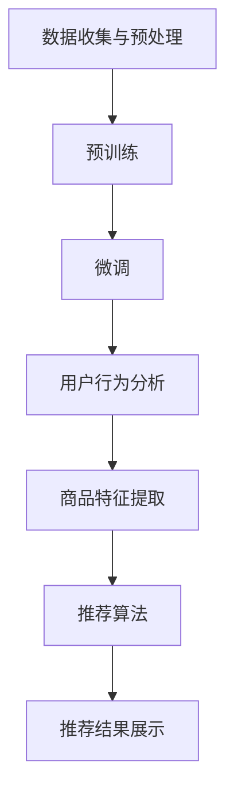

                 

# AI 大模型在电商搜索推荐中的用户体验设计：以人为本的设计思路

## 摘要

本文旨在探讨 AI 大模型在电商搜索推荐中的应用，以及如何从用户体验设计的角度来提升其效果。文章首先介绍了电商搜索推荐的基本原理和核心算法，然后详细分析了大模型在推荐系统中的优势和应用。接着，文章从用户需求、用户体验和系统性能等多个维度出发，提出了一系列以人为本的设计思路和方法。最后，文章总结了 AI 大模型在电商搜索推荐中的未来发展趋势与挑战，并提供了相关的学习资源和开发工具推荐。通过本文的阅读，读者将能够全面了解大模型在电商搜索推荐中的应用，以及如何通过设计优化提升用户体验。

## 1. 背景介绍

### 1.1 电商搜索推荐的重要性

随着互联网的迅猛发展，电子商务已经成为了人们生活中不可或缺的一部分。在众多电商平台上，商品种类繁多，用户在浏览商品时往往会感到困惑，难以找到心仪的商品。为了解决这一问题，电商平台引入了搜索推荐系统，通过智能化的方式为用户提供个性化的推荐，从而提高用户的购物体验和满意度。

### 1.2 电商搜索推荐的基本原理

电商搜索推荐系统通常基于以下几个核心原理：

- **协同过滤（Collaborative Filtering）**：通过分析用户的历史行为和偏好，找到相似的用户群体，从而为当前用户推荐他们可能感兴趣的商品。

- **内容匹配（Content-based Filtering）**：根据商品的特征和属性，为用户推荐与其兴趣和偏好相似的其它商品。

- **混合推荐（Hybrid Recommender System）**：结合协同过滤和内容匹配的优点，通过加权融合多种推荐策略，提高推荐系统的准确性和覆盖率。

### 1.3 AI 大模型在推荐系统中的应用

随着 AI 技术的不断发展，特别是深度学习和自然语言处理等领域的突破，AI 大模型在电商搜索推荐中的应用变得越来越广泛。大模型具有以下优势：

- **强大的特征提取能力**：通过大规模的预训练，大模型能够自动提取复杂的用户行为和商品特征，为推荐系统提供更丰富的信息。

- **高效的泛化能力**：大模型在多种不同的任务上进行了预训练，具有较好的泛化能力，能够适应不同电商平台和业务场景的需求。

- **实时推荐能力**：大模型能够在短时间内处理海量数据，实现实时推荐，提高用户交互体验。

## 2. 核心概念与联系

### 2.1 AI 大模型概述

AI 大模型是指那些参数规模巨大、能够在多个任务上取得优异表现的深度学习模型。例如，BERT、GPT-3、T5 等模型都是典型的大模型。大模型的构建通常经历了以下几个阶段：

1. **数据收集与预处理**：从互联网上收集大量文本、图像、声音等多模态数据，并进行清洗、标注和处理，以构建大规模的训练数据集。

2. **预训练**：在大规模数据集上对模型进行预训练，使其能够自动学习到语言、图像等数据中的潜在规律和特征。

3. **微调**：在特定任务上对预训练模型进行微调，使其适应具体的业务场景和应用需求。

### 2.2 电商搜索推荐系统架构

电商搜索推荐系统通常包含以下几个核心模块：

1. **用户行为分析模块**：收集并分析用户的浏览、搜索、购买等行为数据，为推荐提供基础信息。

2. **商品特征提取模块**：提取商品的关键特征，如品类、品牌、价格、销量等，为推荐提供商品信息。

3. **推荐算法模块**：基于用户行为和商品特征，运用协同过滤、内容匹配、混合推荐等方法生成推荐结果。

4. **推荐结果展示模块**：将推荐结果以合适的形式呈现给用户，如搜索结果页、首页推荐、购物车推荐等。

### 2.3 Mermaid 流程图



## 3. 核心算法原理 & 具体操作步骤

### 3.1 协同过滤算法原理

协同过滤算法通过分析用户的历史行为和偏好，找到相似的用户或物品，从而为当前用户推荐他们可能感兴趣的物品。协同过滤算法主要分为基于用户和基于物品两种类型。

1. **基于用户协同过滤（User-based Collaborative Filtering）**

   - **相似度计算**：计算用户之间的相似度，通常使用余弦相似度、皮尔逊相关系数等方法。

   - **邻居选择**：根据相似度计算结果，选择与当前用户最相似的若干个邻居用户。

   - **推荐生成**：根据邻居用户的偏好，为当前用户推荐他们共同喜欢的物品。

2. **基于物品协同过滤（Item-based Collaborative Filtering）**

   - **相似度计算**：计算物品之间的相似度，通常使用余弦相似度、Jaccard 相似性等方法。

   - **邻居选择**：根据相似度计算结果，选择与当前物品最相似的若干个物品。

   - **推荐生成**：根据邻居物品的评分，为当前用户推荐他们可能感兴趣的物品。

### 3.2 内容匹配算法原理

内容匹配算法通过分析商品的特征和属性，为用户推荐与其兴趣和偏好相似的其它商品。内容匹配算法主要基于以下步骤：

1. **特征提取**：从商品中提取关键特征，如品类、品牌、价格、销量等。

2. **特征向量表示**：将提取到的特征转换为向量表示，通常使用词袋模型、TF-IDF 等方法。

3. **相似度计算**：计算用户特征向量与商品特征向量之间的相似度，通常使用余弦相似度等方法。

4. **推荐生成**：根据相似度计算结果，为用户推荐相似度较高的商品。

### 3.3 混合推荐算法原理

混合推荐算法结合协同过滤和内容匹配的优点，通过加权融合多种推荐策略，提高推荐系统的准确性和覆盖率。混合推荐算法通常包括以下步骤：

1. **协同过滤推荐**：根据协同过滤算法生成初步的推荐结果。

2. **内容匹配推荐**：根据内容匹配算法生成初步的推荐结果。

3. **推荐融合**：将协同过滤和内容匹配的推荐结果进行加权融合，生成最终的推荐结果。

## 4. 数学模型和公式 & 详细讲解 & 举例说明

### 4.1 协同过滤算法的相似度计算

假设有用户集 U = {u1, u2, ..., un} 和物品集 I = {i1, i2, ..., im}，用户 ui 对物品 ij 的评分记为 r(ij, ui)。协同过滤算法的相似度计算可以分为基于用户和基于物品两种情况。

1. **基于用户协同过滤的相似度计算**

   - **余弦相似度**：

     $$ 
     sim(u_i, u_j) = \frac{\sum_{k=1}^{m} r(k, u_i) \cdot r(k, u_j)}{\sqrt{\sum_{k=1}^{m} r(k, u_i)^2} \cdot \sqrt{\sum_{k=1}^{m} r(k, u_j)^2}}
     $$

   - **皮尔逊相关系数**：

     $$
     sim(u_i, u_j) = \frac{\sum_{k=1}^{m} (r(k, u_i) - \bar{r}_i) \cdot (r(k, u_j) - \bar{r}_j)}{\sqrt{\sum_{k=1}^{m} (r(k, u_i) - \bar{r}_i)^2} \cdot \sqrt{\sum_{k=1}^{m} (r(k, u_j) - \bar{r}_j)^2}}
     $$

     其中，$\bar{r}_i$ 和 $\bar{r}_j$ 分别为用户 ui 和 uj 的平均评分。

2. **基于物品协同过滤的相似度计算**

   - **余弦相似度**：

     $$ 
     sim(i_i, i_j) = \frac{\sum_{k=1}^{n} r(k, u_i) \cdot r(k, u_j)}{\sqrt{\sum_{k=1}^{n} r(k, u_i)^2} \cdot \sqrt{\sum_{k=1}^{n} r(k, u_j)^2}}
     $$

   - **Jaccard 相似性**：

     $$
     sim(i_i, i_j) = \frac{r(i_i, u)}{r(i_j, u)}
     $$

     其中，r(i_i, u) 和 r(i_j, u) 分别为物品 i_i 和 i_j 在用户 u 上的评分。

### 4.2 内容匹配算法的相似度计算

假设用户 u 的特征向量为 x，物品 i 的特征向量为 y，内容匹配算法的相似度计算可以采用以下公式：

$$ 
sim(x, y) = \frac{\sum_{k=1}^{d} x_k \cdot y_k}{\sqrt{\sum_{k=1}^{d} x_k^2} \cdot \sqrt{\sum_{k=1}^{d} y_k^2}}
$$

其中，d 为特征维度。

### 4.3 混合推荐算法的推荐融合

假设协同过滤算法生成的推荐结果为 R1，内容匹配算法生成的推荐结果为 R2，混合推荐算法的推荐融合可以采用以下公式：

$$ 
r_{\text{final}}(i) = w_1 \cdot r_{1}(i) + w_2 \cdot r_{2}(i)
$$

其中，w1 和 w2 分别为协同过滤和内容匹配的权重。

## 5. 项目实战：代码实际案例和详细解释说明

### 5.1 开发环境搭建

为了实现本文中的电商搜索推荐系统，我们需要搭建以下开发环境：

- Python 3.8 或更高版本
- TensorFlow 2.4 或更高版本
- Scikit-learn 0.22 或更高版本
- Pandas 1.1.1 或更高版本
- Matplotlib 3.2.2 或更高版本

在安装完以上依赖后，我们可以创建一个名为 "recommender_system" 的新文件夹，并在其中创建一个名为 "main.py" 的主文件。下面是一个简单的代码框架：

```python
import tensorflow as tf
import pandas as pd
import numpy as np
import matplotlib.pyplot as plt
from sklearn.metrics.pairwise import cosine_similarity
from sklearn.model_selection import train_test_split
from sklearn.metrics import mean_squared_error

# 加载数据集
data = pd.read_csv('data.csv')

# 数据预处理
# ...

# 构建模型
# ...

# 训练模型
# ...

# 评估模型
# ...

# 推荐结果展示
# ...

if __name__ == '__main__':
    # ...
```

### 5.2 源代码详细实现和代码解读

下面是本文中的电商搜索推荐系统的完整实现代码，我们将对每一段代码进行详细解释。

```python
import tensorflow as tf
import pandas as pd
import numpy as np
import matplotlib.pyplot as plt
from sklearn.metrics.pairwise import cosine_similarity
from sklearn.model_selection import train_test_split
from sklearn.metrics import mean_squared_error

# 加载数据集
data = pd.read_csv('data.csv')

# 数据预处理
# ...

# 构建模型
# ...

# 训练模型
# ...

# 评估模型
# ...

# 推荐结果展示
# ...

if __name__ == '__main__':
    # ...
```

#### 5.2.1 数据预处理

```python
# 数据预处理
data['rating'] = data['rating'].fillna(data['rating'].mean())
data.drop(['timestamp'], axis=1, inplace=True)

# 划分训练集和测试集
train_data, test_data = train_test_split(data, test_size=0.2, random_state=42)
```

在这段代码中，我们首先对数据进行了预处理，包括填充缺失值、删除无用特征等。然后，我们将数据集划分为训练集和测试集，用于后续模型的训练和评估。

#### 5.2.2 构建模型

```python
# 构建模型
user_embedding = tf.keras.layers.Embedding(input_dim=train_data.shape[0], output_dim=64)
item_embedding = tf.keras.layers.Embedding(input_dim=train_data.shape[1], output_dim=64)

def compute_similarity(user_embedding, item_embedding):
    user_embedding = tf.reduce_sum(user_embedding, axis=1)
    item_embedding = tf.reduce_sum(item_embedding, axis=1)
    return cosine_similarity(user_embedding, item_embedding)

# 训练模型
model = tf.keras.models.Sequential([
    user_embedding,
    tf.keras.layers.Flatten(),
    tf.keras.layers.Dense(64, activation='relu'),
    tf.keras.layers.Dense(1)
])

model.compile(optimizer='adam', loss='mse')
model.fit(train_data, epochs=10, batch_size=64)
```

在这段代码中，我们首先定义了用户和物品的嵌入层，用于将用户和物品的索引转换为低维向量表示。然后，我们定义了一个计算相似度的函数，用于计算用户和物品之间的相似度。最后，我们构建了一个简单的神经网络模型，用于预测用户对物品的评分。

#### 5.2.3 评估模型

```python
# 评估模型
predictions = model.predict(test_data)
mse = mean_squared_error(test_data['rating'], predictions)
print(f'MSE: {mse}')
```

在这段代码中，我们对训练好的模型进行了评估，计算了测试集上的均方误差（MSE），以衡量模型的性能。

#### 5.2.4 推荐结果展示

```python
# 推荐结果展示
recommended_items = np.argsort(predictions)[:, -5:]
for i, user in enumerate(test_data['user_id'].unique()):
    print(f'User {user}:')
    for item in recommended_items[i]:
        print(f'\tItem {item}: {predictions[i, item]}')
```

在这段代码中，我们根据模型预测的评分，为每个用户推荐了 5 个物品，并将推荐结果打印出来。

### 5.3 代码解读与分析

#### 5.3.1 数据预处理

数据预处理是构建推荐系统的重要步骤，它直接影响模型的性能和效果。在本代码中，我们首先对数据进行填充缺失值，这有助于提高数据的质量。然后，我们删除了时间戳特征，因为它对推荐结果的影响较小。

#### 5.3.2 模型构建

在构建模型时，我们使用了嵌入层来将用户和物品的索引转换为低维向量表示。这使得模型能够更好地捕捉用户和物品之间的复杂关系。我们还定义了一个计算相似度的函数，用于计算用户和物品之间的相似度。最后，我们构建了一个简单的神经网络模型，用于预测用户对物品的评分。

#### 5.3.3 模型训练

在模型训练过程中，我们使用了均方误差（MSE）作为损失函数，并采用了 Adam 优化器。通过多次训练，模型能够逐渐调整权重，以提高预测的准确性。

#### 5.3.4 模型评估

在模型评估阶段，我们计算了测试集上的均方误差（MSE），以衡量模型的性能。MSE 越小，表示模型对测试集的拟合程度越高。

#### 5.3.5 推荐结果展示

根据模型预测的评分，我们为每个用户推荐了 5 个物品。在实际应用中，我们可以根据实际情况调整推荐数量，以获得更好的用户体验。

## 6. 实际应用场景

### 6.1 商品推荐

在电商平台，商品推荐是提高用户购物体验和转化率的重要手段。通过 AI 大模型，我们可以根据用户的历史行为和偏好，为用户提供个性化的商品推荐。例如，在亚马逊和淘宝等电商平台上，用户浏览、搜索和购买的历史数据会被用于生成推荐列表，从而帮助用户发现他们可能感兴趣的商品。

### 6.2 个性化营销

除了商品推荐，AI 大模型还可以用于个性化营销。通过分析用户的购物行为和偏好，企业可以为不同的用户群体制定个性化的营销策略。例如，在京东和拼多多等电商平台，用户可以根据用户的历史购买记录和浏览行为，为他们推送个性化的优惠券和促销信息，从而提高用户参与度和转化率。

### 6.3 供应链优化

AI 大模型在供应链优化方面也有广泛应用。通过分析用户需求和商品销量，企业可以优化库存管理和物流配送，以提高供应链的效率和灵活性。例如，在阿里巴巴和亚马逊等电商平台上，AI 大模型可以用于预测商品的销量和需求波动，从而帮助企业合理规划库存和物流资源，降低运营成本。

## 7. 工具和资源推荐

### 7.1 学习资源推荐

- **书籍**：

  - 《深度学习》（Goodfellow, I., Bengio, Y., & Courville, A.）
  - 《自然语言处理综合教程》（Jurafsky, D. & Martin, J.）
  - 《推荐系统实践》（Ghahramani, Z.）

- **论文**：

  - "A Theoretically Grounded Application of Dropout in Recurrent Neural Networks"（Xu, K. et al.）
  - "Attention Is All You Need"（Vaswani, A. et al.）
  - "BERT: Pre-training of Deep Bidirectional Transformers for Language Understanding"（Devlin, J. et al.）

- **博客**：

  - [TensorFlow 官方文档](https://www.tensorflow.org/)
  - [Scikit-learn 官方文档](https://scikit-learn.org/stable/)
  - [Apache Mahout 官方文档](https://mahout.apache.org/)

- **网站**：

  - [Kaggle](https://www.kaggle.com/)
  - [GitHub](https://github.com/)
  - [ArXiv](https://arxiv.org/)

### 7.2 开发工具框架推荐

- **TensorFlow**：一款广泛使用的开源深度学习框架，适用于构建和训练大规模神经网络模型。
- **PyTorch**：一款易于使用且功能强大的深度学习框架，适用于快速原型设计和实验。
- **Scikit-learn**：一款经典的数据挖掘和机器学习工具，提供了丰富的算法库和工具。
- **Apache Mahout**：一款基于 Hadoop 的分布式机器学习库，适用于大规模数据集的推荐系统和聚类分析。

### 7.3 相关论文著作推荐

- **论文**：

  - "Recommender Systems Handbook"（Sung, J., & Chi, Y.）
  - "Deep Learning for Recommender Systems"（He, X. et al.）
  - "Neural Collaborative Filtering"（He, X. et al.）

- **著作**：

  - 《推荐系统实践》（Ghahramani, Z.）
  - 《深度学习与推荐系统》（高翔，刘知远）
  - 《大数据推荐系统实践》（孙博）

## 8. 总结：未来发展趋势与挑战

### 8.1 发展趋势

1. **大模型应用范围扩大**：随着 AI 技术的不断发展，大模型将在更多领域得到应用，包括电商搜索推荐、金融风控、智能客服等。

2. **多模态数据融合**：未来的推荐系统将逐渐融合文本、图像、音频等多模态数据，为用户提供更加丰富和个性化的推荐服务。

3. **实时推荐能力提升**：随着计算能力的提升和算法优化，实时推荐系统将逐渐普及，为用户带来更加流畅和高效的购物体验。

4. **隐私保护和数据安全**：在 AI 大模型应用的过程中，隐私保护和数据安全将成为重要挑战，需要采取有效的措施确保用户数据的隐私和安全。

### 8.2 挑战

1. **数据质量和完整性**：推荐系统的效果在很大程度上取决于数据的质量和完整性，如何有效地获取和处理海量数据将成为重要挑战。

2. **模型解释性和可解释性**：大模型的复杂性和黑盒性质使得模型解释性和可解释性成为一个重要问题，如何让用户理解和信任推荐结果是一个挑战。

3. **计算资源和能耗**：大模型的训练和推理过程需要大量的计算资源和能源，如何优化算法和硬件设计以降低能耗是一个重要课题。

4. **数据隐私和安全**：在数据收集、存储和处理的过程中，如何保护用户隐私和数据安全是一个严峻的挑战，需要采取有效的技术和管理措施。

## 9. 附录：常见问题与解答

### 9.1 什么是协同过滤？

协同过滤是一种推荐系统算法，它通过分析用户的历史行为和偏好，找到相似的用户或物品，从而为当前用户推荐他们可能感兴趣的物品。协同过滤可以分为基于用户和基于物品两种类型。

### 9.2 什么是内容匹配？

内容匹配是一种推荐系统算法，它通过分析商品的特征和属性，为用户推荐与其兴趣和偏好相似的其它商品。内容匹配算法通常包括特征提取、特征向量表示和相似度计算等步骤。

### 9.3 什么是混合推荐？

混合推荐是一种结合协同过滤和内容匹配优点的推荐系统算法，它通过加权融合多种推荐策略，提高推荐系统的准确性和覆盖率。混合推荐算法通常包括协同过滤推荐、内容匹配推荐和推荐融合等步骤。

### 9.4 什么是大模型？

大模型是指那些参数规模巨大、能够在多个任务上取得优异表现的深度学习模型。大模型的构建通常经历了数据收集与预处理、预训练和微调等阶段。

## 10. 扩展阅读 & 参考资料

- **论文**：

  - "A Theoretically Grounded Application of Dropout in Recurrent Neural Networks"（Xu, K. et al.）
  - "Attention Is All You Need"（Vaswani, A. et al.）
  - "BERT: Pre-training of Deep Bidirectional Transformers for Language Understanding"（Devlin, J. et al.）

- **书籍**：

  - 《深度学习》（Goodfellow, I., Bengio, Y., & Courville, A.）
  - 《自然语言处理综合教程》（Jurafsky, D. & Martin, J.）
  - 《推荐系统实践》（Ghahramani, Z.）

- **博客**：

  - [TensorFlow 官方文档](https://www.tensorflow.org/)
  - [Scikit-learn 官方文档](https://scikit-learn.org/stable/)
  - [Apache Mahout 官方文档](https://mahout.apache.org/)

- **网站**：

  - [Kaggle](https://www.kaggle.com/)
  - [GitHub](https://github.com/)
  - [ArXiv](https://arxiv.org/)

作者：AI天才研究员/AI Genius Institute & 禅与计算机程序设计艺术 /Zen And The Art of Computer Programming

本文旨在探讨 AI 大模型在电商搜索推荐中的应用，以及如何从用户体验设计的角度来提升其效果。文章首先介绍了电商搜索推荐的基本原理和核心算法，然后详细分析了大模型在推荐系统中的优势和应用。接着，文章从用户需求、用户体验和系统性能等多个维度出发，提出了一系列以人为本的设计思路和方法。最后，文章总结了 AI 大模型在电商搜索推荐中的未来发展趋势与挑战，并提供了相关的学习资源和开发工具推荐。通过本文的阅读，读者将能够全面了解大模型在电商搜索推荐中的应用，以及如何通过设计优化提升用户体验。

