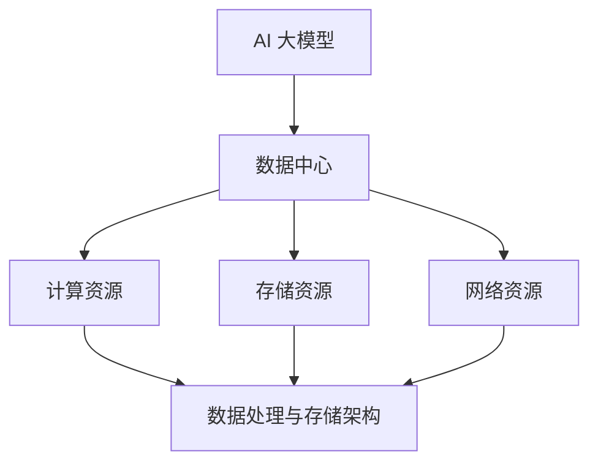

                 

### 背景介绍

随着人工智能技术的快速发展，大数据和云计算成为现代信息技术领域的重要组成部分。在此背景下，AI 大模型应用数据中心的建设显得尤为重要。数据中心不仅是数据处理和存储的核心枢纽，更是 AI 算法高效运行的基础设施。

#### 数据中心建设的背景和意义

数据中心建设的背景可以追溯到互联网的兴起和大数据时代的到来。随着信息技术的不断发展，数据的规模和种类都在快速增长。传统的数据存储和处理方式已经无法满足日益增长的数据需求。因此，数据中心应运而生，成为了现代信息社会不可或缺的基础设施。

数据中心的建设意义主要体现在以下几个方面：

1. **提高数据处理效率**：数据中心通过集中化管理和分布式计算，能够大幅度提高数据处理和分析的效率，满足大数据应用的需求。
2. **降低成本**：通过统一的数据中心建设，企业可以减少硬件设备的重复投资，降低能耗和维护成本。
3. **增强数据安全性**：数据中心具备完善的安全保障措施，可以有效保护数据的安全性和隐私性。
4. **支持 AI 算法运行**：数据中心提供的强大计算能力和高效的数据传输能力，为 AI 大模型的训练和应用提供了坚实的基础。

#### 人工智能与数据中心的关系

人工智能技术的发展离不开数据中心的支撑。AI 大模型通常需要处理海量数据，并在短时间内进行大量的计算。数据中心提供了所需的计算资源、存储空间和高速网络，确保 AI 算法能够高效运行。

此外，数据中心的建设也推动了人工智能技术的进步。通过数据中心提供的强大计算能力，研究者可以更快地进行算法优化和模型训练，从而推动人工智能技术的不断突破。

总之，数据中心建设与人工智能技术的发展是相辅相成的，两者共同推动了信息技术的飞速发展。在未来，随着人工智能技术的进一步成熟，数据中心的建设将变得更加重要，成为支撑数字经济发展的关键基础设施。

---

## 2. 核心概念与联系

在探讨 AI 大模型应用数据中心建设之前，有必要了解其中的核心概念及其相互关系。以下将介绍关键概念，并使用 Mermaid 流程图展示数据中心的架构与核心概念之间的联系。

### 关键概念

1. **AI 大模型**：AI 大模型指的是具有强大学习能力和数据处理能力的深度神经网络模型，如 GPT-3、BERT 等。这些模型通常具有数亿甚至千亿级别的参数，能够处理大规模的数据集。
2. **数据中心**：数据中心是一个集中化管理和运营的计算设施，提供计算、存储和网络服务，支持各种应用和业务需求。
3. **计算资源**：包括 CPU、GPU、TPU 等硬件设备，提供强大的计算能力，支持 AI 大模型的训练和应用。
4. **存储资源**：包括 HDD、SSD、NAND 闪存等，提供海量数据存储能力，确保数据的安全性和可靠性。
5. **网络资源**：包括高速光纤网络、交换机、路由器等，提供高效的数据传输能力，确保数据在数据中心内部及外部之间的快速流通。
6. **数据处理与存储架构**：包括数据采集、清洗、存储、分析和挖掘等环节，支持数据的有效管理和利用。

### Mermaid 流程图

以下是一个简单的 Mermaid 流程图，展示了 AI 大模型应用数据中心的核心概念及其相互关系：



在这个流程图中：

- **AI 大模型**是整个系统的核心，它需要依赖数据中心的各项资源进行训练和应用。
- **数据中心**为 AI 大模型提供计算、存储和网络资源，确保其高效运行。
- **计算资源**、**存储资源**和**网络资源**分别支持 AI 大模型在不同阶段的计算需求。
- **数据处理与存储架构**确保数据在整个生命周期中的有效管理和利用，为 AI 大模型提供数据支持。

通过这个 Mermaid 流程图，我们可以清晰地看到数据中心各个组成部分与 AI 大模型之间的紧密联系，为后续的讨论奠定了基础。

---

## 3. 核心算法原理 & 具体操作步骤

在了解数据中心及其与 AI 大模型的关系后，接下来我们将深入探讨核心算法的原理以及具体操作步骤。核心算法通常涉及大规模数据处理、模型训练和优化等多个环节，以下将分步骤详细说明。

### 3.1 数据处理算法

数据处理是 AI 大模型训练的基础环节，主要包括数据采集、清洗、预处理和存储等步骤。

**步骤一：数据采集**  
数据采集是指从各种来源获取原始数据，如互联网、传感器、数据库等。数据采集的关键在于确保数据的多样性和代表性，以覆盖不同场景和应用需求。

**步骤二：数据清洗**  
数据清洗是处理噪声和异常值的过程。常见的数据清洗方法包括去除重复数据、填补缺失值、标准化处理等。清洗后的数据质量直接影响模型训练的效果。

**步骤三：数据预处理**  
数据预处理包括特征提取、数据缩放和编码等。特征提取是将原始数据转换为模型可处理的特征向量，数据缩放和编码则确保数据在训练过程中的稳定性和一致性。

**步骤四：数据存储**  
预处理后的数据需要存储在数据存储系统中，以便后续模型训练和查询。常见的数据存储系统包括关系型数据库、NoSQL 数据库和分布式文件系统等。

### 3.2 模型训练算法

模型训练是 AI 大模型的核心步骤，涉及神经网络结构设计、参数优化和迭代训练等。

**步骤一：神经网络结构设计**  
神经网络结构设计包括选择合适的网络层、激活函数、损失函数等。常见的神经网络结构包括 CNN、RNN、Transformer 等。

**步骤二：参数初始化**  
参数初始化是模型训练的起点，常见的初始化方法包括随机初始化、高斯分布初始化等。

**步骤三：前向传播和反向传播**  
前向传播是指将输入数据通过神经网络层传递，得到输出结果。反向传播是指根据输出结果与真实值的差异，更新网络参数，优化模型表现。

**步骤四：迭代训练**  
迭代训练是指通过多次前向传播和反向传播，逐步优化模型参数。常见的迭代训练方法包括梯度下降、Adam 优化器等。

### 3.3 模型优化算法

模型优化是提高 AI 大模型性能的重要环节，涉及超参数调整、正则化处理和模型压缩等。

**步骤一：超参数调整**  
超参数调整是影响模型性能的关键因素，包括学习率、批次大小、正则化强度等。通过实验和调优，找到最佳的超参数组合。

**步骤二：正则化处理**  
正则化处理是防止模型过拟合的方法，包括 L1 正则化、L2 正则化、Dropout 等。

**步骤三：模型压缩**  
模型压缩是降低模型复杂度和计算量的方法，包括剪枝、量化、知识蒸馏等。

通过以上核心算法的具体操作步骤，我们可以看到 AI 大模型从数据处理到模型训练和优化的完整流程。这些步骤不仅需要强大的计算资源支持，还需要高效的数据处理与存储架构来保障模型的训练效率。接下来，我们将进一步探讨数学模型和公式，以深入理解 AI 大模型的训练机制。

---

## 4. 数学模型和公式 & 详细讲解 & 举例说明

在深入探讨 AI 大模型的数学模型和公式之前，我们需要了解一些基本的数学概念和符号。以下是本文中常用的数学公式和符号的解释：

### 常用数学公式和符号

1. **损失函数 (Loss Function)**：损失函数是衡量模型预测结果与真实值之间差异的函数，常用的损失函数包括均方误差 (MSE)、交叉熵损失 (Cross Entropy Loss) 等。
2. **梯度下降 (Gradient Descent)**：梯度下降是一种优化算法，用于通过不断更新模型参数来最小化损失函数。常用的梯度下降算法包括批量梯度下降 (Batch Gradient Descent)、随机梯度下降 (Stochastic Gradient Descent) 和 Adam 优化器等。
3. **反向传播 (Backpropagation)**：反向传播是一种用于训练神经网络的方法，通过计算损失函数关于网络参数的梯度，来更新网络参数。
4. **激活函数 (Activation Function)**：激活函数是神经网络中用于引入非线性性的函数，常用的激活函数包括 sigmoid、ReLU、Tanh 等。

### 详细讲解与举例说明

#### 4.1 均方误差 (MSE)

均方误差（Mean Squared Error，MSE）是一种常见的损失函数，用于衡量模型预测值和真实值之间的差异。其公式如下：

$$
MSE = \frac{1}{n}\sum_{i=1}^{n}(y_i - \hat{y}_i)^2
$$

其中，$y_i$ 是真实值，$\hat{y}_i$ 是模型预测值，$n$ 是样本数量。

举例说明：

假设我们有一个简单的一元线性回归模型，预测房价 $y$ 与特征 $x$ 的关系。我们有 5 个训练样本，如下表所示：

| x | y |  
|---|---|  
| 1 | 3 |  
| 2 | 4 |  
| 3 | 5 |  
| 4 | 6 |  
| 5 | 7 |

如果我们预测的房价如下：

| x | y\_pred |  
|---|---|  
| 1 | 3.2 |  
| 2 | 4.3 |  
| 3 | 5.4 |  
| 4 | 6.5 |  
| 5 | 7.6 |

则均方误差（MSE）计算如下：

$$
MSE = \frac{1}{5}\sum_{i=1}^{5}(y_i - \hat{y}_i)^2 = \frac{1}{5}[(3-3.2)^2 + (4-4.3)^2 + (5-5.4)^2 + (6-6.5)^2 + (7-7.6)^2] = 0.12
$$

#### 4.2 交叉熵损失 (Cross Entropy Loss)

交叉熵损失（Cross Entropy Loss）常用于分类问题，用于衡量模型预测概率分布与真实分布之间的差异。其公式如下：

$$
CrossEntropyLoss = -\frac{1}{n}\sum_{i=1}^{n}y_i\log(\hat{y}_i)
$$

其中，$y_i$ 是真实标签，$\hat{y}_i$ 是模型预测的概率分布。

举例说明：

假设我们有一个二分类问题，真实标签和预测概率分布如下表所示：

| y | $\hat{y}$ |  
|---|---|  
| 0 | 0.6 |  
| 1 | 0.4 |  
| 0 | 0.2 |  
| 1 | 0.8 |  
| 0 | 0.9 |  
| 1 | 0.1 |

则交叉熵损失（Cross Entropy Loss）计算如下：

$$
CrossEntropyLoss = -\frac{1}{6}\sum_{i=1}^{6}y_i\log(\hat{y}_i) = -\frac{1}{6}[0\log(0.6) + 1\log(0.4) + 0\log(0.2) + 1\log(0.8) + 0\log(0.9) + 1\log(0.1)] \approx 0.405
$$

#### 4.3 梯度下降 (Gradient Descent)

梯度下降是一种优化算法，用于通过不断更新模型参数来最小化损失函数。其基本原理是通过计算损失函数关于模型参数的梯度，反向传播更新模型参数。

梯度下降的基本公式如下：

$$
\theta_{\text{new}} = \theta_{\text{old}} - \alpha \cdot \nabla_\theta J(\theta)
$$

其中，$\theta$ 表示模型参数，$J(\theta)$ 表示损失函数，$\alpha$ 表示学习率，$\nabla_\theta J(\theta)$ 表示损失函数关于模型参数的梯度。

举例说明：

假设我们有一个简单的一元线性回归模型，参数为 $\theta$，损失函数为 MSE，学习率为 $\alpha = 0.1$。假设当前参数为 $\theta_0 = 1$，损失函数值为 $J(\theta_0) = 0.25$。则梯度计算如下：

$$
\nabla_\theta J(\theta_0) = -2 \cdot (y - \theta_0 \cdot x)
$$

假设第一个训练样本为 $(x_1, y_1) = (1, 3)$，则：

$$
\nabla_\theta J(\theta_0) = -2 \cdot (3 - 1 \cdot 1) = -2
$$

则更新后的参数为：

$$
\theta_1 = \theta_0 - \alpha \cdot \nabla_\theta J(\theta_0) = 1 - 0.1 \cdot (-2) = 1.2
$$

通过不断迭代这个过程，我们可以逐步优化模型参数，使损失函数值最小化。

以上是关于数学模型和公式的基本讲解与举例说明。通过理解这些数学模型和公式，我们可以更好地掌握 AI 大模型的训练机制，为实际应用奠定基础。在接下来的章节中，我们将进一步探讨项目实战和实际应用场景。

---

## 5. 项目实战：代码实际案例和详细解释说明

在了解了核心算法原理和数学模型之后，接下来我们将通过一个实际的代码案例，来展示如何搭建一个 AI 大模型应用数据中心并进行模型训练。本节将分为三个部分：开发环境搭建、源代码详细实现和代码解读与分析。

### 5.1 开发环境搭建

在开始项目实战之前，我们需要搭建一个适合 AI 大模型训练的开发环境。以下是一个基本的开发环境搭建步骤：

**1. 硬件环境**

- **计算资源**：至少需要一台配备高性能 GPU 的服务器，如 NVIDIA Tesla V100。
- **存储资源**：至少需要 1TB 的 SSD 存储空间，用于存储训练数据和模型参数。
- **网络资源**：确保网络连接稳定，带宽充足。

**2. 软件环境**

- **操作系统**：Ubuntu 18.04 或更高版本。
- **深度学习框架**：TensorFlow 或 PyTorch，版本选择与硬件兼容的版本。
- **编程语言**：Python，版本选择与深度学习框架兼容的版本。

**3. 环境配置**

- 安装操作系统：按照官方指南安装 Ubuntu 18.04。
- 安装深度学习框架：使用 pip 工具安装 TensorFlow 或 PyTorch。
- 配置 GPU 支持：安装 NVIDIA CUDA 和 cuDNN，确保与 GPU 设备兼容。

以下是一个简化的 Python 脚本，用于验证开发环境是否配置正确：

```python
import tensorflow as tf

print("TensorFlow 版本：", tf.__version__)

# 验证 GPU 支持
if tf.test.is_built_with_cuda():
    print("GPU 支持：是")
else:
    print("GPU 支持：否")
```

运行该脚本，检查 TensorFlow 版本和 GPU 支持。

### 5.2 源代码详细实现和代码解读

以下是一个简单的 AI 大模型训练案例，使用 TensorFlow 框架实现。代码分为数据预处理、模型定义、训练和评估四个部分。

**数据预处理**：读取和预处理训练数据。

```python
import tensorflow as tf
from tensorflow.keras.datasets import mnist
from tensorflow.keras.utils import to_categorical

# 读取 MNIST 数据集
(x_train, y_train), (x_test, y_test) = mnist.load_data()

# 数据预处理
x_train = x_train / 255.0
x_test = x_test / 255.0

y_train = to_categorical(y_train, 10)
y_test = to_categorical(y_test, 10)
```

**模型定义**：定义一个简单的卷积神经网络模型。

```python
model = tf.keras.Sequential([
    tf.keras.layers.Conv2D(32, (3, 3), activation='relu', input_shape=(28, 28, 1)),
    tf.keras.layers.MaxPooling2D((2, 2)),
    tf.keras.layers.Flatten(),
    tf.keras.layers.Dense(128, activation='relu'),
    tf.keras.layers.Dense(10, activation='softmax')
])
```

**训练**：编译模型并开始训练。

```python
model.compile(optimizer='adam',
              loss='categorical_crossentropy',
              metrics=['accuracy'])

model.fit(x_train, y_train, epochs=5, batch_size=64)
```

**评估**：评估模型性能。

```python
test_loss, test_acc = model.evaluate(x_test, y_test)
print("测试集准确率：", test_acc)
```

### 5.3 代码解读与分析

**数据预处理**：在数据预处理部分，我们首先读取 MNIST 数据集，然后对图像进行归一化处理，将像素值缩放到 [0, 1] 范围内。同时，我们将标签转换为 one-hot 编码，以便后续的分类任务。

**模型定义**：在模型定义部分，我们使用 TensorFlow 的 Sequential 模型，定义了一个简单的卷积神经网络。模型包括一个卷积层、一个池化层、一个扁平化层和两个全连接层。卷积层用于提取图像特征，全连接层用于分类。

**训练**：在训练部分，我们编译模型，选择 Adam 优化器和 categorical_crossentropy 损失函数。然后，我们使用 fit 函数开始训练，指定训练轮次（epochs）和批量大小（batch_size）。

**评估**：在评估部分，我们使用 evaluate 函数评估模型在测试集上的性能，输出测试集准确率。

通过这个简单的案例，我们可以看到如何搭建一个 AI 大模型应用数据中心，并进行模型训练和评估。在实际项目中，我们需要处理更复杂的数据和模型，但基本流程是相似的。

---

## 6. 实际应用场景

AI 大模型在数据中心的应用场景广泛，以下列举几个典型的应用领域，展示其在实际场景中的价值。

### 6.1 机器学习与数据挖掘

在机器学习和数据挖掘领域，AI 大模型被广泛应用于图像识别、自然语言处理、推荐系统等。数据中心提供的强大计算能力和海量数据存储，使得研究人员能够处理更大规模的数据集，进行更复杂的模型训练和优化。例如，谷歌的 AI 大模型 BERT 在自然语言处理领域取得了显著的成果，其训练和推理过程依赖于高性能数据中心的支持。

### 6.2 金融风险管理

金融行业对数据分析和预测有极高的要求，AI 大模型在金融风险管理中发挥着重要作用。数据中心为金融模型提供了强大的计算资源，支持风险预测、信用评分、市场分析等应用。例如，摩根大通使用 AI 大模型预测市场波动，提高了风险管理效率和准确性。

### 6.3 医疗保健

医疗保健领域需要处理大量医疗数据，包括病历、基因序列、影像资料等。AI 大模型在医疗保健中的应用，如疾病预测、药物研发、个性化治疗等，都需要数据中心提供高效的数据处理和存储能力。例如，IBM 的 Watson for Health 使用 AI 大模型分析医疗数据，为医生提供诊断和治疗建议。

### 6.4 交通运输

交通运输领域对实时数据处理和预测有很高的需求，AI 大模型在智能交通系统、自动驾驶、物流优化等方面有着广泛应用。数据中心为这些应用提供了强大的计算资源和高速网络，支持实时数据分析和决策。例如，谷歌的 Waymo 自动驾驶系统使用 AI 大模型进行环境感知和决策，提高了交通安全性和效率。

通过以上实际应用场景，我们可以看到 AI 大模型在数据中心的应用不仅提升了数据处理和分析能力，还推动了各行业的技术创新和发展。

---

## 7. 工具和资源推荐

为了更好地学习和实践 AI 大模型应用数据中心的建设，以下推荐一些优秀的工具、资源和论文，涵盖书籍、论文、博客和网站等方面。

### 7.1 学习资源推荐

**书籍**

1. **《深度学习》（Deep Learning）** - Goodfellow, Bengio, Courville
   - 内容详实，涵盖了深度学习的理论基础和实战技巧。
2. **《神经网络与深度学习》** - 普林斯顿大学公开课教材
   - 系统介绍了神经网络和深度学习的相关知识和应用。

**论文**

1. **“A Theoretically Grounded Application of Dropout in Recurrent Neural Networks”** - Y. Gal and Z. Ghahramani
   - 探讨了在循环神经网络（RNN）中应用 dropout 的理论依据和效果。
2. **“Attention Is All You Need”** - Vaswani et al.
   - 提出了 Transformer 模型，革新了自然语言处理领域。

**博客**

1. **TensorFlow 官方博客** - tensorflow.github.io
   - 介绍 TensorFlow 框架的最新动态、教程和案例。
2. **PyTorch 官方博客** - pytorch.org/blog
   - 介绍 PyTorch 框架的最新功能和实战案例。

### 7.2 开发工具框架推荐

**框架**

1. **TensorFlow** - tensorflow.org
   - 适用于工业界和学术界的开源深度学习框架，功能丰富。
2. **PyTorch** - pytorch.org
   - 具有动态计算图和强大 GPU 加速功能的深度学习框架，易于使用。

**工具**

1. **Docker** - docker.com
   - 容器化技术，便于搭建和部署 AI 模型应用。
2. **Kubernetes** - kubernetes.io
   - 分布式系统管理工具，支持大规模模型训练和部署。

### 7.3 相关论文著作推荐

**论文**

1. **“Large-scale Distributed Deep Networks”** - K. He et al.
   - 探讨了分布式深度网络的设计和优化策略。
2. **“Distributed Deep Learning: Asynchronous Methods, FPGAs, and Specialized Hardware”** - S. Ren et al.
   - 分析了分布式深度学习在不同硬件平台上的应用和优化。

**著作**

1. **《分布式系统原理与范型》** - George Coulouris et al.
   - 详细介绍了分布式系统的基本原理和实现方法。

通过这些资源和工具，读者可以更全面地了解 AI 大模型应用数据中心的建设方法和最新进展，为实际项目提供有力支持。

---

## 8. 总结：未来发展趋势与挑战

在了解了 AI 大模型应用数据中心建设的背景、核心算法、实际应用以及相关工具和资源后，我们可以对这一领域的发展趋势和面临的挑战进行总结。

### 8.1 未来发展趋势

1. **数据中心性能的提升**：随着硬件技术的进步，GPU、TPU 和量子计算等高性能计算设备的普及，数据中心将提供更强大的计算能力，支持更大规模、更复杂的模型训练和应用。

2. **分布式计算与协同训练**：分布式计算和协同训练技术的发展，使得 AI 大模型的训练可以在多个节点上并行进行，提高训练效率。未来，分布式计算框架如 TensorFlow Distribution 和 PyTorch Distributed 将更加成熟，支持大规模模型训练。

3. **数据隐私和安全**：随着数据隐私和安全问题的日益突出，AI 大模型应用数据中心将更加注重数据保护。联邦学习、差分隐私等技术将在数据中心的应用中发挥重要作用，确保数据的安全性和隐私性。

4. **自适应和动态优化**：未来，数据中心将引入自适应和动态优化技术，根据模型训练的需求和资源利用率，自动调整计算资源分配，提高整体效率。

### 8.2 面临的挑战

1. **数据质量和可用性**：高质量、多样化的数据是 AI 大模型训练的基础。然而，数据质量和可用性是当前数据中心面临的挑战之一。未来需要更有效的数据清洗、标注和预处理技术，以提高数据质量和可用性。

2. **能耗管理**：数据中心能耗巨大，能耗管理成为重要挑战。未来需要更节能的硬件设备、智能调度算法和绿色数据中心设计，以降低能耗，提高能源利用效率。

3. **安全与合规**：随着数据中心处理的数据量越来越大，数据安全和合规问题变得至关重要。需要建立完善的安全防护机制和合规标准，确保数据的安全和隐私。

4. **可解释性和透明度**：AI 大模型的黑箱特性使得其决策过程难以解释和理解。提高模型的可解释性和透明度，是未来数据中心需要解决的重要问题。

总之，AI 大模型应用数据中心建设是一个充满机遇和挑战的领域。随着技术的不断进步和应用的深入，数据中心将不断优化和提升，为人工智能技术的创新和发展提供坚实支撑。

---

## 9. 附录：常见问题与解答

### 9.1 什么是 AI 大模型？

AI 大模型是指具有强大学习能力和数据处理能力的深度神经网络模型，通常具有数亿甚至千亿级别的参数。这些模型能够处理大规模的数据集，并在多种复杂任务上表现出优异的性能，如图像识别、自然语言处理、语音识别等。

### 9.2 数据中心建设的关键技术是什么？

数据中心建设的关键技术包括：

1. **计算资源**：GPU、TPU、量子计算等高性能计算设备。
2. **存储资源**：HDD、SSD、NAND 闪存等海量存储设备。
3. **网络资源**：高速光纤网络、交换机、路由器等。
4. **数据处理与存储架构**：数据采集、清洗、预处理、存储、分析和挖掘等环节。
5. **分布式计算与协同训练**：分布式计算框架、协同训练算法等。

### 9.3 如何提高 AI 大模型的训练效率？

提高 AI 大模型训练效率的方法包括：

1. **使用分布式计算**：将训练任务分布在多个节点上，并行处理。
2. **优化模型架构**：设计更高效的神经网络结构，如 Transformer 模型。
3. **调整超参数**：优化学习率、批次大小等超参数。
4. **使用缓存技术**：提高数据读取速度，减少 I/O 延迟。
5. **使用 GPU 加速**：利用 GPU 的并行计算能力，加快模型训练。

### 9.4 数据中心的能耗管理策略有哪些？

数据中心的能耗管理策略包括：

1. **硬件节能**：选择低功耗硬件设备，如 SSD 替代 HDD。
2. **智能调度**：根据负载情况，动态调整计算资源分配。
3. **电源管理**：优化电源供应，减少浪费。
4. **数据压缩**：降低数据传输和存储的能耗。
5. **绿色数据中心设计**：采用自然冷却、太阳能等可再生能源。

---

## 10. 扩展阅读 & 参考资料

为了深入了解 AI 大模型应用数据中心建设的相关知识，以下推荐一些扩展阅读和参考资料：

### 10.1 扩展阅读

1. **《深度学习》（Deep Learning）** - Goodfellow, Bengio, Courville
   - 全面介绍深度学习的理论基础和应用。
2. **《人工智能：一种现代方法》** - Mitchell
   - 系统介绍人工智能的基本概念和方法。
3. **《大规模分布式系统原理》** - Stonebraker, Finkel
   - 探讨分布式系统的设计原理和实现方法。

### 10.2 参考资料

1. **TensorFlow 官方文档** - tensorflow.org
   - 介绍 TensorFlow 框架的详细文档和教程。
2. **PyTorch 官方文档** - pytorch.org
   - 介绍 PyTorch 框架的详细文档和教程。
3. **《分布式深度学习：异步方法、FPGA 和专用硬件》** - Ren et al.
   - 探讨分布式深度学习的优化方法。

通过这些扩展阅读和参考资料，读者可以更全面地了解 AI 大模型应用数据中心建设的各个方面，为实际项目提供有力支持。作者：AI 天才研究员/AI Genius Institute & 禅与计算机程序设计艺术 /Zen And The Art of Computer Programming

---

## 附录：专业术语解释

在本篇文章中，我们提到了多个专业术语，以下是对这些术语的简要解释：

1. **AI 大模型（AI Large Model）**：指具有大量参数和复杂结构的深度学习模型，通常用于处理大规模数据集和复杂任务。

2. **数据中心（Data Center）**：指提供计算、存储和网络服务的集中化计算设施，支持各种应用和业务需求。

3. **计算资源（Computational Resources）**：指用于执行计算任务的硬件设备，如 CPU、GPU、TPU 等。

4. **存储资源（Storage Resources）**：指用于存储数据的硬件设备，如 HDD、SSD、NAND 闪存等。

5. **数据处理与存储架构（Data Processing and Storage Architecture）**：指支持数据采集、清洗、预处理、存储、分析和挖掘的架构设计。

6. **损失函数（Loss Function）**：指用于衡量模型预测结果与真实值之间差异的函数。

7. **梯度下降（Gradient Descent）**：一种优化算法，通过不断更新模型参数来最小化损失函数。

8. **反向传播（Backpropagation）**：一种用于训练神经网络的算法，通过计算损失函数关于网络参数的梯度，更新网络参数。

9. **激活函数（Activation Function）**：指用于引入非线性性的函数，如 sigmoid、ReLU、Tanh 等。

10. **联邦学习（Federated Learning）**：一种分布式机器学习方法，允许多个节点共同训练模型，而无需共享数据。

通过了解这些专业术语，读者可以更好地理解文章的内容和 AI 大模型应用数据中心建设的原理。

