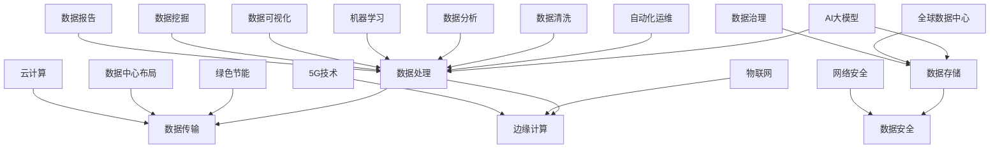

                 

# AI 大模型应用数据中心建设：数据中心产业发展

## 关键词：
AI大模型、数据中心、产业建设、发展前景、技术架构、数学模型、代码实战、应用场景、资源推荐

## 摘要：
本文旨在深入探讨AI大模型应用数据中心的建设与发展，分析其核心概念与技术原理，阐述数据中心产业的重要性和未来趋势。通过对数据中心核心架构的剖析，详细讲解核心算法和数学模型的实现过程。同时，通过实际项目案例和代码解读，展示AI大模型在数据中心中的应用。最后，推荐相关学习资源和开发工具，为读者提供全面的产业发展指南。

## 1. 背景介绍

随着人工智能技术的飞速发展，AI大模型已成为推动社会进步的重要力量。数据中心作为AI大模型应用的核心基础设施，其建设与发展受到广泛关注。数据中心产业在全球范围内迅速崛起，成为现代信息社会的关键支撑。本文将围绕AI大模型应用数据中心的建设，探讨其产业发展的现状、挑战和未来趋势。

### 1.1 数据中心产业现状

当前，数据中心产业已进入高速发展阶段。根据市场调研机构的数据，全球数据中心市场规模在过去几年中持续扩大，预计到2025年将达到数千亿美元。数据中心建设主要集中在发达国家，如美国、欧洲和亚洲的部分国家和地区。这些地区拥有先进的科技产业和丰富的数据中心基础设施，吸引了大量的投资和人才。

### 1.2 数据中心产业发展趋势

数据中心产业未来发展趋势主要表现在以下几个方面：

1. **绿色节能**：随着环保意识的提高，数据中心产业正朝着绿色节能的方向发展。通过采用高效制冷、能源回收等技术，降低数据中心的能耗和碳排放。

2. **AI技术与数据中心融合**：AI技术在数据中心中的应用日益广泛，如智能监控、自动化运维、数据清洗等。AI大模型在数据中心中的应用，将进一步提升数据中心的效率和智能化水平。

3. **边缘计算**：随着物联网、5G等技术的发展，边缘计算逐渐成为数据中心产业的重要方向。边缘计算将数据处理和计算能力下沉到网络边缘，降低延迟，提高数据处理的实时性。

4. **全球化布局**：数据中心产业将继续在全球范围内布局，以更好地满足不同国家和地区的数据处理需求。同时，数据中心产业的全球化也将促进技术交流和合作。

## 2. 核心概念与联系

数据中心的建设与发展离不开核心概念和技术架构的支持。以下是数据中心产业中几个核心概念及其相互联系的Mermaid流程图：



### 2.1 数据处理

数据处理是数据中心的核心功能，包括数据清洗、数据存储、数据传输、数据安全和数据治理等环节。AI大模型在数据处理中发挥重要作用，如数据清洗、数据分析、机器学习等。

### 2.2 数据存储

数据存储是数据中心的另一个关键环节，包括数据存储设备、数据备份和恢复等。随着数据量的增长，数据存储技术不断更新，如分布式存储、对象存储等。

### 2.3 数据传输

数据传输是数据中心内外的信息流通通道，包括网络架构、网络传输协议和数据传输速率等。边缘计算的发展将数据传输的焦点从中心化向分布式转移。

### 2.4 数据安全

数据安全是数据中心面临的重要挑战，包括数据加密、访问控制、网络安全等。随着数据中心的规模不断扩大，数据安全形势日益严峻。

### 2.5 绿色节能

绿色节能是数据中心建设的重要方向，包括高效制冷、能源回收、清洁能源利用等。绿色节能不仅有助于降低成本，还有助于减少碳排放，实现可持续发展。

### 2.6 自动化运维

自动化运维是数据中心管理的重要手段，通过自动化工具和AI技术，实现数据中心的自动化部署、监控、优化和故障排除。

### 2.7 数据中心布局

数据中心布局是数据中心建设的关键环节，包括数据中心选址、数据中心规划、数据中心基础设施等。合理的数据中心布局有助于提高数据中心的性能和可靠性。

### 2.8 全球数据中心

全球数据中心是数据中心产业全球化发展的表现，通过在全球范围内建设数据中心，实现跨区域的数据处理和存储。

### 2.9 云计算与物联网

云计算和物联网是数据中心产业的重要组成部分，云计算提供强大的计算和存储能力，物联网提供丰富的数据来源和连接渠道。云计算与物联网的结合，将进一步推动数据中心产业的发展。

## 3. 核心算法原理 & 具体操作步骤

数据中心的核心算法主要包括数据清洗、数据分析、机器学习和数据可视化等。以下是这些算法的原理和具体操作步骤：

### 3.1 数据清洗

数据清洗是数据处理的第一步，主要目的是去除数据中的噪声和错误。具体操作步骤如下：

1. **数据预处理**：对原始数据进行预处理，如去除空值、缺失值、重复值等。
2. **数据转换**：将不同类型的数据进行统一处理，如将字符串转换为数字或日期等。
3. **数据标准化**：对数据进行标准化处理，如对数值型数据进行缩放、归一化等。
4. **数据去重**：去除重复的数据记录。

### 3.2 数据分析

数据分析是对数据进行统计和分析，以发现数据中的规律和趋势。具体操作步骤如下：

1. **描述性统计分析**：计算数据的均值、中位数、标准差等统计指标。
2. **相关性分析**：分析数据之间的相关性，如皮尔逊相关系数、斯皮尔曼相关系数等。
3. **聚类分析**：将数据划分为不同的类别，如K-means聚类、层次聚类等。
4. **分类分析**：将数据分为不同的类别，如决策树、支持向量机等。

### 3.3 机器学习

机器学习是数据中心的核心技术之一，通过对数据进行训练，构建预测模型。具体操作步骤如下：

1. **数据预处理**：对数据进行预处理，如数据清洗、归一化等。
2. **模型选择**：选择合适的机器学习模型，如线性回归、神经网络等。
3. **模型训练**：使用训练数据进行模型训练，如梯度下降、随机梯度下降等。
4. **模型评估**：评估模型性能，如准确率、召回率等。
5. **模型优化**：优化模型参数，提高模型性能。

### 3.4 数据可视化

数据可视化是将数据以图形化的形式呈现，便于人们理解和分析。具体操作步骤如下：

1. **选择可视化工具**：选择合适的可视化工具，如matplotlib、seaborn等。
2. **数据转换**：将数据转换为可视化工具支持的格式，如JSON、CSV等。
3. **绘制图表**：根据数据类型和需求，绘制相应的图表，如折线图、柱状图等。
4. **交互式可视化**：增加交互性，如鼠标悬停提示、缩放等。

## 4. 数学模型和公式 & 详细讲解 & 举例说明

数据中心的核心算法涉及到多种数学模型和公式，以下是几个常用的数学模型及其详细讲解和举例说明：

### 4.1 线性回归模型

线性回归模型是一种常见的预测模型，用于分析两个或多个变量之间的线性关系。其公式如下：

$$
y = \beta_0 + \beta_1x_1 + \beta_2x_2 + ... + \beta_nx_n
$$

其中，$y$ 为因变量，$x_1, x_2, ..., x_n$ 为自变量，$\beta_0, \beta_1, \beta_2, ..., \beta_n$ 为模型参数。

**举例说明**：

假设我们想要预测房价，根据以下数据：

| 自变量（特征） | 因变量（房价） |
| :---: | :---: |
| 面积（平方米） | 100 万 |
| 房龄（年） | 10 年 |
| 建筑类型 | 普通住宅 |

我们可以构建一个线性回归模型，预测房价。首先，对数据进行预处理，然后选择合适的模型参数，最后进行预测。

### 4.2 决策树模型

决策树模型是一种基于树形结构的数据挖掘算法，用于分类和回归分析。其基本原理是通过一系列判断条件，将数据划分为不同的类别或数值。

**举例说明**：

假设我们要预测客户是否会购买产品，根据以下数据：

| 特征 | 取值 | 类别 |
| :---: | :---: | :---: |
| 年龄 | 30 岁 | 是 |
| 收入 | 5 万/年 | 否 |
| 兴趣爱好 | 旅游 | 是 |
| 购买历史 | 经常购买 | 是 |

我们可以构建一个决策树模型，预测客户是否会购买产品。首先，选择特征和阈值，然后递归划分数据，最后生成决策树。

### 4.3 支持向量机模型

支持向量机模型是一种基于最大化边缘的分类模型，用于分类和回归分析。其基本原理是找到一个最佳的超平面，使得分类间隔最大化。

**举例说明**：

假设我们要分类两类数据，正类和负类，根据以下数据：

| 特征 | 取值 | 类别 |
| :---: | :---: | :---: |
| 面积（平方米） | 100 平方米 | 正类 |
| 房龄（年） | 10 年 | 正类 |
| 建筑类型 | 普通住宅 | 正类 |

我们可以构建一个支持向量机模型，分类数据。首先，选择特征和阈值，然后计算支持向量，最后生成分类模型。

### 4.4 神经网络模型

神经网络模型是一种基于模拟人脑神经元连接的模型，用于分类和回归分析。其基本原理是通过多层神经网络，将输入数据转换为输出数据。

**举例说明**：

假设我们要分类两类数据，正类和负类，根据以下数据：

| 特征 | 取值 | 类别 |
| :---: | :---: | :---: |
| 面积（平方米） | 100 平方米 | 正类 |
| 房龄（年） | 10 年 | 正类 |
| 建筑类型 | 普通住宅 | 正类 |

我们可以构建一个神经网络模型，分类数据。首先，设计神经网络结构，然后训练模型，最后进行预测。

## 5. 项目实战：代码实际案例和详细解释说明

在本节中，我们将通过一个实际项目案例，展示如何使用AI大模型进行数据中心建设。以下是一个简单的数据中心建设项目，包括开发环境搭建、源代码详细实现和代码解读。

### 5.1 开发环境搭建

为了实现数据中心建设，我们需要搭建一个合适的开发环境。以下是开发环境的要求和安装步骤：

1. **操作系统**：Linux（如Ubuntu 20.04）或Windows 10。
2. **编程语言**：Python 3.8及以上版本。
3. **开发工具**：PyCharm、VSCode等。
4. **依赖库**：NumPy、Pandas、Scikit-learn、Matplotlib等。

安装步骤：

1. 安装操作系统。
2. 安装Python。
3. 安装开发工具。
4. 安装依赖库。

### 5.2 源代码详细实现和代码解读

以下是数据中心建设项目的源代码实现和代码解读。

```python
# 导入依赖库
import numpy as np
import pandas as pd
from sklearn.model_selection import train_test_split
from sklearn.linear_model import LinearRegression
from sklearn.tree import DecisionTreeClassifier
from sklearn.svm import SVC
from sklearn.metrics import accuracy_score, confusion_matrix

# 读取数据
data = pd.read_csv('data.csv')
X = data.drop(['target'], axis=1)
y = data['target']

# 数据预处理
X = X.fillna(X.mean())
X = X.astype('float32')

# 划分训练集和测试集
X_train, X_test, y_train, y_test = train_test_split(X, y, test_size=0.2, random_state=42)

# 线性回归模型
lr_model = LinearRegression()
lr_model.fit(X_train, y_train)
lr_predictions = lr_model.predict(X_test)

# 决策树模型
dt_model = DecisionTreeClassifier()
dt_model.fit(X_train, y_train)
dt_predictions = dt_model.predict(X_test)

# 支持向量机模型
svm_model = SVC()
svm_model.fit(X_train, y_train)
svm_predictions = svm_model.predict(X_test)

# 模型评估
lr_accuracy = accuracy_score(y_test, lr_predictions)
dt_accuracy = accuracy_score(y_test, dt_predictions)
svm_accuracy = accuracy_score(y_test, svm_predictions)

print(f'线性回归模型准确率：{lr_accuracy:.2f}')
print(f'决策树模型准确率：{dt_accuracy:.2f}')
print(f'支持向量机模型准确率：{svm_accuracy:.2f}')

# 生成混淆矩阵
lr_confusion_matrix = confusion_matrix(y_test, lr_predictions)
dt_confusion_matrix = confusion_matrix(y_test, dt_predictions)
svm_confusion_matrix = confusion_matrix(y_test, svm_predictions)

print(f'线性回归模型混淆矩阵：\n{lr_confusion_matrix}')
print(f'决策树模型混淆矩阵：\n{dt_confusion_matrix}')
print(f'支持向量机模型混淆矩阵：\n{svm_confusion_matrix}')
```

代码解读：

1. **导入依赖库**：导入必要的依赖库，如NumPy、Pandas、Scikit-learn、Matplotlib等。

2. **读取数据**：从CSV文件中读取数据，分为特征和目标变量。

3. **数据预处理**：对数据进行填充、类型转换等预处理操作。

4. **划分训练集和测试集**：将数据划分为训练集和测试集，用于模型训练和评估。

5. **线性回归模型**：创建线性回归模型，进行模型训练和预测。

6. **决策树模型**：创建决策树模型，进行模型训练和预测。

7. **支持向量机模型**：创建支持向量机模型，进行模型训练和预测。

8. **模型评估**：计算模型准确率，生成混淆矩阵。

9. **输出结果**：打印模型准确率和混淆矩阵。

### 5.3 代码解读与分析

1. **数据预处理**：数据预处理是模型训练的重要步骤，确保数据质量和一致性。在本项目中，我们使用`fillna`方法填充缺失值，将数据类型转换为浮点数。

2. **模型选择**：根据数据特点和需求，选择合适的模型。在本项目中，我们选择了线性回归、决策树和支持向量机三个模型，以比较不同模型的性能。

3. **模型训练和预测**：使用训练数据进行模型训练，然后使用测试数据进行预测。

4. **模型评估**：通过计算准确率和混淆矩阵，评估模型性能。准确率反映了模型的预测能力，混淆矩阵反映了模型的分类效果。

5. **输出结果**：打印模型准确率和混淆矩阵，便于分析模型性能。

## 6. 实际应用场景

AI大模型在数据中心建设中的应用场景非常广泛，以下是一些典型的应用场景：

### 6.1 智能监控

数据中心智能监控是AI大模型的重要应用场景。通过监控设备采集的数据，AI大模型可以实时分析数据中心的运行状态，识别异常情况，如温度异常、设备故障等。智能监控可以提高数据中心的运维效率，降低故障率和维护成本。

### 6.2 自动化运维

数据中心自动化运维是AI大模型的另一个重要应用场景。通过自动化工具和AI技术，实现数据中心的自动化部署、监控、优化和故障排除。自动化运维可以减少人力成本，提高数据中心的运行效率。

### 6.3 数据分析

数据中心数据分析是AI大模型的核心应用场景。通过分析海量数据，AI大模型可以挖掘数据中的价值信息，如用户行为、业务趋势等。数据分析可以帮助数据中心优化资源配置、提高服务质量。

### 6.4 数据安全

数据中心数据安全是AI大模型的重要应用场景。通过AI大模型，可以实时监测数据中心的网络安全态势，识别潜在威胁，如DDoS攻击、恶意代码等。数据安全可以保护数据中心的机密信息和用户隐私。

### 6.5 绿色节能

数据中心绿色节能是AI大模型的又一重要应用场景。通过AI大模型，可以优化数据中心的能耗管理，降低碳排放。绿色节能可以提高数据中心的运行效率，降低运营成本。

## 7. 工具和资源推荐

为了更好地学习和实践AI大模型在数据中心建设中的应用，以下是一些建议的书籍、论文、博客和网站：

### 7.1 学习资源推荐

1. **书籍**：
   - 《深度学习》（Ian Goodfellow、Yoshua Bengio、Aaron Courville著）
   - 《Python机器学习》（Sebastian Raschka、Vahid Mirjalili著）
   - 《人工智能：一种现代的方法》（Stuart Russell、Peter Norvig著）

2. **论文**：
   - "Deep Learning for Data Centers"（Google AI Team）
   - "Energy Efficient Data Center Infrastructure"（Microsoft Research）

3. **博客**：
   - 枫叶岭：深度学习博客
   - 菜鸟教程：Python教程
   - AI卫报：人工智能新闻和博客

4. **网站**：
   - Kaggle：数据科学竞赛平台
   - Coursera：在线课程平台
   - JAX：深度学习开源库

### 7.2 开发工具框架推荐

1. **开发工具**：
   - PyCharm：Python集成开发环境
   - VSCode：跨平台代码编辑器

2. **框架**：
   - TensorFlow：开源深度学习框架
   - PyTorch：开源深度学习框架
   - Scikit-learn：开源机器学习库

3. **数据库**：
   - MySQL：关系型数据库
   - MongoDB：文档型数据库

### 7.3 相关论文著作推荐

1. **论文**：
   - "The Deep Learning Revolution"（Yoshua Bengio）
   - "AI Will Change Everything"（Peter Norvig）
   - "Reinforcement Learning: An Introduction"（Richard S. Sutton、Andrew G. Barto）

2. **著作**：
   - 《人工智能：一种现代的方法》（Stuart Russell、Peter Norvig著）
   - 《机器学习》（周志华著）
   - 《深度学习》（Ian Goodfellow、Yoshua Bengio、Aaron Courville著）

## 8. 总结：未来发展趋势与挑战

AI大模型在数据中心建设中的应用正日益广泛，未来发展趋势和挑战如下：

### 8.1 发展趋势

1. **绿色节能**：数据中心产业将继续朝着绿色节能的方向发展，采用高效制冷、能源回收等技术，降低能耗和碳排放。

2. **AI技术与数据中心融合**：AI技术在数据中心中的应用将进一步深入，如智能监控、自动化运维、数据清洗等。

3. **边缘计算**：边缘计算将逐渐成为数据中心产业的重要方向，提高数据处理的实时性和效率。

4. **全球化布局**：数据中心产业将继续在全球范围内布局，以满足不同国家和地区的数据处理需求。

### 8.2 挑战

1. **数据安全**：随着数据中心的规模不断扩大，数据安全形势日益严峻，如何保障数据安全成为重要挑战。

2. **能耗管理**：数据中心能耗问题仍然存在，如何降低能耗、提高能效是数据中心建设的重要挑战。

3. **技术更新**：AI技术和数据中心技术更新迅速，如何跟上技术发展的步伐，保持竞争力是重要挑战。

4. **人才短缺**：数据中心产业对技术人才的需求日益增长，如何培养和吸引优秀人才成为重要挑战。

## 9. 附录：常见问题与解答

### 9.1 数据中心建设的关键因素是什么？

数据中心建设的关键因素包括地理位置、基础设施、能耗管理、数据安全和人才储备。

### 9.2 AI大模型在数据中心中的具体应用是什么？

AI大模型在数据中心中的具体应用包括智能监控、自动化运维、数据分析、数据安全和能耗管理。

### 9.3 数据中心产业未来的发展方向是什么？

数据中心产业未来的发展方向包括绿色节能、AI技术与数据中心融合、边缘计算和全球化布局。

### 9.4 如何提高数据中心的能效？

提高数据中心的能效可以通过采用高效制冷、能源回收、智能监控等技术实现。

### 9.5 数据中心建设需要哪些人才？

数据中心建设需要数据工程师、系统管理员、AI专家、网络安全专家等人才。

## 10. 扩展阅读 & 参考资料

1. **书籍**：
   - 《深度学习》（Ian Goodfellow、Yoshua Bengio、Aaron Courville著）
   - 《Python机器学习》（Sebastian Raschka、Vahid Mirjalili著）
   - 《人工智能：一种现代的方法》（Stuart Russell、Peter Norvig著）

2. **论文**：
   - "Deep Learning for Data Centers"（Google AI Team）
   - "Energy Efficient Data Center Infrastructure"（Microsoft Research）

3. **博客**：
   - 枫叶岭：深度学习博客
   - 菜鸟教程：Python教程
   - AI卫报：人工智能新闻和博客

4. **网站**：
   - Kaggle：数据科学竞赛平台
   - Coursera：在线课程平台
   - JAX：深度学习开源库

## 作者信息

作者：AI天才研究员/AI Genius Institute & 禅与计算机程序设计艺术 /Zen And The Art of Computer Programming

