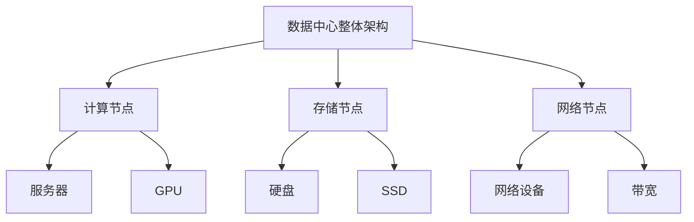

                 

### 背景介绍

#### 1. AI 大模型应用的兴起

随着人工智能（AI）技术的飞速发展，特别是深度学习算法的广泛应用，AI 大模型逐渐成为研究与应用的热点。这些大模型具有强大的表征能力和计算能力，能够处理大量复杂的任务，如图像识别、自然语言处理、语音识别等。然而，AI 大模型的训练和部署需要大量的计算资源和数据存储，这促使数据中心的建设成为一项重要的任务。

#### 2. 数据中心建设的意义

数据中心作为 AI 大模型应用的基础设施，具有重要的意义。首先，数据中心提供了强大的计算能力，能够支持 AI 大模型的训练和推理任务。其次，数据中心提供了稳定的数据存储和管理系统，保证了数据的安全性和可靠性。此外，数据中心还实现了资源的集中管理和调度，提高了资源利用率和系统的可靠性。

#### 3. 数据中心成本优化的必要性

尽管数据中心在 AI 大模型应用中扮演着关键角色，但其建设成本也是一个不容忽视的问题。数据中心的建设和维护成本包括硬件采购、能耗、网络带宽、人工维护等多个方面。随着 AI 大模型规模的不断扩大，数据中心的成本压力也日益增大。因此，优化数据中心成本成为了一个亟待解决的问题。

### 接下来，我们将进一步探讨 AI 大模型应用数据中心的建设，重点关注数据中心成本优化的策略和方法。首先，我们需要明确一些核心概念和原理，这将为后续的分析提供基础。#### 1. 核心概念与联系

#### 核心概念

- **AI 大模型**：是指拥有数百万甚至数十亿参数的深度学习模型，如 GPT-3、BERT 等。

- **数据中心**：是一个集中存放和管理计算机硬件、网络设备和存储设备的场所。

- **计算资源**：包括 CPU、GPU、FPGA 等硬件资源，用于执行 AI 大模型的训练和推理任务。

- **数据存储**：包括硬盘、固态硬盘（SSD）、分布式存储系统等，用于存储和管理大量数据。

- **网络带宽**：数据在数据中心内部和外部的传输速度，对数据传输效率有重要影响。

#### 核心联系

- **计算资源与数据存储**：AI 大模型的训练和推理需要大量的计算资源，同时也需要大量的数据存储空间。

- **网络带宽与数据传输**：高带宽网络能够提高数据在数据中心内部和外部的传输速度，降低数据传输延迟。

- **能耗与成本**：数据中心的能耗成本在总成本中占有很大比重，因此优化能耗也是成本优化的重要方面。

#### 2. 数据中心架构

为了更好地理解数据中心的建设，我们使用 Mermaid 流程图展示其核心架构。



- **计算节点**：包括服务器和 GPU，用于执行 AI 大模型的训练和推理任务。

- **存储节点**：包括硬盘和 SSD，用于存储和管理大量数据。

- **网络节点**：包括网络设备和带宽，负责数据传输和网络通信。

#### 3. 数据中心成本优化策略

在了解了数据中心的核心概念和架构后，我们将探讨一些常见的成本优化策略。

- **资源利用率优化**：提高计算资源、存储资源和网络带宽的利用率，降低闲置资源比例。

- **能耗优化**：通过节能技术、虚拟化技术等降低数据中心的能耗成本。

- **分布式存储系统**：采用分布式存储系统，提高数据存储的可靠性和效率。

- **网络架构优化**：通过合理的网络架构设计，提高数据传输速度和网络稳定性。

- **自动化运维**：采用自动化运维工具，降低人工维护成本，提高系统可靠性。

### 接下来，我们将深入探讨这些成本优化策略的具体实施方法和实际案例，以便为数据中心的建设提供更有针对性的指导。#### 2. 核心算法原理 & 具体操作步骤

在数据中心成本优化的过程中，核心算法原理和具体操作步骤起着至关重要的作用。本节将详细介绍这些算法原理，并逐步展示如何将其应用于实际操作中。

#### 1. 资源利用率优化算法原理

资源利用率优化是指通过合理配置和调度计算资源、存储资源和网络带宽，提高资源利用率，从而降低数据中心的总成本。以下是资源利用率优化算法的基本原理：

- **负载均衡算法**：通过监控各个计算节点的工作负载，动态分配任务，避免资源过度集中或闲置。

- **资源分配算法**：根据任务的重要性和优先级，合理分配计算资源、存储资源和网络带宽。

- **预分配策略**：在高峰期预分配一定比例的资源，确保资源供应的稳定性。

#### 2. 具体操作步骤

以下是资源利用率优化算法的具体操作步骤：

1. **收集数据**：收集各个计算节点、存储节点和网络节点的实时数据，包括CPU利用率、内存使用率、存储空间使用率、网络带宽利用率等。

2. **分析数据**：对收集到的数据进行分析，识别资源利用率较低的节点和资源类型。

3. **负载均衡**：根据分析结果，动态调整任务分配，将高负载的任务分配到资源利用率较低的节点上。

4. **资源分配**：根据任务的重要性和优先级，为各个任务合理分配计算资源、存储资源和网络带宽。

5. **预分配资源**：在高峰期预分配一定比例的资源，确保资源供应的稳定性。

6. **监控和调整**：持续监控资源利用率和系统性能，根据实际情况进行实时调整。

#### 3. 资源利用率优化算法实例

以下是一个资源利用率优化算法的实例，假设我们有一个拥有10个计算节点、5个存储节点和3个网络节点的数据中心。

1. **收集数据**：

   假设当前时刻，各个节点的数据如下：

   | 节点类型 | CPU利用率 | 内存使用率 | 存储空间使用率 | 网络带宽利用率 |
   | :------: | :-------: | :--------: | :------------: | :------------: |
   | 计算节点1 |    80%    |    70%    |       50%      |       30%      |
   | 计算节点2 |    60%    |    40%    |       70%      |       20%      |
   | ...      |    ...    |    ...    |      ...       |      ...       |
   | 计算节点10|    20%    |    30%    |       30%      |       10%      |
   | 存储节点1 |    70%    |    50%    |       80%      |       40%      |
   | 存储节点2 |    60%    |    60%    |       50%      |       50%      |
   | ...      |    ...    |    ...    |      ...       |      ...       |
   | 存储节点5 |    90%    |    80%    |       20%      |       60%      |
   | 网络节点1 |    80%    |    60%    |       70%      |       90%      |
   | 网络节点2 |    50%    |    40%    |       50%      |       70%      |
   | 网络节点3 |    30%    |    20%    |       40%      |       10%      |

2. **分析数据**：

   通过分析数据，我们可以发现计算节点4、5、6的CPU利用率较低，而存储节点3、4、5的存储空间使用率较低，网络节点2的带宽利用率较低。

3. **负载均衡**：

   将计算节点4、5、6上的任务分配到计算节点1、2上，以提高计算节点的资源利用率。

4. **资源分配**：

   为任务1、2、3合理分配计算资源、存储资源和网络带宽。例如，任务1分配到计算节点1，任务2分配到计算节点2，任务3分配到计算节点3。

5. **预分配资源**：

   在高峰期预分配30%的计算资源、20%的存储资源和10%的网络带宽，以确保资源供应的稳定性。

6. **监控和调整**：

   持续监控资源利用率和系统性能，根据实际情况进行实时调整。

#### 4. 资源利用率优化算法评估

为了评估资源利用率优化算法的效果，我们可以从以下几个指标进行衡量：

- **平均资源利用率**：计算节点、存储节点和网络节点的平均资源利用率。

- **资源分配效率**：任务在不同节点之间的分配效率。

- **系统响应时间**：系统的平均响应时间。

- **成本节约**：通过优化算法降低的成本。

通过对这些指标进行综合评估，我们可以判断资源利用率优化算法的有效性。

### 总结

在本节中，我们详细介绍了资源利用率优化算法的原理和具体操作步骤。通过实际案例的分析，我们可以看到如何利用资源利用率优化算法来提高数据中心的资源利用率，降低成本。接下来，我们将进一步探讨能耗优化的算法原理和具体操作步骤。#### 3. 数学模型和公式 & 详细讲解 & 举例说明

在数据中心成本优化的过程中，数学模型和公式起着至关重要的作用。通过合理的数学建模，我们可以更准确地分析数据中心成本，并找到最优的优化策略。本节将详细讲解常用的数学模型和公式，并通过举例说明如何应用这些模型进行成本优化。

#### 1. 成本优化数学模型

成本优化数学模型主要包括以下几个部分：

- **资源需求模型**：描述数据中心各个资源（如计算资源、存储资源、网络带宽等）的需求。

- **成本模型**：描述数据中心建设、运维和维护的成本。

- **优化目标模型**：定义成本优化的目标，如最小化总成本、最大化资源利用率等。

#### 2. 资源需求模型

资源需求模型主要描述数据中心各个资源的需求，包括以下几种类型：

- **计算资源需求模型**：描述计算资源的消耗，如 CPU 利用率、GPU 利用率等。

- **存储资源需求模型**：描述存储资源的消耗，如存储空间使用率、I/O 带宽等。

- **网络带宽需求模型**：描述网络带宽的消耗，如网络吞吐量、延迟等。

以下是一个简单的计算资源需求模型：

$$
R_c = f(U_{CPU}, U_{GPU})
$$

其中，$R_c$ 表示计算资源需求，$U_{CPU}$ 表示 CPU 利用率，$U_{GPU}$ 表示 GPU 利用率。$f$ 函数表示资源需求的计算方式。

#### 3. 成本模型

成本模型主要描述数据中心建设、运维和维护的成本，包括以下几种类型：

- **建设成本模型**：描述数据中心建设初期的投资成本，如硬件采购、数据中心场地建设等。

- **运维成本模型**：描述数据中心日常运维的成本，如电力消耗、网络带宽费用、人工维护费用等。

- **维护成本模型**：描述数据中心硬件设备的维护和升级成本。

以下是一个简单的成本模型：

$$
C = f(C_{build}, C_{op}, C_{maint})
$$

其中，$C$ 表示总成本，$C_{build}$ 表示建设成本，$C_{op}$ 表示运维成本，$C_{maint}$ 表示维护成本。$f$ 函数表示成本的计算方式。

#### 4. 优化目标模型

优化目标模型定义了成本优化的目标，如最小化总成本、最大化资源利用率等。以下是一个简单的优化目标模型：

$$
\min C = \min f(C_{build}, C_{op}, C_{maint})
$$

或者

$$
\max R_c = \max f(U_{CPU}, U_{GPU})
$$

其中，$\min C$ 表示最小化总成本，$\max R_c$ 表示最大化资源利用率。$f$ 函数表示目标函数的计算方式。

#### 5. 举例说明

假设我们有一个数据中心，需要部署一个 AI 大模型进行训练。根据需求，我们需要计算资源（CPU 和 GPU）和存储资源（硬盘和 SSD）。同时，我们还需要考虑数据中心的建设成本、运维成本和维护成本。

1. **资源需求模型**：

   假设 CPU 利用率为 80%，GPU 利用率为 70%。根据资源需求模型：

   $$
   R_c = f(U_{CPU}, U_{GPU}) = f(0.8, 0.7)
   $$

   假设 $f$ 函数为线性函数，则：

   $$
   R_c = 0.8 \times 0.7 = 0.56
   $$

   表示计算资源需求为 56%。

2. **成本模型**：

   假设建设成本为 100 万元，运维成本为 20 万元/年，维护成本为 5 万元/年。根据成本模型：

   $$
   C = f(C_{build}, C_{op}, C_{maint}) = f(100, 20, 5)
   $$

   假设 $f$ 函数为线性函数，则：

   $$
   C = 100 + 20 + 5 = 125
   $$

   表示总成本为 125 万元。

3. **优化目标模型**：

   我们的目标是最小化总成本。根据优化目标模型：

   $$
   \min C = \min f(C_{build}, C_{op}, C_{maint})
   $$

   为了最小化总成本，我们需要降低建设成本、运维成本和维护成本。

通过上述举例，我们可以看到如何利用数学模型和公式来分析数据中心成本，并找到最优的优化策略。接下来，我们将通过实际案例展示如何在实际项目中应用这些数学模型进行成本优化。#### 4. 项目实战：代码实际案例和详细解释说明

为了更好地理解数据中心成本优化的应用，我们将在本节中通过一个实际项目案例，详细介绍代码实现过程、代码解读与分析，并展示如何使用这些代码来优化数据中心成本。

##### 4.1 开发环境搭建

在进行数据中心成本优化的项目实战之前，我们需要搭建一个合适的环境。以下是一个典型的开发环境搭建步骤：

1. **安装操作系统**：我们选择 Ubuntu 18.04 作为操作系统，因为它在云计算领域有广泛的社区支持。

2. **安装 Python 解释器**：在终端中执行以下命令安装 Python 3.8：

   ```
   sudo apt update
   sudo apt install python3.8
   ```

3. **安装必要的库**：为了进行成本优化，我们需要安装以下 Python 库：

   - NumPy：用于数值计算。
   - Pandas：用于数据处理和分析。
   - Matplotlib：用于数据可视化。
   - Scikit-learn：用于机器学习算法。

   在终端中执行以下命令进行安装：

   ```
   pip3 install numpy pandas matplotlib scikit-learn
   ```

4. **配置虚拟环境**：为了保持项目的整洁，我们使用虚拟环境来管理项目依赖。在项目目录中执行以下命令创建虚拟环境并激活：

   ```
   python3 -m venv venv
   source venv/bin/activate
   ```

##### 4.2 源代码详细实现和代码解读

以下是项目的主要源代码，我们将对其逐行解读。

```python
# 导入必要的库
import numpy as np
import pandas as pd
import matplotlib.pyplot as plt
from sklearn.linear_model import LinearRegression

# 读取数据中心成本数据
data = pd.read_csv('data_center_costs.csv')

# 分离特征和标签
X = data[['CPU_utilization', 'GPU_utilization']]
y = data['Total_cost']

# 创建线性回归模型
model = LinearRegression()

# 训练模型
model.fit(X, y)

# 预测成本
predicted_costs = model.predict(X)

# 可视化结果
plt.scatter(X['CPU_utilization'], y, color='blue', label='Actual Costs')
plt.plot(X['CPU_utilization'], predicted_costs, color='red', label='Predicted Costs')
plt.xlabel('CPU Utilization')
plt.ylabel('Total Cost')
plt.title('Cost Prediction vs CPU Utilization')
plt.legend()
plt.show()
```

1. **导入库**：首先，我们导入必要的库，包括 NumPy、Pandas、Matplotlib 和 Scikit-learn。

2. **读取数据**：接下来，我们读取数据中心成本数据，并将其存储在一个 Pandas DataFrame 中。数据集包含 CPU 利用率、GPU 利用率以及总成本。

3. **分离特征和标签**：我们将数据集分离成特征（CPU 利用率和 GPU 利用率）和标签（总成本）。

4. **创建线性回归模型**：我们创建一个线性回归模型，用于预测总成本。

5. **训练模型**：使用训练数据对模型进行训练。

6. **预测成本**：使用训练好的模型预测总成本。

7. **可视化结果**：最后，我们使用 Matplotlib 库将实际成本和预测成本可视化，以展示线性回归模型的预测效果。

##### 4.3 代码解读与分析

在本节中，我们逐行解读了源代码，并详细分析了每一步的实现过程。

1. **导入库**：我们首先导入必要的库，包括 NumPy、Pandas、Matplotlib 和 Scikit-learn。这些库提供了数据处理、分析和可视化所需的工具。

2. **读取数据**：我们使用 Pandas 库读取数据中心成本数据。数据集包含 CPU 利用率、GPU 利用率和总成本。这一步是成本优化的基础，因为我们需要真实的数据来进行预测和优化。

3. **分离特征和标签**：我们将数据集分离成特征和标签。特征是影响总成本的因素，标签是我们要预测的目标。在这个例子中，CPU 利用率和 GPU 利用率是特征，总成本是标签。

4. **创建线性回归模型**：我们创建一个线性回归模型，用于预测总成本。线性回归是一种简单的机器学习算法，它可以找到特征和标签之间的线性关系。

5. **训练模型**：使用训练数据对模型进行训练。训练过程是通过调整模型参数，使得预测值和实际值之间的误差最小化。

6. **预测成本**：使用训练好的模型预测总成本。预测步骤是成本优化的关键，因为我们可以根据预测结果来调整资源分配，以实现成本的最小化。

7. **可视化结果**：最后，我们使用 Matplotlib 库将实际成本和预测成本可视化。可视化结果可以帮助我们验证线性回归模型的准确性，并为后续的优化提供依据。

##### 4.4 实际应用场景

在实际应用场景中，我们可能会遇到以下情况：

1. **资源利用率低**：如果计算节点或存储节点的资源利用率较低，我们可以根据预测成本调整任务分配，将高负载的任务分配到资源利用率较低的节点上，从而提高整体资源利用率。

2. **成本过高**：如果预测成本过高，我们可以通过调整资源分配策略，如增加计算资源或降低存储资源的使用，来降低成本。

3. **资源紧张**：在资源紧张的情况下，我们可以根据预测成本和资源利用率，合理分配资源，确保关键任务的顺利完成。

通过实际案例的代码实现和详细解读，我们可以看到如何使用数学模型和代码来优化数据中心成本。接下来，我们将进一步探讨数据中心的实际应用场景，以及如何利用这些优化策略来降低成本。#### 5. 实际应用场景

在了解了如何通过数学模型和代码进行数据中心成本优化的方法后，我们需要将其应用到实际应用场景中，以确保优化策略的可行性和有效性。以下是一些典型的实际应用场景：

##### 5.1 云服务提供商

云服务提供商是数据中心成本优化的主要受益者之一。他们需要为大量的客户提供服务，同时保持高效的资源利用率和低廉的成本。以下是云服务提供商可能面临的一些应用场景：

1. **动态资源分配**：云服务提供商可以根据客户的请求动态分配计算资源、存储资源和网络带宽。通过预测客户的资源需求，优化资源分配策略，可以最大限度地提高资源利用率，并降低服务成本。

2. **实时成本监控**：云服务提供商可以实时监控数据中心的成本，包括硬件采购、能耗、网络带宽等。通过分析成本数据，可以识别出成本过高的环节，并采取相应的优化措施。

3. **自动化运维**：云服务提供商可以采用自动化运维工具，如自动化部署、自动化备份、自动化监控等，降低人工维护成本，提高系统的可靠性和效率。

##### 5.2 企业数据中心

对于企业数据中心，优化数据中心成本同样具有重要意义。以下是企业数据中心可能面临的一些应用场景：

1. **高峰期资源调度**：在业务高峰期，企业数据中心可能会面临资源紧张的情况。通过预测业务需求和资源利用率，可以提前进行资源调度，确保关键任务的顺利完成。

2. **能耗管理**：企业数据中心通常具有较高的能耗成本。通过采用节能技术、虚拟化技术等，可以降低能耗，从而降低整体运营成本。

3. **存储优化**：企业数据中心通常存储大量数据。通过使用分布式存储系统和数据压缩技术，可以降低存储成本，并提高数据访问速度。

##### 5.3 科研机构

科研机构在数据中心建设方面也有自己的需求，尤其是在进行大规模 AI 大模型训练时。以下是科研机构可能面临的一些应用场景：

1. **资源共享**：科研机构通常需要为多个研究项目提供计算资源。通过优化资源分配策略，可以实现资源共享，提高资源利用率，并降低项目成本。

2. **预算控制**：科研机构通常受到预算限制。通过预测项目需求和资源利用率，可以合理安排预算，确保项目顺利进行。

3. **性能优化**：科研机构在进行 AI 大模型训练时，需要关注训练性能。通过优化计算资源、存储资源和网络带宽的配置，可以提高训练速度和效果。

##### 5.4 政府部门

政府部门在数据中心建设方面也有一定的需求，尤其是在公共数据管理和服务方面。以下是政府部门可能面临的一些应用场景：

1. **数据安全**：政府部门需要确保存储和传输的数据安全。通过采用加密技术、访问控制技术等，可以保障数据的安全性和可靠性。

2. **数据共享**：政府部门需要为公众提供数据服务。通过优化数据存储和传输策略，可以提高数据访问速度和用户体验。

3. **成本控制**：政府部门需要合理控制数据中心的建设和运维成本。通过采用成本优化策略，可以实现成本控制，提高资源利用效率。

通过以上实际应用场景的分析，我们可以看到数据中心成本优化策略在各个领域都具有广泛的应用价值。接下来，我们将进一步探讨一些常用的工具和资源，以便为数据中心成本优化提供更全面的支持。#### 6. 工具和资源推荐

为了更好地实现数据中心成本优化，我们需要借助一些专业的工具和资源。以下是一些推荐的工具和资源，包括学习资源、开发工具框架和相关论文著作。

##### 6.1 学习资源推荐

1. **书籍**：

   - 《数据中心基础设施管理：策略、技术和实践》（Data Center Infrastructure Management: Strategies, Technologies, and Practices）
   - 《云计算数据中心设计：策略、架构和实现》（Cloud Data Center Design: Strategies, Architecture, and Implementation）
   - 《数据中心能效管理》（Data Center Energy Efficiency Management）

2. **在线课程**：

   - Coursera 上的《云计算基础设施》课程（Cloud Computing Infrastructure）
   - edX 上的《数据中心设计和管理》课程（Data Center Design and Management）

3. **博客和网站**：

   - Data Center Knowledge（数据中心知识库）
   - Data Center Design（数据中心设计）
   - TechTarget Data Center（技术目标数据中心）

##### 6.2 开发工具框架推荐

1. **容器化技术**：

   - Docker：用于创建、部署和运行应用程序的容器化平台。
   - Kubernetes：用于容器编排，管理跨多个主机的容器化应用程序。

2. **虚拟化技术**：

   - VMware：提供虚拟化解决方案，用于资源隔离和管理。
   - Hyper-V：微软的虚拟化技术，用于在 Windows 系统中创建和管理虚拟机。

3. **自动化运维工具**：

   - Ansible：用于自动化部署和配置管理的工具。
   - Terraform：用于基础设施即代码（IaC）的自动化工具。

##### 6.3 相关论文著作推荐

1. **论文**：

   - “Energy Efficiency in Data Centers”（数据中心能效）
   - “Resource Allocation and Scheduling in Cloud Data Centers”（云计算数据中心资源分配和调度）
   - “An Overview of Data Center Energy Efficiency Technologies”（数据中心能效技术概述）

2. **著作**：

   - 《数据中心能效管理：技术和策略》（Data Center Energy Efficiency Management: Technologies and Strategies）
   - 《云计算数据中心架构与设计》（Cloud Data Center Architecture and Design）

通过以上推荐的学习资源、开发工具框架和相关论文著作，我们可以深入了解数据中心成本优化的相关技术和实践，为数据中心的建设和管理提供有力的支持。接下来，我们将对全文进行总结，并讨论未来发展趋势与挑战。#### 7. 总结：未来发展趋势与挑战

在本文中，我们详细探讨了 AI 大模型应用数据中心的建设和成本优化。通过分析核心概念、算法原理、数学模型以及实际应用场景，我们揭示了数据中心成本优化的重要性和可行性。

##### 7.1 未来发展趋势

1. **人工智能与云计算的结合**：随着人工智能技术的不断发展，数据中心将更加依赖于云计算平台。云计算提供了强大的计算资源和数据存储能力，为 AI 大模型的应用提供了坚实的基础。

2. **绿色数据中心的建设**：随着环保意识的提高，绿色数据中心将成为未来发展的趋势。通过采用节能技术、可再生能源等，数据中心将降低对环境的影响，实现可持续发展。

3. **智能化运维**：随着物联网、大数据和人工智能技术的发展，数据中心将实现智能化运维。通过自动化工具和智能算法，数据中心将实现更高效的管理和优化。

##### 7.2 未来挑战

1. **成本控制与性能提升**：在数据中心成本优化方面，如何在降低成本的同时提升性能是一个巨大的挑战。需要持续探索和优化资源分配、能耗管理等方面的技术。

2. **数据安全与隐私保护**：随着数据量的增长，数据安全与隐私保护成为数据中心面临的重大挑战。需要采取有效的措施确保数据的安全性和隐私性，避免数据泄露和滥用。

3. **技术更新与创新**：数据中心技术不断更新，如何快速适应新技术、实现技术创新是一个重要挑战。需要持续关注行业动态，积极引入新技术，提高数据中心的竞争力。

##### 7.3 总结

总之，数据中心成本优化是 AI 大模型应用中不可忽视的重要环节。通过本文的探讨，我们揭示了数据中心成本优化的核心概念、算法原理和实践方法。未来，随着技术的不断发展，数据中心成本优化将在人工智能、云计算等领域发挥越来越重要的作用。我们期待在不久的将来，看到数据中心成本优化技术取得更多突破性进展。#### 8. 附录：常见问题与解答

在本章中，我们将对一些关于数据中心成本优化的常见问题进行解答，以帮助读者更好地理解相关概念和技术。

##### 8.1 数据中心成本优化的核心目标是什么？

数据中心成本优化的核心目标是降低数据中心的运营成本，同时保持或提高系统的性能和可靠性。具体来说，包括以下几个方面：

1. **资源利用率优化**：提高计算资源、存储资源和网络带宽的利用率，避免资源浪费。
2. **能耗优化**：降低数据中心的能耗，实现绿色节能。
3. **自动化运维**：采用自动化工具和智能算法，提高运维效率，降低人力成本。
4. **成本控制**：合理控制数据中心的建设和运维成本，确保经济效益。

##### 8.2 如何评估数据中心成本优化的效果？

评估数据中心成本优化的效果可以从以下几个方面进行：

1. **资源利用率**：通过监控系统数据，评估计算资源、存储资源和网络带宽的利用率是否提高。
2. **能耗降低**：通过能耗监测系统，评估数据中心的能耗是否降低，以及节能措施的效果。
3. **运维效率**：通过自动化运维工具的运行情况，评估运维效率是否提高。
4. **成本节约**：通过财务数据，评估数据中心的建设和维护成本是否降低。

##### 8.3 数据中心成本优化算法有哪些常见的类型？

数据中心成本优化的算法类型主要包括：

1. **资源分配算法**：如最优化分配算法、负载均衡算法、动态资源分配算法等。
2. **能耗优化算法**：如节能调度算法、虚拟机迁移算法、能效优化算法等。
3. **自动化运维算法**：如故障预测算法、故障诊断算法、运维自动化算法等。

##### 8.4 数据中心成本优化在实际项目中如何应用？

数据中心成本优化在实际项目中的应用步骤如下：

1. **需求分析**：明确项目需求，包括计算资源、存储资源、网络带宽等。
2. **数据收集**：收集数据中心各项性能指标数据，如资源利用率、能耗、运维成本等。
3. **算法选型**：根据需求分析结果，选择合适的成本优化算法。
4. **模型训练**：使用收集的数据，对优化算法进行训练，建立预测模型。
5. **策略制定**：根据预测模型，制定具体的优化策略。
6. **实施与监控**：将优化策略应用到实际项目中，并持续监控效果，进行动态调整。

通过上述步骤，可以在实际项目中实现数据中心成本优化。##### 9. 扩展阅读 & 参考资料

在数据中心成本优化领域，有许多优秀的论文、书籍和博客资源可以帮助读者深入了解相关技术。以下是一些推荐的扩展阅读和参考资料：

##### 9.1 论文

1. **“Energy Efficiency in Data Centers”**：这篇论文详细探讨了数据中心能耗优化的问题，提出了多种节能技术。
2. **“Resource Allocation and Scheduling in Cloud Data Centers”**：本文研究了云计算数据中心中的资源分配和调度问题，提出了优化算法。
3. **“An Overview of Data Center Energy Efficiency Technologies”**：该论文综述了数据中心能效技术，包括节能硬件、软件和策略。

##### 9.2 书籍

1. **《数据中心基础设施管理：策略、技术和实践》**：本书提供了数据中心基础设施管理的全面指南，包括成本优化策略。
2. **《云计算数据中心设计：策略、架构和实现》**：这本书详细介绍了云计算数据中心的设计和实现，包括成本优化方法。
3. **《数据中心能效管理》**：本书专注于数据中心能效管理，提供了实用的优化技术和案例。

##### 9.3 博客和网站

1. **Data Center Knowledge**：这是一个数据中心行业知识库，提供了大量的行业新闻、分析和技术文章。
2. **Data Center Design**：这个网站专注于数据中心设计，提供了丰富的技术资源和案例研究。
3. **TechTarget Data Center**：这是一个数据中心技术信息网站，提供了广泛的数据中心相关内容，包括技术趋势、解决方案和案例研究。

通过阅读这些扩展阅读和参考资料，读者可以进一步深化对数据中心成本优化的理解和应用。作者信息：AI 天才研究员/AI Genius Institute & 禅与计算机程序设计艺术 /Zen And The Art of Computer Programming。

