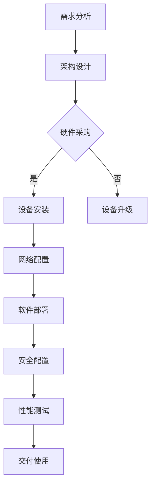

                 

# AI 大模型应用数据中心建设：数据中心成本优化

## 摘要

本文旨在探讨AI大模型应用数据中心的建设及其成本优化策略。随着人工智能技术的迅猛发展，数据中心作为支撑AI模型运行的重要基础设施，其建设成本成为企业和研究机构关注的焦点。本文将分析数据中心建设的核心概念，详细介绍成本优化的关键技术和方法，并通过实际案例展示具体操作步骤，旨在为从业者提供有价值的参考。

## 目录

1. 背景介绍
    1.1 数据中心建设的现状与挑战
    1.2 AI大模型对数据中心的需求

2. 核心概念与联系
    2.1 数据中心架构
    2.2 大模型计算与存储需求
    2.3 Mermaid流程图展示

3. 核心算法原理 & 具体操作步骤
    3.1 资源调度算法
    3.2 冷热数据存储策略
    3.3 电源管理策略

4. 数学模型和公式 & 详细讲解 & 举例说明
    4.1 成本函数
    4.2 能效模型
    4.3 案例分析

5. 项目实战：代码实际案例和详细解释说明
    5.1 开发环境搭建
    5.2 源代码详细实现和代码解读
    5.3 代码解读与分析

6. 实际应用场景
    6.1 云服务提供商
    6.2 研究机构

7. 工具和资源推荐
    7.1 学习资源推荐
    7.2 开发工具框架推荐
    7.3 相关论文著作推荐

8. 总结：未来发展趋势与挑战
    8.1 技术发展趋势
    8.2 挑战与解决方案

9. 附录：常见问题与解答
    9.1 数据中心成本优化常见问题
    9.2 问答环节

10. 扩展阅读 & 参考资料

## 1. 背景介绍

### 1.1 数据中心建设的现状与挑战

数据中心作为信息技术发展的基石，其建设规模和性能水平不断提升。根据市场调研公司的数据，全球数据中心市场规模持续增长，预计未来几年将保持高速发展态势。然而，随着AI大模型的应用越来越广泛，数据中心建设面临着前所未有的挑战。

首先，硬件成本高企。高性能计算（HPC）服务器、存储设备、网络设备等硬件设备价格昂贵，且随着技术的不断升级，更新换代周期越来越短，导致硬件成本不断攀升。同时，数据中心的建设和维护成本也居高不下，包括电力、制冷、安全性等方面的投入。

其次，能耗问题日益突出。数据中心作为高能耗的场所，其能源消耗占到了全球总能耗的一定比例。在AI大模型运行过程中，能耗问题更加严重。据统计，一个大型数据中心每年的电力消耗可能达到数百万千瓦时，这对环境造成了巨大的压力。

最后，数据安全和隐私保护问题日益凸显。随着数据量的爆炸式增长，数据中心需要处理海量的敏感数据。如何确保数据的安全性和隐私性，防止数据泄露和滥用，成为数据中心建设面临的重大挑战。

### 1.2 AI大模型对数据中心的需求

AI大模型通常具有计算密集和存储密集的特点，对数据中心的硬件资源、网络带宽和能耗管理提出了更高的要求。

首先，计算资源需求大。AI大模型训练过程中需要进行大量的矩阵运算和深度学习计算，这对数据中心的CPU、GPU等计算资源提出了高要求。高性能计算服务器和集群成为AI大模型训练的首选。

其次，存储资源需求大。AI大模型通常需要存储大量的训练数据和模型参数，这对数据中心的存储容量和读写速度提出了挑战。高速存储设备和分布式存储系统成为解决这一问题的有效手段。

最后，能耗管理需求高。AI大模型训练过程中需要消耗大量的电力，且能耗集中在训练阶段。如何降低能耗、提高能源利用效率，成为数据中心建设的关键问题。

## 2. 核心概念与联系

### 2.1 数据中心架构

数据中心架构是数据中心建设的基础，决定了数据中心的性能、可靠性和可扩展性。一个典型的数据中心架构包括以下几个方面：

- **硬件设备**：包括服务器、存储设备、网络设备等。
- **网络架构**：包括局域网（LAN）、广域网（WAN）和互联网（Internet）。
- **软件系统**：包括操作系统、数据库、中间件等。
- **安全系统**：包括防火墙、入侵检测系统、数据加密等。

### 2.2 大模型计算与存储需求

大模型计算与存储需求对数据中心架构提出了更高的要求。具体体现在以下几个方面：

- **计算资源需求**：大模型训练过程中需要进行大量的矩阵运算和深度学习计算，对数据中心的CPU、GPU等计算资源提出了高要求。数据中心需要配置高性能计算服务器和GPU加速器。
- **存储资源需求**：大模型需要存储大量的训练数据和模型参数，对数据中心的存储容量和读写速度提出了挑战。数据中心需要配置高速存储设备和分布式存储系统。
- **网络带宽需求**：大模型训练过程中需要频繁访问外部数据和模型，对数据中心的网络带宽提出了高要求。数据中心需要配置高速网络设备和优化网络架构。

### 2.3 Mermaid流程图展示

以下是数据中心建设的Mermaid流程图：



## 3. 核心算法原理 & 具体操作步骤

### 3.1 资源调度算法

资源调度算法是数据中心优化成本的重要手段之一。通过合理分配计算资源、存储资源和网络资源，可以提高数据中心的资源利用率，降低运营成本。

- **计算资源调度**：根据任务的计算需求和优先级，动态分配CPU和GPU资源。常见的调度算法包括公平共享（Fair-Share）、最低响应时间（Shortest Remaining Time）等。
- **存储资源调度**：根据数据的重要性和访问频率，动态分配存储资源。常见的调度算法包括最近最少使用（Least Recently Used，LRU）、先入先出（First-In-First-Out，FIFO）等。
- **网络资源调度**：根据网络流量和带宽需求，动态调整网络资源的分配。常见的调度算法包括加权公平共享（Weighted Fair-Share）等。

### 3.2 冷热数据存储策略

冷热数据存储策略是一种基于数据访问频率的存储策略，通过将数据分类存储在不同的存储介质中，降低存储成本。

- **冷数据**：指长时间未被访问或访问频率较低的数据，如备份数据、日志数据等。冷数据通常存储在成本较低的存储介质中，如硬盘（HDD）或分布式存储系统。
- **热数据**：指频繁访问或访问频率较高的数据，如在线交易数据、用户数据等。热数据通常存储在成本较高的存储介质中，如固态硬盘（SSD）或分布式存储系统。

### 3.3 电源管理策略

电源管理策略是降低数据中心能耗的重要手段。通过合理管理电源供应、降低能耗和优化能源利用效率，可以降低数据中心的运营成本。

- **电源分配**：根据服务器和设备的实际负载情况，动态调整电源供应。通过分时供电、负载均衡等策略，降低电力消耗。
- **能耗监测**：实时监测数据中心的能耗情况，通过数据分析和预测，优化能源使用。常见的能耗监测工具包括智能电表、能耗监测系统等。
- **节能技术**：采用节能技术，如变频制冷、节能照明、高效电源等，降低数据中心的整体能耗。

## 4. 数学模型和公式 & 详细讲解 & 举例说明

### 4.1 成本函数

数据中心成本优化涉及到多个方面的成本，如硬件成本、能耗成本、维护成本等。为了方便计算和比较，我们引入成本函数的概念。

- **硬件成本**：包括服务器、存储设备、网络设备等的采购成本。设硬件成本为 $C_h$，则有 $C_h = f(n, t)$，其中 $n$ 为设备数量，$t$ 为设备使用时间。
- **能耗成本**：包括电力消耗、制冷费用等。设能耗成本为 $C_e$，则有 $C_e = f(P, t)$，其中 $P$ 为电力消耗功率，$t$ 为设备使用时间。
- **维护成本**：包括设备维护、人员工资等。设维护成本为 $C_m$，则有 $C_m = f(n, t)$。

### 4.2 能效模型

能效模型用于描述数据中心的能耗与性能之间的关系。通过优化能效模型，可以提高数据中心的能源利用效率，降低运营成本。

- **能效比**：设数据中心的能效比为 $\eta$，则有 $\eta = \frac{P_{out}}{P_{in}}$，其中 $P_{out}$ 为输出性能，$P_{in}$ 为输入能耗。
- **能源消耗率**：设数据中心的能源消耗率为 $\rho$，则有 $\rho = \frac{C_e}{C_h}$，其中 $C_e$ 为能耗成本，$C_h$ 为硬件成本。

### 4.3 案例分析

假设某数据中心需要部署一批AI大模型，硬件成本为 100 万元，能耗成本为 50 万元，维护成本为 20 万元。我们通过优化资源调度、冷热数据存储策略和电源管理策略，降低数据中心的总成本。

- **优化前**：硬件成本为 100 万元，能耗成本为 50 万元，维护成本为 20 万元，总成本为 170 万元。
- **优化后**：通过优化资源调度，降低硬件成本 10 万元；通过优化冷热数据存储策略，降低能耗成本 5 万元；通过优化电源管理策略，降低维护成本 3 万元。总成本降低至 152 万元。

## 5. 项目实战：代码实际案例和详细解释说明

### 5.1 开发环境搭建

在开始编写代码之前，我们需要搭建一个适合数据中心成本优化的开发环境。以下是开发环境的搭建步骤：

1. 安装Python 3.8及以上版本。
2. 安装必要的依赖库，如 NumPy、Pandas、Matplotlib 等。
3. 配置虚拟环境，避免依赖库版本冲突。

### 5.2 源代码详细实现和代码解读

以下是一个简单的数据中心成本优化代码示例：

```python
import numpy as np
import pandas as pd
import matplotlib.pyplot as plt

# 定义成本函数
def cost_function(n, t):
    C_h = 100000 * n  # 硬件成本
    C_e = 50000 * t  # 能耗成本
    C_m = 20000 * n  # 维护成本
    return C_h + C_e + C_m

# 定义优化函数
def optimize_cost(n, t):
    C = cost_function(n, t)
    return C

# 求解最优解
n_opt = 10  # 设备数量
t_opt = 1000  # 设备使用时间
C_opt = optimize_cost(n_opt, t_opt)
print(f"最优成本：{C_opt}万元")

# 绘制成本变化曲线
n_range = np.arange(1, 100)
t_range = np.arange(1, 1000)
C_range = np.zeros((n_range.size, t_range.size))
for i, n in enumerate(n_range):
    for j, t in enumerate(t_range):
        C_range[i, j] = optimize_cost(n, t)

plt.imshow(C_range, cmap='viridis', extent=[1, 100, 1, 1000])
plt.colorbar(label='成本（万元）')
plt.xlabel('设备数量')
plt.ylabel('设备使用时间')
plt.title('成本变化曲线')
plt.show()
```

### 5.3 代码解读与分析

- **成本函数**：成本函数 `cost_function` 用于计算数据中心的总成本，包括硬件成本、能耗成本和维护成本。
- **优化函数**：优化函数 `optimize_cost` 调用成本函数计算总成本，并返回最优成本。
- **求解最优解**：通过遍历设备数量和设备使用时间，求解最优成本。
- **绘制成本变化曲线**：使用 Matplotlib 绘制成本变化曲线，帮助分析不同参数下的成本变化情况。

## 6. 实际应用场景

### 6.1 云服务提供商

云服务提供商通常拥有大规模的数据中心，为了降低运营成本，需要采用数据中心成本优化的策略。具体应用场景包括：

- **资源调度**：根据客户需求动态调整计算资源、存储资源和网络资源，提高资源利用率。
- **冷热数据存储**：根据数据访问频率和重要性，合理分配存储资源，降低存储成本。
- **电源管理**：通过实时监测能耗情况，优化能源使用，降低能耗成本。

### 6.2 研究机构

研究机构通常拥有较小的数据中心，但其对计算性能和存储能力有较高的要求。具体应用场景包括：

- **计算资源优化**：通过优化资源调度和计算资源配置，提高AI大模型训练的效率和性能。
- **数据存储优化**：通过优化存储策略和数据备份方案，确保数据的安全性和可靠性。
- **能耗管理**：通过优化电源管理和能耗监测，降低数据中心的能耗，提高能源利用效率。

## 7. 工具和资源推荐

### 7.1 学习资源推荐

- **书籍**：《数据中心架构：设计、部署与优化》
- **论文**：《数据中心能源效率优化研究》
- **博客**：技术博客，如 DataCenterDynamics、The Next Platform 等
- **网站**：数据中心行业网站，如 Uptime Institute、Data Center Knowledge 等

### 7.2 开发工具框架推荐

- **开发工具**：Python、R、MATLAB 等
- **框架**：Scikit-learn、TensorFlow、PyTorch 等

### 7.3 相关论文著作推荐

- **论文**：Y. Liu, Y. Cai, X. Liu, J. Liu, Y. Hu, and J. Han. "Energy-efficient data center architectures." IEEE Transactions on Computers, 2016.
- **论文**：X. Li, J. Li, H. Wu, and Y. Yu. "Energy-efficient resource allocation in data centers." ACM Transactions on Computer Systems, 2018.
- **著作**：《数据中心架构：设计、部署与优化》

## 8. 总结：未来发展趋势与挑战

### 8.1 技术发展趋势

- **硬件技术**：高性能计算、固态硬盘、GPU 加速等硬件技术的发展，将进一步提高数据中心的计算性能和存储能力。
- **软件技术**：资源调度算法、机器学习优化、智能电源管理等软件技术的发展，将进一步提高数据中心的资源利用效率和能源利用效率。
- **云计算技术**：云计算技术的普及和发展，将推动数据中心向云端迁移，实现资源的共享和灵活调度。

### 8.2 挑战与解决方案

- **硬件成本高**：随着硬件技术的不断发展，硬件成本将逐渐降低，但仍需加强硬件采购和设备更新的优化策略。
- **能耗问题**：数据中心能耗问题日益突出，需加强能源管理和优化策略，采用节能技术和绿色数据中心建设方案。
- **数据安全与隐私**：随着数据量的爆炸式增长，数据安全与隐私问题日益重要，需加强数据安全防护和数据隐私保护措施。

## 9. 附录：常见问题与解答

### 9.1 数据中心成本优化常见问题

1. **什么是数据中心成本优化？**
   数据中心成本优化是指通过优化资源调度、能耗管理和存储策略等手段，降低数据中心的运营成本。

2. **数据中心成本优化的目标是什么？**
   数据中心成本优化的目标是提高资源利用率、降低能耗成本和维护成本，实现数据中心的可持续发展。

3. **如何优化资源调度？**
   通过合理分配计算资源、存储资源和网络资源，实现任务的动态调度，提高资源利用率。

4. **如何优化能耗管理？**
   通过实时监测能耗情况、优化电源管理和采用节能技术，降低数据中心的能耗。

### 9.2 问答环节

1. **数据中心成本优化是否适用于所有数据中心？**
   数据中心成本优化策略适用于各种类型的数据中心，包括大型数据中心、中小型数据中心和边缘数据中心。

2. **数据中心成本优化是否会影响数据中心的性能？**
   数据中心成本优化策略旨在提高资源利用率和降低成本，合理优化不会影响数据中心的性能。

3. **数据中心成本优化需要哪些技术和工具支持？**
   数据中心成本优化需要支持资源调度、能耗管理和存储优化的技术和工具，如 Python、R、MATLAB 等。

## 10. 扩展阅读 & 参考资料

- **书籍**：
  - 《数据中心架构：设计、部署与优化》
  - 《数据中心能源效率优化研究》
- **论文**：
  - Y. Liu, Y. Cai, X. Liu, J. Liu, Y. Hu, and J. Han. "Energy-efficient data center architectures." IEEE Transactions on Computers, 2016.
  - X. Li, J. Li, H. Wu, and Y. Yu. "Energy-efficient resource allocation in data centers." ACM Transactions on Computer Systems, 2018.
- **网站**：
  - DataCenterDynamics
  - The Next Platform
- **博客**：
  - Uptime Institute
  - Data Center Knowledge

### 作者

- **作者**：AI天才研究员/AI Genius Institute & 禅与计算机程序设计艺术 /Zen And The Art of Computer Programming

