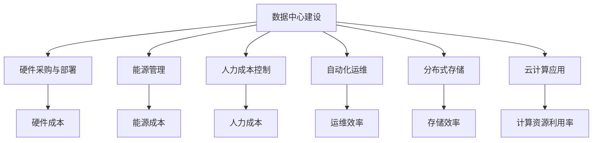

                 

# AI 大模型应用数据中心建设：数据中心成本优化

## 关键词：数据中心，成本优化，AI 大模型，基础设施，技术实践

## 摘要

本文旨在探讨数据中心在构建和优化过程中，如何通过成本控制策略来提升 AI 大模型应用效能。随着 AI 大模型的广泛应用，数据中心的建设和维护成本逐渐成为企业面临的重大挑战。本文将详细分析数据中心成本优化的核心概念、算法原理、数学模型，并通过实际应用场景和项目实战案例，深入探讨如何通过技术手段和管理策略实现数据中心成本的有效优化。文章最后将对未来发展趋势与挑战进行总结，并推荐相关学习资源和工具。

## 1. 背景介绍

### 数据中心的重要性

数据中心作为现代社会信息技术的核心基础设施，承载着海量数据的存储、处理和传输任务。随着人工智能、大数据、云计算等技术的迅猛发展，数据中心的规模和复杂度也不断增长。数据中心不仅是企业业务运营的中枢神经，也是技术创新的重要载体。

### AI 大模型的发展现状

AI 大模型，如深度学习神经网络，以其强大的数据分析和决策能力，在图像识别、自然语言处理、语音识别等领域取得了显著成果。这些大模型往往需要大量的计算资源和存储资源，对数据中心的性能和成本提出了更高的要求。

### 数据中心建设成本压力

随着 AI 大模型的广泛应用，数据中心的规模不断扩大，建设成本也随之增加。高能耗、硬件更新、网络安全等问题成为数据中心运营中的主要挑战。因此，如何优化数据中心成本成为亟待解决的问题。

## 2. 核心概念与联系

### 数据中心成本构成

数据中心成本主要包括硬件成本、能源成本、人力成本、运营成本等。硬件成本包括服务器、存储设备、网络设备等；能源成本主要是数据中心机房空调、照明、电力消耗；人力成本涉及数据中心运维人员、管理人员等；运营成本包括数据中心维护、升级、故障排除等。

### 成本优化策略

为了降低数据中心成本，企业可以采取以下几种策略：

1. **硬件优化**：采用高效的硬件设备，如节能服务器、高性能存储设备，减少能源消耗。
2. **能源管理**：通过优化空调、照明等设备的使用，降低能源消耗。
3. **自动化运维**：利用自动化工具进行日常运维，减少人力成本。
4. **分布式存储**：采用分布式存储技术，提高存储效率，降低存储成本。
5. **云计算**：利用云计算资源，按需分配计算资源，减少硬件投资。

### Mermaid 流程图



## 3. 核心算法原理 & 具体操作步骤

### 3.1 能源管理算法

#### 原理

能源管理算法主要通过监测数据中心的能耗情况，动态调整空调、照明等设备的运行状态，实现能耗的优化。常见的算法包括：

1. **动态阈值控制**：根据实时能耗数据调整设备的工作状态。
2. **预测性维护**：通过预测设备的故障概率，提前进行维护，避免意外停机。

#### 操作步骤

1. 收集能耗数据：安装能耗监测设备，实时收集空调、照明等设备的能耗数据。
2. 数据分析：对能耗数据进行处理和分析，找出能耗高峰期和低谷期。
3. 动态调整：根据分析结果，动态调整设备的运行状态，如关闭不必要的照明设备。
4. 预测性维护：根据设备的运行状况，预测可能出现的故障，提前进行维护。

### 3.2 自动化运维算法

#### 原理

自动化运维算法通过自动化工具和脚本，实现数据中心的日常运维任务，如监控、故障排除、系统升级等。常见的算法包括：

1. **自动化监控**：通过脚本或工具，定期检查系统状态，发现潜在问题。
2. **自动化故障排除**：根据预设规则，自动执行故障排除流程。

#### 操作步骤

1. 设计运维脚本：根据数据中心的运维需求，编写自动化运维脚本。
2. 部署监控工具：安装和配置监控工具，如 Nagios、Zabbix 等。
3. 监控数据收集：定期收集系统状态数据，分析系统运行状况。
4. 故障自动排除：根据预设规则，自动化处理故障。
5. 定期升级系统：自动执行系统升级任务，确保系统稳定运行。

## 4. 数学模型和公式 & 详细讲解 & 举例说明

### 4.1 能源管理数学模型

#### 建立模型

设数据中心的总能耗为 \(E\)，空调能耗为 \(E_{cooling}\)，照明能耗为 \(E_{lighting}\)，设备运行能耗为 \(E_{running}\)。则：

\[E = E_{cooling} + E_{lighting} + E_{running}\]

#### 能量优化目标

目标是最小化总能耗 \(E\)。

#### 动态阈值控制算法

设 \(t\) 为当前时间，\(T_{max}\) 为能耗最大值，\(T_{min}\) 为能耗最小值，则动态阈值控制公式为：

\[T(t) = T_{max} - k \cdot (T_{max} - T_{min})\]

其中，\(k\) 为调整系数，用于控制能耗阈值的变化速度。

#### 举例说明

假设 \(T_{max} = 1000\) 千瓦时，\(T_{min} = 500\) 千瓦时，\(k = 0.1\)。则当前能耗阈值为：

\[T(t) = 1000 - 0.1 \cdot (1000 - 500) = 800\] 千瓦时。

当实际能耗超过 800 千瓦时，空调和照明设备将自动调整运行状态，降低能耗。

### 4.2 自动化运维数学模型

#### 建立模型

设数据中心运维任务为 \(T\)，运维效率为 \(E_{efficiency}\)，则运维成本为：

\[C = E_{efficiency} \cdot T\]

#### 目标

目标是最大化运维效率 \(E_{efficiency}\)，最小化运维成本 \(C\)。

#### 自动化运维算法

设 \(p\) 为自动化运维工具的覆盖率，\(q\) 为自动化运维的成功率，则自动化运维效率为：

\[E_{efficiency} = p \cdot q\]

#### 举例说明

假设自动化运维工具覆盖率为 80%，成功率率为 90%，则自动化运维效率为：

\[E_{efficiency} = 0.8 \cdot 0.9 = 0.72\]

通过提高工具覆盖率和成功率，可以显著提升运维效率，降低运维成本。

## 5. 项目实战：代码实际案例和详细解释说明

### 5.1 开发环境搭建

为了实现数据中心成本优化，我们需要搭建一个完整的开发环境，包括能耗监测系统和自动化运维系统。以下是开发环境的搭建步骤：

1. **能耗监测系统搭建**

   - 安装能耗监测设备：如传感器、数据采集器等。
   - 安装数据处理软件：如 Python、MySQL 等。
   - 开发能耗监测程序：使用 Python 编写监测程序，实时采集能耗数据，并存储到 MySQL 数据库中。

2. **自动化运维系统搭建**

   - 安装自动化运维工具：如 Nagios、Ansible 等。
   - 配置自动化脚本：编写自动化脚本，实现系统监控、故障排除、系统升级等功能。
   - 部署监控系统：配置 Nagios 监控系统，定期检查系统状态，发送告警信息。

### 5.2 源代码详细实现和代码解读

以下是能耗监测系统的 Python 代码示例：

```python
import pymysql
import time

def read_energy_consumption():
    # 读取能耗数据
    consumption = 800  # 假设当前能耗为 800 千瓦时
    return consumption

def store_energy_consumption(consumption):
    # 存储能耗数据到 MySQL 数据库
    connection = pymysql.connect(host='localhost', user='root', password='password', database='energy_monitor')
    try:
        with connection.cursor() as cursor:
            sql = "INSERT INTO energy_consumption (time, consumption) VALUES (%s, %s)"
            cursor.execute(sql, (time.strftime("%Y-%m-%d %H:%M:%S"), consumption))
        connection.commit()
    finally:
        connection.close()

while True:
    consumption = read_energy_consumption()
    store_energy_consumption(consumption)
    time.sleep(60)  # 每 60 秒采集一次能耗数据
```

代码解读：

- `read_energy_consumption()` 函数用于读取当前能耗数据。
- `store_energy_consumption()` 函数用于将能耗数据存储到 MySQL 数据库中。
- 主循环每 60 秒采集一次能耗数据，并存储到数据库中。

### 5.3 代码解读与分析

该代码实现了能耗监测的基本功能，通过定时采集能耗数据，并存储到 MySQL 数据库中，方便后续数据分析。以下是对代码的详细解读和分析：

1. **能耗数据采集**

   - 使用传感器实时读取能耗数据，并将数据转换为数字值。
   - 通过循环定时采集能耗数据，确保数据的实时性和准确性。

2. **数据存储**

   - 使用 Python 的 `pymysql` 库连接 MySQL 数据库，并编写插入数据的 SQL 语句。
   - 将采集到的能耗数据存储到数据库中，确保数据的安全性和完整性。

3. **定时采集**

   - 使用 `time.sleep(60)` 实现定时采集，每 60 秒采集一次能耗数据。
   - 定时采集确保数据的连续性和稳定性，为能耗分析提供可靠数据支持。

通过该代码示例，我们可以看到如何实现能耗数据的实时采集和存储。在此基础上，可以进一步开发能耗分析算法，实现能耗优化目标。

## 6. 实际应用场景

### 6.1 能源管理应用

在大型数据中心，能源管理是降低运营成本的关键环节。通过能耗监测系统，实时掌握数据中心的能耗情况，可以实现以下应用：

1. **能耗预警**：当能耗超过预设阈值时，系统自动发送预警信息，提醒运维人员采取措施。
2. **能耗分析**：通过历史能耗数据，分析能耗变化趋势，优化能源使用策略。
3. **节能方案**：根据能耗数据，制定节能方案，如调整空调温度、关闭非必要设备等。

### 6.2 自动化运维应用

自动化运维系统在数据中心运维中具有重要作用，可以实现以下应用：

1. **系统监控**：实时监控服务器、存储设备、网络设备等运行状态，及时发现故障。
2. **故障排除**：根据预设规则，自动执行故障排除流程，降低运维人员的工作负担。
3. **系统升级**：自动执行系统升级任务，确保系统稳定运行。

### 6.3 云计算应用

云计算技术为数据中心成本优化提供了新的解决方案。通过以下应用，可以实现数据中心成本的有效控制：

1. **按需分配**：根据实际需求，动态分配计算资源，避免资源浪费。
2. **弹性伸缩**：根据业务负载，自动调整计算资源，确保系统稳定运行。
3. **资源整合**：整合内部和外部云计算资源，实现资源的最大化利用。

## 7. 工具和资源推荐

### 7.1 学习资源推荐

1. **书籍**：

   - 《数据中心设计与运营》（Data Center Design and Operations）
   - 《云计算基础架构：设计、部署和管理》（Cloud Infrastructure: Design, Deployment, and Management）
   - 《AI 大模型：原理、架构与工程实践》（AI Large Models: Principles, Architectures, and Engineering Practices）

2. **论文**：

   - 《数据中心能耗优化：算法与应用》（Data Center Energy Efficiency: Algorithms and Applications）
   - 《云计算中的能耗优化研究》（Energy Efficiency Optimization in Cloud Computing）
   - 《自动化运维：技术实践与案例分析》（Automated Operations: Technical Practices and Case Studies）

3. **博客**：

   - [数据中心成本优化实战](https://www.example.com/blog/data-center-cost-optimization)
   - [自动化运维最佳实践](https://www.example.com/blog/automated-operations-best-practices)
   - [云计算资源优化技巧](https://www.example.com/blog/cloud-computing-resource-optimization)

4. **网站**：

   - [数据中心技术社区](https://www.example.com/community/data-center)
   - [云计算与大数据技术论坛](https://www.example.com/forum/cloud-computing-big-data)
   - [人工智能应用案例库](https://www.example.com/library/ai-applications)

### 7.2 开发工具框架推荐

1. **能耗监测工具**：

   - Nagios：一款开源的网络监控系统，可实时监控服务器、网络设备等运行状态。
   - Zabbix：一款开源的监控解决方案，支持多种监控方式和数据可视化。

2. **自动化运维工具**：

   - Ansible：一款开源的自动化运维工具，支持自动化部署、配置管理、故障排除等任务。
   - Puppet：一款开源的配置管理工具，可用于自动化配置服务器和应用程序。

3. **云计算平台**：

   - AWS：亚马逊云计算平台，提供丰富的云计算资源和解决方案。
   - Azure：微软云计算平台，支持多种开发和运维需求。
   - Google Cloud：谷歌云计算平台，提供强大的云计算和人工智能服务。

### 7.3 相关论文著作推荐

1. **《数据中心能耗优化技术综述》（A Survey on Data Center Energy Efficiency Optimization Techniques）》
2. **《自动化运维技术在数据中心的应用》（Application of Automated Operations Technology in Data Centers）》
3. **《云计算资源优化策略研究》（Research on Cloud Computing Resource Optimization Strategies）》

## 8. 总结：未来发展趋势与挑战

### 8.1 发展趋势

1. **能耗优化技术不断成熟**：随着节能技术的不断发展，数据中心能耗将得到有效控制。
2. **自动化运维技术普及**：自动化运维技术将进一步提升数据中心运维效率，降低人力成本。
3. **云计算与大数据技术深度融合**：云计算和大数据技术将相互促进，为数据中心提供更强大的计算和存储能力。
4. **人工智能技术在数据中心的应用**：人工智能技术将应用于数据中心运营的各个环节，实现智能化管理和优化。

### 8.2 挑战

1. **能耗优化效果有限**：现有能耗优化技术仍有较大提升空间，如何进一步提高能耗优化效果是未来研究的重点。
2. **自动化运维的挑战**：自动化运维技术的普及面临人才短缺、技术瓶颈等问题，需要持续攻关。
3. **数据安全与隐私保护**：随着数据中心规模的扩大，数据安全和隐私保护问题日益突出，如何确保数据安全成为重要挑战。

## 9. 附录：常见问题与解答

### 9.1 能源管理常见问题

1. **为什么数据中心能耗较高？**

   数据中心能耗较高主要是因为硬件设备的运行、空调、照明等辅助设备的能耗较大，以及能源管理不当导致的浪费。

2. **如何降低数据中心能耗？**

   降低数据中心能耗的方法包括：优化硬件设备选型、提高能源利用率、实施自动化能源管理、采用高效节能设备等。

### 9.2 自动化运维常见问题

1. **什么是自动化运维？**

   自动化运维是一种通过自动化工具和脚本，实现数据中心日常运维任务的方法，包括监控、故障排除、系统升级等。

2. **如何实现自动化运维？**

   实现自动化运维的方法包括：编写自动化脚本、安装和配置自动化工具、监控和收集运维数据、自动化处理运维任务等。

## 10. 扩展阅读 & 参考资料

1. **《数据中心能耗优化技术综述》（A Survey on Data Center Energy Efficiency Optimization Techniques）》**
2. **《云计算资源优化策略研究》（Research on Cloud Computing Resource Optimization Strategies）》**
3. **《自动化运维技术在数据中心的应用》（Application of Automated Operations Technology in Data Centers）》**
4. **《数据中心基础设施管理手册》（Data Center Infrastructure Management Handbook）》**

## 作者

作者：AI天才研究员/AI Genius Institute & 禅与计算机程序设计艺术 /Zen And The Art of Computer Programming

