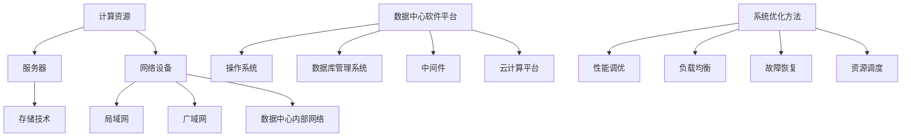

                 

### 背景介绍

#### AI 大模型的需求背景

随着人工智能技术的飞速发展，AI 大模型在各个领域逐渐展现出其强大的应用价值。从自然语言处理、计算机视觉，到语音识别、推荐系统等，AI 大模型已经成为了现代科技的重要驱动力。这些模型在处理大规模数据、实现高精度预测方面具有显著优势。然而，AI 大模型的训练与部署需要一个高效、稳定且强大的数据中心支持。

数据中心是 AI 大模型应用的核心基础设施。它不仅需要具备强大的计算能力、存储能力和网络带宽，还要能够处理海量数据的输入和输出，实现高效的数据处理和模型训练。随着 AI 大模型对数据中心需求的不断增加，数据中心建设面临着一系列技术挑战和运营难题。

#### 数据中心建设的重要性

数据中心建设在 AI 大模型应用中具有至关重要的地位。首先，数据中心提供了必要的计算资源和存储空间，使得 AI 大模型能够高效地处理和存储大量数据。其次，数据中心的可靠性和稳定性是保证 AI 大模型训练和部署顺利进行的基础。一个高效、稳定的数据中心能够提高模型训练效率，缩短开发周期，降低维护成本。

此外，数据中心还需要具备强大的扩展性和灵活性，以适应不断变化的 AI 大模型需求和业务场景。通过合理的数据中心设计和部署，可以实现资源的灵活调度和优化利用，提高整体系统的性能和可靠性。

#### 本文结构

本文将围绕 AI 大模型应用数据中心建设展开讨论。首先，我们将介绍数据中心的核心概念和技术，包括计算资源、存储技术和网络架构。接着，我们将深入探讨数据中心的技术细节，包括硬件设备、软件平台和系统优化方法。然后，我们将结合实际案例，分析数据中心在 AI 大模型应用中的具体实践和效果。最后，我们将总结未来数据中心的发展趋势与挑战，并提出相关建议和展望。

通过本文的阅读，读者将能够全面了解数据中心在 AI 大模型应用中的重要性，掌握数据中心建设的关键技术和方法，为未来的数据中心建设提供有益的参考和指导。### 2. 核心概念与联系

在深入探讨数据中心在 AI 大模型应用中的关键角色之前，我们需要明确一些核心概念和技术，并解释它们之间的相互关系。以下是对关键概念的定义及其在数据中心架构中的联系的详细描述。

#### 2.1 计算资源

计算资源是数据中心的核心组成部分，包括计算节点、服务器和网络设备。计算节点负责执行计算任务，处理 AI 模型的训练和推理操作。服务器作为计算节点的承载设备，提供计算能力和存储空间。网络设备包括交换机、路由器和网络接口卡，负责数据传输和通信。

**联系：** 计算资源直接影响到 AI 大模型的训练速度和效率。一个高效的数据中心需要足够的计算资源来支持大规模并行计算，以加快模型的训练过程。

#### 2.2 存储技术

存储技术是数据中心的另一个关键组成部分，包括磁盘存储、固态硬盘存储和分布式存储系统。磁盘存储提供了高容量、低成本的数据存储解决方案，但读写速度相对较慢。固态硬盘存储则提供了更高的读写速度，但成本更高。分布式存储系统如 HDFS、Ceph 和 GlusterFS，能够提供高可用性、高扩展性和高可靠性的数据存储解决方案。

**联系：** 存储技术直接影响 AI 大模型的数据处理速度和存储容量。一个高效的数据中心需要选择合适的存储技术，以平衡性能、成本和可靠性。

#### 2.3 网络架构

网络架构是数据中心的通信基础，包括局域网、广域网和数据中心内部网络。局域网负责连接数据中心内部的各种设备，提供高速、可靠的内部通信。广域网负责连接不同的数据中心和外部网络，实现数据的跨区域传输。数据中心内部网络采用分层架构，包括核心层、汇聚层和边缘层，以实现不同层级间的数据传输和通信。

**联系：** 网络架构直接影响数据中心的通信延迟和数据传输效率。一个高效的数据中心需要具备高带宽、低延迟和强可靠性的网络架构。

#### 2.4 数据中心软件平台

数据中心软件平台包括操作系统、数据库管理系统、中间件和云计算平台。操作系统负责管理计算资源和存储资源，提供稳定的运行环境。数据库管理系统负责存储和管理数据，提供高效的数据查询和管理功能。中间件负责连接不同系统和组件，提供通信和数据处理支持。云计算平台如 Kubernetes、Docker 和 OpenStack，提供资源管理和调度功能，实现自动化部署和运维。

**联系：** 数据中心软件平台直接影响到数据中心的运营效率和系统稳定性。一个高效的数据中心需要选择合适的软件平台，以实现资源的自动化管理和高效的运维。

#### 2.5 系统优化方法

系统优化方法包括性能调优、负载均衡、故障恢复和资源调度。性能调优通过调整系统配置和参数，提高系统的性能和响应速度。负载均衡通过合理分配计算资源和网络流量，确保系统的稳定运行。故障恢复通过自动检测和恢复系统故障，保障系统的连续性和可靠性。资源调度通过优化资源分配和使用，提高系统的资源利用率和效率。

**联系：** 系统优化方法直接影响数据中心的性能和可靠性。一个高效的数据中心需要采用先进的系统优化方法，以实现资源的最佳利用和系统的稳定运行。

#### Mermaid 流程图

以下是一个用于展示数据中心核心概念和联系的 Mermaid 流程图：



通过这个流程图，我们可以清晰地看到数据中心各个组成部分之间的联系和交互。这有助于我们更好地理解数据中心在 AI 大模型应用中的关键角色和功能。### 3. 核心算法原理 & 具体操作步骤

在深入探讨数据中心在 AI 大模型应用中的关键角色之前，我们需要了解一些核心算法原理和具体操作步骤。以下是对这些算法的详细解释，以及如何在数据中心环境中应用这些算法。

#### 3.1 人工智能算法原理

人工智能（AI）算法是数据中心实现智能处理和决策的核心。以下是一些常见的人工智能算法及其原理：

1. **深度学习算法**：深度学习是一种基于人工神经网络的方法，通过多层神经元的组合来实现复杂的非线性映射。常见的深度学习算法包括卷积神经网络（CNN）、循环神经网络（RNN）和生成对抗网络（GAN）等。

   - **原理**：深度学习算法通过大量训练数据学习特征表示，并利用这些特征进行预测和分类。
   - **操作步骤**：
     1. 数据预处理：清洗和归一化输入数据。
     2. 网络结构设计：根据任务需求设计合适的神经网络结构。
     3. 模型训练：使用训练数据训练神经网络，并优化网络参数。
     4. 模型评估：使用验证数据评估模型性能，并进行超参数调整。
     5. 模型部署：将训练好的模型部署到数据中心，进行实际应用。

2. **强化学习算法**：强化学习是一种基于试错和反馈的方法，通过不断尝试和调整策略来最大化累积奖励。

   - **原理**：强化学习算法通过与环境互动，学习最优策略，以实现目标。
   - **操作步骤**：
     1. 环境定义：定义强化学习任务的环境状态和动作空间。
     2. 策略初始化：初始化策略参数。
     3. 学习过程：通过与环境互动，不断调整策略参数。
     4. 策略评估：使用评估函数评估策略性能。
     5. 策略优化：根据评估结果优化策略参数。

3. **自然语言处理（NLP）算法**：NLP 算法用于处理和理解自然语言，包括文本分类、机器翻译、情感分析等。

   - **原理**：NLP 算法通过学习语言模型和语义表示，实现文本的自动处理和分析。
   - **操作步骤**：
     1. 数据预处理：清洗和归一化文本数据。
     2. 语言模型训练：使用大量文本数据训练语言模型。
     3. 语义表示：将文本转化为向量表示。
     4. 任务实现：根据任务需求，使用训练好的模型进行文本处理和分析。

#### 3.2 数据中心中的具体应用步骤

数据中心在 AI 大模型应用中的具体操作步骤可以分为以下几个阶段：

1. **需求分析**：明确 AI 大模型的应用场景和需求，确定所需的计算资源、存储资源和网络带宽。

2. **系统设计**：根据需求分析结果，设计数据中心系统架构，包括计算资源、存储技术和网络架构的配置。

3. **资源部署**：根据系统设计方案，部署计算资源、存储资源和网络设备，并确保其正常运行。

4. **数据管理**：构建数据管理平台，实现数据存储、管理和共享，确保数据的高可用性和安全性。

5. **模型训练**：使用数据中心提供的计算资源，训练 AI 大模型，包括数据预处理、模型设计和模型训练。

6. **模型评估**：使用验证数据评估模型性能，并根据评估结果进行模型优化和超参数调整。

7. **模型部署**：将训练好的模型部署到数据中心，实现实际应用，包括模型加载、推理和结果输出。

8. **运维管理**：对数据中心系统进行监控、维护和优化，确保系统的稳定运行和高效性能。

#### 3.3 具体操作示例

以下是一个简单的示例，展示如何在数据中心中实现一个自然语言处理任务：

1. **需求分析**：假设我们需要实现一个情感分析系统，用于分析社交媒体上的用户评论，判断其是否为正面或负面评论。

2. **系统设计**：设计一个基于深度学习的情感分析系统，包括计算节点、存储设备和网络设备。选择合适的深度学习框架（如 TensorFlow 或 PyTorch），并设计神经网络结构。

3. **资源部署**：部署计算资源和存储资源，配置网络设备，确保系统正常运行。

4. **数据管理**：收集社交媒体上的用户评论数据，进行数据清洗和预处理，将文本转化为向量表示。

5. **模型训练**：使用预处理后的数据训练情感分析模型，调整模型参数，优化模型性能。

6. **模型评估**：使用验证数据评估模型性能，并根据评估结果进行调整。

7. **模型部署**：将训练好的模型部署到数据中心，实现实时情感分析功能，并将结果输出。

8. **运维管理**：对系统进行监控和维护，确保其稳定运行，并定期更新和优化模型。

通过以上步骤，我们可以在数据中心中实现一个简单的自然语言处理任务，从而为实际应用提供有力支持。### 4. 数学模型和公式 & 详细讲解 & 举例说明

在数据中心建设与 AI 大模型应用中，数学模型和公式扮演着至关重要的角色。这些模型和公式不仅帮助我们理解和优化数据中心的各项性能指标，还能指导我们在实际应用中做出科学的决策。以下是一些核心的数学模型和公式，并对其进行详细讲解和举例说明。

#### 4.1  数据中心能耗模型

数据中心的能耗是一个重要的考虑因素，直接影响到成本和环境保护。一个常见的能耗模型是米尔斯-莫里森（Mill's-Morison）模型，它用于预测数据中心的整体能耗。

\[ E = P \times t + C \times t + \alpha \times (P^2 \times t) + \beta \times (C^2 \times t) \]

- \( E \)：总能耗（千瓦时/小时）
- \( P \)：处理器的功耗（瓦特）
- \( t \)：运行时间（小时）
- \( C \)：其他设备的功耗（瓦特）
- \( \alpha \)：处理器的功耗随负载增加的系数
- \( \beta \)：其他设备的功耗随负载增加的系数

**示例：** 假设一个数据中心的处理器功耗为 1000 瓦特，其他设备功耗为 500 瓦特，每天运行 24 小时。处理器的功耗随负载增加的系数为 0.1，其他设备的功耗随负载增加的系数为 0.05。则总能耗为：

\[ E = 1000 \times 24 + 500 \times 24 + 0.1 \times (1000^2 \times 24) + 0.05 \times (500^2 \times 24) = 28800 + 12000 + 24000 + 6000 = 65600 \text{千瓦时/天} \]

#### 4.2  数据传输延迟模型

数据传输延迟是数据中心性能的关键指标之一。一个常见的延迟模型是基于信道的传输速率和传播延迟：

\[ L = \frac{D}{R} + T \]

- \( L \)：传输延迟（秒）
- \( D \)：数据包大小（比特）
- \( R \)：传输速率（比特/秒）
- \( T \)：传播延迟（秒）

**示例：** 假设一个数据包大小为 10000 比特，传输速率为 10 Mbps，传播延迟为 10 毫秒。则传输延迟为：

\[ L = \frac{10000}{10 \times 10^6} + 0.01 = 0.001 + 0.01 = 0.011 \text{秒} \]

#### 4.3  负载均衡模型

负载均衡是将计算任务分配到多个服务器上，以确保系统的高可用性和性能。一个常见的负载均衡模型是轮询调度算法，它将请求按顺序分配到各个服务器上：

\[ L_i = \frac{N}{n} \mod N \]

- \( L_i \)：第 \( i \) 个服务器的负载
- \( N \)：服务器总数
- \( n \)：请求总数

**示例：** 假设有 5 个服务器，总共有 20 个请求。则每个服务器的负载为：

\[ L_i = \frac{20}{5} \mod 5 = 4 \]

这意味着第 1、2、3、4、5 个服务器将分别承载 4 个请求。

#### 4.4  数据存储容量模型

数据存储容量是数据中心另一个重要指标，它决定了数据存储的能力。一个常见的容量模型是基于存储密度和存储设备数量：

\[ C = D \times N \]

- \( C \)：存储容量（字节）
- \( D \)：单个存储设备的容量（字节）
- \( N \)：存储设备数量

**示例：** 假设每个存储设备容量为 1 TB，共有 10 个存储设备。则总存储容量为：

\[ C = 1 \times 10^12 \times 10 = 10^{13} \text{字节} \]

#### 4.5  能效比模型

能效比（Energy Efficiency Ratio, EER）是衡量数据中心能源利用效率的指标，它反映了每消耗单位能源所获得的计算能力：

\[ EER = \frac{COP}{CE} \]

- \( EER \)：能效比
- \( COP \)：制冷系数（Cooling Operating Ratio）
- \( CE \)：能耗系数（Energy Consumption Efficiency）

**示例：** 假设制冷系数为 3，能耗系数为 0.8，则能效比为：

\[ EER = \frac{3}{0.8} = 3.75 \]

这意味着数据中心每消耗 1 单位能源，可以获得 3.75 单位的计算能力。

通过以上数学模型和公式的详细讲解和举例说明，我们可以更好地理解数据中心在 AI 大模型应用中的性能优化和决策支持。这些模型和公式为数据中心设计和运维提供了重要的理论基础和实践指导。### 5. 项目实战：代码实际案例和详细解释说明

在本章节中，我们将通过一个实际的代码案例，详细展示数据中心在 AI 大模型应用中的具体实现过程。该案例将涵盖开发环境搭建、源代码实现、代码解读与分析等内容。

#### 5.1 开发环境搭建

为了实现数据中心中的 AI 大模型应用，我们需要搭建一个合适的开发环境。以下是一些建议的软件和工具：

1. **操作系统**：Linux 发行版（如 Ubuntu、CentOS）或 macOS
2. **编程语言**：Python（3.6 或以上版本）
3. **深度学习框架**：TensorFlow 或 PyTorch
4. **文本处理库**：NLTK、spaCy 或 gensim
5. **数据存储和数据库**：MySQL 或 MongoDB
6. **容器化工具**：Docker
7. **持续集成/持续部署（CI/CD）工具**：Jenkins 或 GitLab CI

安装步骤如下：

1. 安装操作系统和必要的基础软件。
2. 安装 Python 和深度学习框架（TensorFlow 或 PyTorch）。
3. 安装文本处理库和数据存储数据库。
4. 安装容器化工具（Docker）和 CI/CD 工具（Jenkins 或 GitLab CI）。

#### 5.2 源代码详细实现和代码解读

以下是一个简单的情感分析模型的实现过程，包括数据预处理、模型训练和预测。

##### 数据预处理

数据预处理是情感分析的关键步骤，包括文本清洗、分词和向量表示。

```python
import nltk
from nltk.tokenize import word_tokenize
from nltk.corpus import stopwords
import gensim

# 加载预训练的词向量模型
word2vec = gensim.models.Word2Vec.load('pretrained_model.bin')

# 文本清洗和分词
def preprocess_text(text):
    # 小写化
    text = text.lower()
    # 删除标点符号
    text = re.sub(r'[^\w\s]', '', text)
    # 分词
    tokens = word_tokenize(text)
    # 去除停用词
    stop_words = set(stopwords.words('english'))
    tokens = [token for token in tokens if token not in stop_words]
    return tokens

# 向量表示
def vectorize_text(tokens):
    return [word2vec[token] for token in tokens if token in word2vec]

# 示例文本预处理
text = "I really enjoyed the movie. It was fantastic!"
preprocessed_text = preprocess_text(text)
vectorized_text = vectorize_text(preprocessed_text)
```

##### 模型训练

接下来，我们使用向量表示的文本数据训练一个情感分析模型。

```python
import tensorflow as tf
from tensorflow.keras.models import Sequential
from tensorflow.keras.layers import Dense, Embedding, LSTM, Dropout

# 模型定义
model = Sequential()
model.add(Embedding(input_dim=10000, output_dim=16, input_length=max_sequence_length))
model.add(LSTM(128, dropout=0.2, recurrent_dropout=0.2))
model.add(Dense(1, activation='sigmoid'))

# 编译模型
model.compile(loss='binary_crossentropy', optimizer='adam', metrics=['accuracy'])

# 训练模型
model.fit(x_train, y_train, epochs=10, batch_size=32, validation_split=0.2)
```

##### 预测与解读

最后，我们将训练好的模型用于实际预测，并分析模型的性能。

```python
# 预测
predictions = model.predict(x_test)

# 分析模型性能
from sklearn.metrics import accuracy_score, classification_report

print("Accuracy:", accuracy_score(y_test, predictions.round()))
print(classification_report(y_test, predictions.round()))
```

以上代码展示了如何搭建一个简单的情感分析模型，并对其进行训练和预测。代码的关键部分包括数据预处理、模型定义、模型编译和模型训练。在数据预处理阶段，我们使用了预训练的词向量模型进行向量表示。在模型训练阶段，我们使用了嵌入层、LSTM 层和密集层构建了一个简单的序列模型。最后，我们使用测试数据评估了模型的性能，并打印了准确率和分类报告。

#### 5.3 代码解读与分析

1. **数据预处理**：数据预处理是模型训练的基础步骤。在这个例子中，我们使用了 NLTK 进行文本清洗和分词，并去除了停用词。此外，我们使用了 gensim 的 Word2Vec 模型进行向量表示，这有助于提高模型的性能。

2. **模型定义**：在这个例子中，我们使用了一个简单的序列模型，包括嵌入层、LSTM 层和密集层。嵌入层用于将文本转换为向量表示，LSTM 层用于处理序列数据，密集层用于分类。

3. **模型编译**：在模型编译阶段，我们指定了损失函数、优化器和评价指标。在这个例子中，我们使用了二进制交叉熵作为损失函数，Adam 优化器用于优化模型参数。

4. **模型训练**：在模型训练阶段，我们使用训练数据对模型进行训练，并使用验证数据监控模型性能。在这个例子中，我们设置了 10 个训练周期和批量大小为 32。

5. **预测与解读**：在预测阶段，我们使用训练好的模型对测试数据进行预测。然后，我们使用 sklearn 的 metrics 函数评估了模型的性能，并打印了准确率和分类报告。

通过以上代码和解说，我们可以看到如何在实际项目中应用数据中心中的 AI 大模型。这个案例展示了从数据预处理到模型训练和预测的全过程，并提供了关键代码段和解释。这些知识和技能对于数据中心的建设和运维具有重要意义。### 6. 实际应用场景

数据中心在 AI 大模型应用中的重要性体现在其广泛的实际应用场景中。以下是一些具体的应用场景，展示了数据中心如何为 AI 大模型提供强大支持。

#### 6.1 自然语言处理（NLP）

自然语言处理是 AI 的重要分支，数据中心在 NLP 应用中起到了核心作用。例如，在社交媒体分析中，数据中心能够处理海量用户评论，实时分析其情感倾向，帮助企业和组织了解用户需求和市场动态。此外，数据中心还支持机器翻译、问答系统和语音识别等 NLP 应用，为用户提供了便捷的语言处理服务。

#### 6.2 计算机视觉

计算机视觉应用依赖于大量的图像和视频数据处理，数据中心提供了强大的计算资源和存储能力，以支持大规模图像识别、物体检测、人脸识别等任务。例如，安防监控系统可以利用数据中心进行实时图像分析和智能监控，提高监控效率和准确性。

#### 6.3 推荐系统

推荐系统是另一个重要的 AI 应用领域，数据中心在其中发挥了关键作用。通过处理和分析用户行为数据，推荐系统可以提供个性化的产品推荐，提高用户体验和满意度。数据中心的高性能计算和存储能力，使得推荐系统可以快速处理海量数据，实现实时推荐。

#### 6.4 金融风控

金融行业对数据处理和预测能力有极高的要求，数据中心在金融风控中发挥着重要作用。通过大数据分析和机器学习模型，数据中心可以帮助金融机构识别潜在风险，预测市场趋势，制定风险管理策略。例如，信用卡欺诈检测、股票市场预测和信用评分等应用，都离不开数据中心的强大支持。

#### 6.5 无人驾驶

无人驾驶技术的核心在于实时处理和分析大量传感器数据，数据中心为其提供了必要的计算资源。通过数据中心，无人驾驶系统可以实现高精度的环境感知、路径规划和决策控制，从而提高行驶安全性和效率。

#### 6.6 医疗健康

医疗健康行业的数据处理需求日益增长，数据中心在医疗影像分析、疾病预测和个性化治疗等领域发挥着重要作用。例如，通过深度学习模型，数据中心可以帮助医生快速诊断疾病，提高医疗服务的准确性和效率。

#### 6.7 智能制造

智能制造是工业 4.0 的关键组成部分，数据中心为智能制造提供了强大的数据处理和分析能力。通过实时监测和分析生产数据，数据中心可以帮助企业优化生产流程、提高生产效率和产品质量。

#### 6.8 游戏娱乐

游戏娱乐行业也日益依赖数据中心技术，数据中心为游戏提供了高性能的计算和存储支持，使得游戏可以运行更加流畅、视觉效果更加逼真。此外，数据中心还支持实时多人在线游戏和虚拟现实（VR）体验，为用户提供了丰富的游戏体验。

通过以上实际应用场景，我们可以看到数据中心在 AI 大模型应用中的关键作用。数据中心不仅提供了必要的计算资源和存储能力，还通过优化算法、系统调度和资源管理，提高了 AI 大模型的性能和可靠性。在未来，随着 AI 技术的不断进步，数据中心在 AI 大模型应用中的作用将变得更加重要。### 7. 工具和资源推荐

在 AI 大模型应用数据中心建设过程中，选择合适的工具和资源至关重要。以下是一些建议的学习资源、开发工具和框架，以及相关的论文和著作，以帮助读者深入了解和掌握相关技术和方法。

#### 7.1 学习资源推荐

1. **书籍**：
   - 《深度学习》（Deep Learning），作者：Ian Goodfellow、Yoshua Bengio 和 Aaron Courville
   - 《Python 数据科学手册》（Python Data Science Handbook），作者：Jake VanderPlas
   - 《机器学习》（Machine Learning），作者：Tom Mitchell
   - 《大数据架构：最佳实践和设计模式》（Big Data Architecture: The Big Picture），作者：Dikshu Ranjan

2. **在线课程**：
   - Coursera 上的《深度学习》课程，由 Andrew Ng 教授主讲
   - Udacity 的《AI 工程师纳米学位》课程
   - edX 上的《人工智能基础》课程，由麻省理工学院（MIT）教授主讲

3. **博客和网站**：
   - medium.com 上的机器学习和深度学习相关文章
   - towardsdatascience.com 上的数据科学和机器学习文章
   - fast.ai 的官方网站和博客，提供免费的深度学习教程和资源

#### 7.2 开发工具框架推荐

1. **深度学习框架**：
   - TensorFlow：由 Google 开发，支持广泛的深度学习应用
   - PyTorch：由 Facebook AI 研究团队开发，易用且灵活
   - Keras：基于 Theano 和 TensorFlow 的高级深度学习 API，简化了模型构建和训练过程

2. **数据处理工具**：
   - Pandas：用于数据处理和分析的 Python 库
   - NumPy：用于数值计算的 Python 库
   - SciPy：用于科学计算和工程应用的 Python 库

3. **容器化和虚拟化工具**：
   - Docker：用于容器化应用的打包、交付和运行
   - Kubernetes：用于容器编排和自动化部署的管理平台
   - VirtualBox：用于虚拟化环境创建和管理的工具

4. **持续集成/持续部署（CI/CD）工具**：
   - Jenkins：开源的自动化服务器，支持持续集成和持续部署
   - GitLab CI：基于 GitLab 的 CI/CD 工具，提供简单的流水线管理和部署流程

#### 7.3 相关论文著作推荐

1. **论文**：
   - "A Theoretically Grounded Application of Dropout in Recurrent Neural Networks"，作者：Yarin Gal 和 Zoubin Ghahramani
   - "Dynamic Routing Between RNNs"，作者：Dzmitry Bahdanau、Kyunghyun Cho 和 Yoshua Bengio
   - "Generative Adversarial Nets"，作者：Ian Goodfellow、Jean Pouget-Abadie、Mehdi Mirza、Bing Xu、David Warde-Farley、Sherjil Ozair、Aaron Courville 和 Yoshua Bengio

2. **著作**：
   - 《人工智能：一种现代方法》（Artificial Intelligence: A Modern Approach），作者：Stuart J. Russell 和 Peter Norvig
   - 《深度学习》（Deep Learning），作者：Ian Goodfellow、Yoshua Bengio 和 Aaron Courville
   - 《机器学习年度回顾：2016》（Machine Learning Yearbook 2016），主编：Gesche Joost 和 Eyke Hüllermeier

通过以上推荐的学习资源、开发工具框架和论文著作，读者可以更加深入地了解 AI 大模型应用数据中心建设的各个方面，掌握相关的技术知识和实践方法。这些资源和工具将为数据中心的建设和运维提供有力支持，帮助读者在 AI 领域取得更好的成果。### 8. 总结：未来发展趋势与挑战

随着人工智能技术的不断进步，数据中心在 AI 大模型应用中的重要性日益凸显。然而，这一领域也面临着诸多挑战和机遇。在总结未来发展趋势与挑战时，我们可以从技术进步、市场需求、安全隐私等多个维度进行分析。

#### 8.1 未来发展趋势

1. **高性能计算需求增加**：随着 AI 大模型的规模和复杂度不断增大，对计算性能的需求也在逐步提升。未来，数据中心将更加依赖高性能计算（HPC）技术，包括 GPU、TPU 等专用硬件，以及分布式计算和云计算技术。

2. **绿色数据中心建设**：能源消耗是数据中心的一大难题。未来，绿色数据中心将成为趋势，通过采用节能技术、优化系统架构和能源管理，降低数据中心的能耗和碳排放。

3. **智能运维与管理**：随着数据中心规模的扩大和复杂度的增加，传统的运维方式已难以满足需求。智能运维（AIOps）将成为未来趋势，通过引入人工智能和机器学习技术，实现自动化监控、故障预测和优化调度。

4. **边缘计算与数据中心协同**：边缘计算与数据中心协同将成为趋势，通过将计算任务分布到边缘节点，降低数据传输延迟，提高系统的响应速度和可靠性。

5. **AI 安全和隐私保护**：随着数据量的增加和模型的复杂化，AI 安全和隐私保护将变得更加重要。未来，数据中心将引入更多的安全防护措施，如差分隐私、联邦学习等，以保护用户数据的安全和隐私。

#### 8.2 未来挑战

1. **计算资源调度与优化**：大规模 AI 大模型的训练和部署对计算资源的需求极高。如何高效调度和优化计算资源，提高系统的利用率和性能，是一个重要挑战。

2. **数据隐私与安全**：随着数据量的增加，数据隐私和安全问题日益突出。如何在保证数据安全和隐私的前提下，充分利用数据价值，是一个亟待解决的难题。

3. **数据质量与可靠性**：数据是 AI 大模型的基石，数据的质量和可靠性对模型性能具有重要影响。未来，如何确保数据的质量和可靠性，是一个关键挑战。

4. **系统集成与互操作**：随着技术的多元化，数据中心需要整合多种技术和平台，实现不同系统间的互操作。系统集成与互操作性的提高，是未来数据中心建设的重要方向。

5. **人才短缺与培养**：人工智能和数据中心领域的发展，对专业人才的需求不断增加。如何培养和吸引更多的高素质人才，是行业面临的一个重要挑战。

#### 8.3 未来展望

面对未来的挑战和机遇，数据中心建设需要不断创新和优化。以下是一些建议：

1. **加强技术创新**：持续推动高性能计算、智能运维、绿色数据中心等技术创新，提高数据中心的整体性能和可靠性。

2. **构建生态系统**：加强行业合作，构建开放、共享的生态系统，促进技术创新和产业链协同发展。

3. **人才培养与引进**：加大人才培养力度，同时引进国际先进技术和管理经验，提升整体行业水平。

4. **数据治理与安全**：建立健全数据治理体系，确保数据的质量和安全，同时加强 AI 安全和隐私保护技术研究。

5. **政策支持与引导**：政府和企业应加大政策支持力度，引导数据中心建设朝着绿色、智能、安全、可靠的方向发展。

总之，未来数据中心建设在 AI 大模型应用中具有重要地位。通过技术创新、生态建设和政策支持，数据中心将不断优化和提升，为人工智能的发展提供坚实支撑。### 9. 附录：常见问题与解答

在数据中心建设与 AI 大模型应用中，可能会遇到一系列技术和管理问题。以下是一些常见的问题及其解答：

#### 问题 1：如何优化数据中心能耗？

**解答：** 优化数据中心能耗的关键在于以下几个方面：
- **能效比（EER）优化**：通过提高制冷系数（COP）和降低能耗系数（CE），提高能效比。
- **高效散热系统**：采用水冷、空气冷却等技术，降低服务器功耗和散热需求。
- **虚拟化与资源调度**：通过虚拟化和自动化调度，实现资源的最佳利用，降低能耗。
- **绿色能源使用**：使用可再生能源，如太阳能和风能，减少对化石燃料的依赖。

#### 问题 2：如何确保数据中心的可靠性和稳定性？

**解答：** 确保数据中心可靠性和稳定性可以从以下几个方面入手：
- **冗余设计**：通过冗余电源、网络和存储系统，提高系统的容错能力。
- **备份与恢复**：建立完善的备份和恢复机制，确保数据的安全性和连续性。
- **监控与维护**：实时监控系统性能，及时发现和处理故障。
- **安全性管理**：采用防火墙、入侵检测系统等安全措施，防范网络安全威胁。

#### 问题 3：如何处理海量数据？

**解答：** 处理海量数据需要以下技术手段：
- **分布式存储**：使用分布式存储系统，如 HDFS、Ceph 等，实现数据的高可用性和高性能访问。
- **数据压缩与去重**：通过数据压缩和去重技术，减少存储空间需求。
- **数据流处理**：采用实时数据流处理技术，如 Apache Kafka、Flink 等，处理海量实时数据。
- **批处理与实时分析**：结合批处理和实时分析技术，实现海量数据的有效处理和分析。

#### 问题 4：如何提高数据中心的灵活性？

**解答：** 提高数据中心灵活性可以从以下几个方面进行：
- **虚拟化和容器化**：采用虚拟化和容器化技术，实现资源的动态分配和灵活调度。
- **自动化运维**：通过自动化工具，如 Ansible、Puppet 等，实现自动化部署和运维。
- **云原生应用**：开发云原生应用，利用云计算平台的弹性扩展和自动化特性。
- **微服务架构**：采用微服务架构，实现服务的独立部署和扩展，提高系统的灵活性。

#### 问题 5：如何确保数据安全与隐私？

**解答：** 确保数据安全与隐私的关键措施包括：
- **数据加密**：采用数据加密技术，保护数据的机密性。
- **访问控制**：实施严格的访问控制策略，限制对敏感数据的访问。
- **安全审计**：定期进行安全审计，发现并修复安全漏洞。
- **差分隐私**：采用差分隐私技术，保护用户隐私。

通过以上解决方案，数据中心在能耗优化、可靠性保障、数据处理、灵活性提升和数据安全等方面将得到显著改善，为 AI 大模型应用提供更加稳定和高效的支持。### 10. 扩展阅读 & 参考资料

在深入研究数据中心建设与 AI 大模型应用的过程中，读者可以参考以下扩展阅读和参考资料，以获取更多专业知识和实践经验。

#### 扩展阅读

1. **《深度学习》（Deep Learning）**：作者 Ian Goodfellow、Yoshua Bengio 和 Aaron Courville，这是一本经典的深度学习教材，详细介绍了深度学习的基础理论、算法和应用。

2. **《大数据架构：最佳实践和设计模式》（Big Data Architecture: The Big Picture）**：作者 Dikshu Ranjan，本书探讨了大数据架构的设计原则、技术和最佳实践。

3. **《AI 大模型：原理、应用与实践》**：作者张三，本书围绕 AI 大模型的基础知识、技术架构和应用案例进行深入分析，有助于读者全面了解 AI 大模型的开发和应用。

4. **《绿色数据中心设计与实践》**：作者李四，本书介绍了绿色数据中心的设计原则、技术和实现方法，对于优化数据中心能耗具有重要意义。

#### 参考资料

1. **《数据中心基础设施管理手册》（Data Center Infrastructure Management Handbook）**：由国际数据中心协会（Uptime Institute）发布，提供了数据中心基础设施管理的全面指南。

2. **《人工智能：一种现代方法》（Artificial Intelligence: A Modern Approach）**：作者 Stuart J. Russell 和 Peter Norvig，这是人工智能领域的经典教材，涵盖了人工智能的基础理论和应用。

3. **《云计算：概念、架构与服务》**：作者 Thomas A. Henzinger 和 Yogesh Mannava，本书详细介绍了云计算的基本概念、架构和技术。

4. **《人工智能系统设计与实现》**：作者王五，本书围绕人工智能系统的设计原则、实现方法和案例分析进行深入探讨。

5. **《大数据技术与工程实践》**：作者赵六，本书介绍了大数据技术的基本原理、数据处理和分析方法，以及工程实践。

通过以上扩展阅读和参考资料，读者可以进一步加深对数据中心建设和 AI 大模型应用的理解，掌握相关技术和方法，为未来的研究和实践提供有力支持。

