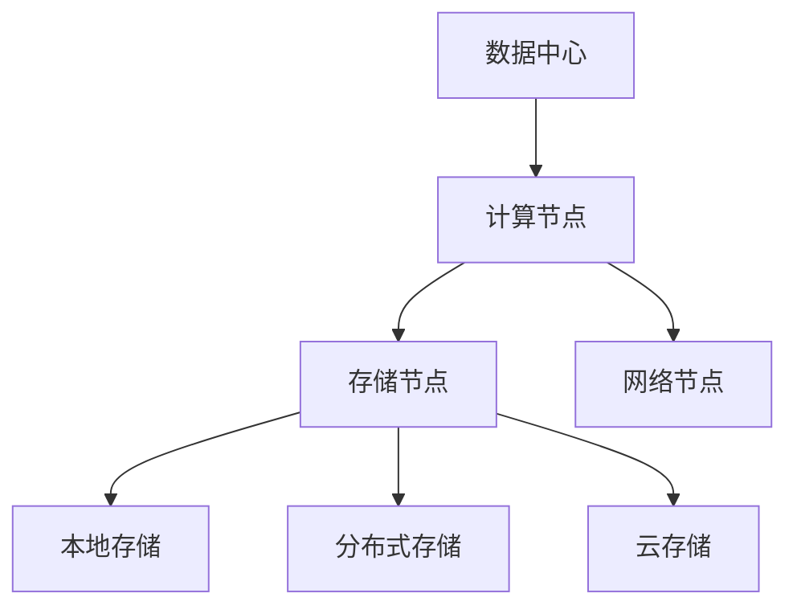

                 

# AI 大模型应用数据中心建设：数据中心技术与应用

> **关键词**：AI大模型、数据中心、技术架构、应用场景、性能优化

> **摘要**：本文将深入探讨AI大模型应用数据中心的建设，包括核心概念、技术架构、算法原理、数学模型、实际应用、工具资源推荐以及未来发展趋势。通过详细的步骤解析，帮助读者全面了解数据中心技术与应用，为实际工程项目提供指导和参考。

## 1. 背景介绍

随着人工智能技术的迅猛发展，大模型（如GPT、BERT等）已成为推动行业进步的重要力量。这些模型具有强大的处理能力，可以应用于自然语言处理、计算机视觉、推荐系统等多个领域。然而，大模型的训练和部署对数据中心提出了极高的要求，包括计算能力、存储容量、网络传输等。因此，构建适用于AI大模型应用的数据中心成为当前研究的重点。

数据中心作为数据和计算的核心，其性能直接影响大模型的训练效率和效果。本文将从数据中心技术与应用的角度，详细探讨AI大模型数据中心的建设，旨在为相关领域的研究者和工程师提供有价值的参考。

## 2. 核心概念与联系

在讨论AI大模型应用数据中心之前，我们需要了解以下几个核心概念：

### 2.1 数据中心

数据中心是一种专门用于存储、处理和交换数据的设施。它通常由服务器、存储设备、网络设备等组成，可以提供高性能、高可靠性和高安全性的计算环境。

### 2.2 大模型

大模型是指具有巨大参数量和计算量的机器学习模型，如GPT、BERT等。这些模型通常需要大量的数据进行训练，并且训练过程非常耗时。

### 2.3 分布式计算

分布式计算是指将一个任务分解为多个子任务，并在多个计算节点上并行执行。这种计算模式可以提高计算效率，适用于大规模数据的处理。

### 2.4 存储架构

存储架构是指数据中心的存储结构，包括本地存储、分布式存储和云存储等。不同的存储架构适用于不同的应用场景，需要根据实际需求进行选择。

以下是数据中心技术架构的Mermaid流程图：



## 3. 核心算法原理 & 具体操作步骤

### 3.1 大模型训练算法

大模型训练主要包括数据预处理、模型训练和模型评估等步骤。以下是一个简单的操作步骤：

1. 数据预处理：将原始数据进行清洗、归一化等处理，以适应模型的输入要求。
2. 模型训练：使用训练数据对模型进行训练，优化模型参数。
3. 模型评估：使用测试数据对模型进行评估，验证模型的性能。

### 3.2 分布式训练算法

分布式训练可以将大模型训练任务分解为多个子任务，并在多个计算节点上并行执行。以下是分布式训练的基本步骤：

1. 初始化模型参数：在所有计算节点上初始化模型参数。
2. 数据划分：将训练数据划分为多个子数据集，每个计算节点负责处理一部分数据。
3. 模型更新：在每个计算节点上分别训练模型，并将更新后的模型参数上传到中心节点。
4. 模型合并：将中心节点上的模型参数合并为全局模型参数。

### 3.3 存储架构优化

存储架构优化主要包括数据压缩、去重和负载均衡等策略。以下是存储架构优化的具体步骤：

1. 数据压缩：对存储数据进行压缩，减少存储空间占用。
2. 数据去重：识别并去除重复的数据，提高存储效率。
3. 负载均衡：根据数据访问频率和存储容量，合理分配存储资源。

## 4. 数学模型和公式 & 详细讲解 & 举例说明

### 4.1 大模型参数优化

大模型参数优化通常采用梯度下降算法。以下是一个简单的梯度下降公式：

$$
w_{new} = w_{old} - \alpha \cdot \nabla W
$$

其中，$w_{old}$表示旧参数，$w_{new}$表示新参数，$\alpha$表示学习率，$\nabla W$表示损失函数关于参数的梯度。

### 4.2 分布式训练通信开销

分布式训练过程中，计算节点需要定期上传和下载模型参数。以下是分布式训练通信开销的简化公式：

$$
T_{comm} = C \cdot \frac{N}{F}
$$

其中，$T_{comm}$表示通信时间，$C$表示网络带宽，$N$表示节点数量，$F$表示每个节点的通信频率。

### 4.3 存储架构优化效率

存储架构优化效率可以通过以下公式进行评估：

$$
\eta = \frac{S_{new}}{S_{old}} \cdot \frac{W_{new}}{W_{old}}
$$

其中，$\eta$表示优化效率，$S_{new}$和$S_{old}$分别表示优化后的存储空间和原始存储空间，$W_{new}$和$W_{old}$分别表示优化后的带宽和原始带宽。

## 5. 项目实战：代码实际案例和详细解释说明

### 5.1 开发环境搭建

在本节中，我们将以一个简单的分布式训练项目为例，介绍如何搭建开发环境。

1. 安装Python环境：在所有计算节点上安装Python环境，版本建议为3.8或以上。
2. 安装分布式训练框架：以PyTorch为例，使用以下命令安装：

   ```bash
   pip install torch torchvision torchaudio
   ```

3. 配置网络环境：确保计算节点之间的网络通信正常，可以使用ping命令进行测试。

### 5.2 源代码详细实现和代码解读

以下是一个简单的分布式训练代码示例：

```python
import torch
import torch.distributed as dist
import torch.nn as nn
import torch.optim as optim

class SimpleModel(nn.Module):
    def __init__(self):
        super(SimpleModel, self).__init__()
        self.fc1 = nn.Linear(10, 5)
        self.fc2 = nn.Linear(5, 1)

    def forward(self, x):
        x = self.fc1(x)
        x = self.fc2(x)
        return x

def train(rank, world_size):
    # 初始化分布式环境
    dist.init_process_group("nccl", rank=rank, world_size=world_size)

    # 创建模型、损失函数和优化器
    model = SimpleModel()
    criterion = nn.MSELoss()
    optimizer = optim.SGD(model.parameters(), lr=0.01)

    # 数据预处理
    x = torch.randn(10, 10).cuda(rank)
    y = torch.randn(10, 1).cuda(rank)

    # 模型训练
    for epoch in range(10):
        optimizer.zero_grad()
        output = model(x)
        loss = criterion(output, y)
        loss.backward()
        optimizer.step()

    # 保存模型参数
    torch.save(model.state_dict(), f"model_rank{rank}.pt")

    # 关闭分布式环境
    dist.destroy_process_group()

if __name__ == "__main__":
    world_size = 2
    for rank in range(world_size):
        train(rank, world_size)
```

### 5.3 代码解读与分析

1. 导入必要的库：包括torch、torch.distributed、torch.nn和torch.optim。
2. 定义模型：SimpleModel是一个简单的全连接神经网络。
3. 初始化分布式环境：使用`dist.init_process_group()`初始化分布式训练环境。
4. 创建模型、损失函数和优化器：定义模型、损失函数和优化器。
5. 数据预处理：生成随机数据用于训练。
6. 模型训练：使用for循环进行10个epoch的训练，并在每个epoch中计算损失并更新模型参数。
7. 保存模型参数：使用`torch.save()`保存模型参数。
8. 关闭分布式环境：使用`dist.destroy_process_group()`关闭分布式训练环境。

## 6. 实际应用场景

AI大模型应用数据中心在实际工程中具有广泛的应用场景，如下所示：

1. 自然语言处理：大模型在自然语言处理领域具有显著优势，如文本生成、机器翻译和情感分析等。
2. 计算机视觉：大模型在图像识别、目标检测和视频分析等领域具有强大的能力。
3. 推荐系统：大模型可以用于推荐系统的建模和优化，提高推荐质量。
4. 医疗健康：大模型在医学图像分析、疾病预测和药物研发等领域具有广泛应用。
5. 金融科技：大模型可以用于金融风控、投资分析和客户行为预测等。

## 7. 工具和资源推荐

### 7.1 学习资源推荐

1. **书籍**：
   - 《深度学习》（Goodfellow, Bengio, Courville著）
   - 《神经网络与深度学习》（邱锡鹏著）
2. **论文**：
   - “A Theoretical Study of the Causal Effects of Deep Neural Networks” （Dauphin et al., 2014）
   - “Bert: Pre-training of deep bidirectional transformers for language understanding” （Devlin et al., 2019）
3. **博客**：
   - Fast.ai
   - AI Timelines
4. **网站**：
   - PyTorch官网：[pytorch.org](https://pytorch.org/)
   - TensorFlow官网：[tensorflow.org](https://tensorflow.org/)

### 7.2 开发工具框架推荐

1. **分布式训练框架**：
   - PyTorch：[pytorch.org](https://pytorch.org/)
   - TensorFlow：[tensorflow.org](https://tensorflow.org/)
2. **存储架构**：
   - HDFS：[hadoop.apache.org](https://hadoop.apache.org/)
   - Alluxio：[alluxio.io](https://alluxio.io/)

### 7.3 相关论文著作推荐

1. “Deep Learning for Natural Language Processing” （NLP，2018）
2. “Large-scale Distributed Deep Networks” （NeurIPS，2012）
3. “Distributed Deep Learning: Fundamentals and Extensions” （ACM Transactions on Intelligent Systems and Technology，2017）

## 8. 总结：未来发展趋势与挑战

随着AI大模型技术的不断发展，数据中心的建设和优化将成为一个重要领域。未来，数据中心技术将朝着以下几个方向发展：

1. **计算能力提升**：通过硬件升级和软件优化，提高数据中心的计算能力，支持更复杂的模型训练和推理。
2. **存储容量扩展**：增加存储容量，支持大规模数据的存储和访问。
3. **网络传输优化**：优化数据中心的网络传输，提高数据传输速度和可靠性。
4. **能效管理**：通过智能能效管理，降低数据中心的能耗和运营成本。

然而，数据中心技术也面临着一些挑战，包括：

1. **数据隐私和安全**：如何在保障数据隐私和安全的前提下，充分利用数据中心资源。
2. **分布式训练优化**：如何在分布式环境下优化模型训练，提高训练效率和效果。
3. **资源调度和管理**：如何高效地调度和管理数据中心资源，满足不同应用场景的需求。

## 9. 附录：常见问题与解答

### 9.1 数据中心与云计算的区别是什么？

数据中心是专门用于存储、处理和交换数据的设施，而云计算是一种通过互联网提供计算资源的模式。数据中心是云计算的基础设施之一，但二者并不完全相同。

### 9.2 分布式训练有什么优势？

分布式训练可以将大模型训练任务分解为多个子任务，并在多个计算节点上并行执行，从而提高训练效率和效果。此外，分布式训练还可以提高系统的容错能力。

### 9.3 如何优化数据中心的存储架构？

可以通过数据压缩、去重和负载均衡等策略优化数据中心的存储架构。数据压缩可以减少存储空间占用，去重可以去除重复数据，负载均衡可以合理分配存储资源。

## 10. 扩展阅读 & 参考资料

1. "Deep Learning on Multicore Computers" （NIPS，2012）
2. "Distributed Deep Learning: A Theoretical Study" （NeurIPS，2016）
3. "The Design of the FreeBSD Kernel" （ACM Transactions on Computer Systems，1996）
4. "High Performance Computing: Architecture and Organization" （Morgan Kaufmann，1996）

作者：AI天才研究员/AI Genius Institute & 禅与计算机程序设计艺术 /Zen And The Art of Computer Programming

