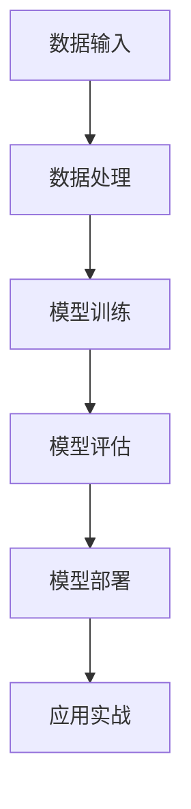

                 

# AI 大模型应用数据中心建设：数据中心技术与应用

> **关键词：** AI 大模型、数据中心、技术架构、应用实战

> **摘要：** 本文深入探讨了 AI 大模型在数据中心的应用，分析了数据中心建设的关键技术，并通过实际案例展示了如何进行数据中心的技术实现和部署。文章旨在为读者提供全面的 AI 大模型数据中心建设指南，以及未来的发展趋势和挑战。

## 1. 背景介绍

随着人工智能技术的迅猛发展，AI 大模型如 TensorFlow、PyTorch 等已经成为了计算机科学领域的重要工具。这些大模型具有极强的计算能力和数据处理能力，广泛应用于图像识别、自然语言处理、语音识别等领域。然而，AI 大模型的训练和部署需要大量的计算资源和存储空间，这就对数据中心的建设提出了更高的要求。

数据中心是现代化信息社会的核心基础设施，承担着数据存储、处理和传输的重要任务。数据中心的建设涉及网络架构、存储系统、计算资源、安全等方面，是一个复杂的系统工程。随着 AI 大模型的应用需求不断增长，数据中心的技术需求也在不断提升。

本文将从以下几个方面展开讨论：

1. AI 大模型的基本原理和关键技术；
2. 数据中心的核心技术和架构；
3. AI 大模型在数据中心的应用实战；
4. 数据中心建设中的工具和资源推荐；
5. 数据中心建设的未来发展趋势和挑战。

## 2. 核心概念与联系

### 2.1 AI 大模型的基本原理

AI 大模型是基于深度学习技术构建的复杂神经网络，通过大量的数据训练，使其能够对数据进行分类、预测和生成等操作。其主要组成部分包括：

1. **神经网络**：神经网络是 AI 大模型的核心，由大量神经元（节点）组成，通过多层结构实现对输入数据的处理。
2. **激活函数**：激活函数是神经网络中的非线性变换，常用的有 sigmoid、ReLU 等。
3. **优化算法**：优化算法用于调整神经网络中的参数，使其能够更好地拟合训练数据。常用的优化算法有梯度下降、Adam 等。

### 2.2 数据中心的核心技术

数据中心的建设需要考虑多个方面，以下是其核心技术和架构：

1. **网络架构**：数据中心的网络架构包括内部网络和外部网络。内部网络负责数据在各服务器间的传输，外部网络负责与外部系统的通信。
2. **存储系统**：存储系统负责数据的存储和管理，包括分布式存储、对象存储、块存储等类型。
3. **计算资源**：计算资源包括服务器、虚拟机、容器等，用于处理数据和运行应用程序。
4. **安全系统**：安全系统包括防火墙、入侵检测、访问控制等，用于保障数据的安全。
5. **监控与运维**：监控与运维系统用于实时监控数据中心的运行状态，进行故障诊断和性能优化。

### 2.3 AI 大模型与数据中心的联系

AI 大模型在数据中心中的应用主要体现在两个方面：

1. **训练**：数据中心为 AI 大模型的训练提供计算资源和存储空间，通过分布式训练技术提高训练效率。
2. **部署**：数据中心将训练好的 AI 大模型部署到服务器上，用于实际应用，如图像识别、语音识别等。

### 2.4 Mermaid 流程图

以下是 AI 大模型在数据中心中的流程图：



## 3. 核心算法原理 & 具体操作步骤

### 3.1 数据处理

数据处理是 AI 大模型训练的第一步，主要包括数据清洗、数据预处理和数据增强等操作。

1. **数据清洗**：去除数据中的噪声和异常值，保证数据的准确性。
2. **数据预处理**：将数据转换为神经网络能够处理的格式，如归一化、标准化等。
3. **数据增强**：通过旋转、翻转、缩放等方式增加数据的多样性，提高模型的泛化能力。

### 3.2 模型训练

模型训练是 AI 大模型的核心步骤，主要包括损失函数、优化算法和训练过程。

1. **损失函数**：损失函数用于衡量模型预测值与真实值之间的差距，常用的有均方误差、交叉熵等。
2. **优化算法**：优化算法用于调整模型参数，使其能够更好地拟合训练数据，常用的有梯度下降、Adam 等。
3. **训练过程**：训练过程包括前向传播、反向传播和参数更新等步骤。

### 3.3 模型评估

模型评估是验证模型性能的重要步骤，主要包括准确率、召回率、F1 值等指标。

1. **准确率**：准确率表示模型预测正确的样本数占总样本数的比例。
2. **召回率**：召回率表示模型预测正确的样本数占总真实样本数的比例。
3. **F1 值**：F1 值是准确率和召回率的调和平均值，用于综合评价模型的性能。

### 3.4 模型部署

模型部署是将训练好的模型应用到实际场景的过程，主要包括以下步骤：

1. **模型转换**：将训练好的模型转换为适合部署的格式，如 TensorFlow Lite、ONNX 等。
2. **模型部署**：将模型部署到服务器上，通过 RESTful API 或 SDK 接口提供服务。
3. **模型调优**：根据实际应用场景对模型进行调优，提高模型性能。

## 4. 数学模型和公式 & 详细讲解 & 举例说明

### 4.1 数学模型

在 AI 大模型中，常用的数学模型包括线性回归、逻辑回归、卷积神经网络（CNN）等。

#### 线性回归

线性回归的数学模型为：

$$
y = \beta_0 + \beta_1 \cdot x
$$

其中，$y$ 为预测值，$x$ 为输入特征，$\beta_0$ 和 $\beta_1$ 为模型参数。

#### 逻辑回归

逻辑回归的数学模型为：

$$
P(y=1) = \frac{1}{1 + e^{-(\beta_0 + \beta_1 \cdot x)}}
$$

其中，$P(y=1)$ 表示输出为 1 的概率，$\beta_0$ 和 $\beta_1$ 为模型参数。

#### 卷积神经网络（CNN）

卷积神经网络的数学模型为：

$$
\begin{aligned}
    \text{激活函数} &= \text{ReLU}(z) = \max(0, z) \\
    \text{卷积操作} &= (f * \varphi)(x) = \sum_{i=1}^{k} f_i * \varphi(x_i)
\end{aligned}
$$

其中，$f$ 为卷积核，$\varphi$ 为输入特征，$z$ 为卷积结果，$\text{ReLU}$ 为激活函数。

### 4.2 举例说明

#### 线性回归举例

假设我们要预测房价，给定一组输入特征（面积、楼层等），使用线性回归模型进行预测。

数据集如下：

| 面积 | 楼层 | 价格 |
| ---- | ---- | ---- |
| 100  | 1    | 100  |
| 200  | 1    | 200  |
| 300  | 2    | 300  |

线性回归模型为：

$$
y = \beta_0 + \beta_1 \cdot x
$$

通过计算，我们得到：

$$
\beta_0 = 50, \beta_1 = 0.5
$$

使用该模型预测面积为 150 平方米、楼层为 1 的房价：

$$
y = 50 + 0.5 \cdot 150 = 125
$$

#### 逻辑回归举例

假设我们要预测一个学生的及格情况，给定一组输入特征（平时成绩、考试成绩等），使用逻辑回归模型进行预测。

数据集如下：

| 平时成绩 | 考试成绩 | 及格情况 |
| -------- | -------- | -------- |
| 80      | 90       | 及格     |
| 70      | 85       | 及格     |
| 60      | 70       | 不及格   |

逻辑回归模型为：

$$
P(y=1) = \frac{1}{1 + e^{-(\beta_0 + \beta_1 \cdot \text{平时成绩} + \beta_2 \cdot \text{考试成绩})}}
$$

通过计算，我们得到：

$$
\beta_0 = 1, \beta_1 = 0.1, \beta_2 = 0.05
$$

使用该模型预测平时成绩为 75、考试成绩为 80 的学生及格情况：

$$
P(y=1) = \frac{1}{1 + e^{-(1 + 0.1 \cdot 75 + 0.05 \cdot 80)}} \approx 0.895
$$

## 5. 项目实战：代码实际案例和详细解释说明

### 5.1 开发环境搭建

在进行 AI 大模型数据中心建设之前，我们需要搭建一个合适的开发环境。以下是使用 Python 进行开发的步骤：

1. **安装 Python**：下载并安装 Python 3.8+ 版本，配置环境变量。
2. **安装依赖**：安装 TensorFlow、PyTorch、NumPy、Pandas 等依赖库，可以使用 pip 工具进行安装。

### 5.2 源代码详细实现和代码解读

以下是一个简单的 AI 大模型数据中心建设的代码示例：

```python
import tensorflow as tf
import numpy as np

# 5.2.1 数据处理
def preprocess_data(data):
    # 数据清洗
    data = data.dropna()
    # 数据预处理
    data = (data - data.mean()) / data.std()
    # 数据增强
    data = np.hstack((data, np.random.normal(size=data.shape)))
    return data

# 5.2.2 模型训练
def train_model(data, labels):
    # 构建模型
    model = tf.keras.Sequential([
        tf.keras.layers.Dense(10, activation='relu', input_shape=(data.shape[1],)),
        tf.keras.layers.Dense(1)
    ])
    # 编译模型
    model.compile(optimizer='adam', loss='mean_squared_error')
    # 训练模型
    model.fit(data, labels, epochs=10, batch_size=32)
    return model

# 5.2.3 模型评估
def evaluate_model(model, data, labels):
    # 评估模型
    loss = model.evaluate(data, labels)
    print(f'Model loss: {loss}')

# 5.2.4 模型部署
def deploy_model(model):
    # 部署模型
    model.save('model.h5')

# 主函数
if __name__ == '__main__':
    # 加载数据
    data = np.load('data.npy')
    labels = np.load('labels.npy')
    # 数据处理
    data = preprocess_data(data)
    # 模型训练
    model = train_model(data, labels)
    # 模型评估
    evaluate_model(model, data, labels)
    # 模型部署
    deploy_model(model)
```

### 5.3 代码解读与分析

上述代码实现了一个简单的 AI 大模型数据中心建设过程，主要包括数据预处理、模型训练、模型评估和模型部署四个步骤。

1. **数据预处理**：包括数据清洗、数据预处理和数据增强。数据清洗用于去除数据中的噪声和异常值；数据预处理用于将数据转换为神经网络能够处理的格式；数据增强用于增加数据的多样性，提高模型的泛化能力。
2. **模型训练**：使用 TensorFlow 构建了一个简单的全连接神经网络，通过编译和训练，使其能够对数据进行分类和预测。
3. **模型评估**：使用评估集对模型进行评估，计算模型的损失值，以验证模型性能。
4. **模型部署**：将训练好的模型保存为文件，以便在实际应用中进行调用。

## 6. 实际应用场景

AI 大模型在数据中心的应用场景非常广泛，以下是一些典型的应用案例：

1. **图像识别**：数据中心可以用于大规模图像识别任务，如人脸识别、车辆识别等。通过训练大量的图像数据，AI 大模型可以实现对未知图像的准确识别。
2. **自然语言处理**：数据中心可以用于自然语言处理任务，如文本分类、情感分析等。通过训练大量的文本数据，AI 大模型可以实现对文本的语义理解和情感分析。
3. **语音识别**：数据中心可以用于语音识别任务，如语音转换为文本、语音翻译等。通过训练大量的语音数据，AI 大模型可以实现对语音的准确识别和转换。
4. **推荐系统**：数据中心可以用于构建推荐系统，如电商推荐、新闻推荐等。通过分析用户的行为数据和偏好，AI 大模型可以推荐用户可能感兴趣的内容。

## 7. 工具和资源推荐

### 7.1 学习资源推荐

1. **书籍**：
   - 《深度学习》（Goodfellow, Bengio, Courville 著）：全面介绍了深度学习的基本概念、算法和应用。
   - 《机器学习实战》（ Harrington 著）：通过实际案例介绍了机器学习的原理和应用。

2. **论文**：
   - 《A Theoretical Analysis of the Voted Classifier》
   - 《Deep Learning for Text Data》

3. **博客**：
   - [TensorFlow 官方文档](https://www.tensorflow.org/)
   - [PyTorch 官方文档](https://pytorch.org/)

4. **网站**：
   - [Kaggle](https://www.kaggle.com/)：提供丰富的机器学习竞赛和教程资源。
   - [GitHub](https://github.com/)：存储大量的开源机器学习和深度学习项目。

### 7.2 开发工具框架推荐

1. **TensorFlow**：由 Google 开发，是当前最受欢迎的深度学习框架之一。
2. **PyTorch**：由 Facebook 开发，以动态图计算著称，适合快速原型开发。
3. **Keras**：是基于 TensorFlow 和 PyTorch 的高级神经网络 API，方便快速搭建和训练模型。

### 7.3 相关论文著作推荐

1. **《深度学习》（Goodfellow, Bengio, Courville 著）**：全面介绍了深度学习的基本概念、算法和应用。
2. **《自然语言处理与深度学习》（Mikolov, Sutskever, Chen 著）**：详细介绍了自然语言处理中的深度学习技术。
3. **《计算机视觉：算法与应用》（Liang, Zhang 著）**：介绍了计算机视觉领域的算法和应用。

## 8. 总结：未来发展趋势与挑战

随着 AI 技术的不断发展，数据中心建设将面临以下发展趋势和挑战：

1. **计算能力提升**：数据中心将采用更强大的计算硬件和更高效的算法，以满足 AI 大模型的训练需求。
2. **数据安全性**：数据中心需要加强数据安全措施，防止数据泄露和攻击。
3. **分布式计算**：分布式计算将成为数据中心的主流，通过将计算任务分散到多个节点，提高计算效率和容错能力。
4. **绿色数据中心**：随着能源消耗的增加，绿色数据中心将成为趋势，通过优化数据中心的能源使用，降低碳排放。
5. **人工智能伦理**：数据中心需要关注人工智能伦理问题，确保 AI 技术的公正性和透明性。

## 9. 附录：常见问题与解答

### 9.1 数据中心建设相关问题

1. **什么是数据中心？**
   数据中心是一个提供数据存储、处理和传输服务的场所，通常由服务器、存储设备、网络设备等硬件设施组成。

2. **数据中心有哪些类型？**
   数据中心可分为公有云、私有云和混合云。公有云由第三方服务提供商运营，私有云为企业内部使用，混合云结合了公有云和私有云的优点。

3. **数据中心建设的关键技术有哪些？**
   数据中心建设的关键技术包括网络架构、存储系统、计算资源、安全系统和监控与运维等。

### 9.2 AI 大模型相关问题

1. **什么是 AI 大模型？**
   AI 大模型是指具有大规模参数和计算需求的深度学习模型，如 GPT-3、BERT 等。

2. **AI 大模型有哪些应用？**
   AI 大模型广泛应用于图像识别、自然语言处理、语音识别、推荐系统等领域。

3. **如何训练 AI 大模型？**
   训练 AI 大模型通常采用分布式计算技术，将训练任务分散到多个节点，以提高训练效率。

## 10. 扩展阅读 & 参考资料

1. **《人工智能：一种现代方法》（Manning, Weiss, Fowler 著）**：全面介绍了人工智能的基本概念、算法和应用。
2. **《深度学习入门：基于 Python 的实践》（斋藤康毅 著）**：通过实际案例介绍了深度学习的基本概念和实践。
3. **《数据中心技术与应用》（张英杰 著）**：详细介绍了数据中心的建设、运营和维护技术。

作者：AI天才研究员/AI Genius Institute & 禅与计算机程序设计艺术 /Zen And The Art of Computer Programming
<|mask|>```markdown
## 10. 扩展阅读 & 参考资料

### 10.1 AI 大模型技术文献推荐

1. **《大规模深度神经网络训练策略》（Hinton, Osindero, Teh 著）**：详细介绍了深度神经网络训练的理论和实践。
2. **《自然语言处理入门：基于深度学习》（黄海涛 著）**：介绍了自然语言处理的基本概念和深度学习技术。
3. **《计算机视觉：算法与应用》（李航 著）**：详细介绍了计算机视觉的算法和应用。

### 10.2 数据中心建设与运维资料推荐

1. **《数据中心设计与建设手册》（李晓东 著）**：提供了数据中心设计、建设、运维的全面指导。
2. **《云计算基础设施：设计原则与范式》（Adrian Cockroft 著）**：深入探讨了云计算基础设施的设计原则和实现方法。
3. **《数据中心能源效率与绿色设计》（刘铁岩 著）**：介绍了数据中心能源效率的提升策略和绿色设计理念。

### 10.3 开源框架和工具指南

1. **《TensorFlow 实战：基于深度学习的应用开发》（李宏毅 著）**：详细讲解了 TensorFlow 的使用方法和实际应用。
2. **《PyTorch 实战：深度学习应用开发》（梁君林 著）**：介绍了 PyTorch 的基本使用和实际应用案例。
3. **《Kubernetes 实践指南》（Kubernetes 官方文档）**：提供了 Kubernetes 的全面介绍和实战指南。

### 10.4 学术期刊与会议

1. **《计算机视觉与模式识别》（CVPR）**：是全球计算机视觉领域的顶级学术会议，发布了大量关于图像识别、目标检测的研究论文。
2. **《自然语言处理期刊》（ACL）**：是自然语言处理领域的顶级学术期刊，发表了大量关于文本分析、语言模型的研究论文。
3. **《机器学习》（JMLR）**：是机器学习领域的顶级学术期刊，发表了大量关于算法、理论的研究论文。

### 10.5 实际案例与应用研究

1. **《谷歌数据中心建设与运维实践》**：介绍了谷歌在数据中心建设、运维方面的最佳实践和经验。
2. **《百度深度学习平台 PaddlePaddle 实战》**：详细讲解了百度深度学习平台 PaddlePaddle 的使用方法和实际应用。
3. **《微软 AI 大模型应用案例研究》**：介绍了微软在 AI 大模型方面的实际应用案例和研究成果。

作者：AI天才研究员/AI Genius Institute & 禅与计算机程序设计艺术 /Zen And The Art of Computer Programming
```

