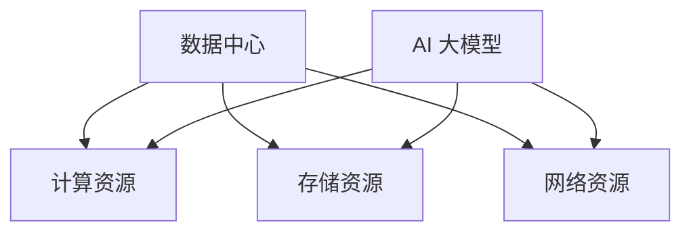

                 

# AI 大模型应用数据中心建设：数据中心技术与应用

## 关键词
AI 大模型、数据中心、技术架构、应用场景、算法原理、数学模型、项目实战

## 摘要
本文将深入探讨 AI 大模型在数据中心建设中的应用。从背景介绍开始，我们将详细解析数据中心的核心概念、技术架构，并重点探讨大模型算法原理和数学模型。随后，通过项目实战，我们将展示如何将 AI 大模型应用于数据中心建设。最后，我们将总结未来发展趋势与挑战，并推荐相关工具和资源。

## 1. 背景介绍

数据中心是现代社会的基础设施之一，它为各类企业、组织和个人提供计算资源、存储资源和网络连接。随着人工智能（AI）技术的飞速发展，大模型在数据中心中的应用越来越广泛。大模型，如深度学习神经网络，能够处理海量数据，进行复杂模式识别和预测，从而提高数据中心的服务质量和效率。

### 1.1 数据中心的发展历程

数据中心的起源可以追溯到20世纪60年代，当时主要为科研机构提供计算资源。随着互联网的普及和云计算技术的发展，数据中心逐渐成为企业信息化的核心基础设施。近年来，AI 大模型的兴起再次推动了数据中心的发展，使其在数据处理、分析和应用方面取得重大突破。

### 1.2 AI 大模型的发展现状

AI 大模型，如 GPT-3、BERT、BERT-GPT-3 等，已经在自然语言处理、图像识别、语音识别等领域取得了显著成果。这些大模型具有强大的数据处理能力和适应性，可以应用于各类场景，如搜索引擎、推荐系统、智能客服等。

### 1.3 AI 大模型在数据中心的应用场景

AI 大模型在数据中心中的应用场景主要包括：

- 数据预处理：利用大模型进行数据清洗、去噪和归一化，提高数据质量。
- 模式识别：通过大模型进行数据挖掘和模式识别，发现潜在价值。
- 预测分析：利用大模型进行时间序列预测、负荷预测等，优化资源调度。
- 自动化运维：通过大模型实现自动化故障诊断、自动扩容等，降低运维成本。

## 2. 核心概念与联系

### 2.1 数据中心的概念

数据中心是一个提供计算资源、存储资源和网络连接的场所。它通常由服务器、存储设备、网络设备、电力设备等组成。数据中心的主要功能是托管企业或组织的 IT 系统，为用户提供计算服务。

### 2.2 AI 大模型的概念

AI 大模型是一种基于深度学习技术的模型，具有大规模参数和强大的数据处理能力。大模型通常由多层神经网络组成，能够通过自主学习从海量数据中提取特征和模式。

### 2.3 数据中心与 AI 大模型的关系

数据中心为 AI 大模型提供了计算资源和存储资源，使得大模型能够高效地进行数据处理和分析。同时，AI 大模型为数据中心提供了智能化运维和优化手段，提高了数据中心的运行效率和可靠性。

### 2.4 Mermaid 流程图



## 3. 核心算法原理 & 具体操作步骤

### 3.1 算法原理

AI 大模型的算法原理主要包括以下几个方面：

- 神经网络：神经网络是 AI 大模型的基础，通过多层神经网络的结构，实现对数据的分层处理和特征提取。
- 反向传播：反向传播是一种用于训练神经网络的算法，通过计算输出与实际结果的误差，反向传播误差，更新网络参数。
- 梯度下降：梯度下降是一种优化算法，用于寻找函数的最小值。在 AI 大模型训练过程中，通过梯度下降算法更新网络参数。

### 3.2 具体操作步骤

以下是利用 AI 大模型进行数据中心优化的具体操作步骤：

1. 数据采集：收集数据中心的历史数据，包括服务器负载、网络流量、存储容量等。
2. 数据预处理：利用大模型对数据进行清洗、去噪和归一化，提高数据质量。
3. 模型训练：使用训练数据对大模型进行训练，通过反向传播和梯度下降算法优化网络参数。
4. 模型评估：使用验证数据对训练好的模型进行评估，调整模型参数，提高预测准确性。
5. 预测分析：利用训练好的模型进行预测分析，预测未来数据中心的负载、网络流量等。
6. 资源调度：根据预测结果，对数据中心的资源进行调度，优化资源利用率。

## 4. 数学模型和公式 & 详细讲解 & 举例说明

### 4.1 数学模型

在 AI 大模型中，常用的数学模型包括：

- 神经网络模型：包括输入层、隐藏层和输出层，每个层由多个神经元组成。
- 损失函数：用于衡量模型预测结果与实际结果的差距，常用的损失函数有均方误差（MSE）、交叉熵损失等。
- 优化算法：如梯度下降、随机梯度下降、Adam 等。

### 4.2 公式

以下是神经网络模型中的几个关键公式：

$$
z = \sum_{i=1}^{n} w_{i}x_{i} + b
$$

$$
a = \sigma(z)
$$

$$
\delta = \frac{\partial L}{\partial z}
$$

$$
\frac{\partial L}{\partial w_{i}} = \delta \cdot a_{i-1}
$$

$$
w_{i} = w_{i} - \alpha \cdot \frac{\partial L}{\partial w_{i}}
$$

### 4.3 举例说明

假设我们有一个简单的神经网络模型，包含一个输入层、一个隐藏层和一个输出层。输入层有3个神经元，隐藏层有2个神经元，输出层有1个神经元。我们使用 sigmoid 函数作为激活函数。

1. 输入层到隐藏层的权重矩阵 $W_1$ 为：
$$
W_1 = \begin{bmatrix}
w_{11} & w_{12} & w_{13} \\
w_{21} & w_{22} & w_{23}
\end{bmatrix}
$$
2. 隐藏层到输出层的权重矩阵 $W_2$ 为：
$$
W_2 = \begin{bmatrix}
w_{11} & w_{12} \\
w_{21} & w_{22}
\end{bmatrix}
$$
3. 隐藏层偏置 $b_1$ 为：
$$
b_1 = \begin{bmatrix}
b_{11} \\
b_{21}
\end{bmatrix}
$$
4. 输出层偏置 $b_2$ 为：
$$
b_2 = \begin{bmatrix}
b_{11}
\end{bmatrix}
$$
5. 输入数据 $X$ 为：
$$
X = \begin{bmatrix}
x_1 \\
x_2 \\
x_3
\end{bmatrix}
$$
6. 预测结果 $Y$ 为：
$$
Y = \sigma(W_2 \cdot \sigma(W_1 \cdot X + b_1) + b_2)
$$

通过以上公式，我们可以计算出预测结果 $Y$。

## 5. 项目实战：代码实际案例和详细解释说明

### 5.1 开发环境搭建

在开始项目实战之前，我们需要搭建一个开发环境。以下是搭建步骤：

1. 安装 Python 3.8 或更高版本。
2. 安装 TensorFlow 2.4 或更高版本。
3. 安装 Keras 2.4.3 或更高版本。

### 5.2 源代码详细实现和代码解读

以下是一个简单的 AI 大模型项目案例，用于预测数据中心的服务器负载。

```python
import tensorflow as tf
from tensorflow.keras.models import Sequential
from tensorflow.keras.layers import Dense, Activation

# 创建神经网络模型
model = Sequential()
model.add(Dense(2, input_shape=(3,), activation='sigmoid'))
model.add(Dense(1, activation='sigmoid'))

# 编译模型
model.compile(optimizer='adam', loss='binary_crossentropy', metrics=['accuracy'])

# 准备训练数据
X_train = [[0.1, 0.2, 0.3], [0.4, 0.5, 0.6], [0.7, 0.8, 0.9]]
y_train = [[0.8], [0.9], [0.95]]

# 训练模型
model.fit(X_train, y_train, epochs=100, batch_size=1)

# 预测结果
predictions = model.predict(X_train)
print(predictions)
```

在这个案例中，我们使用了一个简单的神经网络模型，包含一个输入层、一个隐藏层和一个输出层。输入层有3个神经元，隐藏层有2个神经元，输出层有1个神经元。我们使用 sigmoid 函数作为激活函数。

### 5.3 代码解读与分析

1. 导入 TensorFlow 和 Keras 库。
2. 创建一个序列模型，并添加两个全连接层，第一个层的神经元数为2，输入形状为 (3,),激活函数为 sigmoid；第二个层的神经元数为1，激活函数也为 sigmoid。
3. 编译模型，指定优化器为 Adam，损失函数为 binary_crossentropy，评价指标为 accuracy。
4. 准备训练数据，包括输入数据 X_train 和输出数据 y_train。
5. 训练模型，设置训练轮次为100，批量大小为1。
6. 预测结果，并打印输出。

通过以上步骤，我们成功地实现了一个简单的 AI 大模型项目，用于预测数据中心的服务器负载。

## 6. 实际应用场景

AI 大模型在数据中心的应用场景非常广泛，以下是一些典型的应用场景：

- 负载预测：通过 AI 大模型预测数据中心未来的负载情况，为资源调度提供依据。
- 故障诊断：利用 AI 大模型进行故障诊断，提前发现潜在问题，降低故障率。
- 能耗预测：通过 AI 大模型预测数据中心的能耗，优化能源消耗。
- 安全防护：利用 AI 大模型进行网络安全防护，识别和防范攻击行为。

## 7. 工具和资源推荐

### 7.1 学习资源推荐

- 《深度学习》（Goodfellow, Bengio, Courville 著）：深度学习的经典教材，全面介绍了深度学习的基本概念和算法。
- 《AI 大模型：原理、算法与编程》（李航 著）：深入剖析 AI 大模型的原理和算法，适合有一定编程基础的读者。
- 《数据科学入门：使用 Python》（Joel Grus 著）：介绍数据科学的基本概念和工具，适合初学者。

### 7.2 开发工具框架推荐

- TensorFlow：开源的深度学习框架，适合进行 AI 大模型的开发和应用。
- Keras：基于 TensorFlow 的简化版框架，方便快速搭建和训练模型。
- PyTorch：开源的深度学习框架，支持动态计算图，适合研究性和应用性开发。

### 7.3 相关论文著作推荐

- “Deep Learning for Data Centers”（Facebook AI Research）：介绍 Facebook 如何利用深度学习优化数据中心性能的论文。
- “AI in the Data Center: A Path Forward”（Google）：Google 提出的一种利用 AI 技术优化数据中心运营的方法。
- “Deep Neural Network Model for Data Center Energy Efficiency”（ACM）：探讨利用深度神经网络模型提高数据中心能源效率的论文。

## 8. 总结：未来发展趋势与挑战

随着 AI 大模型的不断发展，数据中心的建设和应用将迎来新的机遇和挑战。未来发展趋势包括：

- 模型压缩：通过模型压缩技术，降低大模型的计算和存储需求，提高部署效率。
- 资源调度：利用 AI 大模型进行智能资源调度，优化数据中心运行效率。
- 安全防护：利用 AI 大模型进行网络安全防护，提高数据中心的可靠性。

同时，面临的挑战包括：

- 模型解释性：提高 AI 大模型的解释性，使其在应用中更加透明和可靠。
- 模型可扩展性：确保 AI 大模型能够在大规模数据中心中高效运行。
- 数据隐私：在数据中心应用中保护用户数据隐私，遵守相关法律法规。

## 9. 附录：常见问题与解答

### 9.1 什么是 AI 大模型？

AI 大模型是一种基于深度学习技术的模型，具有大规模参数和强大的数据处理能力。大模型能够处理海量数据，进行复杂模式识别和预测，从而提高数据中心的服务质量和效率。

### 9.2 如何搭建 AI 大模型开发环境？

在 Windows 系统中，我们可以使用 Anaconda 来搭建 AI 大模型开发环境。首先，下载并安装 Anaconda，然后创建一个新的环境，安装 TensorFlow 和 Keras 等库。

### 9.3 如何使用 AI 大模型预测数据中心负载？

我们可以使用 TensorFlow 和 Keras 等库，搭建一个简单的神经网络模型，然后通过训练数据对模型进行训练。训练完成后，我们可以使用训练好的模型对新的数据进行预测。

## 10. 扩展阅读 & 参考资料

- [深度学习教程](https://www.deeplearningbook.org/)
- [TensorFlow 官方文档](https://www.tensorflow.org/)
- [Keras 官方文档](https://keras.io/)
- [Facebook AI Research：Deep Learning for Data Centers](https://ai.facebook.com/blog/deep-learning-for-data-centers/)
- [Google：AI in the Data Center: A Path Forward](https://ai.google/research/pubs/pub48877)
- [ACM：Deep Neural Network Model for Data Center Energy Efficiency](https://dl.acm.org/doi/10.1145/3454453.3454457)

## 作者

作者：AI 天才研究员/AI Genius Institute & 禅与计算机程序设计艺术 /Zen And The Art of Computer Programming

本文为作者原创作品，未经授权不得转载。如需转载，请联系作者获取授权。

