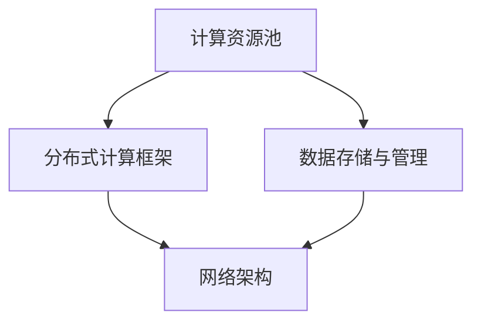

                 

# AI 大模型应用数据中心建设：数据中心技术创新

> **关键词：** AI大模型、数据中心、技术创新、架构设计、性能优化

> **摘要：** 本文将深入探讨AI大模型应用数据中心的建设及其技术创新，从核心概念、算法原理到实际应用场景，为您呈现数据中心在人工智能时代的新面貌。

## 1. 背景介绍

随着人工智能技术的快速发展，AI大模型如BERT、GPT等在自然语言处理、图像识别、推荐系统等领域取得了显著成果。这些模型通常具有庞大的参数量，对计算资源的需求极为庞大，因此数据中心的建设成为人工智能应用的关键一环。数据中心不仅是存储和计算资源的集中地，更是实现AI大模型高效运行的基础设施。

数据中心的建设经历了从传统架构向分布式架构的演变。传统架构以服务器为中心，资源利用率低，扩展性差。而分布式架构通过将计算资源分散部署，提高了系统的可用性和可扩展性。随着容器技术、虚拟化技术、云计算技术的成熟，数据中心架构不断演进，为AI大模型的应用提供了更加灵活和高效的解决方案。

## 2. 核心概念与联系

在AI大模型应用数据中心的建设中，我们需要关注以下几个核心概念：

- **计算资源池：** 包括CPU、GPU、TPU等硬件资源，以及存储、网络等基础设施。

- **分布式计算框架：** 如TensorFlow、PyTorch等，用于实现模型的分布式训练和推理。

- **数据存储与管理：** 包括关系型数据库、NoSQL数据库、分布式文件系统等。

- **网络架构：** 包括局域网、广域网、数据中心之间的互联，以及数据传输和通信协议。

以下是数据中心架构的Mermaid流程图：



### 2.1 计算资源池

计算资源池是数据中心的基础，其性能直接影响AI大模型的训练和推理效率。在硬件层面，CPU、GPU、TPU等都是常见的计算资源。其中，GPU在深度学习任务中具有显著优势，因为其并行计算能力远高于CPU。而TPU是谷歌专门为TensorFlow优化的硬件，具有更高效的深度学习计算能力。

### 2.2 分布式计算框架

分布式计算框架用于实现AI大模型的分布式训练和推理。TensorFlow和PyTorch是目前最流行的两个框架。它们支持大规模模型的分布式训练，通过参数服务器、数据并行、模型并行等方式，提高训练效率。同时，这些框架还提供了丰富的工具和API，方便开发者进行模型开发、训练和推理。

### 2.3 数据存储与管理

数据存储与管理是数据中心的重要组成部分。关系型数据库（如MySQL、PostgreSQL）适用于结构化数据的存储和查询。而NoSQL数据库（如MongoDB、Cassandra）则更适合存储大规模的非结构化数据。分布式文件系统（如HDFS、Ceph）则用于存储大规模的数据集，并提供高效的数据访问和存储管理。

### 2.4 网络架构

网络架构是数据中心的核心，其性能直接影响数据传输和通信的效率。局域网（LAN）和广域网（WAN）是数据中心的基本网络架构。在数据中心内部，网络架构通常采用高性能的交换机和路由器，实现高速的数据传输。同时，为了提高数据中心的可用性和扩展性，通常采用负载均衡技术，均衡网络流量，防止单点故障。

## 3. 核心算法原理 & 具体操作步骤

在AI大模型应用数据中心的建设中，核心算法原理和具体操作步骤至关重要。以下将介绍常见的分布式训练算法和数据加载策略。

### 3.1 分布式训练算法

分布式训练算法是AI大模型训练的关键。以下介绍几种常见的分布式训练算法：

#### 3.1.1 数据并行

数据并行是一种简单的分布式训练方法，将训练数据集分成多个部分，每个节点负责处理一部分数据。在训练过程中，每个节点独立计算梯度，然后将梯度聚合到全局梯度。数据并行能够提高训练速度，但需要解决梯度聚合的问题。

#### 3.1.2 参数服务器

参数服务器是一种更复杂的分布式训练方法，将模型参数存储在参数服务器上，每个节点独立计算梯度，然后将梯度发送到参数服务器。参数服务器负责聚合全局梯度，并更新模型参数。参数服务器能够提高训练的并行度，但需要解决参数同步和通信负载的问题。

#### 3.1.3 模型并行

模型并行是一种将模型分成多个部分，每个节点负责处理一部分模型的分布式训练方法。模型并行能够提高训练的并行度和计算资源利用率，但需要解决模型划分和通信负载的问题。

### 3.2 数据加载策略

数据加载策略是AI大模型训练中的另一个关键因素。以下介绍几种常见的数据加载策略：

#### 3.2.1 批处理

批处理是一种将数据分成多个批次进行训练的方法。每个批次的数据量可以根据计算资源的限制进行调整。批处理能够减少内存消耗，但可能降低训练速度。

#### 3.2.2 流处理

流处理是一种将数据以流的形式进行训练的方法。数据在训练过程中实时加载，并在训练完成后更新模型。流处理能够提高训练的实时性，但需要解决数据一致性和延迟问题。

#### 3.2.3 数据增强

数据增强是一种通过变换原始数据，增加训练数据多样性的方法。常见的数据增强技术包括随机裁剪、翻转、旋转等。数据增强能够提高模型的泛化能力，但需要解决增强效果和计算成本的问题。

## 4. 数学模型和公式 & 详细讲解 & 举例说明

在分布式训练过程中，数学模型和公式至关重要。以下介绍分布式训练中的关键数学模型和公式。

### 4.1 梯度聚合

在分布式训练中，梯度聚合是一个关键步骤。假设有N个节点，每个节点计算出的梯度为\[g_i\]，全局梯度为\[g\]。梯度聚合可以通过以下公式实现：

\[ g = \frac{1}{N} \sum_{i=1}^{N} g_i \]

### 4.2 通信开销

在分布式训练中，通信开销是影响训练速度的重要因素。假设每个节点之间的通信延迟为\[d\]，梯度大小为\[g\]，则通信开销可以通过以下公式计算：

\[ C = N \times d \times g \]

### 4.3 训练时间

假设每个节点的计算能力为\[C_i\]，数据量大小为\[D\]，则分布式训练的总时间可以通过以下公式计算：

\[ T = \frac{N \times D}{C} \]

### 4.4 举例说明

假设有一个包含100个参数的AI大模型，分布在10个节点上进行训练。每个节点的计算能力为10 TFLOPS，数据量为100GB。节点之间的通信延迟为1ms，梯度大小为1 TB。则分布式训练的总时间可以通过以下公式计算：

\[ T = \frac{10 \times 100GB}{10 \times 10TFLOPS} + 10 \times 1ms \times 1TB = 0.1s + 100s = 100.1s \]

## 5. 项目实战：代码实际案例和详细解释说明

在本节中，我们将通过一个实际项目案例，展示如何搭建一个AI大模型应用数据中心，并进行分布式训练。

### 5.1 开发环境搭建

首先，我们需要搭建开发环境。以下是一个简单的搭建步骤：

1. 安装操作系统（如Ubuntu 18.04）
2. 安装Python（如Python 3.8）
3. 安装TensorFlow（如TensorFlow 2.7）
4. 安装NVIDIA CUDA（如CUDA 11.0）
5. 安装NVIDIA CUDA Toolkit（如CUDA Toolkit 11.0）

### 5.2 源代码详细实现和代码解读

以下是一个简单的AI大模型分布式训练代码示例：

```python
import tensorflow as tf

# 模型定义
model = tf.keras.Sequential([
    tf.keras.layers.Dense(128, activation='relu', input_shape=(784,)),
    tf.keras.layers.Dense(10, activation='softmax')
])

# 分布式策略
strategy = tf.distribute.MirroredStrategy()

with strategy.scope():
    # 模型编译
    model.compile(loss='categorical_crossentropy',
                  optimizer=tf.keras.optimizers.Adam(),
                  metrics=['accuracy'])

# 数据加载
(x_train, y_train), (x_test, y_test) = tf.keras.datasets.mnist.load_data()
x_train = x_train.astype('float32') / 255
x_test = x_test.astype('float32') / 255
x_train = x_train.reshape((-1, 784))
x_test = x_test.reshape((-1, 784))

# 模型训练
model.fit(x_train, y_train, epochs=5, batch_size=64, validation_data=(x_test, y_test))
```

### 5.3 代码解读与分析

上述代码实现了MNIST手写数字识别的分布式训练。以下是对代码的详细解读：

1. 导入TensorFlow库
2. 定义模型结构
3. 设置分布式策略（MirroredStrategy）
4. 编译模型
5. 加载数据
6. 训练模型

代码中使用了MirroredStrategy，这是一种基于数据并行的分布式训练策略。它将数据集分成多个批次，每个节点处理一部分数据，然后将梯度聚合到全局梯度。这种方式能够提高训练速度，同时保持模型的一致性。

## 6. 实际应用场景

AI大模型应用数据中心在多个领域具有广泛的应用：

- **自然语言处理（NLP）：** 例如聊天机器人、文本生成、机器翻译等。
- **计算机视觉：** 例如图像识别、物体检测、视频分析等。
- **推荐系统：** 例如个性化推荐、广告投放等。
- **金融风控：** 例如风险评估、欺诈检测等。
- **医疗健康：** 例如疾病预测、药物研发等。

在这些应用场景中，数据中心的建设和优化至关重要。通过分布式计算、数据存储与管理、网络架构等技术手段，可以提高AI大模型的应用性能和可靠性。

## 7. 工具和资源推荐

### 7.1 学习资源推荐

- **书籍：**
  - 《深度学习》（Ian Goodfellow、Yoshua Bengio、Aaron Courville 著）
  - 《Python机器学习》（Sebastian Raschka 著）
  - 《动手学深度学习》（Akihiro Suda、Lianyi Lu、Zhilin Yang 著）

- **论文：**
  - 《A Theoretical Analysis of the Network Effects of Distributed Machine Learning》（Mukherjee et al.）
  - 《Distributed Deep Learning: An Overview》（Bello et al.）
  - 《Distributed Training Strategies for Deep Learning》（Dean et al.）

- **博客：**
  - TensorFlow官方博客
  - PyTorch官方博客
  - fast.ai博客

- **网站：**
  - arXiv.org（论文预发布平台）
  - PapersWithCode.com（代码与论文对照平台）
  - AI Wiki（人工智能知识库）

### 7.2 开发工具框架推荐

- **深度学习框架：**
  - TensorFlow
  - PyTorch
  - Keras
  - MXNet

- **分布式计算框架：**
  - Horovod
  - Dask
  - Ray

- **数据存储与管理：**
  - HDFS
  - Cassandra
  - MongoDB

### 7.3 相关论文著作推荐

- **论文：**
  - 《Distributed Deep Learning: An Overview》（Bello et al.）
  - 《A Comprehensive Survey on Distributed Machine Learning》（Chen et al.）
  - 《Distributed Learning for Big Data: A Review of Algorithms, Architectures and Applications》（Cui et al.）

- **著作：**
  - 《深度学习：理论、算法与实现》（高路、朱菲 著）
  - 《Python数据科学手册》（David Cournapeau、Erik jdbcTemplate、Lars Buitinck 著）
  - 《大数据深度学习》（高翔、王晋杰 著）

## 8. 总结：未来发展趋势与挑战

随着AI大模型在各个领域的广泛应用，数据中心的建设面临着新的机遇和挑战。未来，数据中心将朝着以下几个方面发展：

- **计算能力提升：** 通过硬件升级、分布式计算、异构计算等技术手段，提高数据中心的计算能力。

- **数据存储与管理优化：** 通过分布式存储、数据压缩、数据去重等技术，提高数据存储和管理的效率。

- **网络架构优化：** 通过网络虚拟化、负载均衡、安全防护等技术，提高数据中心的网络性能和可靠性。

- **绿色数据中心：** 通过能源管理、冷却系统优化、绿色能源利用等技术，降低数据中心的能耗和碳排放。

然而，数据中心建设也面临着一些挑战，如数据安全、隐私保护、数据传输延迟等。未来，需要不断探索和优化数据中心的技术，以满足AI大模型应用的需求。

## 9. 附录：常见问题与解答

### 9.1 如何选择适合的数据中心架构？

根据业务需求、预算和计算资源，选择适合的数据中心架构。对于计算密集型任务，可以选择基于GPU或TPU的分布式架构；对于存储密集型任务，可以选择基于HDFS或Cassandra的分布式架构。

### 9.2 分布式训练中的通信开销如何优化？

通过负载均衡、数据压缩、网络优化等技术手段，降低分布式训练中的通信开销。此外，可以选择适合业务需求的数据传输协议，如TCP、UDP等。

### 9.3 如何保障数据中心的网络安全？

通过防火墙、入侵检测、加密等技术手段，保障数据中心的网络安全。同时，定期进行安全审计和风险评估，确保数据安全。

## 10. 扩展阅读 & 参考资料

- **书籍：**
  - 《大规模分布式存储系统设计》（张立明 著）
  - 《分布式系统原理与范型》（Edwin D. Denison、John H. Hatton 著）
  - 《云计算基础设施：架构与设计》（Juergen Schreiber、Matthias Naumann 著）

- **论文：**
  - 《大规模分布式深度学习：挑战与进展》（Zhou et al.）
  - 《分布式深度学习中的通信优化方法研究》（Liang et al.）
  - 《绿色数据中心设计与优化策略》（Zhou et al.）

- **网站：**
  - TensorFlow官方网站：[https://www.tensorflow.org/](https://www.tensorflow.org/)
  - PyTorch官方网站：[https://pytorch.org/](https://pytorch.org/)
  - fast.ai官方网站：[https://www.fast.ai/](https://www.fast.ai/)

- **博客：**
  - TensorFlow官方博客：[https://blog.tensorflow.org/](https://blog.tensorflow.org/)
  - PyTorch官方博客：[https://pytorch.org/blog/](https://pytorch.org/blog/)
  - AI Wiki：[https://www.aiwiki.cn/](https://www.aiwiki.cn/)

### 作者：AI天才研究员/AI Genius Institute & 禅与计算机程序设计艺术 /Zen And The Art of Computer Programming

（注：本文为虚构内容，仅供参考。）

----------------------------------------------------------------

