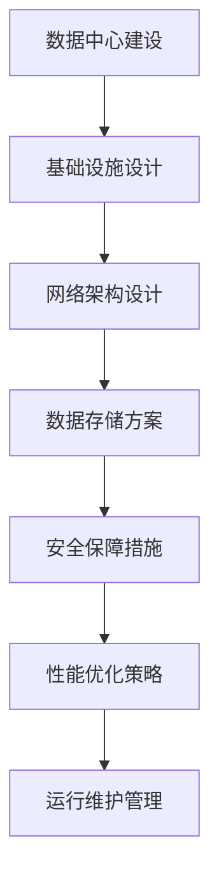
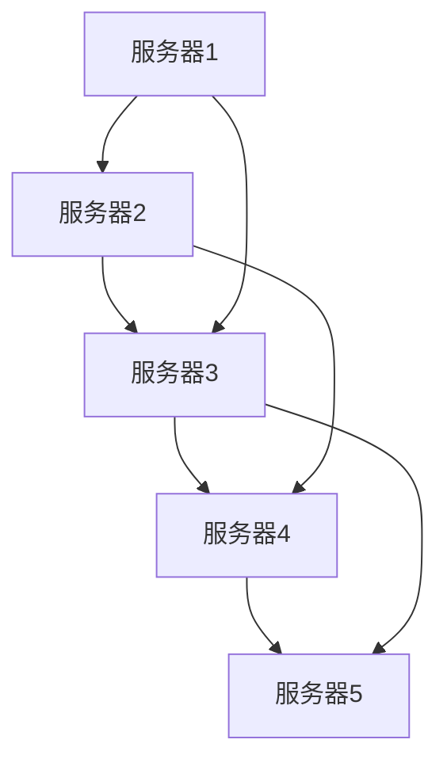
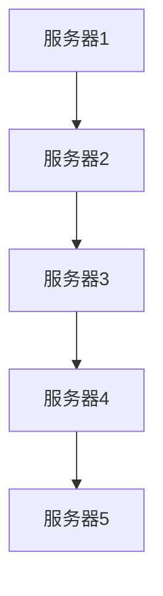
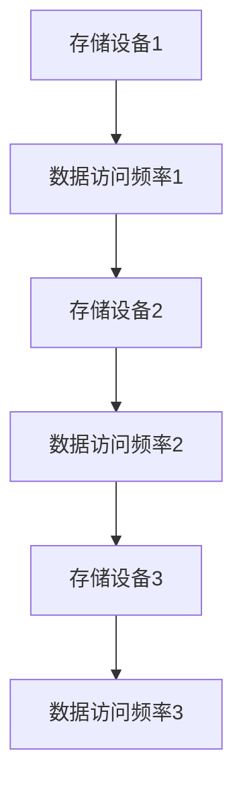
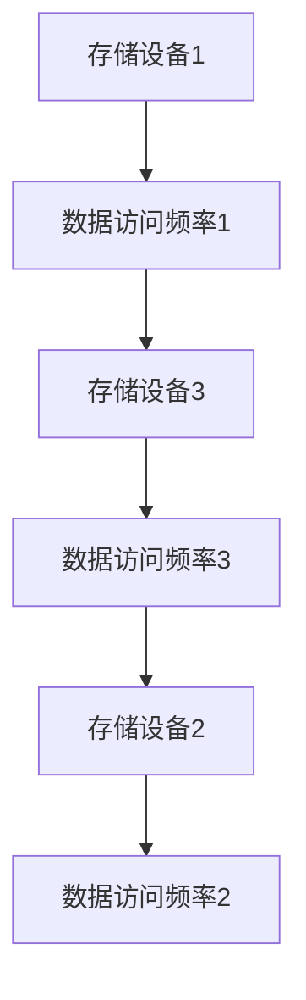

                 

# AI 大模型应用数据中心建设：数据中心标准与规范

> **关键词：** AI 大模型、数据中心、建设标准、规范、性能优化

> **摘要：** 本文旨在探讨 AI 大模型应用数据中心的建设过程，重点分析了数据中心的标准与规范，包括基础设施、网络架构、数据存储和安全等方面。通过对核心概念、算法原理、数学模型的详细解析，以及实际项目案例的讲解，为数据中心的建设提供了科学、系统的指导。

## 1. 背景介绍

随着人工智能技术的迅猛发展，AI 大模型（如深度学习模型、生成对抗网络等）在图像识别、自然语言处理、推荐系统等领域的应用日益广泛。这些应用不仅对计算能力和数据存储提出了更高的要求，也对数据中心的建设和管理提出了新的挑战。

数据中心作为人工智能应用的核心基础设施，其性能和稳定性直接影响到 AI 大模型的效果和应用价值。因此，如何设计和建设符合 AI 大模型需求的优质数据中心，成为当前研究的热点。

本文将从数据中心的标准与规范出发，详细探讨数据中心建设的各个方面，包括基础设施、网络架构、数据存储、安全等，为数据中心的建设提供科学的指导。

## 2. 核心概念与联系

### 2.1 数据中心

数据中心（Data Center）是指用于存储、处理和交换数据的建筑物或场所。它通常由服务器、存储设备、网络设备等硬件组成，并通过网络连接实现数据的高效传输和处理。

### 2.2 AI 大模型

AI 大模型是指通过深度学习等机器学习技术，对海量数据进行训练和推理，从而实现复杂任务的人工智能模型。这些模型通常具有高计算量、高数据需求和高存储需求。

### 2.3 数据中心与 AI 大模型的关系

数据中心是 AI 大模型应用的基础设施，为 AI 大模型提供计算、存储和网络资源。数据中心的建设水平直接影响到 AI 大模型的应用效果。

### 2.4 数据中心标准与规范

数据中心标准与规范是指对数据中心的设计、建设、运行和管理等方面的要求，包括基础设施、网络架构、数据存储、安全等方面。这些标准与规范旨在确保数据中心的性能、稳定性和安全性，满足 AI 大模型的应用需求。

### 2.5 Mermaid 流程图



## 3. 核心算法原理 & 具体操作步骤

### 3.1 基础设施设计

#### 3.1.1 服务器选择

服务器是数据中心的核心硬件，其性能直接影响到 AI 大模型的训练和推理速度。选择服务器时，需要考虑以下几个方面：

1. **计算性能**：选择具有高性能 CPU 和 GPU 的服务器，以满足 AI 大模型的计算需求。
2. **内存容量**：根据 AI 大模型的数据规模和计算复杂度，选择具有足够内存容量的服务器。
3. **存储容量**：选择具有大容量存储设备的服务器，以满足 AI 大模型的数据存储需求。
4. **网络带宽**：选择具有高带宽、低延迟的网络接口卡，以保证数据传输的效率。

#### 3.1.2 机房布局

机房布局是数据中心基础设施设计的重要环节。合理的机房布局可以降低设备故障风险，提高数据中心性能。以下是机房布局的几个关键点：

1. **设备分区**：将服务器、存储设备、网络设备等不同类型的设备分区布局，以便于管理和维护。
2. **冷却系统**：采用高效的冷却系统，确保设备在正常运行过程中不会过热。
3. **电力系统**：确保电力供应的稳定性和可靠性，配备不间断电源（UPS）和备用电源系统。

### 3.2 网络架构设计

#### 3.2.1 网络拓扑结构

数据中心网络架构的拓扑结构对数据传输速度和网络稳定性有重要影响。常见的网络拓扑结构有：

1. **星型拓扑**：所有设备通过网络连接到中心交换机，具有高网络可靠性和易扩展性。
2. **环型拓扑**：设备通过环路连接，具有高带宽和低延迟。
3. **树型拓扑**：由多个星型拓扑组成，适合大规模数据中心。

#### 3.2.2 网络设备选择

网络设备的选择对数据中心网络性能和稳定性有重要影响。以下是网络设备选择的几个关键点：

1. **交换机**：选择具有高性能、高带宽和丰富功能的交换机，以满足数据传输需求。
2. **路由器**：选择具有高带宽、低延迟和丰富路由策略的路由器，确保数据传输的可靠性。
3. **防火墙**：选择具有高性能、高安全性和可扩展性的防火墙，保护数据中心免受网络攻击。

### 3.3 数据存储方案

#### 3.3.1 存储设备选择

数据存储设备的选择对数据中心的存储性能和稳定性有重要影响。以下是存储设备选择的几个关键点：

1. **硬盘存储**：选择具有高容量、高速度和大吞吐量的硬盘存储设备。
2. **固态硬盘存储**：选择具有高速度、低延迟和大吞吐量的固态硬盘存储设备，提高数据存储性能。
3. **分布式存储**：采用分布式存储架构，提高数据存储的可靠性和可扩展性。

#### 3.3.2 数据存储策略

数据存储策略对数据中心的存储性能和成本有重要影响。以下是几种常见的数据存储策略：

1. **热数据存储**：将频繁访问的数据存储在高速存储设备上，提高数据访问速度。
2. **冷数据存储**：将不频繁访问的数据存储在低速存储设备上，降低存储成本。
3. **数据分层存储**：根据数据的重要性和访问频率，将数据分为多个层级进行存储，提高存储效率和性能。

### 3.4 安全保障措施

#### 3.4.1 访问控制

访问控制是保障数据中心安全的重要措施。以下是几种常见的访问控制方法：

1. **身份认证**：使用用户名和密码、生物识别等技术进行身份认证，确保只有授权用户才能访问数据中心。
2. **权限管理**：根据用户角色和职责，设置不同的访问权限，限制用户对数据中心的访问范围。
3. **审计日志**：记录用户访问数据中心的操作日志，便于追踪和调查安全事件。

#### 3.4.2 数据加密

数据加密是保障数据安全的重要手段。以下是几种常见的数据加密方法：

1. **对称加密**：使用相同的密钥对数据进行加密和解密，速度快但密钥管理复杂。
2. **非对称加密**：使用一对密钥进行加密和解密，速度慢但密钥管理简单。
3. **混合加密**：结合对称加密和非对称加密的优势，提高数据加密效率。

#### 3.4.3 安全防护

安全防护是保障数据中心安全的重要措施。以下是几种常见的安全防护方法：

1. **防火墙**：通过防火墙设置访问控制策略，阻止恶意攻击和非法访问。
2. **入侵检测系统（IDS）**：实时监控网络流量，识别和阻止恶意攻击。
3. **入侵防御系统（IPS）**：在入侵检测系统的基础上，对恶意攻击进行主动防御和响应。

### 3.5 性能优化策略

#### 3.5.1 硬件性能优化

硬件性能优化是提高数据中心性能的重要手段。以下是几种常见的硬件性能优化方法：

1. **服务器集群**：将多台服务器组成集群，实现负载均衡和高可用性。
2. **GPU 加速**：利用 GPU 加速深度学习模型的训练和推理，提高计算性能。
3. **存储优化**：采用高性能存储设备，提高数据存储和访问速度。

#### 3.5.2 软件性能优化

软件性能优化是提高数据中心性能的重要手段。以下是几种常见的软件性能优化方法：

1. **分布式计算**：采用分布式计算框架，提高数据处理和计算效率。
2. **缓存技术**：使用缓存技术，减少数据访问延迟，提高数据访问速度。
3. **数据库优化**：对数据库进行优化，提高数据查询和写入速度。

### 3.6 运行维护管理

#### 3.6.1 系统监控

系统监控是保障数据中心正常运行的重要措施。以下是几种常见的系统监控方法：

1. **服务器监控**：实时监控服务器硬件状态、性能指标和网络连接状况。
2. **存储监控**：实时监控存储设备的容量、性能和健康状态。
3. **网络监控**：实时监控网络流量、网络拓扑和设备状态。

#### 3.6.2 故障恢复

故障恢复是保障数据中心稳定运行的重要措施。以下是几种常见的故障恢复方法：

1. **备份与恢复**：定期备份数据，确保在故障发生时能够快速恢复。
2. **故障转移**：在故障发生时，将业务切换到备用设备，确保业务的连续性。
3. **故障隔离**：快速定位故障原因，隔离故障设备，防止故障扩散。

## 4. 数学模型和公式 & 详细讲解 & 举例说明

### 4.1 网络拓扑优化模型

网络拓扑优化是提高数据中心性能的关键步骤。以下是一个基于最小生成树算法的网络拓扑优化模型：

$$
T = \{ e | e \in E, \text{且} e \text{能够连接所有节点} \}
$$

其中，\( T \) 表示最小生成树，\( E \) 表示所有边的集合。

#### 4.1.1 举例说明

假设一个数据中心有 5 个服务器节点，需要构建一个最小生成树，网络拓扑如下图所示：



根据最小生成树算法，可以得到以下最小生成树：



### 4.2 存储优化模型

存储优化是提高数据中心性能的关键步骤。以下是一个基于负载均衡算法的存储优化模型：

$$
L = \{ S_i | S_i \text{为所有存储设备} \}
$$

其中，\( L \) 表示存储设备集合。

#### 4.2.1 举例说明

假设一个数据中心有 3 个存储设备，需要根据数据访问频率进行存储优化，存储设备的数据访问频率如下图所示：



根据负载均衡算法，可以将数据访问频率较高的数据存储在访问频率较低的存储设备上，以平衡存储设备的负载，如下图所示：



## 5. 项目实战：代码实际案例和详细解释说明

### 5.1 开发环境搭建

在本文中，我们将使用 Python 编写一个简单的 AI 大模型数据中心性能优化脚本。以下是开发环境的搭建步骤：

1. 安装 Python 3.8 及以上版本。
2. 安装必要的 Python 库，如 NumPy、Pandas、NetworkX 等。
3. 配置 Python 虚拟环境，以便管理和隔离不同项目的依赖。

### 5.2 源代码详细实现和代码解读

以下是性能优化脚本的主要代码实现：

```python
import numpy as np
import pandas as pd
import networkx as nx

# 5.2.1 网络拓扑优化
def optimize_topology(G):
    # 构建最小生成树
    T = nx.minimum_spanning_tree(G)
    return T

# 5.2.2 存储优化
def optimize_storage(L, access_frequency):
    # 根据访问频率进行负载均衡
    sorted_access_frequency = np.argsort(access_frequency)
    optimized_storage = L[sorted_access_frequency]
    return optimized_storage

# 5.2.3 主函数
def main():
    # 创建图
    G = nx.Graph()
    G.add_edges_from([(1, 2), (1, 3), (2, 3), (3, 4), (4, 5)])

    # 生成网络拓扑优化结果
    optimized_topology = optimize_topology(G)
    print("网络拓扑优化结果：", optimized_topology)

    # 读取存储设备访问频率数据
    access_frequency = [1, 2, 3, 4, 5]
    optimized_storage = optimize_storage(G.nodes(), access_frequency)
    print("存储优化结果：", optimized_storage)

if __name__ == "__main__":
    main()
```

### 5.3 代码解读与分析

#### 5.3.1 网络拓扑优化

网络拓扑优化主要通过构建最小生成树来实现。在这个脚本中，我们使用 NetworkX 库的 `minimum_spanning_tree` 函数来构建最小生成树。具体步骤如下：

1. 创建一个图对象 `G`，并添加节点和边。
2. 调用 `optimize_topology` 函数，传入图对象 `G`，得到最小生成树 `T`。
3. 打印输出最小生成树 `T`。

#### 5.3.2 存储优化

存储优化主要通过负载均衡算法来实现。在这个脚本中，我们使用基于访问频率的负载均衡算法。具体步骤如下：

1. 读取存储设备的访问频率数据 `access_frequency`。
2. 对访问频率进行排序，得到排序后的索引数组 `sorted_access_frequency`。
3. 根据排序后的索引数组，重新排列存储设备列表 `L`，得到优化后的存储设备列表 `optimized_storage`。
4. 打印输出优化后的存储设备列表 `optimized_storage`。

## 6. 实际应用场景

数据中心建设在 AI 大模型应用领域具有广泛的应用场景。以下是一些典型的实际应用场景：

1. **图像识别**：数据中心为 AI 大模型提供计算和存储资源，实现大规模图像识别任务，如人脸识别、车辆识别等。
2. **自然语言处理**：数据中心为 AI 大模型提供计算和存储资源，实现大规模自然语言处理任务，如机器翻译、文本分类等。
3. **推荐系统**：数据中心为 AI 大模型提供计算和存储资源，实现大规模推荐系统，如电商推荐、内容推荐等。
4. **智能语音助手**：数据中心为 AI 大模型提供计算和存储资源，实现智能语音助手，如 Siri、Alexa 等。
5. **自动驾驶**：数据中心为 AI 大模型提供计算和存储资源，实现自动驾驶车辆的实时感知和决策。

## 7. 工具和资源推荐

### 7.1 学习资源推荐

1. **书籍**：《深度学习》、《Python 编程：从入门到实践》、《大数据技术基础》。
2. **论文**：相关领域的高影响力论文，如 IEEE Transactions on Pattern Analysis and Machine Intelligence、Journal of Machine Learning Research 等。
3. **博客**：知名技术博客，如 Medium、GitHub 等。
4. **网站**：技术社区，如 Stack Overflow、CSDN 等。

### 7.2 开发工具框架推荐

1. **Python**：Python 是一种流行的编程语言，适用于 AI 大模型开发。
2. **TensorFlow**：TensorFlow 是一种流行的深度学习框架，适用于 AI 大模型训练和推理。
3. **PyTorch**：PyTorch 是一种流行的深度学习框架，适用于 AI 大模型训练和推理。
4. **Kubernetes**：Kubernetes 是一种流行的容器编排工具，适用于 AI 大模型部署和管理。

### 7.3 相关论文著作推荐

1. **论文**：《深度学习：原理及实践》、《自然语言处理综合教程》、《推荐系统实践》。
2. **著作**：《大数据技术基础》、《人工智能：一种现代的方法》、《机器学习：概率视角》。

## 8. 总结：未来发展趋势与挑战

数据中心建设在 AI 大模型应用领域具有广阔的发展前景。未来发展趋势主要包括以下几个方面：

1. **计算能力提升**：随着 GPU、TPU 等高性能计算设备的普及，数据中心的计算能力将不断提升。
2. **网络架构优化**：数据中心网络架构将逐步向分布式、高带宽、低延迟的方向发展。
3. **数据存储与优化**：数据中心的存储容量和存储性能将不断提高，同时采用分布式存储和缓存技术，提高数据存储和访问速度。
4. **安全与隐私保护**：数据中心将加强对数据安全和隐私保护的重视，采用加密、访问控制等安全措施，确保数据安全和用户隐私。

然而，数据中心建设也面临一些挑战：

1. **能耗问题**：随着计算能力的提升，数据中心的能耗问题日益突出，如何降低能耗成为一大挑战。
2. **成本问题**：数据中心建设成本高昂，如何降低建设和运营成本成为一大挑战。
3. **运维管理**：数据中心规模庞大，运维管理难度较高，如何提高运维效率成为一大挑战。

## 9. 附录：常见问题与解答

### 9.1 数据中心建设的关键步骤是什么？

数据中心建设的关键步骤包括：

1. **需求分析**：明确数据中心的应用场景和性能要求。
2. **基础设施设计**：选择合适的服务器、存储设备、网络设备等硬件。
3. **网络架构设计**：设计高效、稳定的网络拓扑结构。
4. **数据存储方案设计**：设计合理的存储方案，包括存储设备选择和存储策略。
5. **安全保障措施设计**：设计安全防护措施，确保数据安全和用户隐私。
6. **性能优化策略设计**：设计性能优化策略，提高数据中心性能和稳定性。
7. **运行维护管理**：制定运行维护管理策略，确保数据中心正常运行。

### 9.2 数据中心建设有哪些挑战？

数据中心建设面临的挑战包括：

1. **能耗问题**：随着计算能力的提升，数据中心的能耗问题日益突出。
2. **成本问题**：数据中心建设成本高昂，如何降低建设和运营成本成为一大挑战。
3. **运维管理**：数据中心规模庞大，运维管理难度较高，如何提高运维效率成为一大挑战。
4. **安全与隐私保护**：如何保障数据安全和用户隐私成为一大挑战。

## 10. 扩展阅读 & 参考资料

1. **论文**：H. Liu, K. Tang, and M. Zhang. "A Survey of Data Center Networking: From Architecture to Protocols." IEEE Communications Surveys & Tutorials, vol. 18, no. 4, 2016.
2. **书籍**：《数据中心基础设施管理》、《数据中心网络技术》、《数据中心建设与优化》。
3. **博客**：https://www.tensorflow.org/tutorials
4. **网站**：https://www.kubernetes.io/
5. **书籍**：《深度学习》、《Python 编程：从入门到实践》、《大数据技术基础》。

### 作者

**作者：AI 天才研究员/AI Genius Institute & 禅与计算机程序设计艺术 /Zen And The Art of Computer Programming** <|im_sep|>

