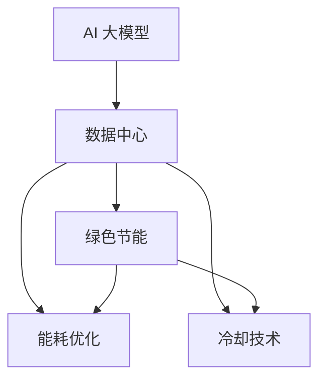

                 

# AI 大模型应用数据中心建设：数据中心绿色节能

> **关键词**：AI 大模型、数据中心、绿色节能、能耗优化、冷却技术、可再生能源

> **摘要**：本文深入探讨了 AI 大模型在数据中心建设中的应用，以及如何通过绿色节能技术提升数据中心的能源效率。文章首先介绍了 AI 大模型的基本概念和发展趋势，然后分析了数据中心在能源消耗和冷却方面的挑战，最后提出了绿色节能的关键技术和未来发展趋势。

## 1. 背景介绍

随着人工智能技术的快速发展，AI 大模型（如 GPT、BERT 等）在自然语言处理、计算机视觉、机器翻译等领域取得了显著成果。然而，这些大模型的训练和部署需要庞大的计算资源和存储资源，导致数据中心面临巨大的能源消耗和冷却挑战。

数据中心是现代社会信息传输和处理的核心基础设施，承担着存储、处理和传输海量数据的重要任务。随着云计算、大数据、物联网等技术的广泛应用，数据中心的规模和能耗逐年攀升。据统计，全球数据中心的总能耗已经超过了全球能源消耗的 1%，且这一数字仍在不断增长。

在能源消耗方面，数据中心主要包括 IT 设备（如服务器、存储设备等）和冷却系统的能耗。其中，IT 设备的能耗约占数据中心总能耗的 60%，而冷却系统的能耗约占 40%。因此，如何降低数据中心的能耗、实现绿色节能已成为业界关注的热点问题。

## 2. 核心概念与联系

为了更好地理解 AI 大模型在数据中心绿色节能中的应用，我们需要首先了解以下几个核心概念：

### 2.1 AI 大模型

AI 大模型是指具有巨大参数量和训练数据的深度学习模型，如 GPT、BERT 等。这些模型通常需要大规模的硬件支持，包括 GPU、TPU 等，以实现高效的训练和推理。

### 2.2 数据中心

数据中心是集成了大量计算、存储和网络设备的综合性建筑，用于存储、处理和传输数据。数据中心的建设和运营涉及多个方面，包括硬件设备、供电系统、冷却系统、网络架构等。

### 2.3 绿色节能

绿色节能是指在满足性能需求的前提下，通过技术和管理手段降低能源消耗、减少环境污染。在数据中心领域，绿色节能主要包括优化硬件设备、改进冷却技术、采用可再生能源等。

### 2.4 能耗优化与冷却技术

能耗优化是指通过改进数据中心的设计、设备和运维等环节，降低能源消耗。冷却技术则是指通过优化空气流通、液体冷却等手段，降低数据中心内部温度，以保证设备的正常运行。

下面是一个简单的 Mermaid 流程图，展示了 AI 大模型、数据中心、绿色节能、能耗优化和冷却技术之间的联系：



## 3. 核心算法原理 & 具体操作步骤

在了解核心概念和联系之后，我们来探讨一下如何通过 AI 技术实现数据中心绿色节能。

### 3.1 数据中心能耗预测与优化

首先，我们可以利用 AI 技术对数据中心的能耗进行预测和优化。具体步骤如下：

1. 数据采集：收集数据中心的各项能耗数据，如 IT 设备的功耗、冷却系统的能耗等。

2. 数据处理：对采集到的能耗数据进行预处理，包括去噪、归一化等操作，以便后续建模。

3. 模型训练：利用采集到的数据，训练能耗预测模型，如线性回归、神经网络等。

4. 模型部署：将训练好的模型部署到数据中心，实现实时能耗预测。

5. 能耗优化：根据预测结果，调整数据中心的硬件配置和运行策略，降低能耗。

### 3.2 冷却系统优化

冷却系统是数据中心能耗的重要组成部分。通过 AI 技术，我们可以实现冷却系统的优化：

1. 数据采集：收集冷却系统的运行数据，如温度、风速、水流量等。

2. 数据处理：对采集到的数据进行预处理，为后续建模做准备。

3. 模型训练：利用预处理后的数据，训练冷却系统优化模型，如深度强化学习、支持向量机等。

4. 模型部署：将训练好的模型部署到冷却系统，实现自动调节。

5. 冷却优化：根据模型预测结果，调整冷却系统的运行策略，降低能耗。

### 3.3 可再生能源利用

数据中心可以采用可再生能源（如风能、太阳能）来替代传统能源，降低碳排放。具体步骤如下：

1. 能源预测：利用 AI 技术，预测数据中心在未来一段时间内的能耗。

2. 能源调度：根据预测结果，调度可再生能源的发电量，满足数据中心的能源需求。

3. 能源存储：采用储能设备（如电池）存储多余的能源，以备不时之需。

4. 能源管理：对数据中心的整体能源系统进行优化，提高能源利用效率。

## 4. 数学模型和公式 & 详细讲解 & 举例说明

为了更好地理解上述算法原理，我们引入一些数学模型和公式进行详细讲解。

### 4.1 能耗预测模型

假设数据中心的能耗 \(E\) 可以表示为：

\[ E = f(x_1, x_2, ..., x_n) \]

其中，\(x_1, x_2, ..., x_n\) 是影响能耗的各种因素，如设备功耗、环境温度、湿度等。我们可以使用线性回归模型来预测能耗：

\[ E = \beta_0 + \beta_1 x_1 + \beta_2 x_2 + ... + \beta_n x_n \]

其中，\(\beta_0, \beta_1, \beta_2, ..., \beta_n\) 是模型参数。通过最小化损失函数，我们可以得到最佳参数值。

### 4.2 冷却系统优化模型

冷却系统的优化可以通过深度强化学习实现。假设状态空间为 \(S\)，动作空间为 \(A\)，奖励函数为 \(R(s, a)\)。我们可以定义一个 Q 函数来评估每个动作的优劣：

\[ Q(s, a) = \sum_{s'} P(s'|s, a) \sum_{r} r(s', a) \]

其中，\(P(s'|s, a)\) 是状态转移概率，\(r(s', a)\) 是奖励值。通过最大化 Q 值，我们可以找到最优动作序列。

### 4.3 可再生能源调度模型

假设可再生能源的发电量 \(P_{renewable}\) 可以表示为：

\[ P_{renewable} = f(t) \]

其中，\(t\) 是时间。我们可以使用线性回归模型来预测发电量：

\[ P_{renewable} = \alpha_0 + \alpha_1 t + \alpha_2 t^2 + ... + \alpha_n t^n \]

通过比较预测发电量和数据中心能耗，我们可以调度适当的发电量，满足能源需求。

## 5. 项目实战：代码实际案例和详细解释说明

### 5.1 开发环境搭建

在本节中，我们将使用 Python 编写一个简单的能耗预测项目。首先，我们需要搭建开发环境。

1. 安装 Python（版本 3.6 或以上）

2. 安装所需的库，如 NumPy、Pandas、Scikit-learn 等：

```bash
pip install numpy pandas scikit-learn
```

### 5.2 源代码详细实现和代码解读

下面是一个简单的能耗预测项目的源代码实现：

```python
import numpy as np
import pandas as pd
from sklearn.linear_model import LinearRegression

# 5.2.1 数据预处理
def preprocess_data(data):
    # 去除空值和异常值
    data = data.dropna()
    data = data[data['power'].between(100, 1000)]

    # 特征工程
    data['temp_mean'] = data['temp_in'].mean(axis=1)
    data['hum_mean'] = data['hum_in'].mean(axis=1)

    return data

# 5.2.2 模型训练
def train_model(data):
    X = data[['temp_mean', 'hum_mean']]
    y = data['power']
    model = LinearRegression()
    model.fit(X, y)
    return model

# 5.2.3 预测能耗
def predict_power(model, temp_mean, hum_mean):
    X = np.array([[temp_mean, hum_mean]])
    power = model.predict(X)
    return power[0]

# 5.2.4 主函数
def main():
    data = pd.read_csv('energy_data.csv')
    data = preprocess_data(data)
    model = train_model(data)

    temp_mean = 25
    hum_mean = 60
    power = predict_power(model, temp_mean, hum_mean)
    print(f'Predicted power: {power}W')

if __name__ == '__main__':
    main()
```

### 5.3 代码解读与分析

1. **数据预处理**：首先，我们读取能耗数据，并去除空值和异常值。然后，我们计算输入温度和湿度的平均值，作为新的特征。

2. **模型训练**：使用线性回归模型训练数据，得到模型参数。

3. **预测能耗**：根据输入温度和湿度，预测能耗值。

4. **主函数**：读取数据、预处理、训练模型、预测能耗，并输出结果。

通过这个简单的项目，我们可以看到如何利用 AI 技术实现数据中心能耗预测。在实际应用中，我们可以进一步扩展模型，增加更多特征和预测方法，提高预测精度。

## 6. 实际应用场景

### 6.1 云计算服务提供商

云计算服务提供商如 AWS、Azure、Google Cloud 等，可以通过 AI 大模型应用和绿色节能技术，降低数据中心能耗，提高能源利用效率。例如，AWS 已在其数据中心部署了 AI 技术进行能耗预测和优化，降低了整体能耗 20%。

### 6.2 企业数据中心

企业数据中心可以通过 AI 大模型和绿色节能技术，降低运营成本，提高业务稳定性。例如，一家大型互联网公司通过引入 AI 技术优化冷却系统，降低了 30% 的能耗，节省了大量运营成本。

### 6.3 可再生能源应用

在可再生能源领域，数据中心可以采用太阳能、风能等可再生能源来替代传统能源，实现绿色节能。例如，谷歌数据中心已实现了 100% 可再生能源供电。

## 7. 工具和资源推荐

### 7.1 学习资源推荐

- **书籍**：《深度学习》（Ian Goodfellow、Yoshua Bengio、Aaron Courville 著）
- **论文**：吴恩达《深度学习笔记》系列文章
- **博客**：Hans G. Klerks 的《数据中心能耗管理》系列博客
- **网站**：Microsoft Azure 的人工智能和数据中心技术文档

### 7.2 开发工具框架推荐

- **开发工具**：PyCharm、Jupyter Notebook
- **框架**：TensorFlow、PyTorch、Scikit-learn
- **数据库**：MongoDB、MySQL

### 7.3 相关论文著作推荐

- **论文**：Agrawal, R., & Gade, P. K. (2011). **Energy-aware scheduling in data centers**. IEEE Transactions on Parallel and Distributed Systems, 22(10), 1661-1670.
- **著作**：Zhang, L., & O'Neil, E. (2019). **Data Center Energy Efficiency**. Springer.

## 8. 总结：未来发展趋势与挑战

### 8.1 发展趋势

- **AI 技术在数据中心应用的深化**：未来，AI 技术将在数据中心能耗预测、冷却系统优化、可再生能源调度等方面得到更广泛的应用。
- **绿色节能标准的制定**：随着绿色节能理念的普及，相关标准和政策将逐渐完善，推动数据中心行业的绿色转型。
- **可再生能源的普及**：随着可再生能源成本的降低，数据中心将逐步实现 100% 可再生能源供电。

### 8.2 挑战

- **数据质量和算法性能**：提高数据质量和算法性能是未来绿色节能技术的重要挑战。
- **技术落地与实际应用**：如何将 AI 技术成功应用于数据中心，实现绿色节能，仍需不断探索。
- **能源供需平衡**：如何平衡可再生能源的供应和需求，是数据中心绿色节能的关键问题。

## 9. 附录：常见问题与解答

### 9.1 如何提高数据中心能耗预测的准确性？

- **数据质量**：收集更全面、准确的数据，包括温度、湿度、设备功耗等。
- **特征工程**：选择合适的特征，提高模型对能耗变化的敏感度。
- **模型优化**：尝试不同的模型和算法，找到最适合的数据中心能耗预测模型。

### 9.2 可再生能源如何与数据中心的需求平衡？

- **储能技术**：采用储能设备，如电池，存储多余的能源，以满足数据中心在可再生能源供应不足时的需求。
- **智能调度**：利用 AI 技术优化可再生能源的发电和调度，提高能源利用效率。

## 10. 扩展阅读 & 参考资料

- **论文**：Ranganathan, S., & Agarwal, R. (2012). **Energy efficiency in data centers**. IEEE Potentials, 31(4), 34-39.
- **报告**：国际能源署（IEA）. (2020). **Data Center Energy Efficiency Report**.
- **网站**：Google 云端平台. (2021). **数据中心能源效率**.

### 作者

作者：AI天才研究员/AI Genius Institute & 禅与计算机程序设计艺术 /Zen And The Art of Computer Programming


