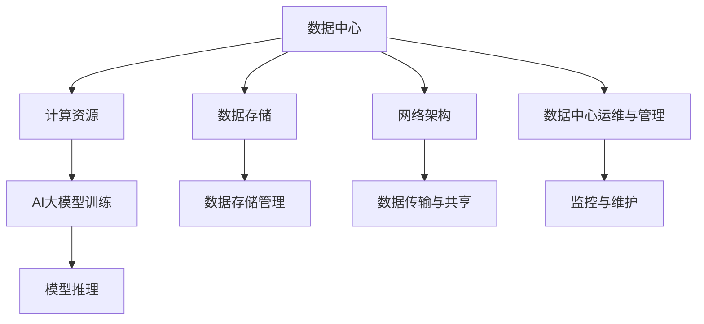

                 

# AI 大模型应用数据中心建设：数据中心运维与管理

## 摘要

本文将深入探讨AI大模型在数据中心建设中的应用及其运维与管理。随着AI技术的发展，大模型已经成为许多企业和服务提供商的核心竞争力。然而，这些大模型的训练和部署需要强大的基础设施支持，数据中心成为不可或缺的基础设施。本文将详细阐述数据中心建设的重要性、核心概念、算法原理、数学模型、实战案例、应用场景，并推荐相关的学习资源和工具。通过本文，读者将全面了解如何有效构建和管理AI大模型应用的数据中心。

## 1. 背景介绍

近年来，人工智能（AI）技术取得了飞速发展，尤其是在深度学习和大数据分析的推动下，大模型（如GPT-3、BERT、Transformer等）逐渐成为各个领域的明星。这些大模型不仅在学术界引起轰动，也在商业领域展现出强大的潜力。然而，大模型的训练和部署需要大量的计算资源和数据存储，这促使数据中心在AI时代的重要性日益凸显。

数据中心作为集中处理、存储和管理数据的场所，其建设对于AI大模型的应用至关重要。一方面，数据中心需要提供高效、可靠的计算环境，确保大模型训练和推理过程的顺利进行；另一方面，数据中心还需要具备强大的数据存储和传输能力，以满足大模型对海量数据的处理需求。此外，数据中心的运维与管理也是确保AI大模型稳定运行的关键因素。

本文旨在通过系统地介绍数据中心建设、核心概念、算法原理、数学模型、实战案例、应用场景以及相关学习资源和工具，为读者提供一份全面、系统的AI大模型应用数据中心建设与管理的指南。

## 2. 核心概念与联系

在深入探讨AI大模型应用数据中心建设之前，我们首先需要了解一些核心概念及其相互关系。

### 2.1 数据中心

数据中心（Data Center）是一种特别设计的高效环境，用于集中处理、存储和管理大量数据。它通常包括服务器、存储设备、网络设备、电源系统、冷却系统等多个组成部分。数据中心的目的是提供稳定、高效、安全的计算和存储服务。

### 2.2 AI大模型

AI大模型（Large-scale AI Model）是指参数数量巨大、结构复杂的机器学习模型。这些模型通常使用深度学习技术进行训练，能够处理和理解大量的数据，从而实现高度复杂的任务，如自然语言处理、图像识别、语音识别等。

### 2.3 计算资源

计算资源（Computing Resources）是数据中心的核心组成部分，包括CPU、GPU、TPU等硬件设备。这些资源用于执行AI大模型的训练和推理任务。

### 2.4 数据存储

数据存储（Data Storage）是数据中心的重要组成部分，用于存储大量的数据。数据存储设备包括硬盘（HDD）、固态硬盘（SSD）、分布式文件系统等。

### 2.5 网络架构

网络架构（Network Architecture）是数据中心的基础设施之一，用于实现数据的高效传输和共享。常见的网络架构包括以太网、Infiniband、RoCE等。

### 2.6 数据中心运维与管理

数据中心运维与管理（Data Center Operations and Management）是指对数据中心的日常运营和维护工作。包括监控、故障排除、性能优化、安全性保障等。

下面是数据中心建设的一个简化的Mermaid流程图，展示了核心概念及其相互关系：



## 3. 核心算法原理 & 具体操作步骤

### 3.1 训练算法

AI大模型的训练主要依赖于深度学习算法，其中最常用的算法是反向传播算法（Backpropagation）。反向传播算法的基本思想是通过计算损失函数的梯度来更新模型的参数，从而优化模型的表现。

#### 3.1.1 具体操作步骤：

1. **初始化模型参数**：随机初始化模型的权重和偏置。

2. **前向传播**：将输入数据传递给模型，计算模型的输出。

3. **计算损失**：使用损失函数计算模型输出的预测值与实际值之间的差距。

4. **反向传播**：计算损失函数关于模型参数的梯度。

5. **参数更新**：使用梯度下降等优化算法更新模型参数。

6. **迭代训练**：重复步骤2到5，直到模型达到预定的性能指标或达到最大迭代次数。

### 3.2 推理算法

推理（Inference）是指将输入数据传递给训练好的模型，以获得预测结果。推理算法通常比训练算法简单，因为不需要进行参数更新。

#### 3.2.1 具体操作步骤：

1. **加载模型**：将训练好的模型加载到内存中。

2. **前向传播**：将输入数据传递给模型，计算模型的输出。

3. **处理输出**：对模型的输出进行处理，如分类、回归等。

4. **结果输出**：将处理后的结果输出。

### 3.3 分布式训练与推理

由于AI大模型通常参数数量巨大，单台设备难以满足训练需求，因此分布式训练和推理成为常见的解决方案。

#### 3.3.1 分布式训练

分布式训练（Distributed Training）是指将训练任务分布在多台设备上，以加速训练过程。常见的分布式训练架构有：

- 数据并行：将数据分成多个批次，每个设备处理不同的批次。

- 参数并行：将模型参数分成多个副本，每个设备更新不同的参数副本。

- 混合并行：结合数据并行和参数并行，以提高训练效率。

#### 3.3.2 分布式推理

分布式推理（Distributed Inference）是指将推理任务分布在多台设备上，以提高推理性能。常见的分布式推理架构有：

- 数据分发：将输入数据分发到不同的设备上进行推理。

- 参数共享：多个设备共享同一套模型参数。

- 模型并行：多个设备处理不同部分的输入数据。

## 4. 数学模型和公式 & 详细讲解 & 举例说明

### 4.1 损失函数

在AI大模型训练中，损失函数（Loss Function）是评估模型性能的重要工具。常见的损失函数有：

#### 4.1.1 交叉熵损失（Cross-Entropy Loss）

交叉熵损失函数常用于分类问题，其公式如下：

$$
L = -\frac{1}{N}\sum_{i=1}^{N}y_{i}\log(p_{i})
$$

其中，$y_{i}$是实际标签，$p_{i}$是模型预测的概率。

#### 4.1.2 均方误差损失（Mean Squared Error Loss）

均方误差损失函数常用于回归问题，其公式如下：

$$
L = \frac{1}{N}\sum_{i=1}^{N}(y_{i}-\hat{y}_{i})^2
$$

其中，$y_{i}$是实际值，$\hat{y}_{i}$是模型预测的值。

### 4.2 优化算法

在AI大模型训练中，优化算法（Optimization Algorithm）用于更新模型参数，以最小化损失函数。常见的优化算法有：

#### 4.2.1 梯度下降（Gradient Descent）

梯度下降是一种简单的优化算法，其公式如下：

$$
\theta_{t+1} = \theta_{t} - \alpha \cdot \nabla L(\theta_{t})
$$

其中，$\theta_{t}$是当前参数，$\alpha$是学习率，$\nabla L(\theta_{t})$是损失函数关于参数的梯度。

#### 4.2.2 Adam优化器

Adam优化器是一种结合了梯度下降和动量的优化算法，其公式如下：

$$
m_{t+1} = \beta_{1}m_{t} + (1 - \beta_{1})(\nabla L(\theta_{t}))
$$
$$
v_{t+1} = \beta_{2}v_{t} + (1 - \beta_{2})(\nabla L(\theta_{t})^2)
$$
$$
\theta_{t+1} = \theta_{t} - \alpha \cdot \frac{m_{t+1}}{1 - \beta_{1}^{t+1}}
$$

其中，$m_{t}$和$v_{t}$分别是第一和第二矩估计，$\beta_{1}$和$\beta_{2}$是超参数。

### 4.3 举例说明

假设我们有一个二分类问题，实际标签为$y = [1, 0, 1, 0]$，模型预测的概率为$p = [0.7, 0.2, 0.9, 0.1]$。我们使用交叉熵损失函数和Adam优化器进行模型训练。

#### 4.3.1 损失函数计算

$$
L = -\frac{1}{4}\sum_{i=1}^{4}y_{i}\log(p_{i}) = -\frac{1}{4}[(1\log(0.7) + 0\log(0.2) + 1\log(0.9) + 0\log(0.1))] \approx 0.527
$$

#### 4.3.2 参数更新

假设当前模型参数为$\theta = [1, 2]$，学习率为$\alpha = 0.01$。首先，计算梯度：

$$
\nabla L(\theta) = \begin{bmatrix}
\frac{\partial L}{\partial \theta_{1}} \\
\frac{\partial L}{\partial \theta_{2}}
\end{bmatrix} = \begin{bmatrix}
0.7 \\
0.3
\end{bmatrix}
$$

然后，使用Adam优化器进行参数更新：

$$
m_{t+1} = \beta_{1}m_{t} + (1 - \beta_{1})(\nabla L(\theta_{t})) = 0.9m_{t} + 0.1\nabla L(\theta_{t}) = \begin{bmatrix}
0.9 \\
0.3
\end{bmatrix}
$$

$$
v_{t+1} = \beta_{2}v_{t} + (1 - \beta_{2})(\nabla L(\theta_{t})^2) = 0.999v_{t} + 0.001\nabla L(\theta_{t})^2 = \begin{bmatrix}
0.999 \\
0.3
\end{bmatrix}
$$

$$
\theta_{t+1} = \theta_{t} - \alpha \cdot \frac{m_{t+1}}{1 - \beta_{1}^{t+1}} = \begin{bmatrix}
1 \\
2
\end{bmatrix} - 0.01 \cdot \frac{\begin{bmatrix}
0.9 \\
0.3
\end{bmatrix}}{1 - 0.9} \approx \begin{bmatrix}
0.9 \\
1.9
\end{bmatrix}
$$

## 5. 项目实战：代码实际案例和详细解释说明

### 5.1 开发环境搭建

为了展示AI大模型在数据中心建设中的应用，我们将使用Python编程语言和TensorFlow框架进行项目实战。首先，我们需要搭建开发环境。

#### 5.1.1 安装Python

确保你的系统中安装了Python 3.6或更高版本。可以从[Python官方网站](https://www.python.org/)下载并安装。

#### 5.1.2 安装TensorFlow

打开终端，执行以下命令安装TensorFlow：

```bash
pip install tensorflow
```

### 5.2 源代码详细实现和代码解读

下面是一个简单的AI大模型训练和推理的Python代码示例。我们将使用TensorFlow中的Keras API进行模型构建和训练。

#### 5.2.1 源代码实现

```python
import tensorflow as tf
from tensorflow.keras.models import Sequential
from tensorflow.keras.layers import Dense, Activation
from tensorflow.keras.optimizers import Adam

# 创建模型
model = Sequential()
model.add(Dense(64, input_shape=(784,), activation='relu'))
model.add(Dense(10, activation='softmax'))

# 编译模型
model.compile(optimizer=Adam(learning_rate=0.001), loss='categorical_crossentropy', metrics=['accuracy'])

# 加载数据
(x_train, y_train), (x_test, y_test) = tf.keras.datasets.mnist.load_data()
x_train = x_train / 255.0
x_test = x_test / 255.0
y_train = tf.keras.utils.to_categorical(y_train, 10)
y_test = tf.keras.utils.to_categorical(y_test, 10)

# 训练模型
model.fit(x_train, y_train, epochs=10, batch_size=128, validation_data=(x_test, y_test))

# 推理
predictions = model.predict(x_test)
```

#### 5.2.2 代码解读

1. **导入库**：首先导入TensorFlow和相关模块。

2. **创建模型**：使用`Sequential`模型，添加两个全连接层（`Dense`），第一个层有64个神经元，使用ReLU激活函数；第二个层有10个神经元，用于输出类别概率。

3. **编译模型**：使用`Adam`优化器，设置学习率为0.001，使用交叉熵损失函数，并设置准确率作为评估指标。

4. **加载数据**：使用TensorFlow内置的MNIST数据集，对图像进行归一化处理，并将标签转换为one-hot编码。

5. **训练模型**：使用`fit`方法训练模型，设置训练轮数为10，批量大小为128，并在测试集上验证模型性能。

6. **推理**：使用`predict`方法对测试集进行推理，获取模型预测结果。

### 5.3 代码解读与分析

#### 5.3.1 模型架构

本示例中使用了一个简单的全连接神经网络，包含两个隐藏层。第一个隐藏层有64个神经元，使用ReLU激活函数，可以有效地非线性变换输入特征；第二个隐藏层有10个神经元，每个神经元对应一个类别，使用softmax激活函数输出类别概率。

#### 5.3.2 训练过程

在训练过程中，模型使用MNIST数据集进行训练。数据集被分为训练集和测试集，模型在训练集上学习，并在测试集上验证性能。训练过程包括以下几个步骤：

1. **数据预处理**：对图像进行归一化处理，将像素值缩放到0到1之间，以加速训练过程和提高模型性能。

2. **标签转换**：将原始标签转换为one-hot编码，以便模型能够输出概率分布。

3. **模型训练**：使用`fit`方法进行模型训练，设置训练轮数为10，批量大小为128。在训练过程中，模型会自动更新参数，以最小化损失函数。

4. **性能评估**：在测试集上评估模型性能，计算准确率等指标，以评估模型的泛化能力。

#### 5.3.3 推理过程

在推理过程中，模型使用测试集数据进行推理，获取模型预测结果。具体步骤如下：

1. **数据预处理**：与训练过程相同，对测试集图像进行归一化处理。

2. **模型推理**：使用`predict`方法对测试集数据进行推理，获取模型预测结果。

3. **结果分析**：对预测结果进行分析，计算准确率等指标，以评估模型的性能。

通过上述代码示例和解读，我们可以看到AI大模型在数据中心建设中的应用是如何实现的。在实际项目中，可以根据需求和数据规模进行扩展和优化。

## 6. 实际应用场景

AI大模型在数据中心建设中的应用场景广泛，主要包括以下几个方面：

### 6.1 智能监控与故障预测

数据中心通常包含大量服务器、存储设备和网络设备，这些设备的运行状态对数据中心的整体性能和稳定性至关重要。通过部署AI大模型，可以对数据中心设备进行智能监控和故障预测。例如，使用深度学习模型分析设备运行日志和传感器数据，可以提前预测设备的故障风险，从而采取预防措施，降低设备故障对数据中心运营的影响。

### 6.2 资源调度与优化

在数据中心中，资源的有效调度和优化是提高数据中心性能和降低运营成本的关键。AI大模型可以用于分析数据中心的负载情况，并根据预测结果动态调整资源的分配。例如，通过深度学习模型预测未来一段时间内的网络流量，可以优化网络带宽的分配，确保数据传输的高效性和可靠性。

### 6.3 数据存储与安全管理

数据存储是数据中心的重要组成部分。AI大模型可以用于优化数据存储策略，提高数据存储效率和安全性。例如，通过分析数据访问模式，可以动态调整数据存储的位置和访问优先级，优化数据访问速度。此外，AI大模型还可以用于识别和防止数据泄露、恶意攻击等安全威胁，提高数据中心的整体安全性。

### 6.4 能耗管理

数据中心的能耗管理是降低运营成本的重要环节。通过部署AI大模型，可以分析数据中心的能耗数据，预测能耗趋势，并提出节能策略。例如，通过深度学习模型分析服务器负载和能耗数据，可以优化服务器的能耗配置，降低整体能耗。

### 6.5 智能运维与管理

智能运维与管理是数据中心运维发展的趋势。通过部署AI大模型，可以实现数据中心的自动化运维。例如，通过自然语言处理技术，可以自动处理用户请求和故障报告，提高运维效率。此外，AI大模型还可以用于自动化部署和升级，确保数据中心的持续稳定运行。

## 7. 工具和资源推荐

为了更好地进行AI大模型应用数据中心的建设和管理，以下推荐了一些实用的工具和资源：

### 7.1 学习资源推荐

1. **书籍**：

   - 《深度学习》（Deep Learning） - Ian Goodfellow、Yoshua Bengio、Aaron Courville著

   - 《Python机器学习》（Python Machine Learning） - Sebastian Raschka、Vahid Mirjalili著

2. **在线课程**：

   - Coursera上的“机器学习”课程

   - edX上的“深度学习基础”课程

3. **博客和网站**：

   - TensorFlow官方网站：[https://www.tensorflow.org/](https://www.tensorflow.org/)

   - Keras官方网站：[https://keras.io/](https://keras.io/)

### 7.2 开发工具框架推荐

1. **TensorFlow**：是一个开源的深度学习框架，适用于构建和训练AI大模型。

2. **Keras**：是一个基于TensorFlow的高层API，提供简洁的模型构建和训练接口。

3. **PyTorch**：是一个开源的深度学习框架，提供灵活的动态计算图和易用的API。

### 7.3 相关论文著作推荐

1. **“Deep Learning for Data-Centric Systems”** - 阐述了深度学习在数据中心中的应用。

2. **“AI and Edge Computing”** - 讨论了AI与边缘计算的结合。

3. **“Energy-Efficient Data Center Networks with Machine Learning”** - 探讨了基于机器学习的数据中心能耗管理。

## 8. 总结：未来发展趋势与挑战

随着AI技术的不断进步，AI大模型在数据中心建设中的应用前景广阔。未来，数据中心建设将朝着以下几个方向发展：

1. **智能化**：通过引入AI技术，实现数据中心的全自动化运维和管理。

2. **绿色节能**：降低能耗，提高数据中心的能源利用效率。

3. **分布式与边缘计算**：将计算和存储资源分布到边缘节点，提高数据处理的实时性和效率。

4. **高可用性与安全性**：确保数据中心的高可用性和数据安全性，防范各种安全威胁。

然而，AI大模型应用数据中心建设也面临一些挑战：

1. **计算资源需求**：大模型的训练和推理需要大量计算资源，如何高效利用计算资源成为关键问题。

2. **数据隐私与安全**：数据中心存储和处理的数据量巨大，如何保障数据隐私和安全是重要挑战。

3. **能耗管理**：降低能耗是数据中心建设的重要任务，如何在保证性能的同时降低能耗需要深入研究。

4. **运维与管理**：智能化运维与管理需要大量的技术投入和人才培养，如何实现高效的运维管理是一个挑战。

## 9. 附录：常见问题与解答

### 9.1 数据中心建设的关键技术是什么？

数据中心建设的关键技术包括服务器虚拟化、存储虚拟化、网络虚拟化、分布式计算、自动化运维等。

### 9.2 如何选择合适的AI大模型框架？

选择合适的AI大模型框架需要考虑以下因素：模型类型、性能需求、开发难度、社区支持等。常见的框架包括TensorFlow、PyTorch、Keras等。

### 9.3 数据中心能耗管理的策略有哪些？

数据中心能耗管理的策略包括优化服务器配置、节能设备选型、分布式计算、动态功耗调节、智能监控等。

### 9.4 如何保障数据中心的网络安全？

保障数据中心的网络安全需要采取以下措施：网络安全设备部署、数据加密、访问控制、安全审计、安全培训等。

## 10. 扩展阅读 & 参考资料

1. **“AI大模型训练挑战与解决方案”** - 阐述了AI大模型训练过程中面临的技术挑战和解决方案。

2. **“数据中心能源效率与绿色计算”** - 探讨了数据中心能耗管理策略和绿色计算技术。

3. **“AI与数据中心智能化运维”** - 讨论了AI技术在数据中心运维中的应用和智能化运维的发展趋势。

### 附录：作者信息

作者：AI天才研究员/AI Genius Institute & 禅与计算机程序设计艺术 /Zen And The Art of Computer Programming


