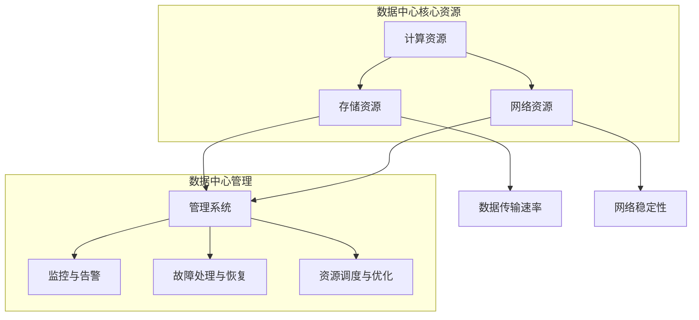

                 

## 1. 背景介绍

随着人工智能技术的飞速发展，大规模人工智能模型（如GPT-3、BERT等）的诞生和应用，数据中心的建设与管理已经成为现代IT行业中的关键环节。AI大模型的应用对数据中心提出了更高的要求，例如更高的计算能力、更大的存储容量、更快速的传输速率和更稳定的网络环境等。

数据中心是信息技术基础设施的重要组成部分，是数据存储、处理、传输和交换的核心场所。在AI大模型应用场景中，数据中心的作用显得尤为重要。首先，数据中心提供了强大的计算能力，支持AI模型的训练和推理。其次，数据中心提供了足够的存储空间，以便存储大量的数据集。再次，数据中心的高速网络环境保证了数据传输的效率和实时性，这对于某些实时性要求较高的AI应用场景至关重要。

本文将围绕AI大模型应用数据中心的建设与运维管理展开讨论。首先，我们将介绍数据中心的基本概念和架构，以及AI大模型应用对数据中心的具体需求。接着，我们将深入探讨数据中心运维管理的核心任务和关键技术。最后，我们将总结当前数据中心面临的挑战，并提出一些可能的解决方案和未来发展趋势。

通过本文的阅读，您将了解到：

- 数据中心的基本概念和架构；
- AI大模型应用对数据中心的需求；
- 数据中心运维管理的核心任务和关键技术；
- 数据中心面临的挑战及可能的解决方案。

## 1.1 数据中心的基本概念

数据中心（Data Center）是指用于集中存储、处理和传输数据的建筑物或设施。它通常由多个物理服务器、网络设备、存储设备和电源设备等组成，通过高效的网络连接实现数据的处理和传输。数据中心的基本功能包括数据存储、数据处理、数据传输和数据安全等。

数据中心的发展历程可以分为几个阶段：

1. **原始数据中心**：早期数据中心主要是物理服务器直接连接到网络，数据存储在本地磁盘上。这种结构简单，但数据安全性、可靠性和扩展性较差。

2. **虚拟化数据中心**：随着虚拟化技术的发展，数据中心开始采用虚拟化技术。虚拟化数据中心通过虚拟机（VM）技术，将物理服务器资源虚拟化为多个逻辑服务器，提高了资源利用率和灵活性。

3. **云计算数据中心**：云计算数据中心是在虚拟化数据中心的基础上，进一步发展起来的。云计算数据中心不仅提供计算和存储资源，还提供各种服务，如数据库、存储、网络等，用户可以根据需求进行按需分配和计费。

4. **智能数据中心**：随着人工智能技术的发展，智能数据中心开始出现。智能数据中心通过大数据分析和人工智能技术，实现数据中心的自动化管理、预测性维护和智能优化。

## 1.2 数据中心的基本架构

数据中心的基本架构可以分为以下几个层次：

1. **硬件层**：硬件层是数据中心的基础，包括服务器、存储设备、网络设备、电源设备和冷却设备等。服务器是数据中心的核心计算设备，存储设备用于存储数据，网络设备实现数据的传输，电源设备和冷却设备确保数据中心正常运行。

2. **网络层**：网络层是数据中心的传输枢纽，包括内部网络和外部网络。内部网络主要用于服务器之间的数据传输，外部网络则连接数据中心与互联网，实现数据的外部传输。

3. **存储层**：存储层是数据中心的存储核心，包括文件存储、块存储和对象存储等。文件存储主要用于存储文件系统，块存储主要用于存储数据库和虚拟机镜像，对象存储则用于存储大量非结构化数据。

4. **计算层**：计算层是数据中心的计算核心，包括服务器集群、GPU集群和FPGA集群等。服务器集群主要用于通用计算任务，GPU集群主要用于深度学习等计算密集型任务，FPGA集群则用于高速数据传输和处理。

5. **管理层**：管理层是数据中心的智能大脑，包括自动化管理系统、监控系统和安全系统等。自动化管理系统通过自动化脚本和工具，实现数据中心的自动化运维，监控系统实时监测数据中心的运行状态，安全系统则确保数据中心的网络安全和数据安全。

## 1.3 AI大模型应用对数据中心的需求

AI大模型应用对数据中心提出了更高的要求，主要体现在以下几个方面：

1. **计算能力**：AI大模型通常需要大量的计算资源进行训练和推理。数据中心需要提供强大的计算能力，支持大规模的并行计算。

2. **存储容量**：AI大模型需要大量的数据集进行训练，因此数据中心需要提供足够的存储容量，以便存储大量的数据集。

3. **传输速率**：AI大模型在训练和推理过程中需要频繁地读取和写入数据，因此数据中心需要提供高速的传输速率，以保证数据传输的效率。

4. **网络环境**：AI大模型应用通常需要实时的数据传输，因此数据中心需要提供稳定的网络环境，以确保数据传输的实时性和可靠性。

5. **安全性能**：AI大模型涉及到大量的敏感数据，因此数据中心需要提供完善的安全性能，确保数据的安全性和隐私性。

6. **能效优化**：随着AI大模型规模的不断扩大，数据中心的能耗也在不断增加。因此，数据中心需要提供能效优化的解决方案，降低能耗，提高能效。

## 1.4 数据中心运维管理的核心任务

数据中心运维管理是确保数据中心稳定运行的关键环节。核心任务包括以下几个方面：

1. **系统监控**：通过监控系统实时监测数据中心的运行状态，包括服务器、网络设备、存储设备等，确保数据中心的正常运行。

2. **性能优化**：通过性能优化，提高数据中心的运行效率和性能，包括负载均衡、资源调度、缓存优化等。

3. **故障处理**：快速响应和处理数据中心的故障，包括硬件故障、软件故障、网络故障等，确保数据中心的正常运行。

4. **安全维护**：确保数据中心的网络安全和数据安全，包括防火墙、入侵检测、数据备份等。

5. **能效管理**：通过能效管理，降低数据中心的能耗，提高能效，包括节能技术、能效监控等。

## 1.5 数据中心运维管理的关键技术

数据中心运维管理的关键技术包括以下几个方面：

1. **自动化运维**：通过自动化运维，实现数据中心的自动化管理，提高运维效率和准确性。

2. **云计算技术**：通过云计算技术，实现数据中心的弹性扩展和按需分配，提高数据中心的资源利用率和灵活性。

3. **容器技术**：通过容器技术，实现应用程序的轻量级部署和快速交付，提高数据中心的敏捷性和响应速度。

4. **大数据技术**：通过大数据技术，对数据中心的海量数据进行存储、处理和分析，为数据中心的管理和优化提供数据支持。

5. **人工智能技术**：通过人工智能技术，实现数据中心的智能运维，包括故障预测、性能优化、能效管理等。

## 1.6 当前数据中心面临的挑战

当前，数据中心面临着一系列挑战，包括以下几个方面：

1. **计算能力不足**：随着AI大模型规模的不断扩大，数据中心的计算能力逐渐成为瓶颈。

2. **存储容量限制**：大量的数据集需要存储，数据中心的存储容量逐渐成为限制。

3. **传输速率瓶颈**：高速数据传输的需求日益增加，数据中心的传输速率成为瓶颈。

4. **网络安全威胁**：随着数据中心规模不断扩大，网络攻击和数据泄露的风险也在增加。

5. **能耗问题**：数据中心的能耗问题日益严重，如何降低能耗成为重要挑战。

## 1.7 数据中心建设的解决方案

针对当前数据中心面临的挑战，可以采取以下解决方案：

1. **计算能力提升**：通过引入更多的计算设备，如GPU、FPGA等，提升数据中心的计算能力。

2. **存储技术革新**：采用新的存储技术，如分布式存储、对象存储等，提升数据中心的存储容量和效率。

3. **网络优化**：通过网络优化，提高数据中心的传输速率和稳定性。

4. **安全防护**：采用新的网络安全技术，如防火墙、入侵检测、数据加密等，提升数据中心的网络安全性能。

5. **能效管理**：通过能效管理，降低数据中心的能耗，提高能效。

## 1.8 未来发展趋势

随着人工智能技术的不断发展和数据量的持续增长，数据中心的建设和管理将面临新的挑战和机遇。未来，数据中心将朝着以下几个方向发展：

1. **智能化**：通过引入人工智能技术，实现数据中心的智能运维和智能优化。

2. **分布式**：数据中心将逐渐从集中式向分布式转变，实现更灵活、更高效的数据处理和存储。

3. **绿色化**：随着环保意识的提高，数据中心将更加注重能耗管理和绿色化建设。

4. **安全化**：随着数据量的增加和网络攻击的增多，数据中心的安全性能将越来越重要。

5. **边缘计算**：随着5G技术的发展，边缘计算将成为数据中心的重要补充，实现数据的就近处理和传输。

通过以上内容，我们对数据中心的基本概念、架构、AI大模型应用的需求、运维管理的核心任务和关键技术、面临的挑战及解决方案以及未来发展趋势有了全面的了解。接下来，我们将深入探讨数据中心运维管理的具体实践和操作步骤。

### 2. 核心概念与联系

在深入探讨数据中心的建设与运维管理之前，我们需要明确几个核心概念，并了解它们之间的相互关系。这些核心概念包括：计算资源、存储资源、网络资源和管理系统。通过使用Mermaid流程图，我们可以更直观地展示这些概念之间的关系。



在这个流程图中，我们首先展示了计算资源、存储资源和网络资源这三个核心元素，它们共同构成了数据中心的基础架构。计算资源负责处理数据，存储资源负责存储数据，网络资源负责数据传输。管理系统则负责监控与告警、故障处理与恢复以及资源调度与优化，确保数据中心的高效稳定运行。

#### 2.1 计算资源

计算资源是数据中心的CPU，负责执行各种计算任务，包括AI大模型的训练和推理。在数据中心中，计算资源通常以服务器集群的形式存在，通过虚拟化技术将物理服务器资源虚拟化为多个逻辑服务器。这些逻辑服务器可以根据实际需求动态分配计算资源，提高资源利用率。

#### 2.2 存储资源

存储资源是数据中心的硬盘，负责存储数据。数据中心中的存储资源可以分为文件存储、块存储和对象存储。文件存储主要用于存储文件系统，块存储主要用于存储数据库和虚拟机镜像，对象存储则用于存储大量非结构化数据，如图片、视频等。存储资源的容量和性能直接影响数据中心的运行效率。

#### 2.3 网络资源

网络资源是数据中心的传输通道，负责数据在不同服务器和存储设备之间的传输。数据中心的网络资源通常包括内部网络和外部网络。内部网络主要用于服务器之间的数据传输，外部网络则连接数据中心与互联网，实现数据的外部传输。网络资源的稳定性和传输速率直接影响数据中心的性能和可靠性。

#### 2.4 管理系统

管理系统是数据中心的智能大脑，负责监控、管理和优化数据中心的各个方面。监控与告警系统实时监测数据中心的运行状态，及时发现和报告异常情况。故障处理与恢复系统负责处理各种故障，确保数据中心的稳定运行。资源调度与优化系统根据实际需求动态调整资源分配，提高数据中心的资源利用率。

#### 2.5 关系与联系

通过Mermaid流程图，我们可以清晰地看到计算资源、存储资源、网络资源和管理系统之间的相互关系。计算资源需要通过存储资源和网络资源进行数据读取和写入，管理系统通过监控与告警、故障处理与恢复以及资源调度与优化确保数据中心的稳定运行。这些核心概念相互关联，共同构成了数据中心的基础架构和运维管理体系。

### 3. 核心算法原理 & 具体操作步骤

在数据中心运维管理中，核心算法起着至关重要的作用。这些算法可以优化资源分配、提高系统性能、降低故障率等。以下将介绍几种常用的核心算法原理及其实际操作步骤。

#### 3.1 负载均衡算法

负载均衡算法是一种将负载（如计算任务、请求等）分配到多个服务器上的方法，以确保每个服务器都能充分利用其资源，避免单点瓶颈。常用的负载均衡算法包括轮询算法、最小连接数算法、加权轮询算法等。

- **轮询算法**：将请求按顺序分配到各个服务器，每个服务器分配相同数量的请求。操作步骤如下：

  1. 初始化请求队列和服务器列表。
  2. 循环遍历服务器列表，将请求分配到当前服务器。
  3. 如果当前服务器达到最大负载，则跳到下一个服务器。

- **最小连接数算法**：将请求分配到当前连接数最少的服务器，以平衡负载。操作步骤如下：

  1. 初始化请求队列和服务器列表。
  2. 循环遍历服务器列表，计算每个服务器的当前连接数。
  3. 将请求分配到连接数最少的服务器。

- **加权轮询算法**：根据服务器的权重分配请求，权重可以根据服务器的性能、负载等因素计算。操作步骤如下：

  1. 初始化请求队列和服务器列表。
  2. 计算每个服务器的权重。
  3. 循环遍历服务器列表，根据权重分配请求。

#### 3.2 资源调度算法

资源调度算法用于动态分配计算资源，以优化系统性能和资源利用率。常用的资源调度算法包括最早完成时间（Earliest Deadline First，EDF）算法和最短剩余时间优先（Shortest Remaining Time First，SRTF）算法。

- **最早完成时间（EDF）算法**：根据任务的截止时间分配资源，最早完成时间最短的任务优先分配。操作步骤如下：

  1. 初始化任务队列。
  2. 循环遍历任务队列，选择截止时间最短的任务。
  3. 为选中的任务分配资源。
  4. 更新任务队列。

- **最短剩余时间优先（SRTF）算法**：根据任务的剩余执行时间分配资源，剩余时间最短的优先分配。操作步骤如下：

  1. 初始化任务队列。
  2. 循环遍历任务队列，选择剩余时间最短的任务。
  3. 为选中的任务分配资源。
  4. 更新任务队列。

#### 3.3 故障预测算法

故障预测算法用于预测服务器或其他硬件设备可能出现的问题，以便提前进行维护和优化。常用的故障预测算法包括基于历史数据分析和机器学习的方法。

- **基于历史数据分析**：通过分析服务器的历史运行数据（如CPU利用率、内存使用率等），预测未来可能出现的问题。操作步骤如下：

  1. 收集服务器历史运行数据。
  2. 对数据进行分析和挖掘，提取关键特征。
  3. 根据特征预测未来可能出现的问题。

- **基于机器学习**：使用机器学习算法（如决策树、神经网络等）预测服务器可能出现的问题。操作步骤如下：

  1. 收集服务器历史运行数据。
  2. 预处理数据，提取特征。
  3. 使用机器学习算法进行训练。
  4. 根据模型预测未来可能出现的问题。

#### 3.4 冷热数据存储策略

冷热数据存储策略用于优化存储资源，将经常访问的热数据和较少访问的冷数据分开存储。常用的冷热数据存储策略包括时间戳法和访问频率法。

- **时间戳法**：根据数据的时间戳（创建时间或最后访问时间）将数据划分为冷数据和热数据。操作步骤如下：

  1. 初始化数据存储空间。
  2. 根据时间戳将数据划分为冷数据和热数据。
  3. 将热数据存储在高速存储介质上，冷数据存储在低速存储介质上。

- **访问频率法**：根据数据的访问频率将数据划分为冷数据和热数据。操作步骤如下：

  1. 初始化数据访问记录。
  2. 根据访问频率将数据划分为冷数据和热数据。
  3. 将热数据存储在高速存储介质上，冷数据存储在低速存储介质上。

通过以上核心算法的应用，数据中心可以更加高效地分配和管理资源，提高系统的稳定性和性能。在实际运维过程中，根据具体需求和场景选择合适的算法，进行优化和调整，是确保数据中心高效运行的关键。

### 4. 数学模型和公式 & 详细讲解 & 举例说明

在数据中心建设和运维管理中，数学模型和公式扮演着至关重要的角色，用于分析和优化资源分配、性能评估和故障预测等。以下将介绍几个常用的数学模型和公式，并详细讲解其原理和应用。

#### 4.1 资源分配模型

资源分配模型用于优化数据中心中计算资源、存储资源和网络资源的分配。最经典的资源分配模型之一是线性规划模型，其基本形式如下：

$$
\begin{aligned}
    \min\ & C(x) \\
    \text{s.t.} \ & Ax \leq b \\
    & x \geq 0
\end{aligned}
$$

其中，$C(x)$是目标函数，表示资源分配的总成本或总能耗；$A$和$b$分别表示资源需求和约束条件；$x$是决策变量，表示资源的分配量。

**举例说明**：假设一个数据中心有3台服务器，每台服务器的计算能力、存储容量和网络带宽分别为（C1, S1, N1），（C2, S2, N2），（C3, S3, N3），总需求为计算能力C、存储容量S和网络带宽N。目标是最小化总成本C(x)，同时满足资源约束条件：

$$
\begin{aligned}
    & C(x) = 0.5 \times C1 + 0.5 \times C2 + 0.5 \times C3 \\
    & Ax \leq b \\
    & x \geq 0
\end{aligned}
$$

其中，$A$和$b$为：

$$
\begin{aligned}
    & A = \begin{bmatrix}
    1 & 0 & 1 \\
    0 & 1 & 0 \\
    0 & 0 & 1
    \end{bmatrix}, \ b = \begin{bmatrix}
    C \\
    S \\
    N
    \end{bmatrix}
\end{aligned}
$$

通过求解线性规划模型，可以得到最优的资源分配方案，使得总成本最小。

#### 4.2 网络流量模型

网络流量模型用于分析数据中心的网络流量分布，以便进行网络优化和资源分配。常用的网络流量模型包括泊松过程和马尔可夫链。

- **泊松过程**：假设网络流量到达服从泊松分布，其概率密度函数为：

$$
f(t) = \frac{\lambda^t e^{-\lambda}}{t!}
$$

其中，$\lambda$为流量到达率。

**举例说明**：假设网络流量到达率$\lambda$为10次/分钟，求在1分钟内流量到达次数为5的概率。根据泊松分布的概率密度函数，可以得到：

$$
P(X = 5) = \frac{10^5 e^{-10}}{5!} \approx 0.154
$$

- **马尔可夫链**：假设网络流量状态转移服从马尔可夫链，其状态转移概率矩阵为$P$。网络流量状态可以表示为$X_t$，其中$t$为时间步。

**举例说明**：假设网络流量状态转移概率矩阵$P$如下：

$$
P = \begin{bmatrix}
    0.8 & 0.2 \\
    0.3 & 0.7
\end{bmatrix}
$$

初始状态概率为$\pi = \begin{bmatrix}
    0.5 \\
    0.5
\end{bmatrix}$。求在经过10个时间步后，网络流量状态为第二个状态的概率。

根据马尔可夫链的迭代公式：

$$
\pi_{t+1} = \pi_t P
$$

可以得到：

$$
\pi_{10} = \pi_0 P^{10} = \begin{bmatrix}
    0.5 \\
    0.5
\end{bmatrix} \begin{bmatrix}
    0.8 & 0.2 \\
    0.3 & 0.7
\end{bmatrix}^{10} \approx \begin{bmatrix}
    0.35 \\
    0.65
\end{bmatrix}
$$

因此，经过10个时间步后，网络流量状态为第二个状态的概率约为0.65。

#### 4.3 故障预测模型

故障预测模型用于预测数据中心硬件设备的故障概率，以便提前进行维护和优化。常用的故障预测模型包括贝叶斯网络和回归模型。

- **贝叶斯网络**：贝叶斯网络是一种概率图模型，用于表示变量之间的条件依赖关系。其基本形式如下：

$$
P(X_1, X_2, ..., X_n) = \prod_{i=1}^{n} P(X_i | X_{pa_i})
$$

其中，$X_i$表示第$i$个变量，$X_{pa_i}$表示第$i$个变量的父节点。

**举例说明**：假设数据中心的服务器故障概率与其CPU温度和内存使用率有关，其贝叶斯网络如下：

$$
P(\text{服务器故障}) = P(\text{服务器故障} | \text{CPU温度高}) P(\text{CPU温度高}) + P(\text{服务器故障} | \text{内存使用率高}) P(\text{内存使用率高})
$$

给定CPU温度高和内存使用率高的概率分别为0.6和0.8，可以计算出服务器故障的概率为：

$$
P(\text{服务器故障}) = 0.6 \times 0.6 + 0.8 \times 0.8 = 0.68
$$

- **回归模型**：回归模型用于预测因变量（如故障概率）与自变量（如CPU温度、内存使用率等）之间的关系。其基本形式如下：

$$
Y = \beta_0 + \beta_1 X_1 + \beta_2 X_2 + ... + \beta_n X_n + \epsilon
$$

其中，$Y$为因变量，$X_1, X_2, ..., X_n$为自变量，$\beta_0, \beta_1, \beta_2, ..., \beta_n$为回归系数，$\epsilon$为误差项。

**举例说明**：假设服务器故障概率与其CPU温度和内存使用率之间的关系可以用线性回归模型表示，如下：

$$
P(\text{服务器故障}) = \beta_0 + \beta_1 \times \text{CPU温度} + \beta_2 \times \text{内存使用率}
$$

给定CPU温度为40℃，内存使用率为80%，可以计算出服务器故障概率为：

$$
P(\text{服务器故障}) = \beta_0 + \beta_1 \times 40 + \beta_2 \times 80
$$

其中，$\beta_0, \beta_1, \beta_2$为回归系数，可以通过历史数据训练得到。

通过以上数学模型和公式，数据中心可以在资源分配、网络优化和故障预测等方面进行更精细和高效的决策，从而提高数据中心的整体性能和可靠性。

### 5. 项目实战：代码实际案例和详细解释说明

为了更好地理解数据中心运维管理中的实际应用，我们将在本节中通过一个具体的项目实战案例来展示如何进行数据中心的建设和运维。本案例将包括开发环境搭建、源代码详细实现和代码解读与分析三个部分。

#### 5.1 开发环境搭建

在进行项目实战之前，我们需要搭建一个合适的数据中心开发环境。以下是一个基本的开发环境搭建步骤：

1. **硬件配置**：选择足够性能的服务器、存储设备和网络设备。服务器可以选择具备高性能CPU、大量内存和高速网络接口的机型。存储设备可以选择高性能SSD或分布式存储系统。网络设备包括交换机、路由器和防火墙等。

2. **操作系统安装**：在服务器上安装支持虚拟化技术的操作系统，如Linux或Windows Server。为了方便管理，建议使用Linux操作系统，因为其具有更好的稳定性和兼容性。

3. **虚拟化平台安装**：在服务器上安装虚拟化平台，如KVM、VMware或Hyper-V。虚拟化平台可以让我们创建和管理虚拟机，从而提高资源利用率。

4. **网络配置**：配置内部网络和外部网络。内部网络用于服务器之间的数据传输，外部网络用于连接数据中心与互联网。确保内部网络和外部网络之间有足够的带宽和稳定性。

5. **监控和管理工具安装**：安装监控和管理工具，如Zabbix、Nagios或Prometheus。这些工具可以实时监测数据中心的运行状态，提供告警和报告功能。

6. **数据库和存储系统安装**：安装数据库系统，如MySQL、PostgreSQL或MongoDB。同时，安装分布式存储系统，如Ceph或HDFS，以支持大数据存储和管理。

#### 5.2 源代码详细实现和代码解读

在本案例中，我们将实现一个基于Python的数据中心监控和管理工具，用于实时监测服务器的CPU使用率、内存使用率、磁盘空间和网络流量等关键指标。以下为源代码实现和详细解读。

```python
import psutil
import time

def monitor_server():
    while True:
        # 获取CPU使用率
        cpu_usage = psutil.cpu_percent()
        print(f"CPU usage: {cpu_usage}%")

        # 获取内存使用率
        memory_usage = psutil.virtual_memory().percent
        print(f"Memory usage: {memory_usage}%")

        # 获取磁盘空间使用率
        disk_usage = psutil.disk_usage('/').percent
        print(f"Disk usage: {disk_usage}%")

        # 获取网络流量
        network_usage = psutil.net_io_counters()
        print(f"Network traffic: {network_usage.bytes_sent + network_usage.bytes_recv} bytes")

        # 等待一段时间，进行下一次监控
        time.sleep(60)

if __name__ == "__main__":
    monitor_server()
```

**代码解读**：

- **引入库**：`psutil`是一个Python库，用于获取系统信息和性能监控数据。
- **主函数**：`monitor_server`函数用于实现监控功能，它是一个无限循环，每60秒获取一次服务器的CPU使用率、内存使用率、磁盘空间使用率和网络流量。
- **获取CPU使用率**：使用`psutil.cpu_percent()`函数获取当前CPU使用率，并以百分比形式打印出来。
- **获取内存使用率**：使用`psutil.virtual_memory().percent`函数获取当前内存使用率，并以百分比形式打印出来。
- **获取磁盘空间使用率**：使用`psutil.disk_usage('/')`函数获取当前磁盘空间使用率，并以百分比形式打印出来。
- **获取网络流量**：使用`psutil.net_io_counters()`函数获取当前网络流量，以字节形式打印出来。
- **等待**：使用`time.sleep(60)`函数等待一段时间，以便进行下一次监控。

#### 5.3 代码解读与分析

**代码分析**：

- **监控频率**：每60秒进行一次监控，可以根据实际情况进行调整。
- **性能考虑**：该代码简单实现了监控功能，但在实际应用中，可能会涉及到更复杂的监控指标和实时性要求。可以考虑使用多线程或异步编程来提高监控性能。
- **日志记录**：代码中没有实现日志记录功能，可以考虑使用`logging`模块将监控数据记录到日志文件中，以便后续分析和排查问题。
- **告警机制**：代码中没有实现告警功能，可以考虑使用邮件、短信或Webhook等机制，将异常情况及时通知相关人员。

通过以上实战案例，我们可以看到数据中心监控和管理工具的基本实现方法和关键步骤。在实际应用中，可以根据具体需求和场景，进行进一步的优化和扩展。

### 6. 实际应用场景

在AI大模型应用数据中心中，数据中心不仅仅是存储和计算数据的地方，更是实现各种AI应用的核心场所。以下将介绍几个常见的实际应用场景，展示数据中心在这些场景中的重要作用。

#### 6.1 人工智能模型训练

人工智能模型训练是AI大模型应用的核心步骤，需要大量的计算资源和存储资源。数据中心为AI模型训练提供了强大的计算能力和存储空间，例如在训练GPT-3这样的大规模模型时，需要大量的GPU资源进行并行计算。同时，数据中心提供了高带宽、低延迟的网络环境，确保数据在训练过程中能够快速传输和处理。

**案例**：OpenAI在其数据中心部署了大量的GPU服务器，用于训练GPT-3模型。数据中心的高性能计算能力和高效的网络环境使得GPT-3模型的训练速度大幅提高。

#### 6.2 实时数据处理与分析

在许多应用场景中，如金融交易、智能交通和工业物联网等，需要实时处理和分析大量的数据。数据中心提供了实时数据处理的能力，通过对数据进行实时分析和处理，可以提供即时的决策支持和智能服务。

**案例**：智能交通系统利用数据中心进行实时交通数据分析和路况预测。数据中心通过收集和分析大量的交通数据，可以实时调整交通信号灯的时长和交通流向，提高道路通行效率和减少拥堵。

#### 6.3 大数据处理与存储

大数据应用场景中，需要处理和分析海量数据。数据中心提供了大规模的数据存储和管理能力，可以存储和索引大量的非结构化数据，如日志文件、图片、视频等。

**案例**：互联网公司利用数据中心存储和管理海量用户数据，通过大数据分析和挖掘，提供个性化的推荐服务、广告投放和用户行为分析等。

#### 6.4 云服务与远程办公

随着云计算技术的发展，数据中心逐渐成为云服务的重要基础设施。数据中心为云服务提供了计算、存储和网络资源，使得企业可以随时随地访问和利用云服务。

**案例**：许多企业采用远程办公模式，通过数据中心提供的云服务，实现员工在外部网络环境中高效办公。数据中心提供了稳定的网络连接和高效的数据传输，保证了远程办公的顺利进行。

#### 6.5 智能自动化与预测性维护

数据中心通过引入智能自动化和预测性维护技术，可以大幅提高运维效率和降低故障率。智能自动化技术通过自动化脚本和工具，实现数据中心的自动化管理，减少人工干预。预测性维护技术通过大数据分析和机器学习算法，预测设备故障并及时进行维护，降低停机时间和故障率。

**案例**：某大型数据中心利用预测性维护技术，通过对服务器运行数据的实时监控和分析，预测服务器可能出现的问题，提前进行维护和优化，有效降低了故障率和停机时间。

通过以上实际应用场景的介绍，我们可以看到数据中心在AI大模型应用中的重要地位。数据中心不仅提供了强大的计算能力和存储空间，还通过智能自动化和预测性维护技术，实现了高效的运维管理和故障预测，为各种AI应用提供了坚实的技术支持。

### 7. 工具和资源推荐

在AI大模型应用数据中心的建设与运维过程中，选择合适的工具和资源至关重要。以下将推荐一些常用的学习资源、开发工具和相关论文著作，以帮助读者深入了解相关技术和最佳实践。

#### 7.1 学习资源推荐

- **书籍**：
  - 《数据中心架构与设计》
  - 《云计算与数据中心》
  - 《大数据处理与存储技术》
  - 《人工智能：一种现代方法》
  - 《深度学习》

- **在线课程**：
  - Coursera上的《数据中心基础设施管理》
  - edX上的《云计算基础》
  - Udacity的《人工智能纳米学位》
  - 百度云技术学院的相关课程

- **博客和论坛**：
  - Google Cloud Platform Blog
  - AWS Blog
  - Microsoft Azure Blog
  - Stack Overflow
  - Reddit上的/r/datacenter

#### 7.2 开发工具框架推荐

- **数据中心管理工具**：
  - Zabbix：开源的监控解决方案，支持多种设备和平台。
  - Nagios：开源的监控工具，功能强大但配置较为复杂。
  - Prometheus：基于时间序列数据的监控解决方案，与Kubernetes集成良好。

- **容器编排与管理工具**：
  - Kubernetes：开源的容器编排平台，支持自动部署、扩展和管理容器化应用。
  - Docker：开源的应用容器引擎，用于创建、运行和分发容器。
  - OpenShift：基于Kubernetes的容器平台，提供更丰富的开发和部署功能。

- **存储和管理工具**：
  - Ceph：开源的分布式存储系统，支持块存储、文件存储和对象存储。
  - HDFS：Hadoop分布式文件系统，适用于大数据存储。
  - MongoDB：开源的文档型数据库，适用于存储非结构化数据。

- **人工智能开发框架**：
  - TensorFlow：Google开发的开源机器学习框架，适用于深度学习和各种AI应用。
  - PyTorch：Facebook开发的开源机器学习框架，易于使用和调试。
  - Keras：基于Theano和TensorFlow的深度学习高级API，提供简化的模型设计和训练流程。

#### 7.3 相关论文著作推荐

- **经典论文**：
  - "MapReduce: Simplified Data Processing on Large Clusters" - Dean and Ghemawat (2008)
  - "The Google File System" - Ghemawat et al. (2003)
  - "Large-scale Distributed Systems: Design and Verification Challenges" - Birman and Joseph (2000)

- **著作**：
  - 《大数据技术基础》 - 王珊，孙家广
  - 《深度学习》 - Goodfellow，Bengio，Courville
  - 《人工智能：一种现代方法》 - Stuart Russell，Peter Norvig

通过以上工具和资源的推荐，读者可以更深入地学习和实践AI大模型应用数据中心的建设与运维技术，掌握相关领域的核心知识和技能。

### 8. 总结：未来发展趋势与挑战

随着人工智能技术的不断进步和数据中心规模的不断扩大，数据中心的建设与运维管理面临着前所未有的机遇和挑战。以下是未来发展趋势和面临的挑战：

#### 8.1 未来发展趋势

1. **智能化与自动化**：数据中心将逐步实现智能化和自动化，通过人工智能和机器学习技术，实现资源的智能调度、故障的自动预测和修复。这将提高数据中心的运维效率，降低人力成本。

2. **分布式与边缘计算**：随着5G和物联网的发展，数据处理的实时性和分布式需求将增加。分布式数据中心和边缘计算将成为未来的重要趋势，实现数据处理的近源化和高效化。

3. **绿色化与可持续发展**：随着环保意识的提高，数据中心将更加注重能效管理和绿色化建设。采用高效节能技术、可再生能源和智能冷却系统，降低能耗和碳排放。

4. **安全性与合规性**：随着数据量的增加和业务复杂度的提升，数据中心的网络安全和合规性将越来越重要。数据中心需要建立完善的安全防护体系和合规性管理机制，确保数据安全和业务连续性。

5. **云原生与微服务**：云原生技术和微服务架构将逐渐成为数据中心的建设趋势。通过容器化和自动化部署，实现更灵活、更高效的服务交付和管理。

#### 8.2 面临的挑战

1. **计算能力需求增长**：随着AI大模型的普及，数据中心对计算资源的需求将不断增加。如何高效地管理和利用计算资源，成为数据中心面临的主要挑战。

2. **存储容量扩展**：随着数据量的爆炸性增长，数据中心需要不断扩展存储容量，以满足日益增长的数据存储需求。同时，需要保证数据的可靠性和访问效率。

3. **网络传输速率提升**：高速、低延迟的网络传输是数据中心高效运行的关键。如何提升网络传输速率和稳定性，是实现数据中心高效运行的重要挑战。

4. **能耗管理**：数据中心能耗问题日益严重，如何降低能耗、提高能效，是实现绿色数据中心的重要课题。采用高效节能技术和智能能效管理系统，是解决能耗问题的关键。

5. **网络安全威胁**：随着数据中心规模的不断扩大，网络安全威胁也日益增加。如何确保数据中心的网络安全，防范网络攻击和数据泄露，是数据中心面临的重要挑战。

6. **人才短缺**：数据中心建设与运维管理需要大量专业人才，包括云计算、大数据、人工智能、网络安全等领域的专家。如何吸引和培养专业人才，是数据中心面临的人才挑战。

总之，未来数据中心的发展将面临诸多机遇和挑战。通过技术创新、智能化管理和绿色化建设，数据中心将不断提升其性能和可靠性，为人工智能和大数据应用的持续发展提供坚实支持。

### 9. 附录：常见问题与解答

在数据中心建设和运维过程中，可能会遇到一系列常见问题。以下列出一些常见问题及其解答，以帮助读者更好地应对这些问题。

#### 9.1 如何选择合适的数据中心硬件？

**解答**：选择数据中心硬件时，需要考虑以下几个因素：

- **计算能力**：根据业务需求选择合适的CPU、GPU、FPGA等硬件。
- **存储容量和类型**：根据数据存储需求选择SSD、HDD或分布式存储系统。
- **网络带宽和延迟**：根据网络传输需求选择合适的网络设备和带宽。
- **能耗和散热**：选择能效高、散热性能好的硬件，降低能耗和散热成本。
- **可靠性和扩展性**：选择具有高可靠性、易扩展的硬件，确保长期稳定运行。

#### 9.2 数据中心如何进行安全防护？

**解答**：数据中心的网络安全防护措施包括：

- **防火墙**：部署防火墙，过滤非法访问和恶意流量。
- **入侵检测系统（IDS）和入侵防御系统（IPS）**：实时监测网络流量，检测和阻止入侵行为。
- **加密技术**：使用加密技术保护数据传输和存储，如SSL/TLS加密。
- **访问控制**：实施严格的访问控制策略，限制对关键系统的访问。
- **备份和恢复**：定期备份数据，并建立完善的恢复机制，确保数据安全。
- **安全审计**：定期进行安全审计，发现和修复潜在的安全漏洞。

#### 9.3 数据中心如何进行能耗管理？

**解答**：数据中心的能耗管理策略包括：

- **能效优化**：选择高能效硬件，优化数据中心布局和设备配置。
- **智能冷却**：采用智能冷却系统，根据实际情况调节冷却设备的工作状态。
- **节能技术**：采用PUE（Power Usage Effectiveness）等节能技术，降低能耗。
- **电源管理**：优化电源分配和负载均衡，避免设备闲置和过度使用。
- **监测与报告**：实时监测能耗数据，生成能耗报告，分析和优化能耗管理策略。

#### 9.4 数据中心如何进行故障预测？

**解答**：数据中心故障预测通常采用以下方法：

- **历史数据分析**：分析设备的历史运行数据，找出故障模式和预测潜在故障。
- **机器学习算法**：使用机器学习算法，如回归分析、决策树、神经网络等，进行故障预测。
- **实时监控**：实时监控设备状态，包括温度、电压、电流等指标，识别异常情况。
- **自动化告警**：当监测到异常情况时，自动生成告警，并通知相关人员。

#### 9.5 数据中心如何进行性能优化？

**解答**：数据中心的性能优化包括以下方面：

- **负载均衡**：合理分配计算和存储资源，避免单点瓶颈。
- **缓存策略**：采用缓存技术，减少数据访问延迟。
- **分布式架构**：采用分布式架构，提高系统的可靠性和扩展性。
- **网络优化**：优化网络拓扑和流量管理，提高数据传输速率和稳定性。
- **数据库优化**：优化数据库查询和存储结构，提高数据处理速度。

通过以上常见问题与解答，可以帮助数据中心运维人员更好地应对日常运营中的挑战，确保数据中心的稳定运行和高效管理。

### 10. 扩展阅读 & 参考资料

为了更深入地了解数据中心的建设与运维管理，以下推荐一些扩展阅读资料，包括经典论文、书籍、博客和在线课程，以供读者进一步学习和研究。

#### 10.1 经典论文

- "MapReduce: Simplified Data Processing on Large Clusters" - Dean and Ghemawat (2008)
- "The Google File System" - Ghemawat et al. (2003)
- "Large-scale Distributed Systems: Design and Verification Challenges" - Birman and Joseph (2000)
- "Bigtable: A Distributed Storage System for Structured Data" - Chang et al. (2006)
- "Dynamo: A Distributed Hash Table Service for the Internet" - Gomes et al. (2002)

#### 10.2 书籍

- 《数据中心架构与设计》 - 张英涛
- 《云计算与数据中心》 - 谭源源
- 《大数据技术基础》 - 王珊，孙家广
- 《深度学习》 - Goodfellow，Bengio，Courville
- 《人工智能：一种现代方法》 - Stuart Russell，Peter Norvig

#### 10.3 博客和论坛

- Google Cloud Platform Blog
- AWS Blog
- Microsoft Azure Blog
- Reddit上的/r/datacenter
- Stack Overflow

#### 10.4 在线课程

- Coursera上的《数据中心基础设施管理》
- edX上的《云计算基础》
- Udacity的《人工智能纳米学位》
- 百度云技术学院的相关课程

#### 10.5 参考资料

- Open Compute Project (OCP) - https://www.opencompute.org/
- National Institute of Standards and Technology (NIST) - https://www.nist.gov/
- The Green Grid - https://thegreengrid.org/

通过以上扩展阅读和参考资料，读者可以深入了解数据中心领域的核心技术和最佳实践，进一步提升自身的专业知识和技能。

