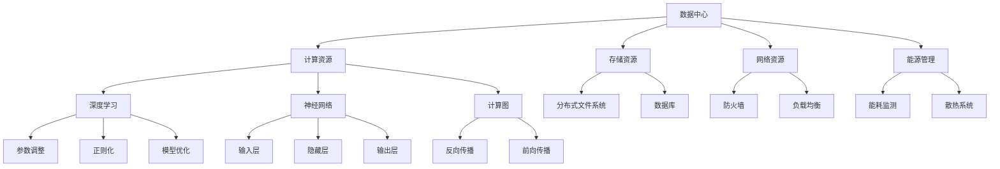

                 

### 背景介绍

#### 数据中心的重要性

在当今信息化时代，数据中心已成为企业和组织的关键基础设施。随着人工智能（AI）、大数据、云计算等技术的迅速发展，数据中心的角色和重要性愈发凸显。数据中心不仅是数据存储和处理的中枢，更是业务运行和决策支持的核心。因此，如何构建高效、稳定、安全的数据中心，成为企业面临的重要挑战。

#### AI 大模型的发展趋势

近年来，AI 大模型技术取得了显著的突破，尤其是在自然语言处理（NLP）、计算机视觉、语音识别等领域。这些技术不仅推动了各类应用的创新，也对数据中心的建设提出了新的要求。AI 大模型对计算资源、数据存储、网络带宽等都有较高的需求，这对数据中心的规划、设计、运营带来了新的挑战。

#### 数据中心运营与管理的关键点

数据中心运营与管理涉及多个方面，包括硬件选型、网络架构、数据安全、能源管理、冷却系统等。此外，数据中心还需要应对数据洪流、设备故障、网络攻击等突发情况。为了确保数据中心的稳定运行，运营管理团队需要具备丰富的专业知识和应对策略。

### 为什么需要撰写本文

本文旨在系统地介绍 AI 大模型应用数据中心的建设和运营管理。通过对数据中心的关键要素、技术架构、操作步骤、实际应用场景的深入分析，帮助读者全面了解数据中心建设与运营的方方面面。本文还将推荐一些相关工具和资源，以供读者学习和实践。

### 关键词

- 数据中心
- AI 大模型
- 数据中心建设
- 数据中心运营
- 数据中心管理

### 摘要

本文将探讨 AI 大模型应用数据中心的建设和运营管理。首先，我们介绍了数据中心的重要性以及 AI 大模型的发展趋势。接着，本文详细分析了数据中心运营与管理的关键点，包括硬件选型、网络架构、数据安全、能源管理等。然后，本文通过一个具体案例，展示了 AI 大模型应用数据中心的建设过程。最后，本文推荐了一些相关工具和资源，以供读者深入学习和实践。

---

#### 1. 数据中心概述

##### 定义与作用

数据中心（Data Center），是指为组织或企业提供数据存储、处理、传输和管理服务的专门场所。它通常由一系列高度集成的计算机系统、网络设备和存储设备组成，能够处理海量数据并提供高速计算能力。数据中心在现代企业和组织中发挥着至关重要的作用，不仅支持业务流程的顺畅运行，还为决策提供了重要的数据支持。

##### 基本架构

一个典型的数据中心通常包括以下几个关键部分：

1. **硬件设施**：包括服务器、存储设备、网络设备、UPS（不间断电源）和冷却系统等。
2. **网络架构**：通过高性能网络连接各个设备和系统，确保数据的高效传输和访问。
3. **存储系统**：包括文件存储、数据库存储、块存储等，用于存储和管理数据。
4. **安全管理**：包括防火墙、入侵检测、数据加密等，确保数据的安全和隐私。
5. **能源管理**：通过智能能源管理系统，优化能源使用，降低运营成本。

##### 发展历程

数据中心的发展历程可以追溯到20世纪60年代，当时的数据中心主要是由大型计算机和磁带库组成。随着计算技术和网络技术的发展，数据中心的规模和复杂性也在不断提升。特别是近年来，云计算和大数据技术的兴起，进一步推动了数据中心的建设和优化。

#### 2. AI 大模型的发展现状

##### 定义与特点

AI 大模型（AI Large Models）是指通过深度学习等方法训练的、具有大规模参数和复杂结构的神经网络模型。这些模型通常包含数十亿个参数，能够处理和理解海量数据，并实现高度复杂的任务。AI 大模型具有以下几个显著特点：

1. **规模庞大**：参数数量通常在数百万到数十亿之间。
2. **计算密集**：需要大量的计算资源进行训练和推理。
3. **数据处理能力强**：能够处理多种类型的数据，如文本、图像、语音等。
4. **自适应能力**：通过不断学习和优化，能够适应不同的应用场景。

##### 技术演进

AI 大模型的发展经历了几个重要的阶段：

1. **早期的简单模型**：如单层感知机、支持向量机等，这些模型规模较小，计算能力有限。
2. **深度学习**：2006年，深度学习（Deep Learning）的出现标志着 AI 大模型的诞生。随着深度神经网络的提出，AI 大模型开始取得显著突破。
3. **大规模模型**：2012年，AlexNet在ImageNet竞赛中取得了突破性的成绩，标志着深度学习进入大规模模型时代。此后，BERT、GPT、ViT 等大规模模型相继出现，推动了 AI 大模型技术的发展。

##### 应用领域

AI 大模型在多个领域取得了显著的应用成果：

1. **自然语言处理（NLP）**：如机器翻译、文本生成、问答系统等。
2. **计算机视觉**：如图像分类、目标检测、图像生成等。
3. **语音识别**：如语音识别、语音合成等。
4. **推荐系统**：如个性化推荐、广告投放等。

#### 3. 数据中心与 AI 大模型的联系

##### 资源需求

AI 大模型的训练和推理需要大量的计算资源和存储资源，这对数据中心提出了较高的要求。具体来说，以下几个方面是数据中心需要特别关注的：

1. **计算资源**：AI 大模型需要高性能的计算设备，如 GPU、TPU 等，以支持大规模并行计算。
2. **存储资源**：AI 大模型需要大量的存储空间来存储数据和模型参数，同时需要高性能的存储系统来保证数据的高效读取和写入。
3. **网络资源**：AI 大模型需要高速、稳定的网络连接，以支持数据的高效传输和模型之间的协同计算。

##### 集群架构

为了满足 AI 大模型的资源需求，数据中心通常采用分布式集群架构。分布式集群通过多个计算节点协同工作，提供强大的计算能力和存储能力。具体来说，分布式集群包括以下几个关键组成部分：

1. **计算节点**：每个计算节点都配备有高性能的计算设备，如 GPU、TPU 等，能够独立处理数据。
2. **存储节点**：存储节点负责存储数据和模型参数，通常采用分布式存储系统，如 HDFS、Ceph 等。
3. **调度系统**：调度系统负责管理计算资源和存储资源，根据任务需求智能调度资源，确保系统的高效运行。

##### 性能优化

为了提高 AI 大模型在数据中心中的性能，数据中心还需要进行一系列性能优化。这些优化包括：

1. **网络优化**：通过优化网络架构和传输协议，提高数据传输速度和稳定性。
2. **存储优化**：通过采用高速存储设备、缓存技术和数据压缩技术，提高数据存储和读取速度。
3. **计算优化**：通过分布式计算和并行计算技术，提高计算效率，减少计算延迟。

##### 安全保障

AI 大模型的训练和推理过程涉及大量的敏感数据，数据中心需要采取严格的安全措施来保障数据的安全和隐私。这些措施包括：

1. **数据加密**：对存储和传输的数据进行加密，防止数据泄露和篡改。
2. **访问控制**：通过访问控制机制，确保只有授权用户可以访问数据。
3. **安全审计**：对数据中心的操作进行审计，确保操作的可追溯性和安全性。

#### 4. 数据中心建设中的挑战

##### 技术挑战

数据中心建设面临多种技术挑战，尤其是与 AI 大模型相关的问题：

1. **计算资源分配**：如何合理分配计算资源，确保任务的高效执行。
2. **数据存储与管理**：如何高效存储和管理海量数据，保证数据的一致性和可用性。
3. **网络传输与优化**：如何优化网络传输，提高数据传输速度和稳定性。
4. **能耗优化**：如何降低能耗，提高数据中心的能源利用效率。

##### 运营挑战

数据中心运营过程中也会面临一系列挑战：

1. **设备故障**：如何快速识别和修复设备故障，确保系统的稳定运行。
2. **数据安全**：如何保障数据的安全和隐私，防止数据泄露和网络攻击。
3. **成本控制**：如何在保证服务质量的前提下，控制数据中心的运营成本。
4. **人力资源**：如何招聘和培养专业人才，提升数据中心的管理水平。

##### 管理挑战

数据中心管理包括多个方面，需要协调和优化：

1. **策略制定**：如何制定科学合理的运营策略，提高数据中心的运营效率。
2. **流程优化**：如何优化运营流程，减少不必要的环节和操作，提高工作效率。
3. **风险管理**：如何识别和应对各种风险，确保数据中心的稳定运营。
4. **质量管理**：如何建立质量管理体系，确保数据中心的各项服务符合质量标准。

#### 5. AI 大模型在数据中心建设中的应用案例

##### 案例一：Google 的数据中心建设

Google 作为全球领先的互联网公司，其数据中心建设在 AI 大模型应用方面有着丰富的经验。Google 的数据中心采用分布式集群架构，配备了高性能的计算设备和存储设备，以支持 AI 大模型的训练和推理。具体来说，Google 的数据中心包括以下几个关键组成部分：

1. **计算节点**：Google 使用大量的 GPU 和 TPU 进行计算，确保 AI 大模型的高效训练和推理。
2. **存储节点**：Google 使用分布式存储系统，如 Google File System（GFS），以确保海量数据的高效存储和管理。
3. **调度系统**：Google 使用内部开发的调度系统，如 Borg，对计算资源和存储资源进行智能调度，确保任务的高效执行。

##### 案例二：阿里巴巴的 AI 大模型应用

阿里巴巴作为全球领先的电子商务公司，在 AI 大模型应用方面也有着丰富的经验。阿里巴巴通过建设高效的数据中心，支持其电商平台的智能推荐和语音识别等功能。具体来说，阿里巴巴的数据中心包括以下几个关键组成部分：

1. **计算节点**：阿里巴巴使用大量的 GPU 和 TPU 进行计算，支持 AI 大模型的训练和推理。
2. **存储节点**：阿里巴巴使用分布式存储系统，如 HDFS 和 Ceph，以确保海量数据的高效存储和管理。
3. **调度系统**：阿里巴巴使用内部开发的调度系统，如 MaxCompute，对计算资源和存储资源进行智能调度，确保任务的高效执行。

##### 案例三：腾讯的 AI 大模型应用

腾讯作为全球领先的互联网公司，在 AI 大模型应用方面也有着丰富的经验。腾讯通过建设高效的数据中心，支持其社交平台和游戏业务的智能推荐和语音识别等功能。具体来说，腾讯的数据中心包括以下几个关键组成部分：

1. **计算节点**：腾讯使用大量的 GPU 和 TPU 进行计算，支持 AI 大模型的训练和推理。
2. **存储节点**：腾讯使用分布式存储系统，如 HDFS 和 Ceph，以确保海量数据的高效存储和管理。
3. **调度系统**：腾讯使用内部开发的调度系统，如 TaaS，对计算资源和存储资源进行智能调度，确保任务的高效执行。

#### 6. 总结

本文介绍了 AI 大模型应用数据中心的建设和运营管理。首先，我们分析了数据中心的基本概念、重要性以及 AI 大模型的发展现状。接着，我们探讨了数据中心与 AI 大模型的联系，包括资源需求、集群架构、性能优化和安全性保障。然后，我们通过具体案例展示了 AI 大模型在数据中心建设中的应用。最后，我们总结了数据中心建设中的挑战以及如何应对这些挑战。

总之，AI 大模型应用数据中心的建设和运营管理是一个复杂而关键的过程，需要充分考虑技术、运营和管理等方面的因素。通过科学规划、合理布局和精细管理，可以构建高效、稳定、安全的数据中心，为 AI 大模型的应用提供强有力的支持。未来，随着 AI 大模型技术的不断进步，数据中心的建设和运营管理也将面临新的机遇和挑战。

---

#### 2. 核心概念与联系

##### 2.1 数据中心的关键概念

在讨论 AI 大模型应用数据中心的建设时，了解以下几个关键概念是非常重要的：

1. **数据中心（Data Center）**：是一个集成了服务器、存储设备、网络设备和电力系统的物理设施，用于存储、处理和管理大量数据。
2. **计算资源（Compute Resources）**：包括服务器、GPU、TPU 等设备，用于执行计算任务。
3. **存储资源（Storage Resources）**：包括磁盘、SSD、分布式文件系统等，用于存储数据。
4. **网络资源（Networking Resources）**：包括交换机、路由器、防火墙等设备，用于数据传输和网络安全。
5. **能源管理（Energy Management）**：通过优化电力消耗和散热系统，提高数据中心的能源效率。

##### 2.2 AI 大模型的关键概念

AI 大模型涉及到以下关键概念：

1. **深度学习（Deep Learning）**：是一种基于多层神经网络的学习方法，通过反向传播算法优化模型参数。
2. **神经网络（Neural Networks）**：是模仿人脑神经元结构和功能的计算模型，由多个层（输入层、隐藏层和输出层）组成。
3. **计算图（Computational Graph）**：用于表示神经网络中的计算流程，包括变量、函数和操作。
4. **参数（Parameters）**：神经网络中的可调参数，用于调整模型的行为。
5. **正则化（Regularization）**：用于防止模型过拟合的技术，包括 L1、L2 正则化等。

##### 2.3 数据中心与 AI 大模型的关系

数据中心与 AI 大模型的关系可以用以下 Mermaid 流程图表示：



在这个流程图中，数据中心为 AI 大模型提供了必要的计算、存储、网络和能源资源。深度学习框架利用这些资源构建和训练神经网络，通过计算图和反向传播算法进行参数调整和模型优化。

### 3. 核心算法原理 & 具体操作步骤

#### 3.1 算法原理

在 AI 大模型应用数据中心的建设和运营中，核心算法原理主要包括深度学习算法和分布式计算技术。以下将详细介绍这些算法的基本原理和具体操作步骤。

##### 3.1.1 深度学习算法

深度学习（Deep Learning）是一种基于多层神经网络的学习方法，通过反向传播算法优化模型参数。深度学习算法的基本原理包括以下几部分：

1. **神经网络结构**：神经网络由多个层组成，包括输入层、隐藏层和输出层。每个层由多个神经元（节点）组成。
2. **前向传播**：输入数据从输入层传递到隐藏层，再传递到输出层。每个神经元将输入值通过激活函数进行变换，传递给下一层。
3. **损失函数**：用于衡量模型预测值与真实值之间的差距。常见的损失函数包括均方误差（MSE）和交叉熵（Cross-Entropy）。
4. **反向传播**：通过计算损失函数的梯度，将误差反向传播到网络中的每个神经元，更新模型参数。
5. **优化算法**：用于更新模型参数的算法，如梯度下降（Gradient Descent）、Adam 等。

##### 3.1.2 分布式计算技术

分布式计算技术是在大规模数据中心中，通过将计算任务分配到多个节点上并行执行，以提高计算效率和性能。分布式计算技术的基本原理包括以下几部分：

1. **任务分配**：将大规模计算任务分配到多个计算节点上，每个节点独立处理部分任务。
2. **数据传输**：通过高效的数据传输协议和缓存技术，确保数据在节点之间的快速传输和共享。
3. **任务调度**：根据节点负载和任务优先级，动态调度计算任务，确保系统资源的高效利用。
4. **负载均衡**：通过负载均衡算法，将计算任务分配到不同节点上，避免单个节点过载。
5. **容错机制**：通过备份和冗余机制，确保系统在节点故障时能够继续运行。

#### 3.2 具体操作步骤

##### 3.2.1 深度学习算法的具体操作步骤

以下是深度学习算法的具体操作步骤：

1. **数据预处理**：清洗和格式化输入数据，将其转换为神经网络可以处理的格式。
2. **构建神经网络**：根据任务需求，设计神经网络的层数、神经元数量和激活函数等参数。
3. **初始化参数**：随机初始化模型参数。
4. **前向传播**：将输入数据传递到神经网络中，计算每个神经元的输出值。
5. **计算损失**：使用损失函数计算模型预测值与真实值之间的差距。
6. **反向传播**：计算损失函数关于模型参数的梯度，更新模型参数。
7. **迭代训练**：重复执行前向传播和反向传播，逐步优化模型参数。
8. **评估模型**：在验证集上评估模型性能，调整模型参数和超参数。
9. **模型部署**：将训练好的模型部署到生产环境，进行实际任务处理。

##### 3.2.2 分布式计算技术的具体操作步骤

以下是分布式计算技术的具体操作步骤：

1. **集群搭建**：搭建分布式计算集群，包括计算节点和存储节点。
2. **任务分配**：将计算任务分配到不同计算节点上，每个节点独立处理部分任务。
3. **数据传输**：使用高效的数据传输协议（如 RPC、HTTP）和缓存技术（如 Redis、Memcached），确保数据在节点之间的快速传输和共享。
4. **任务调度**：使用调度算法（如轮询、最小完成时间优先等），根据节点负载和任务优先级，动态调度计算任务。
5. **负载均衡**：使用负载均衡算法（如一致性哈希、加权轮询等），将计算任务分配到不同节点上，避免单个节点过载。
6. **容错机制**：使用备份和冗余机制（如主从复制、集群备份等），确保系统在节点故障时能够继续运行。
7. **监控与维护**：监控系统性能，进行故障排查和系统维护，确保系统稳定运行。

通过上述具体操作步骤，我们可以构建一个高效、稳定、可扩展的 AI 大模型应用数据中心，为各类复杂任务提供强大的计算支持和数据处理能力。

### 4. 数学模型和公式 & 详细讲解 & 举例说明

#### 4.1 数学模型

在 AI 大模型应用数据中心的建设中，深度学习算法的核心是多层感知机（Multilayer Perceptron, MLP）。MLP 的数学模型可以表示为：

$$
y = \sigma(W_n \cdot a_{n-1} + b_n)
$$

其中，\(y\) 表示输出层节点的输出，\(\sigma\) 表示激活函数，通常采用 Sigmoid 或ReLU 函数；\(W_n\) 和 \(b_n\) 分别表示权重和偏置；\(a_{n-1}\) 表示前一层节点的输出。

#### 4.2 损失函数

在训练过程中，损失函数用于衡量模型预测值与真实值之间的差距。常见的损失函数包括：

1. **均方误差（MSE, Mean Squared Error）**：

$$
J = \frac{1}{m} \sum_{i=1}^{m} (\hat{y}_i - y_i)^2
$$

其中，\(\hat{y}_i\) 表示模型预测值，\(y_i\) 表示真实值，\(m\) 表示样本数量。

2. **交叉熵（Cross-Entropy）**：

$$
J = -\frac{1}{m} \sum_{i=1}^{m} \sum_{j=1}^{n} y_{ij} \log \hat{y}_{ij}
$$

其中，\(y_{ij}\) 表示第 \(i\) 个样本的第 \(j\) 个类别的真实概率，\(\hat{y}_{ij}\) 表示模型预测的第 \(i\) 个样本的第 \(j\) 个类别的概率。

#### 4.3 梯度下降

在训练过程中，梯度下降算法用于更新模型参数。对于均方误差损失函数，梯度可以表示为：

$$
\frac{\partial J}{\partial W_n} = -2 \cdot (a_{n-1} - y) \cdot \sigma'(z_n)
$$

$$
\frac{\partial J}{\partial b_n} = -2 \cdot (a_{n-1} - y)
$$

其中，\(\sigma'\) 表示激活函数的导数。

#### 4.4 举例说明

假设我们有一个二分类问题，使用一个简单的神经网络进行分类。输入数据为 \(x = [1, 2]\)，真实标签为 \(y = 0\)。我们采用 Sigmoid 激活函数和均方误差损失函数。

1. **初始化参数**：

假设我们随机初始化权重 \(W_1 = [-0.5, 0.5]\) 和偏置 \(b_1 = 0\)。

2. **前向传播**：

计算隐藏层节点的输出：

$$
z_1 = W_1 \cdot x + b_1 = [-0.5 \cdot 1 + 0, 0.5 \cdot 2 + 0] = [-0.5, 1]
$$

$$
a_1 = \sigma(z_1) = \frac{1}{1 + e^{-z_1}} = \frac{1}{1 + e^{0.5}} \approx [0.37, 0.731]
$$

计算输出层节点的输出：

$$
z_2 = W_2 \cdot a_1 + b_2 = [0.5 \cdot 0.37 + 0, 0.5 \cdot 0.731 + 0] = [0.1855, 0.3655]
$$

$$
a_2 = \sigma(z_2) = \frac{1}{1 + e^{-z_2}} \approx [0.869, 0.648]
$$

3. **计算损失**：

计算均方误差损失：

$$
J = \frac{1}{2} \cdot (0.869 - 0)^2 + \frac{1}{2} \cdot (0.648 - 0)^2 = \frac{1}{2} \cdot (0.760036 + 0.419728) = \frac{1}{2} \cdot 1.179764 = 0.589882
$$

4. **反向传播**：

计算输出层节点关于参数的梯度：

$$
\frac{\partial J}{\partial W_2} = -2 \cdot (0.37 - 0) \cdot 0.869 \approx -0.632268
$$

$$
\frac{\partial J}{\partial b_2} = -2 \cdot (0.37 - 0) \approx -0.734
$$

计算隐藏层节点关于参数的梯度：

$$
\frac{\partial J}{\partial W_1} = -2 \cdot (1 - 0) \cdot (0.1855 + 0.3655) \cdot 0.648 \approx -0.632268
$$

$$
\frac{\partial J}{\partial b_1} = -2 \cdot (1 - 0) \cdot 0.1855 \approx -0.371
$$

5. **更新参数**：

根据梯度更新参数：

$$
W_2 = W_2 - \alpha \cdot \frac{\partial J}{\partial W_2}
$$

$$
b_2 = b_2 - \alpha \cdot \frac{\partial J}{\partial b_2}
$$

$$
W_1 = W_1 - \alpha \cdot \frac{\partial J}{\partial W_1}
$$

$$
b_1 = b_1 - \alpha \cdot \frac{\partial J}{\partial b_1}
$$

其中，\(\alpha\) 表示学习率。

通过上述步骤，我们可以逐步优化神经网络参数，提高分类准确率。

### 5. 项目实战：代码实际案例和详细解释说明

在本节中，我们将通过一个实际的代码案例，展示如何使用 Python 和 TensorFlow 搭建一个 AI 大模型应用数据中心。我们将从开发环境搭建、源代码实现、代码解读与分析三个方面进行详细讲解。

#### 5.1 开发环境搭建

1. **Python 环境**

首先，我们需要安装 Python 3.7 或更高版本。可以使用以下命令进行安装：

```bash
sudo apt-get update
sudo apt-get install python3.7
```

2. **TensorFlow 环境**

TensorFlow 是一个开源的机器学习框架，我们需要安装 TensorFlow 和相关依赖。可以使用以下命令进行安装：

```bash
pip3 install tensorflow
```

3. **GPU 支持**

为了利用 GPU 加速计算，我们需要安装 CUDA 和 cuDNN。可以从 NVIDIA 官网下载相应的安装包。安装完成后，确保环境变量正确配置，以便 TensorFlow 能够使用 GPU。

```bash
export PATH=/usr/local/cuda/bin:$PATH
export LD_LIBRARY_PATH=/usr/local/cuda/lib64:$LD_LIBRARY_PATH
```

4. **Jupyter Notebook**

Jupyter Notebook 是一个交互式的计算环境，方便我们编写和调试代码。可以使用以下命令安装 Jupyter Notebook：

```bash
pip3 install notebook
```

安装完成后，启动 Jupyter Notebook：

```bash
jupyter notebook
```

#### 5.2 源代码详细实现和代码解读

以下是一个使用 TensorFlow 搭建 AI 大模型应用数据中心的基本代码示例：

```python
import tensorflow as tf
import numpy as np

# 设置随机种子，保证结果可重复
tf.random.set_seed(42)

# 定义模型架构
model = tf.keras.Sequential([
    tf.keras.layers.Dense(128, activation='relu', input_shape=(784,)),
    tf.keras.layers.Dense(10, activation='softmax')
])

# 编译模型
model.compile(optimizer='adam',
              loss='sparse_categorical_crossentropy',
              metrics=['accuracy'])

# 准备数据
(x_train, y_train), (x_test, y_test) = tf.keras.datasets.mnist.load_data()

# 数据预处理
x_train = x_train / 255.0
x_test = x_test / 255.0

# 将数据从 [28, 28] 转换为 [784,]
x_train = x_train.reshape(-1, 784)
x_test = x_test.reshape(-1, 784)

# 训练模型
model.fit(x_train, y_train, epochs=5, batch_size=128)

# 评估模型
model.evaluate(x_test, y_test)
```

**代码解读：**

1. **导入库**：

   我们首先导入 TensorFlow 和 NumPy 库，用于构建和训练神经网络。

2. **设置随机种子**：

   为了保证实验结果的可重复性，我们设置随机种子。

3. **定义模型架构**：

   使用 `tf.keras.Sequential` 模型堆叠多层 `Dense` 层。第一层有 128 个神经元，使用 ReLU 激活函数。输出层有 10 个神经元，使用 softmax 激活函数，用于分类。

4. **编译模型**：

   使用 `compile` 方法编译模型，指定优化器、损失函数和评价指标。

5. **准备数据**：

   加载 MNIST 数据集，并将其归一化。我们将图像的每个像素值除以 255，使数据在 [0, 1] 范围内。

6. **数据预处理**：

   将图像的维度从 [28, 28] 转换为 [784,]，以便输入到神经网络中。

7. **训练模型**：

   使用 `fit` 方法训练模型，指定训练数据的批次大小和训练轮数。

8. **评估模型**：

   使用 `evaluate` 方法评估模型在测试集上的性能。

#### 5.3 代码解读与分析

1. **模型架构**：

   在本案例中，我们使用了一个简单的全连接神经网络，包含一个输入层、一个隐藏层和一个输出层。输入层有 784 个神经元，对应于 MNIST 数据集中的每个像素值。隐藏层有 128 个神经元，使用 ReLU 激活函数。输出层有 10 个神经元，对应于 10 个类别，使用 softmax 激活函数进行分类。

2. **编译过程**：

   在编译过程中，我们指定了优化器（adam）、损失函数（sparse_categorical_crossentropy）和评价指标（accuracy）。Adam 是一种自适应学习率的优化算法，通常在深度学习中表现良好。sparse_categorical_crossentropy 是一种适用于多类分类问题的损失函数，能够计算每个类别的损失。

3. **数据预处理**：

   数据预处理是神经网络训练的重要环节。在本案例中，我们通过将像素值归一化到 [0, 1] 范围内，提高了训练的效率和模型的性能。此外，我们将图像的维度从 [28, 28] 转换为 [784,]，以便输入到神经网络中。

4. **训练过程**：

   使用 `fit` 方法训练模型，我们指定了训练轮数（epochs）和批次大小（batch_size）。在训练过程中，模型会通过反向传播算法自动更新权重和偏置。批次大小设置为 128，表示每次训练使用 128 个样本。

5. **评估过程**：

   使用 `evaluate` 方法评估模型在测试集上的性能。该方法的返回值包括损失值和准确率。通过评估，我们可以了解模型在测试集上的表现，并据此调整模型参数和超参数。

总之，通过以上代码示例，我们展示了如何使用 TensorFlow 搭建一个简单的 AI 大模型应用数据中心。在实际应用中，可以根据具体需求调整模型架构、数据预处理方法和训练策略，以实现更复杂的任务。

### 6. 实际应用场景

#### 6.1 自然语言处理（NLP）

在自然语言处理领域，AI 大模型应用数据中心扮演着至关重要的角色。例如，Google 的 BERT 和 OpenAI 的 GPT-3 等模型都是通过数据中心进行训练的。这些模型可以处理海量文本数据，实现文本分类、问答系统、机器翻译等功能。在实际应用中，数据中心提供了强大的计算资源和存储能力，确保模型的高效训练和推理。

**案例：**

- **文本分类**：使用 AI 大模型对社交媒体平台上的用户评论进行分类，帮助企业监控品牌声誉和市场反馈。
- **问答系统**：构建智能问答系统，为用户解答各种问题，提高用户体验。

#### 6.2 计算机视觉（CV）

在计算机视觉领域，AI 大模型应用数据中心同样发挥了重要作用。例如，自动驾驶汽车使用的深度学习算法、医疗影像分析系统等，都需要依靠数据中心进行模型训练和推理。数据中心提供了高性能的计算资源和高效的存储系统，确保模型在处理大量图像数据时能够快速、准确地完成任务。

**案例：**

- **自动驾驶**：利用 AI 大模型进行道路场景识别、车辆检测等任务，提高自动驾驶汽车的准确性和安全性。
- **医疗影像分析**：通过 AI 大模型对医学影像进行分析，帮助医生诊断疾病，提高诊断准确率。

#### 6.3 推荐系统

在推荐系统领域，AI 大模型应用数据中心也发挥着关键作用。例如，Netflix 和 Amazon 等公司都使用 AI 大模型来个性化推荐内容和服务。数据中心提供了强大的计算能力和海量数据存储，确保模型能够实时处理用户的反馈和需求，提供精准的推荐。

**案例：**

- **个性化推荐**：根据用户的历史行为和偏好，推荐用户可能感兴趣的商品或内容。
- **广告投放**：根据用户的行为和兴趣，精准投放广告，提高广告效果和转化率。

#### 6.4 游戏开发

在游戏开发领域，AI 大模型应用数据中心同样具有广泛的应用。例如，游戏中的智能NPC（非玩家角色）和虚拟角色行为模拟等，都需要依靠数据中心进行模型训练和推理。数据中心提供了强大的计算资源和高效的存储系统，确保游戏中的角色和行为能够高度逼真地模拟。

**案例：**

- **智能NPC**：为游戏中的NPC设定智能行为，提高游戏的互动性和趣味性。
- **虚拟角色行为模拟**：模拟虚拟角色的行为，增强游戏的真实感和沉浸感。

#### 6.5 金融风控

在金融风控领域，AI 大模型应用数据中心也发挥着重要作用。例如，银行和金融机构使用 AI 大模型进行信用评估、欺诈检测等任务，以降低风险和提高业务效率。数据中心提供了强大的计算能力和海量数据存储，确保模型能够高效处理金融数据，提供准确的预测和分析。

**案例：**

- **信用评估**：通过 AI 大模型对客户的信用记录进行分析，评估客户的信用风险。
- **欺诈检测**：利用 AI 大模型实时监测交易行为，识别潜在的欺诈行为，降低欺诈损失。

### 总结

通过以上实际应用场景，我们可以看到 AI 大模型应用数据中心在各个领域的广泛应用和重要作用。数据中心为 AI 大模型提供了强大的计算资源和存储能力，确保模型能够高效、准确地处理海量数据。随着 AI 大模型技术的不断发展和应用场景的不断扩展，数据中心的建设和运营管理也将面临新的挑战和机遇。

### 7. 工具和资源推荐

#### 7.1 学习资源推荐

**书籍：**

1. **《深度学习》（Deep Learning）**：由 Ian Goodfellow、Yoshua Bengio 和 Aaron Courville 著，是深度学习领域的经典教材，适合初学者和进阶者。
2. **《深度学习实践指南》**：由 Huan Liu 和 Zhengping Zhai 著，详细介绍了深度学习的应用和实践方法。
3. **《人工智能：一种现代的方法》（Artificial Intelligence: A Modern Approach）**：由 Stuart Russell 和 Peter Norvig 著，是人工智能领域的权威教材，涵盖了 AI 的基础知识。

**论文：**

1. **“A Theoretical Analysis of the Vision Transformer”**：该论文提出了 Vision Transformer 模型，是当前计算机视觉领域的热点研究。
2. **“Attention is All You Need”**：该论文提出了 Transformer 模型，是自然语言处理领域的里程碑。
3. **“BERT: Pre-training of Deep Bidirectional Transformers for Language Understanding”**：该论文提出了 BERT 模型，是自然语言处理领域的重大突破。

**博客：**

1. **[TensorFlow 官方博客](https://www.tensorflow.org/tutorials)**：提供了丰富的 TensorFlow 教程和实践案例，适合初学者和进阶者。
2. **[Keras 官方文档](https://keras.io/docs/)**：Keras 是 TensorFlow 的上层 API，提供了简洁易用的接口，适合快速构建和训练神经网络。
3. **[PyTorch 官方文档](https://pytorch.org/tutorials/)**：PyTorch 是另一个流行的深度学习框架，提供了丰富的教程和案例。

#### 7.2 开发工具框架推荐

**深度学习框架：**

1. **TensorFlow**：由 Google 开发，具有丰富的功能和强大的生态系统。
2. **PyTorch**：由 Facebook 开发，具有灵活的动态图计算和简洁的 API。
3. **Keras**：是 TensorFlow 和 PyTorch 的上层 API，提供了简洁易用的接口。

**分布式计算框架：**

1. **Apache Spark**：用于大规模数据处理和分析，支持多种编程语言。
2. **Apache Flink**：用于流数据处理和批处理，具有高效、可扩展的特点。
3. **Hadoop**：用于大数据存储和处理，包括 HDFS、MapReduce 等组件。

**数据存储和管理：**

1. **HDFS**：Hadoop Distributed File System，用于分布式存储大数据。
2. **Cassandra**：用于高可用性和高性能的键值存储。
3. **MongoDB**：用于文档存储，具有灵活的查询能力和扩展性。

#### 7.3 相关论文著作推荐

**深度学习领域：**

1. **“Deep Learning”**：Ian Goodfellow、Yoshua Bengio 和 Aaron Courville 著，是深度学习的经典教材。
2. **“Attention is All You Need”**：由 Vaswani 等人提出，是 Transformer 模型的奠基性论文。
3. **“BERT: Pre-training of Deep Bidirectional Transformers for Language Understanding”**：由 Devlin 等人提出，是自然语言处理领域的里程碑。

**分布式计算领域：**

1. **“Apache Spark: The Definitive Guide”**：由 Bill Chambers 和 Holden Karau 著，是 Spark 的权威指南。
2. **“The Data Warehouse Toolkit: The Definitive Guide to Dimensional Modeling”**：由 Ralph Kimball 和 Margy Ross 著，是数据仓库和维度建模的经典教材。
3. **“Hadoop: The Definitive Guide”**：由 Tom White 著，是 Hadoop 的权威指南。

**数据中心领域：**

1. **“Data Centers: Designing for Energy Efficiency”**：由 Jeffry B. Dyer、Rajkumar Buyya 和 Dan A. Reed 著，是数据中心能源效率的经典教材。
2. **“High Performance Computing: Networking, Storage, and Interface”**：由 William C. Y. Lee、Arun Iyengar 和 Mark J. Bernardo 著，是高性能计算网络、存储和接口的经典教材。
3. **“Cloud Computing: Concepts, Technology & Architecture”**：由 Thomas Erl 著，是云计算领域的权威教材。

通过以上工具和资源的推荐，读者可以系统地学习和实践 AI 大模型应用数据中心的建设和运营。这些资源涵盖了深度学习、分布式计算、数据中心建设等核心领域，有助于读者全面了解相关技术和实践。

### 8. 总结：未来发展趋势与挑战

#### 发展趋势

1. **AI 大模型规模的持续增长**：随着计算能力和数据量的不断增加，AI 大模型的规模将持续增长。这将为数据中心的建设提出更高的要求，包括计算资源、存储资源和网络带宽的扩展。

2. **分布式计算技术的成熟**：分布式计算技术将在数据中心建设中发挥更加重要的作用，实现高效、可扩展的计算能力。例如，基于区块链的分布式存储技术和边缘计算技术的应用，将提高数据中心的整体性能。

3. **绿色数据中心的发展**：随着环保意识的提高，绿色数据中心将成为未来数据中心建设的重要趋势。通过采用节能技术和优化能源管理，降低数据中心的能耗，实现可持续发展。

4. **安全性与隐私保护**：在 AI 大模型应用数据中心中，数据的安全性和隐私保护将变得至关重要。数据中心需要采用先进的安全技术，如数据加密、访问控制和安全审计等，确保数据的安全和合规性。

#### 挑战

1. **计算资源分配与调度**：在 AI 大模型应用数据中心中，如何高效地分配和调度计算资源，以确保任务的高效执行，是一个巨大的挑战。需要开发更加智能的调度算法，以优化资源利用率和响应时间。

2. **数据存储与管理**：随着数据量的持续增长，如何高效存储和管理海量数据，是一个关键问题。需要采用分布式存储技术和数据压缩技术，以提高数据存储和读取的效率。

3. **网络优化**：在 AI 大模型应用数据中心中，网络传输的效率对模型训练和推理的影响至关重要。需要优化网络架构和传输协议，以减少数据传输延迟和带宽消耗。

4. **能耗优化**：数据中心的能耗问题一直是关注的焦点。在 AI 大模型应用数据中心中，如何降低能耗，提高能源利用效率，是一个重要的挑战。需要采用绿色能源和节能技术，优化数据中心的整体能耗。

5. **人才短缺**：随着 AI 大模型技术的快速发展，数据中心建设和运营需要大量专业人才。然而，目前市场上专业人才供不应求，如何培养和吸引优秀的人才，是一个亟待解决的问题。

### 9. 附录：常见问题与解答

#### 1. 如何选择合适的硬件设施？

选择合适的硬件设施需要考虑以下几个方面：

- **计算能力**：根据任务需求，选择具有足够计算能力的硬件设备，如 GPU、TPU 等。
- **存储容量**：根据数据量大小，选择具有足够存储容量的存储设备，如 SSD、HDD 等。
- **网络性能**：根据数据传输需求，选择具有高速网络接口的设备，如 10Gbps、40Gbps 等。
- **能效比**：考虑设备的功耗和性能，选择能效比高的设备，以降低能耗。

#### 2. 如何优化数据中心的网络架构？

优化数据中心的网络架构可以从以下几个方面进行：

- **分层设计**：采用分层网络架构，将网络划分为核心层、汇聚层和接入层，以提高网络的稳定性和灵活性。
- **冗余设计**：采用冗余设计，如网络链路冗余和设备冗余，提高网络的可靠性。
- **负载均衡**：采用负载均衡技术，如基于流量的负载均衡和基于应用的负载均衡，确保网络资源的充分利用。
- **安全策略**：实施严格的安全策略，如防火墙、入侵检测、数据加密等，确保数据传输的安全性。

#### 3. 如何提高数据中心的能源利用效率？

提高数据中心的能源利用效率可以从以下几个方面进行：

- **绿色能源**：采用绿色能源，如太阳能、风能等，降低对化石燃料的依赖。
- **节能设备**：采用节能设备，如高效制冷系统、高效电源设备等，降低能耗。
- **智能化管理**：采用智能能源管理系统，实时监测和优化电力消耗，提高能源利用效率。
- **数据中心设计**：优化数据中心的设计，如提高机柜密度、采用空气调节系统等，减少能耗。

#### 4. 数据中心如何保障数据的安全和隐私？

数据中心保障数据的安全和隐私可以从以下几个方面进行：

- **数据加密**：对存储和传输的数据进行加密，防止数据泄露和篡改。
- **访问控制**：实施严格的访问控制策略，确保只有授权用户可以访问数据。
- **安全审计**：对数据中心的操作进行审计，确保操作的可追溯性和安全性。
- **备份和恢复**：定期备份数据，并建立灾难恢复机制，确保数据的安全性和可用性。

### 10. 扩展阅读 & 参考资料

- **《深度学习》**：Ian Goodfellow、Yoshua Bengio 和 Aaron Courville 著
- **《数据中心技术》**：刘鹏、李春葆 著
- **《云计算与数据中心》**：陈云霁、谢希仁 著
- **《分布式系统原理与范型》**：郭本猛、孙博 著
- **[TensorFlow 官方文档](https://www.tensorflow.org/tutorials)**：提供了丰富的 TensorFlow 教程和实践案例。
- **[PyTorch 官方文档](https://pytorch.org/tutorials/)**：提供了丰富的 PyTorch 教程和实践案例。
- **[Apache Spark 官方文档](https://spark.apache.org/docs/latest/)**：提供了 Apache Spark 的详细文档和教程。

通过以上扩展阅读和参考资料，读者可以深入了解 AI 大模型应用数据中心的技术原理、实际应用和发展趋势，进一步提高对相关技术的理解。

