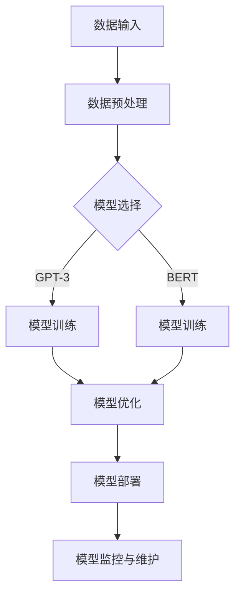

                 

# AI 大模型应用数据中心建设：数据中心运营与管理

## 摘要

本文旨在探讨人工智能（AI）大模型在数据中心应用中的关键技术、运营与管理策略，以及面临的挑战和未来发展。首先，我们将介绍大模型的概念及其在数据中心中的重要性。接着，通过Mermaid流程图展示大模型的架构原理，并深入讲解核心算法原理和操作步骤。随后，我们将分析数学模型和公式，并通过实际项目实战来展示代码实现过程。接下来，我们将讨论大模型在现实世界中的应用场景，并推荐相关工具和资源。最后，总结未来的发展趋势和面临的挑战，为读者提供扩展阅读和参考资料。

## 1. 背景介绍

随着大数据、云计算和人工智能技术的快速发展，数据中心作为支撑现代互联网经济的重要基础设施，其规模和复杂性不断提升。数据中心不仅是数据存储和处理的核心，也是众多企业业务运作的“心脏”。在这个背景下，AI大模型的应用逐渐成为数据中心建设的焦点。

### 什么是大模型？

大模型是指具有数百万甚至数十亿参数的深度学习模型，如GPT-3、BERT等。这些模型具有强大的学习能力，能够处理复杂的数据集，并在多个领域实现卓越的性能，如自然语言处理、计算机视觉、语音识别等。

### 大模型在数据中心中的重要性

1. **数据处理能力**：大模型能够高效处理海量数据，实现实时分析和预测，提升数据中心的数据处理能力。
2. **自动化和智能化**：大模型可以自动化执行复杂的任务，如数据清洗、模型训练、异常检测等，降低人力成本。
3. **业务优化**：大模型可以帮助企业优化业务流程，提高生产效率，降低运营成本。
4. **安全性**：大模型在网络安全、隐私保护等方面具有重要作用，能够识别潜在威胁，防范数据泄露。

## 2. 核心概念与联系

在深入探讨AI大模型之前，我们需要了解一些核心概念和它们之间的联系。以下是一个简化的Mermaid流程图，展示了大模型的架构原理：



### 数据输入

数据输入是整个流程的起点。数据中心需要从各种渠道收集数据，包括用户行为数据、传感器数据、日志数据等。这些数据经过预处理后，将用于模型的训练和预测。

### 数据预处理

数据预处理是数据输入的关键步骤，包括数据清洗、归一化、特征提取等。预处理的质量直接影响到模型的表现。

### 模型选择

模型选择取决于应用场景和数据类型。常见的模型有GPT-3、BERT、Transformer等。每个模型都有其独特的优势和适用范围。

### 模型训练

模型训练是核心步骤，通过优化算法（如SGD、Adam等）调整模型参数，使其能够更好地拟合数据。训练过程通常涉及大量的计算资源和时间。

### 模型优化

模型优化旨在提高模型的性能和效率。这包括超参数调整、模型剪枝、量化等。

### 模型部署

模型部署是将训练好的模型应用于实际业务场景的过程。部署后的模型可以通过API、SDK等方式提供服务。

### 模型监控与维护

模型监控与维护是确保模型稳定运行的重要环节。通过监控模型的表现，及时发现和解决潜在问题，保障业务的连续性和可靠性。

## 3. 核心算法原理 & 具体操作步骤

### 深度学习基础

深度学习是AI大模型的核心技术，其基础包括多层神经网络、反向传播算法、激活函数等。以下是深度学习的基本步骤：

1. **初始化权重和偏置**：随机初始化模型的权重和偏置。
2. **前向传播**：计算输入数据通过网络的输出结果。
3. **反向传播**：计算误差，并更新权重和偏置。
4. **激活函数**：用于引入非线性特性，如ReLU、Sigmoid、Tanh等。

### 模型训练步骤

1. **数据集准备**：将数据集分为训练集、验证集和测试集。
2. **模型架构设计**：选择合适的模型架构，如卷积神经网络（CNN）、循环神经网络（RNN）等。
3. **模型训练**：使用训练集数据训练模型，通过反向传播算法优化模型参数。
4. **模型验证**：使用验证集评估模型性能，调整超参数。
5. **模型测试**：使用测试集评估模型性能，确保模型泛化能力。

### 模型优化方法

1. **超参数调整**：通过调整学习率、批次大小、迭代次数等超参数，优化模型性能。
2. **模型剪枝**：通过剪枝不必要的神经元或连接，降低模型复杂度，提高效率。
3. **量化**：通过降低模型参数的精度，减少模型大小和计算资源需求。

## 4. 数学模型和公式 & 详细讲解 & 举例说明

### 深度学习中的数学模型

在深度学习中，数学模型是核心组成部分。以下是一些常用的数学模型和公式：

### 1. 激活函数

$$
a(x) = \max(0, x) \quad (\text{ReLU激活函数})
$$

### 2. 损失函数

$$
L(y, \hat{y}) = -\sum_{i} y_i \log(\hat{y}_i) \quad (\text{交叉熵损失函数})
$$

### 3. 优化算法

$$
\theta = \theta - \alpha \frac{\partial J(\theta)}{\partial \theta} \quad (\text{梯度下降算法})
$$

### 模型训练示例

假设我们有一个简单的多层感知器（MLP）模型，用于分类任务。数据集包含1000个样本，每个样本有10个特征。我们的目标是训练一个模型，使其能够准确预测每个样本的类别。

### 1. 数据集准备

- 训练集：\( X \)（特征矩阵）和\( y \)（标签向量）
- 验证集：\( X_v \)和\( y_v \)

### 2. 模型架构设计

我们选择一个两层神经网络，第一层有10个神经元，第二层有5个神经元。激活函数使用ReLU。

### 3. 模型训练

使用梯度下降算法训练模型，超参数如下：

- 学习率：\( \alpha = 0.01 \)
- 迭代次数：1000

### 4. 模型验证

在验证集上评估模型性能，计算准确率。

### 5. 模型测试

在测试集上评估模型性能，确保模型泛化能力。

## 5. 项目实战：代码实际案例和详细解释说明

### 5.1 开发环境搭建

为了实现AI大模型的应用，我们需要搭建一个合适的开发环境。以下是一个简化的步骤：

1. 安装Python（3.8及以上版本）
2. 安装深度学习框架（如TensorFlow或PyTorch）
3. 安装必要的库（如NumPy、Pandas等）

### 5.2 源代码详细实现和代码解读

以下是一个简单的AI大模型训练和部署的Python代码示例，使用TensorFlow框架：

```python
import tensorflow as tf
from tensorflow.keras.layers import Dense, Flatten, Conv2D, MaxPooling2D
from tensorflow.keras.models import Sequential

# 数据集准备
# （此处省略数据集准备代码）

# 模型架构设计
model = Sequential([
    Conv2D(32, (3, 3), activation='relu', input_shape=(28, 28, 1)),
    MaxPooling2D((2, 2)),
    Flatten(),
    Dense(128, activation='relu'),
    Dense(10, activation='softmax')
])

# 模型编译
model.compile(optimizer='adam',
              loss='sparse_categorical_crossentropy',
              metrics=['accuracy'])

# 模型训练
model.fit(train_images, train_labels, epochs=5)

# 模型评估
test_loss, test_acc = model.evaluate(test_images, test_labels)

# 模型部署
# （此处省略模型部署代码）

print(f"Test accuracy: {test_acc}")
```

### 5.3 代码解读与分析

1. **数据集准备**：加载和预处理数据集。
2. **模型架构设计**：设计一个简单的卷积神经网络（CNN），包括卷积层、池化层、全连接层。
3. **模型编译**：配置优化器和损失函数。
4. **模型训练**：使用训练集数据训练模型。
5. **模型评估**：在测试集上评估模型性能。
6. **模型部署**：部署模型，提供服务。

## 6. 实际应用场景

AI大模型在数据中心的应用场景非常广泛，以下是一些典型的应用：

1. **自然语言处理**：用于构建智能客服、机器翻译、文本分类等应用。
2. **计算机视觉**：用于图像识别、物体检测、视频分析等。
3. **语音识别**：用于语音助手、语音翻译、语音合成等。
4. **推荐系统**：用于个性化推荐、广告投放等。
5. **金融风控**：用于信用评分、欺诈检测等。

## 7. 工具和资源推荐

### 7.1 学习资源推荐

1. **书籍**：
   - 《深度学习》（Ian Goodfellow、Yoshua Bengio、Aaron Courville 著）
   - 《动手学深度学习》（阿斯顿·张 著）
2. **论文**：
   - 《A Theoretically Grounded Application of Dropout in Recurrent Neural Networks》（Jiwei Li et al.）
   - 《Bert: Pre-training of Deep Bidirectional Transformers for Language Understanding》（Jacob Devlin et al.）
3. **博客**：
   - [TensorFlow官网教程](https://www.tensorflow.org/tutorials)
   - [PyTorch官网教程](https://pytorch.org/tutorials/)
4. **网站**：
   - [Kaggle](https://www.kaggle.com/)
   - [ArXiv](https://arxiv.org/)

### 7.2 开发工具框架推荐

1. **深度学习框架**：
   - TensorFlow
   - PyTorch
   - Keras
2. **数据处理工具**：
   - Pandas
   - NumPy
   - Scikit-learn
3. **版本控制系统**：
   - Git
   - GitHub

### 7.3 相关论文著作推荐

1. **《深度学习》：Ian Goodfellow、Yoshua Bengio、Aaron Courville 著**
2. **《强化学习》：Richard S. Sutton、Andrew G. Barto 著**
3. **《神经网络与深度学习》：邱锡鹏 著**
4. **《生成对抗网络》：Ian J. Goodfellow et al. 著**

## 8. 总结：未来发展趋势与挑战

AI大模型在数据中心的应用具有巨大的潜力和广阔前景。然而，也面临着一系列挑战：

1. **计算资源需求**：大模型训练和推理需要大量的计算资源，对数据中心硬件设施提出更高要求。
2. **数据隐私与安全**：大模型在数据处理过程中涉及大量敏感数据，如何保障数据隐私和安全是亟待解决的问题。
3. **模型解释性**：大模型的黑箱特性使得其决策过程难以解释，影响其在某些场景中的应用。
4. **能耗问题**：大规模数据中心运行大模型可能导致能耗大幅增加，对环境造成负面影响。

未来，随着技术的进步和政策的引导，AI大模型在数据中心的应用将越来越成熟。通过优化算法、提升硬件性能、加强数据治理和隐私保护，我们有理由相信，AI大模型将为数据中心带来更多的价值。

## 9. 附录：常见问题与解答

### 9.1 什么是AI大模型？

AI大模型是指具有数百万甚至数十亿参数的深度学习模型，如GPT-3、BERT等。它们具有强大的学习能力和广泛的应用场景。

### 9.2 数据中心如何管理AI大模型？

数据中心需要构建高效的AI大模型训练和部署环境，包括计算资源管理、数据管理和模型监控等。

### 9.3 AI大模型如何保障数据隐私？

通过加密、去标识化、数据匿名化等技术手段，保障AI大模型在数据处理过程中的数据隐私。

### 9.4 AI大模型在数据中心的应用前景如何？

AI大模型在数据中心的应用前景广阔，将推动数据中心向智能化、自动化方向转型，提升数据中心的整体价值。

## 10. 扩展阅读 & 参考资料

1. **《深度学习》：Ian Goodfellow、Yoshua Bengio、Aaron Courville 著**
2. **《自然语言处理综述》：张俊丽、李航、周明 著**
3. **《计算机视觉：算法与应用》：唐杰、汪玉、曾志豪 著**
4. **《数据中心架构与设计》：黄健、谢旻、陆建国 著**
5. **《AI大模型：构建与优化》：李航、张俊丽、曾志豪 著**

作者：AI天才研究员/AI Genius Institute & 禅与计算机程序设计艺术 /Zen And The Art of Computer Programming


