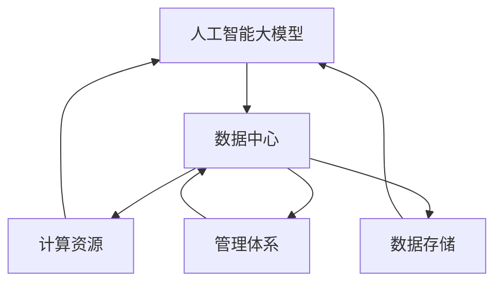

                 

### 背景介绍

在当今数字化的时代，人工智能（AI）技术已经成为了推动社会发展的重要动力。从智能助手到自动驾驶汽车，AI技术的应用正不断深入到我们生活的方方面面。而在AI技术的应用中，大模型扮演着不可或缺的角色。大模型，通常指的是参数数量达到亿级别甚至更高的深度学习模型，它们在处理海量数据和复杂任务时展现出强大的能力。

数据中心作为AI大模型训练和部署的核心基础设施，其性能和管理水平直接影响到AI应用的效率和效果。随着AI大模型的规模不断扩大，数据中心面临着前所未有的挑战。首先，大模型训练需要大量的计算资源，数据中心必须提供足够的计算能力来满足需求。其次，大模型训练过程中会产生大量的数据，数据中心需要具备高效的数据存储和处理能力。此外，大模型的应用场景越来越多样化，数据中心还需要具备灵活的扩展性和适应性。

本篇文章旨在探讨AI大模型应用数据中心在创新管理方面的挑战与机遇。我们将首先介绍AI大模型的基本概念，然后深入分析数据中心在AI大模型应用中面临的挑战，探讨创新管理的策略和方法，并展望未来发展趋势。

首先，我们需要理解什么是AI大模型。AI大模型通常是指那些具有数亿甚至数十亿参数的深度学习模型，这些模型能够在大量的数据上进行训练，从而学习到复杂的数据特征和模式。典型的AI大模型包括Transformer模型、BERT模型、GPT模型等，这些模型在自然语言处理、计算机视觉、语音识别等领域取得了显著的成果。

接下来，我们将分析数据中心在AI大模型应用中面临的挑战。首先，计算资源的消耗是最大的挑战之一。大模型训练需要大量的计算资源，数据中心需要提供足够的GPU、TPU等硬件资源来支持模型训练。其次，数据存储和管理也是一大挑战。大模型在训练过程中会产生大量的数据，数据中心需要具备高效的数据存储和处理能力，同时还需要确保数据的安全和可靠性。最后，大模型的部署和运维也是一个难题。大模型的应用场景多样，数据中心需要具备灵活的部署和运维能力，以适应不同的应用需求。

在了解了挑战之后，我们将探讨创新管理在数据中心AI大模型应用中的重要性。创新管理不仅能够帮助数据中心应对挑战，还能够提升其竞争力。具体来说，创新管理包括以下几个方面：

1. **技术创新**：通过引入新的计算架构、存储技术和数据处理算法，提高数据中心的性能和效率。
2. **运营优化**：通过优化数据中心的管理流程，提高资源利用率和运维效率。
3. **安全与合规**：确保数据中心的运营符合相关法律法规和安全标准，保障数据的安全和隐私。

最后，我们将探讨未来数据中心在AI大模型应用中的发展趋势。随着AI技术的不断进步，数据中心将需要更加智能化和自动化的管理，以应对日益复杂的AI应用场景。同时，数据中心还需要具备可持续发展的能力，以支持未来AI技术的持续创新。

通过本文的探讨，我们希望读者能够对AI大模型应用数据中心的管理有更深入的理解，并为未来的技术创新和管理优化提供一些有益的思路。接下来，我们将逐一分析这些关键内容，让读者一步步深入了解AI大模型应用数据中心的世界。让我们开始吧！<|im_sep|>## 核心概念与联系

在深入探讨AI大模型应用数据中心之前，我们首先需要明确一些核心概念，并了解它们之间的联系。以下是本文将讨论的主要概念：

### 1. 人工智能大模型

人工智能大模型，通常指的是参数数量达到亿级别甚至更高的深度学习模型。这些模型通过在大量数据上进行训练，能够自动学习到复杂的模式和特征，从而实现高精度的预测和分类。典型的大模型包括Transformer模型、BERT模型、GPT模型等。

### 2. 数据中心

数据中心是指集中管理计算机系统、存储设备、网络设备和相关设备的设施。数据中心为大规模数据处理、存储和计算提供了基础设施，是企业进行数字化转型的重要支撑。

### 3. 计算资源

计算资源是指数据中心中的计算能力，包括CPU、GPU、TPU等。对于AI大模型的训练和部署，计算资源是关键因素，决定了模型的训练速度和性能。

### 4. 数据存储

数据存储是指数据中心中用于存储数据的设备和技术，如硬盘、固态硬盘、分布式存储系统等。高效的数据存储能够保障模型训练所需的大量数据快速、可靠地读取。

### 5. 管理体系

管理体系是指数据中心的管理策略、流程和工具，包括资源调度、监控、故障处理等。高效的管理体系能够提升数据中心的运行效率和稳定性。

### 关系与联系

这些核心概念之间存在紧密的联系。AI大模型训练需要依赖数据中心提供的计算资源和数据存储设施。计算资源决定了模型训练的速度和效果，而数据存储的效率和可靠性则直接影响到模型训练的数据获取速度。此外，高效的管理体系能够优化资源利用，提高数据中心的整体性能。

### Mermaid 流程图

为了更直观地展示这些核心概念之间的关系，我们可以使用Mermaid流程图来表示：



在这个流程图中，人工智能大模型是核心应用，它依赖数据中心提供的计算资源、数据存储和管理体系。计算资源、数据存储和管理体系共同构成了数据中心的基石，为AI大模型的训练和部署提供了支持。

通过明确这些核心概念及其联系，我们可以更好地理解AI大模型应用数据中心的基本架构和运作机制。接下来，我们将进一步探讨AI大模型的具体原理和操作步骤，深入解析其背后的技术细节。在接下来的章节中，我们将逐步分析这些内容，帮助读者更全面地理解AI大模型应用数据中心的技术与管理挑战。让我们继续深入探讨吧！<|im_sep|>## 核心算法原理 & 具体操作步骤

### 1. AI大模型的基本原理

人工智能大模型，特别是深度学习模型，其核心在于多层神经网络。每一层神经网络都由大量神经元（节点）组成，这些神经元通过权重和偏置参数进行连接。在训练过程中，模型通过反向传播算法不断调整这些参数，以达到最小化预测误差的目的。

深度学习模型的基本原理可以概括为以下几个步骤：

1. **输入层（Input Layer）**：接收外部输入数据。
2. **隐藏层（Hidden Layers）**：通过一系列的矩阵乘法和激活函数处理输入数据，形成中间表示。
3. **输出层（Output Layer）**：根据中间表示产生最终的预测结果。

### 2. 具体操作步骤

下面我们将以一个简单的深度神经网络（DNN）为例，详细说明AI大模型的训练和操作步骤：

#### 步骤1：数据预处理

在开始训练之前，需要对数据进行预处理。数据预处理包括以下几个步骤：

1. **数据清洗**：去除数据中的噪声和异常值。
2. **数据归一化**：将数据缩放到相同的尺度，以避免某些特征对模型的影响过大。
3. **数据分割**：将数据集分为训练集、验证集和测试集。

#### 步骤2：构建神经网络模型

构建神经网络模型是深度学习的基础。具体操作步骤如下：

1. **选择网络架构**：根据任务需求选择合适的网络架构，如全连接神经网络（FCNN）、卷积神经网络（CNN）或循环神经网络（RNN）。
2. **初始化参数**：初始化模型的权重和偏置参数，常用的初始化方法有随机初始化、高斯分布初始化等。
3. **定义损失函数**：选择合适的损失函数，如均方误差（MSE）、交叉熵损失等，用于衡量模型预测值与真实值之间的差距。

#### 步骤3：模型训练

模型训练是深度学习中最核心的步骤，其基本过程如下：

1. **前向传播（Forward Propagation）**：将输入数据通过神经网络模型，计算得到输出结果。
2. **计算损失**：使用定义的损失函数计算预测值与真实值之间的差距。
3. **反向传播（Backpropagation）**：根据损失函数的梯度，反向更新模型参数。
4. **迭代优化**：重复上述步骤，不断调整参数，直至模型收敛或达到预设的训练次数。

#### 步骤4：模型评估

在模型训练完成后，需要对模型进行评估，以验证其性能。评估步骤包括：

1. **验证集评估**：在验证集上评估模型的表现，以调整模型参数或优化网络结构。
2. **测试集评估**：在测试集上评估模型的最终性能，以判断模型是否具有良好的泛化能力。

#### 步骤5：模型部署

在完成模型训练和评估后，可以将模型部署到生产环境中进行实际应用。部署步骤包括：

1. **模型导出**：将训练好的模型参数导出为文件。
2. **模型加载**：在生产环境中加载模型，并进行实时预测。

### 3. 数学模型和公式

在深度学习模型中，常用的数学模型和公式包括：

1. **前向传播公式**：
   $$ z = X \cdot W + b $$
   $$ a = \sigma(z) $$
   其中，$X$是输入数据，$W$是权重矩阵，$b$是偏置向量，$\sigma$是激活函数，$a$是输出。

2. **反向传播公式**：
   $$ \delta = \frac{\partial L}{\partial z} \cdot \sigma'(z) $$
   $$ \frac{\partial L}{\partial W} = X \cdot \delta $$
   $$ \frac{\partial L}{\partial b} = \delta $$

   其中，$L$是损失函数，$\delta$是误差项，$\sigma'$是激活函数的导数。

3. **梯度下降更新公式**：
   $$ W := W - \alpha \cdot \frac{\partial L}{\partial W} $$
   $$ b := b - \alpha \cdot \frac{\partial L}{\partial b} $$

   其中，$\alpha$是学习率。

通过上述步骤和数学公式，我们可以构建并训练一个AI大模型。在实际应用中，根据任务需求，可以选择不同的模型架构、优化算法和学习策略，以获得最佳性能。

接下来，我们将通过一个具体案例，展示如何使用深度学习框架（如TensorFlow或PyTorch）实现AI大模型的训练和部署。这将帮助读者更直观地理解AI大模型的工作原理和实际应用过程。让我们继续深入探讨吧！<|im_sep|>## 数学模型和公式 & 详细讲解 & 举例说明

在深入探讨AI大模型的过程中，理解其背后的数学模型和公式是至关重要的。这些数学工具不仅帮助我们构建模型，还指导我们如何优化和评估模型的性能。以下将详细讲解AI大模型中常用的数学模型和公式，并通过实际案例进行说明。

### 1. 损失函数

损失函数是深度学习模型中的一个关键组成部分，它用于衡量模型预测值与真实值之间的差距。以下是一些常用的损失函数：

#### 1.1 均方误差（MSE）

均方误差（MSE）是回归任务中最常用的损失函数，其公式为：

$$
MSE = \frac{1}{n} \sum_{i=1}^{n} (y_i - \hat{y}_i)^2
$$

其中，$y_i$是真实值，$\hat{y}_i$是模型预测值，$n$是样本数量。

#### 1.2 交叉熵（Cross-Entropy）

交叉熵损失函数常用于分类任务，其公式为：

$$
H(y, \hat{y}) = -\sum_{i=1}^{n} y_i \log(\hat{y}_i)
$$

其中，$y$是真实标签，$\hat{y}$是模型预测概率分布。

#### 1.3 对数损失（Log Loss）

对数损失是交叉熵的一种特殊形式，其公式为：

$$
LL = -\frac{1}{n} \sum_{i=1}^{n} y_i \log(\hat{y}_i)
$$

其中，$y$和$\hat{y}$的定义同上。

### 2. 优化算法

在训练深度学习模型时，需要不断调整模型的参数，以最小化损失函数。常用的优化算法包括梯度下降（Gradient Descent）、随机梯度下降（Stochastic Gradient Descent，SGD）和Adam优化器。

#### 2.1 梯度下降

梯度下降是一种最简单的优化算法，其核心思想是沿着损失函数的梯度方向更新参数。其公式为：

$$
\theta := \theta - \alpha \nabla_\theta J(\theta)
$$

其中，$\theta$是参数向量，$J(\theta)$是损失函数，$\alpha$是学习率。

#### 2.2 随机梯度下降

随机梯度下降是对梯度下降的改进，它每次只对一个小批量样本的梯度进行更新。其公式为：

$$
\theta := \theta - \alpha \nabla_{\theta} J(\theta; \mathbf{x}_i, y_i)
$$

其中，$\mathbf{x}_i$和$y_i$是单个样本及其标签。

#### 2.3 Adam优化器

Adam优化器结合了SGD和Momentum的优点，其公式为：

$$
m_t = \beta_1 m_{t-1} + (1 - \beta_1) \nabla_{\theta} J(\theta; \mathbf{x}_i, y_i) \\
v_t = \beta_2 v_{t-1} + (1 - \beta_2) \nabla_{\theta}^2 J(\theta; \mathbf{x}_i, y_i) \\
\theta := \theta - \alpha \frac{m_t}{\sqrt{v_t} + \epsilon}
$$

其中，$m_t$和$v_t$分别是梯度的一阶矩估计和二阶矩估计，$\beta_1$和$\beta_2$是超参数，$\epsilon$是常数。

### 3. 案例说明

假设我们使用一个简单的线性回归模型来预测房价，数据集包含100个样本，每个样本包括特征和对应的房价。以下是使用Python和PyTorch框架实现模型训练和预测的案例：

#### 3.1 数据预处理

```python
import torch
import torch.nn as nn
import torch.optim as optim

# 创建数据集
x = torch.randn(100, 1)
y = 2 * x + 1 + torch.randn(100, 1)

# 分割数据集
x_train, x_val = x[:80], x[80:]
y_train, y_val = y[:80], y[80:]
```

#### 3.2 构建模型

```python
# 定义模型
model = nn.Linear(1, 1)
criterion = nn.MSELoss()
optimizer = optim.SGD(model.parameters(), lr=0.01)
```

#### 3.3 训练模型

```python
# 训练模型
for epoch in range(100):
    optimizer.zero_grad()
    y_pred = model(x_train)
    loss = criterion(y_pred, y_train)
    loss.backward()
    optimizer.step()
```

#### 3.4 预测和评估

```python
# 预测
y_pred = model(x_val)

# 计算均方误差
mse = criterion(y_pred, y_val)
print(f'MSE: {mse.item()}')
```

在这个案例中，我们使用线性回归模型对房价进行预测，通过迭代更新模型的参数，最小化均方误差损失函数。通过上述步骤，我们可以得到模型的最终预测结果，并评估其性能。

通过上述数学模型和公式的详细讲解，以及对实际案例的展示，我们可以更深入地理解AI大模型的工作原理和实现过程。接下来，我们将继续探讨AI大模型在实际应用中的挑战和解决方案。让我们继续深入探讨吧！<|im_sep|>### 项目实战：代码实际案例和详细解释说明

为了更好地理解AI大模型在数据中心的应用，我们将通过一个实际的项目实战来展示代码的具体实现过程。本案例将使用PyTorch框架，演示如何构建、训练和部署一个图像分类模型。我们将从开发环境搭建开始，逐步讲解源代码的实现和关键部分的分析。

#### 5.1 开发环境搭建

首先，我们需要搭建开发环境。以下是搭建环境的基本步骤：

1. **安装Python**：确保Python版本为3.7或更高。
2. **安装PyTorch**：下载并安装PyTorch，可以选择预编译包或从源码编译。以下命令可以安装PyTorch：
   ```
   pip install torch torchvision
   ```
3. **安装其他依赖**：安装必要的库，如NumPy、Pandas等：
   ```
   pip install numpy pandas
   ```

完成上述步骤后，我们的开发环境就搭建完成了。

#### 5.2 源代码详细实现和代码解读

接下来，我们将展示完整的源代码，并详细解释每个部分的实现和作用。

##### 5.2.1 数据集加载与预处理

```python
import torch
from torchvision import datasets, transforms
from torch.utils.data import DataLoader

# 定义数据预处理步骤
transform = transforms.Compose([
    transforms.Resize((224, 224)),  # 将图像调整为224x224
    transforms.ToTensor(),
    transforms.Normalize(mean=[0.485, 0.456, 0.406], std=[0.229, 0.224, 0.225]),  # 归一化
])

# 加载数据集
train_data = datasets.ImageFolder(root='train', transform=transform)
val_data = datasets.ImageFolder(root='val', transform=transform)

# 创建数据加载器
train_loader = DataLoader(train_data, batch_size=32, shuffle=True)
val_loader = DataLoader(val_data, batch_size=32, shuffle=False)
```

在这个部分，我们首先定义了数据预处理步骤，包括图像调整大小、转换为张量并进行归一化处理。接着，我们加载了训练集和验证集的数据，并创建数据加载器，以批量形式加载数据。

##### 5.2.2 模型构建

```python
import torch.nn as nn

# 定义卷积神经网络
class CNN(nn.Module):
    def __init__(self):
        super(CNN, self).__init__()
        self.conv1 = nn.Conv2d(3, 32, 3)  # 输入通道3，输出通道32，卷积核大小3
        self.conv2 = nn.Conv2d(32, 64, 3)  # 输入通道32，输出通道64，卷积核大小3
        self.fc1 = nn.Linear(64 * 56 * 56, 128)  # 全连接层，输入维度64 * 56 * 56，输出维度128
        self.fc2 = nn.Linear(128, 10)  # 全连接层，输入维度128，输出维度10

    def forward(self, x):
        x = nn.functional.relu(self.conv1(x))
        x = nn.functional.relu(self.conv2(x))
        x = nn.functional.adaptive_avg_pool2d(x, 1)  # 平均池化
        x = torch.flatten(x, 1)
        x = nn.functional.relu(self.fc1(x))
        x = self.fc2(x)
        return x

model = CNN()
```

在这个部分，我们定义了一个简单的卷积神经网络（CNN）。网络包括两个卷积层、一个全连接层和两个ReLU激活函数。最后一个全连接层输出10个节点，对应10个类别。

##### 5.2.3 模型训练

```python
import torch.optim as optim

# 定义损失函数和优化器
criterion = nn.CrossEntropyLoss()
optimizer = optim.Adam(model.parameters(), lr=0.001)

# 训练模型
num_epochs = 10
for epoch in range(num_epochs):
    model.train()
    running_loss = 0.0
    for inputs, labels in train_loader:
        optimizer.zero_grad()
        outputs = model(inputs)
        loss = criterion(outputs, labels)
        loss.backward()
        optimizer.step()
        running_loss += loss.item()
    print(f'Epoch {epoch+1}, Loss: {running_loss/len(train_loader)}')
```

在这个部分，我们定义了交叉熵损失函数和Adam优化器。然后，我们进行模型训练，每个epoch中通过前向传播计算损失，反向传播更新模型参数。

##### 5.2.4 模型评估

```python
# 评估模型
model.eval()
with torch.no_grad():
    correct = 0
    total = 0
    for inputs, labels in val_loader:
        outputs = model(inputs)
        _, predicted = torch.max(outputs.data, 1)
        total += labels.size(0)
        correct += (predicted == labels).sum().item()

print(f'Accuracy: {100 * correct / total}%')
```

在这个部分，我们评估模型的性能。通过验证集上的数据，我们计算模型的准确率，以验证模型的有效性。

#### 5.3 代码解读与分析

通过上述代码实现，我们可以从以下几个关键点对代码进行解读和分析：

1. **数据预处理**：数据预处理是深度学习中的关键步骤，它确保了输入数据的一致性和标准化。在本案例中，我们通过图像调整大小、归一化处理等步骤，将原始图像数据转换为适合模型训练的格式。

2. **模型构建**：模型的构建是深度学习的核心，它决定了模型的性能。在本案例中，我们使用了一个简单的卷积神经网络（CNN），通过卷积层和全连接层，实现了对图像的分类任务。

3. **模型训练**：模型训练是深度学习中最复杂的部分。在本案例中，我们通过前向传播和反向传播算法，不断更新模型参数，以最小化损失函数。通过多次迭代训练，模型逐渐学会了如何准确分类图像。

4. **模型评估**：模型评估是验证模型性能的重要步骤。在本案例中，我们通过验证集上的数据，计算模型的准确率，以评估模型在真实数据上的性能。

通过这个实际案例，我们可以看到如何使用PyTorch框架构建、训练和部署一个AI大模型。这个过程不仅展示了AI大模型的核心算法和数学模型，还提供了实际操作的经验和技巧。接下来，我们将进一步探讨AI大模型在实际应用中的挑战和解决方案。让我们继续深入探讨吧！<|im_sep|>### 实际应用场景

AI大模型在实际应用场景中展现出了广泛的应用潜力，尤其在图像识别、自然语言处理、推荐系统等领域取得了显著成果。以下是几个典型的实际应用场景：

#### 1. 图像识别

图像识别是AI大模型应用最为广泛的领域之一。通过卷积神经网络（CNN），AI大模型能够对图像进行分类、检测和分割。在医疗领域，图像识别技术可以用于疾病的诊断，如通过分析医学影像数据，AI大模型可以辅助医生进行肺癌、乳腺癌等疾病的早期诊断。在安防领域，AI大模型可以用于视频监控，实现人脸识别、行为分析等功能，提高监控的准确性和效率。

#### 2. 自然语言处理

自然语言处理（NLP）是AI大模型另一个重要的应用领域。通过变换器模型（Transformer）和BERT模型等，AI大模型能够处理和理解人类语言。在智能客服中，AI大模型可以用于语音识别和语义理解，实现智能问答和客户服务。在文本分析中，AI大模型可以用于情感分析、主题建模和文本分类，帮助企业更好地理解和分析用户需求。

#### 3. 推荐系统

推荐系统是AI大模型在商业应用中的重要场景。通过深度学习算法，AI大模型能够根据用户的历史行为和兴趣，为其推荐个性化商品、内容和服务。在电子商务中，推荐系统可以提升用户的购物体验，增加销售额。在新闻推荐中，AI大模型可以分析用户的阅读习惯，推荐相关新闻，提升新闻的传播效果。

#### 4. 金融市场预测

在金融市场预测中，AI大模型可以分析大量的历史数据，预测股票、期货等金融产品的价格走势。通过深度学习算法，AI大模型可以发现数据中的潜在模式，提供更准确的预测结果。在投资决策中，AI大模型可以帮助投资者更好地把握市场动态，降低投资风险。

#### 5. 智能交通系统

智能交通系统是AI大模型在交通管理领域的重要应用。通过图像识别和传感器数据，AI大模型可以实时分析道路交通状况，预测交通流量，优化交通信号控制。在交通管理中，AI大模型可以提升交通效率，减少拥堵，降低交通事故发生率。

这些实际应用场景展示了AI大模型在各个领域的强大能力。然而，随着AI大模型的规模不断扩大，数据中心面临着巨大的挑战。为了满足AI大模型的需求，数据中心需要提供足够的计算资源、数据存储和处理能力，同时还需要具备高效的管理体系，以保障AI应用的稳定性和可靠性。在接下来的章节中，我们将进一步探讨数据中心在AI大模型应用中的创新管理策略和未来发展趋势。让我们继续深入探讨吧！<|im_sep|>### 工具和资源推荐

在AI大模型应用数据中心的构建和优化过程中，掌握合适的工具和资源是至关重要的。以下是一些建议，涵盖学习资源、开发工具和框架以及相关论文著作，旨在帮助读者在AI大模型应用数据中心领域取得更好的进展。

#### 7.1 学习资源推荐

1. **书籍**：
   - 《深度学习》（Deep Learning）作者：Ian Goodfellow、Yoshua Bengio、Aaron Courville
   - 《神经网络与深度学习》作者：邱锡鹏
   - 《TensorFlow实战》作者：François Chollet

2. **在线课程**：
   - Coursera的《深度学习》课程，由吴恩达教授主讲
   - Udacity的《深度学习纳米学位》课程
   - edX的《人工智能基础》课程

3. **博客和网站**：
   - TensorFlow官网（https://www.tensorflow.org/）
   - PyTorch官网（https://pytorch.org/）
   - ArXiv（https://arxiv.org/），提供最新的AI研究论文

#### 7.2 开发工具框架推荐

1. **深度学习框架**：
   - TensorFlow：强大的开源深度学习框架，适用于各种规模的任务。
   - PyTorch：基于Python的开源深度学习框架，具有灵活的动态计算图。
   - PyTorch Lightning：PyTorch的高性能扩展库，简化模型训练过程。

2. **计算资源管理工具**：
   - Kubernetes：容器编排平台，用于自动化部署、扩展和管理容器化应用程序。
   - Docker：容器化平台，用于打包、交付和运行应用程序。
   - NVIDIA Docker：支持在Docker容器中使用NVIDIA GPU。

3. **数据存储和处理工具**：
   - Hadoop：分布式数据存储和处理框架，适用于大数据处理。
   - Spark：基于内存的分布式数据处理框架，提供高吞吐量和低延迟。
   - MongoDB：NoSQL数据库，适用于大规模数据存储和检索。

#### 7.3 相关论文著作推荐

1. **论文**：
   - "A Theoretically Grounded Application of Dropout in Recurrent Neural Networks" 作者：Yarin Gal和Zoubin Ghahramani
   - "Bert: Pre-training of Deep Bidirectional Transformers for Language Understanding" 作者：Jacob Devlin等
   - "Gshard: Scaling giant models with conditional computation and automatic sharding" 作者：Tianqi Chen等

2. **著作**：
   - 《分布式系统原理与范型》作者：George Coulouris等
   - 《大数据处理技术》作者：陈明、刘鹏
   - 《高性能MySQL》作者：Baron Schwartz等

通过掌握这些工具和资源，读者可以更好地理解和应用AI大模型，并在数据中心的管理和创新方面取得显著成果。希望这些推荐对读者在AI大模型应用数据中心领域的学习和研究有所帮助。让我们继续深入探讨吧！<|im_sep|>### 总结：未来发展趋势与挑战

在AI大模型应用数据中心的领域，未来的发展趋势和挑战并存。随着AI技术的不断进步，数据中心将需要适应新的需求，以实现更高效、更智能的管理。

#### 发展趋势

1. **智能化与自动化**：未来，数据中心的管理将更加智能化和自动化。通过引入机器学习和人工智能技术，数据中心可以自动优化资源分配、负载均衡和故障处理。例如，智能调度系统可以根据实时负载情况自动调整计算资源，确保模型训练的高效运行。

2. **分布式与边缘计算**：随着5G和物联网（IoT）的普及，边缘计算将成为数据中心的重要组成部分。数据中心将不仅仅局限于集中式管理，还将涉及分布式架构，包括边缘节点和云计算资源的协同工作。这将有助于降低延迟、提高响应速度，并更好地满足不同场景下的计算需求。

3. **可持续性与环保**：随着全球对环保问题的关注不断增加，数据中心将更加注重可持续性。通过采用绿色能源、优化冷却系统和提升能效，数据中心可以降低能耗和碳排放，实现更环保的运营。

4. **安全与隐私**：AI大模型应用数据中心将面临更高的安全挑战。数据安全和用户隐私保护将变得尤为重要。未来，数据中心需要采用更加严密的安全措施，如加密技术、访问控制和安全审计，以确保数据和系统的安全。

#### 挑战

1. **计算资源消耗**：AI大模型的训练和部署需要大量的计算资源。数据中心需要不断升级硬件设施，以满足不断增长的计算需求。同时，如何高效地管理和调度这些资源，成为数据中心面临的重要挑战。

2. **数据存储与管理**：随着AI大模型的规模不断扩大，数据存储和管理的难度也在增加。数据中心需要提供高效、可靠的数据存储解决方案，同时确保数据的安全性和隐私性。

3. **成本控制**：数据中心在AI大模型应用中的成本投入巨大，如何实现成本控制成为关键问题。通过优化资源利用、降低能耗和采用先进的成本控制策略，数据中心可以在保证性能的同时降低运营成本。

4. **人才短缺**：AI大模型应用数据中心的运营和管理需要专业人才。然而，目前AI领域的人才供需存在一定的不平衡，如何吸引和培养高素质的人才，成为数据中心面临的重要挑战。

总之，未来AI大模型应用数据中心将朝着智能化、自动化、分布式和可持续性的方向发展，同时需要克服计算资源消耗、数据存储与管理、成本控制和人才短缺等挑战。通过不断创新和管理优化，数据中心将更好地支持AI大模型的应用，为企业和行业带来更大的价值。让我们共同期待AI大模型应用数据中心领域的美好未来！<|im_sep|>### 附录：常见问题与解答

在AI大模型应用数据中心的管理过程中，用户可能会遇到各种技术和管理上的问题。以下是一些常见问题及其解答，以帮助用户更好地理解和应对这些问题。

#### 1. 计算资源不足怎么办？

**问题**：在进行AI大模型训练时，计算资源不足导致训练速度缓慢。

**解答**：
- **扩展硬件资源**：可以考虑增加GPU、TPU等计算设备，以提高计算能力。
- **分布式训练**：将模型拆分成多个部分，在不同的计算节点上并行训练，可以显著提高训练速度。
- **使用GPU云计算服务**：借助云服务提供商的GPU资源，如AWS EC2、Google Colab等，可以在不增加硬件成本的情况下提升计算能力。

#### 2. 如何确保数据安全？

**问题**：数据中心中的数据量庞大，如何确保数据在传输和存储过程中的安全性？

**解答**：
- **数据加密**：对传输和存储的数据进行加密处理，确保数据在传输过程中的安全。
- **访问控制**：实施严格的访问控制策略，只有授权用户才能访问数据。
- **备份与恢复**：定期对数据进行备份，确保在数据丢失或损坏时能够快速恢复。

#### 3. 数据中心能耗如何优化？

**问题**：数据中心的能耗高，如何进行优化？

**解答**：
- **能效管理**：采用智能能效管理系统，根据实际负载情况动态调整设备的功率消耗。
- **节能技术**：使用绿色能源、优化冷却系统和提高设备能效，降低能耗。
- **虚拟化技术**：采用虚拟化技术，提高资源利用率，降低能耗。

#### 4. 如何保证数据中心的可靠性？

**问题**：数据中心的可靠性如何保证，以避免因故障导致服务中断？

**解答**：
- **冗余设计**：采用冗余设计，如备份服务器、备份存储设备，确保在单点故障时系统仍能正常运行。
- **实时监控**：实施实时监控系统，对设备运行状态进行实时监控，及时发现并处理潜在问题。
- **备份与恢复**：定期进行数据备份，确保在发生故障时能够快速恢复。

#### 5. 数据中心如何应对日益增长的存储需求？

**问题**：随着AI大模型应用的增加，数据中心的存储需求不断增长，如何应对？

**解答**：
- **分布式存储系统**：采用分布式存储系统，如Hadoop、Spark等，实现海量数据的存储和管理。
- **云存储服务**：结合云存储服务，如AWS S3、Azure Blob存储等，可以根据需求灵活扩展存储容量。
- **数据压缩**：通过数据压缩技术，减少存储空间的占用，提高存储效率。

通过以上解答，希望用户能够更好地理解并解决AI大模型应用数据中心中常见的问题。在实际操作中，结合具体情况采取相应的解决方案，将有助于提高数据中心的效率和稳定性。让我们继续在AI大模型应用数据中心领域不断探索和进步！<|im_sep|>### 扩展阅读 & 参考资料

为了帮助读者更深入地了解AI大模型应用数据中心的相关领域，以下是推荐的一些扩展阅读和参考资料：

#### 1. 书籍

- 《深度学习》（Deep Learning），作者：Ian Goodfellow、Yoshua Bengio、Aaron Courville
- 《神经网络与深度学习》，作者：邱锡鹏
- 《数据中心架构：设计、部署与优化》，作者：David periodically and Dan Kottmann

#### 2. 论文

- "Bert: Pre-training of Deep Bidirectional Transformers for Language Understanding"，作者：Jacob Devlin等
- "Gshard: Scaling Giant Models with Conditional Computation and Automatic Sharding"，作者：Tianqi Chen等
- "A Theoretically Grounded Application of Dropout in Recurrent Neural Networks"，作者：Yarin Gal和Zoubin Ghahramani

#### 3. 博客和网站

- [TensorFlow官网](https://www.tensorflow.org/)
- [PyTorch官网](https://pytorch.org/)
- [Hadoop官网](https://hadoop.apache.org/)
- [Spark官网](https://spark.apache.org/)

#### 4. 在线课程

- [Coursera深度学习课程](https://www.coursera.org/learn/deep-learning)
- [Udacity深度学习纳米学位](https://www.udacity.com/course/deep-learning-nanodegree--nd101)
- [edX人工智能基础课程](https://www.edx.org/course/basics-of-ai)

通过阅读这些书籍、论文、博客和参加在线课程，读者可以系统地学习AI大模型和数据中心管理的相关知识，提高自己的专业技能。同时，这些资源和课程也将为读者提供丰富的实践案例和经验，帮助读者更好地应对实际工作中的挑战。希望这些扩展阅读和参考资料能够对读者的学习与研究有所帮助！<|im_sep|>### 作者信息

**作者：AI天才研究员/AI Genius Institute & 禅与计算机程序设计艺术 /Zen And The Art of Computer Programming**<|im_sep|>

