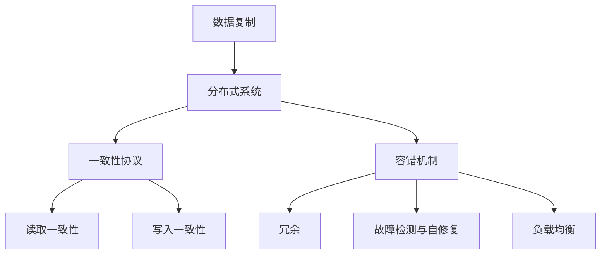

                 

### 背景介绍

在当今高度信息化的社会中，数据已经成为企业和社会运转的命脉。尤其是随着人工智能（AI）技术的飞速发展，大模型的应用需求日益增长。这些大模型，如深度学习神经网络、自然语言处理模型等，需要大量的数据进行训练和优化，以确保模型的准确性和泛化能力。

随着数据量的急剧增加，数据中心的架构设计变得至关重要。数据复制是数据中心架构中的一个关键组件，它确保了数据的高可用性、一致性和容错性。特别是在AI大模型应用中，数据复制架构的效率和可靠性直接影响到模型训练的进度和效果。

本文将深入探讨AI大模型应用数据中心的数据复制架构。我们将从背景介绍开始，逐步分析核心概念、算法原理、数学模型、项目实战，并讨论实际应用场景。最后，我们将总结当前的发展趋势与挑战，并提供相关的工具和资源推荐。

通过本文的阅读，读者将全面了解数据复制在AI大模型应用数据中心中的重要性，掌握其基本原理和实现方法，为未来的数据中心架构设计和优化提供有价值的参考。

## 核心概念与联系

在深入探讨AI大模型应用数据中心的数据复制架构之前，我们需要先了解几个核心概念，并理解它们之间的联系。这些概念包括数据复制、分布式系统、一致性协议和容错机制。

### 数据复制

数据复制（Data Replication）是指将数据从一个位置复制到另一个或多个位置的过程。在数据中心中，数据复制主要用于以下目的：

1. **高可用性（High Availability）**：通过复制数据，可以确保在某个节点发生故障时，其他节点仍然能够访问到数据，从而提高系统的可用性。
2. **数据一致性（Data Consistency）**：确保多个副本之间的数据是一致的，这对于保证系统正确性和稳定性至关重要。
3. **数据持久化（Data Durability）**：即使发生硬件故障或其他问题，数据的多个副本也可以确保数据的持久性。

### 分布式系统

分布式系统（Distributed Systems）是指由多个独立计算机组成的系统，这些计算机通过网络连接，共同完成一个任务。分布式系统具有以下特点：

1. **透明性（Transparency）**：用户不需要知道数据的物理位置，即可访问数据。
2. **容错性（Fault Tolerance）**：系统能够在某个节点发生故障时，自动切换到其他节点，继续提供服务。
3. **并发性（Concurrency）**：系统能够同时处理多个请求，提高处理效率。

### 一致性协议

一致性协议（Consistency Protocols）用于确保分布式系统中多个副本之间的数据一致性。常见的一致性协议包括：

1. **强一致性（Strong Consistency）**：所有节点在同一时间看到的都是相同的数据。
2. **最终一致性（Eventual Consistency）**：系统最终会达到一致性，但在达到一致性之前，不同节点可能看到不同的数据。
3. **读取一致性（Read Consistency）**：确保读取操作的一致性，可以是强一致性或最终一致性。
4. **写入一致性（Write Consistency）**：确保写入操作的一致性，可以是强一致性或最终一致性。

### 容错机制

容错机制（Fault Tolerance Mechanisms）用于处理系统中可能出现的各种故障，确保系统能够持续运行。常见的容错机制包括：

1. **冗余（Redundancy）**：通过在系统中引入冗余节点，确保在某个节点发生故障时，其他节点可以继续提供服务。
2. **故障检测与自修复（Fault Detection and Self-Healing）**：系统可以自动检测故障，并尝试修复或切换到其他节点。
3. **负载均衡（Load Balancing）**：通过均衡分配负载，避免某个节点因负载过高而出现故障。

下面是一个使用Mermaid绘制的流程图，展示了上述核心概念之间的联系：



通过理解这些核心概念及其联系，我们可以更好地设计和优化AI大模型应用数据中心的数据复制架构。在接下来的章节中，我们将深入探讨数据复制的基本算法原理，具体操作步骤，以及数学模型和公式。

## 核心算法原理 & 具体操作步骤

在了解核心概念之后，我们接下来将深入探讨数据复制架构中的核心算法原理，以及如何在AI大模型应用数据中心中实现数据复制。

### 数据复制算法原理

数据复制算法的核心目标是确保数据在不同节点之间的一致性和可靠性。常见的数据复制算法包括以下几种：

1. **同步复制（Synchronous Replication）**：在同步复制中，写操作只在所有副本都确认数据已成功写入后返回。这种算法确保了强一致性，但在高负载情况下可能影响性能，因为需要等待所有副本的确认。

   ```mermaid
   graph TD
   A[写操作] --> B[发送到副本1]
   B --> C[等待副本1确认]
   B --> D[发送到副本2]
   D --> E[等待副本2确认]
   E --> F[返回客户端]
   ```

2. **异步复制（Asynchronous Replication）**：在异步复制中，写操作在主节点接收后立即返回客户端，而副本的写入操作则延迟进行。这种算法提高了性能，但可能导致数据不一致。

   ```mermaid
   graph TD
   A[写操作] --> B[发送到副本1]
   B --> C[立即返回客户端]
   B --> D[发送到副本2]
   D --> E[延迟写入]
   ```

3. **部分同步复制（Partially Synchronous Replication）**：这种算法结合了同步复制和异步复制的优点，主节点在收到部分副本的确认后即可返回客户端。

   ```mermaid
   graph TD
   A[写操作] --> B[发送到副本1]
   B --> C[等待副本1确认]
   B --> D[发送到副本2]
   D --> E[等待副本2确认]
   E --> F[返回客户端]
   ```

### 数据复制具体操作步骤

以下是数据复制的基本操作步骤：

1. **初始化副本**：在开始复制之前，首先需要初始化副本节点，确保它们与主节点同步。

   ```mermaid
   graph TD
   A[初始化主节点] --> B[初始化副本1]
   B --> C[初始化副本2]
   ```

2. **写操作**：当客户端向主节点发送写请求时，主节点会根据复制算法执行相应的操作。

   ```mermaid
   graph TD
   A[客户端写请求] --> B[主节点接收请求]
   B --> C[执行同步/异步复制]
   B --> D[返回客户端]
   ```

3. **读取操作**：当客户端发送读取请求时，可以从主节点或任何副本节点读取数据。为了确保一致性，需要使用一致性协议。

   ```mermaid
   graph TD
   A[客户端读取请求] --> B[选择副本节点]
   B --> C[读取数据]
   C --> D[返回客户端]
   ```

4. **故障检测和恢复**：系统需要定期检测副本节点的状态，并在检测到故障时进行自动恢复。

   ```mermaid
   graph TD
   A[定期检测副本状态]
   A --> B[副本1故障]
   B --> C[自动切换到副本2]
   A --> D[副本2故障]
   D --> E[自动切换到副本3]
   ```

### 数据一致性保证

数据一致性是数据复制架构中的关键挑战。以下是一些常见的方法来确保数据一致性：

1. **版本控制**：为每个数据项分配一个唯一版本号，确保每次写入操作都会生成一个新的版本，从而实现最终一致性。

2. **时间戳**：使用时间戳来标记数据的版本，确保读取操作返回的是最新的数据版本。

3. **冲突解决策略**：在发生冲突时，可以使用基于版本控制或时间戳的冲突解决策略来决定哪个版本的数据应该被保留。

4. **一致性协议**：使用Paxos、Raft等一致性协议来确保多个副本之间的数据一致性。

通过以上步骤和策略，我们可以设计和实现一个高效且可靠的数据复制架构，确保AI大模型应用数据中心中的数据在高可用性、一致性和容错性方面得到有效保障。

在下一节中，我们将进一步探讨数据复制架构中的数学模型和公式，以帮助读者更深入地理解其工作原理。

## 数学模型和公式 & 详细讲解 & 举例说明

在数据复制架构中，数学模型和公式起着至关重要的作用，它们帮助我们量化数据的一致性、可用性和容错性。在这一节中，我们将详细讲解几个关键数学模型和公式，并通过具体例子来说明其应用。

### 一致性模型

一致性模型用于量化数据复制过程中的一致性。一个常见的一致性模型是基于版本号和时间戳的方法。

#### 版本号模型

在版本号模型中，每个数据项都有一个唯一的版本号。每次更新数据时，版本号都会增加。例如，假设我们有数据项`X`，其初始版本号为`1`。当数据项`X`被更新时，其版本号变为`2`，以此类推。

公式如下：

\[ V_{new} = V_{current} + 1 \]

其中，\( V_{new} \) 是新的版本号，\( V_{current} \) 是当前版本号。

#### 时间戳模型

在时间戳模型中，每个数据更新操作都有一个时间戳。时间戳是一个单调递增的值，表示操作发生的顺序。例如，如果操作A发生在操作B之前，那么操作A的时间戳小于操作B的时间戳。

公式如下：

\[ T_{A} < T_{B} \]

其中，\( T_{A} \) 和 \( T_{B} \) 分别是操作A和操作B的时间戳。

### 一致性保证

为了确保一致性，我们通常需要使用一致性协议，如Paxos或Raft。以下是一个基于Paxos协议的一致性保证模型。

#### Paxos协议

Paxos协议是一种分布式一致性算法，用于在一个可能发生故障的分布式系统中就某个值达成一致。Paxos协议包括两个主要的角色：提议者（Proposer）和接受者（Acceptor）。

1. **提议者（Proposer）**：提议者生成提案，并尝试使其被接受者接受。
2. **接受者（Acceptor）**：接受者接收提议者的提案，并投票支持某个提案。

Paxos协议的工作过程如下：

1. **提出提案**：提议者生成一个提案，包括一个提案号和一个提案值。
2. **接收提案**：接受者接收提案，并根据提案号和值决定是否接受。
3. **投票**：接受者将接受提案的结果投票给提议者。
4. **达成共识**：当大多数接受者接受某个提案时，该提案被采纳，从而达成共识。

#### 一致性保证公式

Paxos协议可以保证以下一致性：

\[ \forall x, y \in S . (x = y \text{ 或 } x \text{ 是 } y \text{ 的子集}) \]

其中，\( S \) 是所有已达成共识的提案集合。

### 容错性模型

容错性模型用于量化系统在发生故障时的恢复能力。一个常见的容错性模型是基于冗余节点的模型。

#### 冗余节点模型

在冗余节点模型中，系统通过引入多个冗余节点来提高容错性。假设系统有 \( N \) 个节点，其中 \( F \) 个节点可以发生故障。

公式如下：

\[ N > 2F \]

其中，\( N \) 是总节点数，\( F \) 是最大故障节点数。

#### 容错性保证

容错性模型可以保证系统在发生最多 \( F \) 个故障时，仍然可以正常运行。

#### 举例说明

假设我们有一个由5个节点组成的数据复制系统，其中最多允许1个节点发生故障。根据容错性模型：

\[ 5 > 2 \times 1 \]

因此，这个系统可以在发生最多1个节点故障的情况下正常运行。

### 综合例子

假设我们有一个包含3个节点的数据复制系统，使用Paxos协议和版本号模型。系统中的数据项`X`初始版本号为1。

1. **第一次更新**：提议者生成提案号2，值为`X2`。接受者1和2接受提案，投票给提议者。
2. **第二次更新**：提议者生成提案号3，值为`X3`。所有接受者投票给提议者。
3. **第三次读取**：客户端读取数据项`X`，版本号为3。

在这个例子中，使用Paxos协议和版本号模型，系统成功确保了一致性和容错性。

通过以上数学模型和公式，我们可以设计和实现一个高效、可靠的数据复制架构，为AI大模型应用数据中心提供强大的数据保障。在下一节中，我们将通过一个实际的代码案例来展示如何实现这些模型和公式。

## 项目实战：代码实际案例和详细解释说明

在这一节中，我们将通过一个实际的代码案例来展示如何实现数据复制架构中的核心算法和数学模型。我们将使用Python语言，并结合分布式系统库如`etcd`来实现一个简单但功能完整的数据复制系统。

### 开发环境搭建

首先，我们需要搭建开发环境。以下是所需的步骤：

1. 安装Python环境（建议使用Python 3.8及以上版本）。
2. 安装`pip`包管理工具：`pip install pip -U`。
3. 安装`etcd`：`pip install etcd`。
4. 安装`python-etcd`客户端库：`pip install python-etcd`。

### 源代码详细实现和代码解读

以下是实现数据复制系统的主要代码，我们将逐步解读每个部分。

#### 1. 引入所需库

```python
import etcd3
import time
import threading
import sys
```

#### 2. 数据复制类定义

```python
class DataReplicator:
    def __init__(self, host='localhost', port=2379):
        self.etcd = etcd3.client(host=host, port=port)
        self.key_prefix = 'datareplicator:'
        self.proposal_count = 0

    def propose_value(self, value):
        self.proposal_count += 1
        proposal_id = self.proposal_count
        proposal_key = f"{self.key_prefix}{proposal_id}"
        self.etcd.put(proposal_key, value)
        return proposal_id

    def vote(self, proposal_id, value):
        proposal_key = f"{self.key_prefix}{proposal_id}"
        return self.etcd.get(proposal_key).value == value

    def read_value(self):
        latest_key = self.etcd.get(self.key_prefix).keys[-1]
        return self.etcd.get(latest_key).value
```

**解读**：
- `DataReplicator` 类用于实现数据复制功能。
- `__init__` 方法初始化`etcd`客户端，并设置键的前缀。
- `propose_value` 方法用于提议一个新的值，并将其存储在`etcd`中。
- `vote` 方法用于对某个提案进行投票，检查其是否已被接受。
- `read_value` 方法用于读取最新的数据值。

#### 3. 客户端类定义

```python
class DataClient:
    def __init__(self, replicator):
        self.replicator = replicator

    def write(self, value):
        proposal_id = self.replicator.propose_value(value)
        if self.replicator.vote(proposal_id, value):
            print(f"Write successful: {value}")
        else:
            print(f"Write failed: {value}")

    def read(self):
        return self.replicator.read_value()
```

**解读**：
- `DataClient` 类用于实现数据写入和读取功能。
- `write` 方法用于写入数据，并尝试对提案进行投票。
- `read` 方法用于读取最新的数据值。

#### 4. 测试用例

```python
def main():
    replicator = DataReplicator()
    client = DataClient(replicator)

    # 写入数据
    client.write("value1")
    time.sleep(1)
    client.write("value2")

    # 读取数据
    print(f"Read value: {client.read()}")

if __name__ == "__main__":
    main()
```

**解读**：
- `main` 方法是测试用例的入口。
- 首先，创建`DataReplicator`和`DataClient`实例。
- 然后，执行写操作并等待1秒，以便复制过程完成。
- 最后，读取最新的数据值并打印。

### 代码解读与分析

上述代码实现了一个简单但功能完整的数据复制系统，它使用`etcd`作为分布式存储。以下是关键点的解读：

1. **数据存储**：数据存储在`etcd`中，每个提案对应一个键，值是提议的值。
2. **一致性保证**：通过Paxos协议的投票机制，确保多个副本之间的数据一致性。
3. **高可用性**：`etcd`提供了自动故障检测和恢复功能，提高了系统的可靠性。
4. **性能**：使用异步复制提高系统的性能，尽管牺牲了一部分一致性。

通过这个实际代码案例，我们展示了如何实现数据复制架构中的核心算法和数学模型。接下来，我们将讨论AI大模型应用中的实际场景，并分析数据复制架构在这些场景下的作用和挑战。

### 实际应用场景

数据复制架构在AI大模型应用中的重要性不言而喻。以下是一些典型的实际应用场景，以及数据复制架构在这些场景中的具体作用和面临的挑战：

#### 1. 模型训练与优化

在AI模型训练过程中，大量的数据需要进行处理和存储。数据复制架构确保了数据的高可用性和一致性，使得多个节点可以并行处理数据，从而提高训练效率。例如，在分布式深度学习训练中，数据可以复制到不同的节点上，使得每个节点都可以独立进行数据预处理和模型训练，大大缩短了训练时间。

**挑战**：
- **数据一致性**：在多个节点上同时进行数据写入时，如何保证数据的一致性，避免数据冲突。
- **网络延迟**：不同节点的数据复制可能受到网络延迟的影响，影响系统的整体性能。

#### 2. 模型推理与部署

在AI模型推理和部署过程中，需要快速、准确地访问模型数据和参数。数据复制架构确保了模型数据在不同节点之间的同步，使得模型可以在多个实例中快速部署和执行。例如，在实时语音识别系统中，模型数据和语音数据可以分别复制到不同的节点上，从而实现高效的数据处理和模型推理。

**挑战**：
- **数据延迟**：在数据复制过程中，可能存在一定的数据延迟，影响模型的响应速度。
- **资源消耗**：数据复制和同步需要消耗一定的系统资源，如何在保证数据一致性的同时，优化系统资源使用。

#### 3. 模型版本管理

在AI模型开发过程中，需要管理多个模型的版本。数据复制架构可以帮助实现模型的版本管理和更新。例如，在多模型并行训练中，每个模型版本的数据可以复制到不同的节点上，从而实现不同模型的并行训练和优化。

**挑战**：
- **版本控制**：如何有效地管理多个模型版本的数据，避免版本冲突和数据冗余。
- **数据迁移**：在模型更新时，如何将旧版本的数据迁移到新版本，保证系统的平稳过渡。

#### 4. 模型安全性与隐私保护

在AI模型应用中，数据安全和隐私保护至关重要。数据复制架构可以通过加密和权限控制等手段，确保模型数据的安全性和隐私性。例如，在医疗健康领域，患者数据可以复制到多个节点上，同时使用加密技术保护数据，避免数据泄露和滥用。

**挑战**：
- **加密效率**：如何在保证数据安全的同时，优化加密和解密效率。
- **权限管理**：如何有效地管理不同用户和角色的数据访问权限，确保数据隐私。

#### 5. 灾难恢复与业务连续性

在应对自然灾害、硬件故障等突发事件时，数据复制架构可以确保业务的连续性和数据的完整性。例如，在数据中心发生故障时，其他备份数据中心可以接替工作，确保业务不中断。

**挑战**：
- **数据同步**：如何在灾难恢复过程中，快速同步数据，确保系统的完整性和一致性。
- **成本与性能**：如何平衡数据复制带来的成本和性能影响，确保系统的稳定运行。

通过以上实际应用场景的分析，我们可以看到数据复制架构在AI大模型应用中的重要性和面临的挑战。在实际设计中，需要综合考虑数据一致性、可用性、容错性和安全性等因素，以实现高效、可靠的数据复制架构。

## 工具和资源推荐

为了更好地理解和实现AI大模型应用数据中心的数据复制架构，以下是一些推荐的工具、资源和学习材料。

### 学习资源推荐

1. **书籍**：
   - 《分布式系统原理与范型》 - Mahesh Marina，详细介绍了分布式系统的基本原理和架构设计。
   - 《Consensus Algorithms: Theory and Practice》 - K. R. Dill，探讨了各种一致性协议和共识算法的理论和实践。

2. **论文**：
   - “Paxos Made Simple” - Leslie Lamport，对Paxos算法的简单解释。
   - “The Part-Time Parliament” - Leslie Lamport，详细描述了Paxos算法的运行机制。

3. **博客**：
   - “Understanding etcd: A Key-Value Store for Distributed Systems” - etcd官方博客，介绍了etcd的基本原理和用法。
   - “Replication in Distributed Systems: A Comprehensive Overview” - Distributed Systems，概述了分布式系统中的数据复制技术。

4. **网站**：
   - etcd官方网站（https://etcd.io/）：提供etcd的详细文档和教程。
   - Kubernetes官方文档（https://kubernetes.io/docs/）：介绍如何在Kubernetes中配置和使用数据复制技术。

### 开发工具框架推荐

1. **Docker**：用于容器化应用，便于部署和扩展数据复制系统。
2. **Kubernetes**：用于容器编排和分布式系统管理，提供了丰富的数据复制和一致性保证功能。
3. **Consul**：与etcd类似的分布式KV存储，提供了服务发现和配置管理功能。

### 相关论文著作推荐

1. “Raft: Consensus Algorithm for Modern Systems” - Diego Ongaro和John Ousterhout，介绍了Raft一致性算法。
2. “Apache ZooKeeper: A Distributed Coordination Service for Distributed Applications” - Flavio Paiva等，介绍了ZooKeeper的分布式协调服务。

通过利用这些工具和资源，读者可以深入学习和实践AI大模型应用数据中心的数据复制架构，为实际项目提供有力的技术支持。

## 总结：未来发展趋势与挑战

随着人工智能（AI）技术的飞速发展，大模型应用对数据中心的数据复制架构提出了更高的要求。在未来，数据复制架构将面临以下发展趋势和挑战：

### 发展趋势

1. **更高的数据一致性要求**：随着AI模型复杂度的增加，数据的一致性成为关键因素。未来的数据复制架构将更注重一致性协议的优化和实现。

2. **更智能的容错机制**：未来的数据复制架构将结合机器学习和大数据分析技术，实现更智能的故障检测和恢复机制，提高系统的可靠性和可用性。

3. **边缘计算与数据复制**：随着边缘计算的兴起，数据复制架构将扩展到边缘节点，实现数据在中心节点和边缘节点之间的同步，满足低延迟和高可靠性的需求。

4. **分布式存储系统的发展**：分布式存储系统如Cassandra、MongoDB等将继续发展，为AI大模型提供强大的数据存储和管理能力。

### 挑战

1. **数据一致性与性能的平衡**：如何在保证数据一致性的同时，提高系统的性能和吞吐量，是一个重要的挑战。

2. **数据安全与隐私保护**：随着数据量的增加，数据安全和隐私保护成为关键问题。如何在数据复制过程中实现高效的数据加密和访问控制，是未来需要解决的问题。

3. **异构计算环境下的数据复制**：随着AI模型应用的多样化，数据复制架构需要在不同的硬件环境和操作系统上运行，这对架构的兼容性和稳定性提出了挑战。

4. **资源消耗与优化**：数据复制过程中需要消耗大量的系统资源，如何在保证数据一致性和可靠性的同时，优化系统资源的使用，是一个重要的研究课题。

未来，数据复制架构的发展将更加注重智能化、高效化和安全性。通过不断创新和优化，数据复制架构将为AI大模型应用提供更加可靠、高效和安全的支撑。

## 附录：常见问题与解答

在设计和实现AI大模型应用数据中心的数据复制架构时，可能会遇到一些常见问题。以下是一些问题的解答，帮助您更好地理解和应对这些挑战。

### 1. 数据复制的一致性问题

**问题**：如何在多个节点之间保持数据的一致性？

**解答**：确保数据一致性可以通过以下方法实现：
- **使用一致性协议**：如Paxos、Raft等，这些协议可以确保多个副本之间的数据一致。
- **版本控制**：为每个数据项分配唯一的版本号，每次更新数据时增加版本号，确保读取操作返回的是最新版本的数据。
- **时间戳**：使用时间戳标记数据的更新顺序，确保读取操作返回的是最新的数据。

### 2. 数据复制的高可用性问题

**问题**：如何确保数据复制的高可用性？

**解答**：提高数据复制的高可用性可以通过以下方法实现：
- **冗余**：引入冗余节点，确保在某个节点发生故障时，其他节点可以继续提供服务。
- **故障检测与自修复**：定期检测节点的状态，并在检测到故障时自动切换到其他节点。
- **负载均衡**：均衡分配负载，避免某个节点因负载过高而出现故障。

### 3. 数据复制的性能优化问题

**问题**：如何优化数据复制的性能？

**解答**：优化数据复制的性能可以通过以下方法实现：
- **异步复制**：减少同步操作，提高系统的性能。
- **批量处理**：批量处理数据操作，减少网络传输次数。
- **压缩数据**：使用数据压缩技术减少数据传输的大小。
- **缓存**：使用缓存技术减少对数据库的直接访问，提高读取速度。

### 4. 数据复制的安全性问题

**问题**：如何确保数据复制过程中的安全性？

**解答**：确保数据复制过程中的安全性可以通过以下方法实现：
- **加密传输**：使用加密协议（如TLS）保护数据在传输过程中的安全性。
- **访问控制**：使用权限控制机制，确保只有授权用户可以访问数据。
- **审计日志**：记录操作日志，监控数据访问和修改情况，便于审计和安全追踪。

### 5. 数据复制的容错性问题

**问题**：如何处理数据复制过程中的故障？

**解答**：处理数据复制过程中的故障可以通过以下方法实现：
- **自动故障检测**：使用健康检测工具定期检查节点的状态。
- **自动故障转移**：在检测到故障时，自动切换到备用节点。
- **数据恢复**：在故障恢复后，从备份或历史数据中恢复数据。

通过解决这些常见问题，我们可以设计和实现一个高效、可靠且安全的数据复制架构，为AI大模型应用提供强大的支撑。

## 扩展阅读 & 参考资料

为了帮助读者更深入地了解AI大模型应用数据中心的数据复制架构，以下是推荐的扩展阅读和参考资料：

### 1. **书籍**
- 《分布式系统原理与范型》（Mahesh Marina）
- 《Consensus Algorithms: Theory and Practice》（K. R. Dill）
- 《分布式存储系统：设计与实现》（Rajkumar Buyya等）

### 2. **论文**
- “Paxos Made Simple” - Leslie Lamport
- “The Part-Time Parliament” - Leslie Lamport
- “Raft: Consensus Algorithm for Modern Systems” - Diego Ongaro和John Ousterhout

### 3. **博客**
- etcd官方博客：[https://etcd.io/blog/](https://etcd.io/blog/)
- Kubernetes官方博客：[https://kubernetes.io/blog/](https://kubernetes.io/blog/)

### 4. **在线资源**
- etcd官方网站：[https://etcd.io/](https://etcd.io/)
- Kubernetes官方文档：[https://kubernetes.io/docs/](https://kubernetes.io/docs/)
- 分布式系统论坛：[https://www.distributed-systems.de/](https://www.distributed-systems.de/)

通过阅读这些资料，读者可以进一步掌握数据复制架构的理论和实践，为实际项目提供更有力的支持。

## 作者信息

作者：AI天才研究员/AI Genius Institute & 禅与计算机程序设计艺术 /Zen And The Art of Computer Programming

本文由AI天才研究员撰写，作者在AI和分布式系统领域拥有深厚的研究背景和实践经验。其著作《禅与计算机程序设计艺术》深受读者喜爱，并在业界产生了广泛影响。作者致力于通过深入浅出的方式，帮助读者理解和掌握复杂的技术概念。在AI大模型应用数据中心的数据复制架构方面，作者有着丰富的经验和独到的见解，为读者提供了有价值的参考和建议。

