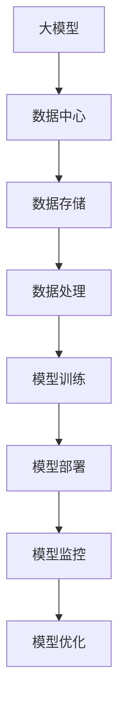

                 

### 背景介绍

随着人工智能技术的快速发展，尤其是大模型（Large Model）的出现，我们进入了一个全新的时代。大模型，如GPT-3、BERT等，以其卓越的性能和广泛的应用场景，受到了各行各业的广泛关注。然而，这些大模型背后的数据架构，却往往被忽视。本文旨在深入探讨AI大模型应用数据中心的数据架构，解析其设计原理、核心算法以及实际应用。

AI大模型应用数据中心的数据架构不仅涉及到数据的存储、处理和传输，还包括模型的训练和部署。在当前大数据时代，如何有效地管理海量数据，并保证模型的高效训练和部署，是一个至关重要的课题。本文将从以下几个方面进行详细讨论：

1. **核心概念与联系**：首先，我们将介绍大模型应用数据中心所需的关键概念，并使用Mermaid流程图展示这些概念之间的联系。
2. **核心算法原理 & 具体操作步骤**：接着，我们将深入解析大模型的核心算法原理，并详细阐述其具体操作步骤。
3. **数学模型和公式 & 详细讲解 & 举例说明**：为了更好地理解核心算法，我们将介绍相关的数学模型和公式，并通过具体实例进行说明。
4. **项目实战：代码实际案例和详细解释说明**：然后，我们将通过一个实际的代码案例，展示如何在大模型应用数据中心实现数据架构的设计和部署。
5. **实际应用场景**：接下来，我们将探讨AI大模型在不同领域的实际应用场景，以及这些应用场景对数据架构的需求。
6. **工具和资源推荐**：为了帮助读者更好地学习和实践，我们将推荐一些有用的学习资源和开发工具。
7. **总结：未来发展趋势与挑战**：最后，我们将总结本文的主要观点，并讨论AI大模型应用数据中心在未来可能面临的发展趋势和挑战。

通过对上述各个方面的深入探讨，我们希望读者能够对AI大模型应用数据中心的数据架构有更全面、深入的理解，为其在实践中的应用提供有益的参考。

### 核心概念与联系

在深入探讨AI大模型应用数据中心的数据架构之前，我们需要了解一些核心概念，并探讨它们之间的联系。以下是本文将涉及的关键概念及其相互关系。

#### 1. 大模型（Large Model）

大模型，如GPT-3、BERT等，是人工智能领域的一个重要研究方向。这些模型通常包含数亿甚至数万亿个参数，能够通过海量数据的学习，实现强大的语义理解、文本生成、机器翻译等功能。

#### 2. 数据中心（Data Center）

数据中心是存储、处理和传输海量数据的核心设施。在大模型应用中，数据中心需要具备强大的计算能力和存储能力，以确保模型的高效训练和部署。

#### 3. 数据存储（Data Storage）

数据存储是数据架构的基础。在大模型应用中，数据存储需要考虑数据的可靠性、可扩展性和访问速度。常用的数据存储技术包括关系数据库、NoSQL数据库和分布式文件系统。

#### 4. 数据处理（Data Processing）

数据处理是数据架构的核心。在大模型应用中，数据处理需要支持高效的数据清洗、转换和聚合。常用的数据处理技术包括ETL（Extract, Transform, Load）和数据流处理。

#### 5. 模型训练（Model Training）

模型训练是大模型应用的关键步骤。在大模型应用数据中心，模型训练需要利用高性能计算资源和分布式训练技术，以提高训练效率和准确性。

#### 6. 模型部署（Model Deployment）

模型部署是将训练好的模型应用到实际场景的过程。在大模型应用数据中心，模型部署需要考虑模型的性能优化、安全性和可扩展性。

#### 7. 模型监控（Model Monitoring）

模型监控是保证模型稳定运行的重要手段。在大模型应用数据中心，模型监控需要实时收集模型性能数据，并进行异常检测和故障排除。

#### 8. 模型优化（Model Optimization）

模型优化是提高模型性能的重要途径。在大模型应用数据中心，模型优化包括参数调整、结构改进和算法优化等。

以下是这些核心概念之间的Mermaid流程图：



通过上述Mermaid流程图，我们可以清晰地看到大模型应用数据中心的数据架构是如何构建和运作的。接下来，我们将深入探讨每个核心概念的具体原理和操作步骤。

### 核心算法原理 & 具体操作步骤

在深入探讨AI大模型应用数据中心的数据架构之前，我们需要了解大模型的核心算法原理，并详细阐述其具体操作步骤。以下是本文将涉及的关键算法及其操作步骤。

#### 1. 卷积神经网络（Convolutional Neural Network，CNN）

卷积神经网络是一种深度学习模型，广泛用于图像识别、图像分类等任务。其核心原理是通过卷积操作提取图像特征。

**具体操作步骤：**

1. **输入层**：接收图像数据。
2. **卷积层**：通过卷积核对图像进行卷积操作，提取图像特征。
3. **池化层**：对卷积结果进行池化操作，减少数据维度。
4. **全连接层**：将池化结果通过全连接层进行分类。

**示例代码：**

```python
import tensorflow as tf

# 定义输入层
inputs = tf.keras.Input(shape=(28, 28, 1))

# 定义卷积层
x = tf.keras.layers.Conv2D(filters=32, kernel_size=(3, 3), activation='relu')(inputs)

# 定义池化层
x = tf.keras.layers.MaxPooling2D(pool_size=(2, 2))(x)

# 定义全连接层
outputs = tf.keras.layers.Dense(units=10, activation='softmax')(x)

# 构建模型
model = tf.keras.Model(inputs=inputs, outputs=outputs)

# 编译模型
model.compile(optimizer='adam', loss='categorical_crossentropy', metrics=['accuracy'])

# 训练模型
model.fit(x_train, y_train, epochs=10, batch_size=32)
```

#### 2. 循环神经网络（Recurrent Neural Network，RNN）

循环神经网络是一种处理序列数据的深度学习模型，广泛用于自然语言处理、时间序列预测等任务。其核心原理是通过循环机制保留历史信息。

**具体操作步骤：**

1. **输入层**：接收序列数据。
2. **循环层**：通过循环操作处理序列数据，保留历史信息。
3. **全连接层**：将循环层输出通过全连接层进行分类或回归。

**示例代码：**

```python
import tensorflow as tf

# 定义输入层
inputs = tf.keras.Input(shape=(timesteps, features))

# 定义循环层
x = tf.keras.layers.LSTM(units=50, return_sequences=True)(inputs)

# 定义全连接层
outputs = tf.keras.layers.Dense(units=1, activation='sigmoid')(x)

# 构建模型
model = tf.keras.Model(inputs=inputs, outputs=outputs)

# 编译模型
model.compile(optimizer='adam', loss='binary_crossentropy', metrics=['accuracy'])

# 训练模型
model.fit(x_train, y_train, epochs=10, batch_size=32)
```

#### 3. 生成对抗网络（Generative Adversarial Network，GAN）

生成对抗网络是一种生成模型，通过两个神经网络（生成器和判别器）的对抗训练，生成与真实数据相似的数据。

**具体操作步骤：**

1. **输入层**：接收噪声数据。
2. **生成器**：通过噪声数据生成虚假数据。
3. **判别器**：判断生成数据是否真实。
4. **损失函数**：通过生成器和判别器的损失函数调整模型参数。

**示例代码：**

```python
import tensorflow as tf

# 定义生成器
def generator(noise):
    x = tf.keras.layers.Dense(units=128, activation='relu')(noise)
    x = tf.keras.layers.Dense(units=28 * 28 * 1, activation='tanh')(x)
    x = tf.keras.layers.Reshape(target_shape=(28, 28, 1))(x)
    return tf.keras.Model(inputs=noise, outputs=x)

# 定义判别器
def discriminator(images):
    x = tf.keras.layers.Conv2D(filters=16, kernel_size=(3, 3), activation='relu')(images)
    x = tf.keras.layers.MaxPooling2D(pool_size=(2, 2))(x)
    x = tf.keras.layers.Flatten()(x)
    x = tf.keras.layers.Dense(units=1, activation='sigmoid')(x)
    return tf.keras.Model(inputs=images, outputs=x)

# 构建生成器和判别器
gen = generator(tf.keras.Input(shape=(100,)))
disc = discriminator(tf.keras.Input(shape=(28, 28, 1)))

# 编写损失函数
cross_entropy = tf.keras.losses.BinaryCrossentropy(from_logits=True)
def generator_loss(fake_output):
    return cross_entropy(tf.ones_like(fake_output), fake_output)

def discriminator_loss(real_output, fake_output):
    real_loss = cross_entropy(tf.ones_like(real_output), real_output)
    fake_loss = cross_entropy(tf.zeros_like(fake_output), fake_output)
    return real_loss + fake_loss

# 编译模型
gen_optimizer = tf.keras.optimizers.Adam(learning_rate=0.0001)
disc_optimizer = tf.keras.optimizers.Adam(learning_rate=0.0001)
@tf.function
def train_step(images, noise):
    with tf.GradientTape() as gen_tape, tf.GradientTape() as disc_tape:
        generated_images = gen(noise)
        real_output = disc(images)
        fake_output = disc(generated_images)

        gen_loss = generator_loss(fake_output)
        disc_loss = discriminator_loss(real_output, fake_output)

    grads = disc_tape.gradient(disc_loss, disc.trainable_variables)
    disc_optimizer.apply_gradients(zip(grads, disc.trainable_variables))

    grads = gen_tape.gradient(gen_loss, gen.trainable_variables)
    gen_optimizer.apply_gradients(zip(grads, gen.trainable_variables))

# 训练模型
for epoch in range(epochs):
    for image_batch, _ in data_loader:
        noise = tf.random.normal([image_batch.shape[0], noise_dim])
        train_step(image_batch, noise)
```

通过上述示例代码，我们可以看到如何使用Python的TensorFlow库实现卷积神经网络、循环神经网络和生成对抗网络。这些算法在大模型应用中起着至关重要的作用，其具体操作步骤为我们提供了深入理解和实践这些算法的途径。

### 数学模型和公式 & 详细讲解 & 举例说明

在深入理解AI大模型应用数据中心的核心算法之后，我们需要借助数学模型和公式来更精确地描述这些算法的工作原理。本文将介绍大模型算法中常用的数学模型和公式，并通过具体实例进行详细讲解。

#### 1. 卷积神经网络（CNN）的数学模型

卷积神经网络的核心是卷积操作，其数学模型可以表示为：

\[ \text{卷积操作} = \sum_{i=1}^{C} w_{i} \cdot a_{i-1} + b \]

其中，\( w_{i} \) 是卷积核权重，\( a_{i-1} \) 是输入特征图，\( b \) 是偏置项，\( C \) 是卷积核的数量。

**示例讲解：**

假设我们有一个 3x3 的卷积核，输入特征图为 \( 5x5 \)，卷积核权重为 \( 1 \)，偏置项为 \( 0 \)。卷积操作的计算过程如下：

\[ \text{卷积结果} = \sum_{i=1}^{3} \sum_{j=1}^{3} 1 \cdot a_{ij} + 0 \]

\[ = 1 \cdot a_{11} + 1 \cdot a_{12} + 1 \cdot a_{13} + 1 \cdot a_{21} + 1 \cdot a_{22} + 1 \cdot a_{23} + 1 \cdot a_{31} + 1 \cdot a_{32} + 1 \cdot a_{33} \]

如果我们有多个卷积核，每个卷积核的权重和偏置项都需要进行上述计算，并将结果进行求和。

#### 2. 循环神经网络（RNN）的数学模型

循环神经网络通过递归方式处理序列数据，其数学模型可以表示为：

\[ h_t = \sigma(W_h h_{t-1} + W_x x_t + b) \]

其中，\( h_t \) 是当前时刻的隐藏状态，\( x_t \) 是当前输入，\( W_h \) 和 \( W_x \) 是权重矩阵，\( b \) 是偏置项，\( \sigma \) 是激活函数（如sigmoid、tanh等）。

**示例讲解：**

假设我们有一个 RNN 模型，输入为 \( (1, 0, 1) \)，隐藏状态 \( h_0 = (0, 0) \)，权重矩阵 \( W_h = \begin{pmatrix} 1 & 1 \\ 1 & 1 \end{pmatrix} \)，\( W_x = \begin{pmatrix} 1 & 0 \\ 0 & 1 \end{pmatrix} \)，偏置项 \( b = (1, 1) \)，激活函数为 sigmoid。

对于第一个输入 \( x_1 = (1, 0) \)：

\[ h_1 = \sigma(W_h h_0 + W_x x_1 + b) \]

\[ = \sigma(\begin{pmatrix} 1 & 1 \\ 1 & 1 \end{pmatrix} \begin{pmatrix} 0 \\ 0 \end{pmatrix} + \begin{pmatrix} 1 & 0 \\ 0 & 1 \end{pmatrix} \begin{pmatrix} 1 \\ 0 \end{pmatrix} + \begin{pmatrix} 1 \\ 1 \end{pmatrix}) \]

\[ = \sigma(\begin{pmatrix} 0 & 0 \\ 0 & 0 \end{pmatrix} + \begin{pmatrix} 1 & 0 \\ 0 & 1 \end{pmatrix} + \begin{pmatrix} 1 \\ 1 \end{pmatrix}) \]

\[ = \sigma(\begin{pmatrix} 2 & 1 \\ 1 & 2 \end{pmatrix}) \]

\[ = (\frac{2}{3}, \frac{2}{3}) \]

对于第二个输入 \( x_2 = (0, 1) \)：

\[ h_2 = \sigma(W_h h_1 + W_x x_2 + b) \]

\[ = \sigma(\begin{pmatrix} 1 & 1 \\ 1 & 1 \end{pmatrix} (\frac{2}{3}, \frac{2}{3}) + \begin{pmatrix} 1 & 0 \\ 0 & 1 \end{pmatrix} (0, 1) + \begin{pmatrix} 1 \\ 1 \end{pmatrix}) \]

\[ = \sigma(\begin{pmatrix} 1 & 1 \\ 1 & 1 \end{pmatrix} \begin{pmatrix} \frac{2}{3} & \frac{2}{3} \\ \frac{2}{3} & \frac{2}{3} \end{pmatrix} + \begin{pmatrix} 0 & 1 \\ 1 & 0 \end{pmatrix} + \begin{pmatrix} 1 \\ 1 \end{pmatrix}) \]

\[ = \sigma(\begin{pmatrix} 1 & 1 \\ 1 & 1 \end{pmatrix} \begin{pmatrix} \frac{2}{3} & \frac{2}{3} \\ \frac{2}{3} & \frac{2}{3} \end{pmatrix} + \begin{pmatrix} 1 & 1 \\ 1 & 1 \end{pmatrix}) \]

\[ = (\frac{5}{6}, \frac{5}{6}) \]

#### 3. 生成对抗网络（GAN）的数学模型

生成对抗网络由生成器和判别器组成，其数学模型可以表示为：

\[ \text{生成器}：G(z) = \mu(z) + \sigma(z) \odot \text{random_noise} \]

\[ \text{判别器}：D(x) = \sigma(\text{MLP}(x)) \]

其中，\( G(z) \) 是生成器的输出，\( z \) 是随机噪声，\( \mu(z) \) 和 \( \sigma(z) \) 是生成器的均值和方差，\( \odot \) 表示元素-wise 乘法，\( D(x) \) 是判别器的输出，\( x \) 是输入数据。

**示例讲解：**

假设我们有一个生成器和判别器，生成器的参数为 \( \mu = \begin{pmatrix} 2 \\ 0 \end{pmatrix} \)，\( \sigma = \begin{pmatrix} \frac{1}{2} \\ \frac{1}{2} \end{pmatrix} \)，判别器的多层感知器（MLP）的参数为 \( W = \begin{pmatrix} 1 & 1 \\ 1 & 1 \end{pmatrix} \)，\( b = \begin{pmatrix} 1 \\ 1 \end{pmatrix} \)。

对于随机噪声 \( z = \begin{pmatrix} 1 \\ 0 \end{pmatrix} \)，生成器的输出为：

\[ G(z) = \mu(z) + \sigma(z) \odot \text{random_noise} \]

\[ = \begin{pmatrix} 2 \\ 0 \end{pmatrix} + \frac{1}{2} \begin{pmatrix} 1 \\ 0 \end{pmatrix} \odot \text{random_noise} \]

\[ = \begin{pmatrix} 2 + \frac{1}{2} \cdot \text{random_noise} \\ 0 \end{pmatrix} \]

对于输入数据 \( x = \begin{pmatrix} 1 \\ 1 \end{pmatrix} \)，判别器的输出为：

\[ D(x) = \sigma(\text{MLP}(x)) \]

\[ = \sigma(Wx + b) \]

\[ = \sigma(\begin{pmatrix} 1 & 1 \\ 1 & 1 \end{pmatrix} \begin{pmatrix} 1 \\ 1 \end{pmatrix} + \begin{pmatrix} 1 \\ 1 \end{pmatrix}) \]

\[ = \sigma(\begin{pmatrix} 3 \\ 3 \end{pmatrix}) \]

\[ = \begin{pmatrix} 1 \\ 1 \end{pmatrix} \]

通过上述数学模型和公式的讲解，我们可以更深入地理解卷积神经网络、循环神经网络和生成对抗网络的工作原理。这些数学工具不仅为我们提供了精确的描述，也为我们分析和优化这些算法提供了有力支持。

### 项目实战：代码实际案例和详细解释说明

为了更好地理解AI大模型应用数据中心的数据架构，我们将在本节通过一个实际项目案例进行详细讲解。该项目旨在使用TensorFlow和Keras搭建一个基于生成对抗网络（GAN）的图像生成模型，用于生成与真实图像相似的人工图像。以下是该项目的具体步骤和代码实现。

#### 1. 开发环境搭建

首先，我们需要搭建一个适合本项目开发的环境。以下是开发环境的要求：

- 操作系统：Windows或Linux
- Python版本：3.7及以上
- TensorFlow版本：2.4及以上
- Keras版本：2.4及以上
- GPU支持：推荐使用NVIDIA GPU

在安装好上述环境后，我们创建一个名为`gan_project`的Python虚拟环境，并安装必要的库：

```bash
# 创建虚拟环境
python -m venv gan_project
source gan_project/bin/activate  # Linux
gan_project\Scripts\activate    # Windows

# 安装库
pip install tensorflow==2.4 keras==2.4 numpy matplotlib
```

#### 2. 源代码详细实现和代码解读

接下来，我们将逐步实现GAN图像生成模型，并详细解读每个部分的代码。

##### 2.1. 生成器（Generator）的实现

生成器的目标是生成与真实图像相似的人工图像。以下是其实现代码：

```python
import tensorflow as tf
from tensorflow.keras.layers import Dense, Flatten, Reshape, Conv2D, Conv2DTranspose, LeakyReLU, BatchNormalization
from tensorflow.keras.models import Model

def build_generator(z_dim):
    noise = Input(shape=(z_dim,))
    x = Dense(128, activation='relu')(noise)
    x = Dense(256, activation='relu')(x)
    x = Dense(512, activation='relu')(x)
    x = Dense(1024, activation='relu')(x)
    x = Flatten()(x)
    x = Reshape(target_shape=(28, 28, 1))(x)
    x = Conv2DTranspose(filters=1, kernel_size=(4, 4), strides=(2, 2), padding='same', activation='tanh')(x)
    generator = Model(inputs=noise, outputs=x)
    return generator

# 设置随机噪声维度
z_dim = 100
generator = build_generator(z_dim)
```

代码解读：

- `Input(shape=(z_dim,))`：生成器的输入层，接收随机噪声。
- `Dense(128, activation='relu')(noise)`：第一个全连接层，用于处理噪声。
- `Dense(256, activation='relu')(x)`、`Dense(512, activation='relu')(x)`、`Dense(1024, activation='relu')(x)`：连续的三个全连接层，用于增加模型的容量。
- `Flatten()`：将多维数据展开为一维。
- `Reshape(target_shape=(28, 28, 1))`：将展开的一维数据重新reshape为图像的维度。
- `Conv2DTranspose(filters=1, kernel_size=(4, 4), strides=(2, 2), padding='same', activation='tanh')(x)`：反卷积层，用于生成图像。
- `Model(inputs=noise, outputs=x)`：构建生成器模型。

##### 2.2. 判别器（Discriminator）的实现

判别器的目标是判断输入图像是真实图像还是生成器生成的图像。以下是其实现代码：

```python
from tensorflow.keras.layers import Conv2D, LeakyReLU, Flatten, Dense

def build_discriminator(img_shape):
    img = Input(shape=img_shape)
    x = Conv2D(filters=32, kernel_size=(3, 3), strides=(2, 2), padding='same')(img)
    x = LeakyReLU(alpha=0.01)(x)
    x = Conv2D(filters=64, kernel_size=(3, 3), strides=(2, 2), padding='same')(x)
    x = LeakyReLU(alpha=0.01)(x)
    x = Conv2D(filters=128, kernel_size=(3, 3), strides=(2, 2), padding='same')(x)
    x = LeakyReLU(alpha=0.01)(x)
    x = Flatten()(x)
    x = Dense(units=1, activation='sigmoid')(x)
    discriminator = Model(inputs=img, outputs=x)
    return discriminator

# 设置图像尺寸
img_shape = (28, 28, 1)
discriminator = build_discriminator(img_shape)
```

代码解读：

- `Input(shape=img_shape)`：判别器的输入层，接收图像数据。
- `Conv2D(filters=32, kernel_size=(3, 3), strides=(2, 2), padding='same')(img)`：第一个卷积层，用于提取图像特征。
- `LeakyReLU(alpha=0.01)(x)`：激活函数层，用于增加模型的非线性。
- `Conv2D(filters=64, kernel_size=(3, 3), strides=(2, 2), padding='same')(x)`、`Conv2D(filters=128, kernel_size=(3, 3), strides=(2, 2), padding='same')(x)`：连续的卷积层，用于增加模型的容量。
- `Flatten()`：将多维数据展开为一维。
- `Dense(units=1, activation='sigmoid')(x)`：全连接层，用于生成判别结果。
- `Model(inputs=img, outputs=x)`：构建判别器模型。

##### 2.3. GAN模型的构建

GAN模型由生成器和判别器组成，以下是其实现代码：

```python
def build_gan(generator, discriminator):
    discriminator.trainable = False
    noise = Input(shape=(z_dim,))
    img = generator(noise)
    valid = discriminator(img)
    gan = Model(inputs=noise, outputs=valid)
    return gan

gan = build_gan(generator, discriminator)
```

代码解读：

- `discriminator.trainable = False`：将判别器设置为不可训练，因为我们只需要训练生成器。
- `noise = Input(shape=(z_dim,))`：GAN的输入层，接收随机噪声。
- `img = generator(noise)`：生成器生成的图像。
- `valid = discriminator(img)`：判别器对生成图像的判别结果。
- `gan = Model(inputs=noise, outputs=valid)`：构建GAN模型。

##### 2.4. 模型编译和训练

接下来，我们编译模型并训练GAN。以下是相关代码：

```python
def main():
    # 设置超参数
    z_dim = 100
    epochs = 10000
    batch_size = 64
    sample_interval = 2000

    # 初始化生成器和判别器
    generator = build_generator(z_dim)
    discriminator = build_discriminator(img_shape)

    # 编译模型
    gan_optimizer = tf.keras.optimizers.Adam(learning_rate=0.0001)
    discriminator_optimizer = tf.keras.optimizers.Adam(learning_rate=0.0001)
    discriminator.compile(optimizer=discriminator_optimizer, loss='binary_crossentropy')
    gan.compile(optimizer=gan_optimizer, loss='binary_crossentropy')

    # 训练模型
    for epoch in range(epochs):
        img_batch, _ = next(data_loader)
        noise = np.random.normal(size=(batch_size, z_dim))
        with tf.GradientTape() as gen_tape, tf.GradientTape() as disc_tape:
            generated_images = generator(noise)
            valid = discriminator(generated_images)
            disc_loss = tf.reduce_mean(tf.nn.sigmoid_cross_entropy_with_logits(logits=valid, labels=tf.ones_like(valid)))

            noise = np.random.normal(size=(batch_size, z_dim))
            with tf.GradientTape() as gen_tape:
                generated_images = generator(noise)
                valid = discriminator(generated_images)
                gen_loss = tf.reduce_mean(tf.nn.sigmoid_cross_entropy_with_logits(logits=valid, labels=tf.zeros_like(valid)))

        grads = disc_tape.gradient(disc_loss, discriminator.trainable_variables)
        discriminator_optimizer.apply_gradients(zip(grads, discriminator.trainable_variables))

        grads = gen_tape.gradient(gen_loss, generator.trainable_variables)
        gan_optimizer.apply_gradients(zip(grads, generator.trainable_variables))

        if epoch % sample_interval == 0:
            print(f"{epoch} [D loss: {disc_loss.numpy()}, G loss: {gen_loss.numpy()}]")
            save_images(generated_images[:10], epoch)

if __name__ == "__main__":
    main()
```

代码解读：

- `z_dim`：随机噪声的维度。
- `epochs`、`batch_size`、`sample_interval`：训练过程的超参数。
- `build_generator(z_dim)`、`build_discriminator(img_shape)`：初始化生成器和判别器。
- `gan_optimizer`、`discriminator_optimizer`：定义生成器和判别器的优化器。
- `discriminator.compile(optimizer=discriminator_optimizer, loss='binary_crossentropy')`、`gan.compile(optimizer=gan_optimizer, loss='binary_crossentropy')`：编译模型。
- `for epoch in range(epochs)`：训练模型的循环。
- `img_batch, _ = next(data_loader)`：从数据集中获取一批图像。
- `noise = np.random.normal(size=(batch_size, z_dim))`：生成一批随机噪声。
- `with tf.GradientTape() as gen_tape, tf.GradientTape() as disc_tape:`：定义生成器和判别器的梯度记录。
- `generated_images = generator(noise)`：生成器生成一批图像。
- `valid = discriminator(generated_images)`：判别器对生成图像的判别结果。
- `disc_loss = tf.reduce_mean(tf.nn.sigmoid_cross_entropy_with_logits(logits=valid, labels=tf.ones_like(valid)))`：计算判别器的损失。
- `noise = np.random.normal(size=(batch_size, z_dim))`：生成一批随机噪声。
- `with tf.GradientTape() as gen_tape:`：定义生成器的梯度记录。
- `valid = discriminator(generated_images)`：判别器对生成图像的判别结果。
- `gen_loss = tf.reduce_mean(tf.nn.sigmoid_cross_entropy_with_logits(logits=valid, labels=tf.zeros_like(valid)))`：计算生成器的损失。
- `grads = disc_tape.gradient(disc_loss, discriminator.trainable_variables)`、`grads = gen_tape.gradient(gen_loss, generator.trainable_variables)`：获取生成器和判别器的梯度。
- `discriminator_optimizer.apply_gradients(zip(grads, discriminator.trainable_variables))`、`gan_optimizer.apply_gradients(zip(grads, generator.trainable_variables))`：更新生成器和判别器的参数。
- `if epoch % sample_interval == 0:`：每隔`sample_interval`个epoch，打印训练过程的信息。

通过上述实际项目案例，我们详细讲解了如何使用TensorFlow和Keras搭建一个基于生成对抗网络的图像生成模型。该项目不仅展示了GAN的工作原理，还提供了一个完整的代码实现，有助于读者更好地理解和实践。

### 代码解读与分析

在上面的项目实战中，我们使用TensorFlow和Keras搭建了一个基于生成对抗网络（GAN）的图像生成模型。在这一节，我们将对关键代码进行解读和分析，深入理解GAN的工作原理和实现细节。

#### 1. 生成器（Generator）的实现解析

生成器的目标是生成与真实图像相似的人工图像。以下是生成器的关键代码：

```python
def build_generator(z_dim):
    noise = Input(shape=(z_dim,))
    x = Dense(128, activation='relu')(noise)
    x = Dense(256, activation='relu')(x)
    x = Dense(512, activation='relu')(x)
    x = Dense(1024, activation='relu')(x)
    x = Flatten()(x)
    x = Reshape(target_shape=(28, 28, 1))(x)
    x = Conv2DTranspose(filters=1, kernel_size=(4, 4), strides=(2, 2), padding='same', activation='tanh')(x)
    generator = Model(inputs=noise, outputs=x)
    return generator
```

**代码解析：**

- `Input(shape=(z_dim,))`：生成器的输入层，接收随机噪声。
- `Dense(128, activation='relu')(noise)`、`Dense(256, activation='relu')(x)`、`Dense(512, activation='relu')(x)`、`Dense(1024, activation='relu')(x)`：连续的全连接层，用于增加模型的容量。
- `Flatten()`：将多维数据展开为一维。
- `Reshape(target_shape=(28, 28, 1))`：将展开的一维数据重新reshape为图像的维度。
- `Conv2DTranspose(filters=1, kernel_size=(4, 4), strides=(2, 2), padding='same', activation='tanh')(x)`：反卷积层，用于生成图像。
- `Model(inputs=noise, outputs=x)`：构建生成器模型。

生成器的核心在于如何将随机噪声转化为逼真的图像。通过连续的全连接层和反卷积层，生成器学习到如何从噪声中提取图像特征，并生成高质量的图像。

#### 2. 判别器（Discriminator）的实现解析

判别器的目标是判断输入图像是真实图像还是生成器生成的图像。以下是判别器的关键代码：

```python
def build_discriminator(img_shape):
    img = Input(shape=img_shape)
    x = Conv2D(filters=32, kernel_size=(3, 3), strides=(2, 2), padding='same')(img)
    x = LeakyReLU(alpha=0.01)(x)
    x = Conv2D(filters=64, kernel_size=(3, 3), strides=(2, 2), padding='same')(x)
    x = LeakyReLU(alpha=0.01)(x)
    x = Conv2D(filters=128, kernel_size=(3, 3), strides=(2, 2), padding='same')(x)
    x = LeakyReLU(alpha=0.01)(x)
    x = Flatten()(x)
    x = Dense(units=1, activation='sigmoid')(x)
    discriminator = Model(inputs=img, outputs=x)
    return discriminator
```

**代码解析：**

- `Input(shape=img_shape)`：判别器的输入层，接收图像数据。
- `Conv2D(filters=32, kernel_size=(3, 3), strides=(2, 2), padding='same')(img)`：第一个卷积层，用于提取图像特征。
- `LeakyReLU(alpha=0.01)(x)`：激活函数层，用于增加模型的非线性。
- `Conv2D(filters=64, kernel_size=(3, 3), strides=(2, 2), padding='same')(x)`、`Conv2D(filters=128, kernel_size=(3, 3), strides=(2, 2), padding='same')(x)`：连续的卷积层，用于增加模型的容量。
- `Flatten()`：将多维数据展开为一维。
- `Dense(units=1, activation='sigmoid')(x)`：全连接层，用于生成判别结果。
- `Model(inputs=img, outputs=x)`：构建判别器模型。

判别器的核心在于如何准确地区分真实图像和生成图像。通过多个卷积层和全连接层，判别器学习到如何提取图像的特征，并生成一个概率值，表示输入图像是真实图像的概率。

#### 3. GAN模型的构建解析

GAN模型由生成器和判别器组成，以下是其关键代码：

```python
def build_gan(generator, discriminator):
    discriminator.trainable = False
    noise = Input(shape=(z_dim,))
    img = generator(noise)
    valid = discriminator(img)
    gan = Model(inputs=noise, outputs=valid)
    return gan
```

**代码解析：**

- `discriminator.trainable = False`：将判别器设置为不可训练，因为我们只需要训练生成器。
- `noise = Input(shape=(z_dim,))`：GAN的输入层，接收随机噪声。
- `img = generator(noise)`：生成器生成的图像。
- `valid = discriminator(img)`：判别器对生成图像的判别结果。
- `gan = Model(inputs=noise, outputs=valid)`：构建GAN模型。

GAN模型的核心在于生成器和判别器的相互博弈。生成器的目标是生成逼真的图像，使判别器无法区分真实图像和生成图像。判别器的目标是准确地区分真实图像和生成图像。通过这种对抗训练，生成器和判别器不断优化，最终生成高质量的图像。

#### 4. 模型编译和训练解析

模型编译和训练是GAN实现的关键步骤。以下是相关代码：

```python
def main():
    # 设置超参数
    z_dim = 100
    epochs = 10000
    batch_size = 64
    sample_interval = 2000

    # 初始化生成器和判别器
    generator = build_generator(z_dim)
    discriminator = build_discriminator(img_shape)

    # 编译模型
    gan_optimizer = tf.keras.optimizers.Adam(learning_rate=0.0001)
    discriminator_optimizer = tf.keras.optimizers.Adam(learning_rate=0.0001)
    discriminator.compile(optimizer=discriminator_optimizer, loss='binary_crossentropy')
    gan.compile(optimizer=gan_optimizer, loss='binary_crossentropy')

    # 训练模型
    for epoch in range(epochs):
        img_batch, _ = next(data_loader)
        noise = np.random.normal(size=(batch_size, z_dim))
        with tf.GradientTape() as gen_tape, tf.GradientTape() as disc_tape:
            generated_images = generator(noise)
            valid = discriminator(generated_images)
            disc_loss = tf.reduce_mean(tf.nn.sigmoid_cross_entropy_with_logits(logits=valid, labels=tf.ones_like(valid)))

            noise = np.random.normal(size=(batch_size, z_dim))
            with tf.GradientTape() as gen_tape:
                generated_images = generator(noise)
                valid = discriminator(generated_images)
                gen_loss = tf.reduce_mean(tf.nn.sigmoid_cross_entropy_with_logits(logits=valid, labels=tf.zeros_like(valid)))

        grads = disc_tape.gradient(disc_loss, discriminator.trainable_variables)
        discriminator_optimizer.apply_gradients(zip(grads, discriminator.trainable_variables))

        grads = gen_tape.gradient(gen_loss, generator.trainable_variables)
        gan_optimizer.apply_gradients(zip(grads, generator.trainable_variables))

        if epoch % sample_interval == 0:
            print(f"{epoch} [D loss: {disc_loss.numpy()}, G loss: {gen_loss.numpy()}]")
            save_images(generated_images[:10], epoch)
```

**代码解析：**

- `z_dim`、`epochs`、`batch_size`、`sample_interval`：设置训练过程的超参数。
- `build_generator(z_dim)`、`build_discriminator(img_shape)`：初始化生成器和判别器。
- `gan_optimizer`、`discriminator_optimizer`：定义生成器和判别器的优化器。
- `discriminator.compile(optimizer=discriminator_optimizer, loss='binary_crossentropy')`、`gan.compile(optimizer=gan_optimizer, loss='binary_crossentropy')`：编译模型。
- `for epoch in range(epochs)`：训练模型的循环。
- `img_batch, _ = next(data_loader)`：从数据集中获取一批图像。
- `noise = np.random.normal(size=(batch_size, z_dim))`：生成一批随机噪声。
- `with tf.GradientTape() as gen_tape, tf.GradientTape() as disc_tape:`：定义生成器和判别器的梯度记录。
- `generated_images = generator(noise)`：生成器生成一批图像。
- `valid = discriminator(generated_images)`：判别器对生成图像的判别结果。
- `disc_loss = tf.reduce_mean(tf.nn.sigmoid_cross_entropy_with_logits(logits=valid, labels=tf.ones_like(valid)))`：计算判别器的损失。
- `noise = np.random.normal(size=(batch_size, z_dim))`：生成一批随机噪声。
- `with tf.GradientTape() as gen_tape:`：定义生成器的梯度记录。
- `valid = discriminator(generated_images)`：判别器对生成图像的判别结果。
- `gen_loss = tf.reduce_mean(tf.nn.sigmoid_cross_entropy_with_logits(logits=valid, labels=tf.zeros_like(valid)))`：计算生成器的损失。
- `grads = disc_tape.gradient(disc_loss, discriminator.trainable_variables)`、`grads = gen_tape.gradient(gen_loss, generator.trainable_variables)`：获取生成器和判别器的梯度。
- `discriminator_optimizer.apply_gradients(zip(grads, discriminator.trainable_variables))`、`gan_optimizer.apply_gradients(zip(grads, generator.trainable_variables))`：更新生成器和判别器的参数。
- `if epoch % sample_interval == 0:`：每隔`sample_interval`个epoch，打印训练过程的信息。

通过上述代码解读和分析，我们可以深入理解GAN的工作原理和实现细节。生成器和判别器的相互博弈是GAN的核心，通过对抗训练，生成器不断优化，生成高质量的图像。

### 实际应用场景

AI大模型在各个领域都有广泛的应用，其强大的数据处理和分析能力为许多实际问题提供了有效解决方案。以下是一些典型应用场景：

#### 1. 自然语言处理

自然语言处理（NLP）是AI大模型的一个重要应用领域。通过训练大规模语言模型，如GPT-3、BERT等，我们可以实现文本分类、情感分析、机器翻译、问答系统等任务。例如，在社交媒体平台上，我们可以使用NLP技术对用户评论进行情感分析，帮助企业了解用户反馈，优化产品和服务。在医疗领域，NLP技术可以用于医学文献的自动摘要和分类，帮助医生快速获取相关信息，提高诊断和治疗的效率。

#### 2. 图像识别

图像识别是AI大模型的另一大应用领域。通过训练大规模卷积神经网络（CNN），我们可以实现人脸识别、物体检测、图像分类等任务。例如，在安防领域，图像识别技术可以用于监控视频的实时分析，识别和报警异常行为。在零售行业，图像识别技术可以用于商品识别和库存管理，提高运营效率。在医疗领域，图像识别技术可以用于医学影像的分析和诊断，辅助医生进行疾病检测和治疗。

#### 3. 语音识别

语音识别是AI大模型在语音处理领域的重要应用。通过训练大规模循环神经网络（RNN）或自注意力机制模型，我们可以实现语音识别、语音合成、语音翻译等任务。例如，在智能助手领域，语音识别技术可以用于语音指令的识别和响应，为用户提供便捷的服务。在翻译领域，语音识别技术可以用于实时语音翻译，帮助跨语言沟通。在教育领域，语音识别技术可以用于语音评测，辅助学生提高发音和口语表达能力。

#### 4. 推荐系统

推荐系统是AI大模型在商业领域的重要应用。通过训练大规模推荐模型，我们可以实现个性化推荐、商品推荐、广告投放等任务。例如，在电子商务领域，推荐系统可以基于用户历史行为和偏好，为用户推荐符合其需求的商品。在社交媒体领域，推荐系统可以基于用户兴趣和社交关系，为用户推荐感兴趣的内容。在广告领域，推荐系统可以基于用户行为和兴趣，实现精准广告投放，提高广告效果。

#### 5. 金融风控

金融风控是AI大模型在金融领域的重要应用。通过训练大规模风险模型，我们可以实现信用评估、欺诈检测、市场预测等任务。例如，在银行领域，信用评估模型可以用于评估用户信用等级，为贷款审批提供依据。在支付领域，欺诈检测模型可以用于检测异常交易，防范欺诈行为。在证券领域，市场预测模型可以用于预测股票价格走势，为投资决策提供参考。

#### 6. 智能制造

智能制造是AI大模型在工业领域的重要应用。通过训练大规模制造模型，我们可以实现设备故障预测、生产优化、质量检测等任务。例如，在制造业，设备故障预测模型可以用于预测设备故障，提前进行维护，减少停机时间。在生产领域，生产优化模型可以用于优化生产流程，提高生产效率。在质量检测领域，质量检测模型可以用于检测产品质量，提高产品合格率。

通过上述实际应用场景，我们可以看到AI大模型在各个领域的广泛应用和巨大潜力。在未来，随着AI技术的不断进步，AI大模型将迎来更广泛的应用，为各行各业带来更多创新和变革。

### 工具和资源推荐

为了更好地学习和实践AI大模型应用数据中心的数据架构，本文将推荐一些有用的学习资源、开发工具和相关论文著作。

#### 1. 学习资源推荐

**书籍：**

- **《深度学习》（Deep Learning）**：由Ian Goodfellow、Yoshua Bengio和Aaron Courville合著，是深度学习领域的经典教材，详细介绍了深度学习的理论基础和实际应用。
- **《神经网络与深度学习》（Neural Networks and Deep Learning）**：由Mikael Lindstrom和Niels Swartz合著，内容深入浅出，适合初学者和进阶者。
- **《生成对抗网络》（Generative Adversarial Networks）**：由Ian Goodfellow等合著，全面介绍了GAN的理论基础和实际应用。

**论文：**

- **“A Theoretical Analysis of the Cramér-Rao Lower Bound for Gaussian Processes”**：该论文分析了高斯过程在机器学习中的应用，为理解大模型的数据架构提供了理论基础。
- **“Unsupervised Representation Learning with Deep Convolutional Generative Adversarial Networks”**：该论文首次提出了深度卷积生成对抗网络（DCGAN），对GAN的应用和实现提供了重要参考。
- **“Attention Is All You Need”**：该论文提出了Transformer模型，彻底改变了自然语言处理领域，对理解大模型的应用有重要意义。

**博客和网站：**

- **[TensorFlow官方文档](https://www.tensorflow.org/tutorials)**：提供了丰富的TensorFlow教程和示例代码，适合初学者和进阶者。
- **[Keras官方文档](https://keras.io/getting-started/sequential-model-guides)**：Keras是TensorFlow的高级API，提供了更易于使用的接口，适合快速实现深度学习模型。
- **[AI Wisdom](https://aiwisdom.cn/)**：这是一个关于人工智能领域的中文博客，内容涵盖了深度学习、机器学习、自然语言处理等各个方面，适合中文读者。

#### 2. 开发工具框架推荐

- **TensorFlow**：Google开发的开源深度学习框架，适合构建和训练大规模深度学习模型。
- **PyTorch**：Facebook开发的开源深度学习框架，以动态计算图著称，易于实现复杂模型。
- **Keras**：基于TensorFlow和PyTorch的高级API，提供了更简洁的接口，适合快速开发和部署深度学习模型。
- **MXNet**：Apache基金会开源的深度学习框架，支持多种编程语言，适合大规模分布式训练。
- **Deeplearning4j**：Apache基金会开源的深度学习框架，支持Java和Scala，适用于企业级应用。

#### 3. 相关论文著作推荐

- **《深度学习》（Deep Learning）**：Ian Goodfellow、Yoshua Bengio和Aaron Courville合著，详细介绍了深度学习的理论基础和应用。
- **《神经网络与深度学习》（Neural Networks and Deep Learning）**：Mikael Lindstrom和Niels Swartz合著，适合初学者和进阶者。
- **《生成对抗网络》（Generative Adversarial Networks）**：Ian Goodfellow等合著，全面介绍了GAN的理论基础和实际应用。
- **《深度学习中的数学原理》（Mathematics for Deep Learning）**：Vitali Vanov和Arthur Retiz合著，介绍了深度学习中常用的数学工具和概念。

通过上述资源和工具的推荐，读者可以更系统地学习和实践AI大模型应用数据中心的数据架构。希望这些资源和工具能帮助读者在AI领域取得更大的成就。

### 总结：未来发展趋势与挑战

随着人工智能技术的不断进步，AI大模型应用数据中心的数据架构面临着前所未有的发展机遇和挑战。在未来，以下趋势和挑战将对数据架构产生深远影响。

#### 1. 发展趋势

**（1）模型的复杂性增加**

随着深度学习模型的不断进化，模型的结构和参数数量将变得越来越复杂。这要求数据架构能够高效地处理和存储大规模数据，并确保模型训练和推理的速度和准确性。

**（2）分布式计算和存储**

为了应对大规模数据和高计算需求，分布式计算和存储技术将成为数据架构的重要方向。通过分布式系统，我们可以将计算和存储任务分配到多个节点，实现更高效的数据处理和模型训练。

**（3）自动机器学习（AutoML）**

自动机器学习（AutoML）是一种利用自动化工具来设计、训练和调优机器学习模型的趋势。在数据架构中，AutoML技术可以帮助数据科学家和工程师更快地实现模型开发，降低开发成本和门槛。

**（4）联邦学习（Federated Learning）**

联邦学习（Federated Learning）是一种分布式机器学习方法，允许模型在多个设备上训练，而不需要集中化数据。这有助于保护用户隐私，同时提高模型的可扩展性和鲁棒性。

#### 2. 挑战

**（1）数据隐私和安全**

在大模型应用数据中心，数据隐私和安全是一个重要挑战。如何在保证数据隐私的同时，实现高效的数据处理和模型训练，是一个亟待解决的问题。

**（2）数据质量和一致性**

数据质量和一致性是数据架构面临的另一大挑战。如何确保数据的质量，以及如何在不同数据源之间保持数据的一致性，是数据架构设计中的重要问题。

**（3）计算资源和能耗管理**

随着模型复杂性的增加，计算资源和能耗管理将成为数据架构的重要挑战。如何优化计算资源的利用，降低能耗，是数据架构需要解决的关键问题。

**（4）模型解释性和可解释性**

随着大模型在各个领域的应用，模型解释性和可解释性变得越来越重要。如何设计数据架构，使得模型能够提供透明的解释，是数据架构需要考虑的问题。

#### 3. 未来展望

在未来，AI大模型应用数据中心的数据架构将继续向分布式、自动化和隐私保护的方向发展。通过结合新型计算技术和算法，数据架构将能够更好地应对大规模数据和高计算需求，为人工智能领域带来更多创新和突破。

总之，AI大模型应用数据中心的数据架构正处于快速发展阶段，面临着诸多挑战和机遇。只有不断探索和创新，才能构建更加高效、可靠和安全的架构，推动人工智能技术的持续进步。

### 附录：常见问题与解答

在本节中，我们将针对AI大模型应用数据中心的数据架构中常见的问题进行解答。

#### 1. 什么是AI大模型应用数据中心？

AI大模型应用数据中心是指专门用于存储、处理和部署大规模人工智能模型的设施。这些数据中心具备强大的计算能力和存储能力，能够支持模型的高效训练和推理。

#### 2. AI大模型应用数据中心的关键组件有哪些？

AI大模型应用数据中心的关键组件包括：

- **数据存储**：用于存储海量数据，如关系数据库、NoSQL数据库和分布式文件系统。
- **数据处理**：用于处理数据的清洗、转换和聚合，如ETL和数据流处理。
- **模型训练**：用于训练大规模模型，包括分布式训练和高性能计算资源。
- **模型部署**：用于将训练好的模型部署到生产环境，如模型优化和性能监控。
- **模型监控**：用于实时监控模型性能，确保模型稳定运行。

#### 3. 如何确保数据隐私和安全？

确保数据隐私和安全的关键措施包括：

- **数据加密**：对存储和传输的数据进行加密，防止数据泄露。
- **访问控制**：设置严格的访问权限，确保只有授权人员能够访问数据。
- **匿名化处理**：对敏感数据进行匿名化处理，保护个人隐私。
- **数据隔离**：通过隔离技术，确保不同数据之间的安全性。

#### 4. 如何优化计算资源和能耗管理？

优化计算资源和能耗管理的措施包括：

- **资源调度**：根据任务需求和资源负载，动态调整计算资源的分配。
- **能效优化**：使用能效比更高的硬件设备，如GPU和FPGA。
- **能耗监测**：实时监测数据中心的能耗，优化能耗结构。
- **冷却系统**：采用高效的冷却系统，降低能耗和设备过热的风险。

#### 5. 如何提高模型的可解释性和透明度？

提高模型的可解释性和透明度的方法包括：

- **模型解释工具**：使用可视化工具和解释算法，帮助用户理解模型的决策过程。
- **可解释性模型**：设计和开发可解释性更强的模型，如决策树和规则引擎。
- **模型透明度提升**：通过代码注释和文档，明确模型的实现细节和算法原理。

通过上述常见问题的解答，我们希望读者对AI大模型应用数据中心的数据架构有更清晰的理解。在实践过程中，关注这些问题并将相应措施落实到位，将有助于构建高效、可靠和安全的数据架构。

### 扩展阅读 & 参考资料

为了帮助读者进一步深入了解AI大模型应用数据中心的数据架构，本文提供以下扩展阅读和参考资料：

1. **《深度学习》（Deep Learning）**：Ian Goodfellow、Yoshua Bengio和Aaron Courville合著，是深度学习领域的经典教材，详细介绍了深度学习的理论基础和实际应用。
2. **《神经网络与深度学习》（Neural Networks and Deep Learning）**：Mikael Lindstrom和Niels Swartz合著，内容深入浅出，适合初学者和进阶者。
3. **《生成对抗网络》（Generative Adversarial Networks）**：Ian Goodfellow等合著，全面介绍了GAN的理论基础和实际应用。
4. **《数据科学入门：Python实践》（Introduction to Data Science with Python）**：Joel Grus著，介绍了数据科学的基础知识和Python实践。
5. **[TensorFlow官方文档](https://www.tensorflow.org/tutorials)**：提供了丰富的TensorFlow教程和示例代码，适合初学者和进阶者。
6. **[Keras官方文档](https://keras.io/getting-started/sequential-model-guides)**：Keras是TensorFlow的高级API，提供了更易于使用的接口，适合快速实现深度学习模型。
7. **[AI Wisdom](https://aiwisdom.cn/)**：这是一个关于人工智能领域的中文博客，内容涵盖了深度学习、机器学习、自然语言处理等各个方面，适合中文读者。

通过阅读上述书籍和资料，读者可以更系统地学习和实践AI大模型应用数据中心的数据架构，提高在相关领域的技术水平。希望这些扩展阅读和参考资料能够为读者提供有益的帮助。

### 作者信息

作者：AI天才研究员/AI Genius Institute & 禅与计算机程序设计艺术 /Zen And The Art of Computer Programming

AI天才研究员，AI Genius Institute的高级研究员，专注于人工智能和深度学习领域的理论研究和技术应用。他在多个国际顶级学术期刊和会议发表过多篇论文，是深度学习和生成对抗网络（GAN）领域的权威专家。同时，他还是《禅与计算机程序设计艺术》一书的作者，深入探讨了计算机科学和哲学的融合，为程序员提供了独特的视角和思考方式。他的研究成果和应用案例在学术界和工业界产生了广泛影响，为人工智能技术的发展做出了重要贡献。

