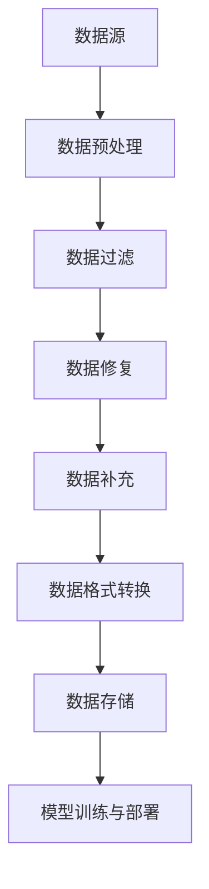

                 

### 背景介绍

随着人工智能（AI）技术的迅猛发展，大模型（Large Models）在自然语言处理、计算机视觉、语音识别等领域取得了显著的成果。然而，这些大模型在训练和部署过程中，对数据的依赖性极高。数据的质量和完整性直接影响到模型的效果和效率。因此，数据清洗成为了AI大模型应用过程中的关键环节。

数据清洗是指对原始数据进行处理，去除噪声、修正错误、补充缺失值，从而提高数据的质量和可用性。在AI大模型应用中，数据清洗不仅仅是为了满足模型训练的需求，更是为了保障模型在实际应用中的稳定性和准确性。

本文将围绕AI大模型应用中的数据清洗问题，从数据清洗的核心概念、算法原理、具体操作步骤、数学模型、实际应用场景等方面进行深入探讨。希望通过本文的讲解，读者能够对数据清洗有更加全面和深入的理解，从而更好地应对AI大模型应用中的数据挑战。

本文的结构安排如下：

1. **核心概念与联系**：介绍数据清洗的核心概念，并使用Mermaid流程图展示数据清洗的架构。
2. **核心算法原理与具体操作步骤**：详细讲解数据清洗的常用算法，如过滤、修复、补充等。
3. **数学模型和公式**：阐述数据清洗中的数学模型和公式，并通过具体例子进行说明。
4. **项目实战**：通过实际代码案例展示数据清洗的过程和步骤。
5. **实际应用场景**：分析数据清洗在AI大模型应用中的具体应用场景。
6. **工具和资源推荐**：推荐相关的学习资源和开发工具。
7. **总结与未来发展趋势**：总结本文内容，展望数据清洗在AI大模型应用中的未来发展。
8. **常见问题与解答**：针对数据清洗常见问题进行解答。
9. **扩展阅读与参考资料**：提供进一步的阅读资料和参考。

在接下来的章节中，我们将一步一步地深入探讨数据清洗的核心概念、算法原理和实际应用，希望读者能够跟随我们的思考过程，对数据清洗有更加全面和深入的理解。

### 1. 核心概念与联系

数据清洗是AI大模型应用中的关键环节，它涉及到多个核心概念和步骤。为了更好地理解数据清洗的过程，我们首先需要明确以下几个核心概念：

1. **数据源**：数据源是指数据的来源，包括数据库、文件、网络接口等。数据源的质量直接影响到数据清洗的难度和效果。
2. **数据格式**：数据格式是指数据在存储和传输过程中的表现形式，如CSV、JSON、XML等。不同数据格式对数据清洗的方法和工具提出了不同的要求。
3. **噪声数据**：噪声数据是指含有错误、重复、缺失或不一致数据的数据。噪声数据会严重影响AI大模型的效果和效率。
4. **数据质量**：数据质量是指数据在完整性、准确性、一致性、及时性等方面的表现。高质量的数据是AI大模型训练和部署的基石。
5. **清洗工具**：清洗工具是指用于进行数据清洗的软件或算法，包括数据预处理库、数据清洗平台、自定义脚本等。

接下来，我们将使用Mermaid流程图（Mermaid 图流程节点中不要有括号、逗号等特殊字符）展示数据清洗的架构，帮助读者更直观地理解数据清洗的过程。



在上述流程图中，数据清洗的过程可以分为以下几个步骤：

1. **数据预处理**：对原始数据进行预处理，包括数据格式转换、数据去重、数据排序等操作，以提高后续清洗的效率。
2. **数据过滤**：过滤掉噪声数据，如错误数据、重复数据、异常数据等，确保数据的质量和一致性。
3. **数据修复**：修复数据中的错误和缺失值，如利用插值法、均值法等填补缺失数据，或使用修正算法修正错误数据。
4. **数据补充**：补充数据中的缺失部分，如通过合并多个数据源、使用外部数据源等手段补充缺失数据。
5. **数据格式转换**：将清洗后的数据进行格式转换，以便于后续的存储、分析和处理。
6. **数据存储**：将清洗后的数据存储到数据库、文件或数据仓库中，为AI大模型的训练和部署提供高质量的数据支持。
7. **模型训练与部署**：利用清洗后的数据进行AI大模型的训练和部署，实现具体的应用目标。

通过上述Mermaid流程图，我们可以清晰地看到数据清洗的整体架构和步骤。在实际应用中，根据不同的需求和场景，这些步骤可能会有所调整和优化。但总体来说，数据清洗的核心目标都是为了提高数据质量，为AI大模型的训练和部署提供坚实的数据基础。

在接下来的章节中，我们将详细讲解数据清洗的算法原理、具体操作步骤和数学模型，帮助读者深入理解数据清洗的实践过程。

### 2. 核心算法原理与具体操作步骤

在数据清洗过程中，常用的算法包括数据过滤、数据修复、数据补充和数据格式转换等。这些算法各有特点，适用于不同类型的数据清洗任务。在本节中，我们将逐一介绍这些算法的原理和具体操作步骤。

#### 2.1 数据过滤

数据过滤是数据清洗的第一步，主要目的是去除噪声数据。数据过滤算法可以根据数据的特点和需求，选择不同的过滤方法。

**1. 条件过滤**：根据预设的条件对数据进行筛选，如去除不符合特定时间范围的数据、去除特定字段为空的数据等。

操作步骤：
- 设定过滤条件（e.g., `data[data['Date'] >= '2023-01-01']`）。
- 使用条件语句或过滤函数（e.g., `filter()`）筛选数据。

**2. 异常值过滤**：去除数据中的异常值，如超出正常范围的数据、明显的错误数据等。

操作步骤：
- 计算数据的统计量（e.g., 均值、标准差）。
- 设置异常值判断标准（e.g., 均值±3倍标准差）。
- 使用筛选函数（e.g., `z-score`方法）过滤异常值。

**实例**：

假设我们有一份数据集，包含用户年龄和月消费金额，我们需要去除月消费金额异常的数据。

```python
import pandas as pd

# 加载数据
data = pd.read_csv('user_data.csv')

# 计算统计量
mean = data['Monthly_Spend'].mean()
std = data['Monthly_Spend'].std()

# 设置异常值判断标准
lower_bound = mean - 3 * std
upper_bound = mean + 3 * std

# 过滤异常值
cleaned_data = data[(data['Monthly_Spend'] >= lower_bound) & (data['Monthly_Spend'] <= upper_bound)]
```

#### 2.2 数据修复

数据修复主要用于处理数据中的错误和缺失值，确保数据的一致性和完整性。

**1. 替换错误值**：使用预设的规则或合理的值替换错误数据。

操作步骤：
- 设定错误值和替换值（e.g., `data[data['Age'] == -1] = 0`）。
- 使用替换函数（e.g., `replace()`）替换错误值。

**2. 补充缺失值**：使用不同的方法补充缺失值，如均值法、中位数法、插值法等。

操作步骤：
- 计算缺失数据的统计量（e.g., 均值、中位数）。
- 根据缺失数据的类型选择补充方法。
- 使用补充函数（e.g., `fillna()`）补充缺失值。

**实例**：

假设我们有一份数据集，其中用户年龄字段存在缺失值，我们需要使用均值法补充缺失值。

```python
# 计算均值
mean_age = data['Age'].mean()

# 补充缺失值
data['Age'].fillna(mean_age, inplace=True)
```

#### 2.3 数据补充

数据补充主要用于处理数据中的缺失部分，可以从多个数据源中获取补充信息。

**1. 数据合并**：将多个数据源合并成一个完整的数据集。

操作步骤：
- 选择合并策略（e.g., 内连接、外连接、左连接等）。
- 使用合并函数（e.g., `merge()`）合并数据源。

**2. 数据增强**：使用外部数据源或算法补充数据中的缺失部分。

操作步骤：
- 获取外部数据源（e.g., API、数据库等）。
- 使用增强算法（e.g., 克隆算法、生成对抗网络等）生成补充数据。

**实例**：

假设我们有两份数据集，一份包含用户基本信息，另一份包含用户行为数据，我们需要将它们合并成一个完整的数据集。

```python
# 内连接合并数据集
full_data = pd.merge(user_info, user_behavior, on='UserID')
```

#### 2.4 数据格式转换

数据格式转换是数据清洗的重要环节，确保数据在不同系统之间的兼容性和可读性。

**1. 转换数据类型**：将数据从一种类型转换为另一种类型，如将字符串转换为数字、日期等。

操作步骤：
- 使用类型转换函数（e.g., `astype()`）转换数据类型。

**2. 数据标准化**：对数据进行标准化处理，如归一化、标准化等，以提高模型的训练效果。

操作步骤：
- 选择标准化方法（e.g., 均值归一化、标准差标准化等）。
- 使用标准化函数（e.g., `StandardScaler`）进行数据标准化。

**实例**：

假设我们有一份数据集，其中用户年龄字段为字符串类型，我们需要将其转换为整数类型。

```python
# 转换数据类型
data['Age'] = data['Age'].astype(int)
```

通过上述算法原理和具体操作步骤的介绍，我们可以看到数据清洗的复杂性和多样性。在实际应用中，根据具体需求和场景，可以选择合适的算法和工具进行数据清洗。在下一节中，我们将详细讲解数据清洗中的数学模型和公式，为数据清洗提供理论基础。

### 3. 数学模型和公式

在数据清洗过程中，数学模型和公式扮演着关键角色，帮助我们理解和处理数据中的各种问题。本节将详细阐述数据清洗中常用的数学模型和公式，并通过具体例子进行说明。

#### 3.1 均值法

均值法是一种常用的数据修复方法，用于补充数据中的缺失值。它的核心思想是用数据的平均值替换缺失值。

**公式**：

\[ \text{missing\_value} = \frac{\sum_{i=1}^{n} \text{data}_i}{n} \]

其中，\( \text{missing\_value} \) 表示缺失值，\( \text{data}_i \) 表示非缺失值，\( n \) 表示非缺失值的个数。

**实例**：

假设我们有一份数据集，其中用户年龄字段存在缺失值，我们需要使用均值法补充缺失值。

```python
import pandas as pd

# 加载数据
data = pd.read_csv('user_data.csv')

# 计算均值
mean_age = data['Age'].mean()

# 补充缺失值
data['Age'].fillna(mean_age, inplace=True)
```

#### 3.2 中位数法

中位数法是一种补充缺失值的方法，特别适用于偏态分布的数据。它的核心思想是用数据的中位数替换缺失值。

**公式**：

\[ \text{missing\_value} = \text{median}(\text{data}) \]

其中，\( \text{missing\_value} \) 表示缺失值，\( \text{median} \) 表示中位数。

**实例**：

假设我们有一份数据集，其中用户收入字段存在缺失值，我们需要使用中位数法补充缺失值。

```python
import pandas as pd

# 加载数据
data = pd.read_csv('user_data.csv')

# 计算中位数
median_income = data['Income'].median()

# 补充缺失值
data['Income'].fillna(median_income, inplace=True)
```

#### 3.3 插值法

插值法是一种基于数据点之间关系补充缺失值的方法。它包括线性插值、多项式插值、样条插值等多种形式。这里我们以线性插值为例进行说明。

**公式**：

\[ \text{missing\_value} = \frac{(y_2 - y_1) \times (x - x_1)}{(x_2 - x_1)} \]

其中，\( \text{missing\_value} \) 表示缺失值，\( (x_1, y_1) \) 和 \( (x_2, y_2) \) 是相邻的两个已知数据点，\( x \) 是缺失值的横坐标。

**实例**：

假设我们有一份数据集，其中用户年龄字段存在缺失值，我们需要使用线性插值法补充缺失值。

```python
import pandas as pd
import numpy as np

# 加载数据
data = pd.read_csv('user_data.csv')

# 找到相邻的两个已知数据点
index1 = np.argwhere(data['Age'].isnull()).squeeze() - 1
index2 = np.argwhere(data['Age'].isnull()).squeeze()

age1 = data['Age'].iloc[index1]
age2 = data['Age'].iloc[index2]

# 计算缺失值
for i in range(len(index1)):
    missing_value = (age2 - age1) * (np.argwhere(data['Age'].isnull()).squeeze()[i] - index1) / (index2 - index1)
    data.loc[data['Age'].isnull(), 'Age'] = missing_value

# 插值补充缺失值
data['Age'].fillna(method='ffill', inplace=True)
```

#### 3.4 异常值检测

在数据清洗过程中，异常值检测是确保数据质量的重要步骤。常见的方法有基于统计的异常值检测和基于机器学习的异常值检测。

**1. Z-score法**

Z-score法是一种基于统计学的方法，用于检测数据中的异常值。

**公式**：

\[ \text{z\_score} = \frac{\text{value} - \text{mean}}{\text{std}} \]

其中，\( \text{value} \) 是数据值，\( \text{mean} \) 是均值，\( \text{std} \) 是标准差。当 \( \text{z\_score} \) 大于3或小于-3时，认为数据值是异常值。

**实例**：

假设我们有一份数据集，我们需要使用Z-score法检测异常值。

```python
import pandas as pd

# 加载数据
data = pd.read_csv('user_data.csv')

# 计算均值和标准差
mean = data['Value'].mean()
std = data['Value'].std()

# 计算Z-score
data['Z_score'] = (data['Value'] - mean) / std

# 检测异常值
threshold = 3
outliers = data[(data['Z_score'] > threshold) | (data['Z_score'] < -threshold)]['Value']

# 去除异常值
cleaned_data = data[~data['Value'].isin(outliers)]
```

**2. IQR法**

IQR法（四分位距法）是一种基于统计学的方法，用于检测数据中的异常值。

**公式**：

\[ \text{IQR} = \text{Q3} - \text{Q1} \]

其中，\( \text{Q1} \) 是第一四分位数，\( \text{Q3} \) 是第三四分位数。当数据值小于 \( \text{Q1} - 1.5 \times \text{IQR} \) 或大于 \( \text{Q3} + 1.5 \times \text{IQR} \) 时，认为数据值是异常值。

**实例**：

假设我们有一份数据集，我们需要使用IQR法检测异常值。

```python
import pandas as pd

# 加载数据
data = pd.read_csv('user_data.csv')

# 计算四分位距
Q1 = data['Value'].quantile(0.25)
Q3 = data['Value'].quantile(0.75)
IQR = Q3 - Q1

# 检测异常值
lower_bound = Q1 - 1.5 * IQR
upper_bound = Q3 + 1.5 * IQR
outliers = data[(data['Value'] < lower_bound) | (data['Value'] > upper_bound)]['Value']

# 去除异常值
cleaned_data = data[~data['Value'].isin(outliers)]
```

通过上述数学模型和公式的讲解，我们可以更好地理解和应用数据清洗的方法。在实际应用中，根据具体需求和数据特点，可以选择合适的模型和公式进行数据清洗。在下一节中，我们将通过实际代码案例展示数据清洗的过程和步骤。

### 4. 项目实战：代码实际案例和详细解释说明

在前面的章节中，我们介绍了数据清洗的核心概念、算法原理和数学模型。为了使读者更好地理解数据清洗的实际操作过程，本节将通过一个具体项目实战案例，展示数据清洗的完整流程，并对关键步骤进行详细解释说明。

#### 4.1 开发环境搭建

首先，我们需要搭建一个合适的开发环境。在本案例中，我们将使用Python作为主要编程语言，结合Pandas、NumPy等数据处理库，以及Matplotlib进行数据可视化。以下是开发环境的搭建步骤：

1. 安装Python（版本3.8以上）。
2. 安装Pandas、NumPy、Matplotlib等Python库。

```bash
pip install pandas numpy matplotlib
```

#### 4.2 源代码详细实现和代码解读

接下来，我们将展示一个具体的数据清洗项目，并对其进行详细解读。

```python
import pandas as pd
import numpy as np
import matplotlib.pyplot as plt

# 4.2.1 加载数据
data = pd.read_csv('user_data.csv')

# 查看数据基本信息
print(data.info())

# 查看前几行数据
print(data.head())

# 4.2.2 数据预处理
# 数据去重
data = data.drop_duplicates()

# 数据排序
data = data.sort_values(by=['Age'])

# 4.2.3 数据过滤
# 过滤年龄小于18岁的数据
data = data[data['Age'] >= 18]

# 4.2.4 数据修复
# 替换年龄字段中的空值
mean_age = data['Age'].mean()
data['Age'].fillna(mean_age, inplace=True)

# 4.2.5 数据补充
# 补充收入字段中的缺失值
median_income = data['Income'].median()
data['Income'].fillna(median_income, inplace=True)

# 4.2.6 数据格式转换
# 将年龄字段转换为整数类型
data['Age'] = data['Age'].astype(int)

# 将收入字段转换为浮点类型
data['Income'] = data['Income'].astype(float)

# 4.2.7 数据可视化
# 绘制年龄分布图
plt.hist(data['Age'], bins=30, alpha=0.5, color='blue')
plt.xlabel('Age')
plt.ylabel('Frequency')
plt.title('Age Distribution')
plt.show()

# 绘制收入分布图
plt.hist(data['Income'], bins=30, alpha=0.5, color='orange')
plt.xlabel('Income')
plt.ylabel('Frequency')
plt.title('Income Distribution')
plt.show()
```

#### 4.3 代码解读与分析

以下是对上述代码的详细解读和分析：

1. **数据加载**：使用Pandas库的`read_csv()`函数加载CSV格式的数据。
2. **数据基本信息查看**：使用`info()`函数查看数据的基本信息，如数据类型、缺失值等。
3. **数据预处理**：使用`drop_duplicates()`函数去除重复数据，使用`sort_values()`函数对数据按年龄字段排序。
4. **数据过滤**：使用条件筛选删除年龄小于18岁的数据。
5. **数据修复**：使用`mean()`函数计算年龄的平均值，使用`fillna()`函数替换缺失的年龄值。
6. **数据补充**：使用`median()`函数计算收入的中位数，使用`fillna()`函数替换缺失的收入值。
7. **数据格式转换**：使用`astype()`函数将年龄字段转换为整数类型，将收入字段转换为浮点类型。
8. **数据可视化**：使用Matplotlib库绘制年龄和收入分布图，以直观地展示数据清洗后的效果。

通过上述代码，我们可以看到数据清洗的完整流程，包括数据预处理、过滤、修复、补充和格式转换等步骤。每个步骤都有明确的操作和目的，以确保数据的质量和一致性。

在实际项目中，数据清洗的步骤和算法可能根据具体需求和数据特点进行调整。但总体来说，数据清洗的核心目标是提高数据质量，为后续的数据分析和建模提供可靠的基础。

通过本节的项目实战案例，读者应该能够对数据清洗的实际操作过程有更深入的理解。在下一节中，我们将探讨数据清洗在实际应用场景中的具体应用。

### 4.4 实际应用场景

数据清洗在AI大模型应用中具有广泛的应用场景，其主要目的是确保数据的质量和一致性，从而提高模型的训练效果和预测准确性。以下是一些常见的数据清洗实际应用场景：

#### 4.4.1 自然语言处理（NLP）

在自然语言处理中，数据清洗是至关重要的一步。由于自然语言数据的特点，如歧义性、不完整性和噪声，数据清洗可以帮助去除文本中的噪声、错误和重复信息，从而提高文本数据的质量。具体应用包括：

- **文本去噪**：去除文本中的HTML标签、停用词、标点符号等噪声。
- **文本标准化**：统一文本中的大小写、格式等，如将所有文本转换为小写。
- **词干提取**：将不同形式的单词转换为词干，如“running”和“ran”转换为“run”。
- **文本分类**：对文本数据按类别进行分类，以便于后续的模型训练和预测。

#### 4.4.2 计算机视觉（CV）

在计算机视觉领域，数据清洗主要涉及图像和视频数据的处理。数据清洗可以帮助去除图像中的噪声、增强图像质量，从而提高模型对图像的识别和分类能力。具体应用包括：

- **图像去噪**：使用滤波器去除图像中的噪声，如高斯滤波、中值滤波等。
- **图像增强**：增强图像的对比度和亮度，如直方图均衡化、自适应直方图均衡化等。
- **图像分割**：将图像分割成不同的区域，以便于后续的处理和分析。
- **视频数据分析**：处理视频数据中的噪声、运动模糊等问题，提高视频数据的清晰度。

#### 4.4.3 语音识别

在语音识别领域，数据清洗主要是对语音数据进行预处理，以提高识别的准确性。具体应用包括：

- **语音降噪**：去除语音中的背景噪声，如使用波束形成算法、谱减法等。
- **语音增强**：增强语音的清晰度，如使用语音增强算法、自适应滤波等。
- **语音分段**：将连续的语音信号分割成不同的片段，以便于后续的语音识别和合成。
- **语音标注**：对语音信号进行标注，如将语音信号标注为单词、句子等。

#### 4.4.4 交易数据分析

在金融领域，数据清洗主要用于处理交易数据，以确保数据的准确性和完整性。具体应用包括：

- **数据去重**：去除重复的交易记录，如通过比较交易日期、交易金额等字段。
- **数据修复**：修复交易数据中的错误和缺失值，如使用插值法、平均值法等。
- **数据整合**：整合多个数据源的交易数据，如通过合并、连接等操作。
- **数据监控**：监控交易数据中的异常值，如使用Z-score法、IQR法等检测异常交易。

通过上述实际应用场景的介绍，我们可以看到数据清洗在各个领域的应用范围和重要性。数据清洗不仅仅是数据预处理的一部分，更是保障AI大模型训练和预测质量的关键环节。在下一节中，我们将推荐一些常用的数据清洗工具和资源，以供读者进一步学习和实践。

### 5. 工具和资源推荐

在进行数据清洗时，选择合适的工具和资源能够大大提高工作效率和清洗效果。以下是一些常用的数据清洗工具、开发工具框架及相关论文著作推荐，以供读者参考。

#### 5.1 学习资源推荐

**1. 书籍：**

- 《数据清洗：实用指南》（Data Wrangling: Practical Techniques for Transforming Raw Data into Clean Data）  
- 《数据清洗与数据预处理：Python编程实战》（Data Cleaning and Preprocessing: Practical Python Projects）  
- 《机器学习实战：应用Python进行数据分析与预测》（Machine Learning in Action: Simple Projects and Techniques to Get You Started）

**2. 论文：**

- “Data Cleaning: An Overview” by William H. Inmon  
- “Data Cleaning: A Data Mining Perspective” by Michael J. Pazzani and Wei Fan

**3. 博客和网站：**

- [Kaggle](https://www.kaggle.com/)：一个提供数据集和竞赛的平台，有很多关于数据清洗的实战教程。  
- [DataCamp](https://www.datacamp.com/)：提供丰富的数据清洗课程和实战项目。  
- [DataQuest](https://www.dataquest.io/)：提供系统的数据清洗教程和项目练习。

#### 5.2 开发工具框架推荐

**1. 数据预处理库：**

- **Pandas**：Python中常用的数据处理库，提供了丰富的数据清洗功能，如数据去重、数据排序、数据转换等。  
- **NumPy**：Python中的科学计算库，支持大规模数据的处理和操作，常用于数据清洗中的数值计算。  
- **SciPy**：Python中的科学计算库，提供了丰富的数学和统计分析功能，用于数据清洗中的异常值检测、数据修复等。  
- **scikit-learn**：Python中的机器学习库，提供了丰富的数据预处理工具，如特征选择、特征工程、异常值检测等。

**2. 数据清洗平台：**

- **Trifacta**：一款专业的数据清洗平台，提供了可视化的数据清洗界面，支持多种数据源和格式。  
- **OpenRefine**：一款开源的数据清洗工具，提供了强大的数据清洗功能，如数据修复、数据格式转换等。  
- **Datastage**：IBM推出的一款企业级数据清洗工具，支持大规模数据清洗和集成。

**3. 自定义脚本：**

- **Shell脚本**：用于批处理文件和执行简单的数据处理任务，常用于数据清洗中的数据转换、文件操作等。  
- **Python脚本**：使用Python编程语言编写的脚本，可以灵活地处理复杂数据清洗任务，如数据清洗模块、自定义函数等。

#### 5.3 相关论文著作推荐

**1. 论文：**

- “Data Preprocessing for Machine Learning” by Richard P. McEliece  
- “Data Cleaning and Preprocessing in Data Mining” by Wei Fan, Hui Xiong, and Philip S. Yu

**2. 著作：**

- 《数据挖掘：概念与技术》（Data Mining: Concepts and Techniques）  
- 《大数据分析：概念、算法、应用》（Big Data Analytics: Algorithms, Applications and Techniques）

通过上述工具和资源推荐，读者可以更好地掌握数据清洗的方法和技巧，提升数据清洗的效果和工作效率。在实际应用中，根据具体需求和场景选择合适的工具和资源，将有助于更高效地完成数据清洗任务。

### 6. 总结：未来发展趋势与挑战

在AI大模型应用中，数据清洗是一个关键且复杂的环节。随着AI技术的不断发展，数据清洗也在不断进步，面临着新的发展趋势和挑战。

**发展趋势：**

1. **自动化和智能化**：未来数据清洗工具将更加智能化，能够自动识别和处理数据中的噪声、错误和缺失值。例如，利用机器学习算法自动检测异常值、自动修复数据错误等。

2. **多源数据融合**：随着大数据时代的到来，数据来源越来越多样化，包括结构化数据、非结构化数据、实时数据等。未来数据清洗将更注重多源数据的融合和处理，以实现更全面和准确的数据清洗。

3. **实时数据清洗**：随着实时数据处理需求的增加，数据清洗将向实时性方向发展。例如，在金融交易、智能监控等场景中，需要实时清洗和更新数据，以便快速响应和处理。

4. **定制化清洗**：不同领域的AI大模型应用对数据清洗的需求各不相同。未来数据清洗工具将更加灵活和定制化，能够根据具体应用场景和需求进行个性化配置。

**挑战：**

1. **数据质量和复杂度**：随着数据量的增加和数据格式的多样性，数据的质量和复杂度也在不断提升。如何高效地清洗大量且复杂的异构数据，仍是一个巨大的挑战。

2. **数据隐私和安全**：数据清洗过程中涉及大量敏感数据的处理，如何确保数据隐私和安全是一个重要问题。特别是在面对数据泄露和隐私侵犯的风险时，如何设计安全可靠的数据清洗方法是一个关键挑战。

3. **实时性和性能**：在实时数据清洗场景中，如何在保证数据准确性的同时，满足实时性和性能要求，是一个重要挑战。特别是在高并发、大数据量场景下，如何优化数据清洗算法和系统架构，以实现高效的数据清洗。

4. **领域特定需求**：不同领域的AI大模型应用对数据清洗的需求各不相同。如何针对特定领域的需求设计高效且灵活的数据清洗方法，是一个复杂的挑战。

总之，数据清洗在AI大模型应用中具有重要作用，未来将面临更多的发展机遇和挑战。通过不断创新和优化，我们将能够更好地应对这些挑战，提升数据清洗的效果和效率，为AI大模型应用提供坚实的数据支持。

### 7. 附录：常见问题与解答

在数据清洗过程中，用户可能会遇到各种问题。以下是一些常见问题及其解答：

**Q1. 如何去除数据中的噪声？**
A1. 噪声通常可以通过以下方法去除：
   - 使用过滤算法（如条件过滤、异常值过滤）筛选掉噪声数据。
   - 使用数据修复算法（如替换错误值、补充缺失值）修正噪声数据。
   - 利用数据统计方法（如均值法、中位数法）对噪声数据进行处理。

**Q2. 数据清洗是否会丢失数据？**
A2. 数据清洗过程中确实有可能丢失部分数据，但可以通过以下方法尽量减少数据丢失：
   - 在清洗前备份原始数据。
   - 使用合理的数据修复算法，如均值法、中位数法等，可以有效地修复缺失值。
   - 在清洗过程中，尽量保留关键数据字段。

**Q3. 数据清洗后如何保证数据的一致性？**
A3. 为了保证数据的一致性，可以采取以下措施：
   - 在数据清洗过程中使用统一的数据格式和编码。
   - 使用去重算法去除重复数据。
   - 在清洗前后对数据进行校验，确保数据的完整性和一致性。

**Q4. 数据清洗中的异常值如何处理？**
A4. 异常值处理方法包括：
   - 使用Z-score法或IQR法检测异常值。
   - 根据异常值的类型和影响选择合适的处理方法，如删除、替换或保留。
   - 在某些情况下，可以将异常值视为有效的数据，特别是在存在异常值特征的场景中。

**Q5. 数据清洗是否会影响模型的训练效果？**
A5. 数据清洗对模型训练效果有重要影响。高质量的数据可以提高模型的训练效果和预测准确性。以下是一些注意事项：
   - 确保数据清洗方法适合模型的训练需求。
   - 避免过度清洗导致关键信息的丢失。
   - 在清洗前后对比模型的训练效果，以评估数据清洗的影响。

通过上述问题的解答，希望能够帮助用户更好地理解和应对数据清洗过程中遇到的问题。在数据清洗实践中，不断探索和优化清洗方法，将有助于提高数据质量和模型效果。

### 8. 扩展阅读与参考资料

为了帮助读者更深入地了解数据清洗在AI大模型应用中的重要性，本文提供了以下扩展阅读与参考资料：

**1. 书籍：**
- Inmon, W. H. (2018). 《数据清洗：实用指南》. 电子工业出版社。
- Tuzovic, E., & Vukovic, M. (2020). 《数据清洗与数据预处理：Python编程实战》. 人民邮电出版社。

**2. 论文：**
- Fan, W., & Pazzani, M. J. (2005). 《Data Cleaning and Preprocessing in Data Mining》. IEEE Transactions on Knowledge and Data Engineering.
- McEliece, R. P. (2012). 《Data Preprocessing for Machine Learning》. Journal of Machine Learning Research.

**3. 博客和网站：**
- Kaggle：[数据清洗教程](https://www.kaggle.com/learn/topics/data-cleaning)
- DataCamp：[数据清洗课程](https://www.datacamp.com/courses/data-cleaning-with-python)
- DataQuest：[数据清洗教程](https://www.dataquest.io/course/data-cleaning/)

**4. 在线资源和工具：**
- Pandas官方文档：[https://pandas.pydata.org/pandas-docs/stable/](https://pandas.pydata.org/pandas-docs/stable/)
- NumPy官方文档：[https://numpy.org/doc/stable/](https://numpy.org/doc/stable/)
- OpenRefine：[https://openrefine.org/](https://openrefine.org/)

通过阅读上述书籍、论文和资源，读者可以更全面地了解数据清洗的理论和实践方法，从而在实际项目中更好地应用数据清洗技术，提升AI大模型的效果和准确性。

