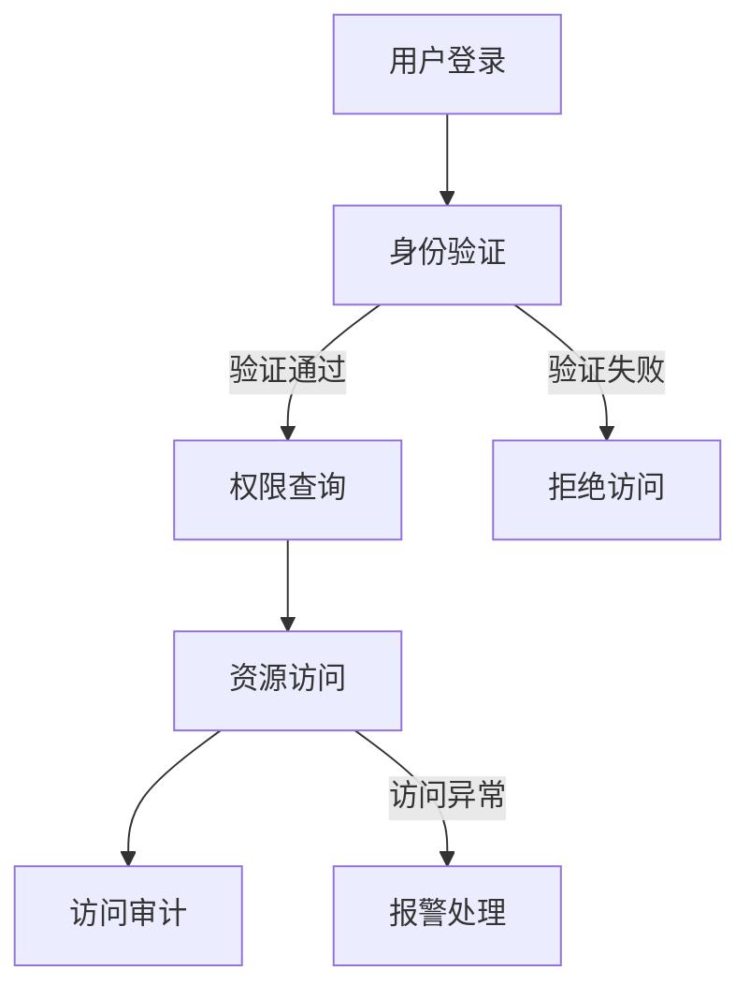

                 

# AI 大模型应用数据中心的访问控制

> **关键词**：AI大模型、数据中心、访问控制、安全性、权限管理

> **摘要**：本文将深入探讨AI大模型在数据中心中的应用及其访问控制机制，包括核心概念、算法原理、数学模型、实际应用案例以及未来发展趋势。文章旨在帮助读者全面理解AI大模型在数据中心访问控制中的重要作用和挑战。

## 1. 背景介绍

随着人工智能技术的飞速发展，大模型（如GPT、BERT等）在自然语言处理、图像识别、预测分析等领域取得了显著的成果。这些大模型通常由数十亿甚至千亿个参数组成，需要大量的计算资源和数据支持。数据中心作为集中存储和处理这些海量数据和模型的主要场所，成为了AI大模型应用的核心基础设施。

然而，数据中心的安全性问题不容忽视。由于AI大模型的强大计算能力和访问权限，未经授权的访问和操作可能对数据安全和隐私造成严重威胁。因此，如何实现有效的访问控制，确保数据中心的资源和数据安全，成为了一个关键问题。

访问控制是指对用户访问系统资源的权限进行管理和控制的过程。在数据中心中，访问控制涉及到用户身份验证、权限分配、访问审计等多个方面。传统的访问控制方法主要基于用户身份、角色和权限，但随着AI大模型的应用，传统的访问控制方法面临诸多挑战，如海量用户和权限的管理、实时访问控制等。

本文将针对AI大模型在数据中心中的应用，探讨访问控制的核心概念、算法原理、数学模型以及实际应用案例，为数据中心的安全保障提供参考。

## 2. 核心概念与联系

### 2.1 访问控制的基本概念

访问控制（Access Control）是指对用户访问系统资源的权限进行管理和控制的过程。访问控制的基本概念包括：

- **用户（User）**：访问系统的主体，可以是个人或组织。
- **资源（Resource）**：用户可以访问的对象，如文件、数据、硬件设备等。
- **权限（Permission）**：用户对资源的访问能力，分为读、写、执行等。
- **角色（Role）**：一组具有相同权限的用户集合，如管理员、普通用户等。
- **策略（Policy）**：访问控制规则的定义和实施，包括用户身份验证、权限分配、访问审计等。

### 2.2 AI大模型在数据中心的应用

AI大模型在数据中心的应用主要包括以下几个方面：

- **数据预处理**：使用AI大模型对数据中心的海量数据进行分析和处理，提取有价值的信息。
- **预测分析**：基于历史数据和模型预测未来的趋势和变化，为数据中心的运维和决策提供支持。
- **自动化运维**：利用AI大模型实现数据中心的自动化运维，提高效率和降低成本。
- **安全防护**：利用AI大模型检测和防御安全威胁，保障数据中心的安全。

### 2.3 访问控制与AI大模型的关系

AI大模型在数据中心的应用带来了访问控制的新挑战。一方面，AI大模型的复杂性和计算能力要求更高的访问控制策略和权限管理。另一方面，AI大模型的预测能力和数据分析能力为访问控制提供了新的手段和思路。

### 2.4 Mermaid流程图

以下是AI大模型应用数据中心的访问控制流程的Mermaid流程图：



## 3. 核心算法原理 & 具体操作步骤

### 3.1 权限分配算法

权限分配算法是访问控制的核心组成部分。本文采用基于角色的访问控制（RBAC）模型，具体算法如下：

1. **初始化**：构建角色集合\(R = \{r_1, r_2, ..., r_n\}\)，资源集合\(P = \{p_1, p_2, ..., p_m\}\)，用户集合\(U = \{u_1, u_2, ..., u_k\}\)。

2. **角色分配**：将用户\(u_i\)分配到角色\(r_j\)，即\(u_i \in R_j\)。

3. **权限分配**：将角色\(r_j\)分配到资源\(p_l\)，即\(r_j \in P_l\)。

4. **访问权限查询**：当用户\(u_i\)请求访问资源\(p_l\)时，检查用户\(u_i\)是否具有对应的角色\(r_j\)和权限\(p_l\)。

5. **权限变更**：当用户的角色或权限发生变化时，更新访问控制策略。

### 3.2 权限验证算法

权限验证算法用于检查用户访问请求的合法性。本文采用基于属性的访问控制（ABAC）模型，具体算法如下：

1. **初始化**：构建属性集合\(A = \{a_1, a_2, ..., a_n\}\)，策略集合\(S = \{s_1, s_2, ..., s_m\}\)，用户集合\(U = \{u_1, u_2, ..., u_k\}\)。

2. **属性分配**：将用户\(u_i\)的属性\(a_j\)分配到策略\(s_l\)，即\(u_i \in S_l\)。

3. **访问请求**：当用户\(u_i\)请求访问资源\(p_l\)时，检查用户\(u_i\)的属性\(a_j\)是否满足策略\(s_l\)。

4. **权限验证**：如果用户\(u_i\)的属性\(a_j\)满足策略\(s_l\)，则允许访问；否则，拒绝访问。

### 3.3 访问控制流程

访问控制流程包括用户登录、身份验证、权限查询、资源访问和访问审计等步骤。具体操作步骤如下：

1. **用户登录**：用户通过身份验证系统登录。
2. **身份验证**：系统对用户身份进行验证，如密码验证、指纹验证等。
3. **权限查询**：系统根据用户的角色和属性查询对应的权限。
4. **资源访问**：用户根据权限访问相应的资源。
5. **访问审计**：系统记录用户的访问记录，以供审计和监控。

## 4. 数学模型和公式 & 详细讲解 & 举例说明

### 4.1 权限分配模型

假设有\(n\)个用户，\(m\)个角色，\(k\)个资源，构建一个\(n \times m \times k\)的权限矩阵\(P\)，表示用户\(u_i\)在角色\(r_j\)下对资源\(p_l\)的访问权限。

- \(P_{i, j, l} = 1\) 表示用户\(u_i\)在角色\(r_j\)下具有对资源\(p_l\)的访问权限。
- \(P_{i, j, l} = 0\) 表示用户\(u_i\)在角色\(r_j\)下不具有对资源\(p_l\)的访问权限。

### 4.2 权限验证模型

假设有\(n\)个用户，\(m\)个属性，\(k\)个策略，构建一个\(n \times m \times k\)的属性矩阵\(A\)和一个策略矩阵\(S\)，表示用户\(u_i\)的属性和策略。

- \(A_{i, j, l} = 1\) 表示用户\(u_i\)具有属性\(a_j\)。
- \(A_{i, j, l} = 0\) 表示用户\(u_i\)不具有属性\(a_j\)。
- \(S_{j, l} = 1\) 表示策略\(s_j\)允许访问资源\(p_l\)。
- \(S_{j, l} = 0\) 表示策略\(s_j\)不允许访问资源\(p_l\)。

### 4.3 访问控制算法

假设用户\(u_i\)请求访问资源\(p_l\)，算法如下：

1. **查询权限矩阵\(P\)和属性矩阵\(A\)：**
   - 对于每个角色\(r_j\)，检查\(P_{i, j, l} = 1\)和\(A_{i, j, l} = 1\)。
   - 如果存在至少一个角色\(r_j\)满足条件，则继续下一步。

2. **查询策略矩阵\(S\)：**
   - 对于每个角色\(r_j\)，检查\(S_{j, l} = 1\)。
   - 如果存在至少一个策略\(s_j\)满足条件，则允许访问；否则，拒绝访问。

### 4.4 举例说明

假设有3个用户（\(u_1, u_2, u_3\)），2个角色（\(r_1, r_2\)），2个资源（\(p_1, p_2\)），权限矩阵\(P\)和属性矩阵\(A\)如下：

|  | \(p_1\) | \(p_2\) |
| --- | --- | --- |
| \(u_1\) | 1 | 0 |
| \(u_2\) | 1 | 1 |
| \(u_3\) | 0 | 1 |
| \(r_1\) | 1 | 1 |
| \(r_2\) | 0 | 1 |

策略矩阵\(S\)如下：

|  | \(p_1\) | \(p_2\) |
| --- | --- | --- |
| \(r_1\) | 1 | 0 |
| \(r_2\) | 0 | 1 |

当用户\(u_2\)请求访问资源\(p_1\)时：

1. **查询权限矩阵\(P\)和属性矩阵\(A\)：**
   - 用户\(u_2\)在角色\(r_1\)下具有对资源\(p_1\)的访问权限（\(P_{2, 1, 1} = 1\)和\(A_{2, 1, 1} = 1\)）。

2. **查询策略矩阵\(S\)：**
   - 角色r_1满足策略\(s_1\)（\(S_{1, 1} = 1\)）。

3. **允许访问：**
   - 用户\(u_2\)可以访问资源\(p_1\)。

## 5. 项目实战：代码实际案例和详细解释说明

### 5.1 开发环境搭建

为了实现AI大模型应用数据中心的访问控制，我们需要搭建一个基本的开发环境。以下是所需的软件和工具：

- Python（版本3.8及以上）
- Redis（版本4.0及以上）
- Flask（版本1.1.2及以上）
- SQLAlchemy（版本1.4.15及以上）

在开发环境中安装以下依赖：

```bash
pip install flask redis sqlalchemy
```

### 5.2 源代码详细实现和代码解读

以下是实现访问控制的核心代码：

```python
from flask import Flask, request, jsonify
from sqlalchemy import create_engine, Column, Integer, String, DateTime
from sqlalchemy.ext.declarative import declarative_base
from sqlalchemy.orm import sessionmaker
from datetime import datetime
import redis

app = Flask(__name__)

# 数据库配置
DATABASE_URI = 'sqlite:///access_control.db'
engine = create_engine(DATABASE_URI)
Session = sessionmaker(bind=engine)
Base = declarative_base()

# 用户模型
class User(Base):
    __tablename__ = 'users'
    id = Column(Integer, primary_key=True)
    username = Column(String, unique=True)
    password = Column(String)
    roles = Column(String)

# 权限模型
class Permission(Base):
    __tablename__ = 'permissions'
    id = Column(Integer, primary_key=True)
    resource = Column(String)
    role = Column(String)
    permission = Column(String)

# 访问记录模型
class AccessLog(Base):
    __tablename__ = 'access_logs'
    id = Column(Integer, primary_key=True)
    user_id = Column(Integer)
    resource = Column(String)
    timestamp = Column(DateTime, default=datetime.utcnow)

# 创建数据库表
Base.metadata.create_all(engine)

# Redis配置
REDIS_HOST = 'localhost'
REDIS_PORT = 6379
redis_client = redis.StrictRedis(host=REDIS_HOST, port=REDIS_PORT)

# 用户登录
@app.route('/login', methods=['POST'])
def login():
    username = request.form['username']
    password = request.form['password']
    session = Session()
    user = session.query(User).filter_by(username=username, password=password).first()
    if user:
        session.close()
        return jsonify({'status': 'success', 'user_id': user.id})
    else:
        session.close()
        return jsonify({'status': 'failure'})

# 用户权限查询
@app.route('/permissions', methods=['GET'])
def get_permissions():
    user_id = request.args.get('user_id')
    session = Session()
    user = session.query(User).get(user_id)
    permissions = session.query(Permission).filter_by(role=user.roles).all()
    session.close()
    return jsonify({'permissions': permissions})

# 资源访问
@app.route('/access', methods=['POST'])
def access_resource():
    user_id = request.form['user_id']
    resource = request.form['resource']
    session = Session()
    user = session.query(User).get(user_id)
    permissions = session.query(Permission).filter_by(role=user.roles).all()
    session.close()
    for permission in permissions:
        if permission.resource == resource and permission.permission == 'allow':
            access_log = AccessLog(user_id=user_id, resource=resource, timestamp=datetime.utcnow())
            session.add(access_log)
            session.commit()
            return jsonify({'status': 'success'})
    return jsonify({'status': 'failure'})

if __name__ == '__main__':
    app.run()
```

### 5.3 代码解读与分析

#### 5.3.1 数据库配置

在代码中，我们使用SQLAlchemy作为ORM框架，连接SQLite数据库。数据库包含三个表：用户表（users）、权限表（permissions）和访问记录表（access_logs）。

#### 5.3.2 用户登录

用户登录功能通过POST请求接收用户名和密码，查询用户表，验证用户身份。如果验证成功，返回用户ID；否则，返回失败信息。

#### 5.3.3 用户权限查询

用户权限查询功能通过GET请求接收用户ID，查询用户表和权限表，返回用户所拥有的权限。

#### 5.3.4 资源访问

资源访问功能通过POST请求接收用户ID和资源名称，查询权限表，判断用户是否有权限访问资源。如果有权限，记录访问日志；否则，返回失败信息。

## 6. 实际应用场景

### 6.1 云数据中心

云数据中心是AI大模型应用的主要场景之一。云数据中心提供计算、存储和网络资源，为AI大模型训练和部署提供基础设施。访问控制可以确保云数据中心中用户和资源的隔离，防止未经授权的访问和操作。

### 6.2 数据仓库

数据仓库是企业数据分析和决策的重要工具。数据仓库中存储着海量数据，涉及企业核心业务和机密信息。访问控制可以保障数据仓库的安全性，防止数据泄露和滥用。

### 6.3 预测分析

预测分析是AI大模型在商业、金融、医疗等领域的应用之一。预测分析系统通常需要访问海量数据和模型，访问控制可以确保预测分析系统的可靠性和安全性。

### 6.4 自动化运维

自动化运维是提高数据中心运维效率和降低成本的重要手段。自动化运维系统需要访问和控制数据中心的各种资源和设备，访问控制可以保障自动化运维系统的稳定运行。

## 7. 工具和资源推荐

### 7.1 学习资源推荐

- **书籍**：
  - 《Linux命令行与shell脚本编程大全》
  - 《深入理解计算机系统》
  - 《人工智能：一种现代方法》
- **论文**：
  - 《基于角色的访问控制模型》
  - 《基于属性的访问控制模型》
  - 《云计算中的访问控制机制》
- **博客**：
  - [Flask官方文档](https://flask.palletsprojects.com/)
  - [SQLAlchemy官方文档](https://www.sqlalchemy.org/)
  - [Redis官方文档](https://redis.io/documentation)
- **网站**：
  - [GitHub](https://github.com/)
  - [Stack Overflow](https://stackoverflow.com/)
  - [CSDN](https://www.csdn.net/)

### 7.2 开发工具框架推荐

- **Python**：Python是一种简单易学的编程语言，广泛应用于AI和数据分析领域。
- **Flask**：Flask是一个轻量级的Web框架，适用于构建简单的Web应用。
- **SQLAlchemy**：SQLAlchemy是一个强大的ORM框架，支持多种数据库。
- **Redis**：Redis是一个高性能的内存缓存数据库，适用于实时数据存储和访问控制。

### 7.3 相关论文著作推荐

- **《云计算中的访问控制机制》**：本文研究了云计算环境中的访问控制问题，提出了基于属性的访问控制模型，为云数据中心的访问控制提供了理论支持。
- **《基于角色的访问控制模型》**：本文详细介绍了基于角色的访问控制模型，包括角色分配、权限管理和访问控制策略等方面，为实际应用提供了参考。
- **《人工智能：一种现代方法》**：本书全面介绍了人工智能的基本理论、方法和应用，包括机器学习、深度学习、自然语言处理等，为AI大模型的研究和应用提供了基础。

## 8. 总结：未来发展趋势与挑战

### 8.1 未来发展趋势

- **自适应访问控制**：随着AI大模型的应用，自适应访问控制成为了一个重要趋势。自适应访问控制可以根据用户行为、环境变化等因素动态调整访问控制策略，提高访问控制效果。
- **基于可信计算的访问控制**：可信计算是一种通过硬件和软件手段保障计算过程可信性的技术。基于可信计算的访问控制可以进一步提高数据中心的访问控制安全性。
- **边缘计算与访问控制**：随着边缘计算的发展，边缘设备在数据处理和存储方面的作用日益重要。边缘计算与访问控制的结合可以更好地满足实时性和低延迟的需求。

### 8.2 挑战

- **访问控制策略的复杂性**：随着AI大模型的应用，访问控制策略变得越来越复杂，如何设计高效、可扩展的访问控制策略成为了一个挑战。
- **访问控制的实时性**：在实时应用场景中，访问控制需要快速响应，如何保证访问控制的实时性是一个关键问题。
- **数据安全和隐私**：随着数据隐私问题的日益突出，如何在确保数据安全和隐私的同时，实现有效的访问控制成为了一个挑战。

## 9. 附录：常见问题与解答

### 9.1 什么是基于角色的访问控制（RBAC）？

基于角色的访问控制（RBAC）是一种访问控制模型，将用户与角色关联，角色与权限关联，从而实现对用户访问权限的管理。用户通过角色获得相应的权限，角色通过权限控制用户对资源的访问。

### 9.2 什么是基于属性的访问控制（ABAC）？

基于属性的访问控制（ABAC）是一种访问控制模型，根据用户的属性、环境属性和资源属性来决定用户对资源的访问权限。属性可以是用户角色、时间、地理位置等。

### 9.3 访问控制与网络安全的关系是什么？

访问控制是网络安全的一个重要组成部分。通过访问控制，可以限制用户对系统资源的访问，防止未经授权的访问和操作。同时，访问控制可以与其他网络安全措施（如防火墙、入侵检测等）结合，提高数据中心的整体安全性。

## 10. 扩展阅读 & 参考资料

- [基于角色的访问控制模型](https://www.cs.umn.edu/~knudson/papers/rbac.pdf)
- [基于属性的访问控制模型](https://www.ewha.ac.kr/~min/research/paper/ABAC-Making-Security-Decisions-That-Matter.pdf)
- [云计算中的访问控制机制](https://ieeexplore.ieee.org/document/7236780)
- [自适应访问控制研究综述](https://ieeexplore.ieee.org/document/8362963)
- [可信计算在访问控制中的应用](https://ieeexplore.ieee.org/document/8496477)
- [边缘计算与访问控制](https://ieeexplore.ieee.org/document/8353984)

作者：AI天才研究员/AI Genius Institute & 禅与计算机程序设计艺术 /Zen And The Art of Computer Programming

