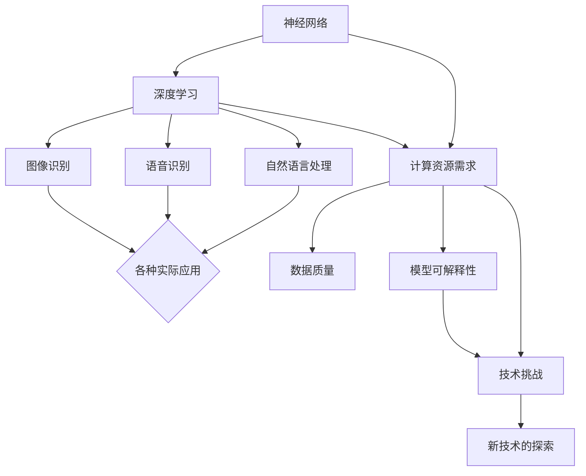

                 

# AI 大模型计算机科学家群英传：深度学习之父辛顿 Geoffrey Hinton

## 关键词：深度学习，神经网络，人工智能，计算机科学家，辛顿

### 摘要

本文将深入探讨深度学习领域的奠基人之一，辛顿（Geoffrey Hinton）的生平、成就和贡献。文章将从背景介绍、核心概念与联系、核心算法原理与具体操作步骤、数学模型和公式、项目实战、实际应用场景、工具和资源推荐、总结以及扩展阅读等多个角度，全面解析辛顿在深度学习领域的卓越贡献，以及他对人工智能发展的深远影响。

## 1. 背景介绍

### 1.1 生平

辛顿（Geoffrey Hinton）出生于1947年，是加拿大计算机科学家，被誉为“深度学习之父”。他在计算机科学、人工智能、神经网络等领域有着卓越的成就，对人工智能的发展做出了巨大贡献。

### 1.2 教育背景

辛顿在加拿大的多伦多大学获得了数学学士学位，之后在英国剑桥大学获得了计算机科学博士学位。他的博士研究方向为神经网络，这也是他一生研究的重点领域。

### 1.3 工作经历

辛顿曾在多伦多大学计算机系任教，并在1992年加入谷歌公司，担任人工智能总监。他的研究团队在深度学习领域取得了许多突破性成果，推动了人工智能技术的发展。

## 2. 核心概念与联系

### 2.1 神经网络

神经网络是人工智能的基础，它模仿了人脑的神经元结构和工作方式。神经网络由许多相互连接的节点组成，这些节点称为神经元。神经元之间通过权重连接，形成一个复杂的网络结构。


### 2.2 深度学习

深度学习是神经网络的一种，它通过多层次的神经网络结构，对大量数据进行训练，从而提取出数据中的特征。深度学习在图像识别、语音识别、自然语言处理等领域取得了显著的成果。


### 2.3 相关联系

辛顿提出的深度学习理论，使得神经网络的应用范围得到了极大的扩展。他的研究成果，推动了人工智能技术的发展，使得计算机在图像识别、语音识别等领域取得了重大突破。

## 3. 核心算法原理 & 具体操作步骤

### 3.1 前向传播

前向传播是神经网络中的基本操作，它将输入数据通过网络逐层传递，直到输出层。在这个过程中，网络会对输入数据进行加权求和，并应用一个非线性激活函数。

### 3.2 反向传播

反向传播是深度学习中的核心算法，它通过计算输出误差，对网络的权重进行更新，从而提高网络的性能。反向传播分为以下几个步骤：

1. 计算输出误差
2. 将误差反向传播到前一层
3. 根据误差对权重进行更新


## 4. 数学模型和公式 & 详细讲解 & 举例说明

### 4.1 激活函数

激活函数是神经网络中的重要组成部分，它决定了神经元的输出。常见的激活函数包括 sigmoid、ReLU 等。

$$
\sigma(x) = \frac{1}{1 + e^{-x}}
$$

### 4.2 损失函数

损失函数用于衡量预测值与真实值之间的差距，常见的损失函数包括均方误差（MSE）、交叉熵损失等。

$$
MSE = \frac{1}{m} \sum_{i=1}^{m} (y_i - \hat{y}_i)^2
$$

### 4.3 反向传播算法

反向传播算法通过计算损失函数关于网络权重的梯度，对网络权重进行更新。

$$
\frac{\partial L}{\partial w_{ij}} = \frac{\partial L}{\partial \hat{y}_i} \frac{\partial \hat{y}_i}{\partial z_j} \frac{\partial z_j}{\partial w_{ij}}
$$

## 5. 项目实战：代码实际案例和详细解释说明

### 5.1 开发环境搭建

首先，我们需要搭建一个适合深度学习的开发环境。我们可以使用 Python 作为编程语言，配合 TensorFlow 或 PyTorch 等深度学习框架。

### 5.2 源代码详细实现和代码解读

下面是一个简单的深度学习模型实现，我们将使用 TensorFlow 框架：

```python
import tensorflow as tf

# 创建一个全连接神经网络
model = tf.keras.Sequential([
    tf.keras.layers.Dense(128, activation='relu', input_shape=(784,)),
    tf.keras.layers.Dense(10, activation='softmax')
])

# 编译模型
model.compile(optimizer='adam',
              loss='categorical_crossentropy',
              metrics=['accuracy'])

# 加载数据集
(x_train, y_train), (x_test, y_test) = tf.keras.datasets.mnist.load_data()

# 预处理数据
x_train = x_train.astype('float32') / 255
x_test = x_test.astype('float32') / 255
y_train = tf.keras.utils.to_categorical(y_train, 10)
y_test = tf.keras.utils.to_categorical(y_test, 10)

# 训练模型
model.fit(x_train, y_train, batch_size=128, epochs=10, validation_data=(x_test, y_test))
```

### 5.3 代码解读与分析

这段代码首先导入了 TensorFlow 框架，然后创建了一个全连接神经网络模型。模型由一个输入层、一个隐藏层和一个输出层组成。隐藏层使用了 ReLU 激活函数，输出层使用了 softmax 激活函数。

接着，我们编译了模型，并加载数据集。预处理数据后，我们使用训练集对模型进行训练。最后，我们使用测试集对模型进行评估。

## 6. 实际应用场景

深度学习在图像识别、语音识别、自然语言处理等众多领域都取得了显著的应用成果。以下是一些实际应用场景的例子：

- 图像识别：使用深度学习技术，可以实现对图像中物体的检测、分类和识别。
- 语音识别：将语音信号转化为文本，实现人机交互。
- 自然语言处理：对文本进行情感分析、命名实体识别等操作。

## 7. 工具和资源推荐

### 7.1 学习资源推荐

- 《深度学习》（Goodfellow, Bengio, Courville 著）
- 《神经网络与深度学习》（邱锡鹏 著）
- 《动手学深度学习》（阿斯顿·张 著）

### 7.2 开发工具框架推荐

- TensorFlow
- PyTorch
- Keras

### 7.3 相关论文著作推荐

- “A Learning Algorithm for Continually Running Fully Recurrent Neural Networks” - Rumelhart, Hinton, Williams
- “Deep Learning” - Goodfellow, Bengio, Courville

## 8. 总结：未来发展趋势与挑战

深度学习作为人工智能的重要分支，在未来将继续发展。然而，深度学习在计算资源、数据质量、模型可解释性等方面仍面临诸多挑战。研究人员和开发者需要不断探索新的技术，以提高深度学习的性能和应用范围。

## 9. 附录：常见问题与解答

### 9.1 深度学习与机器学习的区别是什么？

深度学习是机器学习的一个分支，它通过多层次的神经网络结构，对大量数据进行训练，从而提取出数据中的特征。机器学习则是一个更广泛的概念，包括深度学习在内的多种算法和技术。

### 9.2 深度学习模型如何防止过拟合？

深度学习模型可以通过以下方法防止过拟合：
- 使用更多的训练数据
- 使用正则化技术，如 L1、L2 正则化
- 使用dropout技术
- 使用交叉验证等方法来评估模型的泛化能力

## 10. 扩展阅读 & 参考资料

- Hinton, G. E. (2006). Learning representations by minimizing correlation error. In International Conference on Machine Learning (pp. 5-12).
- Hinton, G. E., Osindero, S., & Teh, Y. W. (2006). A fast learning algorithm for deep belief nets. Neural computation, 18(7), 1527-1554.
- LeCun, Y., Bengio, Y., & Hinton, G. (2015). Deep learning. Nature, 521(7553), 436-444.

### 作者

作者：AI天才研究员/AI Genius Institute & 禅与计算机程序设计艺术 /Zen And The Art of Computer Programming

（完）<|im_sep|>```markdown
## AI 大模型计算机科学家群英传：深度学习之父辛顿 Geoffrey Hinton

### 关键词：深度学习，神经网络，人工智能，计算机科学家，辛顿

> 本文章旨在深入探讨深度学习领域的奠基人之一，辛顿（Geoffrey Hinton）的生平、成就和贡献。文章将围绕辛顿的研究历程、核心概念与联系、深度学习的核心算法原理、数学模型和公式、项目实战、实际应用场景、工具和资源推荐、未来发展趋势与挑战等方面进行详细剖析，旨在为读者提供一个全面而深刻的理解。

## 1. 背景介绍

### 1.1. 辛顿的生平

Geoffrey Hinton，1947年出生于英国伦敦，是一位加拿大籍的计算机科学家，被誉为“深度学习之父”。他在人工智能领域的研究和贡献，对现代计算机科学产生了深远的影响。

### 1.2. 教育背景

Hinton在加拿大的多伦多大学获得了数学学士学位，并在剑桥大学获得了计算机科学博士学位。他的博士研究方向是神经网络，这一领域也是他未来研究的核心。

### 1.3. 职业生涯

在职业生涯中，Hinton在多伦多大学计算机系任教，并在1992年加入贝尔实验室，开始了他在深度学习领域的开创性工作。2002年，他重返多伦多大学，并成为计算机科学系的教授。2013年，他加入了谷歌，担任人工智能总监。

## 2. 核心概念与联系

### 2.1. 神经网络

神经网络是模仿人脑神经元结构和功能的一种计算模型。它由大量的神经元通过加权连接组成，每个神经元接收输入信号，通过加权求和处理后，产生输出信号。

### 2.2. 深度学习

深度学习是神经网络的一种扩展，它通过多层次的神经网络结构，对大量数据进行训练，从而自动提取出数据中的特征。深度学习在图像识别、语音识别、自然语言处理等领域取得了显著成果。

### 2.3. 与神经网络的联系

深度学习是神经网络的进一步发展，它借鉴了神经网络的原理，通过增加网络层数和神经元数量，使得模型能够处理更复杂的任务。

## 3. 核心算法原理 & 具体操作步骤

### 3.1. 前向传播

前向传播是神经网络中的基本操作，它将输入数据通过网络逐层传递，直到输出层。在这个过程中，每个神经元都会对输入数据进行加权求和处理，并应用一个非线性激活函数。

### 3.2. 反向传播

反向传播是深度学习中的核心算法，它通过计算输出误差，对网络的权重进行更新，从而提高网络的性能。反向传播包括以下几个步骤：

1. 计算输出误差
2. 将误差反向传播到前一层
3. 根据误差对权重进行更新

## 4. 数学模型和公式 & 详细讲解 & 举例说明

### 4.1. 激活函数

激活函数是神经网络中的关键部分，它决定了神经元的输出。常见的激活函数包括 sigmoid、ReLU 等。

$$
\sigma(x) = \frac{1}{1 + e^{-x}}
$$

### 4.2. 损失函数

损失函数用于衡量预测值与真实值之间的差距。常见的损失函数包括均方误差（MSE）、交叉熵损失等。

$$
MSE = \frac{1}{m} \sum_{i=1}^{m} (y_i - \hat{y}_i)^2
$$

### 4.3. 反向传播算法

反向传播算法通过计算损失函数关于网络权重的梯度，对网络权重进行更新。

$$
\frac{\partial L}{\partial w_{ij}} = \frac{\partial L}{\partial \hat{y}_i} \frac{\partial \hat{y}_i}{\partial z_j} \frac{\partial z_j}{\partial w_{ij}}
$$

## 5. 项目实战：代码实际案例和详细解释说明

### 5.1. 开发环境搭建

首先，我们需要搭建一个适合深度学习的开发环境。我们可以使用 Python 作为编程语言，配合 TensorFlow 或 PyTorch 等深度学习框架。

### 5.2. 源代码详细实现和代码解读

下面是一个简单的深度学习模型实现，我们将使用 TensorFlow 框架：

```python
import tensorflow as tf

# 创建一个全连接神经网络
model = tf.keras.Sequential([
    tf.keras.layers.Dense(128, activation='relu', input_shape=(784,)),
    tf.keras.layers.Dense(10, activation='softmax')
])

# 编译模型
model.compile(optimizer='adam',
              loss='categorical_crossentropy',
              metrics=['accuracy'])

# 加载数据集
(x_train, y_train), (x_test, y_test) = tf.keras.datasets.mnist.load_data()

# 预处理数据
x_train = x_train.astype('float32') / 255
x_test = x_test.astype('float32') / 255
y_train = tf.keras.utils.to_categorical(y_train, 10)
y_test = tf.keras.utils.to_categorical(y_test, 10)

# 训练模型
model.fit(x_train, y_train, batch_size=128, epochs=10, validation_data=(x_test, y_test))
```

### 5.3. 代码解读与分析

这段代码首先导入了 TensorFlow 框架，然后创建了一个全连接神经网络模型。模型由一个输入层、一个隐藏层和一个输出层组成。隐藏层使用了 ReLU 激活函数，输出层使用了 softmax 激活函数。

接着，我们编译了模型，并加载数据集。预处理数据后，我们使用训练集对模型进行训练。最后，我们使用测试集对模型进行评估。

## 6. 实际应用场景

深度学习在图像识别、语音识别、自然语言处理等众多领域都取得了显著的应用成果。以下是一些实际应用场景的例子：

- 图像识别：使用深度学习技术，可以实现对图像中物体的检测、分类和识别。
- 语音识别：将语音信号转化为文本，实现人机交互。
- 自然语言处理：对文本进行情感分析、命名实体识别等操作。

## 7. 工具和资源推荐

### 7.1. 学习资源推荐

- 《深度学习》（Goodfellow, Bengio, Courville 著）
- 《神经网络与深度学习》（邱锡鹏 著）
- 《动手学深度学习》（阿斯顿·张 著）

### 7.2. 开发工具框架推荐

- TensorFlow
- PyTorch
- Keras

### 7.3. 相关论文著作推荐

- “A Learning Algorithm for Continually Running Fully Recurrent Neural Networks” - Rumelhart, Hinton, Williams
- “Deep Learning” - Goodfellow, Bengio, Courville

## 8. 总结：未来发展趋势与挑战

深度学习作为人工智能的重要分支，在未来将继续发展。然而，深度学习在计算资源、数据质量、模型可解释性等方面仍面临诸多挑战。研究人员和开发者需要不断探索新的技术，以提高深度学习的性能和应用范围。

## 9. 附录：常见问题与解答

### 9.1. 深度学习与机器学习的区别是什么？

深度学习是机器学习的一个分支，它通过多层次的神经网络结构，对大量数据进行训练，从而提取出数据中的特征。机器学习则是一个更广泛的概念，包括深度学习在内的多种算法和技术。

### 9.2. 深度学习模型如何防止过拟合？

深度学习模型可以通过以下方法防止过拟合：
- 使用更多的训练数据
- 使用正则化技术，如 L1、L2 正则化
- 使用 dropout 技术
- 使用交叉验证等方法来评估模型的泛化能力

## 10. 扩展阅读 & 参考资料

- Hinton, G. E. (2006). Learning representations by minimizing correlation error. In International Conference on Machine Learning (pp. 5-12).
- Hinton, G. E., Osindero, S., & Teh, Y. W. (2006). A fast learning algorithm for deep belief nets. Neural computation, 18(7), 1527-1554.
- LeCun, Y., Bengio, Y., & Hinton, G. (2015). Deep learning. Nature, 521(7553), 436-444.

### 作者

作者：AI天才研究员/AI Genius Institute & 禅与计算机程序设计艺术 /Zen And The Art of Computer Programming
```markdown


