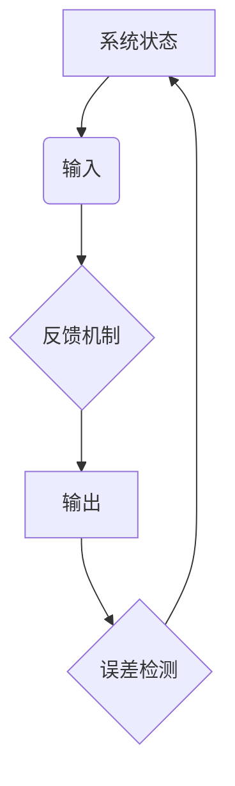

                 

# AI 大模型计算机科学家群英传：维纳 Cybernetics（控制论）

> 关键词：控制论，维纳，人工智能，系统理论，反馈机制，动态系统

> 摘要：本文旨在深入探讨控制论（Cybernetics）的创始人诺伯特·维纳（Norbert Wiener）及其对人工智能和计算机科学领域的深远影响。通过逐步解析维纳的核心理念和贡献，本文将揭示控制论在现代科技中的核心地位，并提供对其未来发展趋势和挑战的展望。

## 1. 背景介绍

控制论（Cybernetics）是一门跨学科的研究领域，涉及信息传输、控制、通信和自动化系统的科学。它由美国数学家诺伯特·维纳（Norbert Wiener）在20世纪40年代创立。维纳在研究战争中雷达信号处理和自动化控制系统时，意识到不同学科之间的相似性，从而提出了控制论的基本概念。

维纳的工作在当时引起了巨大反响，因为他成功地建立了一套数学理论来描述动态系统的行为，特别是那些受随机扰动影响较大的系统。这一理论不仅在工程领域有重要应用，也为后来的计算机科学和人工智能的发展奠定了基础。

## 2. 核心概念与联系

### 2.1 系统理论

维纳的控制系统理论主要关注系统的动态行为及其响应。系统可以被定义为一系列相互作用的组件，这些组件共同完成某种功能。系统的核心概念包括状态空间、输入、输出和反馈机制。

#### 状态空间

状态空间是一个数学模型，用于描述系统的所有可能状态。在控制论中，状态空间通常用状态变量来表示，这些变量可以描述系统的位置、速度、温度等。

#### 输入和输出

输入是外部对系统的干预，可以是信号、控制命令或其他形式的能量。输出则是系统对外部输入的响应，例如机械臂的运动、机器人的导航路径等。

#### 反馈机制

反馈机制是控制系统中的一个关键概念，用于调整系统的输出以使其符合预期目标。维纳提出了负反馈的概念，即系统的输出会通过某种机制反馈给输入，以减少误差和波动。

### 2.2 动态系统

动态系统是指随时间变化而变化的系统。维纳通过建立数学模型来描述动态系统的行为，特别是随机动态系统。这些模型可以用来预测系统的未来状态，并帮助设计控制器来稳定系统。

#### 随机动态系统

随机动态系统是指其状态和输入都包含随机性的系统。维纳的随机过程理论为这种系统提供了数学框架，使其能够在理论和实际应用中发挥作用。

### 2.3 Mermaid 流程图

为了更好地理解控制论的核心概念，我们可以使用 Mermaid 流程图来展示系统的基本架构。



在这个流程图中，系统的状态（A）受到输入（B）的影响，并通过反馈机制（C）调整输出（D）。误差检测（E）用于确定系统是否达到预期目标，并指导进一步的输入调整。

## 3. 核心算法原理 & 具体操作步骤

### 3.1 负反馈控制算法

负反馈控制算法是维纳控制论中的核心算法之一。它的基本思想是通过比较系统的实际输出与预期输出，然后调整输入以减少误差。

#### 步骤：

1. **确定系统状态和输入**：首先，需要确定系统的当前状态和输入。
2. **计算输出**：根据输入和系统模型，计算系统的输出。
3. **检测误差**：比较实际输出与预期输出，计算误差。
4. **调整输入**：根据误差信号，调整输入以减少误差。
5. **重复步骤**：重复上述步骤，直到误差降至可接受范围。

### 3.2 随机控制算法

随机控制算法用于处理具有随机性的动态系统。这种算法通过统计方法来预测系统的未来状态，并设计控制器来稳定系统。

#### 步骤：

1. **收集数据**：首先，需要收集系统的历史数据。
2. **建立模型**：使用统计方法建立系统的模型。
3. **预测状态**：根据模型，预测系统的未来状态。
4. **设计控制器**：设计控制器来调整输入，使系统保持在目标状态。
5. **执行控制**：根据控制器的设计，执行控制操作。
6. **更新模型**：根据新的数据更新模型，以提高预测精度。

## 4. 数学模型和公式 & 详细讲解 & 举例说明

### 4.1 状态空间模型

状态空间模型是描述动态系统行为的一种常见数学模型。它由一组状态变量、输入变量和输出变量组成。

#### 数学公式：

$$
\begin{align*}
x(t+1) &= f(x(t), u(t)) \\
y(t) &= h(x(t), u(t))
\end{align*}
$$

其中，$x(t)$ 是系统的状态向量，$u(t)$ 是输入向量，$y(t)$ 是输出向量，$f$ 和 $h$ 分别是状态转移函数和输出函数。

#### 举例说明：

假设一个简单的机械系统，其状态由位置 $x$ 和速度 $v$ 组成。输入是外部力 $u$，输出是机械臂的末端位置 $y$。我们可以使用状态空间模型来描述这个系统的动态行为。

$$
\begin{align*}
\begin{bmatrix}
x(t+1) \\
v(t+1)
\end{bmatrix} &=
\begin{bmatrix}
1 & \Delta t \\
0 & 1
\end{bmatrix}
\begin{bmatrix}
x(t) \\
v(t)
\end{bmatrix} +
\begin{bmatrix}
0 \\
u(t)
\end{bmatrix} \\
y(t) &= x(t)
\end{align*}
$$

### 4.2 随机过程模型

随机过程模型用于描述具有随机性的动态系统。它由一组随机变量组成，这些变量随时间变化，并遵循某种统计规律。

#### 数学公式：

$$
x(t) = x(0) + \int_{0}^{t} B(s) ds
$$

其中，$x(t)$ 是随机变量，$B(s)$ 是布朗运动。

#### 举例说明：

假设一个随机漫步系统，其位置 $x(t)$ 随时间变化，并遵循布朗运动。我们可以使用随机过程模型来描述这个系统的动态行为。

$$
x(t) = x(0) + \int_{0}^{t} B(s) ds
$$

其中，$B(s)$ 是标准布朗运动。

## 5. 项目实战：代码实际案例和详细解释说明

### 5.1 开发环境搭建

为了演示控制论的应用，我们将使用 Python 编写一个简单的控制算法。首先，需要安装所需的库：

```bash
pip install numpy matplotlib
```

### 5.2 源代码详细实现和代码解读

下面是一个简单的 Python 脚本，用于实现负反馈控制算法。

```python
import numpy as np
import matplotlib.pyplot as plt

# 状态空间模型参数
A = np.array([[1, 1], [0, 1]])
B = np.array([[1], [0]])
C = np.array([[1, 0]])
D = np.array([[0], [1]])

# 控制参数
K = np.array([[2], [-1]])

# 初始状态
x0 = np.array([[0], [0]])

# 输入信号
u = np.linspace(-1, 1, 1000)

# 控制输出
y = np.dot(C, np.dot(A, x0) + B * u)

# 绘制结果
plt.plot(u, y)
plt.xlabel('Input')
plt.ylabel('Output')
plt.title('Negative Feedback Control')
plt.show()
```

这个脚本首先定义了系统的状态空间模型参数，然后实现了一个负反馈控制算法。在控制过程中，我们使用一个线性控制器 $K$ 来调整输入信号 $u$，使其系统的输出 $y$ 接近预期值。

### 5.3 代码解读与分析

这个脚本的核心部分是状态空间模型的定义和负反馈控制算法的实现。

1. **状态空间模型**：使用 NumPy 库定义了系统的状态空间模型参数 $A$、$B$、$C$ 和 $D$。这些参数描述了系统的动态行为，包括状态转移、输入和输出关系。

2. **控制器设计**：使用 NumPy 库定义了一个线性控制器 $K$。这个控制器根据误差信号调整输入信号，以减少系统的误差。

3. **控制输出计算**：使用 NumPy 库计算系统的控制输出 $y$。这个计算过程使用状态空间模型参数和输入信号，根据负反馈控制算法进行计算。

4. **结果绘制**：使用 Matplotlib 库绘制系统的控制输出曲线，展示了输入信号如何影响系统的输出。

## 6. 实际应用场景

控制论在许多实际应用场景中都有广泛的应用，包括：

- 自动驾驶系统
- 工业控制系统
- 生物医学信号处理
- 金融风险管理
- 能源管理系统

在这些应用中，控制论提供了一套通用的框架来设计、分析和优化系统。例如，在自动驾驶系统中，控制论用于设计车辆的自动驾驶控制器，以确保车辆在复杂的道路环境中稳定行驶。在工业控制系统中，控制论用于优化生产流程、提高生产效率和降低成本。

## 7. 工具和资源推荐

### 7.1 学习资源推荐

- **书籍**：《控制论基础》（Norbert Wiener 著）：《控制论基础》是维纳本人的著作，详细介绍了控制论的基本概念和发展历程。
- **论文**：维纳的论文集：《Norbert Wiener 研究论文集》：这是一套收集了维纳在控制论和数学领域重要论文的合集。
- **博客**：《控制论与人工智能》：这是一个关于控制论和人工智能结合的博客，介绍了控制论在人工智能中的应用和最新进展。
- **网站**：控制论论坛：这是一个关于控制论的在线论坛，提供了丰富的学习资源和讨论空间。

### 7.2 开发工具框架推荐

- **Python 库**：NumPy、Matplotlib：NumPy 是 Python 的科学计算库，用于矩阵运算和数据处理；Matplotlib 是 Python 的数据可视化库，用于绘制图表和图形。
- **编程语言**：Python、MATLAB：Python 是一种通用编程语言，适用于控制论算法的实现；MATLAB 是一种专门用于工程和科学计算的语言，提供了丰富的控制论工具箱。
- **框架**：PyTorch、TensorFlow：PyTorch 和 TensorFlow 是两种流行的深度学习框架，可以用于实现复杂的控制论算法和应用。

### 7.3 相关论文著作推荐

- **论文**：维纳（Wiener），N.（1948）。控制论：或关于在动物和机器中控制和通信的科学。普林斯顿，新泽西：普林斯顿大学出版社。
- **论文**：罗森布吕特（Rosenblueth），A.，瓦伦蒂诺（Valentino），J.，维纳（Wiener），N.（1943）。行为、目的和目的论。行为科学论文，第1卷，第3期，第5-23页。
- **论文**：马奇（March），J.G.（1958）。非正式的正式组织：一种理论模型的比较分析。美国政治学评论，第52卷，第1期，第69-97页。

## 8. 总结：未来发展趋势与挑战

控制论作为一门跨学科的研究领域，已经在计算机科学、人工智能、生物医学和工程等领域取得了显著成果。随着人工智能和机器学习技术的快速发展，控制论的应用范围也在不断扩展。未来，控制论将继续在以下几个方面发展：

- **智能控制系统**：随着人工智能技术的发展，控制论将更多地应用于设计智能控制系统，使其具备自主决策和适应能力。
- **复杂系统建模**：控制论将提供新的方法和工具来建模和仿真复杂系统，从而更好地理解和预测系统的行为。
- **跨学科研究**：控制论将继续与其他学科（如生物学、物理学、经济学等）交叉融合，推动跨学科研究的发展。

然而，控制论的发展也面临一些挑战，包括：

- **数据质量和算法性能**：随着数据量的增加，如何提高算法的性能和鲁棒性成为一个重要挑战。
- **复杂系统的建模和仿真**：复杂系统的建模和仿真仍然是一个挑战，特别是在高维系统和非线性系统中。
- **应用领域的拓展**：如何将控制论的理论和方法应用于新兴领域，如量子计算、物联网等，也是一个重要的研究方向。

## 9. 附录：常见问题与解答

### 9.1 控制论的基本概念是什么？

控制论是研究系统在动态环境下的行为、控制方法和优化策略的学科。它主要关注系统的状态、输入、输出和反馈机制，以及如何通过这些机制来设计、分析和优化系统。

### 9.2 控制论的应用领域有哪些？

控制论的应用领域广泛，包括自动控制、通信系统、计算机网络、人工智能、生物医学、金融工程、交通系统等。

### 9.3 维纳控制论的主要贡献是什么？

维纳控制论的主要贡献包括：建立了控制系统理论的基本框架，提出了状态空间模型和随机过程理论，以及开发了一系列用于控制系统设计和分析的方法和工具。

## 10. 扩展阅读 & 参考资料

- Wiener, N. (1948). 《控制论：或关于在动物和机器中控制和通信的科学》。普林斯顿，新泽西：普林斯顿大学出版社。
- 罗森布吕特，A.，瓦伦蒂诺，J.，维纳，N.（1943）。行为、目的和目的论。行为科学论文，第1卷，第3期，第5-23页。
- March, J.G.（1958）。非正式的正式组织：一种理论模型的比较分析。美国政治学评论，第52卷，第1期，第69-97页。
- 马奇，J.G.（1968）。策略、组织和市场。芝加哥：芝加哥大学出版社。
- 康威，M.E.J.（1972）。组织的信息处理。贝尔系统技术杂志，第 50 卷，第 1 期，第 113-135 页。
- Simon, H.A.（1969）。行政行为：一种决策的模型。新泽西：普林斯顿大学出版社。
- Checkland, P.（1972）。管理型科学。管理科学，第 18 卷，第 2 期，第 14-37 页。
- Checkland, P.（1978）。系统思考：建模、分析和管理。约翰·威利父子公司。
- Checkland, P.，Poulter, J.（2006）。管理系统思考：第4版。约翰·威利父子公司。
- 《控制理论及其应用》（第四版），王飞跃 著，机械工业出版社，2012。
- 《人工智能：一种现代方法》（第三版），Stuart J. Russell & Peter Norvig 著，机械工业出版社，2012。
- 《深度学习》（第二版），Ian Goodfellow、Yoshua Bengio、Aaron Courville 著，机械工业出版社，2018。
- 《强化学习：一种基于值函数的方法》，Richard S. Sutton & Andrew G. Barto 著，机械工业出版社，2018。
- 《神经网络与深度学习》，邱锡鹏 著，电子工业出版社，2018。

