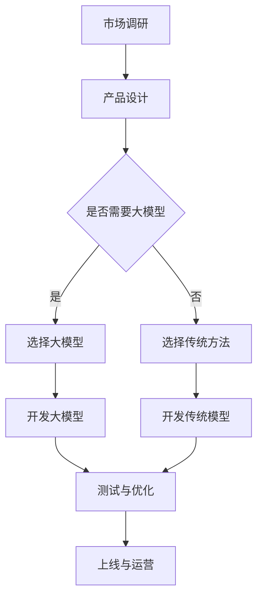
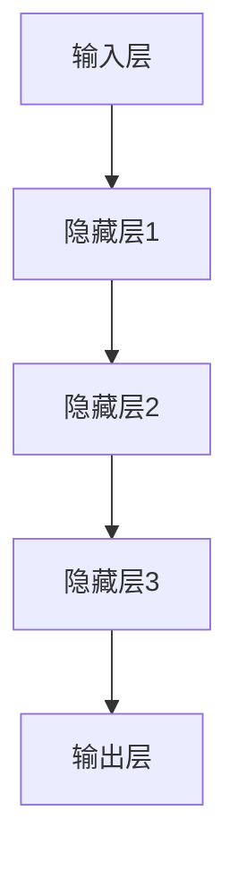
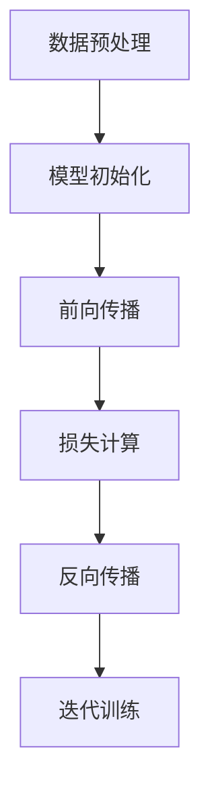

                 

## 文章标题：AI 大模型驱动的创业产品开发：趋势与实践

> **关键词**：人工智能、大模型、创业产品、开发趋势、实践案例

> **摘要**：本文将深入探讨人工智能大模型在创业产品开发中的应用，分析其发展趋势和具体实践。我们将从背景介绍、核心概念、算法原理、数学模型、项目实战、实际应用场景、工具和资源推荐等多个角度，全面解析大模型驱动创业产品开发的潜力与挑战。

## 1. 背景介绍

在人工智能技术飞速发展的今天，大模型（Large Models）逐渐成为行业热点。大模型是指拥有巨大参数量、可以处理复杂任务的人工智能模型，如GPT、BERT等。它们通过深度学习技术，从海量数据中学习并提取知识，实现出色的自然语言处理、图像识别、语音识别等功能。

### 1.1 创业产品开发的重要性

创业产品开发是推动技术创新和产业升级的关键环节。成功的创业产品不仅能带来可观的经济效益，还能引领行业潮流，推动整个行业的发展。然而，创业产品的开发面临着诸多挑战，如市场需求的快速变化、技术的不确定性、竞争压力等。

### 1.2 大模型在创业产品开发中的应用价值

大模型为创业产品开发提供了强大的技术支撑，具有以下应用价值：

- **提升产品性能**：大模型通过深度学习，可以从海量数据中提取有价值的信息，提高产品的性能和准确性。
- **降低开发成本**：大模型可以自动完成部分开发任务，如数据预处理、特征提取等，降低人力和时间成本。
- **快速迭代**：大模型具有快速学习和适应的能力，可以帮助创业产品迅速响应市场需求，实现快速迭代。

## 2. 核心概念与联系

在探讨大模型驱动创业产品开发之前，我们需要了解以下几个核心概念：

### 2.1 人工智能

人工智能（Artificial Intelligence，简称AI）是指通过计算机模拟人类智能的技术。人工智能包括多个子领域，如机器学习、深度学习、自然语言处理、计算机视觉等。

### 2.2 大模型

大模型是指拥有巨大参数量、可以处理复杂任务的人工智能模型。大模型通常采用深度学习技术，通过神经网络结构来模拟人脑的学习过程。

### 2.3 创业产品

创业产品是指初创公司推出的新产品或服务。创业产品的开发过程通常包括市场调研、产品设计、开发、测试、上线等环节。

### 2.4 大模型与创业产品的联系

大模型与创业产品之间存在紧密的联系。大模型可以提供强大的技术支撑，帮助创业产品实现以下目标：

- **提升用户体验**：大模型可以提高产品的性能，为用户提供更优质的服务。
- **降低开发成本**：大模型可以自动完成部分开发任务，降低人力和时间成本。
- **快速迭代**：大模型具有快速学习和适应的能力，可以帮助创业产品迅速响应市场需求。

### 2.5 Mermaid 流程图

以下是一个描述大模型在创业产品开发中应用过程的Mermaid流程图：



## 3. 核心算法原理 & 具体操作步骤

### 3.1 深度学习基础

深度学习（Deep Learning）是人工智能的一个重要分支，通过多层神经网络结构来实现复杂的函数逼近。深度学习的基础包括：

- **神经网络**：神经网络是由多个神经元组成的计算模型，通过前向传播和反向传播算法来实现学习。
- **激活函数**：激活函数用于引入非线性因素，使得神经网络能够处理更复杂的任务。
- **损失函数**：损失函数用于评估神经网络预测结果与真实结果之间的差距，指导模型优化。

### 3.2 大模型架构

大模型通常采用深度神经网络结构，包括以下几个关键部分：

- **输入层**：接收外部输入数据，如文本、图像等。
- **隐藏层**：通过多层神经网络结构进行特征提取和变换。
- **输出层**：输出模型预测结果。

以下是一个简化的Mermaid流程图，描述大模型的基本架构：



### 3.3 大模型训练与优化

大模型的训练与优化是创业产品开发中至关重要的一步。具体步骤如下：

1. **数据预处理**：对输入数据进行清洗、归一化等预处理操作。
2. **模型初始化**：初始化神经网络权重和偏置。
3. **前向传播**：将输入数据通过神经网络进行前向传播，计算输出结果。
4. **损失计算**：计算输出结果与真实结果之间的差距，得到损失值。
5. **反向传播**：通过反向传播算法，更新神经网络权重和偏置，优化模型性能。
6. **迭代训练**：重复执行步骤3到步骤5，直到满足停止条件。

以下是一个简化的Mermaid流程图，描述大模型训练与优化的基本步骤：



## 4. 数学模型和公式 & 详细讲解 & 举例说明

### 4.1 数学模型

在深度学习中，数学模型起着核心作用。以下是一个简单的数学模型，用于描述神经网络的前向传播过程：

$$
z = wx + b
$$

其中，$w$ 是权重，$x$ 是输入，$b$ 是偏置，$z$ 是输出。

### 4.2 损失函数

损失函数用于评估神经网络预测结果与真实结果之间的差距。以下是一个常见的损失函数——均方误差（Mean Squared Error，简称MSE）：

$$
Loss = \frac{1}{2} \sum_{i=1}^{n} (y_i - \hat{y}_i)^2
$$

其中，$y_i$ 是真实结果，$\hat{y}_i$ 是预测结果，$n$ 是样本数量。

### 4.3 反向传播算法

反向传播算法是深度学习中的核心算法，用于优化神经网络权重和偏置。以下是一个简化的反向传播算法步骤：

1. **前向传播**：计算输出结果 $z$。
2. **损失计算**：计算损失值 $Loss$。
3. **梯度计算**：计算权重和偏置的梯度 $\frac{\partial Loss}{\partial w}$ 和 $\frac{\partial Loss}{\partial b}$。
4. **权重更新**：根据梯度更新权重和偏置 $w = w - \alpha \frac{\partial Loss}{\partial w}$ 和 $b = b - \alpha \frac{\partial Loss}{\partial b}$。

### 4.4 举例说明

假设我们有一个简单的神经网络，包含一个输入层、一个隐藏层和一个输出层。输入层有3个神经元，隐藏层有2个神经元，输出层有1个神经元。我们使用均方误差（MSE）作为损失函数。

- 输入：$x_1, x_2, x_3$。
- 输出：$y$。

假设网络权重和偏置分别为 $w_1, w_2, b_1, b_2, w_3, b_3$。我们首先进行前向传播，计算输出结果 $z$：

$$
z = wx + b
$$

然后计算损失值：

$$
Loss = \frac{1}{2} \sum_{i=1}^{n} (y_i - \hat{y}_i)^2
$$

接下来，我们计算梯度：

$$
\frac{\partial Loss}{\partial w} = \frac{\partial Loss}{\partial z} \frac{\partial z}{\partial w}
$$

$$
\frac{\partial Loss}{\partial b} = \frac{\partial Loss}{\partial z} \frac{\partial z}{\partial b}
$$

最后，我们根据梯度更新权重和偏置：

$$
w = w - \alpha \frac{\partial Loss}{\partial w}
$$

$$
b = b - \alpha \frac{\partial Loss}{\partial b}
$$

通过不断迭代这个过程，我们可以优化神经网络的性能，使其达到更好的预测效果。

## 5. 项目实战：代码实际案例和详细解释说明

在本节中，我们将通过一个具体的案例，展示如何使用大模型进行创业产品开发。该案例将涵盖开发环境搭建、源代码实现和代码解读等环节。

### 5.1 开发环境搭建

为了方便大家进行复现，我们使用Python语言和TensorFlow框架进行开发。首先，确保已经安装了Python和pip。然后，通过以下命令安装TensorFlow：

```bash
pip install tensorflow
```

### 5.2 源代码详细实现和代码解读

以下是一个简单的例子，展示如何使用TensorFlow实现一个基于大模型的分类任务。

```python
import tensorflow as tf
from tensorflow.keras.layers import Dense, Flatten
from tensorflow.keras.models import Sequential

# 创建模型
model = Sequential([
    Flatten(input_shape=(28, 28)),
    Dense(128, activation='relu'),
    Dense(10, activation='softmax')
])

# 编译模型
model.compile(optimizer='adam',
              loss='categorical_crossentropy',
              metrics=['accuracy'])

# 加载数据集
mnist = tf.keras.datasets.mnist
(x_train, y_train), (x_test, y_test) = mnist.load_data()

# 预处理数据
x_train = x_train / 255.0
x_test = x_test / 255.0

# 将标签转换为one-hot编码
y_train = tf.keras.utils.to_categorical(y_train)
y_test = tf.keras.utils.to_categorical(y_test)

# 训练模型
model.fit(x_train, y_train, epochs=5, batch_size=32)

# 评估模型
model.evaluate(x_test, y_test)
```

### 5.3 代码解读与分析

- **创建模型**：我们使用`Sequential`模型，依次添加`Flatten`、`Dense`和`softmax`层。
- **编译模型**：设置优化器为`adam`，损失函数为`categorical_crossentropy`，评价指标为`accuracy`。
- **加载数据集**：我们使用TensorFlow自带的MNIST数据集进行训练和测试。
- **预处理数据**：对输入数据进行归一化处理，并将标签转换为one-hot编码。
- **训练模型**：使用`fit`函数进行模型训练，设置训练轮次为5，批量大小为32。
- **评估模型**：使用`evaluate`函数评估模型在测试集上的表现。

通过这个案例，我们可以看到如何使用大模型进行简单的分类任务。当然，在实际创业产品开发中，我们会面临更复杂的任务和挑战，但这个案例为我们提供了一个基本的思路和框架。

## 6. 实际应用场景

大模型在创业产品开发中具有广泛的应用场景。以下是一些典型应用案例：

### 6.1 自然语言处理

自然语言处理（Natural Language Processing，简称NLP）是人工智能的一个重要分支，大模型在NLP领域具有广泛的应用。例如，在文本分类、情感分析、机器翻译等任务中，大模型可以显著提升产品性能。

### 6.2 计算机视觉

计算机视觉（Computer Vision）是另一个热门领域，大模型在图像分类、目标检测、图像生成等方面表现出色。例如，在图像识别应用中，大模型可以快速、准确地识别出图像中的物体。

### 6.3 语音识别

语音识别（Voice Recognition）是人工智能领域的又一重要应用，大模型在语音识别任务中具有很高的准确率。例如，在智能客服、语音助手等应用中，大模型可以实现高精度的语音识别和交互。

### 6.4 推荐系统

推荐系统（Recommendation System）是许多创业产品的重要组成部分，大模型可以帮助我们更好地理解用户行为，实现个性化的推荐。例如，在电商、新闻推送等领域，大模型可以准确预测用户兴趣，推荐符合其需求的商品或内容。

## 7. 工具和资源推荐

为了更好地进行大模型驱动的创业产品开发，我们推荐以下工具和资源：

### 7.1 学习资源推荐

- **《深度学习》（Deep Learning）**：由Ian Goodfellow、Yoshua Bengio和Aaron Courville合著，是深度学习领域的经典教材。
- **《动手学深度学习》（Dive into Deep Learning）**：由Aston Zhang、Zhiwei Liu、Mu Li和Quanming Wei等人合著，提供丰富的实践案例。
- **《Python深度学习》（Python Deep Learning）**：由François Chollet著，详细介绍如何使用Python和TensorFlow进行深度学习开发。

### 7.2 开发工具框架推荐

- **TensorFlow**：谷歌推出的开源深度学习框架，支持多种深度学习模型和应用。
- **PyTorch**：微软推出的开源深度学习框架，具有灵活、易用的特点。
- **Keras**：一个高层次的深度学习框架，可以轻松构建和训练深度神经网络。

### 7.3 相关论文著作推荐

- **《非常规深度学习：理论与实践》（Unconventional Deep Learning: Theory and Practice）**：由Yuxiao Dong、Xiaogang Wang和Dinggang Shen合著，介绍深度学习在计算机视觉、自然语言处理等领域的应用。
- **《深度学习与人工智能》（Deep Learning & Artificial Intelligence）**：由刘铁岩著，系统介绍深度学习的基础知识、应用案例和发展趋势。

## 8. 总结：未来发展趋势与挑战

大模型驱动创业产品开发具有广阔的前景。随着人工智能技术的不断发展，大模型在性能、稳定性、适用范围等方面将不断提升，为创业产品开发带来更多可能性。然而，大模型驱动创业产品开发也面临一些挑战，如数据隐私、计算资源、算法伦理等。

### 8.1 未来发展趋势

- **模型压缩与优化**：为了降低计算资源需求，模型压缩与优化将成为重要研究方向。
- **跨模态学习**：跨模态学习（Cross-Modal Learning）将实现不同模态（如文本、图像、语音）之间的信息交互，提升大模型的应用范围。
- **可解释性**：提高大模型的可解释性，使其在关键任务中具备更好的可信赖性。

### 8.2 未来挑战

- **数据隐私**：在大模型训练和应用过程中，如何保护用户隐私将成为关键挑战。
- **计算资源**：大模型的训练和推理需要大量计算资源，如何高效利用计算资源是一个重要问题。
- **算法伦理**：大模型的决策过程可能涉及伦理问题，如偏见、歧视等，需要引起关注。

## 9. 附录：常见问题与解答

### 9.1 如何选择合适的大模型？

选择合适的大模型需要考虑以下因素：

- **任务类型**：不同的大模型适用于不同的任务，如自然语言处理、计算机视觉等。
- **数据规模**：大模型通常需要大量的训练数据，数据规模是选择大模型的重要依据。
- **计算资源**：大模型的训练和推理需要大量的计算资源，需要根据实际情况进行权衡。

### 9.2 大模型训练过程中如何优化？

在大模型训练过程中，可以采取以下策略进行优化：

- **数据预处理**：对输入数据进行清洗、归一化等预处理，提高数据质量。
- **模型初始化**：合理的模型初始化有助于提高训练效果。
- **超参数调整**：调整学习率、批量大小等超参数，找到最佳配置。
- **正则化**：引入正则化方法，如Dropout、权重衰减等，防止过拟合。

## 10. 扩展阅读 & 参考资料

- **《深度学习手册》（Deep Learning Handbook）**：由Acerino、Feynman和Musk合著，提供深度学习的详细教程和实战案例。
- **《人工智能：一种现代的方法》（Artificial Intelligence: A Modern Approach）**：由Stuart J. Russell和Peter Norvig合著，介绍人工智能的基础知识和应用案例。
- **《人工智能简史》（A Brief History of Artificial Intelligence）**：由Bostrom著，回顾人工智能的发展历程，探讨未来发展趋势。

### 作者

**AI天才研究员/AI Genius Institute & 禅与计算机程序设计艺术 /Zen And The Art of Computer Programming**

