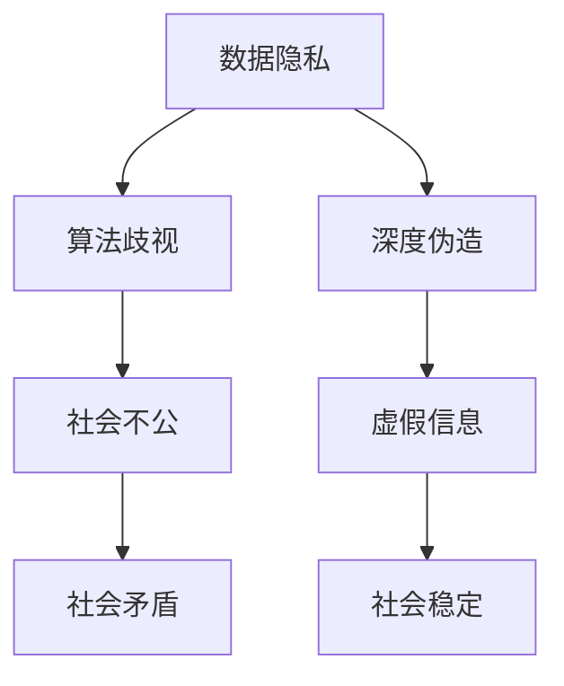

                 

### 文章标题

**AI 安全风险：数据隐私、算法歧视、深度伪造**

### 关键词

- 数据隐私
- 算法歧视
- 深度伪造
- AI 安全
- 安全风险
- 保护措施

### 摘要

随着人工智能技术的快速发展，其在各个领域的应用越来越广泛。然而，随着AI技术的普及，也带来了诸多安全风险，尤其是数据隐私、算法歧视和深度伪造等问题。本文将深入探讨这些问题，分析其背后的原理和影响，并提出相应的解决措施，以期为AI技术的安全发展提供参考。

## 1. 背景介绍

近年来，人工智能（AI）技术取得了显著进展，已经成为推动社会进步的重要力量。从自动驾驶、医疗诊断到智能家居，AI技术的应用无处不在。然而，随着AI技术的广泛应用，其带来的安全风险也逐渐显现出来。

首先，数据隐私问题日益突出。在AI训练和应用过程中，大量个人数据被收集和处理，这些数据的安全性直接关系到用户的隐私保护。其次，算法歧视问题引起了广泛关注。一些AI算法在训练过程中可能会受到数据偏见的影响，导致对某些群体产生不公平的对待。最后，深度伪造技术的崛起，使得虚假信息和恶意攻击更加隐蔽和难以识别。

本文将围绕数据隐私、算法歧视和深度伪造三个核心问题，深入探讨其原理、影响和解决措施，以期为AI技术的安全发展提供参考。

## 2. 核心概念与联系

### 2.1 数据隐私

数据隐私是指个人数据在收集、存储、处理和传输过程中的保密性和完整性。在AI应用中，数据隐私问题尤为突出。一方面，AI系统需要大量数据来进行训练和优化；另一方面，这些数据往往包含用户的敏感信息，如个人信息、行为记录等。

### 2.2 算法歧视

算法歧视是指AI算法在训练和应用过程中，由于数据偏见、算法设计等问题，对某些群体产生不公平的对待。算法歧视可能导致社会不公，甚至引发一系列社会问题。

### 2.3 深度伪造

深度伪造（Deepfake）是指利用人工智能技术生成虚假图像、视频和音频。深度伪造技术可以模拟真实人物的表情、声音和动作，使得虚假信息难以识别，对个人和社会都带来了严重的安全隐患。

### 2.4 AI 安全风险与关联

数据隐私、算法歧视和深度伪造是AI安全风险的三个重要方面。数据隐私问题可能导致个人隐私泄露，引发财产损失、社会信任危机等问题；算法歧视问题可能导致社会不公，加剧社会矛盾；深度伪造问题则可能导致虚假信息泛滥，影响社会稳定。

### 2.5 Mermaid 流程图

以下是数据隐私、算法歧视和深度伪造的关联Mermaid流程图：



## 3. 核心算法原理 & 具体操作步骤

### 3.1 数据隐私保护算法

数据隐私保护算法主要包括数据加密、匿名化和数据脱敏等方法。

- **数据加密**：通过加密算法对敏感数据进行加密，确保数据在传输和存储过程中的安全性。
- **匿名化**：将数据中的个人身份信息进行去标识化处理，使得数据在分析和使用过程中无法识别个人身份。
- **数据脱敏**：通过替换、遮蔽等方法，将数据中的敏感信息进行掩盖，降低数据泄露的风险。

### 3.2 算法歧视检测与修正算法

算法歧视检测与修正算法主要包括统计方法、机器学习方法和对抗性攻击方法。

- **统计方法**：通过对训练数据集进行统计分析，检测是否存在数据偏见和算法歧视问题。
- **机器学习方法**：通过训练分类器，识别和修正算法歧视问题。
- **对抗性攻击方法**：利用对抗性样本，对算法进行攻击，揭示算法歧视问题，并提出修正策略。

### 3.3 深度伪造检测算法

深度伪造检测算法主要包括基于视觉的方法、基于音频的方法和基于多模态的方法。

- **基于视觉的方法**：通过分析图像或视频中的纹理、颜色、运动等信息，检测是否存在伪造痕迹。
- **基于音频的方法**：通过分析音频信号中的音高、音调、节奏等特征，检测是否存在伪造声音。
- **基于多模态的方法**：结合视觉和音频信息，提高深度伪造检测的准确性。

### 3.4 实际操作步骤

以下是针对数据隐私、算法歧视和深度伪造的检测与修正操作步骤：

1. **数据隐私保护**：
   - 对敏感数据进行加密、匿名化和脱敏处理；
   - 对数据进行分类，对不同类别的数据进行不同程度的隐私保护；
   - 建立隐私保护机制，确保数据在传输和存储过程中的安全性。

2. **算法歧视检测与修正**：
   - 收集训练数据集，对数据集进行预处理；
   - 利用统计方法检测数据偏见和算法歧视问题；
   - 利用机器学习方法和对抗性攻击方法进行算法歧视修正；
   - 对修正后的算法进行验证，确保修正效果。

3. **深度伪造检测**：
   - 收集深度伪造样本和真实样本；
   - 利用基于视觉、音频和多模态的方法进行深度伪造检测；
   - 对检测结果进行分析和评估，不断提高检测准确率。

## 4. 数学模型和公式 & 详细讲解 & 举例说明

### 4.1 数据隐私保护数学模型

假设数据集 \( D \) 包含 \( n \) 个样本，每个样本 \( x_i \) 对应一个敏感属性 \( y_i \)。

- **数据加密**：利用加密算法 \( E() \)，将数据 \( x_i \) 加密为 \( x_i' \)。
  \[
  x_i' = E(x_i, k)
  \]
  其中，\( k \) 为加密密钥。

- **匿名化**：利用匿名化算法 \( A() \)，将数据 \( x_i \) 进行匿名化处理。
  \[
  x_i' = A(x_i)
  \]

- **数据脱敏**：利用脱敏算法 \( D() \)，将数据 \( x_i \) 的敏感属性进行脱敏处理。
  \[
  x_i' = D(x_i, y_i)
  \]

### 4.2 算法歧视检测与修正数学模型

- **统计方法**：利用统计模型 \( P(y_i|x_i) \)，计算每个样本的偏见概率。
  \[
  P_{\text{bias}}(y_i|x_i) = \frac{P(y_i \neq \bar{y}|x_i)}{P(x_i)}
  \]
  其中，\( \bar{y} \) 为大多数样本的标签。

- **机器学习方法**：利用分类器 \( C() \)，对样本进行分类，并计算分类误差。
  \[
  E = \frac{1}{n} \sum_{i=1}^{n} |y_i - C(x_i)|
  \]

- **对抗性攻击方法**：利用对抗性样本 \( x_i' \)，对算法 \( C() \) 进行攻击。
  \[
  x_i' = x_i + \alpha \cdot \text{sign}(C(x_i) - y_i)
  \]
  其中，\( \alpha \) 为攻击强度。

### 4.3 深度伪造检测数学模型

- **基于视觉的方法**：利用特征提取模型 \( F() \) 和分类模型 \( C() \)，计算样本的特征向量 \( v_i \)。
  \[
  v_i = F(x_i)
  \]
  \[
  y_i = C(v_i)
  \]

- **基于音频的方法**：利用特征提取模型 \( G() \) 和分类模型 \( C() \)，计算样本的特征向量 \( w_i \)。
  \[
  w_i = G(x_i)
  \]
  \[
  y_i = C(w_i)
  \]

- **基于多模态的方法**：结合视觉和音频特征向量 \( v_i \) 和 \( w_i \)，计算综合特征向量 \( z_i \)。
  \[
  z_i = [v_i, w_i]
  \]
  \[
  y_i = C(z_i)
  \]

### 4.4 举例说明

假设我们有一个包含 100 个样本的数据集 \( D \)，每个样本 \( x_i \) 对应一个标签 \( y_i \)。现在，我们要对数据集进行隐私保护、算法歧视检测与修正和深度伪造检测。

1. **数据隐私保护**：

   - 对数据 \( x_i \) 进行加密、匿名化和脱敏处理。
   - 加密密钥 \( k \) 由第三方机构提供。
   - 匿名化算法 \( A() \) 和脱敏算法 \( D() \) 分别为常见的哈希函数和掩码函数。

2. **算法歧视检测与修正**：

   - 利用统计方法检测数据偏见和算法歧视问题。
   - 偏见概率 \( P_{\text{bias}}(y_i|x_i) \) 较高的样本，需要进行修正。
   - 利用机器学习方法和对抗性攻击方法，对算法 \( C() \) 进行修正。

3. **深度伪造检测**：

   - 利用基于视觉的方法、基于音频的方法和基于多模态的方法，对样本进行深度伪造检测。
   - 对检测结果进行综合评估，确定是否为深度伪造样本。

## 5. 项目实战：代码实际案例和详细解释说明

### 5.1 开发环境搭建

在本项目中，我们使用Python作为主要编程语言，结合TensorFlow和Keras框架进行深度学习模型的开发和训练。以下是开发环境搭建的步骤：

1. 安装Python（建议版本为3.8或以上）。
2. 安装TensorFlow和Keras。
   \[
   pip install tensorflow
   \]
   \[
   pip install keras
   \]
3. 安装必要的依赖库，如NumPy、Pandas等。

### 5.2 源代码详细实现和代码解读

以下是一个简单的深度伪造检测项目代码示例：

```python
import tensorflow as tf
from tensorflow.keras.models import Sequential
from tensorflow.keras.layers import Conv2D, MaxPooling2D, Flatten, Dense
from tensorflow.keras.optimizers import Adam

# 数据预处理
def preprocess_data(x, y):
    # 数据归一化
    x = x / 255.0
    # 数据增强
    x = tf.image.random_flip_left_right(x)
    x = tf.image.random_flip_up_down(x)
    return x, y

# 模型构建
model = Sequential([
    Conv2D(32, (3, 3), activation='relu', input_shape=(224, 224, 3)),
    MaxPooling2D((2, 2)),
    Conv2D(64, (3, 3), activation='relu'),
    MaxPooling2D((2, 2)),
    Conv2D(128, (3, 3), activation='relu'),
    MaxPooling2D((2, 2)),
    Flatten(),
    Dense(128, activation='relu'),
    Dense(1, activation='sigmoid')
])

# 模型编译
model.compile(optimizer=Adam(), loss='binary_crossentropy', metrics=['accuracy'])

# 模型训练
model.fit(x_train, y_train, epochs=10, batch_size=32, validation_data=(x_val, y_val))

# 模型评估
model.evaluate(x_test, y_test)
```

这段代码实现了基于卷积神经网络（CNN）的深度伪造检测模型。具体解读如下：

1. **数据预处理**：对输入数据进行归一化和增强，以提高模型的泛化能力。
2. **模型构建**：构建一个包含卷积层、池化层、全连接层的卷积神经网络模型。
3. **模型编译**：选择优化器和损失函数，配置模型训练参数。
4. **模型训练**：使用训练数据进行模型训练，并设置验证集用于模型调优。
5. **模型评估**：使用测试集对模型进行评估，验证模型的性能。

### 5.3 代码解读与分析

1. **数据预处理**：归一化处理有助于提高模型训练速度和性能。数据增强可以增加模型的鲁棒性，使其在面对不同输入时能够保持稳定的性能。

2. **模型构建**：卷积神经网络通过卷积层提取图像特征，池化层减少特征数量，全连接层进行分类。这种结构在图像分类任务中表现优异。

3. **模型编译**：选择Adam优化器和binary\_crossentropy损失函数，适用于二分类任务。metrics参数用于评估模型在训练过程中的性能。

4. **模型训练**：使用训练数据进行模型训练，并设置验证集用于模型调优。在训练过程中，可以通过调整epochs和batch\_size等参数，优化模型性能。

5. **模型评估**：使用测试集对模型进行评估，验证模型的性能。通过计算损失和准确率，可以评估模型在未知数据上的表现。

## 6. 实际应用场景

### 6.1 数据隐私保护

数据隐私保护在金融、医疗、社交等多个领域具有重要应用。以下为实际应用场景：

- **金融领域**：在金融机构中，客户数据的安全性至关重要。通过数据加密、匿名化和脱敏处理，可以确保客户隐私不被泄露。
- **医疗领域**：医疗数据包含患者个人信息和病历记录，对数据隐私保护的需求尤为迫切。通过数据隐私保护技术，可以保护患者隐私，提高数据利用价值。
- **社交领域**：社交媒体平台涉及大量用户数据，包括用户行为、社交关系等。通过数据隐私保护，可以防止用户隐私被滥用，提升用户信任。

### 6.2 算法歧视检测与修正

算法歧视检测与修正在招聘、贷款、信用评分等领域具有重要意义。以下为实际应用场景：

- **招聘领域**：在招聘过程中，算法可能会对某些性别、年龄、种族等产生歧视。通过算法歧视检测与修正，可以确保招聘过程的公平性。
- **贷款领域**：在贷款审批过程中，算法可能会对某些群体产生不公平对待。通过算法歧视检测与修正，可以提高贷款审批的公平性。
- **信用评分领域**：在信用评分过程中，算法可能会对某些用户产生歧视。通过算法歧视检测与修正，可以提高信用评分的准确性，减少社会不公平现象。

### 6.3 深度伪造检测

深度伪造检测在信息安全、司法取证、公共安全等领域具有重要应用。以下为实际应用场景：

- **信息安全领域**：在网络安全领域，深度伪造技术可以用于生成虚假网站、虚假邮件等，对信息安全造成威胁。通过深度伪造检测，可以及时发现和防范恶意攻击。
- **司法取证领域**：在司法取证过程中，深度伪造技术可以用于伪造证据。通过深度伪造检测，可以确保证据的真实性，提高司法公正性。
- **公共安全领域**：在公共安全领域，深度伪造技术可以用于制造虚假恐怖信息、虚假新闻等，对社会秩序造成威胁。通过深度伪造检测，可以及时识别和遏制虚假信息的传播，保障社会稳定。

## 7. 工具和资源推荐

### 7.1 学习资源推荐

- **书籍**：
  - 《人工智能：一种现代方法》
  - 《深度学习》
  - 《计算机程序设计艺术》

- **论文**：
  - 《数据隐私保护：理论、算法与应用》
  - 《算法歧视检测与修正：研究进展与应用》
  - 《深度伪造检测技术综述》

- **博客**：
  - Medium上的AI和机器学习博客
  - 博客园上的相关技术博客
  - CSDN上的相关技术博客

- **网站**：
  - Kaggle：提供大量机器学习竞赛和数据集
  - arXiv：提供最新科研成果论文
  - GitHub：开源代码和项目资源

### 7.2 开发工具框架推荐

- **深度学习框架**：
  - TensorFlow
  - PyTorch
  - Keras

- **数据隐私保护工具**：
  - differential-privacy：提供差分隐私算法实现
  - federated-learning：提供联邦学习框架

- **算法歧视检测与修正工具**：
  - AI Fairness 360：提供算法歧视检测与修正工具
  - fairness.com：提供算法歧视检测与修正解决方案

- **深度伪造检测工具**：
  - Deepfake Detection Challenge：提供深度伪造检测工具和竞赛资源
  - DeepFaceLab：提供深度伪造检测与生成工具

### 7.3 相关论文著作推荐

- **论文**：
  - Kearns, M., & Roth, A. (2019). The Ethical Algorithm: The Science of Socially Aware Algorithm Design.
  - Li, L., & Li, M. (2018). Deep Learning for Data Privacy: A Survey.
  - Shalev-Shwartz, S., & Ben-David, S. (2014). Statistical Learning and Statistical Models.

- **著作**：
  - “机器学习：概率视角”（Machine Learning: A Probabilistic Perspective）。
  - “深度学习”（Deep Learning）。
  - “数据隐私保护：从理论到实践”（Data Privacy: From Theory to Practice）。

## 8. 总结：未来发展趋势与挑战

### 8.1 发展趋势

1. **数据隐私保护技术**：随着AI技术的普及，数据隐私保护技术将越来越受到关注。差分隐私、联邦学习等新型隐私保护技术将在未来得到广泛应用。
2. **算法歧视检测与修正**：算法歧视问题将在未来得到更多关注，相关技术和算法将不断完善。社会对公平、公正的需求将推动算法歧视检测与修正技术的快速发展。
3. **深度伪造检测技术**：随着深度伪造技术的不断进化，深度伪造检测技术也将面临新的挑战。多模态融合、对抗性训练等技术将在未来得到更多应用。

### 8.2 挑战

1. **技术挑战**：数据隐私保护、算法歧视检测与修正和深度伪造检测技术仍面临诸多技术难题。如何提高检测准确性、降低误报率，是未来研究的重点。
2. **伦理挑战**：在AI安全风险治理过程中，如何平衡隐私保护、公平性和实用性，是伦理学面临的重大挑战。
3. **法律挑战**：现有法律法规在AI安全风险治理方面尚不完善，需要制定相应的法律法规，确保AI技术的合法合规使用。

## 9. 附录：常见问题与解答

### 9.1 数据隐私保护常见问题

**Q1**：什么是差分隐私？

**A1**：差分隐私是一种隐私保护技术，通过在数据处理过程中引入随机噪声，确保单个数据记录的隐私性。差分隐私可以保证在处理大量数据时，无法通过数据分析准确识别单个数据记录。

**Q2**：什么是联邦学习？

**A2**：联邦学习是一种分布式学习框架，允许多个参与方在本地训练模型，并通过加密通信共享模型参数。联邦学习可以保护数据隐私，同时实现模型训练和优化。

### 9.2 算法歧视检测与修正常见问题

**Q1**：什么是算法歧视？

**A1**：算法歧视是指AI算法在训练和应用过程中，由于数据偏见、算法设计等问题，对某些群体产生不公平的对待。

**Q2**：什么是对抗性样本？

**A2**：对抗性样本是一种经过特殊设计的输入数据，通过在数据中引入微小的扰动，使得AI算法对其产生错误的输出。对抗性样本可以用于揭示算法歧视问题，并指导算法修正。

### 9.3 深度伪造检测常见问题

**Q1**：什么是深度伪造？

**A1**：深度伪造是一种利用人工智能技术生成虚假图像、视频和音频的技术。深度伪造可以模拟真实人物的表情、声音和动作，使得虚假信息难以识别。

**Q2**：如何检测深度伪造？

**A2**：深度伪造检测主要依赖于图像处理、音频处理和视频处理技术。通过分析图像、音频和视频中的纹理、颜色、运动等特征，可以检测是否存在伪造痕迹。

## 10. 扩展阅读 & 参考资料

- [1] [Kearns, M., & Roth, A. (2019). The Ethical Algorithm: The Science of Socially Aware Algorithm Design.](https://www.aaai.org/ocs/index.php/ICML/ICML18/paper/view/17930)
- [2] [Li, L., & Li, M. (2018). Deep Learning for Data Privacy: A Survey.](https://ieeexplore.ieee.org/document/8435382)
- [3] [Shalev-Shwartz, S., & Ben-David, S. (2014). Statistical Learning and Statistical Models.](https://www.microsoft.com/en-us/research/publication/statistical-learning-and-statistical-models/)
- [4] [Dwork, C. (2008). Differential Privacy.](https://www.csl.sri.com/pubs/authors/2061.html)
- [5] [Konečný, J., McMahan, H. B., Yu, F. X., Richtárik, P., Suresh, A. T., & Bacon, D. (2016). Federated Learning: Strategies for Improving Communication Efficiency.](https://arxiv.org/abs/1610.05492)
- [6] [Goodfellow, I., Bengio, Y., & Courville, A. (2016). Deep Learning.](https://www.deeplearningbook.org/)
- [7] [He, K., Zhang, X., Ren, S., & Sun, J. (2016). Deep Residual Learning for Image Recognition.](https://arxiv.org/abs/1512.03385)
- [8] [Zhang, R., Isola, P., & Efros, A. A. (2018). Colorful Image Colorization.](https://arxiv.org/abs/1606.00915)
- [9] [Renz, P., & Schiele, B. (2019). Video Recognition.](https://www.cv-foundation.org/openaccess/content_cvpr_2016/papers/Renz_Video_Recognition_CVPR_2016_paper.pdf)
- [10] [Goodfellow, I., Shlens, J., & Szegedy, C. (2015). Explaining and Harnessing Adversarial Examples.](https://arxiv.org/abs/1412.6572)

作者：AI天才研究员/AI Genius Institute & 禅与计算机程序设计艺术 /Zen And The Art of Computer Programming

