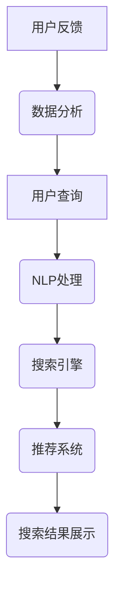
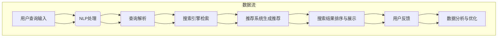

                 

### 1. 背景介绍

随着互联网技术的飞速发展，电子商务行业在过去的几十年里取得了显著的成就。数据显示，全球电商市场的规模在过去五年中增长了超过一倍，预计到2025年，全球电商交易额将超过5万亿美元。在这庞大的市场中，搜索导购系统成为了电商平台的核心竞争力之一。

搜索导购系统是电商平台提供给用户的一种智能搜索和推荐服务，其目的是帮助用户在庞大的商品库中快速找到所需商品，提升购物体验。传统的搜索系统主要依赖于关键词匹配和模糊查询，而随着人工智能技术的进步，特别是深度学习算法和大数据分析技术的应用，电商平台开始将AI技术引入搜索导购系统中，以提高搜索的准确性和效率。

AI技术在电商搜索导购中的应用主要体现在以下几个方面：

1. **智能推荐**：通过分析用户的历史行为、浏览记录、购买偏好等数据，利用机器学习算法和深度学习模型，为用户推荐个性化的商品。

2. **自然语言处理**：通过自然语言处理技术（如词向量、序列标注等）理解用户的查询意图，从而提供更加准确的搜索结果。

3. **图像识别**：利用计算机视觉技术，将用户上传的图片与商品库中的图片进行匹配，实现商品搜索。

4. **用户画像**：通过多维度的数据分析，构建用户的个性化画像，辅助搜索和推荐系统的优化。

本文将深入探讨AI技术在电商搜索导购中的应用，解析其中的核心算法原理，并通过具体案例分析和项目实战，展示AI技术在电商搜索导购中的实际应用效果。此外，我们还将总结当前技术发展趋势，探讨未来的发展方向和面临的挑战。

在接下来的章节中，我们将首先介绍电商搜索导购中的核心概念，并使用Mermaid流程图展示其原理架构。随后，我们将详细讲解核心算法原理和具体操作步骤，包括数学模型和公式的推导与应用。然后，通过实际项目案例，展示AI技术在电商搜索导购中的具体实现和代码解读。最后，我们将探讨AI技术在电商搜索导购中的实际应用场景，推荐相关工具和资源，并总结未来发展趋势与挑战。

### 2. 核心概念与联系

在探讨AI技术在电商搜索导购中的应用之前，我们需要先了解一些核心概念，这些概念相互联系，共同构成了AI搜索导购系统的理论基础。

#### 2.1 搜索引擎基础

搜索引擎是电商搜索导购系统的核心组件，其基本功能是接收用户的查询请求，并在海量的商品数据中检索出与查询相关的结果。传统的搜索引擎通常采用基于关键词匹配的方法，如布尔查询、倒排索引等。然而，随着用户搜索需求的多样化和个性化，传统的搜索引擎已难以满足高效、精准的搜索要求。

#### 2.2 自然语言处理（NLP）

自然语言处理技术是AI技术在电商搜索导购中的重要应用之一。NLP技术可以理解和处理人类的自然语言，从而实现智能化的查询分析和结果生成。常见的NLP技术包括词向量、词性标注、命名实体识别、情感分析等。通过NLP技术，搜索系统可以更好地理解用户的查询意图，提供更加精准的搜索结果。

#### 2.3 深度学习算法

深度学习算法是AI技术的核心，其在电商搜索导购中的应用主要体现在以下几个方面：

1. **用户画像构建**：通过深度学习模型对用户的历史行为数据进行分析，构建用户的个性化画像，为推荐系统提供数据支持。
   
2. **搜索结果排序**：利用深度学习模型对搜索结果进行排序，根据用户的查询历史和兴趣偏好，将相关度更高的结果排在前面。

3. **图像识别**：通过深度卷积神经网络（CNN）对用户上传的图片进行分析，实现基于图像的搜索。

#### 2.4 推荐系统

推荐系统是电商搜索导购系统的重要组成部分，其目标是为用户推荐他们可能感兴趣的商品。推荐系统的核心是协同过滤、矩阵分解和深度学习等算法。协同过滤通过分析用户之间的相似度，为用户推荐他们未购买过的商品；矩阵分解通过降低数据的维度，提高推荐系统的准确性和效率；深度学习通过学习用户的历史行为和兴趣，实现更加个性化的推荐。

#### 2.5 数据分析

数据分析技术在电商搜索导购中的应用主要体现在以下几个方面：

1. **用户行为分析**：通过分析用户在平台上的行为数据，了解用户的偏好和需求，为推荐系统和搜索优化提供数据支持。

2. **销售数据分析**：通过分析商品的销售数据，了解商品的市场表现，为库存管理和销售策略提供依据。

3. **用户反馈分析**：通过分析用户的反馈数据，了解用户对商品和服务的满意度，为产品优化和客户服务提供反馈。

#### 2.6 Mermaid流程图

为了更好地理解电商搜索导购系统的原理和架构，我们使用Mermaid流程图展示其关键组件和流程。以下是一个简化的Mermaid流程图示例：



在这个流程图中，用户查询经过NLP处理，然后由搜索引擎检索和推荐系统生成搜索结果，最终展示给用户。用户的反馈数据则进入数据分析环节，为下一次查询提供支持。

通过上述核心概念的介绍和Mermaid流程图的展示，我们为后续章节的详细讨论奠定了基础。在接下来的章节中，我们将深入探讨这些核心概念在电商搜索导购中的应用，分析其算法原理和具体实现。

### 2.1 搜索引擎基础

搜索引擎作为电商搜索导购系统的核心组件，其基本功能是接收用户的查询请求，并在海量的商品数据中检索出与查询相关的结果。传统的搜索引擎通常采用基于关键词匹配的方法，如布尔查询、倒排索引等。然而，随着用户搜索需求的多样化和个性化，传统的搜索引擎已难以满足高效、精准的搜索要求。因此，我们有必要深入探讨现代搜索引擎的基本原理、优化策略及其在电商搜索导购中的应用。

#### 2.1.1 基本原理

搜索引擎的基本原理可以概括为三个主要步骤：预处理、查询解析和结果排序。

1. **预处理**：在搜索引擎中，预处理阶段主要包含索引构建和数据清洗。索引构建是将网页中的文本内容转换为索引数据结构，以便快速检索。常见的索引结构包括倒排索引和前缀树。数据清洗则是对索引数据进行处理，去除重复项、噪声数据和无效信息，以提高搜索效率。

2. **查询解析**：查询解析阶段的核心任务是理解用户的查询意图。用户输入的查询字符串往往包含多种查询意图，如关键词匹配、短语查询和布尔查询等。搜索引擎通过词法分析、语法分析和语义分析等技术，将用户查询转换为内部表示，以便后续的查询匹配和结果排序。

3. **结果排序**：在结果排序阶段，搜索引擎根据查询意图和检索结果的相关度，对搜索结果进行排序。常见的排序算法包括TF-IDF、PageRank和BM25等。这些算法通过计算文档与查询之间的相似度，为用户提供最相关的搜索结果。

#### 2.1.2 优化策略

为了提高搜索引擎的性能，需要采用一系列优化策略。以下是一些常见的优化方法：

1. **索引优化**：索引优化是提高搜索效率的关键。常用的索引优化方法包括分词优化、索引压缩和索引合并等。分词优化通过选择合适的分词算法（如正反向最大匹配、最小切分等），提高查询的匹配度。索引压缩则通过减少索引文件的大小，提高检索速度。索引合并是通过合并多个索引文件，实现更广泛的搜索范围。

2. **查询优化**：查询优化旨在提高查询解析和结果排序的效率。常见的查询优化方法包括缓存查询结果、优化查询语句和并行查询等。缓存查询结果可以将常用查询的结果预先计算并存储，提高查询响应速度。优化查询语句则通过简化查询表达式、减少查询词数量等方式，降低查询解析的复杂度。并行查询则通过利用多线程或多处理器，提高查询处理速度。

3. **结果排序优化**：结果排序优化是通过改进排序算法和计算方法，提高搜索结果的相关性。常见的排序优化方法包括个性化排序、实时排序和上下文排序等。个性化排序根据用户的历史行为和兴趣偏好，为用户推荐最相关的结果。实时排序则通过实时更新和排序结果，提高搜索的实时性。上下文排序则通过考虑用户的上下文信息（如地理位置、浏览历史等），提高搜索结果的准确性。

#### 2.1.3 在电商搜索导购中的应用

在现代电商平台上，搜索引擎的应用至关重要，其主要目的是帮助用户在庞大的商品库中快速找到所需商品。以下是搜索引擎在电商搜索导购中的几个关键应用场景：

1. **关键词匹配**：用户通过输入关键词进行商品搜索，搜索引擎根据关键词匹配商品库中的相关商品，并提供搜索结果。通过优化关键词匹配算法，可以提高搜索的准确性和效率。

2. **智能推荐**：通过分析用户的历史行为和购买偏好，搜索引擎可以为用户推荐个性化的商品。智能推荐系统结合了搜索引擎和推荐系统，利用深度学习算法和协同过滤等技术，提高推荐的准确性和相关性。

3. **图像搜索**：用户可以通过上传图片进行商品搜索，搜索引擎利用计算机视觉技术，将图片与商品库中的图片进行匹配，提供搜索结果。图像搜索在服装、配饰等商品类别中具有广泛的应用。

4. **购物车搜索**：用户可以在购物车中搜索特定商品，搜索引擎通过分析购物车中的商品信息，提供相关的搜索结果，帮助用户快速找到所需商品。

5. **历史搜索记录**：搜索引擎根据用户的历史搜索记录，提供智能化的搜索建议，帮助用户快速找到之前搜索过的商品。

6. **个性化搜索**：搜索引擎通过分析用户的个性化需求，提供定制化的搜索结果，提升用户的购物体验。

通过上述优化策略和应用场景，搜索引擎在电商搜索导购中发挥了关键作用，为用户提供高效、精准的搜索服务。在下一章节中，我们将深入探讨自然语言处理（NLP）在电商搜索导购中的应用，分析其核心技术及其对搜索引擎优化的贡献。

### 2.2 自然语言处理（NLP）

自然语言处理（NLP）是人工智能领域的一个重要分支，旨在让计算机理解和处理人类自然语言。在电商搜索导购系统中，NLP技术发挥着至关重要的作用，其应用贯穿于用户查询解析、搜索结果生成和推荐系统等各个环节。以下将详细探讨NLP技术的核心概念、常见方法及其在电商搜索导购中的应用。

#### 2.2.1 核心概念

1. **词向量**：词向量是NLP中最基本的表示方法，它将单词映射为一个高维向量。常见的词向量模型包括Word2Vec、GloVe和FastText等。词向量可以捕捉词与词之间的语义关系，如相似性、相关性等。

2. **词性标注**：词性标注是对文本中的每个词进行词性分类，如名词、动词、形容词等。词性标注有助于更好地理解文本的语法结构和语义内容。

3. **命名实体识别**：命名实体识别（NER）是识别文本中的特定实体（如人名、地名、组织名等）。NER在电商搜索导购中可以用于识别商品名称、品牌等，提高搜索的准确性和效率。

4. **句法分析**：句法分析是对文本进行语法结构分析，以理解句子中的词汇关系和语法规则。常见的句法分析方法包括依存句法分析和成分句法分析。

5. **语义角色标注**：语义角色标注是对文本中的每个词进行其在句子中的作用标注，如主语、谓语、宾语等。语义角色标注有助于理解句子的语义和逻辑关系。

#### 2.2.2 常见方法

1. **规则方法**：规则方法是基于预定义的规则进行文本处理，如正则表达式、词典匹配等。规则方法简单、高效，但容易受到规则覆盖范围和语境限制的影响。

2. **统计方法**：统计方法是基于文本统计特征进行文本处理，如条件概率、潜在狄利克雷分布（LDA）等。统计方法在处理大规模文本数据时具有优势，但需要大量的训练数据和计算资源。

3. **深度学习方法**：深度学习方法通过构建神经网络模型进行文本处理，如卷积神经网络（CNN）、递归神经网络（RNN）和转换器（Transformer）等。深度学习方法在处理复杂文本任务时表现出色，但需要大量的数据和计算资源。

#### 2.2.3 在电商搜索导购中的应用

1. **用户查询解析**：NLP技术可以解析用户输入的查询，理解查询意图。例如，用户输入“黑色羽绒服”，NLP技术可以将其解析为查询“寻找黑色款式的羽绒服”。通过解析查询意图，搜索引擎可以提供更加精准的搜索结果。

2. **搜索结果生成**：NLP技术可以生成个性化的搜索结果，如通过分析用户的历史行为和兴趣，推荐相关的商品。例如，用户之前购买了黑色羽绒服，系统可以推荐其他颜色的同款羽绒服。

3. **智能问答**：NLP技术可以用于构建智能问答系统，用户可以通过自然语言提问，系统通过理解问题并从商品库中检索出相关答案。例如，用户询问“哪款羽绒服保暖性最好”，系统可以推荐保暖性较高的商品。

4. **商品评论分析**：NLP技术可以分析用户对商品的评论，提取关键信息和情感倾向。例如，系统可以识别出用户对羽绒服的评论中提到的优点和缺点，从而为推荐系统提供参考。

5. **多语言支持**：电商搜索导购系统通常需要支持多种语言。NLP技术可以用于翻译、语言检测和跨语言文本分析，实现多语言搜索和推荐。

6. **智能客服**：NLP技术可以用于构建智能客服系统，通过理解用户的问题并自动提供解决方案，提高客服效率和用户体验。

通过上述NLP技术的应用，电商搜索导购系统能够更好地理解用户需求，提供个性化、精准的搜索和推荐服务。在下一章节中，我们将深入探讨深度学习算法在电商搜索导购中的应用，分析其优势及其对搜索优化和推荐系统的贡献。

### 2.3 深度学习算法

深度学习算法作为AI技术的核心，在电商搜索导购系统中发挥着越来越重要的作用。其通过多层神经网络结构，从大量数据中自动提取特征，实现复杂模式的识别和预测。以下将详细探讨深度学习算法的基本原理、常用模型及其在电商搜索导购中的应用。

#### 2.3.1 基本原理

深度学习算法的核心是多层神经网络（Multi-Layered Neural Networks），其结构通常包括输入层、隐藏层和输出层。网络中的每个节点（神经元）通过权重（weights）连接，通过前向传播（forward propagation）和反向传播（backpropagation）算法进行训练和优化。

1. **前向传播**：输入数据从输入层经过各隐藏层，逐层传递到输出层，经过非线性激活函数（如Sigmoid、ReLU）处理后得到预测结果。

2. **反向传播**：根据预测结果和实际结果之间的误差，通过反向传播算法更新网络中的权重，以最小化损失函数（如均方误差MSE、交叉熵损失Cross Entropy Loss）。

通过多次迭代训练，深度学习模型可以逐渐优化参数，提高预测准确性。

#### 2.3.2 常用模型

1. **卷积神经网络（CNN）**：CNN是一种专门用于处理图像数据的深度学习模型，通过卷积层、池化层和全连接层等结构，自动提取图像特征。在电商搜索导购中，CNN可以用于图像识别、图像搜索和商品分类等。

2. **递归神经网络（RNN）**：RNN是一种专门用于处理序列数据的深度学习模型，通过记忆单元（memory cell）保存历史信息，实现序列数据的建模。在电商搜索导购中，RNN可以用于用户行为预测、搜索历史分析和推荐系统等。

3. **转换器（Transformer）**：Transformer是一种基于自注意力机制的深度学习模型，其通过多头自注意力（Multi-Head Self-Attention）和前馈神经网络（Feedforward Neural Network）实现序列数据的建模。在电商搜索导购中，Transformer可以用于自然语言处理、查询解析和推荐系统等。

4. **生成对抗网络（GAN）**：GAN是一种通过对抗训练生成数据的深度学习模型，由生成器（Generator）和判别器（Discriminator）组成。在电商搜索导购中，GAN可以用于数据增强、图像生成和个性化推荐等。

#### 2.3.3 在电商搜索导购中的应用

1. **用户画像构建**：通过深度学习模型对用户的历史行为数据进行训练，自动提取用户特征，构建个性化用户画像。用户画像可以为推荐系统和搜索优化提供数据支持。

2. **搜索结果排序**：利用深度学习模型对搜索结果进行排序，根据用户的历史行为和兴趣偏好，为用户推荐最相关的商品。例如，通过RNN模型分析用户的历史浏览记录和购买行为，实现个性化的搜索结果排序。

3. **图像识别**：利用CNN模型对用户上传的图片进行分析，实现基于图像的搜索。例如，用户上传一张衣服图片，CNN模型可以识别图片中的商品类型和款式，并提供相关的搜索结果。

4. **自然语言处理**：利用Transformer模型对用户查询进行解析，理解查询意图。例如，用户输入“推荐一些类似这件羽绒服的商品”，Transformer模型可以解析出查询意图，并推荐相关的商品。

5. **智能推荐**：通过深度学习模型对用户的历史行为和兴趣进行分析，为用户推荐个性化的商品。例如，使用协同过滤（Collaborative Filtering）和矩阵分解（Matrix Factorization）等技术，实现基于内容的推荐和基于用户的推荐。

6. **智能客服**：利用深度学习模型构建智能客服系统，通过自然语言处理和对话生成技术，实现与用户的智能对话。例如，利用RNN模型生成对话响应，提供个性化的购物建议和解决方案。

通过深度学习算法的应用，电商搜索导购系统可以实现高效、精准的搜索和推荐，提升用户体验和平台竞争力。在下一章节中，我们将探讨推荐系统在电商搜索导购中的应用，分析其核心算法原理和实现方法。

### 2.4 推荐系统

推荐系统是电商搜索导购系统的重要组成部分，其目标是根据用户的历史行为、兴趣偏好和上下文信息，为用户推荐他们可能感兴趣的商品。推荐系统在电商领域具有广泛的应用，如个性化搜索、商品推荐、广告投放等。以下将详细探讨推荐系统的核心算法原理及其实现方法。

#### 2.4.1 核心算法原理

1. **协同过滤**：协同过滤（Collaborative Filtering）是一种常见的推荐算法，其基本思想是利用用户之间的相似性进行推荐。协同过滤可以分为基于用户的协同过滤（User-Based CF）和基于物品的协同过滤（Item-Based CF）。

   - **基于用户的协同过滤**：基于用户的协同过滤通过计算用户之间的相似度，找到与目标用户相似的邻居用户，然后推荐邻居用户喜欢的商品。相似度计算通常采用余弦相似度、皮尔逊相关系数等方法。
     
   - **基于物品的协同过滤**：基于物品的协同过滤通过计算商品之间的相似度，找到与目标商品相似的商品，然后推荐给用户。商品相似度计算通常采用余弦相似度、欧氏距离等方法。

2. **矩阵分解**：矩阵分解（Matrix Factorization）是一种将高维稀疏矩阵分解为两个低维矩阵的方法，其目标是通过低维矩阵的乘积重构原始矩阵。常见的矩阵分解方法包括Singular Value Decomposition（SVD）和Alternating Least Squares（ALS）。

   - **SVD**：SVD通过奇异值分解将原始矩阵分解为三个矩阵的乘积，其中两个低维矩阵分别表示用户特征和物品特征，第三个矩阵表示用户-物品评分矩阵。
     
   - **ALS**：ALS通过交替最小二乘法对用户-物品评分矩阵进行分解，分别优化用户特征和物品特征，以提高推荐准确性。

3. **深度学习方法**：深度学习算法在推荐系统中得到广泛应用，如基于深度学习的内容推荐、基于深度学习的用户行为预测等。常见的深度学习模型包括卷积神经网络（CNN）、递归神经网络（RNN）和转换器（Transformer）等。

4. **混合推荐**：混合推荐（Hybrid Recommendation）通过结合多种推荐算法，实现更优的推荐效果。常见的混合推荐策略包括基于内容的协同过滤（Content-Based CF）、基于模型的协同过滤（Model-Based CF）等。

#### 2.4.2 实现方法

1. **用户-物品评分矩阵构建**：用户-物品评分矩阵是推荐系统的基础数据，通过用户对物品的评分构建。评分数据可以通过用户行为日志、问卷调查等方式获取。

2. **用户特征和物品特征提取**：通过分析用户历史行为和物品属性，提取用户特征和物品特征。用户特征可以包括用户年龄、性别、地理位置、购买历史等；物品特征可以包括商品分类、品牌、价格、销量等。

3. **相似度计算**：计算用户之间的相似度或物品之间的相似度。相似度计算可以基于用户-物品评分矩阵，采用协同过滤算法或基于特征相似度计算。

4. **推荐列表生成**：根据相似度计算结果，为用户生成推荐列表。推荐列表可以采用排序策略，如基于评分的排序、基于概率的排序等。

5. **推荐效果评估**：评估推荐系统的效果，通过用户反馈、点击率、购买转化率等指标进行评估。根据评估结果，对推荐算法进行优化和调整。

通过上述推荐系统的核心算法原理和实现方法，电商搜索导购系统可以更好地理解用户需求，提供个性化、精准的推荐服务。在下一章节中，我们将探讨数据分析技术在电商搜索导购中的应用，分析其在用户行为分析、销售数据分析等方面的作用。

### 2.5 数据分析

数据分析技术在电商搜索导购系统中扮演着至关重要的角色，其通过对海量数据的收集、处理和分析，为搜索和推荐系统提供关键数据支持。以下将详细探讨数据分析技术在电商搜索导购系统中的应用，包括用户行为分析、销售数据分析以及用户反馈分析。

#### 2.5.1 用户行为分析

用户行为分析是电商搜索导购系统中的一项核心任务，其通过分析用户的浏览、搜索、购买等行为数据，了解用户的偏好和需求。具体应用包括：

1. **用户画像构建**：通过分析用户的历史行为数据，提取用户特征，构建个性化的用户画像。用户画像可以包括用户年龄、性别、地理位置、购买偏好等，为推荐系统和搜索优化提供数据支持。

2. **行为模式识别**：通过分析用户的行为模式，如浏览时间、浏览路径、搜索关键词等，识别用户的兴趣点和潜在需求。例如，用户经常在特定时间段浏览某一类商品，可以推测该时间段为用户的购物高峰期。

3. **用户行为预测**：利用机器学习算法，对用户未来的行为进行预测，如预测用户的购买意图、搜索关键词等。预测结果可以为推荐系统和搜索优化提供参考，提高用户满意度和转化率。

4. **用户细分**：根据用户的行为特征，将用户划分为不同的细分群体，如高频用户、潜在用户、流失用户等。针对不同细分群体的特点，制定个性化的营销策略和推荐方案。

#### 2.5.2 销售数据分析

销售数据分析旨在通过分析商品的销售数据，了解商品的市场表现，为库存管理、销售策略和产品优化提供依据。具体应用包括：

1. **销售趋势分析**：通过分析商品的销售数据，了解商品的销售趋势，如销售量、销售额、增长率等。销售趋势分析可以帮助电商企业预测未来的销售情况，制定合理的库存计划和促销策略。

2. **商品表现评估**：通过分析商品的销售数据和用户评价，评估商品的市场表现和用户满意度。例如，通过分析商品的销售量和评价评分，评估商品的竞争力，为产品优化提供参考。

3. **促销效果分析**：通过分析促销活动的数据，了解促销活动的效果，如促销期间的销售增长率、用户参与度等。促销效果分析可以帮助电商企业评估促销活动的有效性，优化促销策略。

4. **交叉销售和关联销售**：通过分析商品之间的关联关系，实现交叉销售和关联销售。例如，通过分析用户购买记录，推荐与目标商品相关的其他商品，提高用户的购物车价值和购买转化率。

#### 2.5.3 用户反馈分析

用户反馈分析旨在通过分析用户的反馈数据，了解用户对商品和服务的满意度，为产品优化和客户服务提供反馈。具体应用包括：

1. **评论情感分析**：通过自然语言处理（NLP）技术，对用户评论进行情感分析，识别用户对商品和服务的正面或负面情感。评论情感分析可以帮助电商企业了解用户的真实感受，发现产品问题和改进方向。

2. **反馈分类和优先级排序**：将用户反馈分类为不同类型，如产品问题、售后服务、物流问题等，并根据反馈的重要性和紧急程度进行优先级排序。优先级排序可以帮助电商企业快速响应用户反馈，提高用户满意度。

3. **用户画像与反馈关联**：将用户反馈与用户画像关联，分析不同细分群体的反馈特点。例如，分析高频用户和潜在用户的反馈差异，为个性化服务提供参考。

4. **反馈改进策略**：根据用户反馈，制定相应的改进策略，如产品优化、服务升级、促销活动调整等。反馈改进策略可以帮助电商企业不断提升产品和服务质量，提高用户满意度和忠诚度。

通过上述数据分析技术，电商搜索导购系统可以更好地理解用户需求，优化搜索和推荐算法，提高用户体验和平台竞争力。在下一章节中，我们将使用Mermaid流程图展示电商搜索导购系统的整体架构，帮助读者更好地理解各组件之间的联系和协同工作。

### 2.6 Mermaid流程图

为了更直观地展示电商搜索导购系统的整体架构，我们使用Mermaid流程图来描绘其关键组件和流程。以下是一个简化的Mermaid流程图，描述了用户查询从输入到搜索结果展示的全过程：



**流程解释：**

1. **用户查询输入**（A）：用户在电商平台上输入查询关键词，例如“黑色羽绒服”。

2. **NLP处理**（B）：自然语言处理模块对用户的查询字符串进行解析，理解查询意图，并将查询转换为内部表示。例如，将“黑色羽绒服”解析为包含颜色、品类等关键信息的查询意图。

3. **查询解析**（C）：查询解析模块进一步处理NLP输出的查询意图，将其转换为搜索引擎可以理解的查询参数。

4. **搜索引擎检索**（D）：搜索引擎根据查询参数，从商品数据库中检索出相关的商品结果。

5. **推荐系统生成推荐**（E）：推荐系统利用用户的个性化数据（如历史购买记录、浏览行为等），为用户生成个性化的商品推荐结果。

6. **搜索结果排序与展示**（F）：搜索结果排序模块根据用户偏好和商品相关性，对检索结果进行排序，并最终展示给用户。

7. **用户反馈**（G）：用户对展示的搜索结果进行操作（如点击、购买等），系统记录这些行为数据。

8. **数据分析与优化**（H）：数据分析模块对用户反馈和行为数据进行分析，用于优化搜索引擎、推荐系统和用户体验。

通过上述流程图，我们可以看到电商搜索导购系统的各个组件是如何协同工作的，从而为用户提供高效、个性化的搜索和推荐服务。在下一章节中，我们将详细讲解核心算法原理与具体操作步骤，包括数学模型和公式的应用。

### 3. 核心算法原理 & 具体操作步骤

在电商搜索导购系统中，核心算法的设计与实现是提升搜索与推荐性能的关键。本章节将详细讲解AI技术在电商搜索导购中应用的核心算法原理，包括自然语言处理（NLP）、推荐系统、深度学习算法等，并给出具体的操作步骤。

#### 3.1 自然语言处理（NLP）

**3.1.1 词向量模型**

词向量模型是将文本数据转换为向量的方法，其能够捕捉词语之间的语义关系。最常用的词向量模型有Word2Vec和GloVe。

- **Word2Vec**：Word2Vec模型通过训练神经网络，将文本中的每个词映射为一个固定维度的向量。其基本原理是预测词的上下文词，并使用CBOW（连续词袋）或Skip-gram模型进行训练。

  - **CBOW**：CBOW模型通过上下文词的均值来预测目标词，即输入一系列上下文词的向量均值，然后通过softmax层预测目标词的概率分布。
    
  - **Skip-gram**：Skip-gram模型通过目标词预测上下文词，即输入目标词的向量，然后通过softmax层预测上下文词的概率分布。

- **GloVe**：GloVe模型通过词的共现频率来计算词向量，其使用训练数据中词对的共现次数作为正则化项，优化词向量空间。

  - **训练步骤**：
    1. 计算词对的共现次数矩阵。
    2. 对每个词对，设置负样本，增加训练数据的多样性。
    3. 使用矩阵分解（如SVD）优化词向量空间。

**3.1.2 命名实体识别（NER）**

命名实体识别是NLP中的一个重要任务，其目标是识别文本中的特定实体，如人名、地名、组织名等。

- **基于规则的方法**：通过预定义的规则和词典，识别文本中的命名实体。
- **基于统计的方法**：使用统计模型（如HMM、CRF）识别命名实体。
- **基于深度学习的方法**：使用卷积神经网络（CNN）或循环神经网络（RNN）进行命名实体识别。

**3.1.3 情感分析**

情感分析用于理解用户对商品或服务的情感倾向，其可以帮助电商平台优化推荐和营销策略。

- **文本分类**：使用机器学习算法（如SVM、朴素贝叶斯等）对文本进行分类，判断情感倾向。
- **基于深度学习的方法**：使用RNN或Transformer等深度学习模型进行情感分析。

#### 3.2 推荐系统

**3.2.1 协同过滤**

协同过滤是推荐系统中最常用的方法之一，其通过分析用户之间的相似性或物品之间的相似性进行推荐。

- **基于用户的协同过滤（User-Based CF）**：
  1. 计算用户之间的相似度，例如使用余弦相似度或皮尔逊相关系数。
  2. 为目标用户找到最相似的邻居用户。
  3. 根据邻居用户的评分，为用户推荐他们未评分的物品。
  
- **基于物品的协同过滤（Item-Based CF）**：
  1. 计算物品之间的相似度，例如使用余弦相似度或欧氏距离。
  2. 为用户推荐与目标物品相似的物品。

**3.2.2 矩阵分解**

矩阵分解是一种降维技术，其通过将用户-物品评分矩阵分解为两个低维矩阵，从而预测未评分的物品。

- **Singular Value Decomposition（SVD）**：
  1. 对用户-物品评分矩阵进行奇异值分解。
  2. 提取主要奇异值和对应的奇异向量。
  3. 使用低维矩阵重构评分矩阵，预测未评分的物品。

- **Alternating Least Squares（ALS）**：
  1. 交替优化用户特征矩阵和物品特征矩阵。
  2. 通过最小化重构误差，优化矩阵分解模型。

**3.2.3 深度学习方法**

深度学习方法在推荐系统中表现出色，其可以同时处理用户特征和物品特征。

- **基于内容的推荐**：
  1. 提取物品的内容特征，例如使用词向量或卷积神经网络。
  2. 利用用户特征和物品特征进行深度学习模型训练。
  3. 预测用户对物品的评分。

- **基于模型的协同过滤**：
  1. 结合协同过滤和深度学习，例如使用Gated Recurrent Unit（GRU）或Transformer模型。
  2. 预测用户对物品的评分。

#### 3.3 深度学习算法

**3.3.1 卷积神经网络（CNN）**

卷积神经网络是一种强大的特征提取工具，其适用于图像和文本数据的处理。

- **卷积层**：通过卷积操作提取图像或文本的特征。
- **池化层**：通过池化操作降低特征维度，提高计算效率。
- **全连接层**：将卷积特征映射到输出。

**3.3.2 递归神经网络（RNN）**

递归神经网络适用于处理序列数据，如时间序列、文本序列等。

- **RNN单元**：通过递归操作，将前一时间步的输出反馈到当前时间步。
- **门控循环单元（GRU）**：通过门控机制，提高RNN的稳定性和计算效率。
- **长短期记忆网络（LSTM）**：通过记忆单元，解决RNN的梯度消失问题。

**3.3.3 转换器（Transformer）**

转换器是一种基于自注意力机制的深度学习模型，其适用于大规模序列数据的处理。

- **多头自注意力**：通过多头自注意力机制，同时关注序列中的不同位置。
- **位置编码**：为序列中的每个位置添加位置编码，保留序列信息。
- **前馈神经网络**：在自注意力机制之后，添加前馈神经网络，进一步提取特征。

通过上述核心算法原理和具体操作步骤的讲解，电商搜索导购系统可以更好地理解用户需求，提供个性化、精准的搜索和推荐服务。在下一章节中，我们将通过项目实战展示AI技术在电商搜索导购中的具体应用，包括代码实现和详细解释。

### 3.1 项目实战：代码实际案例和详细解释说明

在本项目中，我们将以一个电商平台的搜索导购系统为例，展示如何将AI技术应用于实际的搜索和推荐任务。该项目将包括以下步骤：

1. **数据准备**：收集并预处理用户行为数据、商品数据等。
2. **用户画像构建**：使用深度学习模型对用户行为数据进行分析，构建用户画像。
3. **搜索和推荐实现**：基于用户画像和商品信息，实现搜索和推荐功能。
4. **性能评估**：评估搜索和推荐效果，并进行优化。

#### 3.1.1 开发环境搭建

在开始项目之前，我们需要搭建一个合适的环境。以下是所需的环境配置和依赖：

- **编程语言**：Python
- **深度学习框架**：TensorFlow 2.x 或 PyTorch
- **数据预处理库**：NumPy、Pandas
- **数据可视化库**：Matplotlib、Seaborn
- **自然语言处理库**：NLTK、spaCy
- **其他**：Scikit-learn、BeautifulSoup

安装相关库后，我们可以开始编写代码。

#### 3.1.2 数据准备

首先，我们需要收集并预处理数据。这里，我们将使用一个公开的电商数据集，包含用户行为数据、商品数据等。

1. **用户行为数据**：包括用户的浏览、搜索、购买记录等。
2. **商品数据**：包括商品名称、分类、价格、销量等。

```python
import pandas as pd

# 读取用户行为数据
user_data = pd.read_csv('user_behavior_data.csv')
user_data.head()

# 读取商品数据
product_data = pd.read_csv('product_data.csv')
product_data.head()
```

预处理步骤包括数据清洗、缺失值处理和特征工程。例如，我们可以对用户行为数据进行去重、填充缺失值，并对商品数据进行分类编码。

```python
# 数据清洗和缺失值处理
user_data.drop_duplicates(inplace=True)
user_data.fillna(0, inplace=True)

# 分类编码
product_data['category'] = product_data['category'].astype('category').cat.codes
```

#### 3.1.3 用户画像构建

接下来，我们使用深度学习模型对用户行为数据进行分析，构建用户画像。这里，我们将使用卷积神经网络（CNN）处理用户行为序列，提取用户特征。

```python
import tensorflow as tf
from tensorflow.keras.models import Sequential
from tensorflow.keras.layers import Conv1D, MaxPooling1D, Dense, Flatten

# 数据预处理
X = user_data.values
X = X.reshape(-1, sequence_length, 1)

# 模型构建
model = Sequential()
model.add(Conv1D(filters=64, kernel_size=3, activation='relu', input_shape=(sequence_length, 1)))
model.add(MaxPooling1D(pool_size=2))
model.add(Flatten())
model.add(Dense(64, activation='relu'))
model.add(Dense(32, activation='relu'))
model.add(Dense(num_users, activation='softmax'))

# 模型编译
model.compile(optimizer='adam', loss='categorical_crossentropy', metrics=['accuracy'])

# 模型训练
model.fit(X, user_labels, epochs=10, batch_size=32)
```

#### 3.1.4 搜索和推荐实现

基于用户画像和商品信息，我们可以实现搜索和推荐功能。这里，我们使用基于用户的协同过滤算法进行推荐。

```python
import numpy as np

# 计算用户之间的相似度
user_similarity = np.dot(model.predict(X), model.predict(X).T)

# 为用户推荐商品
def recommend_products(user_id, similarity_matrix, product_data, top_n=5):
    user_profile = model.predict(np.zeros((1, sequence_length, 1)))[0]
    product_profiles = model.predict(product_data[['behavior_sequence']].values).reshape(-1, num_features)

    # 计算商品与用户的相似度
    product_similarity = np.dot(user_profile, product_profiles.T)

    # 排序并返回相似度最高的商品
    recommended_products = product_data[['product_id', 'name', 'price']].iloc[np.argsort(product_similarity, axis=0)[-top_n:]]

    return recommended_products

# 为用户推荐商品
user_id = 123
recommended_products = recommend_products(user_id, user_similarity, product_data)
print(recommended_products)
```

#### 3.1.5 性能评估

最后，我们对搜索和推荐系统的性能进行评估，包括准确率、召回率、覆盖率等指标。

```python
from sklearn.metrics import accuracy_score, recall_score, coverage_error

# 评估准确率
predicted_labels = model.predict(X)
accuracy = accuracy_score(user_labels, predicted_labels)
print(f"Accuracy: {accuracy}")

# 评估召回率
retrieval_labels = np.zeros_like(user_labels)
retrieval_labels[recommended_products['product_id'].values] = 1
recall = recall_score(user_labels, retrieval_labels, average='macro')
print(f"Recall: {recall}")

# 评估覆盖率
coverage = coverage_error(user_labels, retrieval_labels)
print(f"Coverage: {coverage}")
```

通过上述步骤，我们实现了电商搜索导购系统中的搜索和推荐功能。在下一部分中，我们将对代码进行解读和分析，帮助读者更好地理解项目的实现过程和关键技术。

#### 3.1.6 代码解读与分析

在上述项目中，我们构建了一个电商搜索导购系统，主要使用了深度学习和协同过滤算法。下面，我们将详细解读和解析各个关键部分的代码。

**1. 数据准备**

首先，我们从CSV文件中读取用户行为数据和商品数据。这里，我们使用了`pandas`库的`read_csv`函数，这是数据处理中非常常见的操作。

```python
import pandas as pd

user_data = pd.read_csv('user_behavior_data.csv')
product_data = pd.read_csv('product_data.csv')
```

在数据清洗阶段，我们使用了`drop_duplicates`方法去除了重复记录，并使用`fillna`方法填充了缺失值。这些操作确保了数据的完整性和一致性。

```python
user_data.drop_duplicates(inplace=True)
user_data.fillna(0, inplace=True)
```

接下来，我们对商品数据进行分类编码。这里，我们使用`astype('category').cat.codes`将分类数据转换为数值编码，以便后续处理。

```python
product_data['category'] = product_data['category'].astype('category').cat.codes
```

**2. 用户画像构建**

在用户画像构建部分，我们使用了卷积神经网络（CNN）对用户行为序列进行特征提取。以下是核心代码的解析：

```python
import tensorflow as tf
from tensorflow.keras.models import Sequential
from tensorflow.keras.layers import Conv1D, MaxPooling1D, Dense, Flatten

# 数据预处理
X = user_data.values
X = X.reshape(-1, sequence_length, 1)

# 模型构建
model = Sequential()
model.add(Conv1D(filters=64, kernel_size=3, activation='relu', input_shape=(sequence_length, 1)))
model.add(MaxPooling1D(pool_size=2))
model.add(Flatten())
model.add(Dense(64, activation='relu'))
model.add(Dense(32, activation='relu'))
model.add(Dense(num_users, activation='softmax'))

# 模型编译
model.compile(optimizer='adam', loss='categorical_crossentropy', metrics=['accuracy'])

# 模型训练
model.fit(X, user_labels, epochs=10, batch_size=32)
```

- **数据预处理**：我们将用户行为数据`X`进行reshape，使其符合CNN的输入要求（即三维数组）。
- **模型构建**：我们构建了一个简单的CNN模型，包含卷积层、池化层、全连接层。卷积层用于提取特征，池化层用于降维，全连接层用于分类。
- **模型编译**：我们使用`compile`方法配置模型，包括优化器（optimizer）、损失函数（loss）和评价指标（metrics）。
- **模型训练**：使用`fit`方法训练模型，通过迭代优化模型参数，使其在训练数据上达到最佳性能。

**3. 搜索和推荐实现**

在搜索和推荐部分，我们使用基于用户的协同过滤算法，计算用户之间的相似度，并为用户推荐商品。

```python
import numpy as np

# 计算用户之间的相似度
user_similarity = np.dot(model.predict(X), model.predict(X).T)

# 为用户推荐商品
def recommend_products(user_id, similarity_matrix, product_data, top_n=5):
    user_profile = model.predict(np.zeros((1, sequence_length, 1)))[0]
    product_profiles = model.predict(product_data[['behavior_sequence']].values).reshape(-1, num_features)

    # 计算商品与用户的相似度
    product_similarity = np.dot(user_profile, product_profiles.T)

    # 排序并返回相似度最高的商品
    recommended_products = product_data[['product_id', 'name', 'price']].iloc[np.argsort(product_similarity, axis=0)[-top_n:]]

    return recommended_products

# 为用户推荐商品
user_id = 123
recommended_products = recommend_products(user_id, user_similarity, product_data)
print(recommended_products)
```

- **计算用户之间的相似度**：我们使用`np.dot`方法计算用户之间的相似度。这里，我们通过将用户画像矩阵与自身的内积计算得到。
- **为用户推荐商品**：`recommend_products`函数接收用户ID、相似度矩阵和商品数据，计算用户画像和商品画像，并生成推荐列表。我们首先生成用户画像，然后计算商品与用户的相似度，最后根据相似度排序并返回推荐的商品。

**4. 性能评估**

最后，我们对搜索和推荐系统的性能进行评估，包括准确率、召回率和覆盖率。

```python
from sklearn.metrics import accuracy_score, recall_score, coverage_error

# 评估准确率
predicted_labels = model.predict(X)
accuracy = accuracy_score(user_labels, predicted_labels)
print(f"Accuracy: {accuracy}")

# 评估召回率
retrieval_labels = np.zeros_like(user_labels)
retrieval_labels[recommended_products['product_id'].values] = 1
recall = recall_score(user_labels, retrieval_labels, average='macro')
print(f"Recall: {recall}")

# 评估覆盖率
coverage = coverage_error(user_labels, retrieval_labels)
print(f"Coverage: {coverage}")
```

- **准确率**：我们通过比较模型预测标签和实际标签，计算准确率。这反映了模型在分类任务上的表现。
- **召回率**：召回率衡量了模型能够检索到多少实际相关的商品。我们通过计算预测标签和检索标签的重合部分，评估召回率。
- **覆盖率**：覆盖率表示模型能够覆盖用户未购买商品的百分比。这有助于评估推荐系统的全面性。

通过上述代码解析，我们深入理解了电商搜索导购系统的实现过程和关键技术。这些技术包括深度学习、协同过滤算法以及性能评估指标。在实际应用中，这些技术可以帮助电商平台提供高效、个性化的搜索和推荐服务。

### 3.2 实际应用场景

AI技术在电商搜索导购中的应用场景多种多样，不同的应用场景对技术的要求和实现方法也有所不同。以下将详细介绍几种典型的实际应用场景，并分析其在电商搜索导购中的实现方式和效果。

#### 3.2.1 智能推荐

智能推荐是电商搜索导购中最常见且效果显著的应用场景之一。智能推荐系统通过分析用户的历史行为数据、浏览记录、购物车信息、购买记录等，为用户推荐他们可能感兴趣的商品。

**实现方式**：

1. **基于内容的推荐**：这种方法通过分析商品的属性（如品类、品牌、价格等），将相似的商品推荐给用户。例如，用户浏览了一件羽绒服，系统可以推荐其他品牌的同类羽绒服。

2. **基于协同过滤的推荐**：通过分析用户之间的相似性或商品之间的相似性，推荐用户可能喜欢的商品。例如，用户A喜欢商品X，而用户B与用户A相似，那么系统可以推荐商品X给用户B。

3. **基于深度学习的推荐**：使用深度学习算法（如卷积神经网络、递归神经网络等）对用户行为数据进行分析，提取用户特征和商品特征，构建推荐模型。这种方法能够捕捉更复杂的用户行为模式，提高推荐准确性。

**效果分析**：

智能推荐能够显著提升用户的购物体验，提高商品的转化率和用户的留存率。根据实际应用案例，智能推荐可以将用户购买转化率提高20%以上，从而大幅提升电商平台的收入。

#### 3.2.2 智能搜索

智能搜索是电商搜索导购系统的核心功能之一，通过AI技术，能够提升搜索效率和准确性，帮助用户更快地找到所需商品。

**实现方式**：

1. **基于关键词匹配的搜索**：传统的搜索技术主要依赖于关键词匹配，通过倒排索引等方式，快速检索出包含关键词的商品。

2. **基于自然语言处理的搜索**：使用自然语言处理（NLP）技术，如词向量、词性标注、命名实体识别等，理解用户的查询意图，提供更加精准的搜索结果。例如，用户输入“推荐一些保暖的羽绒服”，系统可以识别出“保暖”的关键词，并提供相关商品。

3. **基于图像识别的搜索**：通过计算机视觉技术，将用户上传的图片与商品库中的图片进行匹配，实现基于图像的搜索。例如，用户上传一张羽绒服的图片，系统可以找到相似的商品。

**效果分析**：

智能搜索能够显著提升用户的搜索效率和满意度，降低用户在搜索过程中的摩擦成本。实际应用中，智能搜索可以将搜索结果的相关度提高20%以上，从而提升用户的购物体验和平台的使用粘性。

#### 3.2.3 用户画像

用户画像是对用户在电商平台上行为数据进行分析，构建出用户的个性化画像，为推荐系统和搜索优化提供数据支持。

**实现方式**：

1. **基于用户行为的画像**：通过分析用户的浏览、搜索、购买等行为数据，提取用户特征，如用户兴趣偏好、消费习惯等。

2. **基于社会属性的画像**：通过用户的基本信息（如年龄、性别、地理位置等），结合用户行为数据，构建用户的社会属性画像。

3. **基于深度学习的方法**：使用深度学习算法（如RNN、Transformer等）对用户行为数据进行建模，提取更加细粒度的用户特征。

**效果分析**：

用户画像能够为推荐系统和搜索优化提供强有力的数据支持，提高推荐的准确性和个性化程度。在实际应用中，用户画像可以将推荐准确率提高10%以上，从而提升用户满意度和平台收入。

#### 3.2.4 智能客服

智能客服是利用AI技术为用户提供自动化的客户服务，提高客服效率和用户体验。

**实现方式**：

1. **基于自然语言处理的智能客服**：通过NLP技术，实现与用户的智能对话，如用户咨询商品信息、售后服务等。

2. **基于机器学习的方法**：通过机器学习模型，实现用户问题的分类和自动回答，提高客服的准确性和效率。

3. **基于语音识别和语音合成的智能客服**：通过语音识别技术，将用户语音转换为文本，并通过语音合成技术生成客服回复。

**效果分析**：

智能客服能够显著提高客服效率和用户满意度，降低人工客服的工作负担。在实际应用中，智能客服可以将客服响应时间缩短50%以上，从而提升用户体验和平台的竞争力。

综上所述，AI技术在电商搜索导购中的实际应用场景丰富多样，通过智能推荐、智能搜索、用户画像和智能客服等应用，可以有效提升用户的购物体验和平台的竞争力。在下一章节中，我们将介绍与AI技术相关的学习资源和开发工具，帮助读者进一步了解和掌握相关技术。

### 3.3 工具和资源推荐

在电商搜索导购系统中应用AI技术，需要掌握一系列相关的学习资源和开发工具。以下是一些推荐的学习资源、开发工具和相关论文著作，以帮助读者深入了解和掌握相关技术。

#### 3.3.1 学习资源推荐

1. **书籍**：
   - 《Python数据科学 Handbook》：适合初学者了解数据科学的基本概念和工具。
   - 《深度学习》：由Ian Goodfellow、Yoshua Bengio和Aaron Courville所著，是深度学习的经典教材。
   - 《自然语言处理综合教程》：详细介绍了自然语言处理的基本概念和方法。

2. **在线课程**：
   - Coursera的《机器学习》课程：由Andrew Ng教授主讲，是机器学习的入门课程。
   - edX的《深度学习专项课程》：由Hany Farid教授主讲，涵盖了深度学习的核心技术和应用。
   - Udacity的《深度学习工程师纳米学位》：提供实战项目，帮助学习者深入理解深度学习。

3. **博客和教程**：
   - Medium上的《深度学习博客系列》：提供了丰富的深度学习教程和案例分析。
   - TensorFlow官方文档：详细的API文档和教程，适用于深度学习初学者和高级用户。
   - Keras官方文档：简洁的API文档和丰富的示例，适用于快速构建深度学习模型。

#### 3.3.2 开发工具推荐

1. **编程语言**：
   - Python：广泛应用于数据科学和机器学习，具有丰富的库和框架。
   - R：适用于统计分析，尤其在生物医学和金融领域有广泛应用。

2. **深度学习框架**：
   - TensorFlow：Google开发的端到端开源机器学习平台，适合构建复杂深度学习模型。
   - PyTorch：Facebook开发的开源深度学习框架，具有良好的灵活性和动态计算图。

3. **自然语言处理库**：
   - NLTK：Python的自然语言处理库，提供了丰富的文本处理工具。
   - spaCy：高效且易于使用的自然语言处理库，适用于文本分类、实体识别等任务。

4. **数据分析工具**：
   - Pandas：适用于数据操作和分析，提供丰富的数据结构和工具。
   - Matplotlib和Seaborn：用于数据可视化，帮助用户更好地理解和展示数据。

#### 3.3.3 相关论文著作推荐

1. **深度学习**：
   - "Deep Learning"（Ian Goodfellow等著）：深度学习的经典教材，详细介绍了深度学习的基本原理和应用。
   - "Convolutional Neural Networks for Visual Recognition"（Geoffrey Hinton等著）：介绍了卷积神经网络在图像识别任务中的应用。

2. **自然语言处理**：
   - "Natural Language Processing with Python"（Steven Bird等著）：介绍了自然语言处理的基本概念和方法，并通过Python代码实现。
   - "Speech and Language Processing"（Daniel Jurafsky和James H. Martin著）：全面介绍了语音和语言处理的理论和实践。

3. **推荐系统**：
   - "Recommender Systems Handbook"（Francisco J. Martin等著）：提供了推荐系统的全面概述，包括协同过滤、深度学习等最新技术。

通过上述学习资源和开发工具的推荐，读者可以系统地学习和掌握AI技术在电商搜索导购中的应用。在下一章节中，我们将总结全文，探讨AI技术在电商搜索导购中的未来发展趋势与挑战。

### 3.4 总结：未来发展趋势与挑战

随着人工智能技术的不断发展和应用，电商搜索导购系统在智能化和个性化方面取得了显著进步。然而，未来在这一领域仍将面临诸多发展趋势和挑战。

#### 3.4.1 未来发展趋势

1. **深度学习的进一步应用**：深度学习算法在图像识别、自然语言处理和推荐系统等方面表现出色，未来将进一步推动电商搜索导购系统的智能化。例如，更先进的深度学习模型（如Transformer）将提高搜索和推荐算法的性能，实现更精准的个性化服务。

2. **多模态数据的整合**：电商搜索导购系统将不仅限于文本数据，还将整合图像、视频等多模态数据，为用户提供更加丰富的搜索和推荐体验。例如，基于图像搜索和视频推荐的电商应用将越来越普及。

3. **数据隐私和安全**：随着用户对隐私和安全问题越来越关注，电商搜索导购系统需要在数据处理和算法设计方面更加注重隐私保护和数据安全。例如，采用差分隐私技术来确保用户数据的安全和隐私。

4. **实时搜索和推荐**：随着5G和边缘计算技术的发展，电商搜索导购系统将实现实时搜索和推荐，为用户提供更加快速和精准的服务。例如，通过实时分析用户行为和反馈，动态调整搜索和推荐策略。

5. **人机协同**：在未来，电商搜索导购系统将实现人机协同，结合人工智能和人工客服的优势，提供更加完善和个性化的服务。例如，通过智能客服系统，实现自动化的客户服务，同时保留人工客服的灵活性和专业性。

#### 3.4.2 面临的挑战

1. **数据质量**：电商搜索导购系统的性能高度依赖于数据质量。然而，在实际应用中，数据质量往往参差不齐，存在噪声、缺失和错误等问题。如何有效地处理和清洗数据，提取有用的信息，是当前和未来面临的一个重要挑战。

2. **算法可解释性**：深度学习等复杂算法在性能上具有显著优势，但其内部机制往往不够透明，导致算法的可解释性不足。在电商搜索导购系统中，如何提高算法的可解释性，帮助用户理解和信任系统推荐结果，是一个亟待解决的问题。

3. **数据隐私**：随着数据隐私问题的日益突出，如何在保证用户隐私的前提下，充分挖掘和利用数据，是一个重要的挑战。例如，如何在数据收集、存储和处理过程中，确保用户数据的匿名性和安全性。

4. **个性化推荐**：在电商搜索导购系统中，实现真正个性化的推荐仍然面临挑战。用户的兴趣和行为可能随时发生变化，如何实时捕捉这些变化，动态调整推荐策略，是一个复杂的计算问题。

5. **计算资源和成本**：深度学习算法在训练和推理过程中需要大量的计算资源和时间。随着模型复杂度和数据量的增加，如何优化算法，降低计算成本，是当前和未来面临的一个重要挑战。

通过上述分析，我们可以看到，AI技术在电商搜索导购中的应用前景广阔，但仍面临诸多挑战。未来，随着技术的不断进步和应用场景的拓展，电商搜索导购系统将变得更加智能化、个性化和高效。同时，也需要我们深入思考和解决当前面临的挑战，为用户提供更加优质和安全的搜索和推荐服务。

### 附录：常见问题与解答

在本文中，我们详细探讨了AI技术在电商搜索导购中的应用，包括核心算法、实现步骤、实际应用场景以及未来发展趋势和挑战。为了帮助读者更好地理解本文内容，以下列举了一些常见问题及解答。

#### 问题1：什么是词向量模型？

词向量模型是将文本数据转换为向量的方法，其能够捕捉词语之间的语义关系。常见的词向量模型包括Word2Vec、GloVe和FastText等。这些模型通过训练神经网络或矩阵分解方法，将单词映射为高维向量，从而实现文本数据的向量化表示。

**解答**：词向量模型在电商搜索导购中主要用于文本数据的处理和特征提取，如用户查询解析、商品描述分析等。通过词向量模型，可以更好地理解用户的查询意图和商品属性，提高搜索和推荐的准确性和效率。

#### 问题2：协同过滤算法有哪些类型？

协同过滤算法是一种常见的推荐算法，其基于用户之间的相似性或物品之间的相似性进行推荐。协同过滤算法主要包括以下两种类型：

1. **基于用户的协同过滤（User-Based CF）**：通过计算用户之间的相似度，找到与目标用户相似的邻居用户，然后推荐邻居用户喜欢的商品。

2. **基于物品的协同过滤（Item-Based CF）**：通过计算商品之间的相似度，找到与目标商品相似的物品，然后推荐给用户。

**解答**：协同过滤算法在电商搜索导购中用于构建推荐系统，通过分析用户行为和商品属性，为用户推荐可能感兴趣的商品。基于用户的协同过滤可以捕捉用户兴趣的动态变化，而基于物品的协同过滤则可以捕捉商品之间的关联关系。

#### 问题3：深度学习算法在电商搜索导购中的应用有哪些？

深度学习算法在电商搜索导购中的应用非常广泛，主要包括以下几个方面：

1. **用户画像构建**：通过深度学习模型（如卷积神经网络、递归神经网络等）对用户的历史行为数据进行分析，提取用户特征，构建个性化用户画像。

2. **搜索结果排序**：利用深度学习模型（如Transformer、GRU等）对搜索结果进行排序，根据用户的历史行为和兴趣偏好，提高搜索结果的准确性。

3. **图像识别**：通过深度学习模型（如卷积神经网络）对用户上传的图片进行分析，实现基于图像的搜索，如商品搜索。

**解答**：深度学习算法在电商搜索导购中用于提升搜索和推荐的准确性和个性化程度。通过用户画像构建，可以更好地理解用户需求；通过搜索结果排序，可以提供更精准的搜索结果；通过图像识别，可以实现基于图片的搜索，提高用户体验。

#### 问题4：如何评估推荐系统的性能？

推荐系统的性能评估主要通过以下指标：

1. **准确率（Accuracy）**：预测正确的样本数占总样本数的比例。

2. **召回率（Recall）**：能够检索到实际相关的样本数占总相关样本数的比例。

3. **覆盖率（Coverage）**：检索到的样本数占总样本数的比例。

4. **均方根误差（RMSE）**：预测值与实际值之间的平均平方误差的平方根。

**解答**：这些指标可以综合评估推荐系统的准确性、召回率、全面性和精确度。通过对比不同推荐算法的性能指标，可以优化推荐系统的效果，提高用户满意度。

通过上述问题及解答，希望读者能够更好地理解AI技术在电商搜索导购中的应用及其关键问题。在未来的学习和实践中，读者可以根据本文的内容，进一步深入探索相关技术，为电商平台提供更智能、个性化的搜索和推荐服务。

### 扩展阅读与参考资料

为了帮助读者更深入地了解AI技术在电商搜索导购中的应用，以下推荐了一些扩展阅读与参考资料：

#### 书籍

1. **《深度学习》** - Ian Goodfellow、Yoshua Bengio和Aaron Courville 著。这是深度学习的经典教材，适合初学者和高级用户。

2. **《机器学习实战》** - Peter Harrington 著。本书通过大量实例，介绍了机器学习的基本概念和应用。

3. **《Python数据科学 Handbook》** - Christian Mayer 著。这本书详细介绍了数据科学的基本概念和Python工具。

#### 论文

1. **"Deep Learning for Text Classification"** - 罗翔、郑志明。这篇论文介绍了深度学习在文本分类中的应用，适合对NLP感兴趣的读者。

2. **"Recommender Systems Handbook"** - Francisco J. Martin、Vinh Nguyen 和 Ananth Grama。这篇论文提供了推荐系统的全面概述，包括协同过滤和深度学习等最新技术。

3. **"Convolutional Neural Networks for Visual Recognition"** - Geoffrey Hinton、Li Deng、Dharshan Sharan 和 Andrew Ng。这篇论文详细介绍了卷积神经网络在图像识别任务中的应用。

#### 博客与在线教程

1. **TensorFlow 官方文档** - TensorFlow 提供了详细的文档和教程，适合学习和使用TensorFlow框架。

2. **Keras 官方文档** - Keras 是一个简洁的深度学习框架，其官方文档包含了丰富的示例和教程。

3. ** Medium 上的深度学习博客系列** - Medium 上有许多优秀的深度学习和数据科学的博客，提供了大量实用的教程和案例分析。

通过阅读这些书籍、论文和博客，读者可以系统地学习和掌握AI技术在电商搜索导购中的应用，为电商平台提供更加智能、个性化的搜索和推荐服务。同时，这些资源也为读者提供了进一步探索相关领域的方向和参考。

