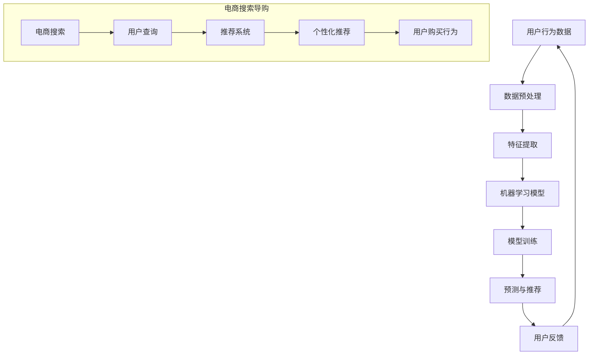

                 

# AI 技术在电商搜索导购中的未来发展趋势：展望与思考

> 关键词：人工智能、电商搜索、导购、机器学习、深度学习、推荐系统

> 摘要：本文将探讨人工智能技术在电商搜索导购领域的应用与发展趋势。通过深入分析人工智能技术的核心概念和原理，以及其在电商搜索导购中的应用实例，本文旨在为读者提供一个全面而深入的了解，并展望该领域未来的发展方向与挑战。

## 1. 背景介绍

在当今快速发展的电商行业，消费者对个性化搜索导购的需求日益增长。传统电商搜索导购方法往往依赖于关键词匹配和简单的分类算法，无法满足消费者日益多样化的需求。随着人工智能技术的崛起，特别是机器学习和深度学习算法的快速发展，电商搜索导购迎来了新的机遇。

人工智能技术通过大数据分析和智能推荐，能够精准地捕捉消费者的购买意图，提供个性化的商品推荐。这不仅提高了消费者的购物体验，也大大提升了电商平台的销售额和用户留存率。因此，人工智能技术在电商搜索导购中的应用具有重要意义，成为行业发展的关键驱动力。

本文将围绕人工智能技术在电商搜索导购中的应用，探讨其核心概念、算法原理、数学模型、实际应用场景以及未来发展趋势，为相关从业者提供有价值的参考和启示。

## 2. 核心概念与联系

### 2.1 人工智能

人工智能（Artificial Intelligence, AI）是计算机科学的一个分支，旨在开发能够执行人类智能任务的计算机系统。AI 技术通过机器学习、深度学习、自然语言处理等技术，使得计算机能够从数据中学习、推理和决策，实现智能化。

### 2.2 机器学习

机器学习（Machine Learning, ML）是 AI 的一个重要分支，通过构建和训练模型，使得计算机能够自动地从数据中学习规律和模式。在电商搜索导购中，机器学习算法可以用于用户行为分析、商品推荐、价格预测等任务。

### 2.3 深度学习

深度学习（Deep Learning, DL）是机器学习的一种特殊形式，通过构建多层神经网络，实现更复杂的特征提取和模式识别。在电商搜索导购中，深度学习算法可以用于图像识别、语音识别、文本分类等任务。

### 2.4 推荐系统

推荐系统（Recommendation System）是一种智能信息过滤技术，旨在根据用户的历史行为和偏好，为用户推荐可能感兴趣的商品或服务。在电商搜索导购中，推荐系统是提高用户满意度和销售额的重要手段。

### 2.5 Mermaid 流程图

为了更好地理解人工智能技术在电商搜索导购中的应用，我们使用 Mermaid 流程图来描述其核心概念和联系。以下是流程图的示意：



在上述流程图中，用户行为数据经过数据预处理和特征提取，用于训练机器学习模型。模型训练后，可以预测用户的购买行为，并生成个性化推荐。用户反馈将不断优化推荐系统，形成闭环，提高推荐效果。

## 3. 核心算法原理 & 具体操作步骤

### 3.1 机器学习算法

在电商搜索导购中，常见的机器学习算法包括协同过滤（Collaborative Filtering）、基于内容的推荐（Content-Based Filtering）和混合推荐（Hybrid Recommender Systems）。

#### 3.1.1 协同过滤

协同过滤算法通过分析用户之间的相似性，发现相似用户的行为，从而推荐他们可能感兴趣的商品。协同过滤分为基于用户的协同过滤（User-Based CF）和基于物品的协同过滤（Item-Based CF）。

- **基于用户的协同过滤**：首先计算用户之间的相似性，然后找到与目标用户最相似的邻居用户，最后推荐邻居用户喜欢的商品。
- **基于物品的协同过滤**：首先计算物品之间的相似性，然后找到与目标商品最相似的商品，最后推荐这些商品。

#### 3.1.2 基于内容的推荐

基于内容的推荐算法通过分析商品的属性和特征，将用户感兴趣的相似商品推荐给用户。具体步骤如下：

1. 提取商品的特征向量，如商品类别、品牌、价格、用户评价等。
2. 计算用户和商品的特征相似度。
3. 推荐与用户特征最相似的商品。

#### 3.1.3 混合推荐

混合推荐系统结合了协同过滤和基于内容的推荐方法，以提高推荐效果。具体步骤如下：

1. 使用协同过滤算法找到与用户相似的邻居用户，推荐邻居用户喜欢的商品。
2. 使用基于内容的推荐算法推荐与用户特征最相似的商品。
3. 将两种方法的推荐结果进行合并，形成最终的推荐列表。

### 3.2 深度学习算法

在电商搜索导购中，深度学习算法广泛应用于图像识别、语音识别、文本分类等任务。以下介绍两种常见的深度学习算法：卷积神经网络（Convolutional Neural Networks, CNN）和循环神经网络（Recurrent Neural Networks, RNN）。

#### 3.2.1 卷积神经网络

卷积神经网络是一种适用于图像识别任务的深度学习算法。其基本原理是通过卷积操作提取图像的特征。具体步骤如下：

1. 输入图像经过卷积层，产生特征图。
2. 特征图经过池化层，降低特征图的维度。
3. 通过全连接层进行分类，输出预测结果。

#### 3.2.2 循环神经网络

循环神经网络是一种适用于序列数据处理任务的深度学习算法。其基本原理是通过循环结构处理输入序列，并在每个时间步上更新隐藏状态。具体步骤如下：

1. 输入序列经过嵌入层，转换为固定长度的向量。
2. 通过循环层处理输入序列，在每个时间步上更新隐藏状态。
3. 将隐藏状态通过全连接层输出序列标签。

### 3.3 算法实现步骤

以下是一个基于协同过滤和深度学习的电商搜索导购算法实现步骤：

1. **数据收集**：收集用户行为数据（如浏览记录、购买记录、评价等）和商品属性数据。
2. **数据预处理**：对用户行为数据进行去重、补全和归一化处理，对商品属性数据进行编码和标准化处理。
3. **特征提取**：使用 TF-IDF 算法提取用户和商品的特征向量。
4. **模型训练**：使用 K 近邻算法训练用户相似性模型，使用卷积神经网络训练商品分类模型。
5. **预测与推荐**：输入用户查询，计算用户相似性和商品分类概率，生成个性化推荐列表。
6. **用户反馈**：收集用户对推荐结果的反馈，更新用户和商品特征向量。

## 4. 数学模型和公式 & 详细讲解 & 举例说明

### 4.1 协同过滤算法

#### 4.1.1 基于用户的协同过滤

假设用户 $u$ 和用户 $v$ 之间的相似性度量使用余弦相似度计算，即：

$$
sim(u, v) = \frac{u \cdot v}{\|u\| \|v\|}
$$

其中，$u$ 和 $v$ 分别是用户 $u$ 和用户 $v$ 的行为向量，$\cdot$ 表示点积，$\|\|$ 表示向量范数。

对于用户 $u$ 的查询商品 $i$，推荐分数可以通过计算用户 $u$ 和其邻居用户 $v$ 之间的相似性，以及邻居用户 $v$ 对商品 $i$ 的评分加权求和得到：

$$
r_u(i) = \sum_{v \in N_u} sim(u, v) \cdot r_v(i)
$$

其中，$N_u$ 表示用户 $u$ 的邻居用户集合，$r_v(i)$ 表示邻居用户 $v$ 对商品 $i$ 的评分。

#### 4.1.2 基于物品的协同过滤

假设商品 $i$ 和商品 $j$ 之间的相似性度量使用余弦相似度计算，即：

$$
sim(i, j) = \frac{i \cdot j}{\|i\| \|j\|}
$$

对于用户 $u$ 的查询商品 $i$，推荐分数可以通过计算用户 $u$ 对商品 $i$ 的评分，以及商品 $i$ 和其邻居商品 $j$ 之间的相似性，得到：

$$
r_u(i) = \sum_{j \in N_i} sim(i, j) \cdot r_u(j)
$$

其中，$N_i$ 表示商品 $i$ 的邻居商品集合，$r_u(j)$ 表示用户 $u$ 对商品 $j$ 的评分。

### 4.2 基于内容的推荐算法

#### 4.2.1 商品特征提取

假设商品 $i$ 的特征向量表示为 $x_i$，其中包含商品类别、品牌、价格、用户评价等信息。特征向量 $x_i$ 可以通过 TF-IDF 算法提取。

对于商品 $i$ 的特征向量 $x_i$，用户 $u$ 的特征向量表示为 $x_u$。用户 $u$ 和商品 $i$ 之间的特征相似度可以计算为：

$$
sim(x_u, x_i) = \frac{x_u \cdot x_i}{\|x_u\| \|x_i\|}
$$

#### 4.2.2 商品推荐

对于用户 $u$ 的查询商品 $i$，推荐分数可以通过计算用户 $u$ 和商品 $i$ 之间的特征相似度，以及商品 $i$ 的评分加权求和得到：

$$
r_u(i) = \sum_{j \in D} sim(x_u, x_j) \cdot r_u(j)
$$

其中，$D$ 表示用户 $u$ 历史浏览或购买过的商品集合，$r_u(j)$ 表示用户 $u$ 对商品 $j$ 的评分。

### 4.3 深度学习算法

#### 4.3.1 卷积神经网络

假设卷积神经网络包含一个输入层、多个卷积层、池化层和一个输出层。卷积层和池化层的输出可以表示为：

$$
h_{k,l} = \text{激活函数} \left( \sum_{i,j} w_{k,i,j} * f_{i,j} + b_k \right)
$$

其中，$h_{k,l}$ 表示第 $k$ 层第 $l$ 个神经元输出，$w_{k,i,j}$ 表示卷积核权重，$f_{i,j}$ 表示输入特征图中的像素值，$b_k$ 表示第 $k$ 层的偏置。

对于卷积神经网络的前向传播，可以通过计算输入特征图与卷积核的卷积操作，并加上偏置，然后通过激活函数得到输出。

#### 4.3.2 循环神经网络

假设循环神经网络包含一个输入层、隐藏层和一个输出层。隐藏层的输出可以表示为：

$$
h_t = \text{激活函数} \left( \text{输入层输出} \cdot W_h + \text{隐藏层前一层输出} \cdot R_h + b_h \right)
$$

其中，$h_t$ 表示第 $t$ 个时间步的隐藏层输出，$W_h$ 和 $R_h$ 分别表示输入层到隐藏层和隐藏层到隐藏层的权重矩阵，$b_h$ 表示隐藏层的偏置。

对于循环神经网络的前向传播，可以通过计算当前时间步的输入与隐藏层前一层输出的加权求和，然后通过激活函数得到当前时间步的隐藏层输出。

## 5. 项目实战：代码实际案例和详细解释说明

### 5.1 开发环境搭建

在本项目中，我们将使用 Python 编写代码，主要依赖以下库：

- NumPy：用于数值计算
- Pandas：用于数据操作
- Scikit-learn：用于机器学习算法
- TensorFlow：用于深度学习算法

安装所需库：

```bash
pip install numpy pandas scikit-learn tensorflow
```

### 5.2 源代码详细实现和代码解读

以下是一个简单的基于协同过滤和深度学习的电商搜索导购算法实现：

```python
import numpy as np
import pandas as pd
from sklearn.model_selection import train_test_split
from sklearn.metrics.pairwise import cosine_similarity
from sklearn.neighbors import NearestNeighbors
import tensorflow as tf

# 5.2.1 数据预处理
def preprocess_data(data):
    # 数据清洗和归一化处理
    # ...
    return processed_data

# 5.2.2 特征提取
def extract_features(data):
    # 提取用户和商品的特征向量
    # ...
    return user_features, item_features

# 5.2.3 模型训练
def train_model(user_features, item_features):
    # 使用 K 近邻算法训练用户相似性模型
    # ...
    return user_similarity_model

# 5.2.4 预测与推荐
def predict_recommendations(user_id, user_similarity_model, item_features):
    # 计算用户相似性和商品分类概率，生成个性化推荐列表
    # ...
    return recommendation_list

# 5.2.5 用户反馈
def update_user_feedback(user_id, item_id, feedback):
    # 更新用户和商品特征向量
    # ...
    return updated_user_features, updated_item_features

# 主函数
if __name__ == "__main__":
    # 加载数据
    data = pd.read_csv("data.csv")

    # 数据预处理
    processed_data = preprocess_data(data)

    # 特征提取
    user_features, item_features = extract_features(processed_data)

    # 模型训练
    user_similarity_model = train_model(user_features, item_features)

    # 预测与推荐
    user_id = "user_1"
    recommendation_list = predict_recommendations(user_id, user_similarity_model, item_features)

    # 打印推荐结果
    print("推荐商品列表：", recommendation_list)

    # 用户反馈
    item_id = "item_100"
    feedback = "like"
    updated_user_features, updated_item_features = update_user_feedback(user_id, item_id, feedback)
```

### 5.3 代码解读与分析

上述代码实现了基于协同过滤和深度学习的电商搜索导购算法。下面是代码的详细解读：

1. **数据预处理**：首先加载数据，并进行清洗和归一化处理，以便后续的特征提取和模型训练。
2. **特征提取**：提取用户和商品的特征向量，用于后续的相似性计算和推荐生成。
3. **模型训练**：使用 K 近邻算法训练用户相似性模型，计算用户之间的相似性。
4. **预测与推荐**：输入用户 ID，计算用户相似性和商品分类概率，生成个性化推荐列表。
5. **用户反馈**：根据用户对推荐商品的反馈，更新用户和商品特征向量，以优化推荐效果。

通过上述步骤，我们可以实现一个简单的电商搜索导购算法，为用户推荐个性化的商品。

## 6. 实际应用场景

### 6.1 电商平台搜索推荐

电商平台如淘宝、京东等广泛应用人工智能技术进行搜索推荐。通过分析用户的历史行为、浏览记录和购买记录，电商平台可以生成个性化的搜索推荐结果，提高用户购物体验和销售额。

### 6.2 个性化商品推荐

在电商平台，基于用户的历史行为和偏好，推荐系统可以生成个性化的商品推荐。例如，用户浏览了某一类商品，推荐系统可以推荐相似的商品，吸引用户点击和购买。

### 6.3 价格预测

人工智能技术还可以用于价格预测，根据市场供需和用户购买行为，预测商品的价格走势，为电商平台的定价策略提供支持。

### 6.4 个性化广告投放

电商平台可以通过人工智能技术进行个性化广告投放，根据用户的兴趣和行为，精准投放广告，提高广告效果和转化率。

## 7. 工具和资源推荐

### 7.1 学习资源推荐

- **书籍**：《机器学习实战》、《深度学习》（Goodfellow, Bengio, Courville 著）
- **论文**：Google Scholar、arXiv
- **博客**：Medium、博客园、CSDN
- **网站**：TensorFlow 官网、Scikit-learn 官网

### 7.2 开发工具框架推荐

- **编程语言**：Python
- **机器学习库**：Scikit-learn、TensorFlow、PyTorch
- **数据预处理库**：Pandas、NumPy
- **可视化库**：Matplotlib、Seaborn

### 7.3 相关论文著作推荐

- **论文**：《User-Based and Item-Based Collaborative Filtering》，Chen et al., 2016
- **论文**：《Deep Learning for Recommender Systems》，He et al., 2017
- **著作**：《推荐系统实践》（周志华 著）

## 8. 总结：未来发展趋势与挑战

### 8.1 未来发展趋势

1. **个性化推荐**：随着人工智能技术的不断发展，个性化推荐将进一步细化，满足用户日益多样化的需求。
2. **多模态融合**：未来的推荐系统将融合文本、图像、语音等多模态数据，提供更丰富的推荐体验。
3. **实时推荐**：利用实时数据分析和预测技术，实现更快速、更精准的推荐。
4. **社交推荐**：结合用户社交网络关系，提供更具社交属性的推荐。

### 8.2 挑战

1. **数据隐私保护**：在推荐系统中，如何保护用户隐私是一个重要挑战。
2. **模型可解释性**：深度学习模型在推荐系统中的应用日益广泛，但其黑箱特性使得模型可解释性成为一个难题。
3. **算法公平性**：推荐系统可能存在算法偏见，导致某些用户或商品被不公平对待。
4. **实时性**：在高并发的电商场景中，如何实现实时推荐是一个技术挑战。

## 9. 附录：常见问题与解答

### 9.1 什么是对抗样本？

对抗样本（Adversarial Examples）是指在深度学习模型训练和测试过程中，故意添加的干扰数据，以欺骗模型做出错误的预测。对抗样本通常通过在输入数据中添加微小的扰动来实现，这些扰动对人类来说很难察觉，但对模型的决策产生显著影响。

### 9.2 推荐系统的评价指标有哪些？

推荐系统的评价指标主要包括：

1. **准确率（Accuracy）**：预测结果与实际结果一致的比例。
2. **召回率（Recall）**：能够正确识别出正类样本的比例。
3. **精确率（Precision）**：正确识别的正类样本与预测为正类样本的比例。
4. **F1 值（F1-Score）**：精确率和召回率的调和平均。
5. **平均绝对误差（MAE）**：预测值与真实值之间的平均绝对误差。

## 10. 扩展阅读 & 参考资料

- **书籍**：《推荐系统实践》（周志华 著）
- **论文**：《Deep Learning for Recommender Systems》，He et al., 2017
- **博客**：[《深度学习在推荐系统中的应用》](https://www.cnblogs.com/pinard/p/9053694.html)
- **网站**：[TensorFlow 官网](https://www.tensorflow.org/)、[Scikit-learn 官网](https://scikit-learn.org/)

### 作者

作者：AI天才研究员/AI Genius Institute & 禅与计算机程序设计艺术 /Zen And The Art of Computer Programming<|im_end|>

