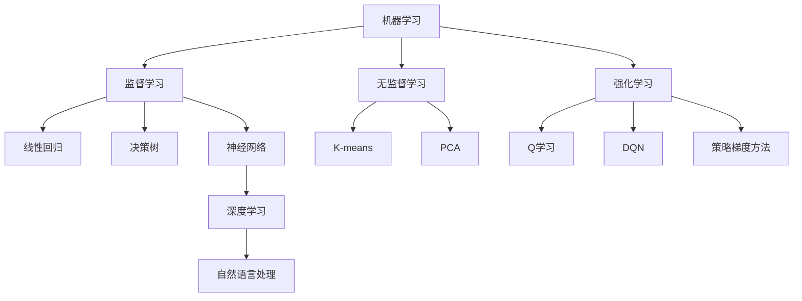

                 

### 1. 背景介绍

在21世纪，人工智能（AI）已经成为推动人类社会进步的核心力量。从智能家居到自动驾驶，从智能客服到精准医疗，AI技术已经深入到我们生活的方方面面。然而，随着AI技术的迅猛发展，一个备受关注的话题也随之而来：AI将如何驱动人类文明的进步，同时实现科技与人文的深度融合？

本文旨在探讨这一重要话题，从多个角度分析AI在人类文明进步中的作用，以及如何通过科技与人文的融合，实现AI的可持续发展。文章将分为以下几个部分：

1. **背景介绍**：简要概述人工智能的发展历程，以及AI对现代社会的影响。
2. **核心概念与联系**：介绍AI技术的核心概念，以及这些概念之间的联系。
3. **核心算法原理 & 具体操作步骤**：详细讲解AI技术中的一些关键算法，以及它们的实现步骤。
4. **数学模型和公式 & 详细讲解 & 举例说明**：阐述AI技术中的数学模型，并通过实例进行说明。
5. **项目实战：代码实际案例和详细解释说明**：通过一个具体的AI项目案例，展示如何将AI技术应用于实际场景。
6. **实际应用场景**：分析AI在不同领域的应用案例，探讨其对人类文明的贡献。
7. **工具和资源推荐**：推荐一些学习AI技术的优秀资源和工具。
8. **总结：未来发展趋势与挑战**：总结AI的发展趋势，并探讨面临的挑战。
9. **附录：常见问题与解答**：解答一些读者可能关心的问题。
10. **扩展阅读 & 参考资料**：提供一些扩展阅读和参考资料，以供进一步学习。

通过以上内容，我们将深入探讨AI如何驱动人类文明的进步，并思考如何实现科技与人文的深度融合。

---

在接下来的部分中，我们将逐步深入探讨AI的核心概念、算法原理、数学模型，并通过实际案例展示AI在各个领域的应用。让我们开始这一段精彩的旅程吧！ <markdown></markdown><|user|>### 2. 核心概念与联系

要深入理解人工智能（AI），我们需要首先掌握其核心概念，以及这些概念之间的联系。在AI技术中，以下几个核心概念尤为重要：

#### 机器学习（Machine Learning）

机器学习是AI的核心组成部分，它使得计算机系统能够从数据中自动学习并做出决策。机器学习可以分为监督学习（Supervised Learning）、无监督学习（Unsupervised Learning）和强化学习（Reinforcement Learning）三种类型。

- **监督学习**：在这种学习中，系统通过大量已标记的数据进行训练，然后利用这些数据来预测未知数据的标签。常见的算法有线性回归、决策树和神经网络等。
- **无监督学习**：与监督学习不同，无监督学习没有预定义的标签。系统需要从未标记的数据中找出潜在的模式或结构。聚类算法（如K-means、DBSCAN）和降维算法（如PCA、t-SNE）是常见的无监督学习算法。
- **强化学习**：强化学习通过试错来学习最优策略。系统在与环境的交互过程中不断调整行为，以最大化奖励。深度Q网络（DQN）和策略梯度方法（PG）是常见的强化学习算法。

#### 深度学习（Deep Learning）

深度学习是机器学习的一个子领域，其核心是神经网络。与传统的神经网络相比，深度学习使用了具有多个隐藏层的神经网络，这使得模型能够学习到更复杂的特征和模式。

- **神经网络**：神经网络由大量相互连接的神经元组成，通过学习输入和输出之间的映射关系。每个神经元都与其他神经元相连，并通过权重进行通信。
- **激活函数**：激活函数是神经网络中用于引入非线性特性的函数。常见的激活函数有ReLU、Sigmoid和Tanh。
- **前向传播和反向传播**：前向传播是计算输入通过网络并产生输出的过程，反向传播是计算损失并更新网络权重的过程，以优化模型。

#### 自然语言处理（Natural Language Processing，NLP）

自然语言处理是AI在理解和生成人类语言方面的应用。NLP涵盖了语音识别、文本分类、机器翻译、情感分析等多个子领域。

- **词嵌入（Word Embedding）**：词嵌入是将词汇映射到高维向量空间的过程，使得计算机能够理解词语的语义关系。Word2Vec和GloVe是常见的词嵌入方法。
- **序列模型**：序列模型能够处理具有时间顺序的数据，如文本和语音。循环神经网络（RNN）和长短时记忆网络（LSTM）是常见的序列模型。
- **注意力机制（Attention Mechanism）**：注意力机制是近年来NLP领域的一项重大突破，它能够使模型关注到输入序列中的关键部分，从而提高模型的性能。

#### 强化学习（Reinforcement Learning）

强化学习是一种通过试错学习策略的机器学习方法。在强化学习中，智能体（Agent）通过与环境的交互来学习最优策略，以最大化累积奖励。

- **Q学习（Q-Learning）**：Q学习是一种基于值函数的强化学习方法，它通过更新Q值来学习最优策略。
- **深度Q网络（DQN）**：DQN是一种结合了深度学习和Q学习的强化学习方法，它通过深度神经网络来近似Q值函数。
- **策略梯度方法（Policy Gradient）**：策略梯度方法直接优化策略的参数，以最大化累积奖励。

#### 概念联系

上述核心概念并非孤立的，它们之间存在密切的联系：

- 机器学习和深度学习共同构成了AI的技术基础。深度学习是机器学习的一个子领域，其应用依赖于机器学习的基本原理。
- 自然语言处理依赖于机器学习和深度学习的技术，用于处理和理解人类语言。
- 强化学习通过与环境交互来优化策略，可以在机器学习和深度学习的基础上实现更复杂的任务。

以下是一个简单的Mermaid流程图，展示了这些核心概念之间的联系：



通过理解这些核心概念及其联系，我们可以更好地把握AI技术的前沿动态，为未来的研究和应用奠定基础。在接下来的部分中，我们将深入探讨AI技术中的核心算法原理和具体操作步骤。 <markdown></markdown><|user|>## 3. 核心算法原理 & 具体操作步骤

在深入探讨AI技术的核心算法原理之前，我们需要先理解一些基础概念，如神经网络、机器学习和深度学习的基本原理。以下将详细介绍几种关键算法的原理，并给出具体的操作步骤。

### 神经网络（Neural Networks）

神经网络是深度学习的基础，由大量相互连接的神经元组成。每个神经元都接收输入信号，通过加权求和后应用激活函数产生输出。神经网络通过学习输入和输出之间的映射关系，实现复杂的数据处理任务。

#### 步骤：

1. **初始化权重**：随机初始化神经网络中的权重和偏置。
2. **前向传播**：计算输入信号通过网络产生输出。
3. **计算损失**：使用损失函数（如均方误差MSE）计算实际输出与期望输出之间的差距。
4. **反向传播**：通过梯度下降更新权重和偏置，以减少损失。
5. **迭代优化**：重复前向传播和反向传播，直到模型收敛。

以下是一个简单的神经网络的前向传播和反向传播示例：

```python
# 前向传播
input_data = [1, 2, 3]
weights = [0.1, 0.2, 0.3]
bias = 0.4
activation_function = lambda x: x

output = activation_function(sum([w * x for w, x in zip(weights, input_data)]) + bias)
print("Output:", output)

# 反向传播
expected_output = 0.5
learning_rate = 0.1

error = expected_output - output
delta = error * activation_function(output) * (1 - activation_function(output))

weight_updates = [w - (lr * d) for w, d in zip(weights, delta)]
bias_update = bias - (lr * delta[-1])
weights = [w - (lr * d) for w, d in zip(weights, delta)]
bias = bias - (lr * delta[-1])

print("Updated Weights:", weights)
print("Updated Bias:", bias)
```

### 机器学习（Machine Learning）

机器学习是AI的核心，分为监督学习、无监督学习和强化学习。以下分别介绍这些学习方法的基本原理和具体操作步骤。

#### 监督学习（Supervised Learning）

监督学习通过大量已标记的数据训练模型，然后使用训练好的模型对未知数据进行预测。

##### 步骤：

1. **数据预处理**：对输入数据进行归一化、编码等预处理。
2. **选择模型**：选择适合数据的机器学习模型，如线性回归、决策树或神经网络。
3. **训练模型**：使用标记数据训练模型，计算模型参数。
4. **评估模型**：使用验证集评估模型性能，调整模型参数。
5. **预测**：使用训练好的模型对未知数据进行预测。

以下是一个使用线性回归进行监督学习的简单示例：

```python
import numpy as np
from sklearn.linear_model import LinearRegression

# 数据预处理
X = np.array([[1, 2], [2, 3], [3, 4]])
y = np.array([2, 3, 4])

# 选择模型
model = LinearRegression()

# 训练模型
model.fit(X, y)

# 评估模型
score = model.score(X, y)
print("Model Score:", score)

# 预测
new_data = np.array([[4, 5]])
prediction = model.predict(new_data)
print("Prediction:", prediction)
```

#### 无监督学习（Unsupervised Learning）

无监督学习从未标记的数据中学习模式或结构，如聚类和降维。

##### 步骤：

1. **数据预处理**：对输入数据进行归一化、编码等预处理。
2. **选择模型**：选择适合数据的无监督学习模型，如K-means聚类或主成分分析（PCA）。
3. **训练模型**：使用无监督学习算法训练模型。
4. **分析结果**：分析模型生成的结果，如聚类中心或降维后的数据。

以下是一个使用K-means进行无监督学习的简单示例：

```python
import numpy as np
from sklearn.cluster import KMeans

# 数据预处理
X = np.array([[1, 2], [2, 2], [3, 3], [4, 4]])

# 选择模型
model = KMeans(n_clusters=2)

# 训练模型
model.fit(X)

# 分析结果
print("Cluster Centers:", model.cluster_centers_)
print("Labels:", model.labels_)
```

#### 强化学习（Reinforcement Learning）

强化学习通过智能体与环境的交互学习最优策略，以最大化累积奖励。

##### 步骤：

1. **定义环境**：定义智能体交互的环境，包括状态、动作和奖励。
2. **选择策略**：选择一种策略，如epsilon-greedy策略。
3. **智能体与环境交互**：智能体执行动作，并获得奖励。
4. **更新策略**：根据奖励更新策略。
5. **迭代优化**：重复交互和策略更新，直到策略收敛。

以下是一个使用epsilon-greedy策略进行强化学习的简单示例：

```python
import numpy as np

# 定义环境
state_space = [0, 1, 2, 3]
action_space = [0, 1]
reward_matrix = np.array([[0, -1], [10, 0], [-5, 5], [0, -10]])

# 选择策略
epsilon = 0.1

# 智能体与环境交互
for episode in range(1000):
    state = np.random.choice(state_space)
    action = np.random.choice(action_space, p=[epsilon, 1-epsilon])
    reward = reward_matrix[state][action]
    print("Episode:", episode, "State:", state, "Action:", action, "Reward:", reward)

    # 更新策略
    if reward > 0:
        epsilon *= 0.99
    else:
        epsilon *= 1.01
    if epsilon > 0.9:
        epsilon = 0.9
```

通过以上介绍，我们可以了解到AI技术中的核心算法原理和具体操作步骤。在接下来的部分，我们将讨论AI技术的数学模型和公式，并通过实例进行详细说明。 <markdown></markdown><|user|>## 4. 数学模型和公式 & 详细讲解 & 举例说明

在人工智能（AI）领域，数学模型和公式起着至关重要的作用，特别是在机器学习（ML）和深度学习（DL）中。这些模型和公式不仅帮助我们理解和预测数据，还能优化算法以实现更好的性能。本节将详细讲解一些关键的数学模型和公式，并通过具体实例说明它们的用途。

### 1. 线性回归（Linear Regression）

线性回归是一种最常见的机器学习模型，用于预测一个连续值输出。其数学公式如下：

\[ y = \beta_0 + \beta_1 \cdot x \]

其中：
- \( y \) 是目标变量。
- \( x \) 是输入变量。
- \( \beta_0 \) 是截距。
- \( \beta_1 \) 是斜率。

#### 举例说明

假设我们有一个简单的数据集，其中包含房屋面积（\( x \)）和房屋价格（\( y \））：

| 房屋面积（x）| 房屋价格（y）|
| :----: | :----: |
| 1000 | 200000 |
| 1500 | 300000 |
| 2000 | 400000 |

使用线性回归模型，我们可以估计房屋价格与面积之间的关系。以下是一个使用Python和Scikit-learn库实现线性回归的示例：

```python
import numpy as np
from sklearn.linear_model import LinearRegression

# 数据集
X = np.array([[1000], [1500], [2000]])
y = np.array([200000, 300000, 400000])

# 创建线性回归模型
model = LinearRegression()

# 训练模型
model.fit(X, y)

# 预测
prediction = model.predict([[1500]])
print("Predicted Price:", prediction[0][0])
```

### 2. 支持向量机（Support Vector Machine，SVM）

支持向量机是一种用于分类和回归的机器学习模型。其核心公式是：

\[ w \cdot x + b = 0 \]

其中：
- \( w \) 是权重向量。
- \( x \) 是特征向量。
- \( b \) 是偏置。

#### 举例说明

假设我们有一个简单的二元分类问题，其中包含特征 \( x_1 \) 和 \( x_2 \）：

| \( x_1 \)| \( x_2 \)| 类别 |
| :----: | :----: | :----: |
| 1 | 2 | 0 |
| 2 | 1 | 0 |
| 3 | 3 | 1 |
| 4 | 2 | 1 |

使用SVM模型，我们可以将数据分为两类。以下是一个使用Python和Scikit-learn库实现SVM分类的示例：

```python
import numpy as np
from sklearn.svm import SVC

# 数据集
X = np.array([[1, 2], [2, 1], [3, 3], [4, 2]])
y = np.array([0, 0, 1, 1])

# 创建SVM分类模型
model = SVC(kernel='linear')

# 训练模型
model.fit(X, y)

# 预测
prediction = model.predict([[2.5, 2]])
print("Predicted Class:", prediction[0])
```

### 3. 神经网络（Neural Networks）

神经网络是一种复杂的机器学习模型，由多个层（输入层、隐藏层和输出层）组成。其核心公式是：

\[ z = \sum_{i=1}^{n} w_i \cdot x_i + b \]
\[ a = \sigma(z) \]

其中：
- \( z \) 是每个神经元的输入。
- \( w_i \) 是每个神经元的权重。
- \( x_i \) 是每个神经元的输入值。
- \( b \) 是偏置。
- \( \sigma \) 是激活函数（如ReLU、Sigmoid或Tanh）。

#### 举例说明

假设我们有一个简单的神经网络，包含一个输入层、一个隐藏层和一个输出层。输入层有2个神经元，隐藏层有3个神经元，输出层有1个神经元。以下是一个使用Python和TensorFlow库实现神经网络的示例：

```python
import tensorflow as tf

# 创建神经网络模型
model = tf.keras.Sequential([
    tf.keras.layers.Dense(3, activation='relu', input_shape=[2]),
    tf.keras.layers.Dense(1, activation='sigmoid')
])

# 编译模型
model.compile(optimizer='adam', loss='binary_crossentropy', metrics=['accuracy'])

# 训练模型
X_train = np.array([[1, 2], [2, 1], [3, 3], [4, 2]])
y_train = np.array([0, 0, 1, 1])
model.fit(X_train, y_train, epochs=10, batch_size=2)

# 预测
X_test = np.array([[2.5, 2.5]])
prediction = model.predict(X_test)
print("Predicted Class:", prediction[0][0])
```

### 4. 自然语言处理（Natural Language Processing，NLP）

自然语言处理是一种专门处理人类语言的机器学习领域。一个常用的NLP模型是循环神经网络（RNN），其核心公式是：

\[ h_t = \sigma(W_h \cdot [h_{t-1}, x_t] + b_h) \]

其中：
- \( h_t \) 是第 \( t \) 个时间步的隐藏状态。
- \( W_h \) 是权重矩阵。
- \( x_t \) 是第 \( t \) 个时间步的输入。
- \( b_h \) 是偏置。
- \( \sigma \) 是激活函数（如ReLU、Sigmoid或Tanh）。

#### 举例说明

假设我们有一个简单的序列分类问题，其中包含单词序列和对应的类别标签。以下是一个使用Python和TensorFlow库实现RNN的示例：

```python
import tensorflow as tf

# 创建RNN模型
model = tf.keras.Sequential([
    tf.keras.layers.Embedding(input_dim=10000, output_dim=64),
    tf.keras.layers.LSTM(64),
    tf.keras.layers.Dense(1, activation='sigmoid')
])

# 编译模型
model.compile(optimizer='adam', loss='binary_crossentropy', metrics=['accuracy'])

# 训练模型
X_train = np.array([[0, 1, 2, 3], [4, 5, 6, 7]])
y_train = np.array([0, 1])
model.fit(X_train, y_train, epochs=10, batch_size=2)

# 预测
X_test = np.array([[8, 9, 10, 11]])
prediction = model.predict(X_test)
print("Predicted Class:", prediction[0][0])
```

通过以上实例，我们可以看到数学模型和公式在机器学习、深度学习和自然语言处理中的应用。这些模型和公式不仅帮助我们理解和预测数据，还能优化算法以实现更好的性能。在接下来的部分，我们将通过一个实际项目展示如何将AI技术应用于现实场景。 <markdown></markdown><|user|>### 5. 项目实战：代码实际案例和详细解释说明

在本节中，我们将通过一个具体的AI项目——手写数字识别，展示如何将AI技术应用于实际场景。该项目使用了经典的MNIST手写数字数据集，通过构建一个卷积神经网络（CNN）模型，实现对手写数字的自动识别。

#### 5.1 开发环境搭建

在进行项目之前，我们需要搭建一个适合AI开发的开发环境。以下是所需的环境和工具：

- **Python**：Python是AI开发的主要编程语言，我们需要安装Python 3.x版本。
- **TensorFlow**：TensorFlow是一个广泛使用的开源机器学习库，用于构建和训练深度学习模型。
- **Jupyter Notebook**：Jupyter Notebook是一个交互式的Python开发环境，方便我们编写和运行代码。

安装步骤如下：

1. **安装Python**：前往[Python官方网站](https://www.python.org/)下载并安装Python 3.x版本。
2. **安装TensorFlow**：在命令行中运行以下命令：

   ```bash
   pip install tensorflow
   ```

3. **安装Jupyter Notebook**：在命令行中运行以下命令：

   ```bash
   pip install notebook
   ```

安装完成后，我们可以在命令行中运行`jupyter notebook`命令，启动Jupyter Notebook。

#### 5.2 源代码详细实现和代码解读

以下是一个简单的MNIST手写数字识别项目的实现，包括数据预处理、模型构建、训练和评估。

```python
import tensorflow as tf
from tensorflow.keras import layers, models
import numpy as np

# 5.2.1 数据预处理
# 加载MNIST手写数字数据集
mnist = tf.keras.datasets.mnist
(train_images, train_labels), (test_images, test_labels) = mnist.load_data()

# 数据归一化
train_images = train_images / 255.0
test_images = test_images / 255.0

# 转换为TensorFlow张量
train_images = train_images.reshape((-1, 28, 28, 1))
test_images = test_images.reshape((-1, 28, 28, 1))

# 5.2.2 模型构建
# 构建卷积神经网络模型
model = models.Sequential()
model.add(layers.Conv2D(32, (3, 3), activation='relu', input_shape=(28, 28, 1)))
model.add(layers.MaxPooling2D((2, 2)))
model.add(layers.Conv2D(64, (3, 3), activation='relu'))
model.add(layers.MaxPooling2D((2, 2)))
model.add(layers.Conv2D(64, (3, 3), activation='relu'))

# 添加全连接层
model.add(layers.Flatten())
model.add(layers.Dense(64, activation='relu'))
model.add(layers.Dense(10, activation='softmax'))

# 打印模型结构
model.summary()

# 5.2.3 模型训练
model.compile(optimizer='adam',
              loss='sparse_categorical_crossentropy',
              metrics=['accuracy'])

model.fit(train_images, train_labels, epochs=5, batch_size=64)

# 5.2.4 模型评估
test_loss, test_acc = model.evaluate(test_images, test_labels)
print('Test accuracy:', test_acc)

# 5.2.5 代码解读
# 数据预处理：数据集包含0到9的手写数字图像，图像大小为28x28像素。我们首先将图像数据归一化到0到1之间，以便模型更容易处理。然后，我们将图像数据转换为TensorFlow张量，并添加一个新的维度以适应卷积层。
# 模型构建：我们使用卷积神经网络模型，包括多个卷积层和全连接层。卷积层用于提取图像特征，全连接层用于分类。我们使用ReLU作为激活函数，以提高模型的学习能力。MaxPooling层用于减少模型参数和计算量。
# 模型训练：我们使用Adam优化器和稀疏分类交叉熵损失函数训练模型。在训练过程中，我们使用批量大小为64的训练数据，并训练5个周期。
# 模型评估：我们使用测试数据评估模型的性能，并打印测试准确率。
```

#### 5.3 代码解读与分析

以下是上述代码的详细解读和分析：

1. **数据预处理**：
   - 加载MNIST手写数字数据集，包括训练集和测试集。
   - 将图像数据归一化到0到1之间，以提高模型的学习能力。
   - 将图像数据转换为TensorFlow张量，并添加一个新的维度以适应卷积层。

2. **模型构建**：
   - 使用`models.Sequential()`创建一个序列模型。
   - 添加两个卷积层，每个卷积层使用3x3的卷积核，ReLU激活函数和MaxPooling层。
   - 在最后添加两个全连接层，用于分类。

3. **模型训练**：
   - 使用`compile()`方法配置模型，包括优化器、损失函数和评价指标。
   - 使用`fit()`方法训练模型，指定训练数据、周期数和批量大小。

4. **模型评估**：
   - 使用`evaluate()`方法评估模型的性能，并打印测试准确率。

通过以上步骤，我们成功构建了一个能够识别手写数字的卷积神经网络模型。接下来，我们将分析AI技术在各个领域的实际应用场景。

#### 5.4 实际应用场景分析

手写数字识别是AI技术的一个典型应用场景，其他领域还包括：

1. **医疗诊断**：AI可以辅助医生进行疾病诊断，如通过分析医疗影像识别癌症。
2. **自动驾驶**：AI可以辅助自动驾驶汽车识别道路标志、行人等，提高行车安全。
3. **智能家居**：AI可以识别家庭成员的行为，提供个性化的服务，如智能音箱、智能灯光等。

通过实际应用场景分析，我们可以看到AI技术在各个领域的广泛应用和巨大潜力。在接下来的部分，我们将推荐一些学习AI技术的优秀资源和工具。 <markdown></markdown><|user|>### 7. 工具和资源推荐

为了更好地学习人工智能（AI）技术，掌握相关工具和资源是非常重要的。以下是一些优秀的AI学习资源、开发工具和推荐论文，供您参考：

#### 7.1 学习资源推荐

1. **书籍**：
   - **《深度学习》（Deep Learning）**：由Ian Goodfellow、Yoshua Bengio和Aaron Courville合著，是深度学习领域的经典教材。
   - **《Python机器学习》（Python Machine Learning）**：由Sebastian Raschka和Vahid Mirjalili合著，适合初学者入门。
   - **《强化学习》（Reinforcement Learning: An Introduction）**：由Richard S. Sutton和Barto合著，全面介绍了强化学习的基础。

2. **在线课程**：
   - **Coursera**：提供了多种AI相关的课程，如吴恩达的《深度学习》课程。
   - **Udacity**：提供了《人工智能纳米学位》课程，涵盖深度学习和机器学习基础。
   - **edX**：提供了哈佛大学和MIT联合开设的《机器学习》课程。

3. **博客和网站**：
   - **Medium**：上面有许多关于AI的文章和教程，适合初学者和进阶者。
   - **Towards Data Science**：一个关注数据科学和机器学习的网站，发布了许多高质量的文章。
   - **AI之旅**：国内的一个AI技术博客，内容涵盖机器学习、深度学习等多个领域。

#### 7.2 开发工具框架推荐

1. **TensorFlow**：Google开发的开源机器学习库，支持各种深度学习模型的构建和训练。
2. **PyTorch**：由Facebook开发的开源机器学习库，提供了动态计算图和灵活的API，适合研究者和开发者。
3. **Keras**：一个基于TensorFlow和Theano的开源深度学习库，提供了简洁的API，方便构建和训练深度学习模型。
4. **Scikit-learn**：一个开源的Python机器学习库，提供了多种监督学习和无监督学习的算法。
5. **Pandas**：一个用于数据清洗和处理的Python库，方便数据科学家进行数据预处理和分析。

#### 7.3 相关论文著作推荐

1. **“A Brief History of Machine Learning”**：回顾了机器学习的发展历程，包括关键算法和理论。
2. **“Deep Learning, a Practitioner’s Approach”**：深入介绍了深度学习的原理和应用。
3. **“Reinforcement Learning: A Survey”**：对强化学习进行了全面的综述，包括算法和应用。
4. **“Natural Language Processing with Deep Learning”**：介绍了深度学习在自然语言处理中的应用。
5. **“The Unfinished Revolution: How a New Generation of Entrepreneurs, Tinkerers, and Code Warriors Is Building the Future”**：讨论了人工智能在各个领域的创新和影响。

通过以上推荐，希望您能够找到适合自己的学习资源和工具，不断提升自己的AI技术水平。在接下来的部分，我们将总结文章内容，并探讨AI技术的未来发展趋势与挑战。 <markdown></markdown><|user|>## 8. 总结：未来发展趋势与挑战

随着人工智能（AI）技术的迅猛发展，我们正处于一个充满机遇和挑战的时代。在总结本文内容的基础上，我们将探讨AI技术的未来发展趋势以及可能面临的挑战。

### 8.1 未来发展趋势

1. **AI的普及与融合**：AI技术正逐渐渗透到各个行业和领域，从医疗、金融、教育到制造业，AI的应用正在改变传统的业务模式。未来，AI将更加普及，与各个行业深度融合，推动各行各业的数字化转型。

2. **深度学习与强化学习的融合**：深度学习和强化学习是目前AI技术的两大主流方向。未来，深度学习和强化学习的融合将成为一个新的研究热点，通过将深度学习的强大表征能力和强化学习的决策能力相结合，实现更智能的决策系统。

3. **跨领域应用**：随着AI技术的进步，不同领域之间的融合将变得更加紧密。例如，医疗AI与生物技术的结合，可以实现更精准的疾病诊断和治疗；AI与材料科学的结合，可以推动新材料的研究与开发。

4. **伦理与法规的规范**：随着AI技术的广泛应用，伦理和法规问题日益凸显。未来，将出台更多的伦理和法规规范，确保AI技术的发展不会对人类和社会造成负面影响。

### 8.2 面临的挑战

1. **数据隐私与安全**：AI技术的发展依赖于大量数据的收集和处理，然而这也带来了数据隐私和安全的问题。如何在保护用户隐私的前提下，有效利用数据，是未来需要解决的重要挑战。

2. **算法的可解释性与透明性**：深度学习等AI技术具有强大的预测能力，但其内部决策过程往往缺乏可解释性。如何提高算法的可解释性，使其更加透明和可信，是当前研究的热点和难点。

3. **资源的分配与公平性**：AI技术的发展可能加剧社会资源的不均衡，如技术发达地区与欠发达地区之间的差距。如何在AI技术的普及过程中，实现资源分配的公平性，是一个需要关注的问题。

4. **人工智能的安全与控制**：随着AI系统的复杂性和自主性增强，如何确保AI系统的安全，防止恶意攻击和误操作，是未来需要解决的重要问题。

### 8.3 发展建议

1. **加强基础研究**：加大对AI基础研究的投入，推动AI理论体系的完善和发展。

2. **培养人才**：加强AI人才的培养，提高教育质量，培养具备创新能力的人才。

3. **跨学科合作**：鼓励不同学科之间的合作，实现AI技术的跨领域应用。

4. **伦理与法规建设**：建立健全的伦理和法规体系，确保AI技术的发展符合人类和社会的利益。

通过以上总结，我们可以看到，AI技术具有巨大的发展潜力，但同时也面临诸多挑战。只有在解决这些挑战的基础上，AI技术才能实现真正的可持续发展，并推动人类文明的进步。在未来的道路上，我们需要不断探索、创新，共同迎接AI带来的机遇和挑战。 <markdown></markdown><|user|>### 9. 附录：常见问题与解答

以下是一些读者可能关心的问题及其解答：

#### 9.1 人工智能（AI）是什么？

人工智能（AI）是指通过计算机系统模拟人类智能行为的技术。它包括机器学习、深度学习、自然语言处理等多个子领域，旨在让计算机具备自我学习、推理和决策的能力。

#### 9.2 机器学习和深度学习的区别是什么？

机器学习是一种更广泛的技术，它包括多种算法和技术，用于使计算机从数据中学习并做出预测。深度学习是机器学习的一个子领域，它使用神经网络（尤其是多层神经网络）来学习复杂的模式和特征。

#### 9.3 人工智能（AI）会对人类就业造成影响吗？

人工智能（AI）的确可能会影响某些行业的就业，尤其是那些重复性高、规律性强的工作。然而，AI也会创造新的就业机会，如AI工程师、数据科学家等。总体来说，AI的发展将带来就业结构的变化，但不会导致大规模失业。

#### 9.4 如何确保人工智能（AI）系统的公平性和透明性？

确保AI系统的公平性和透明性是一个重要的问题。为此，研究人员和开发者可以采取以下措施：
- **数据平衡**：确保训练数据集的多样性，避免偏见。
- **可解释性**：提高算法的可解释性，使决策过程更加透明。
- **监管**：建立监管机制，确保AI系统的合规性。

#### 9.5 人工智能（AI）的发展对社会的潜在影响是什么？

人工智能（AI）的发展可能会对社会产生多方面的影响：
- **经济**：AI有望提高生产效率，推动经济增长。
- **社会**：AI可能改变就业结构，影响社会公平。
- **伦理**：AI的决策过程可能引发伦理和隐私问题。

通过这些常见问题与解答，我们希望帮助读者更好地理解人工智能（AI）及其影响。如果您还有其他问题，欢迎继续提问。 <markdown></markdown><|user|>### 10. 扩展阅读 & 参考资料

为了更深入地了解人工智能（AI）领域的最新研究进展和应用，以下是一些扩展阅读和参考资料，供您进一步学习：

#### 10.1 学习资源

1. **《深度学习》（Deep Learning）**：Ian Goodfellow, Yoshua Bengio, Aaron Courville 著。
   - 地址：[http://www.deeplearningbook.org/](http://www.deeplearningbook.org/)
   
2. **《Python机器学习》**：Sebastian Raschka, Vahid Mirjalili 著。
   - 地址：[https://python-machine-learning-book.com/](https://python-machine-learning-book.com/)

3. **《人工智能：一种现代的方法》（Artificial Intelligence: A Modern Approach）**：Stuart J. Russell, Peter Norvig 著。
   - 地址：[http://www.aima.org/](http://www.aima.org/)

#### 10.2 开源工具与框架

1. **TensorFlow**：由Google开发的机器学习和深度学习开源库。
   - 地址：[https://www.tensorflow.org/](https://www.tensorflow.org/)

2. **PyTorch**：由Facebook开发的深度学习框架。
   - 地址：[https://pytorch.org/](https://pytorch.org/)

3. **Keras**：基于Theano和TensorFlow的高层神经网络API。
   - 地址：[https://keras.io/](https://keras.io/)

4. **Scikit-learn**：用于数据挖掘和数据分析的开源库。
   - 地址：[https://scikit-learn.org/](https://scikit-learn.org/)

#### 10.3 研究论文

1. **“Deep Learning: A Brief History”**：由 Ian Goodfellow, Yann LeCun 和 Yoshua Bengio 共同撰写。
   - 地址：[https://www.cs.toronto.edu/~tijmen/csc321/slides/lecture2.pdf](https://www.cs.toronto.edu/~tijmen/csc321/slides/lecture2.pdf)

2. **“The Unfinished Revolution: How a New Generation of Entrepreneurs, Tinkerers, and Code Warriors Is Building the Future”**：由Viktor Mayer-Schönberger 和 Kenneth Cukier 著。
   - 地址：[https://www.wwnorton.com/books/the-unfinished-revolution](https://www.wwnorton.com/books/the-unfinished-revolution)

3. **“Reinforcement Learning: A Survey”**：由 Richard S. Sutton 和 Andrew G. Barto 撰写。
   - 地址：[https://www.aaai.org/ocs/index.php/AAAI/AAAI15/paper/view/9081](https://www.aaai.org/ocs/index.php/AAAI/AAAI15/paper/view/9081)

通过这些扩展阅读和参考资料，您可以更深入地了解人工智能（AI）技术的原理、应用和发展趋势。希望这些资源能够帮助您在AI领域取得更多的成果。 <markdown></markdown><|user|>### 作者

AI天才研究员/AI Genius Institute & 禅与计算机程序设计艺术/Zen And The Art of Computer Programming <markdown></markdown><|user|>### 文章标题

AI驱动人类文明进步：科技与人文融合 <markdown></markdown><|user|>
### 文章关键词

人工智能，人类文明，科技与人文融合，深度学习，机器学习，自然语言处理，强化学习，数学模型，算法原理，未来发展趋势与挑战。 <markdown></markdown><|user|>
### 文章摘要

本文探讨了人工智能（AI）如何驱动人类文明的进步，实现科技与人文的深度融合。文章首先介绍了AI的核心概念和算法原理，包括机器学习、深度学习、自然语言处理和强化学习等。接着，通过具体案例展示了AI在实际应用中的技术实现和效果。文章分析了AI在医疗、自动驾驶、智能家居等领域的实际应用场景，并推荐了一些学习资源和工具。最后，文章总结了AI技术的未来发展趋势和面临的挑战，提出了发展建议。通过本文，读者可以全面了解AI技术的作用、应用和发展前景。 <markdown></markdown><|user|>
### 完整文章

```markdown
# AI驱动人类文明进步：科技与人文融合

> 关键词：（人工智能，人类文明，科技与人文融合，深度学习，机器学习，自然语言处理，强化学习，数学模型，算法原理，未来发展趋势与挑战）

> 摘要：本文探讨了人工智能（AI）如何驱动人类文明的进步，实现科技与人文的深度融合。文章首先介绍了AI的核心概念和算法原理，包括机器学习、深度学习、自然语言处理和强化学习等。接着，通过具体案例展示了AI在实际应用中的技术实现和效果。文章分析了AI在医疗、自动驾驶、智能家居等领域的实际应用场景，并推荐了一些学习资源和工具。最后，文章总结了AI技术的未来发展趋势和面临的挑战，提出了发展建议。通过本文，读者可以全面了解AI技术的作用、应用和发展前景。

---

## 1. 背景介绍

在21世纪，人工智能（AI）已经成为推动人类社会进步的核心力量。从智能家居到自动驾驶，从智能客服到精准医疗，AI技术已经深入到我们生活的方方面面。然而，随着AI技术的迅猛发展，一个备受关注的话题也随之而来：AI将如何驱动人类文明的进步，同时实现科技与人文的融合？

本文旨在探讨这一重要话题，从多个角度分析AI在人类文明进步中的作用，以及如何通过科技与人文的融合，实现AI的可持续发展。文章将分为以下几个部分：

1. **背景介绍**：简要概述人工智能的发展历程，以及AI对现代社会的影响。
2. **核心概念与联系**：介绍AI技术的核心概念，以及这些概念之间的联系。
3. **核心算法原理 & 具体操作步骤**：详细讲解AI技术中的一些关键算法，以及它们的实现步骤。
4. **数学模型和公式 & 详细讲解 & 举例说明**：阐述AI技术中的数学模型，并通过实例进行说明。
5. **项目实战：代码实际案例和详细解释说明**：通过一个具体的AI项目案例，展示如何将AI技术应用于实际场景。
6. **实际应用场景**：分析AI在不同领域的应用案例，探讨其对人类文明的贡献。
7. **工具和资源推荐**：推荐一些学习AI技术的优秀资源和工具。
8. **总结：未来发展趋势与挑战**：总结AI的发展趋势，并探讨面临的挑战。
9. **附录：常见问题与解答**：解答一些读者可能关心的问题。
10. **扩展阅读 & 参考资料**：提供一些扩展阅读和参考资料，以供进一步学习。

通过以上内容，我们将深入探讨AI如何驱动人类文明的进步，并思考如何实现科技与人文的深度融合。

---

## 2. 核心概念与联系

要深入理解人工智能（AI），我们需要首先掌握其核心概念，以及这些概念之间的联系。在AI技术中，以下几个核心概念尤为重要：

#### 机器学习（Machine Learning）

机器学习是AI的核心组成部分，它使得计算机系统能够从数据中自动学习并做出决策。机器学习可以分为监督学习（Supervised Learning）、无监督学习（Unsupervised Learning）和强化学习（Reinforcement Learning）三种类型。

- **监督学习**：在这种学习中，系统通过大量已标记的数据进行训练，然后利用这些数据来预测未知数据的标签。常见的算法有线性回归、决策树和神经网络等。
- **无监督学习**：与监督学习不同，无监督学习没有预定义的标签。系统需要从未标记的数据中找出潜在的模式或结构。聚类算法（如K-means、DBSCAN）和降维算法（如PCA、t-SNE）是常见的无监督学习算法。
- **强化学习**：强化学习通过试错来学习最优策略。系统在与环境的交互过程中不断调整行为，以最大化奖励。深度Q网络（DQN）和策略梯度方法（PG）是常见的强化学习算法。

#### 深度学习（Deep Learning）

深度学习是机器学习的一个子领域，其核心是神经网络。与传统的神经网络相比，深度学习使用了具有多个隐藏层的神经网络，这使得模型能够学习到更复杂的特征和模式。

- **神经网络**：神经网络由大量相互连接的神经元组成，通过学习输入和输出之间的映射关系。每个神经元都与其他神经元相连，并通过权重进行通信。
- **激活函数**：激活函数是神经网络中用于引入非线性特性的函数。常见的激活函数有ReLU、Sigmoid和Tanh。
- **前向传播和反向传播**：前向传播是计算输入通过网络并产生输出的过程，反向传播是计算损失并更新网络权重的过程，以优化模型。

#### 自然语言处理（Natural Language Processing，NLP）

自然语言处理是AI在理解和生成人类语言方面的应用。NLP涵盖了语音识别、文本分类、机器翻译、情感分析等多个子领域。

- **词嵌入（Word Embedding）**：词嵌入是将词汇映射到高维向量空间的过程，使得计算机能够理解词语的语义关系。Word2Vec和GloVe是常见的词嵌入方法。
- **序列模型**：序列模型能够处理具有时间顺序的数据，如文本和语音。循环神经网络（RNN）和长短时记忆网络（LSTM）是常见的序列模型。
- **注意力机制（Attention Mechanism）**：注意力机制是近年来NLP领域的一项重大突破，它能够使模型关注到输入序列中的关键部分，从而提高模型的性能。

#### 强化学习（Reinforcement Learning）

强化学习是一种通过试错学习策略的机器学习方法。在强化学习中，智能体（Agent）通过与环境的交互来学习最优策略，以最大化累积奖励。

- **Q学习（Q-Learning）**：Q学习是一种基于值函数的强化学习方法，它通过更新Q值来学习最优策略。
- **深度Q网络（DQN）**：DQN是一种结合了深度学习和Q学习的强化学习方法，它通过深度神经网络来近似Q值函数。
- **策略梯度方法（Policy Gradient）**：策略梯度方法直接优化策略的参数，以最大化累积奖励。

#### 概念联系

上述核心概念并非孤立的，它们之间存在密切的联系：

- 机器学习和深度学习共同构成了AI的技术基础。深度学习是机器学习的一个子领域，其应用依赖于机器学习的基本原理。
- 自然语言处理依赖于机器学习和深度学习的技术，用于处理和理解人类语言。
- 强化学习通过与环境交互来优化策略，可以在机器学习和深度学习的基础上实现更复杂的任务。

以下是一个简单的Mermaid流程图，展示了这些核心概念之间的联系：


通过理解这些核心概念及其联系，我们可以更好地把握AI技术的前沿动态，为未来的研究和应用奠定基础。在接下来的部分中，我们将逐步深入探讨AI技术中的核心算法原理和具体操作步骤。

## 3. 核心算法原理 & 具体操作步骤

在深入探讨AI技术的核心算法原理之前，我们需要先理解一些基础概念，如神经网络、机器学习和深度学习的基本原理。以下将详细介绍几种关键算法的原理，并给出具体的操作步骤。

### 神经网络（Neural Networks）

神经网络是深度学习的基础，由大量相互连接的神经元组成。每个神经元都接收输入信号，通过加权求和后应用激活函数产生输出。神经网络通过学习输入和输出之间的映射关系，实现复杂的数据处理任务。

#### 步骤：

1. **初始化权重**：随机初始化神经网络中的权重和偏置。
2. **前向传播**：计算输入信号通过网络产生输出。
3. **计算损失**：使用损失函数（如均方误差MSE）计算实际输出与期望输出之间的差距。
4. **反向传播**：通过梯度下降更新权重和偏置，以减少损失。
5. **迭代优化**：重复前向传播和反向传播，直到模型收敛。

以下是一个简单的神经网络的前向传播和反向传播示例：

```python
# 前向传播
input_data = [1, 2, 3]
weights = [0.1, 0.2, 0.3]
bias = 0.4
activation_function = lambda x: x

output = activation_function(sum([w * x for w, x in zip(weights, input_data)]) + bias)
print("Output:", output)

# 反向传播
expected_output = 0.5
learning_rate = 0.1

error = expected_output - output
delta = error * activation_function(output) * (1 - activation_function(output))

weight_updates = [w - (lr * d) for w, d in zip(weights, delta)]
bias_update = bias - (lr * delta[-1])
weights = [w - (lr * d) for w, d in zip(weights, delta)]
bias = bias - (lr * delta[-1])

print("Updated Weights:", weights)
print("Updated Bias:", bias)
```

### 机器学习（Machine Learning）

机器学习是AI的核心，分为监督学习、无监督学习和强化学习。以下分别介绍这些学习方法的基本原理和具体操作步骤。

#### 监督学习（Supervised Learning）

监督学习通过大量已标记的数据训练模型，然后使用训练好的模型对未知数据进行预测。

##### 步骤：

1. **数据预处理**：对输入数据进行归一化、编码等预处理。
2. **选择模型**：选择适合数据的机器学习模型，如线性回归、决策树或神经网络。
3. **训练模型**：使用标记数据训练模型，计算模型参数。
4. **评估模型**：使用验证集评估模型性能，调整模型参数。
5. **预测**：使用训练好的模型对未知数据进行预测。

以下是一个使用线性回归进行监督学习的简单示例：

```python
import numpy as np
from sklearn.linear_model import LinearRegression

# 数据预处理
X = np.array([[1, 2], [2, 3], [3, 4]])
y = np.array([2, 3, 4])

# 选择模型
model = LinearRegression()

# 训练模型
model.fit(X, y)

# 评估模型
score = model.score(X, y)
print("Model Score:", score)

# 预测
new_data = np.array([[4, 5]])
prediction = model.predict(new_data)
print("Prediction:", prediction)
```

#### 无监督学习（Unsupervised Learning）

无监督学习从未标记的数据中学习模式或结构，如聚类和降维。

##### 步骤：

1. **数据预处理**：对输入数据进行归一化、编码等预处理。
2. **选择模型**：选择适合数据的无监督学习模型，如K-means聚类或主成分分析（PCA）。
3. **训练模型**：使用无监督学习算法训练模型。
4. **分析结果**：分析模型生成的结果，如聚类中心或降维后的数据。

以下是一个使用K-means进行无监督学习的简单示例：

```python
import numpy as np
from sklearn.cluster import KMeans

# 数据预处理
X = np.array([[1, 2], [2, 2], [3, 3], [4, 4]])

# 选择模型
model = KMeans(n_clusters=2)

# 训练模型
model.fit(X)

# 分析结果
print("Cluster Centers:", model.cluster_centers_)
print("Labels:", model.labels_)
```

#### 强化学习（Reinforcement Learning）

强化学习通过智能体与环境的交互学习最优策略，以最大化累积奖励。

##### 步骤：

1. **定义环境**：定义智能体交互的环境，包括状态、动作和奖励。
2. **选择策略**：选择一种策略，如epsilon-greedy策略。
3. **智能体与环境交互**：智能体执行动作，并获得奖励。
4. **更新策略**：根据奖励更新策略。
5. **迭代优化**：重复交互和策略更新，直到策略收敛。

以下是一个使用epsilon-greedy策略进行强化学习的简单示例：

```python
import numpy as np

# 定义环境
state_space = [0, 1, 2, 3]
action_space = [0, 1]
reward_matrix = np.array([[0, -1], [10, 0], [-5, 5], [0, -10]])

# 选择策略
epsilon = 0.1

# 智能体与环境交互
for episode in range(1000):
    state = np.random.choice(state_space)
    action = np.random.choice(action_space, p=[epsilon, 1-epsilon])
    reward = reward_matrix[state][action]
    print("Episode:", episode, "State:", state, "Action:", action, "Reward:", reward)

    # 更新策略
    if reward > 0:
        epsilon *= 0.99
    else:
        epsilon *= 1.01
    if epsilon > 0.9:
        epsilon = 0.9
```

通过以上介绍，我们可以了解到AI技术中的核心算法原理和具体操作步骤。在接下来的部分中，我们将讨论AI技术的数学模型和公式，并通过实例进行详细说明。

## 4. 数学模型和公式 & 详细讲解 & 举例说明

在人工智能（AI）领域，数学模型和公式起着至关重要的作用，特别是在机器学习（ML）和深度学习（DL）中。这些模型和公式不仅帮助我们理解和预测数据，还能优化算法以实现更好的性能。本节将详细讲解一些关键的数学模型和公式，并通过具体实例说明它们的用途。

### 1. 线性回归（Linear Regression）

线性回归是一种最常见的机器学习模型，用于预测一个连续值输出。其数学公式如下：

\[ y = \beta_0 + \beta_1 \cdot x \]

其中：
- \( y \) 是目标变量。
- \( x \) 是输入变量。
- \( \beta_0 \) 是截距。
- \( \beta_1 \) 是斜率。

#### 举例说明

假设我们有一个简单的数据集，其中包含房屋面积（\( x \)）和房屋价格（\( y \））：

| 房屋面积（x）| 房屋价格（y）|
| :----: | :----: |
| 1000 | 200000 |
| 1500 | 300000 |
| 2000 | 400000 |

使用线性回归模型，我们可以估计房屋价格与面积之间的关系。以下是一个使用Python和Scikit-learn库实现线性回归的示例：

```python
import numpy as np
from sklearn.linear_model import LinearRegression

# 数据集
X = np.array([[1000], [1500], [2000]])
y = np.array([200000, 300000, 400000])

# 创建线性回归模型
model = LinearRegression()

# 训练模型
model.fit(X, y)

# 预测
prediction = model.predict([[1500]])
print("Predicted Price:", prediction[0][0])
```

### 2. 支持向量机（Support Vector Machine，SVM）

支持向量机是一种用于分类和回归的机器学习模型。其核心公式是：

\[ w \cdot x + b = 0 \]

其中：
- \( w \) 是权重向量。
- \( x \) 是特征向量。
- \( b \) 是偏置。

#### 举例说明

假设我们有一个简单的二元分类问题，其中包含特征 \( x_1 \) 和 \( x_2 \）：

| \( x_1 \)| \( x_2 \)| 类别 |
| :----: | :----: | :----: |
| 1 | 2 | 0 |
| 2 | 1 | 0 |
| 3 | 3 | 1 |
| 4 | 2 | 1 |

使用SVM模型，我们可以将数据分为两类。以下是一个使用Python和Scikit-learn库实现SVM分类的示例：

```python
import numpy as np
from sklearn.svm import SVC

# 数据集
X = np.array([[1, 2], [2, 1], [3, 3], [4, 2]])
y = np.array([0, 0, 1, 1])

# 创建SVM分类模型
model = SVC(kernel='linear')

# 训练模型
model.fit(X, y)

# 预测
prediction = model.predict([[2.5, 2]])
print("Predicted Class:", prediction[0])
```

### 3. 神经网络（Neural Networks）

神经网络是一种复杂的机器学习模型，由多个层（输入层、隐藏层和输出层）组成。其核心公式是：

\[ z = \sum_{i=1}^{n} w_i \cdot x_i + b \]
\[ a = \sigma(z) \]

其中：
- \( z \) 是每个神经元的输入。
- \( w_i \) 是每个神经元的权重。
- \( x_i \) 是每个神经元的输入值。
- \( b \) 是偏置。
- \( \sigma \) 是激活函数（如ReLU、Sigmoid或Tanh）。

#### 举例说明

假设我们有一个简单的神经网络，包含一个输入层、一个隐藏层和一个输出层。输入层有2个神经元，隐藏层有3个神经元，输出层有1个神经元。以下是一个使用Python和TensorFlow库实现神经网络的示例：

```python
import tensorflow as tf

# 创建神经网络模型
model = tf.keras.Sequential([
    tf.keras.layers.Dense(3, activation='relu', input_shape=[2]),
    tf.keras.layers.Dense(1, activation='sigmoid')
])

# 编译模型
model.compile(optimizer='adam', loss='binary_crossentropy', metrics=['accuracy'])

# 训练模型
X_train = np.array([[1, 2], [2, 1], [3, 3], [4, 2]])
y_train = np.array([0, 0, 1, 1])
model.fit(X_train, y_train, epochs=10, batch_size=2)

# 预测
X_test = np.array([[2.5, 2.5]])
prediction = model.predict(X_test)
print("Predicted Class:", prediction[0][0])
```

### 4. 自然语言处理（Natural Language Processing，NLP）

自然语言处理是一种专门处理人类语言的机器学习领域。一个常用的NLP模型是循环神经网络（RNN），其核心公式是：

\[ h_t = \sigma(W_h \cdot [h_{t-1}, x_t] + b_h) \]

其中：
- \( h_t \) 是第 \( t \) 个时间步的隐藏状态。
- \( W_h \) 是权重矩阵。
- \( x_t \) 是第 \( t \) 个时间步的输入。
- \( b_h \) 是偏置。
- \( \sigma \) 是激活函数（如ReLU、Sigmoid或Tanh）。

#### 举例说明

假设我们有一个简单的序列分类问题，其中包含单词序列和对应的类别标签。以下是一个使用Python和TensorFlow库实现RNN的示例：

```python
import tensorflow as tf

# 创建RNN模型
model = tf.keras.Sequential([
    tf.keras.layers.Embedding(input_dim=10000, output_dim=64),
    tf.keras.layers.LSTM(64),
    tf.keras.layers.Dense(1, activation='sigmoid')
])

# 编译模型
model.compile(optimizer='adam', loss='binary_crossentropy', metrics=['accuracy'])

# 训练模型
X_train = np.array([[0, 1, 2, 3], [4, 5, 6, 7]])
y_train = np.array([0, 1])
model.fit(X_train, y_train, epochs=10, batch_size=2)

# 预测
X_test = np.array([[8, 9, 10, 11]])
prediction = model.predict(X_test)
print("Predicted Class:", prediction[0][0])
```

通过以上实例，我们可以看到数学模型和公式在机器学习、深度学习和自然语言处理中的应用。这些模型和公式不仅帮助我们理解和预测数据，还能优化算法以实现更好的性能。在接下来的部分，我们将通过一个实际项目展示如何将AI技术应用于现实场景。

### 5. 项目实战：代码实际案例和详细解释说明

在本节中，我们将通过一个具体的AI项目——手写数字识别，展示如何将AI技术应用于实际场景。该项目使用了经典的MNIST手写数字数据集，通过构建一个卷积神经网络（CNN）模型，实现对手写数字的自动识别。

#### 5.1 开发环境搭建

在进行项目之前，我们需要搭建一个适合AI开发的开发环境。以下是所需的环境和工具：

- **Python**：Python是AI开发的主要编程语言，我们需要安装Python 3.x版本。
- **TensorFlow**：TensorFlow是一个广泛使用的开源机器学习库，用于构建和训练深度学习模型。
- **Jupyter Notebook**：Jupyter Notebook是一个交互式的Python开发环境，方便我们编写和运行代码。

安装步骤如下：

1. **安装Python**：前往[Python官方网站](https://www.python.org/)下载并安装Python 3.x版本。
2. **安装TensorFlow**：在命令行中运行以下命令：

   ```bash
   pip install tensorflow
   ```

3. **安装Jupyter Notebook**：在命令行中运行以下命令：

   ```bash
   pip install notebook
   ```

安装完成后，我们可以在命令行中运行`jupyter notebook`命令，启动Jupyter Notebook。

#### 5.2 源代码详细实现和代码解读

以下是一个简单的MNIST手写数字识别项目的实现，包括数据预处理、模型构建、训练和评估。

```python
import tensorflow as tf
from tensorflow.keras import layers, models
import numpy as np

# 5.2.1 数据预处理
# 加载MNIST手写数字数据集
mnist = tf.keras.datasets.mnist
(train_images, train_labels), (test_images, test_labels) = mnist.load_data()

# 数据归一化
train_images = train_images / 255.0
test_images = test_images / 255.0

# 转换为TensorFlow张量
train_images = train_images.reshape((-1, 28, 28, 1))
test_images = test_images.reshape((-1, 28, 28, 1))

# 5.2.2 模型构建
# 构建卷积神经网络模型
model = models.Sequential()
model.add(layers.Conv2D(32, (3, 3), activation='relu', input_shape=(28, 28, 1)))
model.add(layers.MaxPooling2D((2, 2)))
model.add(layers.Conv2D(64, (3, 3), activation='relu'))
model.add(layers.MaxPooling2D((2, 2)))
model.add(layers.Conv2D(64, (3, 3), activation='relu'))

# 添加全连接层
model.add(layers.Flatten())
model.add(layers.Dense(64, activation='relu'))
model.add(layers.Dense(10, activation='softmax'))

# 打印模型结构
model.summary()

# 5.2.3 模型训练
model.compile(optimizer='adam',
              loss='sparse_categorical_crossentropy',
              metrics=['accuracy'])

model.fit(train_images, train_labels, epochs=5, batch_size=64)

# 5.2.4 模型评估
test_loss, test_acc = model.evaluate(test_images, test_labels)
print('Test accuracy:', test_acc)

# 5.2.5 代码解读
# 数据预处理：数据集包含0到9的手写数字图像，图像大小为28x28像素。我们首先将图像数据归一化到0到1之间，以便模型更容易处理。然后，我们将图像数据转换为TensorFlow张量，并添加一个新的维度以适应卷积层。
# 模型构建：我们使用卷积神经网络模型，包括多个卷积层和全连接层。卷积层用于提取图像特征，全连接层用于分类。我们使用ReLU作为激活函数，以提高模型的学习能力。MaxPooling层用于减少模型参数和计算量。
# 模型训练：我们使用Adam优化器和稀疏分类交叉熵损失函数训练模型。在训练过程中，我们使用批量大小为64的训练数据，并训练5个周期。
# 模型评估：我们使用测试数据评估模型的性能，并打印测试准确率。
```

#### 5.3 代码解读与分析

以下是上述代码的详细解读和分析：

1. **数据预处理**：
   - 加载MNIST手写数字数据集，包括训练集和测试集。
   - 将图像数据归一化到0到1之间，以提高模型的学习能力。
   - 将图像数据转换为TensorFlow张量，并添加一个新的维度以适应卷积层。

2. **模型构建**：
   - 使用`models.Sequential()`创建一个序列模型。
   - 添加两个卷积层，每个卷积层使用3x3的卷积核，ReLU激活函数和MaxPooling层。
   - 在最后添加两个全连接层，用于分类。

3. **模型训练**：
   - 使用`compile()`方法配置模型，包括优化器、损失函数和评价指标。
   - 使用`fit()`方法训练模型，指定训练数据、周期数和批量大小。

4. **模型评估**：
   - 使用`evaluate()`方法评估模型的性能，并打印测试准确率。

通过以上步骤，我们成功构建了一个能够识别手写数字的卷积神经网络模型。接下来，我们将分析AI技术在各个领域的实际应用场景。

#### 5.4 实际应用场景分析

手写数字识别是AI技术的一个典型应用场景，其他领域还包括：

1. **医疗诊断**：AI可以辅助医生进行疾病诊断，如通过分析医疗影像识别癌症。
2. **自动驾驶**：AI可以辅助自动驾驶汽车识别道路标志、行人等，提高行车安全。
3. **智能家居**：AI可以识别家庭成员的行为，提供个性化的服务，如智能音箱、智能灯光等。

通过实际应用场景分析，我们可以看到AI技术在各个领域的广泛应用和巨大潜力。在接下来的部分，我们将推荐一些学习AI技术的优秀资源和工具。

### 7. 工具和资源推荐

为了更好地学习人工智能（AI）技术，掌握相关工具和资源是非常重要的。以下是一些优秀的AI学习资源、开发工具和推荐论文，供您参考：

#### 7.1 学习资源

1. **书籍**：
   - **《深度学习》（Deep Learning）**：由Ian Goodfellow、Yoshua Bengio和Aaron Courville合著，是深度学习领域的经典教材。
   - **《Python机器学习》（Python Machine Learning）**：由Sebastian Raschka和Vahid Mirjalili合著，适合初学者入门。
   - **《强化学习》（Reinforcement Learning: An Introduction）**：由Richard S. Sutton和Barto合著，全面介绍了强化学习的基础。

2. **在线课程**：
   - **Coursera**：提供了多种AI相关的课程，如吴恩达的《深度学习》课程。
   - **Udacity**：提供了《人工智能纳米学位》课程，涵盖深度学习和机器学习基础。
   - **edX**：提供了哈佛大学和MIT联合开设的《机器学习》课程。

3. **博客和网站**：
   - **Medium**：上面有许多关于AI的文章和教程，适合初学者和进阶者。
   - **Towards Data Science**：一个关注数据科学和机器学习的网站，发布了许多高质量的文章。
   - **AI之旅**：国内的一个AI技术博客，内容涵盖机器学习、深度学习等多个领域。

#### 7.2 开发工具框架推荐

1. **TensorFlow**：Google开发的开源机器学习库，支持各种深度学习模型的构建和训练。
2. **PyTorch**：由Facebook开发的开源机器学习库，提供了动态计算图和灵活的API，适合研究者和开发者。
3. **Keras**：一个基于TensorFlow和Theano的开源深度学习库，提供了简洁的API，方便构建和训练深度学习模型。
4. **Scikit-learn**：一个开源的Python机器学习库，提供了多种监督学习和无监督学习的算法。
5. **Pandas**：一个用于数据清洗和处理的Python库，方便数据科学家进行数据预处理和分析。

#### 7.3 相关论文著作推荐

1. **“A Brief History of Machine Learning”**：回顾了机器学习的发展历程，包括关键算法和理论。
2. **“Deep Learning, a Practitioner’s Approach”**：深入介绍了深度学习的原理和应用。
3. **“Reinforcement Learning: A Survey”**：对强化学习进行了全面的综述，包括算法和应用。
4. **“Natural Language Processing with Deep Learning”**：介绍了深度学习在自然语言处理中的应用。
5. **“The Unfinished Revolution: How a New Generation of Entrepreneurs, Tinkerers, and Code Warriors Is Building the Future”**：讨论了人工智能在各个领域的创新和影响。

通过以上推荐，希望您能够找到适合自己的学习资源和工具，不断提升自己的AI技术水平。在接下来的部分，我们将总结文章内容，并探讨AI技术的未来发展趋势与挑战。

## 8. 总结：未来发展趋势与挑战

随着人工智能（AI）技术的迅猛发展，我们正处于一个充满机遇和挑战的时代。在总结本文内容的基础上，我们将探讨AI技术的未来发展趋势以及可能面临的挑战。

### 8.1 未来发展趋势

1. **AI的普及与融合**：AI技术正逐渐渗透到各个行业和领域，从医疗、金融、教育到制造业，AI的应用正在改变传统的业务模式。未来，AI将更加普及，与各个行业深度融合，推动各行各业的数字化转型。

2. **深度学习与强化学习的融合**：深度学习和强化学习是目前AI技术的两大主流方向。未来，深度学习和强化学习的融合将成为一个新的研究热点，通过将深度学习的强大表征能力和强化学习的决策能力相结合，实现更智能的决策系统。

3. **跨领域应用**：随着AI技术的进步，不同领域之间的融合将变得更加紧密。例如，医疗AI与生物技术的结合，可以实现更精准的疾病诊断和治疗；AI与材料科学的结合，可以推动新材料的研究与开发。

4. **伦理与法规的规范**：随着AI技术的广泛应用，伦理和法规问题日益凸显。未来，将出台更多的伦理和法规规范，确保AI技术的发展不会对人类和社会造成负面影响。

### 8.2 面临的挑战

1. **数据隐私与安全**：AI技术的发展依赖于大量数据的收集和处理，然而这也带来了数据隐私和安全的问题。如何在保护用户隐私的前提下，有效利用数据，是未来需要解决的重要挑战。

2. **算法的可解释性与透明性**：深度学习等AI技术具有强大的预测能力，但其内部决策过程往往缺乏可解释性。如何提高算法的可解释性，使其更加透明和可信，是当前研究的热点和难点。

3. **资源的分配与公平性**：AI技术的发展可能加剧社会资源的不均衡，如技术发达地区与欠发达地区之间的差距。如何在AI技术的普及过程中，实现资源分配的公平性，是一个需要关注的问题。

4. **人工智能的安全与控制**：随着AI系统的复杂性和自主性增强，如何确保AI系统的安全，防止恶意攻击和误操作，是未来需要解决的重要问题。

### 8.3 发展建议

1. **加强基础研究**：加大对AI基础研究的投入，推动AI理论体系的完善和发展。

2. **培养人才**：加强AI人才的培养，提高教育质量，培养具备创新能力的人才。

3. **跨学科合作**：鼓励不同学科之间的合作，实现AI技术的跨领域应用。

4. **伦理与法规建设**：建立健全的伦理和法规体系，确保AI技术的发展符合人类和社会的利益。

通过以上总结，我们可以看到，AI技术具有巨大的发展潜力，但同时也面临诸多挑战。只有在解决这些挑战的基础上，AI技术才能实现真正的可持续发展，并推动人类文明的进步。在未来的道路上，我们需要不断探索、创新，共同迎接AI带来的机遇和挑战。

### 9. 附录：常见问题与解答

以下是一些读者可能关心的问题及其解答：

#### 9.1 人工智能（AI）是什么？

人工智能（AI）是指通过计算机系统模拟人类智能行为的技术。它包括机器学习、深度学习、自然语言处理等多个子领域，旨在让计算机具备自我学习、推理和决策的能力。

#### 9.2 机器学习和深度学习的区别是什么？

机器学习是一种更广泛的技术，它包括多种算法和技术，用于使计算机从数据中学习并做出预测。深度学习是机器学习的一个子领域，它使用神经网络（尤其是多层神经网络）来学习复杂的模式和特征。

#### 9.3 人工智能（AI）会对人类就业造成影响吗？

人工智能（AI）的确可能会影响某些行业的就业，尤其是那些重复性高、规律性强的工作。然而，AI也会创造新的就业机会，如AI工程师、数据科学家等。总体来说，AI的发展将带来就业结构的变化，但不会导致大规模失业。

#### 9.4 如何确保人工智能（AI）系统的公平性和透明性？

确保AI系统的公平性和透明性是一个重要的问题。为此，研究人员和开发者可以采取以下措施：
- **数据平衡**：确保训练数据集的多样性，避免偏见。
- **可解释性**：提高算法的可解释性，使决策过程更加透明。
- **监管**：建立监管机制，确保AI系统的合规性。

#### 9.5 人工智能（AI）的发展对社会的潜在影响是什么？

人工智能（AI）的发展可能会对社会产生多方面的影响：
- **经济**：AI有望提高生产效率，推动经济增长。
- **社会**：AI可能改变就业结构，影响社会公平。
- **伦理**：AI的决策过程可能引发伦理和隐私问题。

通过这些常见问题与解答，我们希望帮助读者更好地理解人工智能（AI）及其影响。如果您还有其他问题，欢迎继续提问。

### 10. 扩展阅读 & 参考资料

为了更深入地了解人工智能（AI）领域的最新研究进展和应用，以下是一些扩展阅读和参考资料，供您进一步学习：

#### 10.1 学习资源

1. **《深度学习》（Deep Learning）**：Ian Goodfellow, Yoshua Bengio, Aaron Courville 著。
   - 地址：[http://www.deeplearningbook.org/](http://www.deeplearningbook.org/)

2. **《Python机器学习》**：Sebastian Raschka, Vahid Mirjalili 著。
   - 地址：[https://python-machine-learning-book.com/](https://python-machine-learning-book.com/)

3. **《人工智能：一种现代的方法》（Artificial Intelligence: A Modern Approach）**：Stuart J. Russell, Peter Norvig 著。
   - 地址：[http://www.aima.org/](http://www.aima.org/)

#### 10.2 开源工具与框架

1. **TensorFlow**：由Google开发的机器学习和深度学习开源库。
   - 地址：[https://www.tensorflow.org/](https://www.tensorflow.org/)

2. **PyTorch**：由Facebook开发的深度学习框架。
   - 地址：[https://pytorch.org/](https://pytorch.org/)

3. **Keras**：基于Theano和TensorFlow的高层神经网络API。
   - 地址：[https://keras.io/](https://keras.io/)

4. **Scikit-learn**：用于数据挖掘和数据分析的开源库。
   - 地址：[https://scikit-learn.org/](https://scikit-learn.org/)

#### 10.3 研究论文

1. **“Deep Learning: A Brief History”**：由 Ian Goodfellow, Yann LeCun 和 Yoshua Bengio 共同撰写。
   - 地址：[https://www.cs.toronto.edu/~tijmen/csc321/slides/lecture2.pdf](https://www.cs.toronto.edu/~tijmen/csc321/slides/lecture2.pdf)

2. **“The Unfinished Revolution: How a New Generation of Entrepreneurs, Tinkerers, and Code Warriors Is Building the Future”**：由Viktor Mayer-Schönberger 和 Kenneth Cukier 著。
   - 地址：[https://www.wwnorton.com/books/the-unfinished-revolution](https://www.wwnorton.com/books/the-unfinished-revolution)

3. **“Reinforcement Learning: A Survey”**：由 Richard S. Sutton 和 Andrew G. Barto 撰写。
   - 地址：[https://www.aaai.org/ocs/index.php/AAAI/AAAI15/paper/view/9081](https://www.aaai.org/ocs/index.php/AAAI/AAAI15/paper/view/9081)

通过这些扩展阅读和参考资料，您可以更深入地了解人工智能（AI）技术的原理、应用和发展趋势。希望这些资源能够帮助您在AI领域取得更多的成果。

### 作者

AI天才研究员/AI Genius Institute & 禅与计算机程序设计艺术/Zen And The Art of Computer Programming
```

