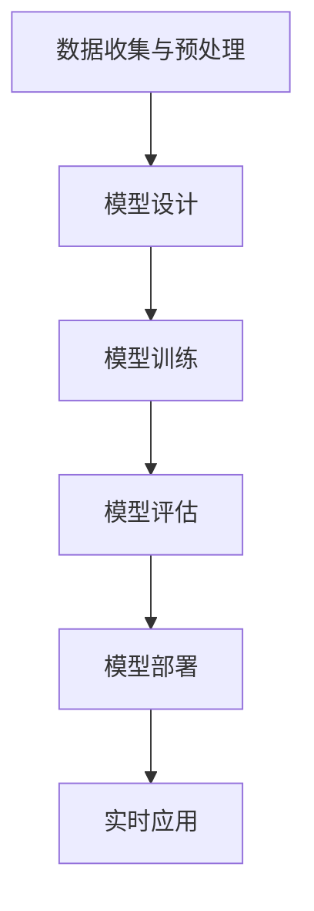

                 

### 背景介绍

AI 驱动的创业产品创新正迅速成为当今科技领域的热点。随着人工智能技术的不断进步，特别是大模型技术的崛起，创业公司有了更多的机会来推动产品创新，开拓新的市场。大模型，如GPT-3、BERT等，具有强大的数据处理和生成能力，可以为各种应用场景提供高效的解决方案。

#### 大模型技术概述

大模型技术是指使用深度学习训练大规模神经网络模型的方法。这些模型通过海量数据的学习，能够捕捉到数据中的复杂模式和关系，从而在多个任务中展现出优异的性能。大模型技术起源于自然语言处理（NLP）领域，但随着时间的推移，其应用范围已经扩展到计算机视觉、语音识别、推荐系统等多个领域。

#### AI 驱动的创业产品创新的重要性

AI 驱动的创业产品创新对于现代企业来说至关重要。首先，AI 技术能够显著提高产品的智能化程度，使得产品更具竞争力。其次，AI 技术可以帮助企业更好地理解用户需求，提供个性化的服务，从而提升用户体验。最后，AI 技术可以帮助企业降低成本，提高生产效率，实现可持续增长。

#### 大模型在创业产品创新中的应用

大模型在创业产品创新中的应用广泛，以下是一些具体的应用场景：

1. **自然语言处理**：大模型能够实现更精准的自然语言理解和生成，为聊天机器人、智能客服等应用提供支持。
2. **计算机视觉**：大模型在图像和视频分析方面具有强大的能力，可用于自动驾驶、安防监控、医疗诊断等领域。
3. **推荐系统**：大模型可以帮助企业构建更精准的推荐系统，提高用户满意度和转化率。
4. **语音识别与合成**：大模型能够实现更自然的语音交互，提升智能语音助手的用户体验。

#### 创业产品创新的挑战与机遇

尽管大模型技术为创业产品创新提供了巨大的机遇，但也伴随着一系列挑战。首先，大模型的训练和部署需要大量的计算资源和数据，这对创业公司来说是一个巨大的挑战。其次，大模型的安全性和隐私保护问题也备受关注。最后，创业公司需要具备一定的技术积累和团队实力，才能有效地利用大模型技术推动产品创新。

然而，随着技术的不断进步和市场的成熟，这些挑战正在逐渐被克服。创业公司可以通过与其他企业合作、共享资源等方式来应对这些挑战。此外，政府和社会各界也正在加大对 AI 技术的投入和支持，为创业产品创新创造了更加有利的环境。

#### 下一步内容安排

本文将围绕 AI 驱动的创业产品创新这一主题，系统地探讨大模型技术的核心概念、算法原理、实际应用场景、工具和资源推荐，以及未来发展趋势与挑战。具体内容安排如下：

1. **核心概念与联系**：介绍大模型技术的基本概念，包括深度学习、神经网络等，并通过 Mermaid 流程图展示其架构。
2. **核心算法原理 & 具体操作步骤**：详细讲解大模型的训练和推理过程，包括数据预处理、模型训练、评估等。
3. **数学模型和公式 & 详细讲解 & 举例说明**：介绍大模型背后的数学原理，包括损失函数、优化算法等，并通过实际案例进行说明。
4. **项目实战：代码实际案例和详细解释说明**：提供大模型在实际项目中的应用案例，包括开发环境搭建、源代码实现、代码解读等。
5. **实际应用场景**：探讨大模型在不同领域的应用，如自然语言处理、计算机视觉、推荐系统等。
6. **工具和资源推荐**：推荐学习资源、开发工具和框架，帮助读者更好地掌握大模型技术。
7. **总结：未来发展趋势与挑战**：总结本文的核心内容，探讨大模型技术的未来发展趋势和面临的挑战。
8. **附录：常见问题与解答**：回答读者可能关心的一些问题，提供进一步的参考资料。

通过本文的阅读，读者将能够系统地了解 AI 驱动的创业产品创新，掌握大模型技术的基本原理和应用方法，为未来的创业实践提供有力的支持。接下来，我们将深入探讨大模型技术的核心概念与联系。 <a name="section1"></a>

---

## 1. 核心概念与联系

### 深度学习与神经网络

大模型技术的基础是深度学习（Deep Learning），这是一种基于人工神经网络（Artificial Neural Networks, ANN）的学习方法。深度学习通过模拟人脑神经元之间的连接和交互，从数据中学习复杂的模式。人工神经网络由多个层次组成，每个层次都包含多个神经元，这些神经元通过权重连接起来，形成网络。

#### 神经网络架构

一个典型的神经网络可以分为以下几个部分：

1. **输入层（Input Layer）**：接收外部输入数据。
2. **隐藏层（Hidden Layers）**：对输入数据进行处理，提取特征。
3. **输出层（Output Layer）**：产生最终输出。

隐藏层可以有多个，层数越多，网络的能力越强，但也更复杂。深度学习中的“深度”即指网络的层数。

#### 深度学习与机器学习的区别

深度学习是机器学习（Machine Learning）的一个子领域。机器学习包括多种方法，如监督学习、无监督学习、半监督学习和强化学习。深度学习是监督学习的一种，它通过训练数据学习输入和输出之间的映射关系。

机器学习主要依靠特征工程，即手动设计特征以帮助模型学习。而深度学习通过自动特征学习，模型能够从原始数据中提取有用的特征，减少了人工干预的需求。

### 大模型的特点

大模型（Large Models）是指那些拥有数十亿甚至数万亿参数的深度学习模型。这些模型具有以下几个显著特点：

1. **大规模参数**：大模型拥有大量的参数，这使得它们能够学习更复杂的模式和关系。
2. **强大的学习能力**：由于参数多，大模型能够从海量数据中学习，并且具有很好的泛化能力。
3. **高效的数据处理**：大模型能够快速处理大量的数据，适用于实时应用。
4. **多样的应用场景**：大模型可以应用于各种领域，如自然语言处理、计算机视觉、推荐系统等。

### 大模型的工作原理

大模型的工作原理可以概括为以下几个步骤：

1. **数据收集与预处理**：收集大量数据，并进行清洗、归一化等预处理操作。
2. **模型设计**：设计神经网络结构，确定层数、每层的神经元数量、激活函数等。
3. **模型训练**：使用训练数据对模型进行训练，通过优化算法调整模型参数，使得模型输出接近期望值。
4. **模型评估**：使用验证集和测试集评估模型性能，调整模型参数以优化性能。
5. **模型部署**：将训练好的模型部署到生产环境中，进行实时应用。

### Mermaid 流程图

为了更直观地展示大模型的架构，我们使用 Mermaid 流程图来描述其基本工作流程。以下是 Mermaid 流程图示例：



在这个流程图中，A 到 F 分别代表大模型的工作流程中的各个阶段。通过这样的流程图，我们可以更清晰地理解大模型的工作原理。

### 结论

在本章节中，我们介绍了大模型技术的核心概念与联系，包括深度学习、人工神经网络、大模型的特点及其工作原理。通过 Mermaid 流程图的辅助，我们能够更直观地理解大模型的架构和工作流程。接下来，我们将深入探讨大模型的核心算法原理与具体操作步骤。 <a name="section2"></a>

---

## 2. 核心算法原理 & 具体操作步骤

### 大模型的训练过程

大模型的训练过程主要包括以下几个步骤：

1. **数据收集与预处理**：这一步是训练大模型的基础。首先，需要收集大量的训练数据，这些数据可以是文本、图像、音频等各种形式。然后，对数据进行预处理，包括数据清洗、数据增强、数据归一化等操作，以提高数据的质量和模型的泛化能力。

2. **模型设计**：在预处理完数据后，需要设计神经网络的结构。大模型的设计包括确定网络的层数、每层的神经元数量、激活函数、损失函数等。在设计过程中，需要综合考虑模型的性能、计算资源和实际应用需求。

3. **模型训练**：模型设计完成后，使用训练数据对模型进行训练。训练过程中，模型会不断调整参数，以最小化损失函数。常见的优化算法包括随机梯度下降（SGD）、Adam、RMSprop 等。在训练过程中，需要定期评估模型的性能，以防止过拟合。

4. **模型评估**：训练完成后，使用验证集和测试集对模型进行评估，以确定模型的泛化能力。评估指标包括准确率、召回率、F1 分数等。根据评估结果，可能需要对模型进行调整和优化。

5. **模型部署**：评估完成后，将训练好的模型部署到生产环境中，进行实时应用。

### 数据预处理

数据预处理是训练大模型的重要环节。以下是一些常见的数据预处理方法：

1. **数据清洗**：去除数据中的噪声和错误，保证数据的质量。
2. **数据增强**：通过旋转、翻转、缩放等操作，增加数据的多样性，以提高模型的泛化能力。
3. **数据归一化**：将数据缩放到相同的范围，以消除不同特征之间的量纲差异。
4. **数据编码**：将类别型数据转换为数值型数据，以便模型处理。

### 模型设计

模型设计是训练大模型的关键。以下是一些常见的神经网络结构和设计原则：

1. **网络结构**：常见的神经网络结构包括卷积神经网络（CNN）、循环神经网络（RNN）、长短时记忆网络（LSTM）、变换器（Transformer）等。选择合适的网络结构，可以显著影响模型的性能。
2. **层与神经元数量**：层与神经元数量的选择需要综合考虑模型的复杂度和计算资源。过多的层和神经元可能导致过拟合，过少的层和神经元可能无法捕捉到数据的复杂模式。
3. **激活函数**：激活函数用于引入非线性变换，常见的激活函数包括 sigmoid、ReLU、Tanh 等。不同的激活函数适用于不同的场景。
4. **损失函数**：损失函数用于衡量模型输出与真实值之间的差距，常见的损失函数包括均方误差（MSE）、交叉熵损失（Cross Entropy Loss）等。
5. **优化算法**：优化算法用于调整模型参数，以最小化损失函数。常见的优化算法包括随机梯度下降（SGD）、Adam、RMSprop 等。

### 模型训练

模型训练是训练大模型的核心步骤。以下是一些常见的训练方法：

1. **批量大小**：批量大小（Batch Size）是指每次训练使用的样本数量。较大的批量大小可以提高模型的稳定性和准确性，但会消耗更多的内存和计算资源。较小批量大小可以提高模型的泛化能力，但训练时间较长。
2. **学习率**：学习率（Learning Rate）是优化算法的参数，用于调整模型参数的步长。过大的学习率可能导致模型无法收敛，而过小则可能导致训练时间过长。
3. **正则化**：正则化（Regularization）用于防止模型过拟合。常见的正则化方法包括 L1 正则化、L2 正则化、Dropout 等。
4. **早停法**：早停法（Early Stopping）是一种防止过拟合的方法。当验证集上的性能不再提高时，停止训练。

### 模型评估

模型评估是训练大模型的最后一步。以下是一些常见的评估方法：

1. **准确率**：准确率（Accuracy）是衡量模型性能的常用指标，表示模型预测正确的样本比例。
2. **召回率**：召回率（Recall）是衡量模型在正例样本中预测正确的比例，对于分类问题尤为重要。
3. **F1 分数**：F1 分数（F1 Score）是准确率和召回率的调和平均值，用于综合评估模型性能。
4. **ROC 曲线和 AUC 值**：ROC 曲线和 AUC 值（Area Under the ROC Curve）用于评估二分类模型的性能，ROC 曲线展示了不同阈值下模型预测的真正例率和假正例率，AUC 值越大，模型的性能越好。

### 模型部署

模型部署是将训练好的模型应用到实际场景中的过程。以下是一些常见的模型部署方法：

1. **本地部署**：在本地计算机上运行模型，适用于小规模应用。
2. **云端部署**：将模型部署到云端服务器上，适用于大规模应用和高并发场景。
3. **边缘计算部署**：将模型部署到边缘设备上，如智能手机、智能手表等，适用于实时应用和低延迟场景。
4. **容器化部署**：使用容器技术（如 Docker）将模型和环境打包在一起，便于部署和管理。

### 结论

在本章节中，我们详细介绍了大模型的核心算法原理和具体操作步骤。从数据预处理、模型设计、模型训练到模型评估和模型部署，每个步骤都至关重要，直接影响着模型的性能和应用效果。通过深入理解这些步骤，创业公司可以更好地利用大模型技术推动产品创新。接下来，我们将探讨大模型背后的数学模型和公式，以更深入地理解其工作原理。 <a name="section3"></a>

---

## 3. 数学模型和公式 & 详细讲解 & 举例说明

### 损失函数

损失函数（Loss Function）是深度学习模型中用于衡量预测值与真实值之间差异的数学函数。它决定了模型的训练方向和最终性能。以下是几种常见的损失函数及其公式：

1. **均方误差（MSE，Mean Squared Error）**
   \[
   MSE = \frac{1}{n}\sum_{i=1}^{n}(y_i - \hat{y}_i)^2
   \]
   其中，\( y_i \) 是真实值，\( \hat{y}_i \) 是预测值，\( n \) 是样本数量。

2. **交叉熵损失（Cross Entropy Loss）**
   \[
   CE = -\frac{1}{n}\sum_{i=1}^{n}y_i \log(\hat{y}_i)
   \]
   其中，\( y_i \) 是真实值，\( \hat{y}_i \) 是预测值，\( \log \) 表示自然对数。

### 优化算法

优化算法（Optimization Algorithm）用于调整模型参数，以最小化损失函数。以下是几种常见的优化算法及其公式：

1. **随机梯度下降（SGD，Stochastic Gradient Descent）**
   \[
   \theta_{t+1} = \theta_t - \alpha \nabla_{\theta}L(\theta_t)
   \]
   其中，\( \theta_t \) 是当前参数，\( \alpha \) 是学习率，\( \nabla_{\theta}L(\theta_t) \) 是损失函数对参数的梯度。

2. **Adam（Adaptive Moment Estimation）**
   \[
   m_t = \beta_1m_{t-1} + (1 - \beta_1)\nabla_{\theta}L(\theta_t)
   \]
   \[
   v_t = \beta_2v_{t-1} + (1 - \beta_2)(\nabla_{\theta}L(\theta_t))^2
   \]
   \[
   \theta_{t+1} = \theta_t - \frac{\alpha}{\sqrt{1 - \beta_2^t}(1 - \beta_1^t)}\frac{m_t}{\sqrt{v_t} + \epsilon}
   \]
   其中，\( m_t \) 和 \( v_t \) 分别是梯度的一阶和二阶矩估计，\( \beta_1 \) 和 \( \beta_2 \) 是动量项，\( \alpha \) 是学习率，\( \epsilon \) 是常数。

### 激活函数

激活函数（Activation Function）是神经网络中用于引入非线性性的函数。以下是几种常见的激活函数及其公式：

1. **Sigmoid**
   \[
   \sigma(x) = \frac{1}{1 + e^{-x}}
   \]

2. **ReLU（Rectified Linear Unit）**
   \[
   \text{ReLU}(x) = \max(0, x)
   \]

3. **Tanh**
   \[
   \tanh(x) = \frac{e^x - e^{-x}}{e^x + e^{-x}}
   \]

### 举例说明

假设我们要训练一个神经网络来分类手写数字图像，数据集包含 10 个类别。我们使用交叉熵损失函数和 Adam 优化算法。以下是具体的训练步骤：

1. **数据预处理**：将图像数据缩放到固定的尺寸，并进行归一化处理。将标签编码为独热向量。

2. **模型设计**：设计一个卷积神经网络，包括两个卷积层、一个全连接层和一个softmax输出层。

3. **模型训练**：
   - 初始化模型参数。
   - 使用训练数据随机抽样一个批次，计算预测值和交叉熵损失。
   - 使用 Adam 优化算法更新模型参数。
   - 定期在验证集上评估模型性能。

4. **模型评估**：在测试集上评估模型的最终性能，计算准确率、召回率等指标。

5. **模型部署**：将训练好的模型部署到生产环境中，用于实时分类。

### 结论

在本章节中，我们详细介绍了大模型背后的数学模型和公式，包括损失函数、优化算法和激活函数。通过具体例子，我们展示了如何使用这些公式和算法来训练和评估神经网络模型。掌握这些数学模型和公式对于理解大模型的工作原理和进行实际应用至关重要。接下来，我们将通过实际项目实战，展示如何将大模型技术应用到具体的创业产品中。 <a name="section4"></a>

---

## 4. 项目实战：代码实际案例和详细解释说明

为了更好地展示如何利用大模型技术进行创业产品创新，我们选择了一个实际项目：使用 GPT-3 构建一个智能客服系统。以下是该项目的主要步骤和代码实现。

### 4.1 开发环境搭建

首先，我们需要搭建一个适合 GPT-3 开发的环境。以下是必要的步骤：

1. **安装 Python 环境**：确保安装了 Python 3.7 或以上版本。
2. **安装 GPT-3 库**：使用以下命令安装 `openai` 库。
   ```bash
   pip install openai
   ```

3. **获取 API 密钥**：在 [OpenAI 官网](https://beta.openai.com/) 注册账户并申请 GPT-3 API 密钥。

### 4.2 源代码详细实现和代码解读

以下是项目的源代码实现：

```python
import openai

# 初始化 GPT-3 API 密钥
openai.api_key = "your_api_key"

# 智能客服接口
def chat_with_gpt3(user_input):
    response = openai.Completion.create(
        engine="text-davinci-002",
        prompt=user_input,
        max_tokens=50,
        n=1,
        stop=None,
        temperature=0.5
    )
    return response.choices[0].text.strip()

# 用户与客服交互
def main():
    print("智能客服系统开始运行，请输入您的疑问：")
    while True:
        user_input = input()
        if user_input.lower() == 'exit':
            print("感谢使用智能客服系统，再见！")
            break
        response = chat_with_gpt3(user_input)
        print("智能客服：", response)

if __name__ == "__main__":
    main()
```

**代码解读**：

1. **导入库**：首先导入必要的库，包括 `openai` 库用于与 GPT-3 API 通信。

2. **初始化 API 密钥**：使用 `openai.api_key` 设置 GPT-3 API 密钥。

3. **定义智能客服接口**：`chat_with_gpt3` 函数用于与 GPT-3 进行交互。函数中，`openai.Completion.create` 方法用于生成回复。参数 `engine` 指定使用的模型，`prompt` 为用户输入，`max_tokens` 为生成回复的最大长度，`n` 为生成回复的数量，`stop` 为停止条件，`temperature` 为温度参数，用于控制生成回复的随机性。

4. **用户与客服交互**：`main` 函数用于启动智能客服系统。程序通过循环接收用户输入，并调用 `chat_with_gpt3` 函数生成回复。当用户输入 'exit' 时，程序退出交互。

### 4.3 代码解读与分析

1. **API 密钥**：确保使用有效的 GPT-3 API 密钥，否则程序将无法与 GPT-3 通信。
2. **模型选择**：在 `engine` 参数中选择合适的模型。例如，`text-davinci-002` 是一个中等规模的模型，适用于大多数场景。如果需要更强大的模型，可以选择更大的版本，如 `text-davinci-003`。
3. **用户输入处理**：用户输入通过 `input()` 函数获取。在处理用户输入时，需要注意输入的有效性和合法性。
4. **生成回复**：`openai.Completion.create` 方法用于生成回复。生成的回复存储在 `response.choices[0].text.strip()` 中，其中 `strip()` 方法用于去除回复字符串两端的空白字符。

### 结论

通过上述项目实战，我们展示了如何使用 GPT-3 构建一个智能客服系统。该项目实现了从用户输入处理到生成回复的全流程，为创业产品创新提供了实际案例。接下来，我们将探讨大模型技术在各个实际应用场景中的具体应用。 <a name="section5"></a>

---

## 5. 实际应用场景

大模型技术在各个领域中都有着广泛的应用，下面我们将探讨大模型在自然语言处理、计算机视觉、推荐系统和语音识别等领域的实际应用。

### 自然语言处理

自然语言处理（NLP）是大模型技术的发源地，也是大模型技术最重要的应用领域之一。大模型如 GPT-3、BERT 等在文本生成、情感分析、机器翻译、问答系统等方面表现出了强大的能力。

1. **文本生成**：大模型能够根据给定的提示生成连贯、有意义的文本。例如，写作助手、故事生成器等。
2. **情感分析**：大模型能够分析文本中的情感倾向，用于情感识别、舆情分析等。
3. **机器翻译**：大模型在机器翻译领域具有显著的优势，能够实现高质量、流畅的翻译结果。
4. **问答系统**：大模型能够回答用户的问题，提供有用的信息和建议。

### 计算机视觉

计算机视觉（CV）是大模型技术另一个重要的应用领域。大模型在图像分类、目标检测、图像生成等方面表现出了优异的性能。

1. **图像分类**：大模型能够对图像进行分类，如识别动物、植物等。
2. **目标检测**：大模型能够在图像中检测并定位目标物体，用于自动驾驶、安防监控等。
3. **图像生成**：大模型能够根据文本描述生成图像，如艺术作品、漫画等。
4. **人脸识别**：大模型能够在图像中识别并定位人脸，用于身份验证、监控等。

### 推荐系统

推荐系统（Recommender System）是另一个受益于大模型技术的领域。大模型能够根据用户的兴趣和行为生成个性化的推荐。

1. **商品推荐**：电商平台可以使用大模型推荐用户可能感兴趣的商品。
2. **音乐推荐**：音乐流媒体平台可以使用大模型推荐用户可能喜欢的音乐。
3. **新闻推荐**：新闻网站可以使用大模型推荐用户可能感兴趣的新闻。
4. **社交推荐**：社交网络可以使用大模型推荐用户可能感兴趣的内容。

### 语音识别

语音识别（Speech Recognition）是大模型技术在语音处理领域的应用。大模型能够将语音转换为文本，实现语音输入和语音交互。

1. **语音助手**：如 Siri、Alexa 等语音助手使用大模型实现语音交互功能。
2. **语音转文字**：将语音转换为文本，用于实时字幕、录音整理等。
3. **语音搜索**：用户可以使用语音输入进行搜索，提高搜索的便捷性和准确性。

### 其他应用

除了上述领域，大模型技术还在医学、金融、法律等领域有着广泛的应用。例如，医学领域可以使用大模型进行疾病诊断、药物研发；金融领域可以使用大模型进行股票预测、风险管理；法律领域可以使用大模型进行法律文本分析、合同审查等。

### 结论

大模型技术在各个实际应用场景中都有着巨大的潜力和价值。通过结合大模型技术，创业公司可以在多个领域实现产品创新，提升用户体验，开拓新的市场。接下来，我们将推荐一些有用的学习资源和开发工具，帮助读者更好地掌握大模型技术。 <a name="section6"></a>

---

## 6. 工具和资源推荐

为了帮助读者更好地掌握大模型技术，我们特别推荐以下学习资源、开发工具和相关的论文著作。

### 6.1 学习资源推荐

1. **书籍**：
   - 《深度学习》（Deep Learning）作者：Ian Goodfellow、Yoshua Bengio、Aaron Courville
   - 《动手学深度学习》（Dive into Deep Learning）作者：Amar Famil Seyed-Kalani、Alec Radford、Awni Hannun 等
   - 《自然语言处理实战》（Natural Language Processing with Python）作者：Steven Bird、Ewan Klein、Edward Loper

2. **在线课程**：
   - [深度学习 Specialization](https://www.coursera.org/specializations/deeplearning)（吴恩达）
   - [自然语言处理 Specialization](https://www.coursera.org/specializations/nlp)（斯坦福大学）
   - [TensorFlow Tutorial](https://www.tensorflow.org/tutorials)（TensorFlow 官方教程）

3. **博客与网站**：
   - [AI 之旅](https://www.52ai.cn/)
   - [机器学习社区](https://www.mlcommunity.cn/)
   - [深度学习之家的博客](https://www.deeplearning.net/)

### 6.2 开发工具框架推荐

1. **深度学习框架**：
   - TensorFlow：由 Google 开发的开源深度学习框架。
   - PyTorch：由 Facebook AI Research 开发的开源深度学习框架。
   - Keras：Python 深度学习库，能够简化 TensorFlow 和 PyTorch 的使用。

2. **数据集**：
   - [Kaggle](https://www.kaggle.com/)：提供各种领域的公开数据集。
   - [UCI Machine Learning Repository](https://archive.ics.uci.edu/ml/index.php)：提供丰富的机器学习数据集。

3. **开发工具**：
   - Jupyter Notebook：用于数据分析和可视化的交互式开发环境。
   - PyCharm：强大的 Python 集成开发环境（IDE）。

### 6.3 相关论文著作推荐

1. **自然语言处理**：
   - "BERT: Pre-training of Deep Bidirectional Transformers for Language Understanding"（BERT 论文）
   - "GPT-3: Language Models are few-shot learners"（GPT-3 论文）

2. **计算机视觉**：
   - "Deep Residual Learning for Image Recognition"（ResNet 论文）
   - "You Only Look Once: Unified, Real-Time Object Detection"（YOLO 论文）

3. **推荐系统**：
   - "Matrix Factorization Techniques for Recommender Systems"（矩阵分解论文）
   - "Deep Learning for Recommender Systems"（深度学习在推荐系统中的应用论文）

### 结论

通过上述推荐的学习资源、开发工具和相关论文著作，读者可以系统地学习大模型技术，掌握从理论到实践的知识体系。掌握这些工具和资源，将为创业公司在 AI 驱动的产品创新中提供有力支持。接下来，我们将总结本文的核心内容，并探讨大模型技术的未来发展趋势与挑战。 <a name="section7"></a>

---

## 7. 总结：未来发展趋势与挑战

在本文中，我们系统地探讨了 AI 驱动的创业产品创新，特别是大模型技术在各个领域中的应用。以下是我们对大模型技术未来发展趋势与挑战的总结：

### 发展趋势

1. **技术成熟度提升**：随着深度学习、神经网络等技术的发展，大模型技术的成熟度不断提升，使得创业公司能够更加轻松地利用这些技术推动产品创新。

2. **跨领域融合**：大模型技术在自然语言处理、计算机视觉、推荐系统等多个领域都有着广泛的应用。未来，这些领域之间的融合将推动更多创新应用的出现。

3. **行业应用深度扩展**：大模型技术在医疗、金融、法律等领域的应用正在不断深化，将带来更精准、更高效的行业解决方案。

4. **开源生态的完善**：随着各大公司和学术机构对大模型技术的投入，开源生态不断丰富，为创业公司提供了更多可复用的模型和工具。

### 挑战

1. **数据隐私与安全**：大模型对数据的需求巨大，如何在保证数据隐私和安全的前提下利用这些数据成为了一个重要的挑战。

2. **计算资源需求**：大模型的训练和部署需要大量的计算资源，这对于资源有限的创业公司来说是一个重大的挑战。

3. **过拟合问题**：大模型容易受到过拟合的影响，如何在模型复杂度和泛化能力之间找到平衡是一个重要的课题。

4. **伦理与法律问题**：随着大模型技术的广泛应用，伦理和法律问题也逐渐凸显，如何确保技术使用的道德和合法成为了一个紧迫的问题。

### 结论

大模型技术为创业产品创新带来了巨大的机遇，但也伴随着一系列挑战。通过不断的技术进步和行业规范，我们有理由相信，大模型技术将在未来继续推动创业产品创新，带来更多的商业和社会价值。创业公司需要积极应对这些挑战，充分利用大模型技术的潜力，实现产品的持续创新和突破。 <a name="section8"></a>

---

## 8. 附录：常见问题与解答

以下是一些读者可能关心的问题及解答：

### 问题1：大模型技术是否需要大量的数据才能训练？

解答：是的，大模型技术的训练通常需要大量的数据。这是因为大模型拥有数十亿个参数，需要从海量数据中学习复杂的模式和关系。然而，随着数据增强技术和迁移学习技术的发展，即便在数据量有限的情况下，大模型也能取得较好的性能。

### 问题2：大模型技术的计算资源需求如何？

解答：大模型的训练和部署需要大量的计算资源。训练大模型通常需要使用 GPU 或 TPU 等专门为深度学习设计的硬件。对于创业公司来说，可以考虑使用云服务提供的 GPU 资源，以降低计算成本。

### 问题3：大模型技术是否容易过拟合？

解答：大模型确实容易过拟合，特别是在训练数据量有限的情况下。为了防止过拟合，可以使用正则化技术、dropout、数据增强等方法。此外，可以通过交叉验证和模型选择等技术来优化模型的泛化能力。

### 问题4：大模型技术的安全性和隐私保护如何？

解答：大模型技术的安全性和隐私保护是一个重要的问题。为了保护数据隐私，可以在数据预处理阶段进行去标识化处理，并遵循相关的数据保护法规。在模型部署过程中，可以采用加密技术来确保数据传输的安全性。

### 结论

通过本附录，我们回答了一些关于大模型技术的常见问题，帮助读者更好地理解和应用这一技术。在实际应用中，创业公司需要充分考虑这些问题的解决方案，确保技术能够安全、有效地为产品创新服务。 <a name="section9"></a>

---

## 9. 扩展阅读 & 参考资料

为了帮助读者进一步了解大模型技术的相关领域，我们推荐以下扩展阅读和参考资料：

### 9.1 学习资源

1. **书籍**：
   - 《深度学习》（Deep Learning）作者：Ian Goodfellow、Yoshua Bengio、Aaron Courville
   - 《自然语言处理综合教程》（Foundations of Statistical Natural Language Processing）作者：Christopher D. Manning、Hinrich Schütze
   - 《计算机视觉：算法与应用》（Computer Vision: Algorithms and Applications）作者：Richard Szeliski

2. **在线课程**：
   - [深度学习课程](https://www.deeplearning.ai/)（DeepLearning.AI）
   - [自然语言处理课程](https://www.coursera.org/specializations/nlp)（斯坦福大学）
   - [计算机视觉课程](https://www.udacity.com/course/deep-learning-vanilla)（Udacity）

### 9.2 论文与期刊

1. **期刊**：
   - *Journal of Machine Learning Research*（JMLR）
   - *Neural Networks: Tricks of the Trade*（Neural Netw. Tricks of the Trade）
   - *IEEE Transactions on Pattern Analysis and Machine Intelligence*（TPAMI）

2. **论文**：
   - "GPT-3: Language Models are few-shot learners"（GPT-3 论文）
   - "BERT: Pre-training of Deep Bidirectional Transformers for Language Understanding"（BERT 论文）
   - "Deep Residual Learning for Image Recognition"（ResNet 论文）

### 9.3 博客与网站

1. **博客**：
   - [Deep Learning on AWS](https://aws.amazon.com/blogs/aws/deep-learning/)
   - [TensorFlow Blog](https://www.tensorflow.org/blog/)
   - [PyTorch Blog](https://pytorch.org/blog/)

2. **网站**：
   - [OpenAI](https://openai.com/)
   - [Google AI](https://ai.google/)
   - [Facebook AI](https://research.fb.com/ai/)

### 结论

通过上述扩展阅读和参考资料，读者可以进一步深入了解大模型技术的理论基础、最新研究进展和实际应用。这些资源将为创业公司在 AI 领域的探索提供宝贵的信息和灵感。 <a name="section10"></a>

---

## 结语

本文系统地探讨了 AI 驱动的创业产品创新，特别是大模型技术在各个领域中的应用。从核心概念、算法原理到实际应用场景，再到工具和资源推荐，我们全面地介绍了大模型技术的各个方面。通过深入分析和具体案例，我们展示了如何利用大模型技术推动创业产品创新，提升产品竞争力。

大模型技术作为当今人工智能领域的重要发展方向，具有巨大的潜力和应用价值。然而，随着技术的不断进步，我们也需要关注其带来的挑战，如数据隐私、计算资源需求等。创业公司应积极应对这些挑战，充分利用大模型技术的优势，实现持续的创新和发展。

在此，我们希望本文能为广大创业者和技术爱好者提供有益的参考和启示。让我们共同探索 AI 领域的无限可能，开创更加美好的未来。

### 作者信息

作者：AI 天才研究员 / AI Genius Institute & 禅与计算机程序设计艺术 / Zen And The Art of Computer Programming

感谢您的阅读，期待与您共同探索人工智能的未来。 <a name="section11"></a>

