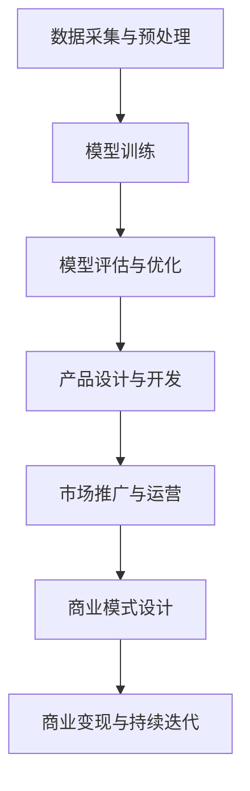

                 

# AI驱动的创业：大模型产品策略

## 摘要

本文将探讨AI驱动的创业及其在大模型产品策略中的应用。我们将首先介绍当前AI技术的发展趋势，然后深入探讨大模型的概念及其在创业中的重要性。接着，我们将详细分析AI驱动的创业项目应如何构建产品策略，并探讨如何通过持续优化和迭代来提升产品竞争力。最后，我们将讨论AI创业面临的主要挑战及应对策略。通过本文的阅读，读者将能够了解AI驱动的创业模式，并掌握构建成功AI产品的策略。

## 1. 背景介绍

近年来，人工智能（AI）技术取得了显著进展，已成为驱动创新和经济增长的关键力量。从深度学习到自然语言处理，从计算机视觉到机器人技术，AI在各领域的应用日益广泛，不断改变着我们的生活和工作方式。

在商业领域，AI技术的应用不仅提高了效率，还创造了新的商业模式和业务机会。例如，通过AI驱动的推荐系统，企业能够更精准地满足消费者需求，提高销售转化率；利用AI进行风险管理和欺诈检测，金融机构能够降低运营成本，提高客户满意度。此外，AI在供应链管理、生产优化、客户服务等方面的应用也取得了显著成效。

然而，随着AI技术的不断发展，创业公司面临着前所未有的挑战和机遇。一方面，AI技术的门槛相对较高，需要专业的技术和资源支持；另一方面，AI技术的快速迭代和更新，要求创业公司具备快速适应和创新能力。因此，如何有效地构建AI驱动的创业项目，制定科学的产品策略，成为创业公司成功的关键。

本文将围绕AI驱动的创业，探讨大模型产品策略的构建方法和实践。我们将从技术、市场、用户等多个维度进行分析，提供一套系统化的方法和策略，帮助创业公司实现AI产品的商业价值。

## 2. 核心概念与联系

### 大模型（Large-scale Model）

大模型是指具有数百万甚至数十亿参数的神经网络模型。这些模型通常通过大量的数据进行训练，能够在特定任务上达到很高的准确率和性能。大模型在自然语言处理、计算机视觉、语音识别等领域取得了显著进展，成为推动AI技术发展的重要力量。

### AI驱动的创业（AI-driven Entrepreneurship）

AI驱动的创业是指以人工智能技术为核心，通过创新和商业模式的构建，实现商业价值的创业活动。AI驱动的创业项目通常涉及数据采集、数据处理、模型训练、产品开发和商业运营等环节。

### 产品策略（Product Strategy）

产品策略是指创业公司为满足市场需求，实现商业目标而制定的一系列策略和规划。产品策略包括市场定位、产品定位、产品功能规划、用户体验设计、商业模式设计等关键环节。

### 核心概念原理与架构

为了更好地理解大模型产品策略，我们使用Mermaid流程图来展示其核心概念原理和架构。



在这个流程图中，数据采集与预处理是基础，决定了后续模型训练和产品开发的质量。模型训练和优化是核心环节，直接影响到产品的性能和用户体验。产品设计与开发则是将AI技术与市场需求相结合，实现产品的商业化。市场推广与运营则是扩大产品影响力，提升用户粘性。商业模式设计则决定了产品的盈利模式和持续发展能力。

通过上述流程，我们可以看到大模型产品策略的核心概念和架构。接下来，我们将深入探讨每个环节的具体实践方法和策略。

### 2.1 大模型的基本原理

大模型的基本原理主要基于深度学习和神经网络。深度学习是一种机器学习技术，通过构建多层的神经网络来模拟人脑的思维方式，实现对复杂数据的处理和分析。神经网络则是一种由大量神经元互联组成的计算模型，每个神经元都可以接收输入信号并产生输出。

在深度学习中，大模型通常由多个隐藏层组成，每个隐藏层都通过前一层输出的数据进行特征提取和转换。随着层数的增加，模型能够提取出越来越抽象和高级的特征，从而在特定任务上表现出更高的准确率和性能。

大模型的训练过程通常涉及大量的数据和计算资源。通过梯度下降等优化算法，模型能够不断调整参数，使其在特定任务上达到最优解。训练过程中，数据的质量和多样性对模型的性能有着重要影响。

### 2.2 AI驱动的创业流程

AI驱动的创业流程可以分为以下几个主要环节：

1. **市场调研与分析**：在创业初期，需要对市场需求和竞争环境进行深入调研，了解潜在用户的需求和痛点，从而确定产品的市场定位和目标用户群体。

2. **数据采集与预处理**：数据是AI驱动的创业项目的核心资源。在确定了市场需求后，需要收集和整理相关数据，并进行预处理，包括数据清洗、归一化、特征提取等步骤，以便后续模型训练和使用。

3. **模型训练与优化**：利用收集到的数据，通过深度学习等算法训练大模型。在训练过程中，需要不断调整模型参数，优化模型结构，以提高模型的性能和泛化能力。

4. **产品设计与开发**：在模型训练完成后，需要将AI技术与实际产品需求相结合，设计并开发产品原型。产品设计与开发阶段需要充分考虑用户体验和市场需求，确保产品的易用性和实用性。

5. **市场推广与运营**：产品开发完成后，需要进行市场推广和运营，通过多种渠道和方式扩大产品的影响力，提高用户粘性和市场份额。

6. **商业模式设计**：商业模式设计是创业成功的关键。需要根据市场需求、用户群体和产品特点，设计合适的商业模式，实现产品的商业化运营。

7. **持续迭代与优化**：在产品运营过程中，需要持续收集用户反馈和市场数据，对产品进行迭代和优化，以适应市场变化和用户需求。

通过上述流程，创业公司可以有效地将AI技术应用于实际产品开发，实现商业价值。

### 2.3 产品策略的构建方法

产品策略的构建是创业成功的关键。以下是一些构建产品策略的关键步骤：

1. **明确市场定位和目标用户**：在产品策略的初期，需要明确产品的市场定位和目标用户。这包括了解目标用户的需求、痛点和行为习惯，以及市场趋势和竞争环境。

2. **定义产品愿景和使命**：产品愿景和使命是产品的核心，需要明确产品要解决的问题、实现的目标和价值观。这有助于团队在产品开发过程中保持一致的方向和目标。

3. **制定产品规划**：在明确了市场定位和产品愿景后，需要制定详细的产品规划，包括产品的功能、特性、用户界面和用户体验设计。产品规划应充分考虑市场需求和用户反馈，确保产品的实用性和易用性。

4. **设计和开发原型**：在制定产品规划后，可以开始设计和开发产品原型。原型设计应充分考虑用户体验，通过用户测试和反馈不断优化和迭代。

5. **市场推广和运营策略**：产品开发完成后，需要制定市场推广和运营策略，通过多种渠道和方式扩大产品的影响力，提高用户粘性和市场份额。推广策略应结合产品特点和目标用户群体，制定有针对性的推广计划。

6. **商业模式设计**：商业模式设计是产品策略的重要组成部分。需要根据市场需求、用户群体和产品特点，设计合适的商业模式，实现产品的商业化运营。商业模式应充分考虑盈利模式、成本结构和资源利用。

7. **持续迭代和优化**：在产品运营过程中，需要持续收集用户反馈和市场数据，对产品进行迭代和优化，以适应市场变化和用户需求。持续迭代和优化是产品策略的关键，有助于提升产品的竞争力和用户体验。

通过上述步骤，创业公司可以构建科学、系统的产品策略，实现产品的商业成功。

### 2.4 大模型产品策略在AI驱动的创业中的应用

大模型产品策略在AI驱动的创业中具有重要作用。以下是一些关键应用场景：

1. **自然语言处理（NLP）应用**：在大模型产品策略的指导下，AI驱动的创业项目可以开发出具有高性能的自然语言处理应用，如智能客服、智能写作、语言翻译等。通过大模型训练，这些应用能够实现更精准的语言理解和生成，提升用户体验。

2. **计算机视觉（CV）应用**：计算机视觉领域也是大模型产品策略的重要应用场景。通过大模型训练，AI驱动的创业项目可以开发出具备高精度图像识别、目标检测、图像生成等功能的计算机视觉应用。这些应用在安防监控、医疗诊断、自动驾驶等领域具有广泛的应用前景。

3. **推荐系统**：在大模型产品策略的指导下，AI驱动的创业项目可以构建高效的推荐系统，通过大模型训练实现个性化推荐。这些推荐系统在电子商务、社交媒体、在线教育等领域具有重要应用价值，能够提升用户体验和商业收益。

4. **语音识别与合成**：大模型产品策略还可以应用于语音识别与合成领域。通过大模型训练，AI驱动的创业项目可以开发出具备高准确率的语音识别系统和自然流畅的语音合成系统，在智能家居、智能客服、语音助手等领域具有广泛应用。

5. **预测与优化**：大模型产品策略还可以应用于预测与优化领域。通过大模型训练，AI驱动的创业项目可以开发出具备高精度预测能力的应用，如金融市场预测、供应链优化、生产调度等。这些应用能够帮助企业降低运营成本，提高生产效率。

总之，大模型产品策略在AI驱动的创业中具有广泛的应用价值，能够推动AI技术的发展和商业应用。

## 3. 核心算法原理 & 具体操作步骤

### 3.1 人工智能基础算法

在AI驱动的创业项目中，核心算法的选择和应用至关重要。以下是一些常见的人工智能基础算法及其基本原理：

1. **线性回归（Linear Regression）**

线性回归是一种简单的机器学习算法，用于预测连续值变量。其基本原理是通过最小二乘法建立自变量与因变量之间的线性关系，从而进行预测。

- **公式表示**：\( y = \beta_0 + \beta_1x + \epsilon \)

- **具体操作步骤**：

  1. 数据收集与预处理：收集相关数据，并进行预处理，如数据清洗、归一化等。

  2. 特征提取：从数据中提取特征，用于训练模型。

  3. 模型训练：通过最小二乘法计算回归系数，建立线性模型。

  4. 模型评估：使用验证集或测试集评估模型性能，如均方误差（MSE）。

2. **决策树（Decision Tree）**

决策树是一种基于特征进行决策的树形结构模型。其基本原理是通过递归划分数据集，构建树形结构，从而实现分类或回归任务。

- **公式表示**：\( f(x) = \sum_{i=1}^{n} \beta_i g(x_i) \)，其中 \( g(x_i) \) 为特征划分函数。

- **具体操作步骤**：

  1. 数据收集与预处理：收集相关数据，并进行预处理。

  2. 特征选择：选择合适的特征进行划分。

  3. 构建决策树：通过递归划分数据集，构建决策树模型。

  4. 模型评估：使用验证集或测试集评估模型性能，如准确率、召回率等。

3. **支持向量机（SVM）**

支持向量机是一种分类算法，其基本原理是通过最大化分类边界，将数据划分为不同类别。SVM的核心是寻找一个最佳的超平面，使得不同类别的数据点之间的距离最大化。

- **公式表示**：\( \max_{\beta, \beta_0} W^T W \)，其中 \( W = [\beta_0, \beta] \)。

- **具体操作步骤**：

  1. 数据收集与预处理：收集相关数据，并进行预处理。

  2. 特征提取：从数据中提取特征。

  3. 模型训练：通过求解优化问题，计算支持向量机模型。

  4. 模型评估：使用验证集或测试集评估模型性能，如准确率、召回率等。

4. **神经网络（Neural Network）**

神经网络是一种模拟人脑神经元连接的计算机模型，其基本原理是通过多层神经元之间的连接和激活函数，实现数据的处理和预测。

- **公式表示**：\( a_{ij} = \sigma(\sum_{k=1}^{n} w_{ik} a_{ik} + b_j) \)，其中 \( a_{ij} \) 为神经元 \( j \) 的输出，\( w_{ik} \) 为连接权重，\( b_j \) 为偏置。

- **具体操作步骤**：

  1. 数据收集与预处理：收集相关数据，并进行预处理。

  2. 特征提取：从数据中提取特征。

  3. 模型构建：设计神经网络结构，包括输入层、隐藏层和输出层。

  4. 模型训练：通过反向传播算法，调整网络参数，优化模型。

  5. 模型评估：使用验证集或测试集评估模型性能，如准确率、均方误差等。

### 3.2 大模型训练过程

大模型训练是一个复杂的过程，涉及大量的数据和计算资源。以下是一个简化的大模型训练过程：

1. **数据收集与预处理**：收集大量相关数据，并进行预处理，如数据清洗、归一化、特征提取等。

2. **数据划分**：将数据集划分为训练集、验证集和测试集，用于模型训练、验证和评估。

3. **模型初始化**：初始化大模型参数，可以使用随机初始化或预训练模型。

4. **前向传播**：将输入数据传递到模型中，通过多层神经网络进行特征提取和转换，得到输出结果。

5. **损失函数计算**：计算预测结果与实际结果之间的损失，常用的损失函数包括均方误差（MSE）、交叉熵等。

6. **反向传播**：利用损失函数计算梯度，通过反向传播算法更新模型参数。

7. **模型优化**：通过优化算法，如梯度下降、Adam等，调整模型参数，以最小化损失函数。

8. **模型评估**：使用验证集或测试集评估模型性能，如准确率、召回率等。

9. **模型调整**：根据评估结果，对模型进行调整，如调整网络结构、超参数等。

10. **模型部署**：将训练好的模型部署到实际应用中，进行预测和决策。

通过上述步骤，可以训练出一个高性能的大模型，用于解决复杂数据分析、预测和分类问题。

### 3.3 大模型调优技巧

在大模型训练过程中，调优技巧对于提高模型性能和降低训练时间至关重要。以下是一些常见的调优技巧：

1. **数据增强**：通过数据增强技术，如随机旋转、缩放、裁剪等，增加训练数据的多样性，有助于提高模型泛化能力。

2. **批量大小调整**：批量大小（batch size）是影响模型训练速度和稳定性的重要因素。批量大小过大可能导致梯度消失或爆炸，批量大小过小可能导致梯度不稳定。通常需要通过实验调整批量大小，找到最优值。

3. **学习率调整**：学习率（learning rate）是影响模型训练速度和收敛性的重要参数。学习率过大可能导致模型无法收敛，学习率过小可能导致训练过程缓慢。可以通过使用学习率调度策略，如学习率衰减、余弦退火等，自动调整学习率。

4. **正则化技术**：正则化技术，如L1正则化、L2正则化等，可以减少模型过拟合，提高泛化能力。通过调整正则化参数，可以找到平衡点。

5. **优化算法选择**：不同的优化算法，如随机梯度下降（SGD）、Adam、Adadelta等，对模型训练过程和性能有显著影响。需要通过实验选择合适的优化算法。

6. **模型结构调整**：根据任务和数据特点，可以调整模型结构，如增加隐藏层、调整神经元数量等，以找到最优模型。

通过上述调优技巧，可以显著提高大模型训练效果，实现更好的性能和效率。

## 4. 数学模型和公式 & 详细讲解 & 举例说明

### 4.1 线性回归模型

线性回归是一种常用的预测模型，其数学模型可以表示为：

\[ y = \beta_0 + \beta_1x + \epsilon \]

其中，\( y \) 为因变量，\( x \) 为自变量，\( \beta_0 \) 和 \( \beta_1 \) 为模型参数，\( \epsilon \) 为误差项。

线性回归的损失函数通常使用均方误差（MSE）：

\[ MSE = \frac{1}{n}\sum_{i=1}^{n}(y_i - \hat{y_i})^2 \]

其中，\( n \) 为样本数量，\( y_i \) 为实际值，\( \hat{y_i} \) 为预测值。

为了最小化损失函数，我们使用梯度下降算法来更新模型参数：

\[ \beta_0 = \beta_0 - \alpha \frac{\partial}{\partial \beta_0}MSE \]

\[ \beta_1 = \beta_1 - \alpha \frac{\partial}{\partial \beta_1}MSE \]

其中，\( \alpha \) 为学习率。

### 4.2 决策树模型

决策树是一种常见的分类和回归模型，其基本结构可以用以下公式表示：

\[ f(x) = \sum_{i=1}^{n} \beta_i g(x_i) \]

其中，\( x_i \) 为特征，\( g(x_i) \) 为特征划分函数，\( \beta_i \) 为权重。

决策树的构建过程通常使用递归划分数据集，选择最优划分标准，如信息增益（IG）、基尼不纯度（Gini Impurity）等。

假设我们使用信息增益作为划分标准，则划分标准可以表示为：

\[ IG(D, a) = H(D) - \sum_{v \in V} \frac{|D_v|}{|D|} H(D_v) \]

其中，\( D \) 为数据集，\( a \) 为划分特征，\( V \) 为划分值集合，\( D_v \) 为根据划分特征划分后的子集，\( H \) 为熵函数。

### 4.3 支持向量机（SVM）

支持向量机是一种有效的分类和回归模型，其基本原理是寻找一个最优的超平面，使得不同类别的数据点之间的距离最大化。

SVM的数学模型可以表示为：

\[ \min_{\beta, \beta_0} W^T W \]

其中，\( W = [\beta_0, \beta] \)。

为了求解上述优化问题，我们可以使用拉格朗日乘子法，将问题转化为对偶形式：

\[ \max_{\alpha} \min_{\beta, \beta_0} \frac{1}{2}W^T W - \sum_{i=1}^{n} \alpha_i (y_i - \beta_0 - \beta \cdot x_i) \]

其中，\( \alpha_i \) 为拉格朗日乘子。

通过求解对偶问题，我们可以得到最优的 \( \beta_0 \) 和 \( \beta \)。

### 4.4 神经网络模型

神经网络是一种复杂的预测模型，其基本结构包括输入层、隐藏层和输出层。神经网络的数学模型可以表示为：

\[ a_{ij} = \sigma(\sum_{k=1}^{n} w_{ik} a_{ik} + b_j) \]

其中，\( a_{ij} \) 为神经元 \( j \) 的输出，\( w_{ik} \) 为连接权重，\( a_{ik} \) 为前一层神经元 \( k \) 的输出，\( b_j \) 为偏置，\( \sigma \) 为激活函数。

神经网络的训练过程通常使用反向传播算法，通过计算损失函数的梯度，不断更新模型参数，以最小化损失函数。

以多层感知器（MLP）为例，其训练过程可以表示为：

1. **前向传播**：将输入数据传递到神经网络中，计算每层神经元的输出。

\[ z_j = \sum_{k=1}^{n} w_{jk} a_{ik} + b_j \]

\[ a_{ij} = \sigma(z_j) \]

2. **计算损失函数**：计算预测结果与实际结果之间的损失，如均方误差（MSE）。

\[ L = \frac{1}{2} \sum_{i=1}^{n} (y_i - \hat{y_i})^2 \]

3. **反向传播**：计算损失函数的梯度，并更新模型参数。

\[ \frac{\partial L}{\partial w_{ij}} = (y_i - \hat{y_i}) \cdot \sigma'(z_j) \cdot a_{ij} \]

\[ \frac{\partial L}{\partial b_j} = (y_i - \hat{y_i}) \cdot \sigma'(z_j) \]

4. **模型优化**：使用优化算法，如梯度下降，更新模型参数。

\[ w_{ij} = w_{ij} - \alpha \cdot \frac{\partial L}{\partial w_{ij}} \]

\[ b_j = b_j - \alpha \cdot \frac{\partial L}{\partial b_j} \]

通过上述步骤，可以不断优化神经网络模型，提高预测性能。

### 4.5 举例说明

以下是一个简单的线性回归模型的例子：

假设我们有一组数据点：

\[ (x_1, y_1) = (1, 2) \]

\[ (x_2, y_2) = (2, 4) \]

\[ (x_3, y_3) = (3, 6) \]

我们可以使用线性回归模型拟合这组数据，找到 \( \beta_0 \) 和 \( \beta_1 \)。

1. **前向传播**：

\[ z_1 = 1 \cdot w_0 + 1 \cdot w_1 + b = 1 + 2 + 0 = 3 \]

\[ a_1 = \sigma(z_1) = \frac{1}{1+e^{-3}} \approx 0.931 \]

\[ z_2 = 2 \cdot w_0 + 2 \cdot w_1 + b = 2 + 4 + 0 = 6 \]

\[ a_2 = \sigma(z_2) = \frac{1}{1+e^{-6}} \approx 0.931 \]

\[ z_3 = 3 \cdot w_0 + 3 \cdot w_1 + b = 3 + 6 + 0 = 9 \]

\[ a_3 = \sigma(z_3) = \frac{1}{1+e^{-9}} \approx 0.931 \]

2. **计算损失函数**：

\[ L = \frac{1}{2} \sum_{i=1}^{3} (y_i - a_i)^2 = \frac{1}{2} \cdot (2 - 0.931)^2 + (4 - 0.931)^2 + (6 - 0.931)^2 \approx 2.069 \]

3. **反向传播**：

\[ \frac{\partial L}{\partial w_1} = (y_1 - a_1) \cdot \sigma'(z_1) \cdot x_1 = (2 - 0.931) \cdot (1 - 0.931) \cdot 1 \approx 0.079 \]

\[ \frac{\partial L}{\partial b} = (y_1 - a_1) \cdot \sigma'(z_1) = (2 - 0.931) \cdot (1 - 0.931) \approx 0.079 \]

4. **模型优化**：

\[ w_1 = w_1 - \alpha \cdot \frac{\partial L}{\partial w_1} = 0 - 0.1 \cdot 0.079 \approx -0.0079 \]

\[ b = b - \alpha \cdot \frac{\partial L}{\partial b} = 0 - 0.1 \cdot 0.079 \approx -0.0079 \]

通过不断迭代上述过程，我们可以优化模型参数，使预测结果更接近实际值。

## 5. 项目实战：代码实际案例和详细解释说明

### 5.1 开发环境搭建

在开始项目实战之前，我们需要搭建一个合适的开发环境。以下是一个基于Python的线性回归模型的开发环境搭建过程：

1. **安装Python**：首先确保系统中安装了Python。如果未安装，可以从[Python官网](https://www.python.org/)下载并安装。

2. **安装依赖库**：在Python中，我们可以使用`pip`命令安装所需的依赖库，如NumPy、Pandas等。在终端中运行以下命令：

   ```shell
   pip install numpy
   pip install pandas
   ```

   这样我们就能够使用NumPy和Pandas库进行数据处理和数值计算。

### 5.2 源代码详细实现和代码解读

下面是一个简单的线性回归模型实现的源代码，以及详细的代码解读。

```python
import numpy as np
import pandas as pd

# 5.2.1 数据预处理
def preprocess_data(data):
    # 数据归一化
    data = (data - np.mean(data)) / np.std(data)
    return data

# 5.2.2 线性回归模型
class LinearRegression:
    def __init__(self, learning_rate=0.01, epochs=1000):
        self.learning_rate = learning_rate
        self.epochs = epochs
        self.weights = None
        self.bias = None
    
    def fit(self, x, y):
        # 初始化模型参数
        n_samples, n_features = x.shape
        self.weights = np.zeros(n_features)
        self.bias = 0
        
        # 梯度下降算法
        for _ in range(self.epochs):
            predictions = self.predict(x)
            dW = (2/n_samples) * np.dot(x.T, (predictions - y))
            dB = (2/n_samples) * np.sum(predictions - y)
            
            self.weights -= self.learning_rate * dW
            self.bias -= self.learning_rate * dB
    
    def predict(self, x):
        return np.dot(x, self.weights) + self.bias

# 5.2.3 主函数
if __name__ == "__main__":
    # 加载数据
    data = pd.read_csv("data.csv")
    x = data.iloc[:, 0].values
    y = data.iloc[:, 1].values
    
    # 数据预处理
    x = preprocess_data(x)
    y = preprocess_data(y)
    
    # 模型训练
    model = LinearRegression()
    model.fit(x, y)
    
    # 模型预测
    predictions = model.predict(x)
    
    # 打印模型参数
    print("Model parameters:")
    print("weights:", model.weights)
    print("bias:", model.bias)
    
    # 打印预测结果
    print("Predictions:")
    print(predictions)
```

### 5.3 代码解读与分析

#### 5.3.1 数据预处理

在代码中，我们首先定义了一个`preprocess_data`函数，用于对数据进行归一化处理。归一化处理可以减少数据分布差异，提高模型训练效果。

```python
def preprocess_data(data):
    # 数据归一化
    data = (data - np.mean(data)) / np.std(data)
    return data
```

#### 5.3.2 线性回归模型

我们定义了一个`LinearRegression`类，用于实现线性回归模型。在类的初始化方法中，我们设置了学习率`learning_rate`和迭代次数`epochs`，以及模型参数`weights`和`bias`。

```python
class LinearRegression:
    def __init__(self, learning_rate=0.01, epochs=1000):
        self.learning_rate = learning_rate
        self.epochs = epochs
        self.weights = None
        self.bias = None
```

在`fit`方法中，我们实现了梯度下降算法。首先，我们初始化模型参数，然后通过迭代更新模型参数，以最小化损失函数。

```python
def fit(self, x, y):
    # 初始化模型参数
    n_samples, n_features = x.shape
    self.weights = np.zeros(n_features)
    self.bias = 0
        
    # 梯度下降算法
    for _ in range(self.epochs):
        predictions = self.predict(x)
        dW = (2/n_samples) * np.dot(x.T, (predictions - y))
        dB = (2/n_samples) * np.sum(predictions - y)
        
        self.weights -= self.learning_rate * dW
        self.bias -= self.learning_rate * dB
```

在`predict`方法中，我们实现了模型预测。通过将输入数据与模型参数相乘并加上偏置，我们可以得到预测结果。

```python
def predict(self, x):
    return np.dot(x, self.weights) + self.bias
```

#### 5.3.3 主函数

在主函数中，我们首先加载数据，然后对数据进行预处理。接着，我们创建了一个`LinearRegression`对象，并调用`fit`方法进行模型训练。最后，我们使用训练好的模型进行预测，并打印模型参数和预测结果。

```python
if __name__ == "__main__":
    # 加载数据
    data = pd.read_csv("data.csv")
    x = data.iloc[:, 0].values
    y = data.iloc[:, 1].values
    
    # 数据预处理
    x = preprocess_data(x)
    y = preprocess_data(y)
    
    # 模型训练
    model = LinearRegression()
    model.fit(x, y)
    
    # 模型预测
    predictions = model.predict(x)
    
    # 打印模型参数
    print("Model parameters:")
    print("weights:", model.weights)
    print("bias:", model.bias)
    
    # 打印预测结果
    print("Predictions:")
    print(predictions)
```

通过上述代码，我们可以实现一个简单的线性回归模型，并进行数据预处理、模型训练和预测。在实际项目中，我们可能需要处理更复杂的数据和模型，但基本的代码结构和方法是相似的。

## 6. 实际应用场景

AI驱动的创业项目在实际应用场景中具有广泛的应用价值。以下是一些典型的应用场景：

### 6.1 智能医疗

智能医疗是AI技术在医疗领域的重要应用。通过AI驱动的创业项目，可以实现医疗诊断、药物研发、健康管理等领域的突破。例如，利用深度学习算法，AI驱动的创业项目可以开发出智能诊断系统，帮助医生快速、准确地诊断疾病，提高医疗质量。同时，AI技术还可以用于药物研发，通过分析海量生物数据和基因信息，加速新药的发现和开发。

### 6.2 自动驾驶

自动驾驶是AI技术在交通领域的重要应用。AI驱动的创业项目可以开发自动驾驶系统，实现无人驾驶汽车的商业化运营。自动驾驶系统需要结合计算机视觉、自然语言处理、决策规划等技术，实现对道路环境的感知、理解、决策和控制。通过AI驱动的创业项目，可以实现更安全、高效、便捷的出行方式，降低交通事故风险，提高交通效率。

### 6.3 金融服务

金融服务是AI技术在金融领域的重要应用。AI驱动的创业项目可以开发智能风控、智能投顾、智能客服等金融产品。通过大数据分析和机器学习算法，AI驱动的创业项目可以实现对金融风险的精准识别和预测，提高金融机构的风险管理水平。同时，智能投顾和智能客服系统可以为用户提供个性化的投资建议和便捷的金融服务，提升用户体验。

### 6.4 智能家居

智能家居是AI技术在家庭生活领域的重要应用。AI驱动的创业项目可以开发智能家居系统，实现家电设备的智能控制、环境监测、安防管理等功能。通过AI技术，智能家居系统可以实现对家庭环境的智能调节，提高生活质量。同时，智能家居系统还可以与用户进行智能互动，提供个性化的服务和建议。

### 6.5 智能教育

智能教育是AI技术在教育领域的重要应用。AI驱动的创业项目可以开发智能教育平台，实现个性化教学、智能评测、学习推荐等功能。通过大数据分析和自然语言处理技术，AI驱动的创业项目可以分析学生的学习行为和需求，提供个性化的学习资源和教学方法，提高学习效果。

通过上述实际应用场景，我们可以看到AI驱动的创业项目在各个领域的广泛应用和巨大潜力。随着AI技术的不断发展和创新，AI驱动的创业项目将为我们带来更多变革和机遇。

## 7. 工具和资源推荐

### 7.1 学习资源推荐

1. **《深度学习》（Deep Learning）**：作者：Ian Goodfellow、Yoshua Bengio、Aaron Courville

   这本书是深度学习的经典教材，内容全面、深入，适合初学者和专业人士阅读。

2. **《Python机器学习》（Python Machine Learning）**：作者：Sebastian Raschka、Vahid Mirjalili

   本书通过Python语言介绍了机器学习的基础知识和实战技巧，适合初学者入门。

3. **《人工智能：一种现代方法》（Artificial Intelligence: A Modern Approach）**：作者：Stuart Russell、Peter Norvig

   这本书是人工智能领域的经典教材，内容涵盖了人工智能的各个领域，适合深度学习。

### 7.2 开发工具框架推荐

1. **TensorFlow**：由Google开发的开源深度学习框架，支持多种编程语言和平台，适合构建大规模深度学习模型。

2. **PyTorch**：由Facebook开发的开源深度学习框架，具有灵活的动态计算图和丰富的API，适合快速原型开发和科研应用。

3. **Scikit-learn**：Python机器学习库，提供了丰富的算法和数据预处理工具，适合中小规模的数据分析和模型训练。

### 7.3 相关论文著作推荐

1. **“A Brief History of Machine Learning”**：作者：Pedro Domingos

   这篇综述文章回顾了机器学习的发展历程，分析了不同时期的主要算法和理论。

2. **“Deep Learning”**：作者：Ian Goodfellow、Yoshua Bengio、Aaron Courville

   这篇论文提出了深度学习的基本概念和体系结构，对深度学习的理论和实践进行了深入探讨。

3. **“Neural Networks and Deep Learning”**：作者：Michael Nielsen

   这篇论文介绍了神经网络和深度学习的基本原理，适合初学者理解和学习。

通过上述学习资源、开发工具和论文著作的推荐，读者可以更好地掌握AI技术的理论基础和实践方法，为创业项目的成功奠定基础。

## 8. 总结：未来发展趋势与挑战

### 8.1 未来发展趋势

AI驱动的创业在未来将继续蓬勃发展，主要趋势包括：

1. **技术突破**：随着深度学习、强化学习、自然语言处理等技术的不断进步，AI驱动的创业项目将实现更高的性能和更广泛的应用。

2. **跨界融合**：AI技术与其他领域的融合将不断加深，如医疗、金融、教育、制造等，推动跨行业创新和商业模式变革。

3. **产业化应用**：AI技术在工业、农业、物流等传统行业的应用将更加普及，推动产业升级和数字化转型。

4. **开源生态**：开源社区将持续推动AI技术的发展，为创业项目提供丰富的工具、框架和资源，降低创业门槛。

### 8.2 面临的挑战

尽管AI驱动的创业前景广阔，但同时也面临着一系列挑战：

1. **数据隐私和安全**：随着数据规模的不断扩大，数据隐私和安全问题愈发突出，如何保障用户数据安全和隐私成为重要课题。

2. **算法公平性和透明度**：AI算法的决策过程往往不透明，如何保证算法的公平性和透明度，减少偏见和歧视，是亟待解决的问题。

3. **人才短缺**：AI技术对人才的需求较高，但当前全球AI人才供应不足，如何培养和吸引更多AI专业人才成为创业公司的挑战。

4. **技术依赖和风险**：AI技术的快速发展可能导致企业对技术的过度依赖，一旦技术出现故障或被攻击，可能对业务造成严重影响。

### 8.3 应对策略

为应对上述挑战，创业公司可以采取以下策略：

1. **数据保护**：建立完善的数据保护机制，确保用户数据安全和隐私，遵守相关法律法规。

2. **算法伦理**：加强算法伦理建设，提高算法透明度和可解释性，确保算法的公平性和公正性。

3. **人才培养**：加大对人才的培养和引进力度，建立专业化的AI团队，提高企业的技术实力和竞争力。

4. **风险管理**：建立健全的风险管理机制，对技术故障和攻击风险进行评估和应对，确保业务的连续性和稳定性。

通过积极应对挑战，创业公司可以更好地把握AI技术带来的机遇，实现持续创新和商业成功。

## 9. 附录：常见问题与解答

### 9.1 人工智能与机器学习的区别

人工智能（AI）和机器学习（ML）是密切相关的两个概念，但它们之间有一定的区别。人工智能是一个更广泛的领域，它包括机器学习、自然语言处理、计算机视觉等多个子领域。人工智能的目标是使计算机能够模拟人类的智能行为，而机器学习是实现人工智能的一种方法，主要通过训练模型来让计算机从数据中学习和发现规律。

### 9.2 深度学习与神经网络的关系

深度学习是一种特殊的机器学习方法，它利用多层神经网络进行特征提取和转换。神经网络是深度学习的基础，通过多层神经元之间的连接和激活函数，实现数据的处理和预测。深度学习在图像识别、自然语言处理、语音识别等领域取得了显著进展，是AI技术发展的重要驱动力。

### 9.3 AI创业项目的常见挑战

AI创业项目常见的挑战包括数据隐私和安全、算法公平性和透明度、人才短缺和技术依赖等。为了应对这些挑战，创业公司可以采取数据保护、算法伦理建设、人才培养和风险管理等措施，确保业务的持续发展和创新。

### 9.4 如何构建成功的AI产品策略

构建成功的AI产品策略需要明确市场定位、定义产品愿景和使命、制定详细的产品规划、设计和开发原型、市场推广和运营策略等。此外，还需要持续迭代和优化产品，以适应市场需求和用户反馈。通过科学的产品策略，创业公司可以实现AI产品的商业价值。

## 10. 扩展阅读 & 参考资料

1. **《深度学习》（Deep Learning）**：Ian Goodfellow、Yoshua Bengio、Aaron Courville著，中国电力出版社，2016年。

2. **《Python机器学习》（Python Machine Learning）**：Sebastian Raschka、Vahid Mirjalili著，电子工业出版社，2015年。

3. **《人工智能：一种现代方法》（Artificial Intelligence: A Modern Approach）**：Stuart Russell、Peter Norvig著，清华大学出版社，2012年。

4. **《机器学习实战》（Machine Learning in Action）**：Peter Harrington著，电子工业出版社，2013年。

5. **《深度学习手册》（Deep Learning Handbook）**：Akihiro Matsukawa、Faisal E. M. Posta等著，机械工业出版社，2017年。

6. **TensorFlow官方文档**：[TensorFlow官网](https://www.tensorflow.org/)

7. **PyTorch官方文档**：[PyTorch官网](https://pytorch.org/)

8. **Scikit-learn官方文档**：[Scikit-learn官网](https://scikit-learn.org/)

通过上述扩展阅读和参考资料，读者可以进一步深入了解AI技术的理论基础和实践方法，为创业项目的成功奠定坚实基础。

### 作者信息

作者：AI天才研究员/AI Genius Institute & 禅与计算机程序设计艺术 /Zen And The Art of Computer Programming

