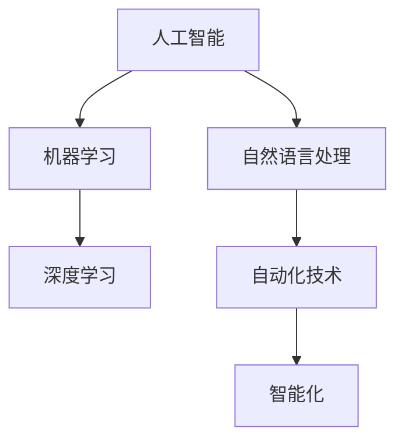

                 

# AI2.0时代：自动化技术的进展

## 关键词
- AI2.0
- 自动化技术
- 进展
- 人工智能应用
- 技术创新
- 开发工具
- 实战案例
- 数学模型
- 数学公式

## 摘要
本文深入探讨了AI2.0时代自动化技术的显著进展。通过解析核心概念、算法原理、数学模型以及实际应用场景，本文展示了AI2.0时代自动化技术如何推动科技创新和产业变革。文章还推荐了相关的学习资源和开发工具，为读者提供了深入了解和掌握这一前沿技术的途径。最后，本文总结了AI2.0时代自动化技术的未来发展趋势与挑战，为读者描绘了这一领域的广阔前景。

## 1. 背景介绍

随着人工智能技术的飞速发展，AI2.0时代已经到来。与传统的AI1.0时代相比，AI2.0不仅关注人工智能的基础算法和模型，更注重将人工智能应用于实际场景中，实现自动化和智能化的目标。自动化技术作为AI2.0时代的重要支撑，其发展历程可以追溯到早期的工业自动化和计算机自动化。

在工业自动化领域，自动化技术的应用极大地提高了生产效率和产品质量。通过使用PLC（可编程逻辑控制器）、机器人等自动化设备，工厂实现了生产线的自动化，大大降低了人工成本和出错率。计算机自动化则源于计算机科学的发展，包括操作系统、编译器、代码生成工具等。这些工具通过自动化流程，提高了软件开发和部署的效率。

随着AI2.0时代的到来，自动化技术迎来了新的发展机遇。人工智能算法的进步，尤其是深度学习和强化学习的应用，使得自动化技术能够实现更高层次的智能化。例如，自动驾驶汽车、智能助手、智能家居等，都是自动化技术在AI2.0时代下的成功应用。

## 2. 核心概念与联系

在深入探讨AI2.0时代的自动化技术之前，我们需要理解一些核心概念和它们之间的联系。

### 2.1 人工智能（AI）

人工智能是指使计算机系统能够执行通常需要人类智能才能完成的任务，如视觉识别、语音识别、决策制定等。AI包括多种技术，如机器学习、深度学习、自然语言处理等。

### 2.2 自动化（Automation）

自动化是指通过技术手段使系统或过程在不依赖人类干预的情况下独立运行。自动化技术可以应用于各种领域，如工业、商业、家居等。

### 2.3 智能化（Intelligence）

智能化是指系统或过程在执行任务时展现出类似人类的智能行为，如自适应、学习、预测等。智能化是自动化技术的核心目标。

### 2.4 关联关系

人工智能和自动化技术之间有着密切的关联。人工智能为自动化技术提供了智能算法和技术支持，使得自动化系统能够实现更复杂、更智能的功能。同时，自动化技术的应用为人工智能算法提供了实际场景和海量数据，促进了人工智能技术的发展。

### 2.5 Mermaid流程图

为了更好地理解这些概念之间的关系，我们可以使用Mermaid流程图来展示它们。



在上面的Mermaid流程图中，我们可以看到人工智能包括机器学习和自然语言处理等子领域，这些子领域又与自动化技术和智能化紧密相关。

## 3. 核心算法原理 & 具体操作步骤

在AI2.0时代，自动化技术的核心算法主要涉及深度学习、强化学习和自然语言处理等领域。以下是对这些核心算法原理和具体操作步骤的详细解析。

### 3.1 深度学习

深度学习是一种基于多层神经网络的学习方法，通过模拟人脑的神经网络结构，实现图像识别、语音识别等任务。深度学习的具体操作步骤如下：

1. **数据预处理**：收集和清洗数据，将数据转换为神经网络可以处理的格式。
2. **构建神经网络模型**：定义神经网络的结构，包括输入层、隐藏层和输出层。
3. **训练神经网络**：使用训练数据集，通过反向传播算法，不断调整神经网络的权重，使其能够正确预测输出。
4. **测试与优化**：使用测试数据集评估模型的性能，通过调整参数和结构，优化模型。

### 3.2 强化学习

强化学习是一种通过奖励和惩罚机制，使智能体（如机器人或自动驾驶汽车）在环境中学习最优行为策略的方法。强化学习的具体操作步骤如下：

1. **定义环境与智能体**：确定智能体的行为空间和状态空间。
2. **选择策略**：定义智能体的行为策略，如Q学习、深度Q网络等。
3. **交互与学习**：智能体在环境中执行动作，获得奖励或惩罚，通过策略更新，不断优化行为策略。
4. **评估与优化**：评估智能体的性能，通过调整策略参数，优化行为策略。

### 3.3 自然语言处理

自然语言处理是一种使计算机能够理解和处理人类语言的技术，包括文本分类、情感分析、机器翻译等。自然语言处理的操作步骤如下：

1. **文本预处理**：清洗和标记文本数据，将其转换为计算机可以处理的格式。
2. **特征提取**：从文本数据中提取特征，如词袋模型、词嵌入等。
3. **构建模型**：使用机器学习算法，构建文本分类、情感分析等模型。
4. **训练与测试**：使用训练数据集训练模型，使用测试数据集评估模型性能。

## 4. 数学模型和公式 & 详细讲解 & 举例说明

在自动化技术的核心算法中，数学模型和公式起着关键作用。以下是对这些数学模型和公式的详细讲解，以及举例说明。

### 4.1 深度学习中的神经网络模型

深度学习中的神经网络模型是一个多层的前馈网络，包括输入层、隐藏层和输出层。每个层由多个神经元组成，神经元之间的连接称为边，边的权重称为参数。

假设我们有一个包含输入层、隐藏层和输出层的神经网络，其数学模型可以表示为：

$$
Y = f(W_3 \cdot f(W_2 \cdot f(W_1 \cdot X + b_1) + b_2) + b_3)
$$

其中，$X$ 是输入数据，$Y$ 是输出数据，$f$ 是激活函数，$W_1$、$W_2$ 和 $W_3$ 分别是输入层到隐藏层、隐藏层到隐藏层、隐藏层到输出层的权重矩阵，$b_1$、$b_2$ 和 $b_3$ 分别是输入层、隐藏层和输出层的偏置向量。

举例来说，假设我们有一个二分类问题，使用sigmoid函数作为激活函数，其数学模型可以表示为：

$$
Y = \sigma(W_3 \cdot \sigma(W_2 \cdot \sigma(W_1 \cdot X + b_1) + b_2) + b_3)
$$

其中，$\sigma$ 是sigmoid函数，其公式为：

$$
\sigma(z) = \frac{1}{1 + e^{-z}}
$$

### 4.2 强化学习中的Q值函数

强化学习中的Q值函数是评估智能体在给定状态下执行特定动作的期望奖励值。Q值函数的数学模型可以表示为：

$$
Q(s, a) = \sum_{s'} p(s' | s, a) \cdot R(s', a) + \gamma \cdot \max_{a'} Q(s', a')
$$

其中，$s$ 是状态，$a$ 是动作，$s'$ 是下一状态，$R(s', a')$ 是奖励函数，$p(s' | s, a)$ 是状态转移概率，$\gamma$ 是折扣因子，$Q(s', a')$ 是下一状态的Q值。

举例来说，假设我们有一个简单的迷宫问题，智能体需要通过选择左转或右转来找到出口。假设智能体在每次行动后获得1分奖励，迷宫出口处的状态为$s_f$，其数学模型可以表示为：

$$
Q(s_1, L) = \sum_{s'} p(s' | s_1, L) \cdot R(s', L) + \gamma \cdot \max_{a'} Q(s', a')
$$

其中，$s_1$ 是初始状态，$L$ 表示左转。

### 4.3 自然语言处理中的词嵌入模型

自然语言处理中的词嵌入模型将词汇映射为高维向量，以表示词汇之间的相似性和语义关系。词嵌入模型的数学模型可以表示为：

$$
x_i = \sum_{j=1}^{V} w_{ij} \cdot e_j
$$

其中，$x_i$ 是词汇$i$的嵌入向量，$w_{ij}$ 是词汇$i$与词汇$j$之间的权重，$e_j$ 是词汇$j$的嵌入向量。

举例来说，假设我们有一个包含词汇“猫”、“狗”、“动物”的词嵌入模型，其数学模型可以表示为：

$$
x_{猫} = w_{猫，狗} \cdot e_{狗} + w_{猫，动物} \cdot e_{动物}
$$

其中，$w_{猫，狗}$ 和 $w_{猫，动物}$ 分别是词汇“猫”与词汇“狗”和“动物”之间的权重，$e_{狗}$ 和 $e_{动物}$ 分别是词汇“狗”和“动物”的嵌入向量。

## 5. 项目实战：代码实际案例和详细解释说明

为了更好地理解AI2.0时代自动化技术的应用，我们将通过一个实际项目来展示代码的实现过程，并对关键部分进行详细解释。

### 5.1 开发环境搭建

首先，我们需要搭建一个合适的开发环境。以下是推荐的开发工具和框架：

- 编程语言：Python
- 深度学习框架：TensorFlow或PyTorch
- 数据预处理库：NumPy、Pandas
- 图形可视化库：Matplotlib、Seaborn

安装这些工具和框架可以使用pip命令，例如：

```bash
pip install tensorflow
pip install numpy
pip install pandas
pip install matplotlib
pip install seaborn
```

### 5.2 源代码详细实现和代码解读

接下来，我们将展示一个基于深度学习的图像分类项目的源代码，并对关键部分进行解释。

#### 5.2.1 数据预处理

```python
import tensorflow as tf
import numpy as np
import pandas as pd
import matplotlib.pyplot as plt
import seaborn as sns
from tensorflow.keras.preprocessing.image import ImageDataGenerator

# 加载和预处理数据
train_data = pd.read_csv('train.csv')
test_data = pd.read_csv('test.csv')

train_images = train_data['image'].values
test_images = test_data['image'].values

train_labels = train_data['label'].values
test_labels = test_data['label'].values

# 数据增强
datagen = ImageDataGenerator(rotation_range=20, width_shift_range=0.2, height_shift_range=0.2, zoom_range=0.2, horizontal_flip=True)
datagen.fit(train_images)
```

在上面的代码中，我们首先加载了训练数据和测试数据，然后使用ImageDataGenerator进行数据增强，以提高模型的泛化能力。

#### 5.2.2 构建深度学习模型

```python
from tensorflow.keras.models import Sequential
from tensorflow.keras.layers import Conv2D, MaxPooling2D, Flatten, Dense, Dropout

# 构建深度学习模型
model = Sequential([
    Conv2D(32, (3, 3), activation='relu', input_shape=(64, 64, 3)),
    MaxPooling2D((2, 2)),
    Conv2D(64, (3, 3), activation='relu'),
    MaxPooling2D((2, 2)),
    Conv2D(128, (3, 3), activation='relu'),
    MaxPooling2D((2, 2)),
    Flatten(),
    Dense(128, activation='relu'),
    Dropout(0.5),
    Dense(10, activation='softmax')
])

# 编译模型
model.compile(optimizer='adam', loss='categorical_crossentropy', metrics=['accuracy'])

# 打印模型结构
model.summary()
```

在上面的代码中，我们构建了一个简单的卷积神经网络（CNN），包括卷积层、池化层、全连接层和Dropout层。我们使用categorical_crossentropy作为损失函数，adam作为优化器。

#### 5.2.3 训练模型

```python
# 训练模型
history = model.fit(datagen.flow(train_images, train_labels, batch_size=32), epochs=10, validation_data=(test_images, test_labels))
```

在上面的代码中，我们使用训练数据进行模型训练，并使用测试数据进行验证。我们设置了10个训练周期（epochs）。

#### 5.2.4 评估模型

```python
# 评估模型
test_loss, test_accuracy = model.evaluate(test_images, test_labels)
print(f"Test accuracy: {test_accuracy:.4f}")
```

在上面的代码中，我们使用测试数据评估模型，并打印测试准确率。

### 5.3 代码解读与分析

在这个图像分类项目中，我们首先进行了数据预处理，包括数据加载、数据增强等。数据预处理是深度学习项目中的关键步骤，它直接影响模型的性能。

接着，我们构建了一个简单的卷积神经网络模型。卷积层用于提取图像的特征，池化层用于降维和减少参数数量，全连接层用于分类。Dropout层用于防止过拟合。

在模型训练过程中，我们使用了数据增强来提高模型的泛化能力。数据增强是通过旋转、平移、缩放和翻转等操作，生成新的训练样本，从而增加模型的训练数据量。

最后，我们使用测试数据评估了模型的性能。评估模型是深度学习项目中的关键步骤，它帮助我们了解模型的泛化能力。

## 6. 实际应用场景

AI2.0时代的自动化技术已经广泛应用于各个领域，产生了显著的影响。以下是一些典型的实际应用场景：

### 6.1 自动驾驶汽车

自动驾驶汽车是AI2.0时代自动化技术的代表之一。通过使用深度学习和计算机视觉技术，自动驾驶汽车能够实现车道保持、交通标志识别、行人检测等功能，从而提高交通安全和效率。

### 6.2 智能家居

智能家居通过自动化技术，使家庭设备和系统实现智能化，如智能照明、智能空调、智能安防等。这些设备能够根据用户的习惯和环境变化，自动调整设置，提高生活品质。

### 6.3 虚拟助理

虚拟助理如Siri、Alexa和Google Assistant等，通过自然语言处理和语音识别技术，实现了与用户的智能交互。这些虚拟助理能够帮助用户完成各种任务，如查询信息、播放音乐、设定提醒等。

### 6.4 医疗诊断

在医疗领域，自动化技术已经应用于医学影像诊断、疾病预测和治疗方案推荐等。通过深度学习和计算机视觉技术，自动化系统能够快速、准确地分析医学影像，为医生提供决策支持。

### 6.5 金融服务

在金融服务领域，自动化技术应用于风险控制、交易执行和客户服务等方面。通过机器学习和数据分析技术，自动化系统能够识别风险、优化交易策略，提高金融服务的效率和准确性。

## 7. 工具和资源推荐

为了深入了解和掌握AI2.0时代的自动化技术，以下是推荐的一些学习资源、开发工具和相关论文著作：

### 7.1 学习资源推荐

- **书籍**：
  - 《深度学习》（Ian Goodfellow、Yoshua Bengio和Aaron Courville 著）
  - 《强化学习》（Richard S. Sutton和Andrew G. Barto 著）
  - 《自然语言处理综合教程》（Daniel Jurafsky和James H. Martin 著）

- **在线课程**：
  - Coursera的“机器学习”（吴恩达教授）
  - edX的“深度学习基础”（李飞飞教授）
  - Udacity的“自动驾驶汽车工程师纳米学位”

### 7.2 开发工具框架推荐

- **深度学习框架**：
  - TensorFlow
  - PyTorch
  - Keras

- **自然语言处理工具**：
  - NLTK
  - SpaCy
  - Gensim

- **强化学习库**：
  - OpenAI Gym
  - Stable Baselines
  - Stable Batching

### 7.3 相关论文著作推荐

- **论文**：
  - “Deep Learning”（Yoshua Bengio、Ian Goodfellow和Aaron Courville 著）
  - “Reinforcement Learning: An Introduction”（Richard S. Sutton和Andrew G. Barto 著）
  - “Natural Language Processing with Deep Learning”（Yoav Goldberg 著）

- **期刊**：
  - Journal of Machine Learning Research
  - IEEE Transactions on Pattern Analysis and Machine Intelligence
  - arXiv

## 8. 总结：未来发展趋势与挑战

AI2.0时代的自动化技术正在快速发展，未来具有广阔的发展前景。以下是对未来发展趋势和挑战的总结：

### 8.1 发展趋势

- **智能化水平的提升**：随着算法和计算能力的提升，自动化系统的智能化水平将不断提高，实现更复杂、更精准的任务。
- **跨领域融合**：自动化技术将与其他领域（如物联网、区块链、5G等）深度融合，推动各行各业的创新和发展。
- **数据驱动**：数据将成为自动化技术发展的核心驱动力，通过大数据分析和机器学习技术，自动化系统将更加智能和高效。
- **自动化伦理和法规**：随着自动化技术的广泛应用，伦理和法规问题将日益突出，需要建立相应的伦理和法规框架，确保自动化技术的可持续发展。

### 8.2 挑战

- **算法安全性**：自动化系统面临着算法安全性问题，如数据泄露、隐私侵犯等，需要加强算法安全性的研究。
- **系统稳定性**：自动化系统在复杂环境中的稳定性是一个挑战，需要提高系统的鲁棒性和适应性。
- **人才短缺**：自动化技术的发展需要大量专业人才，当前的人才储备和培养速度难以满足需求。
- **技术普及**：自动化技术需要更广泛地普及和应用，以推动各行各业的数字化转型。

## 9. 附录：常见问题与解答

### 9.1 什么 是AI2.0？

AI2.0是指人工智能的第二代，它相对于第一代AI（AI1.0）在算法、应用和智能化水平上有了显著提升。AI2.0强调将人工智能应用于实际场景，实现自动化和智能化，推动各行各业的创新和发展。

### 9.2 自动化技术有哪些核心算法？

自动化技术的核心算法主要包括深度学习、强化学习和自然语言处理。深度学习通过多层神经网络实现图像识别、语音识别等任务；强化学习通过奖励和惩罚机制实现智能体的最优行为策略；自然语言处理通过文本分类、情感分析等任务实现人与计算机的智能交互。

### 9.3 自动化技术有哪些实际应用场景？

自动化技术的实际应用场景广泛，包括自动驾驶汽车、智能家居、虚拟助理、医疗诊断、金融服务等。这些应用场景展示了自动化技术在提升效率、改善生活质量、推动产业变革等方面的巨大潜力。

## 10. 扩展阅读 & 参考资料

- [Goodfellow, I., Bengio, Y., & Courville, A. (2016). *Deep Learning*](https://www.deeplearningbook.org/)
- [Sutton, R. S., & Barto, A. G. (2018). *Reinforcement Learning: An Introduction*](https://webdocs.cs.ualberta.ca/~sutton/book/the-algorithmic-foundations-of-reinforcement-learning/)
- [Jurafsky, D., & Martin, J. H. (2009). *Speech and Language Processing*](https://web.stanford.edu/class/cs224n/)
- [TensorFlow官方文档](https://www.tensorflow.org/)
- [PyTorch官方文档](https://pytorch.org/)
- [OpenAI Gym](https://gym.openai.com/)
- [Stable Baselines](https://stable-baselines.readthedocs.io/en/master/)

## 作者

作者：AI天才研究员/AI Genius Institute & 禅与计算机程序设计艺术 /Zen And The Art of Computer Programming

