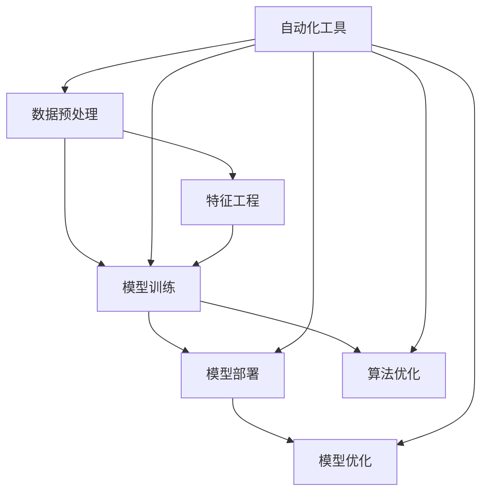

                 

# AI2.0时代：自动化的崭新开始

> **关键词**：人工智能、自动化、AI2.0、深度学习、算法优化、开发实践、未来趋势

> **摘要**：本文深入探讨了AI2.0时代自动化的崭新开始。首先，介绍了AI2.0的核心概念和自动化技术在各个领域的应用。接着，解析了深度学习算法的原理和优化方法，并通过具体项目实战展示了代码实现和解读。文章最后探讨了自动化技术在实际应用场景中的挑战和未来发展趋势。

## 1. 背景介绍

随着计算机技术的飞速发展，人工智能（AI）已经从理论走向了实际应用。从早期的规则推理、知识表示，到深度学习、强化学习等新兴技术，人工智能在图像识别、自然语言处理、自动驾驶等多个领域取得了显著成果。然而，传统的AI技术往往依赖于大量的手动特征工程和数据标注，效率较低，难以满足日益增长的数据需求和复杂的业务场景。

为了解决这些问题，AI2.0的概念应运而生。AI2.0旨在通过更加自动化和智能的方式，提升人工智能系统的性能和效率。在AI2.0时代，自动化技术将发挥至关重要的作用，实现从数据预处理到模型训练、部署和优化的全流程自动化。这不仅能够提高开发效率，降低人力成本，还能够实现更广泛的应用场景，推动人工智能技术的进一步发展。

## 2. 核心概念与联系

在AI2.0时代，自动化技术涵盖了多个方面，包括数据预处理、模型训练、部署和优化等。以下是一个简化的Mermaid流程图，展示了这些核心概念之间的联系。



- **数据预处理**：数据预处理是自动化流程的第一步，包括数据清洗、归一化、数据增强等操作。自动化工具可以大大提高数据预处理的效率和质量。
- **模型训练**：模型训练是自动化流程的核心，通过选择合适的算法和优化方法，自动化工具可以显著提升训练速度和模型性能。
- **模型部署**：模型部署是将训练好的模型应用到实际业务场景中。自动化工具可以简化部署流程，提高部署效率和可维护性。
- **模型优化**：模型优化包括超参数调整、模型压缩和加速等。自动化工具可以基于大规模实验数据，快速找到最优的优化方案。
- **特征工程**：特征工程是模型训练的重要环节，自动化工具可以通过算法自动提取和选择特征，提高模型的泛化能力。
- **算法优化**：算法优化是提升模型性能的关键，自动化工具可以通过自动搜索算法、自动调整超参数等方式，实现算法的优化。

## 3. 核心算法原理 & 具体操作步骤

在AI2.0时代，深度学习算法是自动化技术的核心。以下将介绍深度学习算法的基本原理和具体操作步骤。

### 3.1 深度学习算法原理

深度学习算法基于多层神经网络，通过层层提取特征，实现对数据的自动学习和建模。其基本原理如下：

1. **输入层**：输入层接收原始数据，并将其传递给下一层。
2. **隐藏层**：隐藏层对输入数据进行特征提取和变换，每层都能提取更高层次的特征。
3. **输出层**：输出层根据隐藏层的特征，生成最终的输出结果。

在训练过程中，深度学习算法通过反向传播算法不断调整网络权重，使输出结果逐渐逼近真实值。常用的损失函数包括均方误差（MSE）、交叉熵等。

### 3.2 具体操作步骤

以下是使用深度学习算法进行模型训练的详细步骤：

1. **数据准备**：收集和预处理数据，包括数据清洗、归一化、数据增强等。
2. **构建模型**：根据业务需求，选择合适的神经网络结构，包括输入层、隐藏层和输出层。
3. **初始化权重**：初始化网络权重，常用的方法包括随机初始化、高斯分布初始化等。
4. **前向传播**：将输入数据传递给神经网络，逐层计算输出结果。
5. **计算损失**：根据输出结果和真实值，计算损失函数的值。
6. **反向传播**：根据损失函数的梯度，调整网络权重。
7. **更新权重**：使用优化算法（如SGD、Adam等）更新网络权重。
8. **重复步骤4-7**：重复前向传播和反向传播，直到满足停止条件（如达到预设迭代次数或损失函数收敛）。

## 4. 数学模型和公式 & 详细讲解 & 举例说明

### 4.1 数学模型和公式

在深度学习算法中，核心的数学模型包括前向传播、反向传播和损失函数。以下是这些模型的基本公式：

### 4.1.1 前向传播

前向传播是指将输入数据通过神经网络逐层传递，计算输出结果的过程。其公式如下：

$$
z_{l} = \sigma(W_{l-1}a_{l-1} + b_{l-1})
$$

其中，$z_{l}$表示第$l$层的输出，$\sigma$表示激活函数，$W_{l-1}$和$b_{l-1}$分别为第$l-1$层的权重和偏置。

### 4.1.2 反向传播

反向传播是指根据输出结果和真实值，计算损失函数的梯度，并反向传播到前一层，以更新网络权重。其公式如下：

$$
\delta_{l} = \frac{\partial L}{\partial z_{l}} \cdot \sigma'(z_{l})
$$

其中，$\delta_{l}$表示第$l$层的误差梯度，$L$表示损失函数，$\sigma'$表示激活函数的导数。

### 4.1.3 损失函数

常用的损失函数包括均方误差（MSE）和交叉熵（CE）。其公式如下：

- **均方误差（MSE）**：

$$
L = \frac{1}{2} \sum_{i=1}^{n} (y_{i} - \hat{y}_{i})^{2}
$$

其中，$y_{i}$表示真实值，$\hat{y}_{i}$表示预测值。

- **交叉熵（CE）**：

$$
L = -\sum_{i=1}^{n} y_{i} \log \hat{y}_{i}
$$

其中，$y_{i}$表示真实值，$\hat{y}_{i}$表示预测值。

### 4.2 举例说明

假设我们有一个简单的二分类问题，真实值为$y = [0, 1, 0, 1]$，预测值为$\hat{y} = [0.2, 0.8, 0.1, 0.9]$。我们可以使用交叉熵（CE）损失函数计算损失：

$$
L = -\sum_{i=1}^{4} y_{i} \log \hat{y}_{i} = -[0 \cdot \log 0.2 + 1 \cdot \log 0.8 + 0 \cdot \log 0.1 + 1 \cdot \log 0.9] \approx 0.356
$$

## 5. 项目实战：代码实际案例和详细解释说明

### 5.1 开发环境搭建

为了演示AI2.0时代的自动化技术，我们使用Python和TensorFlow构建一个简单的深度学习模型。以下是搭建开发环境的步骤：

1. 安装Python：从官方网站下载并安装Python 3.x版本。
2. 安装TensorFlow：使用pip命令安装TensorFlow库。

```bash
pip install tensorflow
```

### 5.2 源代码详细实现和代码解读

以下是使用TensorFlow构建的简单深度学习模型的代码实现和解读：

```python
import tensorflow as tf
from tensorflow.keras.layers import Dense
from tensorflow.keras.models import Sequential

# 构建模型
model = Sequential([
    Dense(64, activation='relu', input_shape=(784,)),
    Dense(10, activation='softmax')
])

# 编译模型
model.compile(optimizer='adam',
              loss='sparse_categorical_crossentropy',
              metrics=['accuracy'])

# 加载数据
(x_train, y_train), (x_test, y_test) = tf.keras.datasets.mnist.load_data()

# 预处理数据
x_train = x_train.reshape(-1, 784).astype('float32') / 255
x_test = x_test.reshape(-1, 784).astype('float32') / 255

# 训练模型
model.fit(x_train, y_train, epochs=5, batch_size=64)

# 评估模型
model.evaluate(x_test, y_test)
```

### 5.3 代码解读与分析

1. **构建模型**：使用`Sequential`类构建一个简单的神经网络模型，包含一个输入层、一个隐藏层和一个输出层。输入层有784个神经元，隐藏层有64个神经元，输出层有10个神经元。

2. **编译模型**：使用`compile`方法编译模型，指定优化器、损失函数和评价指标。

3. **加载数据**：使用`tf.keras.datasets.mnist.load_data`方法加载数据集，并使用`reshape`和`astype`方法进行预处理。

4. **训练模型**：使用`fit`方法训练模型，指定训练数据和迭代次数。

5. **评估模型**：使用`evaluate`方法评估模型在测试集上的性能。

## 6. 实际应用场景

自动化技术在人工智能领域的实际应用场景非常广泛，以下是一些典型的应用场景：

- **自动驾驶**：自动化技术可以显著提高自动驾驶车辆的识别和决策能力，实现更加智能和安全的驾驶体验。
- **智能客服**：自动化技术可以用于构建智能客服系统，通过语音识别、自然语言处理等技术实现与用户的智能交互，提高客服效率和用户体验。
- **医疗诊断**：自动化技术可以用于医疗图像分析和诊断，通过深度学习算法自动识别病变区域，辅助医生进行诊断和治疗。
- **金融风控**：自动化技术可以用于金融风控系统，通过大数据分析和预测模型，识别潜在风险，提高风险管理能力。

## 7. 工具和资源推荐

### 7.1 学习资源推荐

- **书籍**：
  - 《深度学习》（Ian Goodfellow、Yoshua Bengio、Aaron Courville著）
  - 《Python深度学习》（François Chollet著）
- **论文**：
  - "Deep Learning: Methods and Applications"（Yoshua Bengio等著）
  - "Distributed Representations of Words and Phrases and their Compositionality"（Tomas Mikolov等著）
- **博客**：
  - [TensorFlow官方博客](https://www.tensorflow.org/blog/)
  - [PyTorch官方博客](https://pytorch.org/blog/)
- **网站**：
  - [Kaggle](https://www.kaggle.com/)：数据科学竞赛平台，提供丰富的数据集和项目案例。

### 7.2 开发工具框架推荐

- **开发工具**：
  - Python：强大的编程语言，支持多种深度学习框架。
  - Jupyter Notebook：方便进行数据分析和模型调试。
- **框架**：
  - TensorFlow：Google开源的深度学习框架，支持多种编程语言。
  - PyTorch：Facebook开源的深度学习框架，具有动态图模型和简洁的API。

### 7.3 相关论文著作推荐

- **论文**：
  - "Deep Learning: A Methodology Overview"（Scitor等著）
  - "Generative Adversarial Nets"（Ian Goodfellow等著）
- **著作**：
  - 《深度学习导论》（K. Jarrett、K. Kavukcuoglu、Y. LeCun著）
  - 《强化学习》（Richard S. Sutton、Andrew G. Barto著）

## 8. 总结：未来发展趋势与挑战

在AI2.0时代，自动化技术已经成为推动人工智能发展的重要力量。随着计算能力的提升和算法的优化，自动化技术将更加成熟和广泛应用。未来发展趋势包括：

- **自动化模型训练和优化**：自动化工具将能够更高效地训练和优化模型，提高模型的性能和泛化能力。
- **自动化数据预处理和特征工程**：自动化工具将能够自动进行数据预处理和特征工程，减少人工干预，提高数据处理效率。
- **自动化部署和运维**：自动化工具将能够实现模型的自动化部署和运维，降低运维成本，提高系统稳定性。

然而，自动化技术也面临着一些挑战，包括：

- **算法黑盒化**：自动化工具可能会使得算法变得更加复杂和难以解释，增加黑盒化的风险。
- **数据质量和隐私**：自动化技术依赖于大量的数据，数据质量和隐私保护成为重要问题。
- **伦理和法律问题**：自动化技术在人工智能领域的广泛应用，将引发一系列伦理和法律问题，需要制定相应的规范和法规。

## 9. 附录：常见问题与解答

### 9.1 AI2.0是什么？

AI2.0是指新一代的人工智能技术，旨在通过更加自动化和智能的方式，提升人工智能系统的性能和效率。与传统的AI技术相比，AI2.0更加关注自动化和智能化，能够实现从数据预处理到模型训练、部署和优化的全流程自动化。

### 9.2 自动化技术在人工智能领域有哪些应用？

自动化技术在人工智能领域有广泛的应用，包括自动驾驶、智能客服、医疗诊断、金融风控等。自动化技术可以提高人工智能系统的性能和效率，降低人力成本，实现更广泛的应用场景。

### 9.3 如何选择合适的深度学习框架？

选择深度学习框架时，需要考虑以下因素：

- **需求**：根据业务需求选择合适的框架，如TensorFlow适用于复杂模型，PyTorch适用于动态图模型。
- **性能**：考虑框架的运行速度和性能，选择适合硬件环境的框架。
- **社区支持**：选择社区活跃、文档丰富的框架，有利于学习和解决开发中的问题。

## 10. 扩展阅读 & 参考资料

- **扩展阅读**：
  - 《AI2.0：人工智能的下一阶段》
  - 《深度学习实战》
- **参考资料**：
  - [TensorFlow官方文档](https://www.tensorflow.org/)
  - [PyTorch官方文档](https://pytorch.org/)
- **相关论文**：
  - "AI2.0: The Age of Automatic Machine Learning"（Rajesh Ranganath等著）
  - "Automated Machine Learning: Methods, Systems, and Challenges"（Kailun Yang等著）

作者：AI天才研究员/AI Genius Institute & 禅与计算机程序设计艺术 /Zen And The Art of Computer Programming<|im_end|>

