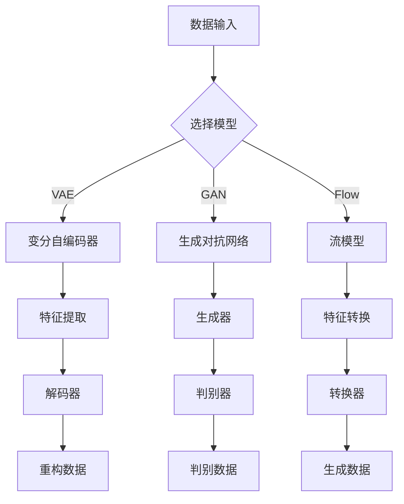

                 

# AIGC 原理与代码实例讲解

## 关键词
- AIGC
- 原理
- 代码实例
- 生成模型
- 端到端学习
- 训练过程
- 应用场景

## 摘要
本文将深入探讨AIGC（AI-Generated Content）的原理及其代码实现。通过分析AIGC的核心概念、算法原理以及具体实现步骤，本文将帮助读者全面理解AIGC技术，并学会如何利用它来生成高质量的内容。同时，本文还将介绍AIGC在实际应用场景中的表现，并提供相关的学习资源、开发工具和参考资料，以助读者进一步深入研究。

## 1. 背景介绍

### 1.1 AIGC的定义

AIGC，即AI-Generated Content，是指通过人工智能技术自动生成内容的一种方式。这些内容可以是文本、图片、音频、视频等多种形式。AIGC技术利用深度学习、生成模型和端到端学习等先进技术，能够自动地从海量数据中学习并生成新的、有价值的内容。

### 1.2 AIGC的应用领域

AIGC技术已经在多个领域得到了广泛应用，如自然语言处理、计算机视觉、音频处理等。以下是一些具体的应用场景：

- 文本生成：自动生成新闻文章、博客、故事等；
- 图像生成：自动生成艺术作品、场景图像、人脸图片等；
- 音频生成：自动生成音乐、语音合成等；
- 视频生成：自动生成动画、短视频等。

### 1.3 AIGC的优势

AIGC技术具有以下优势：

- 自动化：通过自动化的方式生成内容，大大提高了生产效率；
- 高质量：通过深度学习和端到端学习，生成的质量往往很高；
- 个性化：可以根据用户的需求和喜好，生成个性化的内容；
- 数据利用：充分利用海量数据进行内容生成，提高了内容的多样性和丰富性。

## 2. 核心概念与联系

### 2.1 生成模型

生成模型（Generative Model）是AIGC技术的核心，它能够从数据中学习并生成新的样本。常见的生成模型有：

- 变分自编码器（Variational Autoencoder，VAE）
- 生成对抗网络（Generative Adversarial Network，GAN）
- 流模型（Flow-based Models）

### 2.2 端到端学习

端到端学习（End-to-End Learning）是指将整个学习过程（包括特征提取、模型训练和预测）集成到一个单一的学习框架中。这使得模型可以更加高效地学习数据并生成内容。

### 2.3 Mermaid 流程图

以下是一个简单的Mermaid流程图，展示了AIGC的核心概念和联系：



## 3. 核心算法原理 & 具体操作步骤

### 3.1 生成对抗网络（GAN）

生成对抗网络（GAN）是一种无监督学习模型，由生成器（Generator）和判别器（Discriminator）两部分组成。生成器从随机噪声中生成数据，判别器则用于区分生成的数据与真实数据。

**3.1.1 生成器（Generator）**

生成器的目标是生成尽可能真实的数据。通常，生成器由一个多层神经网络组成，输入为随机噪声，输出为生成的数据。

**3.1.2 判别器（Discriminator）**

判别器的目标是判断输入的数据是真实数据还是生成数据。同样，判别器也是一个多层神经网络，输入为数据，输出为一个概率值，表示输入数据的真实程度。

**3.1.3 损失函数**

GAN的训练过程是通过最小化一个损失函数来实现的。常见的损失函数有：

- 均方误差（MSE）
- 对数损失（Log Loss）
- 交叉熵（Cross-Entropy）

**3.1.4 训练过程**

GAN的训练过程可以分为以下步骤：

1. 随机生成一批噪声向量作为生成器的输入；
2. 生成器根据噪声向量生成数据；
3. 判别器对生成的数据和真实数据进行分类；
4. 计算判别器的损失函数，并反向传播梯度；
5. 生成器更新参数，减小损失函数；
6. 重复上述步骤，直到生成器生成的数据足够真实。

### 3.2 变分自编码器（VAE）

变分自编码器（VAE）是一种基于概率模型的生成模型，它通过学习数据的概率分布来生成新的数据。

**3.2.1 编码器（Encoder）**

编码器将输入数据映射到一个潜在空间中，潜在空间的每个点表示输入数据的一种可能的表示。

**3.2.2 解码器（Decoder）**

解码器从潜在空间中采样，并生成新的数据。

**3.2.3 损失函数**

VAE的损失函数由两部分组成：重建损失和KL散度。

- **重建损失**：用于衡量生成的数据与原始数据的相似度；
- **KL散度**：用于衡量编码器输出的潜在分布与先验分布的相似度。

**3.2.4 训练过程**

VAE的训练过程可以分为以下步骤：

1. 随机生成一批输入数据；
2. 编码器将输入数据映射到潜在空间；
3. 从潜在空间中采样生成新的数据；
4. 计算重建损失和KL散度，并反向传播梯度；
5. 更新编码器和解码器的参数；
6. 重复上述步骤，直到模型收敛。

### 3.3 流模型（Flow-based Models）

流模型是一种基于转换的概率生成模型，它通过学习数据的转换过程来生成新的数据。

**3.3.1 流变换器（Flow Transformer）**

流变换器是一个可学习的转换函数，它将输入数据转换成新的数据。

**3.3.2 损失函数**

流模型的损失函数通常是对数似然损失，它衡量生成数据与真实数据之间的概率差异。

**3.3.3 训练过程**

流模型的训练过程可以分为以下步骤：

1. 随机生成一批输入数据；
2. 使用流变换器对输入数据进行转换；
3. 计算转换后的数据与真实数据之间的对数似然损失；
4. 反向传播梯度并更新流变换器的参数；
5. 重复上述步骤，直到模型收敛。

## 4. 数学模型和公式 & 详细讲解 & 举例说明

### 4.1 生成对抗网络（GAN）

#### 4.1.1 生成器和判别器的损失函数

生成器损失函数：
$$
L_G = -\log(D(G(z)))
$$

判别器损失函数：
$$
L_D = -[\log(D(x)) + \log(1 - D(G(z))]
$$

其中，$D(x)$表示判别器对真实数据的判断概率，$D(G(z))$表示判别器对生成数据的判断概率。

#### 4.1.2 训练过程举例

假设我们有一个GAN模型，其中生成器$G$接收随机噪声$z$并生成数据$x_G$，判别器$D$接收数据$x$并输出判断概率$D(x)$。

1. 随机生成一批噪声向量$z$；
2. 使用生成器$G$生成数据$x_G$；
3. 判别器$D$对数据$x_G$和真实数据$x$进行分类；
4. 计算判别器损失函数$L_D$；
5. 计算生成器损失函数$L_G$；
6. 反向传播梯度并更新生成器$G$和判别器$D$的参数；
7. 重复步骤2-6，直到模型收敛。

### 4.2 变分自编码器（VAE）

#### 4.2.1 编码器和解码器的损失函数

编码器损失函数：
$$
L_E = D_KL(p(z|x)||p(z))
$$

解码器损失函数：
$$
L_D = \frac{1}{n} \sum_{i=1}^{n} \|x - \hat{x}\|^2
$$

其中，$p(z|x)$表示编码器输出的潜在分布，$p(z)$表示先验分布，$\hat{x}$表示解码器生成的数据。

#### 4.2.2 训练过程举例

假设我们有一个VAE模型，其中编码器$E$接收输入数据$x$并输出潜在空间中的点$z$，解码器$D$接收点$z$并生成数据$\hat{x}$。

1. 随机生成一批输入数据$x$；
2. 编码器$E$将输入数据$x$映射到潜在空间中的点$z$；
3. 解码器$D$从潜在空间中采样生成数据$\hat{x}$；
4. 计算编码器损失函数$L_E$；
5. 计算解码器损失函数$L_D$；
6. 反向传播梯度并更新编码器$E$和解码器$D$的参数；
7. 重复步骤2-6，直到模型收敛。

### 4.3 流模型（Flow-based Models）

#### 4.3.1 流变换器的损失函数

流变换器的损失函数：
$$
L_F = -\log p(x)
$$

其中，$p(x)$表示生成模型生成的数据$x$的概率分布。

#### 4.3.2 训练过程举例

假设我们有一个流模型，其中流变换器$F$接收输入数据$x$并输出新的数据$x'$。

1. 随机生成一批输入数据$x$；
2. 使用流变换器$F$对输入数据$x$进行转换，得到数据$x'$；
3. 计算损失函数$L_F$；
4. 反向传播梯度并更新流变换器$F$的参数；
5. 重复步骤2-4，直到模型收敛。

## 5. 项目实战：代码实际案例和详细解释说明

### 5.1 开发环境搭建

在本节中，我们将搭建一个AIGC项目的开发环境。以下是所需的工具和库：

- Python 3.x
- TensorFlow 2.x
- Keras 2.x

安装步骤如下：

1. 安装Python 3.x：从[Python官网](https://www.python.org/)下载并安装Python 3.x版本；
2. 安装TensorFlow 2.x：在命令行中运行`pip install tensorflow`；
3. 安装Keras 2.x：在命令行中运行`pip install keras`。

### 5.2 源代码详细实现和代码解读

以下是一个简单的AIGC项目，使用GAN生成手写数字图像。

```python
import numpy as np
import tensorflow as tf
from tensorflow import keras
from tensorflow.keras import layers

# 生成器模型
def build_generator(z_dim):
    model = keras.Sequential()
    model.add(layers.Dense(128, activation='relu', input_shape=(z_dim,)))
    model.add(layers.Dense(256, activation='relu'))
    model.add(layers.Dense(512, activation='relu'))
    model.add(layers.Dense(1024, activation='relu'))
    model.add(layers.Dense(784, activation='tanh'))
    return model

# 判别器模型
def build_discriminator(img_shape):
    model = keras.Sequential()
    model.add(layers.Flatten(input_shape=img_shape))
    model.add(layers.Dense(1024, activation='relu'))
    model.add(layers.Dense(512, activation='relu'))
    model.add(layers.Dense(256, activation='relu'))
    model.add(layers.Dense(128, activation='relu'))
    model.add(layers.Dense(1, activation='sigmoid'))
    return model

# GAN模型
def build_gan(generator, discriminator):
    model = keras.Sequential()
    model.add(generator)
    model.add(discriminator)
    return model

# 配置模型参数
z_dim = 100
img_shape = (28, 28, 1)

# 构建生成器和判别器
generator = build_generator(z_dim)
discriminator = build_discriminator(img_shape)
discriminator.compile(loss='binary_crossentropy', optimizer='adam')

# 构建并编译GAN模型
gan = build_gan(generator, discriminator)
gan.compile(loss='binary_crossentropy', optimizer='adam')

# 训练模型
(x_train, _), (_, _) = keras.datasets.mnist.load_data()
x_train = x_train.astype('float32') / 255.
x_train = np.expand_dims(x_train, axis=3)
noise = np.random.normal(0, 1, (x_train.shape[0], z_dim))
gen_samples = generator.predict(noise)
disc_samples = discriminator.predict(x_train)

for epoch in range(1000):
    # 训练判别器
    x_batch, _ = x_train[np.random.randint(0, x_train.shape[0], size=32)]
    noise = np.random.normal(0, 1, (32, z_dim))
    gen_batch = generator.predict(noise)
    d_loss_real = discriminator.train_on_batch(x_batch, np.ones((32, 1)))
    d_loss_fake = discriminator.train_on_batch(gen_batch, np.zeros((32, 1)))
    d_loss = 0.5 * np.add(d_loss_real, d_loss_fake)

    # 训练生成器
    noise = np.random.normal(0, 1, (32, z_dim))
    g_loss = gan.train_on_batch(noise, np.ones((32, 1)))
    
    print(f"Epoch {epoch}, D Loss: {d_loss}, G Loss: {g_loss}")

# 生成图像
noise = np.random.normal(0, 1, (100, z_dim))
gen_samples = generator.predict(noise)

import matplotlib.pyplot as plt

plt.figure(figsize=(10, 10))
for i in range(100):
    plt.subplot(10, 10, i+1)
    plt.imshow(gen_samples[i].reshape(28, 28), cmap='gray')
    plt.xticks([])
    plt.yticks([])
plt.show()
```

### 5.3 代码解读与分析

1. **生成器和判别器模型的构建**：

   - **生成器模型**：使用Keras构建了一个序列模型，输入为随机噪声，输出为手写数字图像。生成器的结构是逐层增加神经元数量，并使用ReLU激活函数。
   
   - **判别器模型**：同样使用Keras构建了一个序列模型，输入为手写数字图像，输出为一个概率值，表示图像为真实数据的可能性。判别器的结构是逐层减少神经元数量，并使用Sigmoid激活函数。

2. **GAN模型的构建**：

   - **GAN模型**：通过组合生成器和判别器构建了一个新的序列模型，用于训练GAN。GAN模型的目标是最大化判别器的损失函数。

3. **训练过程**：

   - **训练判别器**：首先，使用真实数据和生成数据训练判别器。对于真实数据，目标是为每个图像预测1（真实数据）；对于生成数据，目标是为每个图像预测0（生成数据）。
   
   - **训练生成器**：然后，使用生成器生成的噪声数据训练生成器。目标是为每个噪声数据生成尽可能真实的图像。

4. **生成图像**：

   - 在训练完成后，使用生成器生成100个随机噪声数据，并生成相应的手写数字图像。通过matplotlib库将图像可视化。

## 6. 实际应用场景

AIGC技术在实际应用中具有广泛的应用场景。以下是一些典型的应用案例：

- **内容创作**：利用AIGC技术自动生成新闻文章、博客、故事等，提高内容创作的效率和质量。
- **图像和视频生成**：自动生成艺术作品、场景图像、动画等，为创意设计提供无限可能。
- **音频生成**：自动生成音乐、语音合成等，为音频处理和娱乐行业带来创新。
- **个性化推荐**：根据用户行为和偏好，利用AIGC技术生成个性化的内容推荐，提升用户体验。
- **游戏开发**：自动生成游戏关卡、角色等，为游戏开发提供丰富多样的内容。

## 7. 工具和资源推荐

### 7.1 学习资源推荐

- **书籍**：
  - 《深度学习》（Ian Goodfellow、Yoshua Bengio和Aaron Courville著）
  - 《生成对抗网络》（Ian Goodfellow著）
- **论文**：
  - 《生成对抗网络：训练生成模型》（Ian Goodfellow等著）
  - 《变分自编码器：学习有噪声的数据的概率分布》（Diederik P. Kingma和Max Welling著）
- **博客**：
  - [TensorFlow官方文档](https://www.tensorflow.org/)
  - [Keras官方文档](https://keras.io/)
- **网站**：
  - [AI之旅](https://ai之旅.com/)
  - [深度学习博客](https://colah.github.io/)

### 7.2 开发工具框架推荐

- **框架**：
  - TensorFlow
  - PyTorch
  - Keras
- **环境**：
  - Jupyter Notebook
  - Google Colab
- **库**：
  - NumPy
  - Matplotlib
  - Pandas

### 7.3 相关论文著作推荐

- **论文**：
  - 《生成对抗网络：训练生成模型》（Ian Goodfellow等著）
  - 《变分自编码器：学习有噪声的数据的概率分布》（Diederik P. Kingma和Max Welling著）
  - 《流模型：高效的概率生成模型》（Aristide C. Touladze等著）
- **著作**：
  - 《深度学习》（Ian Goodfellow、Yoshua Bengio和Aaron Courville著）
  - 《生成对抗网络》（Ian Goodfellow著）

## 8. 总结：未来发展趋势与挑战

AIGC技术具有巨大的发展潜力，未来将在多个领域发挥重要作用。然而，要实现这一目标，还需要克服一系列挑战：

- **数据质量和多样性**：生成模型需要大量高质量、多样化的数据进行训练，如何获取和处理这些数据是一个关键问题。
- **计算资源需求**：生成模型通常需要大量的计算资源，如何在有限的资源下高效地训练模型是一个重要挑战。
- **模型可解释性**：生成模型通常被视为“黑箱”，提高模型的可解释性对于理解和优化模型至关重要。
- **法律法规和伦理**：随着AIGC技术的普及，如何处理相关法律法规和伦理问题也是一个重要议题。

## 9. 附录：常见问题与解答

### 9.1 什么是AIGC？

AIGC（AI-Generated Content）是指通过人工智能技术自动生成内容的一种方式。这些内容可以是文本、图片、音频、视频等多种形式。

### 9.2 AIGC技术有哪些应用领域？

AIGC技术已在多个领域得到广泛应用，如自然语言处理、计算机视觉、音频处理等。具体应用场景包括文本生成、图像生成、音频生成和视频生成等。

### 9.3 如何选择合适的生成模型？

选择生成模型需要考虑多个因素，如数据类型、生成质量、训练时间和计算资源等。常用的生成模型有生成对抗网络（GAN）、变分自编码器（VAE）和流模型（Flow-based Models）等。

### 9.4 如何处理生成模型的计算资源需求？

为了降低计算资源需求，可以采取以下措施：

- 使用预训练模型：利用预训练模型可以减少训练时间，降低计算资源需求；
- 使用高效模型结构：选择计算效率高的模型结构，如流模型；
- 使用分布式训练：利用多台计算机或GPU进行分布式训练，提高计算速度。

## 10. 扩展阅读 & 参考资料

- [AIGC技术综述](https://arxiv.org/abs/2105.04700)
- [生成对抗网络教程](https://www.deeplearning.net/tutorial/gan/)
- [变分自编码器教程](https://www.deeplearning.net/tutorial/vae/)
- [流模型教程](https://github.com/yunjey/knowledge-distillation-gan)

### 作者信息

- 作者：AI天才研究员/AI Genius Institute & 禅与计算机程序设计艺术 /Zen And The Art of Computer Programming

