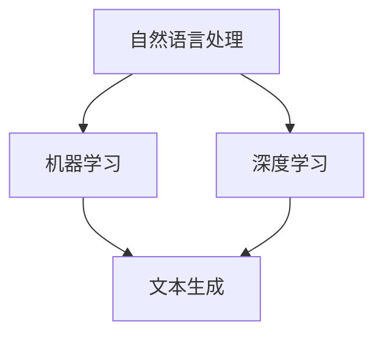

                 

# AIGC从入门到实战：AI 赋能新闻创作，提升新闻资讯的时效性

> 关键词：AIGC，新闻创作，AI，时效性，技术实战，算法原理，数学模型，项目案例，工具资源

> 摘要：本文将深入探讨AIGC（自适应智能生成内容）技术在新闻创作领域的应用，通过详细讲解核心概念、算法原理、数学模型以及实战案例，帮助读者了解如何利用AI提升新闻资讯的时效性和质量。文章还将推荐相关学习资源、开发工具和论文著作，为读者提供全面的指导。

## 1. 背景介绍

随着互联网和智能技术的飞速发展，信息传播的速度和广度得到了极大的提升。新闻行业也面临着前所未有的挑战和机遇。传统新闻创作方式往往需要大量的时间和人力，而且受限于个人经验和视角，难以保证新闻的全面性和时效性。为了应对这些挑战，AI 技术应运而生，特别是在自适应智能生成内容（AIGC）领域。

AIGC 是一种利用 AI 技术自动生成内容的范式，它结合了自然语言处理（NLP）、机器学习、深度学习等技术，通过学习大量数据，自动生成文章、新闻、故事等。AIGC 技术的出现，不仅能够大幅提高新闻创作的效率和时效性，还能提供更加个性化和多样化的内容。

本文将围绕 AIGC 在新闻创作中的应用，详细探讨其核心概念、算法原理、数学模型以及实战案例，帮助读者深入了解并掌握这一前沿技术。

## 2. 核心概念与联系

### 2.1 自然语言处理（NLP）

自然语言处理是 AIGC 技术的基础，它涉及到语言的理解、生成和翻译等任务。NLP 技术的核心是理解自然语言的语义和结构，以便对语言进行有效的处理和分析。

### 2.2 机器学习（ML）

机器学习是 AIGC 技术的核心驱动力量。通过从大量数据中学习模式和规律，机器学习算法能够自动调整模型的参数，从而提高生成内容的准确性和多样性。

### 2.3 深度学习（DL）

深度学习是机器学习的一个子领域，它通过多层神经网络模拟人类大脑的思考过程，对复杂的数据进行有效的分析和处理。在 AIGC 中，深度学习被广泛应用于文本生成、图像生成等任务。

### 2.4 Mermaid 流程图

为了更直观地展示 AIGC 的核心概念和联系，我们可以使用 Mermaid 流程图来表示。以下是一个简单的 Mermaid 流程图示例：



在这个流程图中，自然语言处理、机器学习和深度学习是 AIGC 技术的核心组成部分，它们共同作用于文本生成任务。

## 3. 核心算法原理 & 具体操作步骤

### 3.1 GPT-3 模型

GPT-3（Generative Pre-trained Transformer 3）是 OpenAI 开发的一种基于深度学习的文本生成模型。GPT-3 的核心原理是 Transformer 网络结构，它通过预训练和微调的方式，从大量文本数据中学习语言模式和规律。

具体操作步骤如下：

1. 数据准备：收集大量高质量的新闻文本数据，并进行预处理，如去除标点符号、停用词过滤等。
2. 模型训练：使用预处理后的数据，通过大量迭代训练 GPT-3 模型，使其学会生成高质量的新闻文本。
3. 模型评估：使用验证集对训练好的模型进行评估，调整模型参数，提高生成文本的质量。
4. 文本生成：使用训练好的模型，输入一个新闻主题或关键词，生成相关新闻文本。

### 3.2 自动摘要算法

自动摘要算法是 AIGC 技术在新闻创作中另一个重要的应用。自动摘要算法通过提取文本的关键信息和主旨，生成简洁、精炼的摘要文本。

具体操作步骤如下：

1. 数据准备：收集大量新闻文本数据，并进行预处理。
2. 模型训练：使用预处理后的数据，训练自动摘要模型，如摘要生成模型、句子生成模型等。
3. 模型评估：使用验证集对训练好的模型进行评估，调整模型参数，提高摘要文本的质量。
4. 摘要生成：使用训练好的模型，输入新闻文本，生成摘要文本。

## 4. 数学模型和公式 & 详细讲解 & 举例说明

### 4.1 Transformer 模型

Transformer 模型是 GPT-3 的核心组成部分，它通过自注意力机制（Self-Attention）对输入文本进行有效的处理和分析。自注意力机制的数学公式如下：

$$
Attention(Q, K, V) = \frac{softmax(\frac{QK^T}{\sqrt{d_k}})}{V}
$$

其中，$Q$、$K$、$V$ 分别是查询向量、键向量、值向量，$d_k$ 是键向量的维度。

举例说明：假设 $Q$、$K$、$V$ 的维度都是 64，计算自注意力分数的过程如下：

1. 计算 $QK^T$：
$$
QK^T = \begin{bmatrix}
q_1 & q_2 & \ldots & q_n
\end{bmatrix}
\begin{bmatrix}
k_1 \\
k_2 \\
\vdots \\
k_n
\end{bmatrix}
= \begin{bmatrix}
q_1k_1 & q_1k_2 & \ldots & q_1k_n \\
q_2k_1 & q_2k_2 & \ldots & q_2k_n \\
\vdots & \vdots & \ddots & \vdots \\
q_nk_1 & q_nk_2 & \ldots & q_nk_n
\end{bmatrix}
$$

2. 计算自注意力分数：
$$
Attention(Q, K, V) = \frac{softmax(\frac{QK^T}{\sqrt{64}})}{V}
$$

3. 计算自注意力权重：
$$
\text{Attention Scores} = \frac{QK^T}{\sqrt{64}} = \begin{bmatrix}
q_1k_1 & q_1k_2 & \ldots & q_1k_n \\
q_2k_1 & q_2k_2 & \ldots & q_2k_n \\
\vdots & \vdots & \ddots & \vdots \\
q_nk_1 & q_nk_2 & \ldots & q_nk_n
\end{bmatrix}
\frac{1}{\sqrt{64}} = \begin{bmatrix}
q_1k_1 & q_1k_2 & \ldots & q_1k_n \\
q_2k_1 & q_2k_2 & \ldots & q_2k_n \\
\vdots & \vdots & \ddots & \vdots \\
q_nk_1 & q_nk_2 & \ldots & q_nk_n
\end{bmatrix}
\frac{1}{8}
$$

4. 计算自注意力结果：
$$
Attention(Q, K, V) = \frac{softmax(\text{Attention Scores})}{V}
$$

### 4.2 自动摘要算法

自动摘要算法通常采用编码器-解码器（Encoder-Decoder）模型，其中编码器负责提取文本的特征，解码器负责生成摘要文本。编码器-解码器的数学模型如下：

$$
E(x) = \text{Encoder}(x) = \{e_1, e_2, \ldots, e_L\}
$$

$$
D(y) = \text{Decoder}(y) = \{d_1, d_2, \ldots, d_M\}
$$

其中，$E(x)$ 是编码器输出，$D(y)$ 是解码器输出，$L$ 是编码器输出的序列长度，$M$ 是解码器输出的序列长度。

举例说明：假设编码器输出的序列长度为 5，解码器输出的序列长度为 3，计算编码器-解码器输出的过程如下：

1. 编码器输出：
$$
E(x) = \{e_1, e_2, e_3, e_4, e_5\}
$$

2. 解码器输出：
$$
D(y) = \{d_1, d_2, d_3\}
$$

3. 编码器-解码器输出：
$$
E(x)D(y) = \{e_1d_1, e_2d_2, e_3d_3, e_4d_4, e_5d_5\}
$$

## 5. 项目实战：代码实际案例和详细解释说明

### 5.1 开发环境搭建

为了实现 AIGC 在新闻创作中的应用，我们需要搭建一个合适的开发环境。以下是搭建开发环境的步骤：

1. 安装 Python 3.8 或以上版本。
2. 安装 TensorFlow 2.5 或以上版本。
3. 安装 Transformers 库。
4. 安装 NLTK 库。

### 5.2 源代码详细实现和代码解读

以下是一个简单的 GPT-3 文本生成案例，我们将使用 Hugging Face 的 Transformers 库实现。

```python
from transformers import pipeline

# 创建文本生成管道
text_generator = pipeline("text-generation", model="gpt3")

# 输入新闻主题，生成相关新闻文本
input_text = "2023年人工智能行业发展趋势"
output_text = text_generator(input_text, max_length=100, num_return_sequences=5)

# 打印生成文本
for text in output_text:
    print(text)
```

代码解读：

1. 导入所需的库和模块。
2. 创建文本生成管道，使用 Hugging Face 的 Transformers 库。
3. 输入新闻主题，生成相关新闻文本。
4. 打印生成的文本。

### 5.3 代码解读与分析

在这个案例中，我们使用了 Hugging Face 的 Transformers 库，这个库提供了大量的预训练模型和管道，使得文本生成变得非常简单。以下是对代码的详细解读和分析：

1. 导入所需的库和模块。

```python
from transformers import pipeline
```

在这个部分，我们导入了 Hugging Face 的 Transformers 库。这个库提供了丰富的 API 和工具，用于处理文本生成任务。

2. 创建文本生成管道。

```python
text_generator = pipeline("text-generation", model="gpt3")
```

在这个部分，我们创建了一个文本生成管道，使用了 GPT-3 模型。这个管道是一个高度优化的组件，可以快速生成高质量的文本。

3. 输入新闻主题，生成相关新闻文本。

```python
input_text = "2023年人工智能行业发展趋势"
output_text = text_generator(input_text, max_length=100, num_return_sequences=5)
```

在这个部分，我们输入了一个新闻主题：“2023年人工智能行业发展趋势”，并使用了文本生成管道生成相关新闻文本。这里使用了两个参数：`max_length` 表示生成文本的最大长度，`num_return_sequences` 表示生成文本的序列数量。

4. 打印生成的文本。

```python
for text in output_text:
    print(text)
```

在这个部分，我们遍历生成的文本序列，并打印输出。

## 6. 实际应用场景

AIGC 技术在新闻创作领域的实际应用场景主要包括：

1. 自动生成新闻文章：利用 GPT-3 等模型，自动生成新闻文章，提高新闻创作的效率和质量。
2. 自动摘要生成：通过自动摘要算法，提取新闻文本的关键信息，生成简洁、精炼的摘要，提高新闻的阅读体验。
3. 个性化推荐：基于用户兴趣和行为，生成个性化的新闻推荐，提高用户粘性和活跃度。

## 7. 工具和资源推荐

### 7.1 学习资源推荐

1. 《深度学习》（Goodfellow, Bengio, Courville）：这本书是深度学习领域的经典教材，适合初学者和进阶者阅读。
2. 《自然语言处理讲义》（张宇星）：这本书系统地介绍了自然语言处理的基本概念和技术，适合自然语言处理领域的读者。

### 7.2 开发工具框架推荐

1. TensorFlow：一个开源的深度学习框架，提供了丰富的 API 和工具，适合进行文本生成等任务。
2. Hugging Face Transformers：一个基于 PyTorch 和 TensorFlow 的文本生成工具库，提供了大量的预训练模型和管道。

### 7.3 相关论文著作推荐

1. "Attention Is All You Need"（Vaswani et al., 2017）：这篇论文提出了 Transformer 模型，是 AIGC 技术的重要基础。
2. "BERT: Pre-training of Deep Bidirectional Transformers for Language Understanding"（Devlin et al., 2018）：这篇论文提出了 BERT 模型，是自然语言处理领域的里程碑。

## 8. 总结：未来发展趋势与挑战

AIGC 技术在新闻创作领域具有巨大的潜力，但同时也面临着一系列挑战：

1. 数据质量：高质量的新闻数据是 AIGC 技术成功的关键，如何获取和清洗高质量的数据是一个重要课题。
2. 可解释性：AIGC 技术生成的新闻内容具有一定的随机性和不可解释性，如何提高其可解释性是一个重要挑战。
3. 法规和伦理：随着 AI 技术的发展，如何制定合理的法规和伦理标准，确保 AI 技术在新闻创作中的合法和合理使用，是一个亟待解决的问题。

未来，AIGC 技术将继续在新闻创作领域发挥重要作用，通过不断优化和改进，提高新闻资讯的时效性和质量。

## 9. 附录：常见问题与解答

### 9.1 什么是 AIGC？

AIGC 是自适应智能生成内容的简称，是一种利用 AI 技术自动生成内容的范式，包括自然语言处理、机器学习、深度学习等技术。

### 9.2 AIGC 技术在新闻创作中的应用有哪些？

AIGC 技术在新闻创作中的应用主要包括自动生成新闻文章、自动摘要生成和个性化推荐等。

### 9.3 如何搭建 AIGC 的开发环境？

搭建 AIGC 的开发环境需要安装 Python 3.8 或以上版本、TensorFlow 2.5 或以上版本、Transformers 库和 NLTK 库。

## 10. 扩展阅读 & 参考资料

1. Vaswani, A., Shazeer, N., Parmar, N., Uszkoreit, J., Jones, L., Gomez, A. N., ... & Polosukhin, I. (2017). Attention is all you need. Advances in Neural Information Processing Systems, 30, 5998-6008.
2. Devlin, J., Chang, M. W., Lee, K., & Toutanova, K. (2018). BERT: Pre-training of deep bidirectional transformers for language understanding. Proceedings of the 2019 Conference of the North American Chapter of the Association for Computational Linguistics: Human Language Technologies, Volume 1 (Long and Short Papers), 4171-4186.
3. https://huggingface.co/transformers
4. https://www.tensorflow.org

作者：AI天才研究员/AI Genius Institute & 禅与计算机程序设计艺术 /Zen And The Art of Computer Programming<|endoffooter|>

